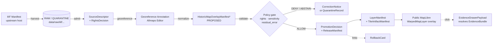

<!-- [KFM_META_BLOCK_V2]
doc_id: kfm://doc/standards-iiif
title: IIIF — KFM Conformance Profile
type: standard
version: v1
status: draft
owners: [TODO: docs/standards CODEOWNERS]
created: 2026-05-14
updated: 2026-05-14
policy_label: public
related: [
  docs/standards/stac.md,
  docs/standards/dcat.md,
  docs/standards/prov.md,
  docs/doctrine/truth-posture.md,
  docs/doctrine/trust-membrane.md,
  contracts/source/source-descriptor.md,
  contracts/release/release-manifest.md
]
tags: [kfm, standards, iiif, allmaps, historic-maps, rights, georeference]
notes: [
  Doc placement docs/standards/iiif.md per Directory Rules §6.1.,
  Historic-map overlay objects PROPOSED; no mounted repo verification this session.,
  Allmaps WarpedMapLayer requires plugin allowlist before public release.
]
[/KFM_META_BLOCK_V2] -->

# IIIF — KFM Conformance Profile

*How the Kansas Frontier Matrix consumes IIIF resources — and the governed envelope that has to surround them before anything reaches a public map.*


> **Status:** draft · **Owners:** TODO — `docs/standards` CODEOWNERS · **Last reviewed:** 2026-05-14

> [!IMPORTANT]
> IIIF resources are **upstream context**, not KFM truth. A IIIF manifest, an Allmaps Georeference Annotation, and a rendered `WarpedMapLayer` are all **interpretive carriers**. They do not establish geometry, rights, or release authority. Every consequential claim still resolves `EvidenceRef → EvidenceBundle` and passes the KFM gates before reaching a public surface.

---

## Quick jump

- [1 · Scope](#1--scope)
- [2 · KFM posture toward IIIF](#2--kfm-posture-toward-iiif)
- [3 · Conformance matrix](#3--conformance-matrix)
- [4 · Georeference Extension and Allmaps](#4--georeference-extension-and-allmaps)
- [5 · Lifecycle: IIIF manifest → governed overlay](#5--lifecycle-iiif-manifest--governed-overlay)
- [6 · KFM object bindings](#6--kfm-object-bindings)
- [7 · Rights handling](#7--rights-handling)
- [8 · Validation tests](#8--validation-tests)
- [9 · Anti-patterns](#9--anti-patterns)
- [10 · Open questions / NEEDS VERIFICATION](#10--open-questions--needs-verification)
- [11 · Related docs](#11--related-docs)
- [Appendix A · IIIF version notes](#appendix-a--iiif-version-notes)
- [Appendix B · References](#appendix-b--references)

---

## 1 · Scope

**In scope.** How KFM *consumes* IIIF resources — Image API responses, Presentation API manifests, and the Georeference Extension produced via tools like Allmaps — and how those external objects are wrapped in KFM doctrine before any public exposure.

**Out of scope.** Standing up a IIIF Image API server, hosting `info.json` endpoints, or republishing third-party IIIF assets. KFM is downstream of cultural-heritage IIIF providers; it is **not** a IIIF publisher in the v1 plan.

| Area | In / Out |
|---|---|
| Reading IIIF Image API responses | **In** |
| Reading IIIF Presentation API manifests | **In** |
| Reading Georeference Annotations (Allmaps) | **In** |
| Rendering historic-map overlays through `MapLibre` via a plugin | **In, governed** |
| Rehosting IIIF images on KFM infrastructure | **Out** |
| Standing up a IIIF Image API server | **Out** |
| Treating an overlay as authoritative geometry | **Anti-pattern (§9)** |

> [!NOTE]
> If KFM ever needs to *publish* IIIF (e.g., expose scanned plats or aerials as Image API v3 endpoints), that adds publisher obligations not covered here and requires an ADR.

[Back to top](#iiif--kfm-conformance-profile)

---

## 2 · KFM posture toward IIIF

KFM's posture is doctrinal first, technical second:

- **Cite-or-abstain.** IIIF metadata never substitutes for an `EvidenceBundle`. Every map-popup or Focus Mode statement that depends on a IIIF asset resolves `EvidenceRef → EvidenceBundle` first, with citations validated downstream.
- **Renderer is not authority.** A warped historic map painted on the `MapLibre` canvas is a **derived visual carrier**, not a source-of-truth boundary, parcel, or feature. The Pass 18 idea-card record states this directly: PROPOSED — *"KFM should treat historic-map overlays from IIIF/Allmaps or similar systems as interpretive georeferenced artifacts requiring source rights, control points, and uncertainty metadata."*
- **Lifecycle still applies.** External IIIF assets do not skip `RAW → WORK/QUARANTINE → PROCESSED → CATALOG/TRIPLET → PUBLISHED`. Catalog state, rights review, sensitivity check, and promotion gates apply before any layer becomes publicly reachable.
- **Trust membrane.** The public UI consumes governed APIs and released artifacts only. A IIIF tile URL that has not been catalogued, rights-cleared, and released **must not** appear in a public `LayerManifest`.

> [!CAUTION]
> A IIIF `rights` URI is a **claim from the upstream provider**. It informs the KFM rights review; it does not replace it. Where the upstream rights status is missing, ambiguous, or in conflict with KFM policy, the gate is **DENY** or **ABSTAIN** until a `RightsDecision` is recorded.

[Back to top](#iiif--kfm-conformance-profile)

---

## 3 · Conformance matrix

The current IIIF specification family. KFM targets **v3** for any new integration.

| Specification | Current version | Status at IIIF | KFM target | Notes |
|---|---|---|---|---|
| IIIF Image API | 3.0  **EXTERNAL** | Final (2020) | v3 (consume) | License property renamed to `rights`, constrained to Creative Commons / RightsStatements.org URIs or registered extensions.  **EXTERNAL** |
| IIIF Presentation API | 3.0  **EXTERNAL** | Final (2020) | v3 (consume) | Adds duration to the canvas model so audio and moving images can be presented and annotated alongside still images.  **EXTERNAL** |
| Georeference Extension | Published May 2023, building on the Presentation API 3.0  **EXTERNAL** | Approved extension | v3 (consume) | Required for Allmaps interoperability — see §4. |
| Older Image / Presentation v2.x | Legacy | Retained for reference | Read-only fallback | Current IIIF specifications should be used for all new work; older versions are retained for reference only.  **EXTERNAL** |

**KFM conformance posture:**

| KFM concern | Conformance posture |
|---|---|
| Image API requests | Use canonical URI form; do **not** rehost without explicit upstream permission. |
| Presentation API parsing | Read `rights`, `requiredStatement`, `provider`, `homepage`, `metadata`, `partOf` into the `SourceDescriptor`. |
| `@context` handling | Accept v2 and v3 contexts; normalize internally to v3 shape during PROCESSED. **PROPOSED**. |
| Validation | Validate against the live IIIF JSON-LD context before catalog admission. **PROPOSED**. |
| Republication | **DENY by default.** Re-derivation requires upstream license review. |

[Back to top](#iiif--kfm-conformance-profile)

---

## 4 · Georeference Extension and Allmaps

The IIIF Georeference Extension is what makes a scanned historic map usable as a map overlay without standing up a GIS pipeline. KFM treats it as the canonical pathway for warped historic-map context, and treats Allmaps as the reference editor / viewer family for producing and consuming those annotations.

**A Georeference Annotation carries** the URI of an IIIF Image and its pixel dimensions, a list of ground control points (GCPs) that define the mapping between resource coordinates and geospatial coordinates, and a polygonal resource mask that defines the cartographic part of the image.  **EXTERNAL** Allmaps additionally builds the annotation format on W3C's Web Annotation standard, and the Georeference Annotation is an approved extension to the IIIF Presentation API. With Allmaps you can georeference any map from any institution that supports IIIF, and Allmaps can warp maps on-the-fly in the browser using the IIIF Image API to download only the portion of the image that is needed at the right scale.  **EXTERNAL**

**KFM bindings (PROPOSED).** A KFM-conformant historic overlay record should carry, at minimum:

| Field | Source of value | KFM purpose |
|---|---|---|
| `iiif_manifest_uri` | Upstream IIIF host | `SourceDescriptor` identity, rights resolution |
| `iiif_rights` | IIIF `rights` (v3) | Feeds `RightsDecision`; never overrides KFM rights review |
| `georeference_annotation_uri` | Allmaps Editor or equivalent | Provenance of warp parameters |
| `georeference_method` | Transform name (helmert, polynomial, TPS, …) | Uncertainty interpretation |
| `control_point_count` | Annotation GCPs | Floor for fitness-of-warp |
| `residual_error` / `rms_error` | Computed from GCP residuals | Surfaced in UI as uncertainty |
| `resource_mask` | Annotation polygon | Bounds where overlay is meaningful |
| `rights_status` | KFM `RightsDecision` | **Authoritative** for release; outranks `iiif_rights` claim |
| `overlay_role` | `contextual` \| `comparative` \| `decorative` | Pins what claims the overlay can support |

These fields align with the Pass 18 expansion direction (PROPOSED — *"Add `georeference_method`, `control_point_count`, `residual_error`, `rights_status`, and `overlay_role` fields"*) and the v1.9 Master MapLibre delta (PROPOSED — *"Validate IIIF manifest rights, GCP provenance, and annotation digest"*).

> [!WARNING]
> The Allmaps `WarpedMapLayer` is a **third-party MapLibre plugin**. It enters the KFM trust path only through the plugin allowlist (CONFIRMED doctrinal anti-pattern: *"Plugin adoption without review"* → *"Dependency allowlist and health checks"*). PROPOSED: the allowlist entry must pin a version, attach an SBOM reference, and tie the plugin to a `RunReceipt` for any artifact produced by it.

[Back to top](#iiif--kfm-conformance-profile)

---

## 5 · Lifecycle: IIIF manifest → governed overlay

The diagram shows the lifecycle a IIIF historic-map asset must traverse before reaching a public KFM surface. Phase names are CONFIRMED doctrine; specific object names with `*` are PROPOSED placements pending mounted-repo verification.



> [!NOTE]
> `HistoricMapOverlayManifest` is **PROPOSED**, not implemented. The current Pass 18 expansion direction reads: PROPOSED — *"Create a `historic_overlay_manifest` with rights and georeferencing hashes."* Its schema home would default to `schemas/contracts/v1/release/historic-map-overlay-manifest.json` per ADR-0001, subject to ADR.

[Back to top](#iiif--kfm-conformance-profile)

---

## 6 · KFM object bindings

A IIIF asset touches several KFM object families. The table below is **PROPOSED** unless verified against the mounted repo:

| KFM object | Role for IIIF / Allmaps | Key fields fed by IIIF |
|---|---|---|
| `SourceDescriptor` | Records the upstream IIIF provider as a source | `provider`, `homepage`, `rights`, `attribution`, retrieval cadence |
| `EvidenceBundle` | Wraps the IIIF manifest excerpt + Georeference Annotation as evidence for any claim made over the overlay | source refs, citations, source role, spatial / temporal scope, rights, review state |
| `EvidenceRef` | Pointer from any popup, Focus Mode answer, or Story Node back to the bundle | deterministic identity (`spec_hash`) |
| `HistoricMapOverlayManifest` **PROPOSED** | First-class manifest for a warped IIIF overlay | fields in §4 table |
| `LayerManifest` | Public-safe layer record that wires the overlay into a map | `layer_id`, `time_extent`, `evidence_refs`, `policy_state`, `stale_state`, `public_safe` flag |
| `StyleManifest` | Optional visual treatment (e.g., uncertainty fade) | style digest, sprite / glyph refs |
| `TileArtifactManifest` | If KFM materializes tiles from the warp (PROPOSED, not required) | digest, bounds, zoom range, source digests |
| `MapReleaseManifest` | Bundles overlay, style, tile artifacts, and evidence into one release | proof refs, rollback target |
| `PolicyDecision` | ALLOW / RESTRICT / DENY / ABSTAIN / ERROR for the overlay | obligations (e.g., attribution display) |
| `PromotionDecision` | Gate A–G results for the overlay | reviewer, timestamp, proof refs |
| `CorrectionNotice` | Records re-warps, GCP edits, or rights changes after release | predecessor / successor links |
| `RollbackCard` | Reversal target for the overlay release | restore prior `MapReleaseManifest` |
| `RunReceipt` | Receipt for any KFM-produced warp / tile artifact | input digests, config hash, attestation |
| `EvidenceDrawerPayload` | What renders when a user clicks the overlay | citations, source / version, caveats, conflicts |

The full controlling families cited by the Master MapLibre rollup (CONFIRMED doctrine): `SourceDescriptor, LayerManifest, StyleManifest, TileArtifactManifest, MapReleaseManifest, EvidenceBundle, EvidenceDrawerPayload, MapContextEnvelope, PolicyDecision, PromotionDecision, CitationValidationReport, AIReceipt, RunReceipt`, plus a rollback target.

[Back to top](#iiif--kfm-conformance-profile)

---

## 7 · Rights handling

Rights is where IIIF-derived overlays most often fail closed. Three rules apply:

1. **The IIIF `rights` property is a *claim*, not an authority.** It feeds `SourceDescriptor.rights` and is surfaced to the `RightsDecision` gate. A populated `rights` URI does **not** auto-allow release.
2. **Constrained URI vocabulary.** In IIIF v3, the `rights` property value is constrained to be a single URI, with values restricted to Creative Commons URIs, RightsStatements.org URIs, and URIs registered as extensions, so clients can treat the property as an enumeration rather than free text.  **EXTERNAL** KFM consumes the URI as an enumerated token and records the raw value alongside the parsed token.
3. **Attribution is an obligation, not a label.** In IIIF v3, the `attribution` and `logo` properties were removed from the Image API to better separate concerns; both remain available in the Presentation API.  **EXTERNAL** KFM extracts attribution from the Presentation manifest's `requiredStatement` (v3) and binds it as a `PolicyDecision` obligation on the public `LayerManifest`. Failure to display attribution is a release-blocking defect.

> [!IMPORTANT]
> **Unknown or missing rights → DENY by default.** This is consistent with the KFM gate stack (CONFIRMED): *"unknown rights fail closed"*. A IIIF manifest that omits `rights`, returns a non-canonical value, or carries a rights statement KFM cannot reconcile must be quarantined until a `RightsDecision` is recorded.

**Conflict between standards and doctrine.** IIIF v3 narrows `rights` to a closed URI set; KFM doctrine also recognizes role-specific obligations (sovereignty / CARE labels, sensitivity, embargo) that have **no equivalent IIIF property**. These KFM-specific labels are recorded on the `SourceDescriptor` and `PolicyDecision`, not coerced into the IIIF `rights` slot. The IIIF property is preserved verbatim for upstream fidelity.

[Back to top](#iiif--kfm-conformance-profile)

---

## 8 · Validation tests

PROPOSED validation set (no mounted repo this session; test homes follow Directory Rules but are NEEDS VERIFICATION):

```text
tests/standards/iiif/
├── valid/
│   ├── presentation-v3-with-rights.json
│   ├── image-api-v3-info.json
│   └── georeference-annotation-allmaps.json
└── invalid/
    ├── missing-rights.json
    ├── rights-uri-out-of-vocabulary.json
    ├── georeference-annotation-zero-gcps.json
    ├── georeference-annotation-residual-over-threshold.json
    └── overlay-without-source-descriptor.json
```

Required validators / gates (PROPOSED):

| Test | What it proves | Expected outcome on invalid fixture |
|---|---|---|
| `iiif-manifest-schema` | Presentation v3 shape | **DENY** |
| `iiif-rights-vocabulary` | `rights` URI in allowed enumeration | **DENY** |
| `iiif-attribution-present` | `requiredStatement` parseable into obligation | **DENY** |
| `georeference-annotation-shape` | Web Annotation + IIIF Georeference Ext shape | **DENY** |
| `georeference-gcp-floor` | GCP count ≥ floor for declared transform | **ABSTAIN** |
| `georeference-residual-error-ceiling` | RMS ≤ ceiling for declared `overlay_role` | **ABSTAIN** |
| `historic-overlay-source-descriptor-bound` | Overlay resolves to a `SourceDescriptor` and `RightsDecision` | **DENY** |
| `no-public-raw-iiif-fetch` | Public client never fetches an un-released IIIF asset directly through KFM's surface | **DENY** |
| `click-to-evidence` | Clicking the overlay surfaces a resolved `EvidenceBundle`, not raw IIIF metadata | **DENY** |
| `rollback-replay` | Withdrawing the release restores the prior `MapReleaseManifest` | **PASS / restore** |

[Back to top](#iiif--kfm-conformance-profile)

---

## 9 · Anti-patterns

Reproduced from the Master MapLibre anti-patterns register (CONFIRMED doctrine), narrowed to IIIF / historic-overlay surfaces:

| Anti-pattern | Why it is dangerous | Mitigation |
|---|---|---|
| Allmaps overlay treated as precise survey | Georeferencing uncertainty can be high; users will read the warp as a parcel boundary | Surface `residual_error`; constrain `overlay_role` to `contextual` by default |
| IIIF `rights` URI treated as KFM release authority | Upstream metadata is a claim, not a decision | `RightsDecision` always intervenes; unknown rights → DENY |
| Warped overlay used as evidence for a feature claim | Renderer output is interpretive, not evidentiary | Click-to-`EvidenceBundle`; Focus Mode requires citation validation |
| Plugin adopted without review | `WarpedMapLayer` is a third-party MapLibre plugin | Plugin allowlist, pinned version, SBOM, `RunReceipt` |
| IIIF tile fetched directly by public UI from a non-released source | Bypasses trust membrane | `LayerManifest` only references released artifacts |
| Style filter used to hide sensitive areas of the overlay | Geometry still ships to client | Pre-publication redaction / masking; deny fixture |
| Attribution shown elsewhere in app, not on the overlay | Violates Presentation API obligation | Attribution bound to `LayerManifest` and rendered with the layer |
| IIIF manifest excerpt used as the answer to a Focus Mode question | IIIF metadata is *source*, not *evidence summary* | Resolve `EvidenceRef → EvidenceBundle`; AI cites the bundle |

[Back to top](#iiif--kfm-conformance-profile)

---

## 10 · Open questions / NEEDS VERIFICATION

- **NEEDS VERIFICATION** — Does the mounted repo already contain a `HistoricMapOverlayManifest` (or equivalently named) schema and contract? If yes, this doc inherits its field names; if no, an ADR is required to confirm placement under `schemas/contracts/v1/release/` or a domain-specific home.
- **NEEDS VERIFICATION** — Whether the Allmaps `WarpedMapLayer` plugin is on the KFM plugin allowlist and at which pinned version.
- **NEEDS VERIFICATION** — How georeference uncertainty (RMS residual, transform class) is communicated visually without hiding the overlay (the Pass 18 open question reads: *"What visual cue should communicate georeference uncertainty without hiding the overlay?"*).
- **NEEDS VERIFICATION** — Whether KFM accepts IIIF Image API v2.x responses with content negotiation, or normalizes only v3.
- **NEEDS VERIFICATION** — RMS / GCP-count floors per `overlay_role`. The defaults in §8 are placeholders, not policy.
- **OPEN** — Whether historic overlays default to `contextual` evidence rather than direct geometry evidence. The Pass 18 idea card flags this as **NEEDS VERIFICATION**; this doc assumes `contextual` as the safe default until resolved.
- **UNKNOWN** — Whether any live KFM CI workflow currently runs IIIF / Georeference Extension validation. No mounted-repo evidence was inspected this session.

[Back to top](#iiif--kfm-conformance-profile)

---

## 11 · Related docs

- [`docs/standards/stac.md`](./stac.md) — STAC, the canonical home for spatiotemporal asset metadata. PMTiles SHA-256, COG / GeoParquet asset roles, and provenance fields are carried here; a historic-map overlay published as a tile artifact references its STAC record. **TODO** link target.
- [`docs/standards/dcat.md`](./dcat.md) — DCAT, the catalog standard for non-spatial datasets. Used to expose `EvidenceBundle` distributions to open-data catalogs. **TODO** link target.
- [`docs/standards/prov.md`](./prov.md) — W3C PROV, the lineage vocabulary. PROV activities back the `RunReceipt` and `OverlayReceipt` graphs. **TODO** link target.
- [`docs/doctrine/truth-posture.md`](../doctrine/truth-posture.md) — Cite-or-abstain; why a warped overlay cannot answer a Focus Mode question on its own. **TODO** link target.
- [`docs/doctrine/trust-membrane.md`](../doctrine/trust-membrane.md) — Why the public path must consume released artifacts only. **TODO** link target.
- [`contracts/source/source-descriptor.md`](../../contracts/source/source-descriptor.md) — Field definitions for the source-side of an IIIF asset. **TODO** link target.
- [`contracts/release/release-manifest.md`](../../contracts/release/release-manifest.md) — How the overlay reaches release. **TODO** link target.

[Back to top](#iiif--kfm-conformance-profile)

---

<details>
<summary><strong>Appendix A · IIIF version notes</strong></summary>

| Year | Event | Source |
|---|---|---|
| 2020-06 | IIIF Image API 3.0 and Presentation API 3.0 final release. First major release since 2017; canvas model gains `duration` so audio and video can be presented alongside images.  **EXTERNAL** | iiif.io news |
| 2020 (Image API 3.0) | `license` renamed to `rights`; `attribution` and `logo` removed from the Image API and retained in the Presentation API; the `profile` property must now be a single compliance-level string.  **EXTERNAL** | Image API 3.0 change log |
| 2023-05 | Georeference Extension to the Presentation API 3.0 published; enables overlaying any IIIF-compliant map image on a standard web map without specialized GIS tooling.  **EXTERNAL** | iiif.io news |
| Ongoing | A small set of formally published Presentation API extensions is maintained, plus a Cookbook of implementation patterns.  **EXTERNAL** | iiif.io api index |

**Backward compatibility note.** Older v2.x manifests remain in the wild and many providers serve v2 by default with content-negotiated v3. KFM ingestion **PROPOSED** normalizes to v3 internally; v2 responses are preserved as the raw `SourceDescriptor` evidence.

</details>

<details>
<summary><strong>Appendix B · References</strong></summary>

**External (IIIF and Allmaps) — EXTERNAL:**

- IIIF Image API 3.0 — `https://iiif.io/api/image/3.0/`
- IIIF Presentation API 3.0 — `https://iiif.io/api/presentation/3.0/`
- IIIF Image API 3.0 change log — `https://iiif.io/api/image/3.0/change-log/`
- IIIF API index (current specs and extensions) — `https://iiif.io/api/`
- IIIF Georeference Extension publication notice (May 2023) — `https://iiif.io/news/2023/05/15/georef-extension-published/`
- IIIF 3.0 final release announcement (June 2020) — `https://iiif.io/news/2020/06/04/IIIF-C-Announces-Final-Release-of-3.0-Specifications/`
- Allmaps project (Georeference Annotation, Editor, Viewer) — `https://allmaps.org/`
- `@allmaps/annotation` reference — `https://docs.allmaps.org/reference/packages/annotation/`

**Project (KFM) — CONFIRMED source attributions:**

- Master MapLibre Components-Functions-Features (SRC-064 / SRC-P18-039) — anti-patterns register; ML-064-036 / ML-064-037; W. 3D / Overlay Interoperability section.
- KFM Pass 18 Idea Index / Category Atlas — cards KFM-P18-INV-074, KFM-P18-INV-449, KFM-P18-INV-450; expansion fields for `historic_overlay_manifest`.
- Directory Rules — §6.1 (`docs/standards/`), §15 (Required README contract).
- KFM Domain and Capability Encyclopedia — Appendix E (Feature index: object families and governance posture).

</details>

---

**Last reviewed:** 2026-05-14 · **Doc:** `docs/standards/iiif.md` · **Version:** v1 (draft)

[Back to top](#iiif--kfm-conformance-profile)
