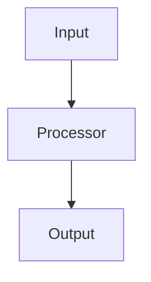

<div align="center">

# 📑 **Kansas Frontier Matrix — Markdown Output Protocol**  
`docs/standards/kfm_markdown_output_protocol.md`  
**Diamond⁹ Ω / Crown∞Ω Ultimate Certified**

**Purpose**  
Define the **authoritative, CI-enforced Markdown output contract** for all content generators used by the Kansas Frontier Matrix (KFM), including AI systems and code-based generators.  
This protocol operationalizes **`markdown_rules.md`** and **`markdown_guide.md`** into a concrete “how to emit Markdown” specification for deterministic, GitHub-safe, machine-extractable output.

[](../README.md)  
[]()  
[](../faircare.md)  
[]()  
[]()

</div>

---

## 📘 Overview

This protocol governs **how Markdown is emitted**, not just how it should look.

It applies to:

- AI systems (e.g. ChatGPT-based agents used in KFM workflows)  
- Code generators and CLIs  
- Documentation scaffolding scripts and templating tools  

All generated Markdown MUST:

- Conform to **`docs/standards/markdown_rules.md`** (structure & metadata)  
- Follow **`docs/standards/markdown_guide.md`** (authoring idioms & patterns)  
- Respect **KFM-MDP v11.0.0** heading and layout requirements  
- Be **GitHub-safe** and **single-block safe** when requested  
- Be **machine-extractable**, **WCAG 2.1 AA+ aligned**, and **FAIR+CARE compliant**

Any generator that violates this protocol is considered **non-compliant** and MUST be corrected, disabled, or quarantined by CI.

---

## 🗂️ Standards Directory Context

```text
docs/
│
└── standards/
    │
    ├── markdown_rules.md                 # Structural & formatting standard (what docs must look like)
    ├── markdown_guide.md                 # Human authoring guide (how humans should write)
    ├── kfm_markdown_output_protocol.md   # ← THIS OUTPUT PROTOCOL (how systems must emit markdown)
    ├── kfm_markdown_protocol_v11.md      # Markdown authoring protocol (governing spec)
    └── governance/
        └── ROOT-GOVERNANCE.md
```

---

## 🧩 Relationship to Other Markdown Standards

- **`markdown_rules.md`**  
  > Defines **what valid KFM Markdown looks like**: structure, YAML, headings, directory trees, tables, mermaid, etc.

- **`markdown_guide.md`**  
  > Explains **how humans should write Markdown**: tone, examples, patterns.

- **`kfm_markdown_protocol_v11.md`**  
  > Defines the **authoring protocol** (semantic headings, Focus Mode hooks, extended metadata).

- **`kfm_markdown_output_protocol.md` (THIS DOC)**  
  > Defines **how systems must output Markdown**: block boundaries, YAML placement, directory layout style, safety constraints.

If there is a conflict:

1. `markdown_rules.md` (structure) **wins**.  
2. `kfm_markdown_protocol_v11.md` (authoring protocol) **clarifies** semantics.  
3. `kfm_markdown_output_protocol.md` (this file) governs generator behavior.  
4. `markdown_guide.md` (style) is advisory but strongly encouraged.

---

## 🧱 Section 1 — Global Output Contract

These rules apply to **all** KFM-aware generators.

### 1.1 One-Block Rule (When Explicitly Requested)

When a caller explicitly requests:

- “one markdown block / box”
- “single fenced block”
- “single GitHub-safe markdown fence”
- or equivalent language,

the generator MUST:

- Emit exactly **one** fenced block of the form:

  ```markdown
  ```markdown
  ... all content ...
  ```
  ```

- Place **all content inside that fence**.  
- Emit **no text before or after** the fence (no explanations, no logs, no trailing comments).  
- Avoid splitting content across multiple fences.

Violation ⇒ integration failure; upstream tools MAY terminate or quarantine that output.

> Note: For this protocol file itself in the repo, we use standard fences as content. The “one-block rule” governs *runtime output* of generators, not internal repository usage.

### 1.2 YAML Must Be First Inside the Block

Within a full-document response:

- The first non-empty line inside the fenced block MUST be `---`.  
- No commentary, logging, or explanations may precede YAML.  
- YAML must conform to the v11 fields defined in `markdown_rules.md` and `kfm_markdown_protocol_v11.md`.

---

## 🧱 Section 2 — Structural Output Requirements

Generators MUST:

- Emit **exactly one H1**, inside the centered `<div>` block.  
- Use headings **H2–H4** only beyond that.  
- Follow standard section ordering (for full documents):

  1. YAML front matter  
  2. Centered title & purpose block  
  3. Horizontal rule (`---`)  
  4. `## 📘 Overview`  
  5. Context / directory layout (if applicable)  
  6. Main content sections  
  7. `## 🕰️ Version History`  
  8. Footer

- Ensure all headings are descriptive and not duplicated within the same document.

Generators SHOULD:

- Reuse canonical heading phrases from `markdown_rules.md` and `markdown_guide.md` where sensible (Overview, Directory Layout, Version History, etc.).

---

## 🗂️ Section 3 — Directory Layout Output Rules

Whenever a generator emits a directory layout, it MUST:

- Use the **lined ASCII tree** format:

```text
docs/
│
└── standards/
    │
    ├── markdown_rules.md                 # Structural & formatting standard
    ├── markdown_guide.md                 # Human authoring guide
    ├── kfm_markdown_output_protocol.md   # Output behavior contract
    └── governance/
        └── ROOT-GOVERNANCE.md
```

- Fence the tree in:

```markdown
```text
<tree here>
```
```

- Use 4 spaces for indentation.  
- Use `│`, `├──`, `└──` and never `|--`, `+--`, or tabs.  
- Avoid trailing whitespace or blank lines inside the tree.

---

## 💻 Section 4 — Code, JSON, and Example Output

Generators MUST:

- Use triple backticks for code/examples.  
- Tag fenced blocks with an appropriate language:

  - `json`, `yaml`, `bash`, `text`, `ts`, `python`, `mermaid`, `markdown`, etc.

- Emit syntactically valid examples where feasible (e.g. valid JSON, valid YAML structures).  
- Avoid commentary inside the code fences unless it is valid syntax (e.g. `# comment` in bash, `// comment` in TS).

Example (correct):

```json
{
  "id": "example",
  "active": true,
  "note": "Valid JSON code block for documentation."
}
```

Generators MUST NOT:

- Emit partial JSON/ YAML without clearly marking it as partial or pseudo (`"..."` etc.) if it would not validate.  
- Mix code and prose inside the same fenced block.  
- Include stack traces or internal logs inside documentation fences.

---

## 🧠 Section 5 — Mermaid Diagrams

If a generator emits Mermaid:

- It MUST use ` ```mermaid` fences.  
- It MUST start diagrams with a directive, e.g. `flowchart TD`.  
- It MUST avoid CSS styling and Mermaid theme overrides.  
- It MUST avoid HTML inside nodes beyond `<br/>`.  
- It SHOULD keep diagrams small and focused.

Example:

```markdown

```

Invalid output (will likely break CI):

- Mermaid blocks with unknown keywords.  
- Mermaid blocks containing unmatched quotes or backticks.  
- Mermaid blocks with custom CSS and no clear justification.

---

## ♿ Section 6 — Accessibility & Inclusive Output

Generators must uphold **WCAG 2.1 AA+** standards, in alignment with `accessibility_compliance: "WCAG 2.1 AA+"`.

Output MUST:

- Include alt-text for images:

  ```markdown
  
  ```

- Use descriptive text for links:

  ```markdown
  See the [Markdown Rules Standard](./markdown_rules.md) for normative requirements.
  ```

- Avoid color-only references (e.g. “click the red button”) without textual qualifiers.  
- Avoid language that is exclusionary, disrespectful, or harmful.

Generators SHOULD:

- Prefer shorter sentences and clear structure for screen readers.  
- Introduce acronyms on first use with expansion (e.g. “ETL (Extract-Transform-Load)”).

---

## ⚖️ Section 7 — FAIR+CARE & Safety Constraints on Output

All generated content MUST:

- Respect **FAIR** and **CARE** principles described in `faircare.md`.  
- Avoid disclosing **sensitive coordinates** of archaeological / sacred sites unless explicitly permitted by governance and appropriately labeled.  
- Clearly mark synthetic or illustrative examples, especially when they resemble real people, places, or events.

Generators MUST NOT:

- Fabricate historical or cultural details without labeling them as hypothetical or illustrative.  
- Output unlicensed proprietary content as if it were open data.  
- Suggest or demonstrate unsafe patterns (e.g., ignoring licenses, disregarding CARE labels).

If a doc’s YAML declares a stricter `care_label` or non-public classification, generators MUST:

- Treat that classification as a **hard guardrail**.  
- Avoid emitting content that violates confidentiality, sovereignty, or ethical handling constraints.

---

## 🧭 Section 8 — Output Behavior Modes

This protocol defines three canonical generator modes:

### 8.1 Full-Document Mode

Used when asked to emit a **complete, standalone document**:

- MUST include YAML, centered title block, Overview, main sections, Version History, footer.  
- MUST respect the “one-block rule” when requested for single-fence output.  
- SHOULD ensure Version History includes at least one entry describing the current change.

### 8.2 Section Mode

Used when asked to emit a **section** of a larger file:

- MUST start with an appropriate heading (`##` or `###`), not YAML.  
- MUST respect heading hierarchy requested by caller.  
- MUST NOT duplicate title blocks or Version History unless explicitly asked.

### 8.3 Fragment Mode

Used for **small snippets** (tables, code, diagrams):

- MUST NOT include YAML.  
- MUST be structurally correct for the snippet type (valid table, valid code block, etc.).  
- SHOULD state clearly (in surrounding prose or comments from the caller) how it fits into the parent doc.

---

## 🧩 Section 9 — Example: Output-Compliant Full Document

Generators MAY use this pattern for new doc generation:

```markdown
```markdown
---
title: "🧭 Example KFM Doc"
path: "docs/examples/example_kfm_doc.md"
version: "v1.0.0"
last_updated: "2025-11-20"
review_cycle: "Annual"
commit_sha: "<latest-commit-hash>"
sbom_ref: "../../releases/v1.0.0/sbom.spdx.json"
manifest_ref: "../../releases/v1.0.0/manifest.zip"
telemetry_ref: "../../releases/v1.0.0/telemetry.json"
telemetry_schema: "../../schemas/telemetry/example-doc-v1.json"
governance_ref: "../standards/governance/ROOT-GOVERNANCE.md"
license: "CC-BY 4.0"
mcp_version: "MCP-DL v6.3"
markdown_protocol_version: "KFM-MDP v11.0.0"
status: "Active"
doc_kind: "Guide"
intent: "example-doc"
semantic_document_id: "kfm-doc-example-kfm-doc"
doc_uuid: "urn:kfm:docs:examples:example-kfm-doc-v1.0.0"
machine_extractable: true
accessibility_compliance: "WCAG 2.1 AA+"
fair_category: "F1-A1-I1-R1"
care_label: "Public / Low-Risk"
immutability_status: "version-pinned"
---

<div align="center">

# 🧭 **Example KFM Document**  
`docs/examples/example_kfm_doc.md`

**Purpose**  
Demonstrate a KFM-compliant full-document output payload.

</div>

---

## 📘 Overview

...

## 🗂️ Directory Layout

```text
docs/
└── examples/
    └── example_kfm_doc.md
```

## 🧩 Main Content

...

## 🕰️ Version History

| Version | Date       | Author | Summary        |
|-------: |------------|--------|----------------|
| v1.0.0  | 2025-11-20 | Team   | Initial draft. |

```
```

---

## 🕰️ Version History

| Version | Date       | Author     | Summary                                                                                                                                                    |
|-------: |------------|-----------|------------------------------------------------------------------------------------------------------------------------------------------------------------|
| v11.0.0 | 2025-11-20 | Core Team | Upgraded output protocol to KFM-MDP v11.0.0; added extended YAML expectations, WCAG 2.1 AA+ alignment, explicit generator modes, and Focus Mode-aware output rules. |
| v10.4.3 | 2025-11-16 | Core Team | v10.4.3 alignment with `markdown_rules.md` and `markdown_guide.md`; deep-inset directory layout; explicit single-block and directory layout constraints.            |
| v10.3.0 | 2025-11-13 | A. Barta  | Harmonized original Markdown Output Protocol with FAIR+CARE and STAC/DCAT alignment.                                                                      |

<div align="center">

© 2025 Kansas Frontier Matrix — CC-BY 4.0  
Validated under **Master Coder Protocol v6.3** · FAIR+CARE Certified  
Diamond⁹ Ω / Crown∞Ω Ultimate Certified  

[Back to Standards Index](../README.md) · [Root Governance Charter](governance/ROOT-GOVERNANCE.md)

</div>
