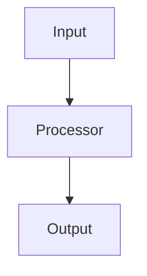

<div align="center">

# 📑 **Kansas Frontier Matrix — Markdown Output Protocol**  
`docs/standards/kfm_markdown_output_protocol.md`  
**Diamond⁹ Ω / Crown∞Ω Ultimate Certified**

**Purpose**  
Define the *authoritative, CI-enforced Markdown output contract* for all content generators used by the Kansas Frontier Matrix (KFM), including AI systems and human authors who follow automated templates.  
This protocol operationalizes the rules in **`markdown_rules.md`** and **`markdown_guide.md`** into a concrete “how to output Markdown” specification.

[](../README.md)
[](../../LICENSE)
[](../faircare.md)
[]()

</div>

---

# 📘 Overview

This protocol governs **how Markdown is emitted**, not just how it should look.  
It is aimed at:

- AI systems (e.g., ChatGPT agents)  
- Code generators and CLIs  
- Documentation scripts and templates  

It requires that all generated Markdown:

- Conforms to **`docs/standards/markdown_rules.md`** (structure, headings, YAML, etc.)  
- Uses **`docs/standards/markdown_guide.md`** for authoring styles and idioms  
- Is **GitHub-safe** and **single-block safe** when requested  
- Is **machine-extractable** and **FAIR+CARE aligned**  

Any generator that violates this protocol is considered **non-compliant** and must be corrected or disabled.

---

# 🗂️ Standards Directory Context

~~~text
docs/
│
└── standards/
    │
    ├── markdown_rules.md                 # Structural & formatting standard
    ├── markdown_guide.md                 # Human authoring guide
    ├── kfm_markdown_output_protocol.md   # ← THIS OUTPUT PROTOCOL
    └── governance/
        └── ROOT-GOVERNANCE.md
~~~

---

# 🧩 Relationship to Other Standards

- **`markdown_rules.md`**  
  > Defines *what valid Markdown looks like* (structure, headings, YAML, tables, mermaid, etc.).

- **`markdown_guide.md`**  
  > Explains *how humans should write Markdown* (tone, patterns, examples).

- **`kfm_markdown_output_protocol.md` (THIS DOC)**  
  > Defines *how systems must output Markdown* (block boundaries, no stray text, directory layout style, etc.).

If there is a conflict:

1. `markdown_rules.md` (structure) wins.  
2. `kfm_markdown_output_protocol.md` (output behavior) resolves ties for generators.  
3. `markdown_guide.md` (style) is advisory but strongly encouraged.

---

# 🧱 Output Contract — Global Rules

## 1. One-Block Rule (When Requested)

When a consumer explicitly requests **“one markdown box,” “single block,” or equivalent**, the generator MUST:

- Output exactly **one fenced ` ```markdown ... ``` ` block**.  
- Include **all content inside the fence**.  
- Not emit **any text before or after** the fence.  
- Not split content across multiple fences.

Violation ⇒ CI and/or integration failure for that run.

---

## 2. YAML Front-Matter Must Be First

- The first non-empty line inside the markdown block MUST be `---`.  
- No text before YAML.  
- YAML MUST satisfy the required fields from `markdown_rules.md`.  
- The generator MUST NOT place commentary or explanations above YAML.

---

## 3. Centered Title Block Immediately After YAML

Immediately following YAML:

- Insert `<div align="center">` title block as specified in `markdown_rules.md`.  
- Then a closing `</div>`.  
- Then a horizontal rule `---` on its own line.  

The generator MUST always emit this pattern unless the target file is a very small fragment (e.g., an included partial), in which case separate rules may apply.

---

## 4. Heading Hierarchy in Output

Generators MUST:

- Use a single H1 (the title in the center block).  
- Use `#`, `##`, `###` consistently:  
  - `#` not used again after the centered title.  
  - `##` for major sections (Overview, Directory, etc.).  
  - `###` for technical subsections (e.g., “Vector Tiles”, “Workflow Steps”).  
- Avoid H4+ in generated docs unless the target spec explicitly allows it.

---

# 🗂️ Directory Layout Output Rules

All directory layouts emitted by generators MUST:

- Use the **deep-inset lined ASCII style**:

~~~text
docs/
│
└── guides/
    │
    ├── telemetry/
    │   └── README.md
    └── perf/
        ├── telemetry-profiling.md
        └── maplibre-rendering-playbook.md
~~~

- Be fenced with ` ```text` fences.  
- Avoid trailing blank lines inside the fence.  
- Use vertical bars `│`, corner connectors `├──`, `└──`.  
- Align indentation with 4-space blocks.

Generators MUST NOT emit mixed styles (e.g., `|--` or tab-indented trees).

---

# 🧮 Code & Example Output Rules

- Always use **triple backticks**, not tildes, unless explicitly requested for doc examples.  
- Supply a language tag (`json`, `ts`, `text`, `bash`, `yaml`, `mermaid`, etc.).  
- Never indent the fence itself.  
- Do not include extraneous commentary inside code fences (e.g., “here is the code you requested”).  
- Ensure JSON examples are valid whenever possible.

Example:

```json
{
  "ok": true,
  "note": "Valid JSON example"
}
````

---

# 🧠 Mermaid Output Rules

Generators MUST:

* Use ` ```mermaid` fences.
* Start diagrams with a graph directive (`flowchart TD`, `flowchart LR`, etc.).
* Avoid any custom styling, CSS, or Mermaid theme overrides.
* Not use HTML inside Mermaid nodes beyond simple `<br/>` line breaks.
* Ensure diagrams do not break due to invalid syntax.

Correct:



---

# 🧭 FAIR+CARE & Safety Constraints on Output

When generating content for KFM:

* Do NOT fabricate or speculate about cultural heritage, archaeological interpretations, or Indigenous histories.
* For any content that references sensitive sites, use generalized language; never output raw coordinates unless explicitly permitted and marked as such.
* Respect `care_label` and `sensitivity_level` from YAML (if present) and adjust examples accordingly.
* When generating examples, prefer **safe synthetic data** or clearly anonymized/pseudonymous forms.

If a document concerns sensitive data:

* The generator SHOULD include an **Ethics & CARE** section.
* The generator MUST NOT show exact localities that would violate site protection norms.

---

# 🧪 CI/Validation Integration Behavior

Generators should assume:

* `docs-lint.yml` will reject:

  * Missing YAML fields
  * Multiple H1s
  * Incorrect directory block style
  * HTML outside allowed `<div align="center">` blocks
* `faircare-validate.yml` may reject:

  * Sensitive coordinates
  * Unethical or harmful examples
  * Violations of `care_label` policies
* `telemetry-export.yml` will log:

  * Metadata about generated docs
  * Structural compliance metrics

Thus, generators SHOULD:

* Be conservative with examples
* Avoid raw data with unknown provenance
* Clearly label any AI-generated narratives as such when appropriate

---

# 🧱 Output Behavior Modes

The protocol defines several **modes** for generators:

## 1. **Full Document Mode**

Used when creating a full spec, guide, or README:

* MUST include YAML → Title → Overview → Directory Layout → Content → Version History → Footer.
* MUST use deep-inset directory layout where appropriate.
* MUST include Version History table.

## 2. **Section Mode**

Used when only a section of a larger file is being generated:

* MUST follow heading hierarchy (e.g., `##` or `###` as requested).
* MUST NOT duplicate YAML or centered title block.
* MUST remain structurally compatible with surrounding doc.

## 3. **Fragment Mode**

Used for ultra-small pieces (a snippet, a table, or a small example):

* MUST avoid YAML.
* MUST clearly be a structural subset (e.g., table, code fence).
* Should still follow KFM table/code rules.

---

# 🧩 Example: Full Document Output Template

Generators MAY use the following template when producing a brand-new KFM doc:

````markdown
---
title: "🧩 Example KFM Document"
path: "docs/examples/example.md"
version: "v1.0.0"
last_updated: "2025-11-16"
review_cycle: "Annual"
commit_sha: "<latest-commit-hash>"
sbom_ref: "../../releases/v1.0.0/sbom.spdx.json"
manifest_ref: "../../releases/v1.0.0/manifest.zip"
telemetry_ref: "../../releases/v1.0.0/telemetry.json"
telemetry_schema: "../../schemas/telemetry/example-doc-v1.json"
governance_ref: "../standards/governance/ROOT-GOVERNANCE.md"
license: "CC-BY 4.0"
mcp_version: "MCP-DL v6.3"
markdown_protocol_version: "KFM-MDP v10.4.2"
status: "Active / Enforced"
doc_kind: "Guide"
intent: "example-doc"
semantic_document_id: "kfm-doc-example"
doc_uuid: "urn:kfm:doc:example-v1.0.0"
machine_extractable: true
accessibility_compliance: "WCAG 2.1 AA"
---

<div align="center">

# 🧩 **Example KFM Document**  
`docs/examples/example.md`

**Purpose**  
Brief one–two sentence doc description.

</div>

---

# 📘 Overview

...

# 🗂️ Directory Layout

```text
docs/
└── examples/
    └── example.md
````

# 🧩 Main Sections

...

# 🕰️ Version History

| Version | Date       | Author | Summary        |
| ------: | ---------- | ------ | -------------- |
|  v1.0.0 | 2025-11-16 | Team   | Initial draft. |

```

---

# 🕰️ Version History

| Version | Date       | Author      | Summary                                                                                  |
|--------:|------------|------------|------------------------------------------------------------------------------------------|
| v10.4.3 | 2025-11-16 | Core Team  | Upgraded to align with `markdown_rules.md` v10.4.3 and `markdown_guide.md`; deep-inset directory layout, explicit generator modes. |
| v10.3.0 | 2025-11-13 | A. Barta   | Harmonized original Markdown Output Protocol with FAIR+CARE and STAC/DCAT alignment.     |
| v10.2.x | 2025-11-10 | A. Barta   | Introduced Diamond⁹ Ω / Crown∞Ω structure and tilde fence safety pattern.               |

<div align="center">

© 2025 Kansas Frontier Matrix — CC-BY 4.0  
Validated under **Master Coder Protocol v6.3** · FAIR+CARE Certified · Diamond⁹ Ω / Crown∞Ω Ultimate Certified  

[Back to Standards Index](../README.md) · [Root Governance Charter](governance/ROOT-GOVERNANCE.md)

</div>
