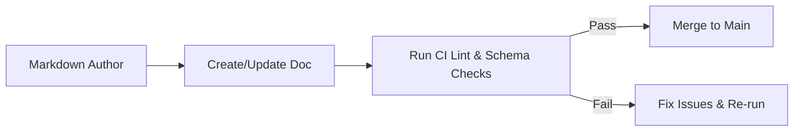
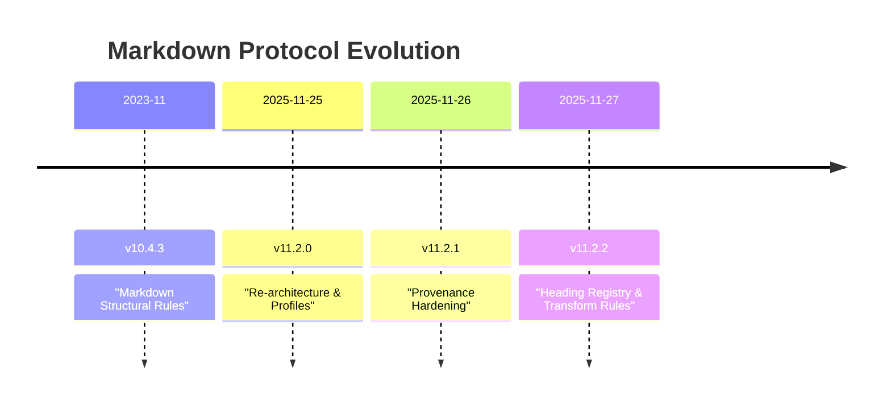

<div align="center">

# 📑 **Kansas Frontier Matrix — Markdown Authoring Protocol v11.2.2**  
`docs/standards/kfm_markdown_protocol_v11.2.2.md`

**Purpose:**  
Define the canonical, enforceable Markdown authoring rules for the Kansas Frontier Matrix (KFM) v11.2.2.  
This protocol standardizes structure, headings, metadata, and narrative patterns so that all Markdown in the monorepo is CI-safe, FAIR+CARE-aligned, semantically interoperable, and ready for Story Node / Focus Mode integration.

[]() ·
[]() ·
[]() ·
[]() ·
[]()

</div>

---

## 📘 Overview

### 1. Scope and Intent

KFM-MDP v11.2.2 governs **all Markdown files** within the Kansas Frontier Matrix monorepo, regardless of domain (ETL pipelines, graph schemas, AI docs, UI specs, archaeology analyses, hydrology notes, etc.). If it is `.md` and lives in the repository, this protocol applies.

This version:

- Unifies **document structure** (front-matter, headings, sections, and footer).
- Introduces a **heading registry** to keep H2-level sections predictable and machine-friendly.
- Adds **semantic intent**, **doc_kind**, and **transform registry** metadata for AI Focus Mode.
- Tightens **provenance rules** and version linking so every doc is traceable.
- Clarifies **anti-patterns** (forbidden constructs) that will be rejected by CI.
- Encodes stylistic patterns consistently used across v11 (purpose block, badges row, directory layout, version history, governance footer).
- Maintains compatibility with **MCP-DL v6.3**, **KFM-OP v11**, **STAC 1.0.0**, and **DCAT 3.0**.

All other documentation standards (e.g. domain-specific SOPs, experiment templates) must build on top of this, not override it.

### 2. Core Principles

1. **Single Source of Truth**  
   This file is the authoritative reference for Markdown authoring. Other docs may extend but never contradict it.

2. **Documentation-First**  
   Every feature, pipeline, model, or dataset change must be accompanied by conforming Markdown: architecture notes, experiment logs, model cards, or SOPs.

3. **Machine-Readable by Design**  
   Front-matter + consistent headings + well-formed lists and tables allow automated extraction into DCAT/STAC catalogs and knowledge graph ingestion.

4. **Human-Friendly Narrative**  
   Although machine-compatible, docs must remain readable to humans: clear language, consistent sections, meaningful headings, and explanatory context, including a visible “Purpose” block near the top.

5. **Ethical & Sovereignty-Aware**  
   The protocol embeds FAIR+CARE, CIDOC-CRM semantics, and Indigenous sovereignty flags to ensure all documentation respects governance constraints.

6. **Predictable Layout & Navigation**  
   Root title + badges row, directory layout, and version history sections are expected for standards and architecture documents, enabling consistent navigation and UI rendering (e.g. in Focus Mode).

---

## 🗂️ Directory Layout

All Markdown documents live within the monorepo’s main directory structure:

```text
KansasFrontierMatrix/
├── src/                    # Code (ETL, AI, graph, API, tools)
├── web/                    # Frontend (React, MapLibre, Cesium)
├── data/                   # Data manifests, raw pointers, processed outputs, STAC
├── docs/                   # Documentation (this protocol lives here)
│   ├── standards/          # Standards & policies (Markdown, FAIR+CARE, governance, etc.)
│   ├── architecture/       # System + subsystem design docs
│   ├── guides/             # How-to guides and SOPs
│   ├── data/               # Data source registry, data contracts
│   ├── analyses/           # Domain analyses and case studies
│   └── glossary.md         # Shared term glossary
├── mcp/                    # Master Coder Protocol artifacts (experiments, SOPs, model cards)
├── tests/                  # Test suites
├── tools/                  # Utility scripts, CLIs, dev tools
└── .github/                # CI/CD workflows and templates
```

**Rules:**

- All **standards** (like this one) MUST live under `docs/standards/`.
- Architecture documents live under `docs/architecture/` and may reference this protocol but never redefine it.
- Domain reports and analyses (e.g. archaeology, hydrology) live in `docs/analyses/` or respective subtrees.
- There MUST be a `README.md` in any directory intended as a public or developer-facing entry point.

### Recommended Directory Snippet Pattern (v11 “Immediate + One Branch”, with Emojis + Descriptions)

When showing directory layouts in Markdown, KFM v11 favors a **compact, one-level-deep tree** with emojis and inline descriptions, for consistency and readability. Documents MAY adopt the following style:

```text
📁 docs/                                        — Project documentation root
│   📂 standards/                               — Standards & policies (Markdown, FAIR+CARE, governance)
│       ↳ This protocol and related standards

📁 src/                                         — Backend source code
│   📂 pipelines/                               — ETL, AI, and orchestration implementations
│       ↳ LangGraph, Airflow DAGs, and helpers

📁 data/                                        — Data lifecycle (raw → work → processed → releases)
│   📂 releases/                                — Versioned bundles (manifest · telemetry · SBOM)
│       ↳ Stable, governed data exports

📁 schemas/                                     — Shared JSON, STAC, DCAT, JSON-LD, telemetry schemas
│   📂 telemetry/                               — Telemetry schemas (lineage · energy · carbon)
│       ↳ Used by CI and orchestration pipelines

📁 .github/                                     — CI/CD automation & governance checks
    📂 workflows/                               — Validation, lineage, and governance CI workflows
        ↳ kfm-ci · docs-lint · lineage-audit · governance-check
```

**Directory layout guidance:**

- Use this pattern for **standards, architecture, and pipeline docs** when showing where things live.
- Keep to **one level beneath each directory** for clarity.
- Include **short descriptions** after an em dash (`—`) for each entry.
- Use emojis (`📁` for root folders, `📂` for subfolders) where they improve readability without overwhelming.

---

## 🧭 Context

This protocol sits at the intersection of:

- **KFM-OP v11 (Ontology Protocol)** – defines how entities, relationships, and time/space are modeled.
- **MCP-DL v6.3 (Master Coder Protocol – Documentation Layer)** – enforces documentation-first workflows.
- **File/Data Architecture** – defines where data manifests, STAC catalogs, and provenance metadata live.
- **Focus Mode v3 & Story Nodes** – AI-driven narratives that rely on stable, parseable Markdown.

The Markdown rules are intentionally **strict** so that:

- CI can automatically reject broken or ambiguous documentation.
- The knowledge graph can safely reference docs as **E29 Design or Procedure** (CIDOC-CRM).
- Focus Mode can generate trustworthy narrative overlays without hallucinating structure.

When in doubt:  
- Prefer **more structure** (headings, lists, tables) over ad-hoc formatting.  
- Prefer **explicit metadata** over implicit context.  
- Prefer **directory layout + version history** sections where appropriate.

---

## 🗺️ Diagrams

Diagrams are allowed and encouraged, but must obey these rules:

1. **Diagram Types**  
   Only the following profiles are sanctioned in this standard:
   - `mermaid-flowchart-v1` – system or data-flow diagrams.
   - `mermaid-timeline-v1` – historical or pipeline timelines.

2. **Diagram Placement**
   - Diagrams SHOULD be placed in a dedicated section (often under “🧱 Architecture” or “🧪 Validation & CI/CD”).
   - Every diagram MUST have:
     - A short heading or caption.
     - A one- or two-sentence explanation of what it shows.
   - Diagrams MUST NOT be used to introduce critical information that is not also described in text.

3. **Mermaid Flowchart Example**



4. **Mermaid Timeline Example**



5. **Forbidden Diagram Practices**
   - No ASCII-art boxes pretending to be code fences inside fenced blocks.
   - No diagrams that encode secrets (keys, tokens, private endpoints).
   - No diagrams with unlabeled nodes/edges in standards documents.

---

## 🧠 Story Node & Focus Mode Integration

All KFM documentation is a potential input to **Story Nodes** and **Focus Mode**. This protocol ensures Markdown is:

- **Segmentable** into narrative chunks.
- **Alignable** with story-node JSON schema.
- **Traceable** when used in AI summaries.

### 1. Linking Docs to Story Nodes

A Story Node is a JSON object with narrative text and a spatiotemporal footprint. Docs may:

- Be referenced by Story Nodes through `target` IDs (e.g., `kfm-markdown-protocol-v11.2.2`).
- Embed Story Node IDs in the content where appropriate, e.g.:

```text
Related Story Node: urn:kfm:story-node:docs:markdown-protocol:overview
```

Rules:

- A standard like this SHOULD reference Story Nodes sparingly and only where they clarify narrative usage (e.g., examples of how Focus Mode surfaces documentation).
- Story Nodes MUST live in JSON files (not embedded as YAML front-matter here).

### 2. Focus Mode Behavior

When a user focuses on this document (e.g., entity `kfm-markdown-protocol-v11.2.2`):

- Focus Mode MAY:
  - Summarize the doc (respecting `ai_transform_permissions`).
  - Highlight key sections (Overview, Anti-Patterns, Validation).
  - Render relationships to other standards (e.g., Governance, FAIR+CARE policy).
- Focus Mode MUST NOT:
  - Rewrite or alter this document’s content.
  - Create speculative policy that conflicts with this standard.
  - Remove governance or ethics references.

### 3. AI Transform Permissions

The `ai_transform_permissions` and `ai_transform_prohibited` fields in front-matter are normative:

- Allowed transforms:
  - Summaries, highlight extraction, metadata extraction, 3D/time-anchored context for the UI, a11y transformations (e.g. large-print or high-contrast versions).
- Prohibited transforms:
  - Edits to content, speculative additions, unverified architectural claims, or anything that bypasses governance review.

If additional transforms are later introduced, this protocol MUST be updated to declare them explicitly.

---

## 🧪 Validation & CI/CD

KFM treats documentation as a first-class citizen in CI/CD. Every Markdown file MUST pass the following categories of checks:

### 1. Validation Profiles

These checks are referenced in `test_profiles`:

- `markdown-lint`  
  Style and structure linting (headings, lists, line length, spacing).

- `schema-lint`  
  YAML front-matter validation against JSON Schema for the document’s `doc_kind`.

- `metadata-check`  
  Ensures required metadata fields (title, path, version, license, etc.) are present and correctly formatted.

- `footer-check`  
  Ensures the standardized footer block is present and correct.

- `accessibility-check`  
  Verifies alt-text on images, heading order, and basic WCAG-oriented structure.

- `diagram-check`  
  Ensures diagrams use approved profiles, include captions, and are syntactically valid.

- `provenance-check`  
  Confirms version history, provenance chains, and supersession links are consistent.

If any check fails, CI MUST block merging until issues are fixed.

### 2. YAML Front-Matter Rules

Every Markdown file MUST begin with a YAML front-matter block:

- It MUST start on the very first line with `---` (no blank lines before).
- It MUST end with a closing `---` line.
- It MUST include all required fields for its `doc_kind`.
- Unknown or deprecated fields SHOULD NOT be introduced without updating the JSON Schema.

### 3. Heading Rules

- Exactly **one H1** (`#`) per document, normally in the centered title block.
- H2 (`##`) must use approved emoji-annotated titles where this standard applies (e.g., for standards and reference documents).
- No H5/H6 headings are allowed.
- Headings must be in strict hierarchical order (no jumping from H2 directly to H4 without an H3 in between).

### 4. Links and References

- Internal links MUST be relative paths (no absolute file-system paths).
- External links MUST use `https` unless a specific reason is documented.
- Bare URLs (just `https://example.com`) SHOULD be avoided in favor of descriptive markdown links:
  - ✅ `[Kansas Geological Survey](https://example.org)`
  - ❌ `https://example.org`

### 5. Code Blocks

- Code blocks MUST use triple backticks fenced syntax or the repo’s agreed fencing strategy and MUST NOT be nested.
- Language identifiers SHOULD be used for code samples (e.g., `bash`, `json`, `python`) where appropriate.
- Secrets (tokens, passwords, credentials) MUST NEVER be present in examples.

---

## 📦 Data & Metadata

This protocol itself is a data object that can be ingested into:

- DCAT catalogs.
- STAC-like registries of documentation artifacts.
- The Neo4j knowledge graph.

### 1. Required Metadata Fields (Standard Documents)

For `doc_kind: "Standard"`, the following metadata fields are REQUIRED (already present in this file):

- Identity & versioning:
  - `title`
  - `path`
  - `version`
  - `doc_uuid`
  - `semantic_document_id`
  - `event_source_id`
  - `status`
  - `doc_kind`

- Lifecycle & governance:
  - `last_updated`
  - `release_stage`
  - `lifecycle`
  - `review_cycle`
  - `ttl_policy`
  - `sunset_policy`
  - `governance_ref`
  - `ethics_ref`
  - `sovereignty_policy`

- Licensing & ethics:
  - `license`
  - `mcp_version`
  - `markdown_protocol_version`
  - `fair_category`
  - `care_label`
  - `sensitivity`
  - `sensitivity_level`
  - `public_exposure_risk`
  - `classification`
  - `jurisdiction`
  - `indigenous_rights_flag`
  - `data_steward`

- Provenance & catalogs:
  - `commit_sha`
  - `sbom_ref`
  - `manifest_ref`
  - `telemetry_ref`
  - `telemetry_schema`
  - `energy_schema`
  - `carbon_schema`
  - `ontology_alignment`
  - `metadata_profiles`
  - `provenance_chain`
  - `provenance_requirements`
  - `doc_integrity_checksum`

- AI & transforms:
  - `ai_training_inclusion`
  - `ai_focusmode_usage`
  - `ai_transform_permissions`
  - `ai_transform_prohibited`
  - `transform_registry`

- Structural:
  - `header_profile`
  - `footer_profile`
  - `diagram_profiles`
  - `scope`
  - `semantic_intent`
  - `category`
  - `heading_registry`
  - `test_profiles`
  - `ci_integration`
  - `branding_registry`
  - `deprecated_fields`
  - `layout_profiles`
  - `badge_profiles`
  - `requires_purpose_block`
  - `requires_version_history`
  - `requires_directory_layout_section`
  - `requires_governance_links_in_footer`

### 2. Semantic Alignment

This protocol is designed to be easily mapped into semantic web and graph representations:

- **DCAT**: Treat this document as a `dcat:Dataset` with `dct:title`, `dct:description`, `dct:license`, `dct:modified`, `dct:identifier`, and `dcat:keyword` derived from front-matter.
- **STAC**: Represent as an Item in a “Documentation” collection, with:
  - `geometry` and `bbox` optional or omitted.
  - `datetime` set from `last_updated`.
  - `assets` referencing the markdown and PDF.
- **PROV-O**: Use `prov:Plan` and `prov:wasDerivedFrom` to link this version to prior versions listed in `provenance_chain`.
- **CIDOC-CRM**: Use `E29 Design or Procedure` as the CRM class for this document.

---

## 🧱 Architecture

From the perspective of repository architecture, this protocol defines:

1. **Entry Points**  
   - Any new standard MUST declare its path and be referenced in `docs/README.md` and, where relevant, in `docs/architecture/` and `docs/standards/ROOT-STANDARDS.md`.

2. **Dependencies**  
   - This file depends on:
     - MCP-DL v6.3 (for documentation behavior).
     - Governance charter (for policy).
     - FAIR+CARE guide (for ethics).
     - Sovereignty policy (for Indigenous data considerations).
   - Other standards (e.g. data contracts, ETL conventions, telemetry standards, UI accessibility) depend on this file for structural rules.

3. **Update Process**  
   - Propose changes via PR with:
     - Update to this file.
     - Update to any JSON Schemas enforcing structure.
     - Update to any CI workflows if new checks are introduced.
   - Increment `version` and append to `Version History`.
   - Update the `sunset_policy` and `provenance_chain` accordingly.

4. **Integration with Tooling**  
   - Documentation generators may use:
     - `heading_registry` to build navigation.
     - `semantic_intent` to index docs by role (governance vs analysis).
     - `test_profiles` to determine which CI jobs to run for a given doc.
     - `layout_profiles` and `badge_profiles` to apply consistent rendering patterns.

---

## ⚖ FAIR+CARE & Governance

This standard enforces FAIR and CARE through structural requirements:

1. **FAIR**

- **Findable**:  
  - Every doc has a unique `doc_uuid` and `semantic_document_id`.  
  - Paths are explicit and stable.

- **Accessible**:  
  - Docs are stored as plain Markdown in a public repository.  
  - License and usage constraints are clearly stated.

- **Interoperable**:  
  - Metadata profiles (STAC, DCAT, PROV-O) are declared.  
  - Well-defined YAML front-matter is machine-readable.

- **Reusable**:  
  - CC-BY 4.0 licensing.  
  - Clear provenance, version history, and governance policies.

2. **CARE**

- **Collective Benefit**:  
  - Documentation is written to support community understanding and use of KFM, not only internal developers.

- **Authority to Control**:  
  - Indigenous data sovereignty policies are linked and must be followed whenever relevant content is documented.

- **Responsibility**:  
  - Authors must avoid revealing sensitive locations (e.g., precise coordinates of protected heritage sites) in public docs where it would increase risk.

- **Ethics**:  
  - Historical and cultural topics must be handled with respect, avoiding speculative or sensationalized narratives.

3. **Governance Hooks**

- `governance_ref`, `ethics_ref`, and `sovereignty_policy` MUST be honored when writing docs.  
- If a document deals with sensitive cultural data, additional internal review MAY be required before publication.

---

## 🕰️ Version History

| Version | Date       | Summary                                                                                                  |
|--------:|------------|----------------------------------------------------------------------------------------------------------|
| v11.2.2 | 2025-11-27 | Added semantic intent, stability tiers, transform registry, layout/badge/section requirements, and expanded guidance. |
| v11.2.1 | 2025-11-26 | Introduced profile system, provenance hardening, and stronger DCAT/STAC metadata requirements.          |
| v11.2.0 | 2025-11-25 | Major structural overhaul: new YAML layout, header/footer profiles, test profiles, and diagram rules.    |
| v11.0.1 | 2025-11-20 | Initial v11 consolidation of markdown rules under the new ontology and governance structures.            |
| v10.4.3 | 2023-11-10 | Legacy markdown rules for H1–H4 headings, front-matter presence, and basic README templates.            |

---

<div align="center">

**Kansas Frontier Matrix**  
*Scientific Insight × FAIR+CARE Ethics × Sustainable Intelligence*  

[⬅ Back to Standards Index](../README.md) ·  
[📜 Governance Charter](../governance/ROOT-GOVERNANCE.md) ·  
[🛰 Telemetry Overview](../../telemetry/README.md)

</div>
````
