<div align="center">

# 📑 **Kansas Frontier Matrix — Markdown Authoring Protocol v11.0**  
`docs/standards/kfm_markdown_protocol_v11.md`

**Purpose:**  
Define the **canonical Markdown authoring standard** for the Kansas Frontier Matrix (KFM), extending **MCP-DL v6.3** and **KFM-MDP v10.4** with richer metadata, Focus Mode v3 support, stronger accessibility guarantees, and tighter CI/CD enforcement, while remaining **backward-compatible** with v10.4-compliant docs.

[]()  
[]()  
[]()  
[]()  
[]()

</div>

---

## 📘 Overview

KFM-MDP v11.0 is the **governing protocol** for all Markdown documents in the Kansas Frontier Matrix monorepo.

It:

- Extends v10.4 with **richer YAML metadata** (STAC, DCAT, PROV-O, FAIR+CARE, Focus Mode hooks).  
- Formalizes **Focus Mode v3 affordances** (timelines, Story Nodes, 3D scenes, “Focus Summary” blocks).  
- Tightens **accessibility requirements** to **WCAG 2.1 AA+**.  
- Standardizes **heading structure, title blocks, and directory context sections**.  
- Locks in **naming conventions and file paths** for monorepo integration.  
- Is enforced via **CI/CD**: non-compliant docs **fail CI** and cannot be merged.

Any document valid under **KFM-MDP v10.4** remains valid, but all new / upgraded documents **SHOULD** follow v11.0, and older docs are expected to migrate.

---

## 🧱 Section 1 — Required Layout & Semantic Structure

Every KFM Markdown document **MUST** follow this structure:

1. **YAML front-matter block**  
2. **Centered title + metadata badges block**  
3. **Horizontal rule** (`---`)  
4. **📘 Overview** (H2)  
5. **Directory / Context section** (H2), if applicable  
6. **Main content sections** (H2+) with meaningful semantic headings  
7. **Examples / diagrams / tables** (as needed)  
8. **🕰️ Version History** (H2)  
9. **Footer / licensing block**

Constraints:

- Exactly **one H1**, inside the centered `<div>`.  
- Only headings **H1–H4** are allowed.  
- Do **not** skip heading levels (no H2 → H4 without H3).  
- Headings **MUST** be descriptive (no “Misc”, “Stuff”, etc.).  
- Emojis at the start of headings are **RECOMMENDED** but must be followed by text.

Recommended standard H2 headings:

- `## 📘 Overview`  
- `## 🗂️ Directory Layout` or `## 🧭 Context`  
- Domain-specific blocks (e.g., `## 📊 Data & Methods`, `## ⚖️ FAIR+CARE & Governance`)  
- `## 🧠 Focus Mode & Story Nodes` (when relevant)  
- `## 🕰️ Version History`

---

## 🧱 Section 2 — YAML Front-Matter Requirements (v11 Extended)

Every file **MUST** begin with a YAML block, delimited by `---` at top and bottom.

### 2.1 Required fields

```yaml
title: "📑 Kansas Frontier Matrix — Markdown Authoring Protocol (KFM-MDP) v11.0"
path: "docs/standards/kfm_markdown_protocol_v11.md"
version: "v11.0.1"
last_updated: "2025-11-20"
review_cycle: "Annual / FAIR+CARE Council & Focus Mode Board"
commit_sha: "<latest-commit-hash>"
sbom_ref: "../../releases/v11.0.0/sbom.spdx.json"
manifest_ref: "../../releases/v11.0.0/manifest.zip"
telemetry_ref: "../../releases/v11.0.0/focus-telemetry.json"
telemetry_schema: "../../schemas/telemetry/markdown-protocol-v11.json"
governance_ref: "../governance/ROOT-GOVERNANCE.md"
license: "CC-BY 4.0"
mcp_version: "MCP-DL v6.3"
markdown_protocol_version: "KFM-MDP v11.0.0"
status: "Active / Enforced"
doc_kind: "Standard"
intent: "markdown-governance"
fair_category: "F1-A1-I1-R1"
care_label: "Public / Low-Risk"
sensitivity_level: "None"
doc_uuid: "urn:kfm:docs:standards:markdown-protocol-v11.0.1"
semantic_document_id: "kfm-markdown-protocol-v11"
event_source_id: "ledger:markdown_protocol_v11"
immutability_status: "version-pinned"
doc_integrity_checksum: "<sha256>"
accessibility_compliance: "WCAG 2.1 AA+"
classification: "Public"
jurisdiction: "Kansas / United States"
lifecycle_stage: "stable"
ttl_policy: "24 months"
sunset_policy: "Supersedes KFM-MDP v10.4 after adoption"
```

### 2.2 Extended metadata for KFM v11

```yaml
provenance_chain:
  - "docs/standards/markdown_rules.md@v10.4.3"
  - "docs/standards/markdown_rules.md@v10.4.0"

ontology_alignment:
  cidoc: "E29 Design or Procedure"
  schema_org: "TechArticle"
  prov_o: "prov:Plan"

metadata_profiles:
  - "STAC 1.0.0"
  - "DCAT 3.0"
  - "PROV-O"
  - "FAIR+CARE"

story_node_refs: []

ai_training_inclusion: false
ai_focusmode_usage: "Allowed with enhancements"
ai_transform_permissions:
  - "summary"
  - "timeline-generation"
  - "3d-context-render"
ai_transform_prohibited:
  - "content-alteration"
machine_extractable: true
```

YAML rules:

- Use spaces (no tabs).  
- No blank lines above initial `---`.  
- Do not introduce new top-level fields without updating schema + `markdown_rules.md`.  
- `path` must match actual checked-in file path.

---

## 🧱 Section 3 — Centered Header & Badges Block

Immediately after the YAML block:

```html
<div align="center">

# 📑 **Kansas Frontier Matrix — Markdown Authoring Protocol v11.0**  
`docs/standards/kfm_markdown_protocol_v11.md`

**Purpose:**  
Define the canonical Markdown authoring standard for the Kansas Frontier Matrix (KFM), extending MCP-DL v6.3 and KFM-MDP v10.4 with richer metadata, Focus Mode v3 support, stronger accessibility guarantees, and tighter CI/CD enforcement, while remaining backward-compatible with v10.4-compliant docs.

[]()  
[]()  
[]()  
[]()  
[]()

</div>
```

Requirements:

- H1 must match `title` in YAML.  
- Path line must match YAML `path`.  
- Purpose text must be between 1–4 lines, concise, and plain language.  
- Badge content must remain consistent with YAML values (`status`, `mcp_version`, etc.).

A horizontal rule (`---`) must follow the closing `</div>`.

---

## 🧱 Section 4 — Semantic Headings & Flow

### 4.1 Required sections

For **standards** like this protocol, the following H2 sections are RECOMMENDED:

- `## 📘 Overview`  
- `## 🧱 Section 1 — Required Layout & Semantic Structure`  
- `## 🧱 Section 2 — YAML Front-Matter Requirements (v11 Extended)`  
- `## 🧱 Section 3 — Centered Header & Badges Block`  
- `## 🧱 Section 4 — Semantic Headings & Flow`  
- `## 🧱 Section 5 — Accessibility & Inclusive Design (WCAG 2.1 AA+)`  
- `## 🧱 Section 6 — Focus Mode v3 & Story Node Integration`  
- `## 🧱 Section 7 — Naming Conventions & Paths`  
- `## 🧱 Section 8 — CI/CD Enforcement & Validation`  
- `## 🕰️ Version History`

### 4.2 Constraints

- All headings must be unique within the document.  
- Use H3 and H4 for substructure; do not go deeper.  
- Emojis may be revisited as the standards evolve but must remain consistent across docs in the same family.

---

## 🧱 Section 5 — Accessibility & Inclusive Design (WCAG 2.1 AA+)

This protocol **raises** the bar to **WCAG 2.1 AA+**:

- Alternate text required on all images.  
- Avoid color-only indicators; use labels or patterns.  
- Provide descriptive link text (“see the Markdown Rules standard”) instead of “click here”.  
- Provide short textual context for complex diagrams or screenshots.  
- Ensure headings follow logical order and are not skipped.  
- Avoid jargon; where unavoidable, define on first use or link to glossary.

`accessibility_compliance` in YAML must reflect the actual target and is validated by CI.

---

## 🧱 Section 6 — Focus Mode v3 & Story Node Integration

This protocol is itself a **governance plan** (CIDOC CRM E29, PROV-O Plan). It also sets rules for Focus Mode/Story Node interop:

- Documents may declare `story_node_refs` to bind to narrative units.  
- Text must be written in clear, extractable language (avoid ambiguous pronouns, overly nested clauses).  
- Temporal expressions should be explicit (YYYY or YYYY-MM-DD) where relevant.  
- Spatial references should be mappable via GNIS/KFM identifiers when used in a data/architecture context.

Authors **SHOULD** include short Focus-friendly callouts where appropriate:

> **Focus Summary:** This protocol governs all Markdown authoring behavior, ensuring CI-safe, machine-extractable documentation for the entire KFM monorepo.

These are used by Focus Mode v3 for guided navigation.

---

## 🧱 Section 7 — Naming Conventions & Paths

- Filenames must use **kebab-case** or **snake_case**, lowercase.  
- Paths must reflect monorepo structure and live under `docs/` for documentation.  
- `semantic_document_id` must be stable across versions; `doc_uuid` must be unique per version.  
- No spaces or non-ASCII characters in filenames.  
- Relative links (`./markdown_rules.md`) must be used for intra-repo references.

---

## 🧱 Section 8 — CI/CD Enforcement & Validation

All Markdown documents are validated through multiple CI stages:

- **YAML Schema Validation** — checks keys, types, and required metadata.  
- **Markdown Lint** — checks header levels, title block, fenced code blocks, directory trees.  
- **Link Checker** — ensures all internal and external links are reachable.  
- **Accessibility Audit** — verifies alt text, heading order, basic WCAG heuristics.  
- **FAIR+CARE Scan** — ensures adequate license/provenance fields and flags suspicious content.  
- **STAC/DCAT Cross-Check** — where metadata references exist, they must resolve to valid JSON.  
- **Telemetry Hooks** — ensure `telemetry_ref`/`telemetry_schema` are present and in sync.  

A document that fails **any** of these checks cannot be merged into main.

### 8.1 Conceptual validation flow

```mermaid
flowchart TD
    A[✏️ Author edits Markdown] --> B[📥 Pull Request]
    B --> C{{CI: KFM-MDP v11 Validation}}
    C --> C1[✅ YAML Schema]
    C --> C2[✅ Markdown Lint]
    C --> C3[✅ Link Check]
    C --> C4[✅ Accessibility Audit]
    C --> C5[✅ FAIR+CARE Scan]
    C --> C6[✅ STAC/DCAT Validation]
    C --> C7[✅ Telemetry & Governance]
    C1 & C2 & C3 & C4 & C5 & C6 & C7 --> D{All Green?}
    D -- No --> E[🚫 Block Merge · Report Errors]
    D -- Yes --> F[🎉 Merge to Main]
    F --> G[📊 Ledger + Telemetry Update]
    G --> H[🧠 Focus Mode / Story Node Index Refresh]
```



---

## 🕰️ Version History

| Version | Date       | Author        | Summary                                                                                                                        |
|-------: |------------|--------------|--------------------------------------------------------------------------------------------------------------------------------|
| v11.0.1 | 2025-11-20 | Core Team    | Upgraded YAML structure to v11-compliant lists/maps; set status to Active / Enforced; clarified CI/accessibility/Focus rules. |
| v11.0.0 | 2025-11-17 | Core Team    | Initial v11.0 protocol: extended YAML, Focus Mode v3 affordances, WCAG 2.1 AA+ tightening, naming/path refinements.           |
| v10.4.3 | 2025-11-16 | Docs Council | Refinements to v10.4 rules (telemetry alignment, directory format enforcement).                                                |
| v10.4.0 | 2025-11-14 | Docs Council | Original unified Markdown protocol for KFM v10.4; baseline multi-component standard under MCP v6.3.                           |

---

<div align="center">

© 2025 Kansas Frontier Matrix — CC-BY 4.0  
Master Coder Protocol v6.3 · FAIR+CARE Certified  
Diamond⁹ Ω / Crown∞Ω Ultimate Certified

</div>
