<div align="center">

# 📑 **Kansas Frontier Matrix — Markdown Authoring Protocol v11.0**

`docs/standards/kfm_markdown_protocol_v11.md`

**Purpose:**
Define the **canonical Markdown authoring standard** for the Kansas Frontier Matrix (KFM), extending **MCP-DL v6.3** and **KFM-MDP v10.4** with richer metadata, Focus Mode v3 support, stronger accessibility guarantees, and tighter CI/CD enforcement, while remaining **backward-compatible** with v10.4-compliant docs.

[]()
[]()
[]()
[]()
[]()

</div>

---

## 📘 Overview

KFM-MDP v11.0 is the **governing rulebook** for all Markdown documents in the Kansas Frontier Matrix monorepo.

It:

* Extends v10.4 with **richer YAML metadata** (STAC, DCAT, PROV-O, FAIR+CARE, Focus Mode hooks).
* Formalizes **Focus Mode v3** affordances (timelines, Story Nodes, 3D scenes, “Focus Summary” blocks).
* Tightens **accessibility requirements** to **WCAG 2.1 AA+**.
* Standardizes **heading structure, title blocks, and directory context sections**.
* Locks in **naming conventions and file paths** for monorepo integration.
* Is enforced via **CI/CD**: non-compliant docs **fail CI** and cannot be merged.

Any document valid under **KFM-MDP v10.4** is still valid under v11.0, but new documents **must** follow v11.0, and older docs are expected to migrate over time.

---

## 🧱 Section 1 — Required Layout & Semantic Structure

Every KFM Markdown document **MUST** follow this structure:

1. **YAML front-matter block**
2. **Centered title + metadata badges block**
3. **Horizontal rule** (`---`)
4. **📘 Overview** (H2)
5. **Directory / Context section** (H2), if applicable
6. **Main content sections** (H2+), with meaningful semantic headings
7. **Examples / diagrams / tables** (as needed)
8. **🕰️ Version History** (H2)
9. **Footer / licensing block**

Constraints:

* Only **one H1**, in the centered block.
* Only headings **H1–H4** are allowed.
* Do **not** skip heading levels (H2 → H4 without H3, etc.).
* Headings **must be descriptive** (no “Misc”, “Stuff”, etc.).
* Emojis at the start of headings are **recommended**, not required, but must be followed by text.

Recommended standard H2 headings:

* `## 📘 Overview`
* `## 🗂️ Directory Layout` or `## 🧭 Context`
* Domain-specific sections, e.g.

  * `## 📊 Data & Methods`
  * `## 🧩 Integration & APIs`
  * `## ⚖️ FAIR+CARE & Governance`
  * `## 🧠 Focus Mode & Story Nodes`
* `## 🕰️ Version History`

---

## 🧱 Section 2 — YAML Front-Matter (Extended Metadata)

Every file **must begin** with a YAML block delimited by `---` on its own line at start and end.

### 2.1 Required fields

```yaml
title:                       # Human-readable title, with emoji
path:                        # Exact repository path to this file
version:                     # SemVer, e.g. "v11.0.0"
last_updated:                # ISO date, e.g. "2025-11-17"
review_cycle:                # e.g. "Annual / FAIR+CARE Council"
commit_sha:                  # Git SHA for this version
sbom_ref:                    # Path/URL to SBOM
manifest_ref:                # Path/URL to release manifest
telemetry_ref:               # Path to telemetry JSON
telemetry_schema:            # Schema for telemetry
governance_ref:              # Path to governance root
license:                     # e.g. "CC-BY 4.0" or "MIT"
mcp_version:                 # e.g. "MCP-DL v6.3"
markdown_protocol_version:   # e.g. "KFM-MDP v11.0.0"
status:                      # "Draft", "Active", "Enforced", "Deprecated", etc.
doc_kind:                    # "Standard", "Guide", "Policy", "Report", etc.
intent:                      # Short purpose key (e.g. "markdown-governance")
fair_category:               # e.g. "F1-A1-I1-R1"
care_label:                  # CARE classification (e.g. "Public / Low-Risk")
sensitivity_level:           # "None", "Low", "Medium", "High"
doc_uuid:                    # URN/UUID for this version
semantic_document_id:        # Stable ID without spaces (no version)
event_source_id:             # Ledger/event key for governance tracking
immutability_status:         # "mutable-draft" | "version-pinned" | "immutable"
doc_integrity_checksum:      # SHA256 of the doc contents (filled by tooling)
accessibility_compliance:    # e.g. "WCAG 2.1 AA+"
classification:              # e.g. "Public", "Internal"
jurisdiction:                # e.g. "Kansas / United States"
lifecycle_stage:             # e.g. "draft", "stable", "deprecated"
ttl_policy:                  # e.g. "24 months"
sunset_policy:               # Human-readable sunset rule
```

### 2.2 Extended semantic metadata

```yaml
ontology_alignment:
  cidoc: "E29 Design or Procedure"
  schema_org: "TechArticle"
  prov_o: "prov:Plan"

metadata_profiles:
  - "STAC 1.0.0"
  - "DCAT 3.0"
  - "PROV-O"
  - "FAIR+CARE"

provenance_chain:
  - "docs/standards/markdown_rules.md@v10.4.3"
  - "docs/standards/markdown_rules.md@v10.4.0"

story_node_refs: []          # List of Story Node IDs (if applicable)

ai_training_inclusion: false
ai_focusmode_usage: "Allowed with enhancements"
ai_transform_permissions:
  - "summary"
  - "timeline-generation"
  - "3d-context-render"
ai_transform_prohibited:
  - "content-alteration"
```

**Rules:**

* Indent nested maps by **two spaces** (no tabs).
* No stray or unknown keys; YAML is validated against a v11 schema.
* `path` **must** match the actual repo filepath.
* `doc_uuid` **must be unique** across the repo.
* v10.4 docs that lack v11 fields remain valid but will emit **warnings** until upgraded.

---

## 🧱 Section 3 — Centered Title & Metadata Badges Block

Immediately after YAML:

```html
<div align="center">

# 🧩 **Document Title**  
`path/to/file.md`

**Purpose:**  
Short 1–3 line description.

[badges here]

</div>
```

**Requirements:**

* H1 **must** match the YAML `title`, including emoji.
* The path line **must** match YAML `path`.
* Purpose should be concise and plain language (Focus Mode uses this for previews).
* Badges must reflect YAML values:

Examples:

```markdown
[]()  
[]()  
[]()  
[]()  
[]()
```

CI checks that:

* Badge text matches YAML (`status`, `license`, `mcp_version`, etc.).
* `<div align="center">` is used exactly with no extra attributes.

A horizontal rule (`---`) **must** appear after the closing `</div>`.

---

## 🧱 Section 4 — Semantic Headings & Document Flow

### 4.1 Section ordering

Preferred order (when applicable):

1. `## 📘 Overview`
2. `## 🗂️ Directory Layout` or `## 🧭 Context`
3. Domain-specific sections (Data, Methods, Integration, Governance, etc.)
4. Focus Mode / Story Node integration (if relevant)
5. `## 🕰️ Version History`
6. Footer block

Optional sections may be omitted, but **Overview** and **Version History** are strongly recommended for all non-trivial docs.

### 4.2 Heading rules

* H2 for primary sections; H3 for subsections; H4 for deep detail.
* Headings must be **descriptive** and **self-explanatory**.
* Emojis should be **consistent across docs** (e.g., always 📘 for overview).
* No emoji-only headings.

### 4.3 Horizontal rules

Use `---`:

* Once after the centered header block.
* Optionally between major conceptual blocks for readability.
* Before Version History and before footer (recommended in long docs).

---

## 🧱 Section 5 — Accessibility & Inclusive Design (WCAG 2.1 AA+)

KFM docs target **WCAG 2.1 AA+**:

### 5.1 Required practices

* **Alt text** on every image:
  ``
* Avoid **color-only cues** (“red points means …”)—always include text/icon/pattern.
* No flashing content, animated GIFs, or rapid blinking.
* Language must be clear, inclusive, and explain jargon on first use.
* Complex diagrams (e.g., mermaid maps, 3D scene screenshots) require **short textual explanation** in the body.

### 5.2 HTML

* Only structural HTML allowed by default:

  * The top-level `<div align="center">` title block.
* Any additional HTML must have an explicit accessibility justification and may fail lint otherwise.

### 5.3 Accessibility CI

The CI:

* Checks for images without alt text.
* Flags inaccessible phrases (“see red line above” with no other cue).
* Ensures `accessibility_compliance` exists in YAML.
* May do heuristic checks for overly complex sentences or unexplained acronyms.

Documents passing these checks contribute to overall **Diamond⁹ Ω / Crown∞Ω** accessibility certification.

---

## 🧱 Section 6 — Focus Mode v3 & Story Node Integration

Markdown must be **Focus Mode–friendly** but remain plain Markdown.

### 6.1 Story Node references

If the document participates in a narrative:

* Add IDs to `story_node_refs` in YAML.
* Mention those nodes in text (e.g., “as described in Story Node *The Great Drought of 1850*…”).

### 6.2 Focus Summaries

Include optional “Focus Summary” callouts:

> **Focus Summary:** Concise, self-contained statement that captures the main narrative takeaway this doc contributes.

Focus Mode v3 will surface these blocks as:

* Highlight cards
* Audio narration seeds
* Quick previews

### 6.3 Timelines

For historical or temporal content, use **structured tables or lists**:

```markdown
| Year | Event                     | Description                                      |
|------|---------------------------|--------------------------------------------------|
| 1854 | Kansas–Nebraska Act      | Opened territory; changed land ownership laws.   |
| 1935 | Dust Bowl Peak           | Severe drought and dust storms.                 |
```

or bullet lists like:

* **1854-01-01** — Event description…

Use unambiguous date formats (`YYYY` or `YYYY-MM-DD`).

### 6.4 3D scenes & spatial narrative

If referencing 3D or spatial scenes:

* Mention asset IDs/filenames (e.g., `prairie_crossroads.glb`).
* Ensure there is a STAC item describing the scene; link via `stac_ref` or another doc.
* Provide a brief textual description (for non-3D users).

Focus Mode consumes this to:

* Show 3D panels
* Link to geospatial extents
* Place events in timeline & map views

---

## 🧱 Section 7 — Naming Conventions & File Paths

### 7.1 Filenames

* Use **kebab-case** lowercase: `markdown-protocol-v11.md`.
* Avoid spaces and non-ASCII characters in filenames.
* Version numbers may appear when appropriate (e.g., `kfm-markdown-protocol-v11.md`).

### 7.2 Paths

* Place files under appropriate domains:

  * `docs/standards/` for standards like this.
  * `docs/analyses/` for analysis docs.
  * `docs/accessibility/` for a11y guidelines, etc.
* Ensure YAML `path` **matches actual repo path** exactly.

### 7.3 IDs & traceability

* `semantic_document_id` should be **stable** across versions (no version suffix).
* `doc_uuid` is unique **per version**; never reuse for a different file.
* `event_source_id` connects doc changes into governance and telemetry ledgers.

### 7.4 Links

* Use **relative links** within the repo:

  * `[Markdown Rules](./markdown_rules.md)`
  * `[Governance](../governance/ROOT-GOVERNANCE.md)`
* CI checks for broken internal links.

---

## 🧱 Section 8 — CI/CD Enforcement & Validation

All rules above are enforced via CI. Documentation does **not** “exist” in KFM until CI passes.

### 8.1 Validation pipeline (conceptual)

```mermaid
flowchart TD
    A[✏️ Author updates Markdown] --> B[📥 Pull Request]
    B --> C{{CI: KFM-MDP v11 Validation}}
    C --> C1[✅ YAML Schema]
    C --> C2[✅ Path & Link Check]
    C --> C3[✅ MCP/KFM Lint]
    C --> C4[✅ Accessibility Audit]
    C --> C5[✅ FAIR+CARE Scan]
    C --> C6[✅ STAC/DCAT Cross-Refs]
    C --> C7[✅ Story Node Cross-Check]
    C --> C8[✅ Telemetry Record]
    C1 & C2 & C3 & C4 & C5 & C6 & C7 & C8 --> D{All Green?}
    D -- No --> E[🚫 Block Merge · Report Findings]
    D -- Yes --> F[🎉 Merge to Main]
    F --> G[📊 Governance Ledger & Telemetry Update]
    G --> H[🔍 Focus Mode Indexing]
```



### 8.2 What each stage checks

* **YAML Schema:** required keys, valid types, no unknown fields.
* **Path & Link:** `path` matches location, internal links resolve.
* **MCP/KFM Lint:** heading order, title block correctness, banned HTML, etc.
* **Accessibility:** alt text, basic AA patterns, presence of `accessibility_compliance`.
* **FAIR+CARE:** required CARE metadata, absence of obvious sensitive details when marked public.
* **STAC/DCAT:** if `stac_ref`/`dcat_ref` present, they parse and validate; else warnings for data-heavy docs.
* **Story Nodes:** any `story_node_refs` correspond to registered Story Nodes (where registry exists).
* **Telemetry:** logs doc version and metadata into telemetry & governance outputs.

A failing check blocks merge; the PR author must fix issues until CI passes.

---

## 🕰️ Version History

| Version | Date       | Author        | Summary                                                                                                                        |
| ------: | ---------- | ------------- | ------------------------------------------------------------------------------------------------------------------------------ |
| v11.0.0 | 2025-11-17 | KFM Core Team | Initial v11.0 protocol: extended YAML, Focus Mode v3 affordances, WCAG 2.1 AA+ tightening, naming/path refinements, CI wiring. |
| v10.4.3 | 2025-11-16 | Docs Council  | Refinements to v10.4 rules (telemetry alignment, directory format enforcement).                                                |
| v10.4.0 | 2025-11-14 | Docs Council  | Original unified Markdown protocol for KFM v10.4; baseline 80-component standard under MCP v6.3.                               |

---

<div align="center">

© 2025 Kansas Frontier Matrix — CC-BY 4.0
Master Coder Protocol v6.3 Compatible · FAIR+CARE Certified
Diamond⁹ Ω / Crown∞Ω Ultimate Certified (Draft v11.0)

</div>
