<div align="center">

# 📜 **Kansas Frontier Matrix — Licensing & Intellectual Property Standards**  
`docs/standards/licensing.md`

**Purpose:** Define and enforce open-source and open-data licensing standards across the Kansas Frontier Matrix (KFM).  
Licensing ensures transparency, reproducibility, and ethical sharing of software, datasets, models, and documentation, in full compliance with **Master Coder Protocol (MCP v6.3)** and **FAIR+CARE** governance principles.

[](../README.md)
[](../../LICENSE)
[](faircare.md)
[]()

</div>

---

## 📘 Overview

Licensing governs how all **code, data, AI models, and documentation** in the Kansas Frontier Matrix may be used, shared, or redistributed.  
KFM follows a unified **open licensing framework** to maximize accessibility while respecting cultural and ethical boundaries.

All licenses must be:

- **SPDX-compliant** and machine-readable  
- Declared in front-matter, manifests, or metadata files  
- Compatible with **FAIR+CARE** principles and CARE tags  
- Tracked in each release **SBOM** and **manifest** bundles

---

## 🧱 Core Licensing Policy

| Category | Default License | Description |
|---|---|---|
| **Code & Scripts** | MIT | Permissive reuse/modification with attribution. |
| **Documentation** | CC-BY-4.0 | Redistribution/adaptation with credit. |
| **Datasets** | CC-BY-4.0 or Public Domain (U.S. Gov Works) | Free access with ethical acknowledgment. |
| **AI Models** | CC-BY-SA-4.0 | Derivatives must share alike; ensure openness of improvements. |
| **Governance Records & Reports** | CC-BY-4.0 | Publicly auditable under ethical stewardship. |

> License metadata is consolidated in: `releases/v10.2.0/sbom.spdx.json`.

---

## 🧩 SPDX License Integration

All licenses must use identifiers from the official **SPDX License List**.

| SPDX ID | License Name | Typical Use |
|---|---|---|
| `MIT` | MIT License | Source code & scripts |
| `CC-BY-4.0` | Creative Commons Attribution 4.0 | Documentation, data |
| `CC-BY-SA-4.0` | Creative Commons Attribution-ShareAlike 4.0 | AI models, weights |
| `CC0-1.0` | Creative Commons Zero 1.0 | Public-domain style data |
| `ODbL-1.0` | Open Database License 1.0 | Structured databases |
| `Public Domain` | U.S. Government Works | NOAA, USGS, NASA datasets |

**Example SBOM License Entry**

```json
{
  "name": "kfm-data-ingest",
  "version": "v10.2.0",
  "license": "MIT",
  "licenseFile": "LICENSE",
  "copyright": "© 2025 Kansas Frontier Matrix"
}
```

---

## 🗂️ Data Licensing Metadata (Manifests)

Every dataset manifest (e.g., `data/sources/*.json`) must include explicit licensing.

| Field | Description | Example |
|---|---|---|
| `license` | SPDX identifier | `"CC-BY-4.0"` |
| `license_text` | Human-readable summary | `"Creative Commons Attribution 4.0 International"` |
| `provenance` | Data owner/source | `"NOAA National Centers for Environmental Information"` |
| `attribution` | Credit statement | `"Data courtesy of NOAA and the Kansas Frontier Matrix Project"` |

**Example Manifest**

```json
{
  "id": "noaa_storms_1950_2025",
  "title": "NOAA Storm Events Archive (1950–2025)",
  "license": "Public Domain",
  "provenance": "NOAA NCEI",
  "attribution": "Public domain dataset — U.S. Government Work"
}
```

---

## 🔁 Validation & Governance Workflow

```mermaid
flowchart TD
  A["Assets (code · data · docs · models)"] --> B["License Presence & SPDX Check (faircare-validate.yml)"]
  B --> C["STAC/DCAT License Verification (stac-validate.yml)"]
  C --> D["Docs Footer & Badge Lint (docs-lint.yml)"]
  D --> E["Telemetry Export (telemetry-export.yml)"]
  E --> F["Governance Ledger Append (data_provenance_ledger.json)"]
```



| Workflow | Purpose | Output |
|---|---|---|
| `faircare-validate.yml` | Check SPDX presence/validity in manifests & front-matter | `reports/fair/faircare_summary.json` |
| `stac-validate.yml` | Ensure STAC/DCAT includes valid `license` fields | `reports/self-validation/stac_validation.json` |
| `docs-lint.yml` | Confirm license badge/footer in Markdown docs | `reports/self-validation/docs/lint_summary.json` |
| `telemetry-export.yml` | Publish license coverage metrics | `releases/v10.2.0/focus-telemetry.json` |

All results are appended to:

```
reports/audit/github-workflows-ledger.json
```

---

## 🧭 Attribution Standards

| Asset Type | Attribution Format |
|---|---|
| **Code** | “© 2025 Kansas Frontier Matrix, released under the MIT License.” |
| **Data** | “Data courtesy of [Source]. Licensed under CC-BY 4.0.” |
| **Models** | “Model released by the KFM AI Team under CC-BY-SA 4.0.” |
| **Documentation** | “This documentation is available under CC-BY 4.0.” |

**Footer Snippet**

```markdown
**© 2025 Kansas Frontier Matrix — CC-BY 4.0**  
Built under **Master Coder Protocol v6.3** · FAIR+CARE Certified · Diamond⁹ Ω / Crown∞Ω Ultimate Certified
```

---

## 🧠 Ethical & Cultural Data Restrictions (CARE)

While KFM promotes openness, some assets may carry **ethical/cultural restrictions**.

| Restriction | Condition | Handling |
|---|---|---|
| **Restricted** | Sensitive Indigenous/cultural content | Access requires FAIR+CARE Council approval; add CARE block in metadata |
| **Conditionally Open** | Attribution or use-limit terms from communities | Include CARE note + conditions in metadata; may require custom license text |
| **Fully Open** | No restrictions beyond default license | Publish under default open license |

**CARE Metadata Example**

```json
{
  "care": {
    "status": "restricted",
    "statement": "Redistribution requires FAIR+CARE Council approval.",
    "reviewer": "FAIR+CARE Governance Board"
  }
}
```

---

## 🧩 SBOM & Release Manifest Integration

Licensing data is unified across release metadata for audit and reproducibility.

| File | Description |
|---|---|
| `releases/v10.2.0/sbom.spdx.json` | SPDX license inventory for code, data, and models |
| `releases/v10.2.0/manifest.zip` | Release bundle including license manifests & notices |
| `reports/audit/release-manifest-log.json` | Immutable log of license compliance checks |
| `docs/reports/telemetry/governance_scorecard.json` | License coverage & compliance KPIs |

---

## 📊 License Compliance Dashboard

KFM dashboards visualize:

- % of assets with valid SPDX licenses  
- Open vs. restricted license distribution  
- CARE-restricted dataset counts  
- Attribution completeness across domains  

**Example Governance Score**

```json
{
  "license_compliance_rate": 100,
  "care_restricted_datasets": 3,
  "open_data_ratio": 0.97,
  "timestamp": "2025-11-12T16:00:00Z"
}
```

---

## ⚖️ FAIR+CARE Alignment

| Principle | Licensing Implementation |
|---|---|
| **Findable** | License fields required in front-matter, manifests, and STAC/DCAT metadata. |
| **Accessible** | Licenses documented in human- and machine-readable formats; SBOMs published. |
| **Interoperable** | SPDX IDs map cleanly to SBOM/STAC/DCAT fields and external catalog systems. |
| **Reusable** | Clear terms in SBOM/manifest; telemetry tracks license coverage and compliance. |
| **CARE** | CARE metadata supplement legal licenses where cultural or ethical constraints exist; Council retains authority to control sensitive use. |

---

## 🕰️ Version History

| Version | Date | Author | Summary |
|---|---|---|---|
| v10.2.2 | 2025-11-12 | A. Barta | Updated references to v10.2.0 releases; clarified SBOM/manifest integration and CARE metadata usage; aligned with telemetry v2. |
| v10.0.0 | 2025-11-10 | A. Barta | Upgraded to v10.0.0; v10 SBOM/manifest/telemetry refs; added `telemetry_schema` v2 and CARE integration clarifications. |
| v9.7.0 | 2025-11-05 | A. Barta | Unified licensing & IP standard with SBOM integration and FAIR+CARE mapping. |
| v9.5.0 | 2025-10-20 | A. Barta | Added CARE restriction section and SPDX alignment. |
| v9.0.0 | 2025-06-01 | KFM Core Team | Established open license policy framework. |

---

<div align="center">

**© 2025 Kansas Frontier Matrix — CC-BY 4.0**  
Governed under **Master Coder Protocol v6.3** · FAIR+CARE Certified · Diamond⁹ Ω / Crown∞Ω Ultimate Certified  
[Back to Standards Index](README.md) · [Root Governance Charter](governance/ROOT-GOVERNANCE.md)

</div>