<div align="center">

# 📜 **Kansas Frontier Matrix — Licensing & Intellectual Property Standards (v11.0.0)**  
`docs/standards/licensing.md`

**Purpose:**  
Define and enforce a unified, FAIR+CARE-aligned, SPDX-compliant licensing framework for **all code, datasets, models, documentation, pipelines, Story Nodes, and Focus Mode outputs** within the Kansas Frontier Matrix (KFM).  
This framework ensures transparent, ethical, reproducible, and legally consistent use of KFM assets under **KFM-MDP v11.0.0** and **Master Coder Protocol (MCP-DL v6.3)**.

</div>

---

# 📘 1. Overview

Licensing is a core governance function of KFM v11.

The goals are:

- ✅ Ensure **open science** & public transparency  
- ✅ Protect **Indigenous sovereignty & cultural rights**  
- ✅ Maintain legal clarity for all code/data/model reuse  
- ✅ Guarantee provenance, attribution, and reproducibility  
- ✅ Integrate licensing into SBOMs, manifests, telemetry, and CI/CD  

Every asset in the KFM monorepo MUST declare a license using:

- SPDX identifiers  
- License fields in YAML front matter  
- License fields in SBOMs, manifests, and STAC/DCAT metadata  

---

# 🧱 2. License Categories (v11 Unified Framework)

| Asset Type | Default License | Notes |
|-----------|-----------------|-------|
| **Code & Scripts** | MIT | Permissive, CI-safe, widely compatible |
| **Documentation** | CC-BY-4.0 | Attribution required, derivative works allowed |
| **Datasets** | CC-BY-4.0 or Public Domain | CARE overrides apply where culturally sensitive |
| **AI Models / Weights** | CC-BY-SA-4.0 | Ensures derivative models remain open |
| **Governance Docs** | CC-BY-4.0 | Public transparency required |
| **Sensitive Cultural Data** | CARE-Governed + CC BY-NC 4.0 | Additional tribal/CARE controls override default |

CARE restrictions ALWAYS override license permissiveness.

---

# 🧩 3. SPDX Integration Requirements

Every licensed asset MUST use **SPDX-compliant identifiers**.

| SPDX ID | Use Case |
|---------|----------|
| `MIT` | Source code, scripts |
| `CC-BY-4.0` | Docs, datasets |
| `CC-BY-SA-4.0` | AI models |
| `CC0-1.0` | Fully open datasets |
| `ODbL-1.0` | Databases |
| `Public-Domain` | U.S. Gov datasets |

### SPDX Example (SBOM entry)

```json
{
  "name": "kfm-mltrainer",
  "version": "v11.0.0",
  "license": "MIT",
  "licenseFile": "LICENSE"
}
```

---

# 📚 4. Licensing Metadata Requirements (Data Contracts + STAC + DCAT)

### 4.1 Dataset Licensing Fields

```json
{
  "license": "CC-BY-4.0",
  "provenance": "NOAA NCEI",
  "license_text": "Creative Commons Attribution 4.0 International",
  "attribution": "Data courtesy of NOAA & KFM"
}
```

### 4.2 STAC / DCAT Licensing Fields

```json
{
  "dct:license": "CC-BY-4.0",
  "dct:rights": "Freely available with attribution",
  "dcat:accessLevel": "public"
}
```

### 4.3 CARE Overrides (If Sensitive)

```json
{
  "care": {
    "status": "restricted",
    "statement": "Redistribution governed by Tribal Authority",
    "reviewer": "FAIR+CARE Council"
  }
}
```

---

# 🧬 5. Licensing Validation Pipeline (v11 CI/CD)

```mermaid
flowchart TD
A["Asset Created/Modified"] --> B["SPDX Validation (faircare-validate.yml)"]
B --> C["STAC/DCAT License Check (stac-validate.yml)"]
C --> D["Docs Badge/Footer Check (docs-lint.yml)"]
D --> E["SBOM Compilation (build-sbom.yml)"]
E --> F["Telemetry Export → focus-telemetry.json"]
F --> G["Provenance Ledger Append"]
```



### Outputs stored in:
- `reports/fair/faircare_summary.json`  
- `reports/self-validation/stac_validation.json`  
- `reports/self-validation/docs/lint_summary.json`  
- `releases/v11.0.0/focus-telemetry.json`  
- `reports/audit/github-workflows-ledger.json`

---

# 🧭 6. Attribution Requirements (v11)

### 6.1 Code Attribution
```
© 2025 Kansas Frontier Matrix — MIT License
```

### 6.2 Documentation Attribution
```
© 2025 Kansas Frontier Matrix — CC-BY 4.0
```

### 6.3 Dataset Attribution
```
Data courtesy of <Source>. Licensed under CC-BY 4.0.
```

### 6.4 Model Attribution
```
Model weights released under CC-BY-SA 4.0.
```

---

# 🛡 7. Ethical Restrictions (CARE + Licensing Interlock)

CARE rules may override licensing through:

- Restricted redistribution  
- Required community review  
- Required masking or generalization  
- Conditional attribution settings  
- Publication limitations  
- AI model training prohibitions  

### Example with CARE + License:

```json
{
  "license": "CC-BY-4.0",
  "care": {
    "status": "restricted",
    "authority_to_control": "Example Tribal Nation",
    "statement": "Dataset contains sensitive cultural knowledge.",
    "review_date": "2025-11-12"
  }
}
```

---

# 🧩 8. SBOM & Release Manifest Integration (v11)

SBOMs MUST include:

- SPDX license info  
- Component list  
- License text references  
- Checksums  
- Provenance metadata  

Release manifests MUST include:

- License mappings  
- CARE restrictions  
- Attribution requirements  

### Example SBOM Path:

```
releases/v11.0.0/sbom.spdx.json
```

---

# 📊 9. Licensing Telemetry

Tracked metrics include:

- % SPDX-compliant assets  
- % assets lacking license fields  
- Ratio of open vs restricted datasets  
- CARE overrides per asset type  
- Model licensing consistency  
- Attribution completeness  

Written to:

```
releases/v11.0.0/focus-telemetry.json
```

---

# 🕰️ 10. Version History

| Version | Date | Author | Summary |
|--------:|------------|---------------|---------|
| v11.0.0 | 2025-11-20 | KFM Governance Council | Fully upgraded to KFM-MDP v11; integrated FAIR+CARE, CIDOC CRM, DCAT/STAC alignment, SBOM v11, telemetry v11, and expanded ethical licensing rules. |
| v10.2.2 | 2025-11-12 | A. Barta | Updated SBOM & manifest references; added CARE metadata guidance. |
| v10.0.0 | 2025-11-10 | A. Barta | Added licensing telemetry, governance integration. |
| v9.7.0  | 2025-11-05 | A. Barta | Unified licensing policy baseline. |

---

<div align="center">

📜 **Kansas Frontier Matrix — Licensing & IP Governance**  
“Open by default. Ethical always.”  

© 2025 Kansas Frontier Matrix — CC-BY 4.0  
Master Coder Protocol v6.3 · FAIR+CARE Certified · Diamond⁹ Ω / Crown∞Ω Ultimate Certified  

[⬅ Back to Standards Index](README.md) · [⚖ Root Governance Charter](governance/ROOT-GOVERNANCE.md)

</div>