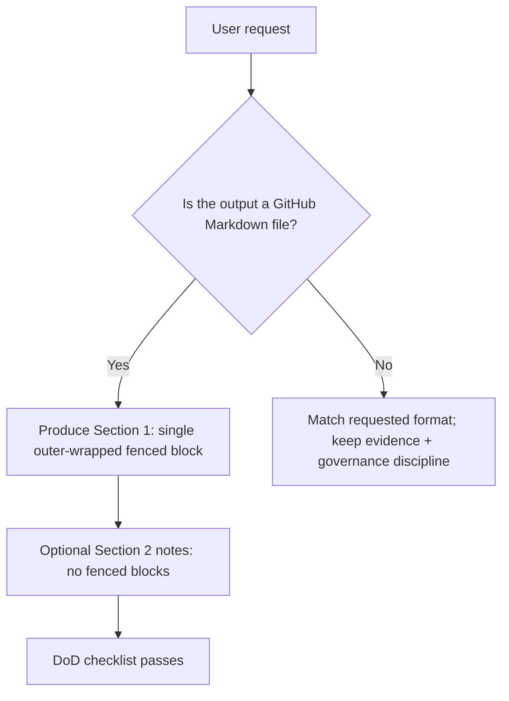

<!--
KFM MetaBlock v2
doc_id: kfm.std.llm-markdown-output.v1
title: KFM LLM Markdown Output Contract
status: Draft (operationally binding)
owners: KFM Maintainers + Governance Reviewers
created_utc: 2026-02-19
last_updated_utc: 2026-02-19
scope: Documentation + AI assistant outputs that generate GitHub Markdown files
sensitivity: Low
license: (not confirmed in repo)
governance:
  - FAIR: yes
  - CARE: yes
  - IDS: applicable-by-default (fail-closed if uncertain)
  - needs_governance_review: no
-->

# KFM LLM Markdown Output Contract

This document is the **non-negotiable formatting contract** for any AI-assisted output that produces a **GitHub Markdown file** for the Kansas Frontier Matrix (KFM) project.

> [!WARNING]
> Formatting quality is a governance feature. If the response format is wrong, it is treated as a **failed promotion gate** (fail-closed).

---

## Purpose

Ensure **Markdown output formatting is never overlooked or overridden**, especially the rule:

- **Exactly ONE** single fenced block containing the entire Markdown file
- **Outer fence wrapper** must prevent nested-fence breakage
- **Inside the fenced block:** only the Markdown file contents (**no commentary**)
- **Outside the fenced block (optional):** assumptions/TODOs/filename suggestions (**no fences**)
- **README.md must include an aligned + annotated directory tree**

---

## When this contract applies

This contract applies whenever the assistant is asked to produce:

- `README.md`
- Any `docs/*.md` standard, ADR, runbook, Story Node, API contract, etc.
- Any Markdown file intended to be copied into GitHub

It does **not** override a user’s explicit request for a different format (e.g., “output JSON only”), but it *does* apply whenever the requested format is a Markdown file.

---

## Required response structure

### Section 1 — GitHub Markdown

**The response MUST contain exactly one fenced code block** that contains the *entire* Markdown file.

- Use an **outer wrapper fence** (recommended: **four backticks**) so the Markdown file can safely contain triple-backtick code fences.
- Do not include any assistant commentary inside that block.
- Do not include additional fenced blocks anywhere else in the response.

### Section 2 — Outside-the-box notes (optional)

If needed, add text **after** the Markdown fence:

- assumptions
- TODOs
- alternatives
- filename suggestion(s)
- minimum verification steps

> [!NOTE]
> **Never** include any additional fenced code blocks in Section 2. If you must show literal code or commands, use inline code only.

---

## Outer fence wrapper standard

### Recommended outer wrapper

- **Outer wrapper:** 4 backticks  
- **Inner code fences inside the file:** 3 backticks

This prevents nested fences from prematurely closing the outer block.

#### Example: correct assistant response format

```text
````markdown
# Example Doc

Here is a code block inside the Markdown file:

```bash
echo "hello"
```
````
```

---

## README.md directory tree requirement

When producing `README.md`, it must include a directory layout that is:

- **Aligned** (monospace tree)
- **Annotated** (each directory has a short purpose)
- **Truthful** (do not invent repo structure)

> [!WARNING]
> If the actual repo structure is unknown, the tree must be labeled clearly as **“proposed skeleton (not confirmed in repo)”** and must not claim it already exists.

### Example tree format (template)

```text
repo-root/
  docs/                  # Governance + engineering docs
  services/              # Backend services (API gateway, ingest, etc.)
  ui/                    # Frontend map/story/focus UI
  infra/                 # IaC, deploy manifests, GitOps, CI
  data/                  # Data zones: raw/work/processed/published
  tools/                 # Validation + lint + release tooling
```

---

## Non-negotiable rules table

| Rule | Why it exists | Pass criteria | Common failure |
|---|---|---|---|
| Exactly one fenced block for the Markdown file | Copy/paste reliability; prevents partial docs | One and only one fence in the response | Multiple fences (even in “notes”) |
| Outer wrapper fence | Prevent nested fence breakage | Outer fence longer than any inner fence | Using triple backticks outer + triple inner |
| No commentary inside the Markdown fence | Doc purity; machine ingestion | Only Markdown file content inside | “Here you go…” inside the block |
| README includes directory tree | Repo onboarding + map-first navigation | Tree is aligned + annotated | Missing tree, or unannotated |
| No invented repo state | Evidence-first | Unknowns labeled “not confirmed in repo” | Presenting a tree as factual without evidence |

---

## “Fail-closed” decision rules

If there is any ambiguity about format, the assistant must choose the **most conservative, standards-compliant option**:

1. If the user asked for a Markdown file → apply this contract.
2. If uncertain whether it is a Markdown file → assume it is, and apply this contract.
3. If repo state is unknown → do **not** assert specifics; mark as **not confirmed in repo**.

> [!TIP]
> Treat formatting errors as equivalent to a broken CI gate. Fix them before “promotion.”

---

## Common failure modes and how to avoid them

### 1) Accidental second fence in “notes”
- **Bad:** adding a fenced block in Section 2  
- **Fix:** use inline code only in notes

### 2) Outer and inner fences collide
- **Bad:** outer fence uses ``` and the Markdown file contains ```  
- **Fix:** outer fence uses ````

### 3) Mixing formats
- **Bad:** “Here’s the doc” + partial Markdown + bullets outside the fence  
- **Fix:** Everything that belongs to the file goes inside the fence; everything else is optional notes after.

### 4) README tree claims directories that don’t exist
- **Bad:** stating “/services exists” without evidence  
- **Fix:** label as “proposed skeleton (not confirmed in repo)” or derive from repo inspection.

---

## Promotion gate checklist

Use this as a Definition of Done (DoD) for every Markdown doc output.

- [ ] Response contains **exactly one** fenced block for the Markdown file
- [ ] Outer wrapper fence prevents nested-fence collisions
- [ ] No assistant commentary exists inside the fenced block
- [ ] If README.md: includes aligned + annotated directory tree (truthful or labeled as proposed)
- [ ] Any unverified repo facts are labeled **(not confirmed in repo)**
- [ ] Governance flags included when relevant (sensitivity, licensing, access constraints)
- [ ] Links are plausible + stable (and link-check ready where applicable)
- [ ] Headings are stable and descriptive (retrieval-friendly)
- [ ] Tables/task lists/callouts used where they improve review + ingestion

---

## Minimal verification steps

If a doc depends on repo facts:

1. Verify directory structure exists (repo browse)  
2. Verify referenced filenames exist  
3. Verify any “standards” referenced are present (or label as not confirmed)

---

## Reference workflow diagram



---

## Change control

This contract is treated as a governed standard.

- Updates must preserve: **evidence-first**, **fail-closed**, and **trust membrane** principles.
- Any relaxation of “single fenced block” requires explicit governance approval.

> [!NOTE]
> If this contract conflicts with a higher-priority system instruction, the higher-priority instruction wins. Otherwise: this contract is binding.
