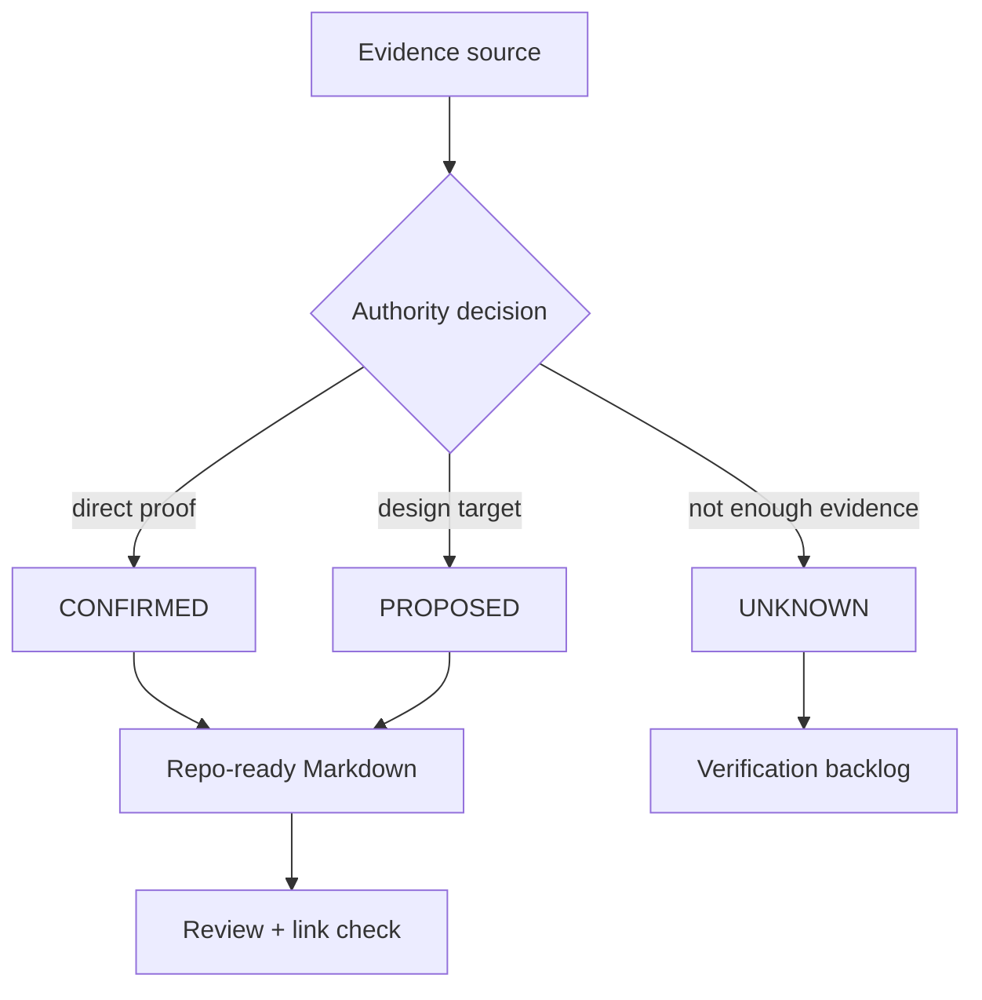
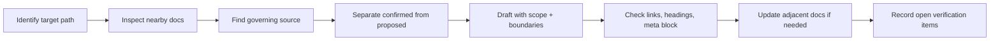

<!-- [KFM_META_BLOCK_V2]
doc_id: kfm://doc/REVIEW_REQUIRED_UUID
title: KFM Markdown Rules
type: standard
version: v1
status: draft
owners: @bartytime4life
created: NEEDS_VERIFICATION
updated: 2026-04-30
policy_label: NEEDS_VERIFICATION
related: [docs/standards/README.md, docs/standards/KFM_MARKDOWN_WORK_PROTOCOL.md, docs/standards/markdown-rules.md, docs/README.md, README.md, .github/CODEOWNERS, .github/PULL_REQUEST_TEMPLATE.md, .github/workflows/README.md, contracts/README.md, schemas/README.md, policy/README.md, tests/README.md]
tags: [kfm, documentation, markdown, standards, governance]
notes: [Task-facing mirror of docs/standards/KFM_MARKDOWN_WORK_PROTOCOL.md; protocol remains authoritative if this file diverges; owners grounded in current CODEOWNERS fallback; doc_id, created date, and policy_label still need active-repo verification.]
[/KFM_META_BLOCK_V2] -->

<a id="top"></a>

# `markdown-rules.md`

Concise, task-facing Markdown authoring brief for KFM contributors.

> [!IMPORTANT]
> This file is the quick guide.  
> The normative Markdown standard remains [`KFM_MARKDOWN_WORK_PROTOCOL.md`](./KFM_MARKDOWN_WORK_PROTOCOL.md). If the two files conflict, the protocol wins until maintainers explicitly consolidate or reassign authority.

> **Status:** experimental  
> **Document status:** draft  
> **Owners:** `@bartytime4life`  
> **Path:** `docs/standards/markdown-rules.md`  
> **Authority class:** task-facing mirror / authoring checklist  
> **Repo fit:** standards-lane quick reference under [`./README.md`](./README.md), aligned to [`./KFM_MARKDOWN_WORK_PROTOCOL.md`](./KFM_MARKDOWN_WORK_PROTOCOL.md), and downstream from the documentation control plane in [`../README.md`](../README.md).  
> **Quick jump:** [Scope](#scope) · [Repo fit](#repo-fit) · [Accepted inputs](#accepted-inputs) · [Exclusions](#exclusions) · [Core rules](#core-rules) · [Document types](#document-types) · [Formatting](#formatting) · [Evidence](#evidence-and-truth-labels) · [Workflow](#authoring-workflow) · [Definition of done](#definition-of-done) · [FAQ](#faq) · [Appendix](#appendix)


---

## Scope

Use this brief when you need to quickly make Markdown more KFM-native, more reviewable, and less likely to overclaim.

This file is for:

- cleaning up Markdown before a PR;
- drafting or revising README-like docs;
- adding a metadata block correctly;
- checking headings, links, tables, callouts, diagrams, and examples;
- deciding when to mark a claim `CONFIRMED`, `INFERRED`, `PROPOSED`, `UNKNOWN`, or `NEEDS VERIFICATION`;
- keeping standards prose aligned with evidence, policy, review state, and downstream proof burden.

This file is not for:

- defining new doctrine;
- replacing [`KFM_MARKDOWN_WORK_PROTOCOL.md`](./KFM_MARKDOWN_WORK_PROTOCOL.md);
- proving CI, runtime, branch protection, workflow enforcement, source activation, release state, or policy coverage;
- moving machine schemas, Rego policy, fixtures, source descriptors, receipts, proofs, catalogs, or release manifests into prose.

[Back to top](#top)

---

## Repo fit

| Relationship | Path | Role |
|---|---|---|
| This file | `docs/standards/markdown-rules.md` | Fast task-facing checklist for KFM Markdown |
| Normative protocol | [`./KFM_MARKDOWN_WORK_PROTOCOL.md`](./KFM_MARKDOWN_WORK_PROTOCOL.md) | Authoritative Markdown authoring and review protocol |
| Standards index | [`./README.md`](./README.md) | Routing surface for standards docs and standards-lane boundaries |
| Documentation hub | [`../README.md`](../README.md) | Documentation control-plane landing page |
| Repo root | [`../../README.md`](../../README.md) | Project identity, top-level navigation, and repo-wide orientation |
| Review routing | [`../../.github/CODEOWNERS`](../../.github/CODEOWNERS), [`../../.github/PULL_REQUEST_TEMPLATE.md`](../../.github/PULL_REQUEST_TEMPLATE.md) | Ownership and PR evidence expectations |
| Machine meaning | [`../../contracts/README.md`](../../contracts/README.md), [`../../schemas/README.md`](../../schemas/README.md) | Contracts and schemas that prose must not silently replace |
| Policy and verification | [`../../policy/README.md`](../../policy/README.md), [`../../tests/README.md`](../../tests/README.md) | Policy rules, deny reasons, tests, fixtures, and validation evidence |

### Boundary rule

| Surface | Job | Not allowed to do |
|---|---|---|
| `markdown-rules.md` | Give maintainers a fast checklist | Become a second standard |
| `KFM_MARKDOWN_WORK_PROTOCOL.md` | Define the governing Markdown protocol | Hide uncertainty or implementation gaps |
| `docs/standards/README.md` | Route standards work to the right file | Prove enforcement |
| Contracts / schemas / policy / tests | Prove or execute rules | Be replaced by narrative prose |

[Back to top](#top)

---

## Accepted inputs

Put Markdown guidance here only when it helps contributors write, revise, or review Markdown consistently.

| Input | Belongs here when… | Route elsewhere when… |
|---|---|---|
| Quick Markdown checklist | The rule helps authors prepare a doc for review | The rule changes the normative protocol |
| Formatting guidance | It covers headings, tables, links, callouts, Mermaid, details blocks, or code fences | It requires a linter, validator, or CI workflow change |
| Truth-label reminders | It helps authors avoid overclaiming | It defines a new evidence tier or doctrine |
| README-like structure | It summarizes the expected shape of repo landing docs | It changes a directory README’s scope or authority |
| Metadata reminder | It restates the required `KFM_META_BLOCK_V2` pattern | It changes metadata semantics, schema, or validation |
| Review checklist | It helps reviewers catch common Markdown failures | It becomes a policy gate, workflow, or required check |

[Back to top](#top)

---

## Exclusions

Do not hide implementation, policy, evidence, or release objects inside Markdown prose.

| Do not place here | Use instead | Why |
|---|---|---|
| New normative Markdown protocol | [`./KFM_MARKDOWN_WORK_PROTOCOL.md`](./KFM_MARKDOWN_WORK_PROTOCOL.md) | This file is a mirror, not the authority |
| Machine-readable schemas | `schemas/**` or repo-confirmed schema home | Schemas must remain executable |
| Human-readable object contracts | `contracts/**` | Contracts own object boundaries and field semantics |
| Executable policy | `policy/**` | Policy must be testable and deny-capable |
| Fixtures or golden examples | `tests/**` or repo-confirmed fixture home | Fixtures support validation |
| Source descriptors and registries | `data/registry/**` or repo-confirmed source lane | Source authority is not a Markdown checklist |
| Receipts, proofs, catalogs, release manifests | `data/receipts/**`, `data/proofs/**`, `data/catalog/**`, `release/**`, or repo-confirmed emitted-artifact lane | These are process memory and release evidence |
| Runtime routes, DTOs, adapters, UI components | App/package lanes confirmed by repo inspection | Code implements behavior; docs explain boundaries |
| Exploratory packet content | `docs/intake/**` or `docs/archive/exploratory/**` when present | Exploratory material must not become accidental authority |

[Back to top](#top)

---

## Core rules

### 1. Use one H1

Every Markdown file should have exactly one `#` heading.

```markdown
# Good Title

One-line purpose.
```

Avoid multiple H1s, decorative H1s, or file names that do not match the document’s role.

### 2. Start with purpose

The first visible line after the title should tell the reader why the file exists.

Good:

```markdown
# Hydrology Source Registry

Human-readable source registry for KFM hydrology inputs, source roles, rights posture, and activation state.
```

Weak:

```markdown
# Hydrology

This document contains information.
```

### 3. Make scope and non-goals explicit

Every substantial doc should answer:

- What belongs here?
- What does not belong here?
- What upstream surface governs this file?
- What downstream surface depends on this file?
- What would prove a stronger claim?

### 4. Label uncertainty where it matters

Use the narrowest truthful label:

| Label | Use when… |
|---|---|
| `CONFIRMED` | Direct evidence supports the statement from inspected repo files, supplied doctrine, generated artifacts, tests, logs, or current verified source evidence |
| `INFERRED` | Strong evidence supports the conclusion, but the claim is not directly proven |
| `PROPOSED` | The statement is a recommendation, target, design move, or future file/path |
| `UNKNOWN` | The evidence is not strong enough to state safely |
| `NEEDS VERIFICATION` | A concrete check is required before relying on the claim |

Do not upgrade uncertainty because the prose sounds plausible.

### 5. Do not overclaim enforcement

Never write:

- “CI enforces this” unless workflow files, runs, and platform settings support it.
- “This route exists” unless the route file or runtime evidence was inspected.
- “This policy denies…” unless the policy rule, tests, or decision artifact is visible.
- “This artifact is published” unless the release/promotion evidence exists.
- “This owner is active” unless CODEOWNERS, team access, or stewardship records confirm it.

### 6. Link instead of duplicating

Prefer:

```markdown
See [`../../contracts/README.md`](../../contracts/README.md) for contract-surface routing.
```

Avoid copying authoritative content into a second surface.

### 7. Keep KFM’s trust path visible

Docs should not flatten KFM’s core lifecycle:

```text
RAW → WORK / QUARANTINE → PROCESSED → CATALOG / TRIPLET → PUBLISHED
```

Public or semi-public claims should remain downstream of evidence, source role, policy posture, review state, release state, and correction lineage.

### 8. Keep AI and renderers downstream

Map views, 3D scenes, dashboards, story pages, summaries, and model answers are not sovereign truth. They are downstream surfaces that must point back to evidence, policy, review, and release state.

[Back to top](#top)

---

## Document types

Use the shape that fits the file. Do not pad docs with empty sections.

| Document type | Required baseline | Useful additions |
|---|---|---|
| Standard doc | `KFM_META_BLOCK_V2`, title, purpose, scope, repo fit, rules, exclusions, review checklist | Examples, diagrams, put-it-here tables |
| README-like doc | Title, one-line purpose, impact block, repo fit, accepted inputs, exclusions, quick jumps | Directory tree, quickstart, diagram, FAQ |
| Directory README | Scope, repo fit, inputs, exclusions, directory tree, usage | Mermaid map, task list, appendix |
| ADR | Decision, context, options, consequences, validation, rollback, supersession | Evidence table, affected files |
| Runbook | Preconditions, steps, expected outputs, failure modes, rollback, receipts | Dry-run command, checklist |
| Domain doc | Lane scope, source roles, evidence burden, sensitivity, public posture, open gaps | Source matrix, policy table |
| Report | Evidence basis, method, results, unknowns, recommendations | Appendix, command transcript |
| Template | Minimal reusable shape | Placeholder rules and examples |

[Back to top](#top)

---

## Required metadata block

Standard docs should start with `KFM_META_BLOCK_V2` unless a documented repo exception exists.

Use placeholders when values are not verified. Do not invent UUIDs, policy labels, owners, dates, or related paths.

```markdown
<!-- [KFM_META_BLOCK_V2]
doc_id: kfm://doc/REVIEW_REQUIRED_UUID
title: <Title>
type: standard
version: v1
status: draft
owners: <owner or NEEDS_VERIFICATION>
created: NEEDS_VERIFICATION
updated: YYYY-MM-DD
policy_label: NEEDS_VERIFICATION
related: [<relative paths or kfm:// ids>]
tags: [kfm]
notes: [<short review notes>]
[/KFM_META_BLOCK_V2] -->
```

### Metadata rules

| Field | Rule |
|---|---|
| `doc_id` | Use a verified ID or a reviewable placeholder |
| `title` | Match the visible H1 in substance |
| `type` | Use `standard` for standard docs unless another documented type applies |
| `status` | Use `draft`, `review`, or `published` only when supported |
| `owners` | Use CODEOWNERS or steward evidence; otherwise mark `NEEDS_VERIFICATION` |
| `created` / `updated` | Use verified dates; current revision date may be used for `updated` when this is the revision output |
| `policy_label` | Use verified policy label or `NEEDS_VERIFICATION` |
| `related` | Prefer repo-relative paths that are expected to exist; mark uncertainty in notes |
| `notes` | Keep short and reviewable |

[Back to top](#top)

---

## Formatting

### Headings

- Use a clean hierarchy.
- Keep headings informative.
- Preserve stable anchors when revising existing docs unless the change is worth the breakage.
- Use one H1 only.

### Paragraphs

Prefer short paragraphs with one job each.

Avoid long uninterrupted blocks, especially in architecture, policy, and standards docs.

### Lists

Use bullets for concepts. Use numbers for ordered steps.

Good:

```markdown
1. Inspect evidence.
2. Draft the change.
3. Validate links.
4. Record unknowns.
```

### Tables

Use tables for matrices, routing decisions, status summaries, file responsibilities, ownership, and comparison.

Leave a blank line before every table.

### Code fences

Always language-tag code blocks.

```bash
# Run from the repository root.
git status --short
find docs/standards -maxdepth 2 -type f | sort
```

```json
{
  "truth_posture": "NEEDS_VERIFICATION",
  "reason": "Fixture and validator not inspected"
}
```

Use `text` for plain examples that are not executable.

### Callouts

Use GitHub callouts only when they add value:

```markdown
> [!NOTE]
> Use this for helpful context.

> [!IMPORTANT]
> Use this for rules reviewers must not miss.

> [!WARNING]
> Use this for risk, breakage, or exposure concerns.
```

Allowed callout labels:

- `NOTE`
- `TIP`
- `IMPORTANT`
- `WARNING`
- `CAUTION`

Do not nest callouts.

### Mermaid diagrams

Use Mermaid only when structure, flow, or boundaries become clearer.



### Details blocks

Use `<details>` for long examples, appendices, or reference material. Do not hide critical rules.

```markdown
<details>
<summary>Long example</summary>

Example content.

</details>
```

### Images

When images are used:

- use repo-relative paths;
- include meaningful alt text;
- avoid decorative-only images in standards docs;
- use `<picture>` when light/dark variants are required.

[Back to top](#top)

---

## Evidence and truth labels

KFM docs are truth surfaces. A polished doc that hides uncertainty is worse than a rough doc that preserves evidence boundaries.

### Claim test

Before writing “the repo contains,” “CI enforces,” “the API returns,” “the policy blocks,” or “the layer is published,” ask:

| Question | If no… |
|---|---|
| Did I inspect the file, test, workflow, manifest, log, dashboard, or emitted artifact? | Use `UNKNOWN` or `NEEDS VERIFICATION` |
| Is this a doctrine claim rather than implementation behavior? | Say it is doctrine |
| Is this a future design? | Use `PROPOSED` |
| Is this inferred from adjacent evidence? | Use `INFERRED` |
| Is this based on an exploratory packet? | Treat as exploratory unless promoted |
| Could rights, sensitivity, sovereignty, living-person, public-location, or release state matter? | Fail closed and mark the release burden |

### Strong phrasing

Use:

```markdown
CONFIRMED: The checked-in README states this directory’s intended scope.

PROPOSED: Add a validator for this fixture family.

UNKNOWN: Runtime behavior has not been verified in this session.

NEEDS VERIFICATION: Branch protection and required checks must be checked in GitHub settings.
```

Avoid:

```markdown
The system guarantees this.
This route is live.
This workflow blocks bad releases.
The map proves the claim.
The AI answer is authoritative.
```

[Back to top](#top)

---

## Authoring workflow

Use this workflow for non-trivial Markdown changes.



### Step checklist

1. Identify the target file and document type.
2. Inspect nearby README files, standards docs, protocols, ADRs, contracts, schemas, tests, policy docs, workflows, and examples when available.
3. Identify the governing source: protocol, standard, doctrine, ADR, contract, schema, policy, or repo evidence.
4. Preserve existing strong material.
5. Add missing scope, repo fit, accepted inputs, exclusions, truth posture, and review gates.
6. Use placeholders rather than invented metadata.
7. Link to authoritative surfaces instead of duplicating them.
8. Add a diagram only if it explains a real structure or flow.
9. Run or request link, anchor, metadata, and Markdown checks.
10. Record unresolved verification items.

[Back to top](#top)

---

## Definition of done

A Markdown change is ready for review when all applicable items are true.

- [ ] One H1 only.
- [ ] Purpose line appears directly below the title.
- [ ] `KFM_META_BLOCK_V2` is present for standard docs unless a documented exception applies.
- [ ] Status, owners, path, and policy label are verified or clearly marked `NEEDS VERIFICATION`.
- [ ] Scope is explicit.
- [ ] Accepted inputs and exclusions are clear when the file routes work.
- [ ] Repo fit identifies upstream and downstream surfaces.
- [ ] Truth labels are used where confidence matters.
- [ ] Implementation, CI, runtime, release, source-registry, and policy claims are not upgraded without evidence.
- [ ] Relative links are checked from the target file location.
- [ ] Code fences are language-tagged.
- [ ] Tables are used where they clarify routing or status.
- [ ] Mermaid diagrams are meaningful, not decorative.
- [ ] Long reference material is wrapped in `<details>` when appropriate.
- [ ] Sensitive release, rights, sovereignty, living-person, cultural, exact-location, or public-safety concerns are visible.
- [ ] Adjacent README, protocol, standard, ADR, contract, schema, policy, test, or runbook surfaces are updated when the change affects them.
- [ ] Unknowns are recorded as `UNKNOWN`, `NEEDS VERIFICATION`, an ADR candidate, or a backlog item.
- [ ] The change does not create a second authority beside a stronger neighboring file.

[Back to top](#top)

---

## Quick inspection commands

> [!NOTE]
> These commands are review helpers, not proof that enforcement exists. Use repo-native tooling if the active checkout provides it.

```bash
# Run from the repository root.
git status --short
find docs/standards -maxdepth 2 -type f | sort
find docs/standards -maxdepth 2 -type d | sort
```

```bash
# Basic metadata and heading scan.
grep -RIn "KFM_META_BLOCK_V2\|^# " docs/standards | sed -n '1,200p'
```

```bash
# Check expected companion files for this brief.
test -f docs/standards/README.md
test -f docs/standards/KFM_MARKDOWN_WORK_PROTOCOL.md
test -f docs/standards/markdown-rules.md
```

When a check fails, do not invent a new home. Mark the gap `NEEDS VERIFICATION`, update the routing table, or open the smallest ADR/backlog item needed to resolve the mismatch.

[Back to top](#top)

---

## FAQ

### Is this file the Markdown standard?

No. This file is the quick checklist. The standard is [`KFM_MARKDOWN_WORK_PROTOCOL.md`](./KFM_MARKDOWN_WORK_PROTOCOL.md).

### Why keep both files?

The protocol says what must be true. This file helps contributors apply the protocol quickly.

### What if this file and the protocol disagree?

The protocol wins. Update both files or record a maintainer decision to consolidate them.

### Can I add a rule here first?

Only if it is clearly a quick-guide restatement or marked `PROPOSED`. Normative rule changes belong in the protocol and may require adjacent updates to templates, PR review, docs tooling, or validation checks.

### Do all docs need badges?

README-like docs and major landing docs should include a compact impact block with badges. Standard docs may include badges when they improve scanability, but badges never prove enforcement.

### Do all docs need diagrams?

No. Use Mermaid when a real flow, boundary, lifecycle, or responsibility map becomes clearer. Do not add decorative diagrams.

### Can a standard say a policy is enforced?

Only with direct evidence. A standard may say “this policy should deny” as `PROPOSED`, but “this policy denies” requires inspected policy, fixture, test, decision artifact, or runtime evidence.

[Back to top](#top)

---

## Appendix

### Short authoring pattern

1. Identify document type.
2. Inspect repo context.
3. Find governing authority.
4. Write purpose and scope.
5. Add repo fit.
6. Add accepted inputs and exclusions when routing matters.
7. Add rules, examples, or tables.
8. Label uncertainty.
9. Check links and anchors.
10. Update adjacent docs if the change affects them.

### Maintenance triggers

Update this file when:

- [`KFM_MARKDOWN_WORK_PROTOCOL.md`](./KFM_MARKDOWN_WORK_PROTOCOL.md) changes;
- [`./README.md`](./README.md) reroutes standards surfaces;
- README-like doc requirements change;
- `KFM_META_BLOCK_V2` fields change;
- docs tooling begins enforcing a rule described here;
- truth-label vocabulary changes;
- a maintainer consolidates this file with the protocol;
- a repo inspection proves that current assumptions about owners, policy labels, or validation need correction.

### Final rule

Make the Markdown pleasant to read, but never make it more confident than the evidence.

[Back to top](#top)
