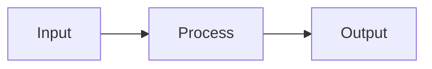

<div align="center">

# 🧾 **Kansas Frontier Matrix — Markdown Styling & Documentation Guide**  
`docs/standards/markdown_guide.md`

**Purpose:** Establish consistent formatting, layout, and stylistic conventions for all documentation in the Kansas Frontier Matrix (KFM).  
These rules align with **Master Coder Protocol (MCP v6.3)**, **Platinum README Template v7.1**, and **FAIR+CARE** standards to ensure clarity, accessibility, and interoperability across all Markdown documents.

[](../README.md)
[](../../LICENSE)
[](faircare.md)
[]()

</div>

---

## 📘 Overview

All Markdown documentation in KFM follows **GitHub-Flavored Markdown (GFM)** with standardized:

- **YAML front-matter** for provenance and governance  
- **Emoji-enhanced headers** for fast scanning and semantic tagging  
- **Table-focused layout** for structured information  
- **Version history + footer** for traceability and licensing

Every file:

- Begins with a **YAML metadata header**  
- Follows a predictable **section hierarchy**  
- Includes **badges and contextual metadata**  
- Ends with **Version History** and a **governance footer**

See also: [`markdown_rules.md`](markdown_rules.md) for strict structural rules.

---

## 🧱 Structure of a KFM Document

Each document begins with a **YAML Front-Matter Block** and a **center-aligned title block**.

### 🧾 YAML Front-Matter Example

```yaml
---
title: "🏗️ Kansas Frontier Matrix — System Architecture"
path: "src/ARCHITECTURE.md"
version: "v10.2.2"
last_updated: "2025-11-12"
review_cycle: "Quarterly / Autonomous"
commit_sha: "<latest-commit-hash>"
sbom_ref: "releases/v10.2.0/sbom.spdx.json"
manifest_ref: "releases/v10.2.0/manifest.zip"
telemetry_ref: "releases/v10.2.0/focus-telemetry.json"
telemetry_schema: "schemas/telemetry/system-architecture-v2.json"
governance_ref: "docs/standards/governance/ROOT-GOVERNANCE.md"
license: "CC-BY 4.0"
mcp_version: "MCP-DL v6.3"
---
```

### 🧩 Title Block Pattern

Each document must begin with:

- `<div align="center">` wrapper  
- A **primary title (`#`)** with emoji and bold name  
- A **path identifier** in backticks  
- A concise **Purpose** statement  
- Badges (Docs · MCP, License, FAIR+CARE, Status)

```markdown
<div align="center">

# 🧩 **Kansas Frontier Matrix — Governance Architecture**
`docs/standards/governance/ROOT-GOVERNANCE.md`

**Purpose:** Define the ethical and technical governance structure for KFM, aligned with FAIR+CARE and MCP frameworks.

[](../README.md)
[](../../LICENSE)
[](faircare.md)
[]()

</div>
```

---

## 🧩 Section Hierarchy

| Level | Markdown Symbol | Purpose | Example |
|---|---|---|---|
| H1 | `#` | Document title (used once). | `# 🏗️ Kansas Frontier Matrix — Architecture` |
| H2 | `##` | Major sections (Overview, Directory Layout, etc.). | `## 📘 Overview` |
| H3 | `###` | Subsections or technical detail. | `### ⚙️ Workflow Integration` |
| H4 | `####` | Optional nested subsections (use sparingly). | `#### 🧩 Dependencies` |

**Rules**

- H1 appears **once** per document.  
- H2–H3 headings must include a relevant emoji prefix.  
- Maintain logical hierarchy; do not skip levels (H1 → H3 directly).

---

## 🧾 General Markdown Formatting

| Element | Rule | Example |
|---|---|---|
| Lists | Use `-` for unordered; `1.` for ordered lists; 2-space indent. | `- Item` |
| Code Blocks | Always specify language. | ```json { "ok": true } ``` |
| Inline Code | Use for paths, commands, or literals. | `` `data/checksums/manifest.json` `` |
| Links | Prefer relative paths; avoid hard-coded GitHub URLs. | `[see architecture](../../src/ARCHITECTURE.md)` |
| Tables | Min. 3 columns; use `—` for N/A; keep width reasonable (~100 chars). | `| Field | Desc | Example |` |
| Quotes | Use `>` for guidance or important notes. | `> Best practice: ...` |
| Horizontal Rules | Use `---` between major sections. | `---` |
| Emojis | Required on H1–H3 section titles. | `## ⚙️ Configuration` |

---

## 🧮 Front-Matter: Required vs Optional

Front-matter validation is handled by `docs-lint.yml` and must conform to project schemas.

| Field | Description | Required |
|---|---|---|
| `title` | Descriptive title with emoji. | ✅ |
| `path` | Repo-relative path. | ✅ |
| `version` | Document version (SemVer). | ✅ |
| `last_updated` | ISO date. | ✅ |
| `review_cycle` | e.g., `Quarterly / Autonomous`. | ✅ |
| `commit_sha` | Git SHA or `<latest-commit-hash>`. | ✅ |
| `sbom_ref` | Path to SBOM (`*.spdx.json`). | ⚙️ |
| `manifest_ref` | Path to release manifest (`*.zip`). | ⚙️ |
| `telemetry_ref` | Path to telemetry ledger. | ⚙️ |
| `telemetry_schema` | Telemetry schema for docs. | ⚙️ |
| `governance_ref` | Path to governance charter. | ✅ |
| `license` | SPDX identifier. | ✅ |
| `mcp_version` | MCP documentation version. | ✅ |

---

## 🧠 Visual & Stylistic Conventions

| Component | Style | Example |
|---|---|---|
| File Path | Lowercase, monospaced, repo-relative. | `` `docs/standards/README.md` `` |
| Keywords | Bold for important concepts. | **FAIR+CARE**, **MCP-DL v6.3** |
| Badges | Shields.io, consistent color palette. | Docs (blue), License (green), FAIR+CARE (orange) |
| Text Tone | Neutral, concise, technically precise. | Avoid slang; define acronyms. |

---

## 🧩 Mermaid Diagram Guidelines

- At most **one diagram per section**.  
- Use `flowchart TD` or `flowchart LR` only.  
- Quote all node labels and keep diagram succinct.



---

## 🧮 Example: Standard Layout

```markdown
---
title: "🌾 Kansas Frontier Matrix — Overview"
path: "README.md"
version: "v10.2.2"
last_updated: "2025-11-12"
review_cycle: "Quarterly / Autonomous"
commit_sha: "<latest-commit-hash>"
sbom_ref: "releases/v10.2.0/sbom.spdx.json"
manifest_ref: "releases/v10.2.0/manifest.zip"
telemetry_ref: "releases/v10.2.0/focus-telemetry.json"
telemetry_schema: "schemas/telemetry/docs-readme-v2.json"
governance_ref: "docs/standards/governance/ROOT-GOVERNANCE.md"
license: "CC-BY 4.0"
mcp_version: "MCP-DL v6.3"
---

<div align="center">

# 🌾 **Kansas Frontier Matrix — Open Historical Data System**
`README.md`

**Purpose:** Provide an overview of the Kansas Frontier Matrix repository and its governance architecture in alignment with MCP v6.3 and FAIR+CARE standards.

[](docs/README.md)
[](LICENSE)
[](docs/standards/faircare.md)
[]()

</div>

---

## 📘 Overview

Kansas Frontier Matrix is an open data initiative that unites Kansas’s historical, cultural, and environmental archives into a geospatial knowledge platform.

## 🕰️ Version History

| Version | Date | Author | Summary |
|---|---|---|---|
| v10.2.2 | 2025-11-12 | A. Barta | Example of compliant Markdown under v10.2.0 release references. |

---

<div align="center">

**© 2025 Kansas Frontier Matrix — CC-BY 4.0**  
Maintained under **Master Coder Protocol v6.3** · FAIR+CARE Certified  
[Back to Documentation Index](docs/README.md)

</div>
```

---

## ⚙️ Linting & Enforcement

**Primary Workflow:** `.github/workflows/docs-lint.yml`

This workflow enforces:

- Front-matter presence and schema conformance.  
- Correct title block, badges, and footer.  
- Emoji use in H1–H3 headings.  
- Valid links and UTF-8 encoding.  
- Table and code block formatting rules.

Violations are reported to:

- `reports/self-validation/docs/lint_summary.json`  
- `reports/self-validation/docs/violations.ndjson` (or equivalent)

---

## ⚖️ FAIR+CARE Documentation Alignment

| Principle | Implementation |
|---|---|
| **Findable** | Front-matter fields enable index-based discovery. |
| **Accessible** | Simple Markdown, alt-text, and clear language. |
| **Interoperable** | YAML headers align with DCAT/STAC and KFM telemetry schemas. |
| **Reusable** | Open license, version history, and provenance tracking. |
| **CARE** | Guidelines encourage inclusive, respectful, and culturally aware content. |

---

## 🕰️ Version History

| Version | Date | Author | Summary |
|---|---|---|---|
| v10.2.2 | 2025-11-12 | A. Barta | Updated release references to v10.2.0; clarified Mermaid and badge rules; aligned with updated docs-lint CI behavior. |
| v10.0.0 | 2025-11-10 | A. Barta | Aligned telemetry/SBOM/manifest refs; added `telemetry_schema` to required fields. |
| v9.7.0 | 2025-11-05 | A. Barta | Added comprehensive styling guidelines for headings, tables, and code blocks. |
| v9.5.0 | 2025-10-20 | A. Barta | Expanded rules for YAML headers and standardized footers. |
| v9.0.0 | 2025-06-01 | KFM Core Team | Established overall Markdown documentation baseline. |

---

<div align="center">

**© 2025 Kansas Frontier Matrix — CC-BY 4.0**  
Governed under **Master Coder Protocol v6.3** · FAIR+CARE Certified · Diamond⁹ Ω / Crown∞Ω Ultimate Certified  
[Back to Standards Index](README.md) · [Root Governance Charter](governance/ROOT-GOVERNANCE.md)

</div>