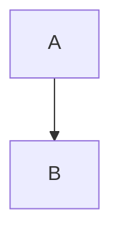

<div align="center">

# 📑 **Kansas Frontier Matrix — Markdown Authoring Guide**  
`docs/standards/markdown_guide.md`

**Purpose**  
Define the **authoritative writing, structure, and formatting rules** for all Kansas Frontier Matrix (KFM) Markdown documents.  
These rules ensure **consistency, accessibility, governance compliance, version integrity**, and full alignment with **KFM-MDP v10.4.3**.

</div>

---

# 📘 Overview

This guide defines the **required Markdown structure**, including:

- Mandatory **YAML front matter**
- Centered title block + purpose block
- Directory layout rules using KFM **lined ASCII style**
- Mermaid diagram standards
- Accessibility & FAIR+CARE metadata expectations
- Code-block rules
- Document versioning & provenance expectations
- What is *forbidden* in KFM Markdown

All Markdown files in KFM MUST comply with these standards or they will be rejected by CI (`docs-lint.yml`).

---

# 🧩 KFM Markdown Structure (Required)

Every Markdown file MUST follow this structure:

```markdown
---
<YAML front matter metadata>
---

<div align="center">

# <Document Title with Emoji>  
`<repo/path/to/file.md>`

**Purpose:**  
<One or two sentences max explaining purpose.>

</div>

---

# 📘 Overview

<Summary section>

# 🗂️ Directory Layout

<Indented ASCII-lined layout>

# 🧩 Core Sections

<Depends on document type>

# 🛠️ Examples

<Code, JSON, styles, etc.>

# ⚙️ Validation / CI Requirements

<Required checks or workflows>

# 🕰️ Version History

<Table must follow KFM style>
````

Anything outside this structure is disallowed.

---

# 🧱 YAML Front Matter Requirements

Every Markdown MUST include YAML with the following:

### **Required fields**

| Field                       | Description                                    |
| --------------------------- | ---------------------------------------------- |
| `title`                     | Document title with emoji + certification mark |
| `path`                      | Exact repository path to file                  |
| `version`                   | SemVer version                                 |
| `last_updated`              | ISO date                                       |
| `review_cycle`              | Approved maintenance cycle                     |
| `commit_sha`                | Placeholder replaced by CI                     |
| `sbom_ref`                  | SPDX reference                                 |
| `manifest_ref`              | Release manifest                               |
| `telemetry_ref`             | Telemetry JSON reference                       |
| `telemetry_schema`          | Telemetry JSON Schema reference                |
| `governance_ref`            | Governance root reference                      |
| `license`                   | MIT or CC-BY                                   |
| `mcp_version`               | MCP-DL version                                 |
| `markdown_protocol_version` | Current KFM-MDP version                        |
| `status`                    | Active / Deprecated / Draft                    |
| `doc_kind`                  | Architecture / Standard / Guide / Overview     |
| `intent`                    | High-level purpose                             |
| `semantic_document_id`      | Stable doc identifier                          |
| `doc_uuid`                  | Global URN                                     |
| `machine_extractable`       | true/false                                     |
| `fair_category`             | FAIR category code (e.g. `F1-A1-I1-R1`)        |
| `care_label`                | CARE label (e.g. `Public / Low-Risk`)          |
| `accessibility_compliance`  | Accessibility standard (e.g. `WCAG 2.1 AA`)    |
| `immutability_status`       | Immutability status (e.g. `version-pinned`)    |

### **Optional Fields**

* `ontology_alignment`
* `ai_transform_permissions`
* `ai_transform_prohibited`
* `ai_focusmode_usage`

> ❗ **YAML front matter must be the first content in the file. No whitespace above it.**
> ❗ **No tabs, no trailing spaces, no unregistered fields.**

---

# 🗂️ Directory Layout Rules

Use the **KFM Lined ASCII Layout**:

```text
docs/
│
└── standards/
    │
    ├── markdown_guide.md       # This file
    ├── governance/
    │   └── ROOT-GOVERNANCE.md
    └── templates/
        └── README-template.md
```

Rules:

* Use **│**, **├──**, **└──** for tree lines.
* Indentation MUST be consistent (4 spaces).
* Comments appear after two spaces following the path.
* The final code fence MUST NOT have blank lines inside.

---

# 🎨 Heading Rules

### ✔️ Allowed

```markdown
# (document title)
## Section
### Subsection
```

### ❌ Forbidden

* #### Heading level 4–6
* Multiple H1 headings
* Markdown titles without emojis

---

# 📐 Markdown Styling Rules

### ✔️ Required

* Single-space indentation inside lists
* Tables must use **consistent pipes**
* All images must include **alt text**
* Use **backticks** ONLY for code/samples
* Use **one blank line** between sections

### ❌ Forbidden

* HTML except for `<div align="center">`
* Inline styles other than center div
* Non-monospaced ASCII diagrams
* Raw URLs (must use proper link labels)

---

# 🎨 Mermaid Diagram Rules

All Mermaid blocks MUST begin with:

````markdown

````

### Mermaid DOs

* Use **TD** or **LR** direction only
* Style-free: **NO CSS**, no Mermaid theme overrides
* No parentheses around node names
* No trailing blank lines inside the code fence

### Mermaid DON’Ts

* No complex styling (colors, classes)
* No spaces after the code-fence start
* No multiline HTML in Mermaid nodes

---

# 📝 Code & JSON Block Standards

* Use **triple backticks**, no indentation.
* Always specify language: `ts`, `json`, `text`, `bash`, `python`, etc.
* No trailing whitespace.
* JSON MUST be valid (CI checks).

Example:

```json
{
  "id": "example",
  "name": "KFM",
  "active": true
}
```

---

# ♿ Accessibility Requirements

All Markdown must be:

* Keyboard-navigable when rendered
* WCAG 2.1 AA compliant
* Color-blind safe (when diagrams include color)
* Screen-reader friendly (tables & alt text)

Use descriptive alt text:

```markdown

```

---

# 🔐 FAIR+CARE Compliance Rules

All Markdown content MUST:

* Indicate any **cultural sensitivity warnings**
* Avoid disclosing coordinates of sensitive sites
* Only include icons, symbols, or maps that pass CARE-level checks
* Declare licensing clearly (MIT for code, CC-BY for docs)

If content involves Indigenous data:

```yaml
care_label: "C2-A2-R2-E2"
sensitivity_level: "High"
public_exposure_risk: "Medium"
```

---

# 🧪 Validation & CI Enforcement

Markdown is automatically validated via:

* `docs-lint.yml` → formatting, headings, front matter
* `faircare-validate.yml` → ethics & governance
* `broken-link-check.yml` → internal & external link validation
* `markdown-protocol-validate.yml` → KFM-MDP v10.4.x enforcement

Documents that fail ANY check cannot be merged.

---

# 🧱 Forbidden Content

| Category                              | Explanation               |
| ------------------------------------- | ------------------------- |
| Raw coordinates of protected sites    | CARE violation            |
| Auto-generated HTML                   | Breaks accessibility      |
| Direct URLs without labels            | Violates link rules       |
| Screenshots with no alt text          | Accessibility fail        |
| Bare filenames                        | Must be formatted as code |
| Semantic drift from field definitions | Governance fail           |

---

# 🧩 Example Minimal KFM-Compliant Markdown

````markdown
---
title: "🧭 Example KFM Doc"
path: "docs/examples/example.md"
version: "v1.0.0"
last_updated: "2025-11-16"
review_cycle: "Annual"
commit_sha: "<latest>"
sbom_ref: "../../releases/v1/sbom.spdx.json"
manifest_ref: "../../releases/v1/manifest.zip"
telemetry_ref: "../../releases/v1/telemetry.json"
telemetry_schema: "../../schemas/telemetry/example.schema.json"
governance_ref: "../standards/governance/ROOT-GOVERNANCE.md"
license: "CC-BY 4.0"
mcp_version: "MCP-DL v6.3"
markdown_protocol_version: "KFM-MDP v10.4.3"
status: "Active"
doc_kind: "Guide"
intent: "example"
semantic_document_id: "kfm-doc-example"
doc_uuid: "urn:kfm:doc:example-v1.0.0"
machine_extractable: true
fair_category: "F1-A1-I1-R1"
care_label: "Public / Low-Risk"
accessibility_compliance: "WCAG 2.1 AA"
immutability_status: "version-pinned"
---

<div align="center">

# 🧭 **Example KFM Doc**  
`docs/examples/example.md`

**Purpose:**  
Demonstrate the minimal structure required by KFM-MDP.

</div>

---

# 📘 Overview

This is an example.

# 🗂️ Directory Layout

```text
docs/
└── examples/
    └── example.md
```

# 🕰️ Version History

| Version | Date       | Summary |
|--------:|------------|---------|
| v1.0.0  | 2025-11-16 | Initial |
```
````

---

# 🕰️ Version History

| Version | Date       | Author                    | Summary                                                                                                                                                                                                                  |
| ------: | ---------- | ------------------------- | ------------------------------------------------------------------------------------------------------------------------------------------------------------------------------------------------------------------------ |
| v10.4.3 | 2025-11-16 | KFM Documentation Council | Added missing required YAML fields (`telemetry_schema`, `fair_category`, `care_label`, `accessibility_compliance`, `immutability_status`), updated protocol version to v10.4.3, and aligned guide with `markdown_rules`. |
| v10.4.2 | 2025-11-16 | KFM Documentation Council | Fully rewritten for KFM-MDP v10.4.2 with lined directory diagrams, Mermaid rules, CI enforcement.                                                                                                                        |
| v10.3.0 | 2025-11-10 | KFM Assistant             | Added structured heading & diagram rules.                                                                                                                                                                                |
| v10.0.0 | 2025-11-01 | FAIR+CARE Council         | Initial version of unified Markdown Guide.                                                                                                                                                                               |

<div align="center">

© 2025 Kansas Frontier Matrix — CC-BY 4.0
Master Coder Protocol v6.3 · FAIR+CARE Certified
Diamond⁹ Ω / Crown∞Ω Ultimate Certified

</div>
