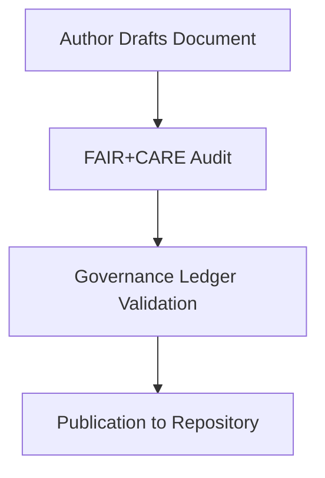

# 🧭 **Kansas Frontier Matrix — Markdown Authoring & Style Guide (v2.1.1 · Tier-Ω+∞ Certified)**  
`docs/standards/markdown_guide.md`

**Mission:** Define **writing, formatting, and accessibility standards** for all Kansas Frontier Matrix (KFM) documentation  
to ensure reproducibility, accessibility, and ethical alignment under **MCP-DL v6.4.3** and **FAIR+CARE governance**.

---

## 📚 Overview

This **Markdown Authoring & Style Guide** ensures that all written documentation in the **Kansas Frontier Matrix (KFM)**  
is readable, FAIR+CARE-compliant, accessible, and consistent across the repository.

Every document must:
- Follow **MCP-DL** metadata and structure conventions.  
- Meet **WCAG 2.1 AA** readability and accessibility standards.  
- Include ethical and inclusive language as per **FAIR+CARE** principles.  
- Pass all automated validation workflows (`docs-validate.yml`, `policy-check.yml`).

---

## 🧱 Writing Principles

| Principle | Description | Example |
|:--|:--|:--|
| **Clarity** | Use plain, direct, and concise language. | ✅ “Use `make site` to build the docs.” |
| **Neutrality** | Avoid subjective, biased, or exclusionary terms. | ✅ “The model outputs a prediction.” |
| **Accessibility** | Use inclusive phrasing and avoid jargon. | ✅ “Click the **Submit** button.” |
| **Consistency** | Use the same style and tense throughout the repo. | ✅ Past tense for logs, present tense for guides. |
| **Traceability** | Reference file paths, commits, or artifacts. | ✅ `data/reports/audit/data_provenance_ledger.json` |

> 🧩 **Rule:** Every technical or process term should appear in the glossary (`docs/glossary.md`)  
> for cross-linking and knowledge graph integration.

---

## ✍️ Document Formatting Rules

| Rule | Description | Enforcement |
|:--|:--|:--|
| **Single H1 Header (`#`)** | Title appears once at top, matching frontmatter. | `docs-validate.yml` |
| **Sentence Case Headings** | Capitalize only first letter and proper nouns. | Manual Review |
| **Max Line Length = 120 chars** | Ensures readable diffs and accessibility. | `markdownlint` |
| **1 Blank Line Between Sections** | Improve structure and scanning. | `markdownlint` |
| **Use Relative Paths** | For cross-referencing KFM files. | `policy-check.yml` |
| **Include Alt Text for Images** | Accessibility requirement under WCAG. | `docs-validate.yml` |

---

## 🧠 Accessibility & Inclusive Language

| Area | Guideline | Example |
|:--|:--|:--|
| **Gender Neutrality** | Avoid gendered terms. | “They” instead of “he/she.” |
| **Disability-Aware Language** | Focus on ability, not limitation. | “Person using a wheelchair.” |
| **Cultural Sensitivity** | Respect cultural data ownership and representation. | Use CARE-aligned phrasing. |
| **Multilingual Support** | Include Osage, English, and Spanish tags when applicable. | `lang="osa"` / `lang="es"` |

> **Accessibility Audit:** Every quarter, the `design-validate.yml` and `faircare-validate.yml` workflows check  
> documentation for readability, inclusion, and linguistic accessibility.

---

## 💡 Style Conventions

| Element | Standard | Example |
|:--|:--|:--|
| **Emphasis** | Use `**bold**` for UI or process names. | **Focus Mode**, **MapLibre** |
| **Code** | Wrap with backticks (\`). | Use `make site` to build docs. |
| **Blockquotes** | Use for definitions, notes, or inline guidance. | > Use plain English for all examples. |
| **Lists** | Use hyphen (`-`) for unordered, numerals for ordered. | `- Example` |
| **Tables** | Must include headers and alignment pipes. | `| Column | Column |` |

---

## 🧩 Image & Diagram Standards

| Type | Rule | Example |
|:--|:--|:--|
| **Images** | Include alt text and caption under figure. | `` |
| **Mermaid Diagrams** | End with `<!-- END OF MERMAID -->` | `flowchart TD ... <!-- END OF MERMAID -->` |
| **Captions** | Must describe function, not appearance. | “Flowchart of governance process.” |

Example Diagram:

<!-- END OF MERMAID -->

---

## 🧾 File Naming & Organization

| Category | Format | Example |
|:--|:--|:--|
| **Markdown Files** | Kebab-case, no spaces, descriptive. | `ai-governance-framework.md` |
| **Images/Exports** | Lowercase + underscores + version optional. | `timeline_chart_v2.png` |
| **Directories** | Hierarchical per domain. | `docs/architecture/`, `docs/standards/` |
| **Templates** | Always suffixed with `-template.md`. | `review-template.md` |

---

## 🧩 Tone & Grammar Guide

| Aspect | Rule | Example |
|:--|:--|:--|
| **Voice** | Use active voice for clarity. | ✅ “Run the workflow.” |
| **Tense** | Present tense for guides, past tense for records. | ✅ “The process is validated.” |
| **Perspective** | Use second person (“you”) for guides. | ✅ “You can clone the repository.” |
| **Numerals** | Write out one–nine; use numerals for 10+. | ✅ “Eight layers,” “15 metrics.” |
| **Abbreviations** | Define on first use, then use acronym. | ✅ “GraphQL (GQL)” |

---

## 🧠 FAIR + CARE Integration

| Principle | Application | Validation Workflow |
|:--|:--|:--|
| **Findable** | Indexed in manifest and searchable metadata. | `docs-validate.yml` |
| **Accessible** | Meets WCAG 2.1 AA and FAIR openness standards. | `design-validate.yml` |
| **Interoperable** | Markdown + YAML standardized for automation. | `policy-check.yml` |
| **Reusable** | Versioned and archived for reproducibility. | `governance-ledger.yml` |
| **Collective Benefit (CARE)** | Inclusive, equitable language across all docs. | `faircare-validate.yml` |

---

## 🧾 Validation Workflows

| Workflow | Purpose | Output |
|:--|:--|:--|
| `docs-validate.yml` | Syntax, links, headings, alt text validation. | `reports/validation/docs_validation.json` |
| `policy-check.yml` | Ensures metadata and format compliance. | `reports/audit/policy_check.json` |
| `faircare-validate.yml` | Reviews inclusivity and ethical alignment. | `reports/fair/data_care_assessment.json` |
| `governance-ledger.yml` | Records checksum and provenance trace. | `data/reports/audit/data_provenance_ledger.json` |

---

## 🕰 Version History

| Version | Date | Author | Summary |
|:--|:--|:--|:--|
| **v2.1.1** | 2025-11-16 | @kfm-docs | Finalized accessibility, inclusive language, and FAIR+CARE validation standards. |
| v2.0.0 | 2025-10-25 | @kfm-accessibility | Added WCAG 2.1 AA & inclusive writing best practices. |
| v1.0.0 | 2025-10-04 | @kfm-architecture | Initial Markdown authoring and style guidelines. |

---

**Kansas Frontier Matrix © 2025**  
*“Write Clearly. Document Ethically.”*  
📍 `docs/standards/markdown_guide.md` — Official Markdown style and authoring standards for the Kansas Frontier Matrix.

