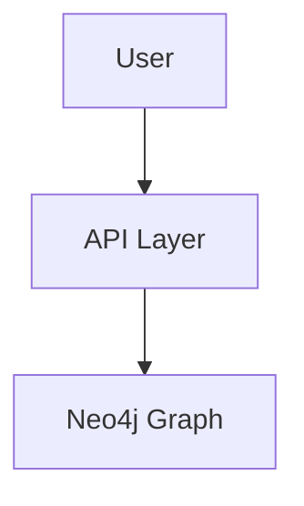

<div align="center">

# 📑 **Kansas Frontier Matrix — Markdown Authoring Guide (v11.0)**  
`docs/standards/markdown_guide.md`

**Purpose**  
Provide the **authoritative, practical authoring guide** for all KFM Markdown documents under **KFM-MDP v11.0.0**.  
This file explains **how to write, structure, and validate** Markdown so it passes CI and integrates cleanly with:  
Story Nodes v3 · Focus Mode v3 · STAC/DCAT/PROV-O · FAIR+CARE · MCP-DL v6.3.

</div>

---

# 📘 Overview

This guide is the **companion** to `markdown_rules.md`:

- `markdown_rules.md` = **what is required** (normative standard)
- `markdown_guide.md` = **how to do it correctly** (practical authoring guide)

It covers:

- Required **document skeleton** (YAML → title block → sections → footer)
- YAML front-matter patterns for **v11 extended metadata**
- Headings, lists, tables, and text style norms
- Directory layouts using **lined ASCII tree**
- Mermaid and code block usage
- Accessibility (WCAG 2.1 AA+)
- FAIR+CARE authoring practices
- Focus Mode v3 & Story Node v3 hooks
- Versioning and provenance conventions
- A complete **worked example** at the end

Any Markdown file that deviates from the rules in this guide and in `markdown_rules.md` will **fail CI**.

---

# 🧩 Authoring Model & Relationship to Other Standards

When writing Markdown for KFM, treat this stack as binding:

1. **Master Coder Protocol (MCP-DL v6.3)** — documentation-first, experiment-logged  
2. **KFM-MDP v11.0.0** — Markdown protocol (structure + metadata)  
3. **Domain standards** — STAC, DCAT, PROV-O, CIDOC-CRM, OWL-Time, GeoSPARQL  
4. **Ethics** — FAIR+CARE + Indigenous data sovereignty  
5. **Accessibility** — WCAG 2.1 AA+  

This document tells you:

- Which **sections** you must include  
- How to **write them**  
- How to avoid **CI failures**  

If anything here conflicts with `markdown_rules.md`, the **rules file wins**; update this guide rather than diverge.

---

# 🧱 Core Document Skeleton (v11 Authoring Pattern)

All KFM v11 Markdown docs MUST follow this high-level skeleton:

```markdown
---
# 1. YAML front matter (no blank lines above)
...

---

<div align="center">

# <Emoji + Title>  
`<repo/path/to/file.md>`

**Purpose:**  
<1–4 lines explaining what this document is for.>

</div>

---

# 📘 Overview

# 🗂 Directory Layout   (if applicable)

# 🧩 Core Sections      (domain-specific content)

# 🛠 Examples           (code/config/JSON as needed)

# ⚙️ Validation / CI Requirements

# 🕰️ Version History

<Footer: copyright + certification>
```

Authoring checklist:

- Exactly **one** H1 (inside the centered `<div>`).  
- Primary sections use **H2** (`##`) with emojis.  
- Deeper content uses **H3/H4** only when necessary.  
- Keep the skeleton shape; add more H2 sections as needed, but do not reorder the core blocks.

---

# 🧾 YAML Front-Matter — How to Author v11 Blocks

Every KFM Markdown file starts with **strict YAML**.

## ✅ Required fields (author-facing guidance)

When creating a new document, populate:

```yaml
title: "🧩 My Document Title (Diamond⁹ Ω / Crown∞Ω Ultimate Certified)"
path: "docs/<domain>/<file>.md"
version: "v11.0.0"
last_updated: "2025-11-20"
review_cycle: "Quarterly / FAIR+CARE Council"
commit_sha: "<latest-commit-hash>"
sbom_ref: "../../releases/v11.0.0/sbom.spdx.json"
manifest_ref: "../../releases/v11.0.0/manifest.zip"
telemetry_ref: "../../releases/v11.0.0/focus-telemetry.json"
telemetry_schema: "../../schemas/telemetry/<doc-type>-v11.json"
governance_ref: "governance/ROOT-GOVERNANCE.md"
license: "CC-BY 4.0"
mcp_version: "MCP-DL v6.3"
markdown_protocol_version: "KFM-MDP v11.0.0"
status: "Active / Enforced"
doc_kind: "Standard"          # or Architecture / Guide / Reference / Overview
intent: "markdown-authoring"  # short phrase summarizing role
semantic_document_id: "kfm-doc-<short-name>-v11"
doc_uuid: "urn:kfm:docs:<area>:<short-name>-v11"
accessibility_compliance: "WCAG 2.1 AA+"
machine_extractable: true
fair_category: "F1-A1-I1-R1"
care_label: "Public / Low-Risk"
immutability_status: "version-pinned"
```

### YAML authoring rules

- **No tabs** — use spaces only  
- **No trailing spaces** on any line  
- **No blank line above `---`**  
- Keep paths **relative** and correct (CI checks)  
- Do not invent new top-level keys without updating `markdown_rules.md` and schemas

---

# 🎯 Title Block & Purpose — How to Write It

Immediately after YAML, you must have:

```markdown
<div align="center">

# 🧩 **My Document Title**  
`docs/path/to/file.md`

**Purpose:**  
One to four lines summarizing why this document exists and who it serves.

</div>
```

Authoring tips:

- Title: start with **one emoji**, then a short, descriptive title.  
- Path: must exactly match the `path:` in YAML.  
- Purpose: think “tool tip for humans”; it should be clear enough to show on a landing page.

---

# 🔤 Headings, Text, and Lists

## Headings

- Use **emojis** at the start of major H2 headings (consistent with project style).
- Example pattern:

```markdown
# 🧩 Title (inside <div>)

## 📘 Overview
## 🗂 Directory Layout
## 🧩 Core Sections
## 🛠 Examples
## ⚙️ Validation / CI Requirements
## 🕰️ Version History
```

## Paragraphs

- Wrap at ~80–100 characters where possible to keep diffs clean, but this is not hard-enforced.
- Avoid overly long paragraphs; split logically for readability.

## Lists

- Use `-` or `*`, not `•` or other Unicode bullets.
- One blank line before and after a list.
- Example:

```markdown
- First point
- Second point
  - Nested point (2 spaces indent)
```

---

# 🗂 Directory Layout — How to Draw Trees

For any file that documents layout, include a **lined ASCII tree**:

```text
docs/
│
├── standards/
│   ├── markdown_rules.md      # normative spec
│   └── markdown_guide.md      # this authoring guide
└── guides/
    └── getting_started.md     # onboarding docs
```

Authoring rules:

- Use `│`, `├──`, and `└──` only.
- Use 4 spaces for indentation inside the tree.
- Every line needs a brief comment (`# ...`) where appropriate.
- Fence with:

```markdown
```text
<tree here>
```
```

---

# 💻 Code, JSON, and Config Blocks

For all code-like content:

- Use triple backticks.
- Always specify a language:

```markdown
```json
{
  "example": true
}
```

```bash
make data
```

```yaml
key: value
```
```

Authoring rules:

- JSON must be valid (trailing commas will fail CI).
- Sensitive secrets (tokens/keys) are never documented in clear text.
- Use placeholders instead (`<API_KEY>`, `<SECRET>`).

---

# 🧭 Mermaid Diagrams — Author’s Checklist

Use only when the structure is easier to see as a diagram.

Example:

```markdown

```

Rules for authors:

- Use `flowchart TD` or `flowchart LR`.
- Keep shapes simple (rectangles with labels).
- No custom CSS, themes, or styles.
- No blank lines inside the fenced block.

---

# ♿ Accessibility — How to Author Inclusive Docs

When writing content:

- Provide alt-text for every image:

```markdown

```

- Use descriptive link text:

```markdown
See the [Markdown Rules Standard](./markdown_rules.md) for normative requirements.
```

- Avoid emoji-only headings; always include text.
- Where color is referenced (in diagrams/images), provide non-color cues (e.g., labels, patterns).

---

# ⚖️ FAIR+CARE — Practical Authoring Rules

When documenting data, methods, or results:

- Always mention **license**, **source**, and **provenance**.
- Do not include exact coordinates or identifiable descriptions of **sensitive archaeological or sacred sites**; refer to generalized regions.
- Note any constraints:

```markdown
> ⚠️ CARE Notice: This section references Indigenous data. Locations are generalized and
> shared under agreements that restrict re-publication of precise site coordinates.
```

- When describing data transformations, include enough information to reproduce them or link to an experiment card / SOP.

---

# 🎯 Focus Mode v3 & Story Nodes — Authoring Hooks

For documents that should integrate with Focus Mode or Story Nodes:

- Use **Focus hooks** in blockquotes:

```markdown
> **Focus Hook:** entity:fort_larned_kansas type:place
```

- Reference Story Nodes by their IDs when appropriate:

```markdown
See Story Node `story:medicine_lodge_treaty_1867` for a narrative overview linked to this architecture.
```

Authoring guidance:

- Keep hooks stable; changing IDs will break saved Focus views.
- Do not overload a document with hooks; 1–3 per file is typical.

---

# 🧬 Versioning & Provenance — How to Update Docs Safely

Whenever you modify a document:

1. **Update YAML**:
   - Bump `version:` (SemVer).
   - Update `last_updated:`.
   - Update `commit_sha:` placeholder if you know it; otherwise leave as `<latest-commit-hash>` (CI may patch it).
   - If it is a major rewrite, you may need a new `doc_uuid:` and `semantic_document_id:`.

2. **Append Version History row**:
   - Do not delete old rows.
   - Newest entry at the top.

Example:

```markdown
# 🕰️ Version History

| Version | Date       | Author        | Summary                          |
|-------: |------------|--------------|----------------------------------|
| v11.0.0 | 2025-11-20 | Core Team    | Upgraded for KFM-MDP v11.0.0.   |
| v10.4.3 | 2025-11-16 | Doc Council  | Previous stable authoring guide. |
```

3. **Describe what changed**, not just “minor updates”.

---

# 🧪 Authoring Patterns by Doc Kind

## Standards (`doc_kind: "Standard"`)

- Normative language: “MUST”, “MUST NOT”, “SHOULD”.
- Short, unambiguous sentences.
- Examples are optional but recommended.

## Guides (`doc_kind: "Guide"`)

- Explanatory language: “Use this when…”.
- Many examples.
- Link heavily to `standards/` and `architecture/`.

## Architecture (`doc_kind: "Architecture"`)

- Focus on diagrams, flows, and directory trees.
- Must include versioned assumptions and constraints.

## Reference (`doc_kind: "Reference"`)

- API shapes, field definitions, schemas.
- No narrative; minimal prose, maximum precision.

---

# 🛠 Worked Example — Minimal v11 Authoring-Compliant File

````markdown
---
title: "🧭 Kansas Frontier Matrix — Example Authoring Doc"
path: "docs/examples/authoring_example.md"
version: "v11.0.0"
last_updated: "2025-11-20"
review_cycle: "Annual / Autonomous"
commit_sha: "<latest-commit-hash>"
sbom_ref: "../../releases/v11.0.0/sbom.spdx.json"
manifest_ref: "../../releases/v11.0.0/manifest.zip"
telemetry_ref: "../../releases/v11.0.0/focus-telemetry.json"
telemetry_schema: "../../schemas/telemetry/markdown-example-v11.json"
governance_ref: "governance/ROOT-GOVERNANCE.md"
license: "CC-BY 4.0"
mcp_version: "MCP-DL v6.3"
markdown_protocol_version: "KFM-MDP v11.0.0"
status: "Active"
doc_kind: "Guide"
intent: "markdown-authoring-example"
semantic_document_id: "kfm-doc-authoring-example-v11"
doc_uuid: "urn:kfm:docs:examples:authoring-example-v11"
accessibility_compliance: "WCAG 2.1 AA+"
machine_extractable: true
fair_category: "F1-A1-I1-R1"
care_label: "Public / Low-Risk"
immutability_status: "version-pinned"
---

<div align="center">

# 🧭 **Kansas Frontier Matrix — Authoring Example**  
`docs/examples/authoring_example.md`

**Purpose:**  
Show a complete, minimal example of a KFM v11-compliant Markdown document that follows the
authoring guide and passes CI.

</div>

---

# 📘 Overview

This example demonstrates all mandatory structural elements for KFM v11 Markdown documents.

---

# 🗂 Directory Layout

```text
docs/
│
└── examples/
    └── authoring_example.md   # This example file
```

---

# 🧩 Content Section

This is where your document-specific content goes.

> **Focus Hook:** entity:example_kansas_site_001 type:place

---

# ⚙️ Validation / CI Requirements

This file must pass:

- `docs-lint.yml`
- `markdown-protocol-validate.yml`
- `faircare-validate.yml`
- `broken-link-check.yml`

---

# 🕰️ Version History

| Version | Date       | Author     | Summary                               |
|-------: |------------|-----------|---------------------------------------|
| v11.0.0 | 2025-11-20 | Core Team | Initial v11 authoring example created |
```
````

---

# 🕰️ Version History

| Version | Date       | Author                    | Summary                                                                                                     |
|-------: |------------|---------------------------|-------------------------------------------------------------------------------------------------------------|
| v11.0.0 | 2025-11-20 | KFM Documentation Council | Upgraded guide to KFM-MDP v11.0.0: added extended YAML fields, Focus Mode v3 & Story Node v3 guidance.      |
| v10.4.3 | 2025-11-16 | KFM Documentation Council | Authoring rules synchronized with `markdown_rules.md` v10.4.3; clarified YAML and directory layout patterns. |

<div align="center">

© 2025 Kansas Frontier Matrix — CC-BY 4.0  
Master Coder Protocol v6.3 · FAIR+CARE Certified  
Diamond⁹ Ω / Crown∞Ω Ultimate Certified

</div>
