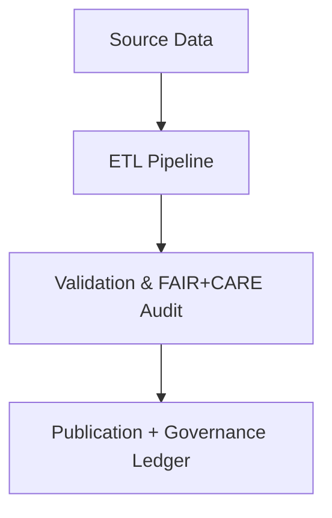

<div align="center">

# ✍️ **Kansas Frontier Matrix — Markdown Documentation Rules (v2.1.1 · Tier-Ω+∞ Certified)**  
`docs/standards/markdown_rules.md`

**Mission:** Define the **Markdown structure, syntax, accessibility, and reproducibility rules**  
for all documentation in the **Kansas Frontier Matrix (KFM)** — ensuring FAIR+CARE compliance,  
machine-readability, and governance audit integrity under **MCP-DL v6.4.3**.

[](../../docs/)
[](../../docs/standards/faircare-validation.md)
[](../../data/reports/audit/data_provenance_ledger.json)
[](../../LICENSE)

</div>

---

## 📚 Overview

All Markdown documentation in the Kansas Frontier Matrix (KFM) must:
- Follow **MCP-DL v6.4.3** frontmatter and metadata conventions.  
- Be **FAIR+CARE-compliant**, accessible, and audit-ready.  
- Render consistently across GitHub, CI reports, and static site builds.  
- Include **semantic structure** for navigation, parsing, and validation pipelines.  

These rules standardize documentation for governance traceability, accessibility, and long-term reproducibility.

---

## 🧩 Required Markdown Structure

Every documentation file must include:
1. **YAML Frontmatter** — containing `title`, `version`, `last_updated`, `owners`, and `license`.  
2. **Top-Level Header (`#`)** — matching the title in the frontmatter.  
3. **Body Sections (`##`, `###`, etc.)** — structured logically and sequentially.  
4. **Version History Table** — tracking authorship and governance changes.  
5. **Footer** — standardized project footer with KFM copyright statement.  

---

## 🧾 Frontmatter Example

```yaml
---
title: "🧠 Kansas Frontier Matrix — AI Governance Architecture"
path: "docs/architecture/ai-automation.md"
version: "v2.1.1"
last_updated: "2025-11-16"
owners: ["@kfm-ai","@kfm-governance"]
license: "CC-BY 4.0"
maturity: "Production"
status: "Stable"
tags: ["ai","architecture","governance","docs","fair","care"]
---
```

> ⚙️ **Validation:** Missing frontmatter or invalid YAML structure will block merges via `policy-check.yml`.

---

## ⚙️ Heading & Hierarchy Rules

| Element | Syntax | Usage |
|:--|:--|:--|
| **Title** | `#` | Single top-level document title only. |
| **Main Section** | `##` | Major logical divisions (Overview, Standards, Governance, etc.). |
| **Subsection** | `###` | Nested sections within a topic. |
| **Detail Level** | `####` | Optional deep detail level for examples. |

> 🧠 **Rule:** Never skip heading levels; maintain linear hierarchy for accessibility and screen-reader consistency.

---

## 🧱 Content Rules

| Rule | Description | Enforcement |
|:--|:--|:--|
| **One Concept per File** | Each document focuses on a single, discrete concept or standard. | Manual + CI Review |
| **No Inline HTML** | Avoid raw HTML unless required for semantic control. | `docs-validate.yml` |
| **UTF-8 Encoding** | All files must use UTF-8 with Unix LF line endings. | Pre-commit hook |
| **Line Length ≤ 120 chars** | Improves readability in diff and rendering. | `markdownlint` |
| **Alt Text Required** | All images require descriptive alt text for accessibility. | Accessibility Audit |
| **Emoji Support** | Emojis permitted for headers and emphasis, not for metadata values. | Visual Review |
| **Code Fences** | Use triple backticks (\`\`\`) for all code or examples. | `markdownlint` |

---

## 🧠 Accessibility & FAIR+CARE Integration

| Requirement | Description | Validation Workflow |
|:--|:--|:--|
| **WCAG 2.1 AA Compliance** | Contrast, heading order, and alternative text validated. | `docs-validate.yml` |
| **Readable Text** | Target Grade 9 reading level or lower. | Manual / AI Lint |
| **Cultural Sensitivity** | Language reviewed for inclusivity and accuracy. | FAIR+CARE Audit |
| **Alt Text & Captions** | Every figure or diagram must include alt text. | Accessibility Review |
| **Semantic Tables** | Tables used only for structured data; headers required. | CI Validation |

---

## 📘 Code & Diagram Standards

| Type | Requirement | Enforcement |
|:--|:--|:--|
| **Code Blocks** | Use fenced syntax (` ```bash `, ` ```yaml `, etc.) with language declared. | `docs-validate.yml` |
| **Mermaid Diagrams** | Must end with `<!-- END OF MERMAID -->` comment. | `policy-check.yml` |
| **Inline Code** | Wrap inline terms or commands in backticks (\`). | `markdownlint` |
| **No Broken Diagrams** | Mermaid or image rendering validated during CI. | `docs-validate.yml` |

Example:

<!-- END OF MERMAID -->

---

## 🧾 Table & Link Formatting

| Rule | Example | Notes |
|:--|:--|:--|
| **Table Headers Required** | `| Column | Column |` | All tables must have headers and alignments. |
| **Relative Links** | `[Governance Ledger](../../data/reports/audit/data_provenance_ledger.json)` | No absolute URLs for internal links. |
| **External Links** | `[FAIR+CARE Docs](https://example.org)` | Must open in new tab when rendered online. |
| **Anchor Links** | `[View Section](#overview)` | Avoid hardcoded HTML IDs. |

---

## 🧩 File Naming & Directory Standards

| Type | Rule | Example |
|:--|:--|:--|
| **Docs** | Use kebab-case; describe function and scope. | `ai-governance-architecture.md` |
| **Images** | Lowercase with underscores; reference version if needed. | `data_flow_v2.png` |
| **Directories** | Hierarchical organization mirroring project modules. | `docs/architecture/`, `docs/standards/` |

---

## 🧮 Validation Workflows

| Workflow | Function | Output |
|:--|:--|:--|
| `docs-validate.yml` | Checks headings, links, diagrams, and accessibility. | `reports/validation/docs_validation.json` |
| `policy-check.yml` | Validates frontmatter and metadata structure. | `reports/audit/policy_check.json` |
| `faircare-validate.yml` | Confirms FAIR+CARE documentation ethics compliance. | `reports/fair/data_care_assessment.json` |
| `governance-ledger.yml` | Logs document checksums and validation signatures. | `data/reports/audit/data_provenance_ledger.json` |

---

## 🧾 Version History

| Version | Date | Author | Summary |
|:--|:--|:--|:--|
| **v2.1.1** | 2025-11-16 | @kfm-docs | Updated rules for accessibility, FAIR+CARE validation, and diagram enforcement. |
| v2.0.0 | 2025-10-25 | @kfm-governance | Integrated CI validation rules for Markdown and Mermaid diagrams. |
| v1.0.0 | 2025-10-04 | @kfm-architecture | Initial Markdown documentation governance rules. |

---

<div align="center">

**Kansas Frontier Matrix © 2025**  
*“Documentation is Infrastructure — Clarity is Compliance.”*  
📍 `docs/standards/markdown_rules.md` — Official Markdown and accessibility compliance standards for the Kansas Frontier Matrix.

</div>

