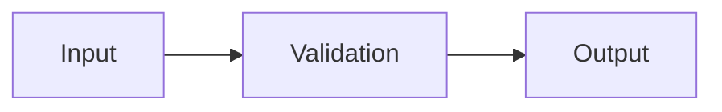

<div align="center">

# 📑 **Kansas Frontier Matrix — Markdown Structural & Formatting Rules**  
`docs/standards/markdown_rules.md`

**Purpose:**  
Define the mandatory structural conventions, metadata requirements, and formatting syntax for all Markdown documents within the Kansas Frontier Matrix (KFM).  
These rules support **Master Coder Protocol (MCP v6.3)** and **FAIR+CARE** compliance by enforcing documentation integrity, accessibility, and machine-readability.

[](../README.md)
[](../../LICENSE)
[](faircare.md)
[]()

</div>

---

## 📘 Overview

The KFM documentation framework relies on structured, versioned Markdown files that are **validated automatically** via:

- `.github/workflows/docs-lint.yml`  
- Pre-commit hooks  
- Governance audits  

These rules ensure every document is:

- **Consistent in format**  
- **YAML-schema compliant**  
- **FAIR+CARE-compatible**  
- **Readable and accessible** across tools and interfaces  

---

## 🧱 1. YAML Front-Matter Requirements

Each Markdown document **must** begin with a YAML metadata block.  
This front-matter provides versioning, governance, and interoperability information.

### ✅ Required Fields

| Field | Description | Example |
|---|---|---|
| `title` | Document title (must include an emoji). | `"🏗️ Kansas Frontier Matrix — System Architecture"` |
| `path` | Repository path of the document. | `"src/ARCHITECTURE.md"` |
| `version` | Semantic version. | `"v10.2.2"` |
| `last_updated` | ISO 8601 date of last modification. | `"2025-11-12"` |
| `review_cycle` | Update frequency (Quarterly / Annual / Continuous). | `"Quarterly / Autonomous"` |
| `commit_sha` | Git commit hash or `<latest-commit-hash>`. | `"<latest-commit-hash>"` |
| `sbom_ref` | SPDX SBOM reference path. | `"releases/v10.2.0/sbom.spdx.json"` |
| `manifest_ref` | Manifest package for release tracking. | `"releases/v10.2.0/manifest.zip"` |
| `telemetry_ref` | Path to telemetry file. | `"releases/v10.2.0/focus-telemetry.json"` |
| `telemetry_schema` | Telemetry schema path for validation. | `"schemas/telemetry/docs-markdown-rules-v2.json"` |
| `governance_ref` | Reference to governance charter. | `"docs/standards/governance/ROOT-GOVERNANCE.md"` |
| `license` | SPDX-compatible license string. | `"CC-BY 4.0"` |
| `mcp_version` | MCP documentation version. | `"MCP-DL v6.3"` |

> Front-matter is **mandatory**. Missing or invalid keys will cause `docs-lint.yml` to fail.

---

## 🧩 2. Title Block Structure

Each document’s main header must be enclosed in a `<div align="center">` container.

### Example

```markdown
<div align="center">

# 🧩 **Kansas Frontier Matrix — Governance Architecture**
`docs/standards/governance/ROOT-GOVERNANCE.md`

**Purpose:** Define the governance charter and decision-making structure for FAIR+CARE compliance.

[](../README.md)
[](faircare.md)

</div>
```

**Rules**

- The first line *inside* the `<div>` must be an H1 heading with emoji.  
- The second line must display the file path in backticks.  
- The **Purpose** block should be concise (≤ 3 lines).  
- Include at least two badges, in this order: Docs → License → FAIR+CARE → Status.

---

## 🧮 3. Heading Hierarchy Rules

| Heading Level | Syntax | Usage |
|---|---|---|
| H1 | `#` | Document title (used once). |
| H2 | `##` | Major sections (Overview, Directory Layout, etc.). |
| H3 | `###` | Subsections or technical details. |
| H4 | `####` | Optional nested content (use sparingly). |

**Emoji Requirement**  
H1–H3 headings must include a relevant emoji for semantic tagging.

**Correct**

```markdown
## 📘 Overview
### ⚙️ Workflow Integration
#### 🧩 Dependencies
```

---

## 🗂️ 4. Section Order & Layout

Standard KFM document order:

1. YAML front-matter  
2. Centered title block  
3. Horizontal divider (`---`)  
4. Overview section  
5. Additional content sections (e.g., Directory Layout, Rules, Governance, Examples)  
6. Version History section  
7. Centered footer with certification and nav links  

> A Table of Contents is optional but recommended for long documents.

---

## 🧠 5. Table Formatting Rules

- All tables use pipe (`|`) syntax.  
- Include header and divider lines (`|---|---|`).  
- Limit row width to ~100 characters per line where practical.  
- Align content left; avoid alignment markers.  
- Do not leave cells blank; use `—` for N/A.

### Example

```markdown
| Field | Description | Example |
|---|---|---|
| license | SPDX-compatible identifier | "CC-BY-4.0" |
| provenance | Data origin | "USGS, NOAA" |
```

---

## ⚙️ 6. Code & Data Block Rules

| Type | Syntax | Rule |
|---|---|---|
| Code blocks | Triple backticks with language tag | Always specify (`json`, `bash`, `yaml`, `markdown`, etc.). |
| Inline code | Backticks | Use for file paths, commands, variables. |
| JSON examples | Valid JSON (double-quotes, commas) | Avoid comments in JSON examples. |
| Bash commands | Optional `$` prompt | Prefer `$` prefix for clarity. |

**Examples**

```bash
$ make validate
```

```json
{
  "example": true
}
```

---

## 📋 7. Lists & Bullets

- Use `-` for unordered lists.  
- Use `1.` for ordered lists (auto-numbering is fine).  
- Indent with **two spaces**, no tabs.  
- Keep items concise; use subheadings for complex sequences.

```markdown
1. Clone the repository.
2. Run `make setup`.
3. Execute validation pipelines.
```

---

## 🧩 8. Badges & Visuals

All documents must include badges in the title block:

1. Docs · MCP badge  
2. License badge  
3. FAIR+CARE badge  
4. Status badge (Active/Template/Deprecated/etc.)

```markdown
[](../README.md)
[](../../LICENSE)
[](faircare.md)
```

Images used within documents must include descriptive `alt` text for accessibility.

---

## 🧪 9. Mermaid Diagrams

- At most **one Mermaid diagram per section**.  
- Use only `flowchart TD` or `flowchart LR`.  
- Node labels must be quoted strings to avoid parser errors.  
- No custom CSS or `classDef` usage.

**Example**



---

## 🧮 10. Version History Table

Every document requires a **Version History** section.

```markdown
## 🕰️ Version History

| Version | Date | Author | Summary |
|---|---|---|---|
| v10.2.2 | 2025-11-12 | A. Barta | Updated telemetry & release references; reinforced CI enforcement and header rules. |
| v10.0.0 | 2025-11-10 | A. Barta | Aligned telemetry/SBOM/manifest refs; added `telemetry_schema` front-matter requirement. |
```

---

## ⚖️ 11. Footer Requirements

Each document must include a final horizontal rule and a centered footer:

```markdown
---

<div align="center">

**© 2025 Kansas Frontier Matrix — CC-BY 4.0**  
Validated under **Master Coder Protocol v6.3** · FAIR+CARE Certified · Diamond⁹ Ω / Crown∞Ω Ultimate Certified  
[Back to Standards Index](README.md) · [Root Governance Charter](governance/ROOT-GOVERNANCE.md)

</div>
```

Footer content must be updated for year/version when appropriate.

---

## 🧩 12. Validation & Enforcement

**Automated Workflow:** `.github/workflows/docs-lint.yml`

Checks include:

1. Front-matter presence & schema correctness.  
2. Single H1 title with emoji; centered title block.  
3. Presence of Version History and footer.  
4. Tables, links, and Mermaid syntax rule adherence.  
5. Relative link resolution and UTF-8 encoding.

**Failure Policy**

- Violations block PR merges.  
- Violations are logged in `reports/self-validation/docs/lint_summary.json`.  
- Governance may require retroactive fixes before release certification.

---

## 🧮 13. FAIR+CARE Documentation Compliance

| Principle | Implementation |
|---|---|
| **Findable** | Front-matter keys (`title`, `path`, `version`) enable indexing. |
| **Accessible** | Plain Markdown + JSON examples readable without proprietary tools. |
| **Interoperable** | STAC/DCAT/JSON-LD-aligned metadata fields. |
| **Reusable** | Open license, provenance, & version tracking encoded in every doc. |
| **CARE** | Encourages inclusive language, readability, and cultural awareness. |

---

## 🕰️ Version History

| Version | Date | Author | Summary |
|---|---|---|---|
| v10.2.2 | 2025-11-12 | A. Barta | Updated to v10.2.0 telemetry references; clarified Mermaid, footer, and badge ordering rules; reaffirmed CI enforcement. |
| v10.0.0 | 2025-11-10 | A. Barta | Aligned telemetry/SBOM/manifest refs; added required `telemetry_schema` field. |
| v9.7.0 | 2025-11-05 | A. Barta | Defined authoritative Markdown structure, front-matter, and section order. |
| v9.5.0 | 2025-10-20 | A. Barta | Added footer, table, and list consistency requirements. |
| v9.0.0 | 2025-06-01 | KFM Core Team | Established foundational Markdown conventions under MCP. |

---

<div align="center">

**© 2025 Kansas Frontier Matrix — CC-BY 4.0**  
Validated under **Master Coder Protocol v6.3** · FAIR+CARE Certified · Diamond⁹ Ω / Crown∞Ω Ultimate Certified  
[Back to Standards Index](README.md) · [Root Governance Charter](governance/ROOT-GOVERNANCE.md)

</div>