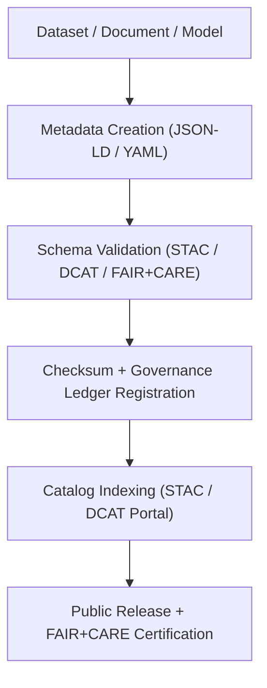
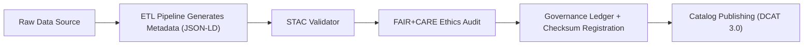

<div align="center">

# 🧩 **Kansas Frontier Matrix — Metadata & Schema Standards (v2.1.1 · Tier-Ω+∞ Certified)**  
`docs/standards/metadata-standards.md`

**Mission:** Define the **metadata, schema, and interoperability standards** used across the  
**Kansas Frontier Matrix (KFM)** for datasets, documentation, AI outputs, and governance records — ensuring  
reproducibility, FAIR+CARE compliance, and alignment with global open-data frameworks.

[](../../docs/)
[](../../docs/standards/faircare-validation.md)
[](../../docs/standards/metadata-standards.md)
[](../../LICENSE)

</div>

---

## 📚 Overview

The **Metadata & Schema Standards** define how all information in KFM — from raw data to AI-driven insights —  
is structured, described, validated, and shared.  

Every metadata record must be:
- **Findable:** indexed in STAC/DCAT catalogs and the governance ledger.  
- **Accessible:** publicly licensed, versioned, and machine-readable.  
- **Interoperable:** aligned with open standards (STAC 1.0, DCAT 3.0, JSON-LD).  
- **Reusable:** validated under FAIR+CARE governance and reproducible pipelines.  

---

## ⚙️ Metadata Governance Model


<!-- END OF MERMAID -->

---

## 🧱 Core Metadata Standards

| Standard | Purpose | Implementation | Validation Workflow |
|:--|:--|:--|:--|
| **STAC 1.0** | Spatiotemporal metadata for geospatial datasets. | `data/stac/` | `stac-validate.yml` |
| **DCAT 3.0** | Dataset cataloging and discoverability. | `data/meta/` | `dcat-export.yml` |
| **CIDOC CRM** | Cultural heritage and historical data semantics. | `src/graph/ontology/` | `graph-validate.yml` |
| **OWL-Time** | Temporal event representation for knowledge graph. | `data/work/processed/` | `ontology-validate.yml` |
| **JSON-LD / Schema.org** | Linked data interoperability. | `data/meta/*.jsonld` | `policy-check.yml` |

---

## 🧩 Required Metadata Fields (STAC + DCAT Alignment)

| Field | Description | Type | Required |
|:--|:--|:--:|:--:|
| `id` | Unique identifier for dataset or record. | String | ✅ |
| `title` | Human-readable name. | String | ✅ |
| `description` | Concise dataset summary. | String | ✅ |
| `license` | Data usage license (e.g., CC-BY 4.0, MIT). | String | ✅ |
| `keywords` | Topical tags for searchability. | Array | ✅ |
| `created` | Creation timestamp (ISO 8601). | String | ✅ |
| `updated` | Last modified timestamp (ISO 8601). | String | ✅ |
| `spatial_extent` | Geographic bounding box (WGS84). | Array | ⚙️ |
| `temporal_extent` | Start and end date range. | Array | ⚙️ |
| `provider` | Source or author organization. | String | ✅ |
| `provenance` | Record of lineage and processing steps. | Object | ✅ |
| `checksum` | SHA-256 hash for file integrity. | String | ✅ |
| `governance_ref` | Link to governance policy. | String | ✅ |

---

## 🔍 FAIR + CARE Metadata Compliance

| Principle | Implementation | Example |
|:--|:--|:--|
| **Findable** | Indexed in `data/stac/catalog.json` and manifest. | `stac-validate.yml` |
| **Accessible** | Published under open license with documentation. | CC-BY 4.0 |
| **Interoperable** | JSON-LD format + schema validation. | FAIR+CARE Metadata Schema |
| **Reusable** | Provenance and license included in metadata. | Governance Ledger Integration |
| **Collective Benefit (CARE)** | Datasets reviewed for ethical and cultural sensitivity. | FAIR+CARE Governance Council |

---

## 🧠 Provenance Metadata Requirements

Every dataset and record must include provenance metadata describing its lineage and ethical validation context.

```json
{
  "provenance": {
    "source": "NOAA Storm Events Database",
    "created_by": "@kfm-etl-ops",
    "transformed_with": "src/pipelines/etl/hazards_pipeline.py",
    "validated_in": "data/reports/validation/stac_validation_report.json",
    "governance_ledger": "data/reports/audit/data_provenance_ledger.json",
    "checksum": "sha256:b2a6e18a54bcd63f..."
  }
}
```

---

## 🧾 Metadata Quality Metrics

| Metric | Description | Target | Validation |
|:--|:--|:--:|:--|
| **metadata_completeness** | % of required fields populated. | 100% | `policy-check.yml` |
| **license_coverage** | % of datasets with explicit open license. | 100% | `policy-check.yml` |
| **checksum_validity** | Successful verification of dataset integrity. | 100% | `governance-ledger.yml` |
| **stac_validation_rate** | STAC schema conformance rate. | 100% | `stac-validate.yml` |
| **faircare_alignment_score** | FAIR+CARE compliance rating. | ≥ 95% | `faircare-validate.yml` |

---

## ⚙️ Validation Workflows

| Workflow | Function | Output |
|:--|:--|:--|
| `stac-validate.yml` | Ensures conformance with STAC schema v1.0. | `reports/validation/stac_validation_report.json` |
| `policy-check.yml` | Validates metadata completeness and licensing. | `reports/audit/policy_check.json` |
| `faircare-validate.yml` | Evaluates ethical metadata and FAIR+CARE fields. | `reports/fair/data_care_assessment.json` |
| `governance-ledger.yml` | Logs provenance and integrity validation. | `data/reports/audit/data_provenance_ledger.json` |
| `dcat-export.yml` | Exports metadata to DCAT-compatible catalog. | `data/meta/dcat_catalog.json` |

---

## 🧩 Metadata Schema Integration Map


<!-- END OF MERMAID -->

---

## 🧾 Example STAC Metadata Record

```json
{
  "stac_version": "1.0.0",
  "id": "noaa_storm_events_2025",
  "title": "NOAA Storm Events Database — Kansas",
  "description": "Severe weather events across Kansas recorded by NOAA NCEI.",
  "license": "Public Domain",
  "keywords": ["NOAA", "weather", "hazards", "Kansas"],
  "providers": [{
    "name": "NOAA National Centers for Environmental Information",
    "roles": ["producer", "licensor"],
    "url": "https://www.ncdc.noaa.gov/stormevents/"
  }],
  "extent": {
    "spatial": { "bbox": [[-102.05, 36.99, -94.61, 40.00]] },
    "temporal": { "interval": [["1950-01-01", "2025-12-31"]] }
  },
  "assets": {
    "data": {
      "href": "https://www.ncdc.noaa.gov/stormevents/storm_events_2025.csv",
      "type": "text/csv",
      "roles": ["data"]
    }
  },
  "checksum": "sha256:a8d29b3ce9f4f09b6e1e1a1f..."
}
```

---

## 🧾 Governance Sign-Off

```yaml
signoff:
  approved_by:
    - "@kfm-data"
    - "@kfm-governance"
    - "@kfm-architecture"
  date_signed: "2025-11-16"
  checksum_verified: true
  governance_ledger_entry: "data/reports/audit/data_provenance_ledger.json"
  faircare_certification: "Tier-Ω+∞ FAIR+CARE Metadata Compliance"
```

---

## 🕰 Version History

| Version | Date | Author | Summary |
|:--|:--|:--|:--|
| **v2.1.1** | 2025-11-16 | @kfm-data | Standardized metadata schema integration and FAIR+CARE ethics mapping. |
| v2.0.0 | 2025-10-25 | @kfm-architecture | Added validation workflows for DCAT export and JSON-LD schema enforcement. |
| v1.0.0 | 2025-10-04 | @kfm-governance | Established baseline metadata and governance schema standards. |

---

<div align="center">

**Kansas Frontier Matrix © 2025**  
*“Metadata is the Memory of Provenance.”*  
📍 `docs/standards/metadata-standards.md` — Official metadata schema and interoperability standard for the Kansas Frontier Matrix.

</div>

