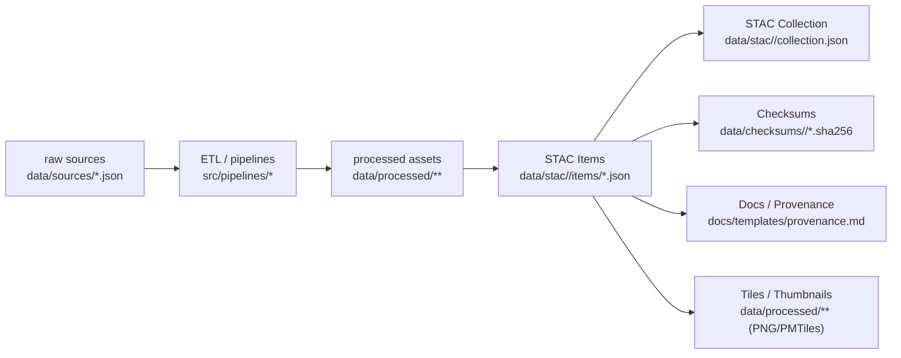

<div align="center">

# 🧾 Kansas Frontier Matrix — **Metadata Standards**  
`docs/standards/metadata.md`

**Master Coder Protocol (MCP-DL v6.3+) · Discoverability · Validation · Provenance · Interoperability**

[](../../docs/)
[](../../.github/workflows/stac-validate.yml)
[](../../.github/workflows/docs-validate.yml)
[-orange)](../standards/security.md)
[](../../LICENSE)

</div>

---

```yaml
---
title: "Kansas Frontier Matrix — Metadata Standards"
version: "v1.3.0"
last_updated: "2025-10-18"
owners: ["@kfm-data","@kfm-architecture","@kfm-docs"]
tags: ["metadata","stac","jsonschema","dcat","prov","fair","validation","provenance"]
status: "Stable"
scope: "Monorepo-Wide"
license: "CC-BY 4.0"
semver_policy: "MAJOR.MINOR.PATCH"
audit_framework: "MCP-DL v6.3"
ci_required_checks:
  - docs-validate
  - stac-validate
  - pre-commit
  - codeql
  - trivy
semantic_alignment:
  - STAC 1.0
  - JSON Schema (2020-12)
  - DCAT 2.0
  - ISO 8601 (time)
  - ISO 19115/19139 (subset via STAC fields)
  - NetCDF CF-1.8
  - W3C PROV-O
  - FAIR Principles
---
````

---

## 📚 Overview

Metadata is the **foundation of reproducibility and traceability** in KFM. Every dataset, model, or experiment **must** include a machine-readable record documenting:

* **Origin & license** (provider, rights, citation)
* **Coverage** (spatial bbox/CRS, temporal instant/interval, theme/keywords)
* **Processing & lineage** (inputs, scripts, versions, commit hash)
* **Integrity** (checksums/signatures)
* **Relationships** (sources, derivatives, documentation, tiles, previews)

KFM adopts and crosswalks the following **open standards**:

* 🧩 **STAC 1.0** — Items & Collections (+ official extensions)
* 🧠 **JSON Schema** — schema validation & automation
* 🧷 **DCAT 2.0** — catalog-level interoperability & harvesting
* 🔗 **W3C PROV-O** (with MCP fields) — provenance & lineage
* 🌐 **NetCDF CF-1.8** / **CSVW** — domain-specific tabular/time-series metadata

All records are validated by CI and `make` targets in this repo.

---

## 🧭 Metadata Flow (Architecture)



<!-- END OF MERMAID -->

---

## 🧩 Metadata Types (KFM Directory Layout)

| Type                    | Format                     | Purpose                            | Directory                            |
| :---------------------- | :------------------------- | :--------------------------------- | :----------------------------------- |
| **Dataset Metadata**    | STAC **Item** (JSON)       | Single dataset or product          | `data/stac/<domain>/items/*.json`    |
| **Collection Metadata** | STAC **Collection** (JSON) | Group Items by theme/time/provider | `data/stac/<domain>/collection.json` |
| **Checksum**            | Plaintext `.sha256`        | Integrity verification             | `data/checksums/<domain>/`           |
| **Provenance Note**     | Markdown/JSON              | Lineage, process narrative         | `docs/templates/provenance.md`       |
| **Model Card**          | JSON/Markdown              | Model metadata & evaluation        | `docs/templates/model_card.md`       |
| **Experiment Log**      | Markdown                   | Hypothesis → methods → results     | `docs/templates/experiment.md`       |

---

## 🧠 Required STAC Fields (Item)

> Use **`properties.datetime`** for instantaneous or midpoint; use **`start_datetime`/`end_datetime`** for intervals. Omit `datetime` when an interval is present.

| Field                    | Type      | Description                                  | Example                                   |
| :----------------------- | :-------- | :------------------------------------------- | :---------------------------------------- |
| `stac_version`           | string    | STAC version                                 | `"1.0.0"`                                 |
| `id`                     | string    | Stable unique dataset ID                     | `"ks_1m_dem_2018_2020"`                   |
| `type`                   | string    | Always `"Feature"`                           | `"Feature"`                               |
| `geometry`               | object    | GeoJSON geometry (optional for pure rasters) | `{"type":"Polygon","coordinates":[...]}`  |
| `bbox`                   | number[4] | `[W,S,E,N]`                                  | `[-102.05,36.99,-94.59,40.00]`            |
| `properties.datetime`    | string    | ISO-8601 instant                             | `"2020-01-01T00:00:00Z"`                  |
| `properties.license`     | string    | SPDX or text                                 | `"CC-BY-4.0"`                             |
| `properties.description` | string    | Human-readable description                   | `"Kansas 1m DEM derived from LiDAR data"` |
| `assets`                 | object    | Files & ancillary assets                     | see below                                 |
| `links`                  | array     | Collection, source, docs, checksum, tiles    | see below                                 |

### Assets (Required fields)

| Field   | Type   | Description                                       | Example                                                      |
| :------ | :----- | :------------------------------------------------ | :----------------------------------------------------------- |
| `href`  | string | **Relative repo path** or URL                     | `"data/processed/terrain/ks_1m_dem_2018_2020.tif"`           |
| `type`  | string | MIME type                                         | `"image/tiff; application=geotiff; profile=cloud-optimized"` |
| `roles` | array  | `["data"]`, `["metadata"]`, `["thumbnail"]`, etc. | `["data"]`                                                   |
| `title` | string | Friendly title                                    | `"Kansas DEM Raster"`                                        |

> Prefer **relative paths** to keep builds reproducible; URLs are allowed for mirrors/CDNs.

---

## 🧩 Recommended STAC Extensions

| Extension      | Prefix        | Use For                | Notes                                           |
| :------------- | :------------ | :--------------------- | :---------------------------------------------- |
| **Projection** | `proj:`       | CRS & transforms       | Include `proj:epsg`, `proj:wkt2`, `proj:shape`. |
| **Raster**     | `raster:`     | Bands, nodata, stats   | `raster:bands[]` + histo/stats.                 |
| **File**       | `file:`       | Checksums & size       | `file:checksum` (sha256) + `file:size`.         |
| **Scientific** | `sci:`        | DOIs & citations       | `sci:doi`, `sci:citation`.                      |
| **Processing** | `processing:` | Process info           | Pipeline name/version, parameters.              |
| **Label**      | `label:`      | Vector labels/training | For labels/train/test splits if applicable.     |
| **Tiles**      | `tiles:`      | Web tiles & recipes    | PMTiles/MVT endpoints + tippecanoe args.        |

**Snippet**

```json
"proj:epsg": 4326,
"raster:bands": [{"data_type":"float32","nodata":-9999}],
"file:checksum": "sha256:1f2c...b9a",
"sci:doi": "10.5066/P9U6F2U7",
"processing:software": "terrain_pipeline.py@1.3.0",
"tiles:pmtiles": "data/tiles/terrain/ks_dem.pmtiles"
```

---

## 🔗 STAC Relationships (Lineage & Discoverability)

Use `links[]` to express lineage and related resources:

| Relationship  | `rel`           | Description                  |
| :------------ | :-------------- | :--------------------------- |
| Collection    | `collection`    | Parent collection            |
| Source        | `source`        | Original/raw inputs          |
| Derived From  | `derived_from`  | Parent Item/Collection       |
| Child Of      | `child_of`      | Part of larger dataset       |
| Documentation | `documentation` | README/standards/provenance  |
| Preview       | `preview`       | Thumbnail/quicklook          |
| Checksum      | `checksum`      | Sidecar `.sha256` file       |
| Alternate     | `alternate`     | Mirror, DOI landing page     |
| Tiles         | `tiles`         | Tile endpoints (PMTiles/XYZ) |

**Example**

```json
"links": [
  {"rel":"collection","href":"../collection.json"},
  {"rel":"derived_from","href":"../../sources/terrain/usgs_3dep_dem.json"},
  {"rel":"documentation","href":"../../../docs/standards/metadata.md"},
  {"rel":"checksum","href":"../../checksums/terrain/ks_1m_dem_2018_2020.tif.sha256"},
  {"rel":"tiles","href":"../../../data/tiles/terrain/ks_dem.pmtiles"}
]
```

---

## 🧾 Collection Requirements

**Required**

* `stac_version`, `type:"Collection"`, `id`, `description`
* `extent.spatial.bbox[]`, `extent.temporal.interval[][]`
* `license` (SPDX) **or** per-item license via `item_assets`
* `links` (`self`, `root`, optional `child` items)

**Recommended**

* `keywords`, `providers`, `summaries` (common fields)
* Summaries for extensions (e.g., `proj:epsg`, `raster:bands`, keywords, themes)

---

## ⏱️ Temporal & Units Guidance

* **Instant** datasets → `properties.datetime`.
* **Intervals** → `properties.start_datetime` + `end_datetime` (omit `datetime`).
* **Uncertain time** → best approximation + `properties["kfm:time_note"]`.
* **Units**: Prefer SI; record in CSVW/STAC (e.g., `unit`, `uom`).
* **NetCDF CF**: include `long_name`, `standard_name`, `units`, QC flags, chunking, compression notes.

---

## 🧩 KFM MCP STAC Extension (Reproducibility)

Add MCP reproducibility fields to STAC Items:

| Field                   | Type    | Description                          |
| :---------------------- | :------ | :----------------------------------- |
| `mcp:checksum_verified` | boolean | `true` if checksum verified at build |
| `mcp:build_commit`      | string  | Short git hash for build             |
| `mcp:processed_by`      | string  | Pipeline/script name@version         |
| `mcp:validation_log`    | string  | Path to validation log               |
| `mcp:reviewer`          | string  | Reviewer/steward name/role           |

**JSON Schema** → `docs/templates/schemas/mcp-extension.schema.json`

```json
{
  "$schema": "https://json-schema.org/draft/2020-12/schema",
  "$id": "https://kfm.local/schemas/mcp-extension.schema.json",
  "title": "KFM MCP STAC Extension",
  "type": "object",
  "properties": {
    "mcp:checksum_verified": { "type": "boolean" },
    "mcp:build_commit": { "type": "string", "pattern": "^[0-9a-f]{7,40}$" },
    "mcp:processed_by": { "type": "string" },
    "mcp:validation_log": { "type": "string" },
    "mcp:reviewer": { "type": "string" }
  },
  "additionalProperties": true
}
```

---

## 🧷 DCAT / FAIR Crosswalk

| FAIR              | Implementation                                                       |
| :---------------- | :------------------------------------------------------------------- |
| **Findable**      | STAC catalog in `data/stac/` with keywords, providers, and DOI links |
| **Accessible**    | HTTP paths or LFS/DVC references; license & constraints in STAC      |
| **Interoperable** | COG/GeoJSON/Parquet/NetCDF + JSON Schema; CF conventions             |
| **Reusable**      | Clear citation, license, provenance, checksums, lifecycle flags      |

**DCAT Mapping (indicative)**

| DCAT Field          | STAC / File Field                    |
| :------------------ | :----------------------------------- |
| `dct:title`         | STAC `id` / collection `title`       |
| `dct:description`   | STAC `description`                   |
| `dct:license`       | STAC `license`                       |
| `dct:temporal`      | `start_datetime`/`end_datetime`      |
| `dct:spatial`       | `bbox` / collection `extent.spatial` |
| `dcat:distribution` | STAC `assets[]`                      |

---

## 📑 CSVW & Tabular Schemas

For `.csv` tables, create **CSVW** sidecars (`<file>.csv-metadata.json`) specifying columns, datatypes, primary keys, and units. For JSON/Parquet configs, provide a **JSON Schema** with `$schema` and version. See `docs/standards/data-formats.md` for examples.

---

## 🧪 Validation (CI + Local)

| Validation            | Tool/Target                           | Output               |
| :-------------------- | :------------------------------------ | :------------------- |
| STAC schema           | `stac-validator`                      | Compliance report    |
| JSON Schema (MCP ext) | `jsonschema`                          | Pass/fail report     |
| Checksums             | `make checksums`                      | Verified/failed list |
| Link integrity        | `.github/workflows/stac-validate.yml` | Broken link report   |

**Local run**

```bash
# Validate one item
stac-validator data/stac/terrain/items/ks_1m_dem_2018_2020.json

# Validate MCP extension fields
python -m jsonschema \
  -i data/stac/terrain/items/ks_1m_dem_2018_2020.json \
  docs/templates/schemas/mcp-extension.schema.json

# Verify checksums
make checksums
```

**CI snippet**

```yaml
name: STAC & Metadata Validate
on: [push, pull_request]
jobs:
  validate:
    runs-on: ubuntu-latest
    steps:
      - uses: actions/checkout@v4
      - run: pipx install stac-validator jsonschema
      - run: stac-validator data/stac --recursive --links
      - run: python tools/validate_json.py --schema docs/templates/schemas/mcp-extension.schema.json --glob 'data/stac/**/items/*.json'
```

---

## 🧪 Copy-Paste Templates

### STAC Item (full, with extensions)

```json
{
  "stac_version": "1.0.0",
  "stac_extensions": [
    "https://stac-extensions.github.io/projection/v1.0.0/schema.json",
    "https://stac-extensions.github.io/raster/v1.1.0/schema.json",
    "https://stac-extensions.github.io/file/v2.1.0/schema.json",
    "https://stac-extensions.github.io/scientific/v1.0.0/schema.json"
  ],
  "id": "ks_1m_dem_2018_2020",
  "type": "Feature",
  "geometry": null,
  "bbox": [-102.05, 36.99, -94.59, 40.00],
  "properties": {
    "datetime": "2020-01-01T00:00:00Z",
    "license": "CC-BY-4.0",
    "description": "Kansas 1m DEM derived from USGS 3DEP LiDAR (2018–2020).",
    "providers": [{"name": "USGS 3DEP", "roles": ["producer"]}],
    "keywords": ["terrain", "elevation", "LiDAR"],
    "proj:epsg": 4326,
    "mcp:checksum_verified": true,
    "mcp:build_commit": "f3a91b2",
    "mcp:processed_by": "terrain_pipeline.py@1.3.0",
    "mcp:validation_log": "data/work/logs/terrain/stac_validate_ks_dem.log",
    "mcp:reviewer": "Data Governance Team"
  },
  "assets": {
    "data": {
      "href": "data/processed/terrain/ks_1m_dem_2018_2020.tif",
      "type": "image/tiff; application=geotiff; profile=cloud-optimized",
      "roles": ["data"],
      "title": "Kansas LiDAR DEM",
      "raster:bands": [{"data_type": "float32", "nodata": -9999}],
      "file:checksum": "sha256:1f2c...b9a"
    },
    "thumbnail": {
      "href": "data/processed/terrain/thumbnails/ks_1m_dem_2018_2020.png",
      "type": "image/png",
      "roles": ["thumbnail"]
    }
  },
  "links": [
    {"rel": "collection", "href": "../collection.json"},
    {"rel": "derived_from", "href": "../../sources/terrain/usgs_3dep_dem.json"},
    {"rel": "documentation", "href": "../../../docs/standards/metadata.md"},
    {"rel": "checksum", "href": "../../checksums/terrain/ks_1m_dem_2018_2020.tif.sha256"}
  ]
}
```

### STAC Collection (minimal, search-optimized)

```json
{
  "stac_version": "1.0.0",
  "type": "Collection",
  "id": "terrain",
  "description": "Terrain and elevation products for the Kansas Frontier Matrix.",
  "license": "CC-BY-4.0",
  "keywords": ["terrain","elevation","DEM","hillshade","LiDAR"],
  "providers": [
    {"name": "KFM Team", "roles": ["host"]},
    {"name": "USGS 3DEP", "roles": ["producer"]}
  ],
  "extent": {
    "spatial": { "bbox": [[-102.05, 36.99, -94.59, 40.00]] },
    "temporal": { "interval": [["2018-01-01T00:00:00Z", "2020-12-31T23:59:59Z"]] }
  },
  "links": [
    {"rel": "self","href":"collection.json"},
    {"rel": "root","href":"../../catalog.json"}
  ],
  "summaries": {
    "proj:epsg": [4326],
    "raster:bands": [{"data_type": ["float32"]}]
  }
}
```

---

## 🔄 Lifecycle & Deprecation

| State          | STAC Flag                    | Policy                                                                                     |
| :------------- | :--------------------------- | :----------------------------------------------------------------------------------------- |
| **Draft**      | `private:true` (out-of-tree) | For internal testing; not published.                                                       |
| **Active**     | default                      | Canonical dataset; updated via minor/patch.                                                |
| **Deprecated** | `deprecated:true`            | Provide `rel` links to replacements; retain checksums & STAC until next **major** release. |
| **Archived**   | Collection note              | Retained for history; read-only.                                                           |

---

## 🔗 Provenance & PROV-O Mapping

Map STAC and KFM MCP fields to **PROV-O**:

| PROV-O                 | KFM / STAC Mapping                  |
| :--------------------- | :---------------------------------- |
| `prov:Entity`          | STAC Item / Asset                   |
| `prov:Activity`        | Pipeline execution (`processing:*`) |
| `prov:Agent`           | `providers[]`, `mcp:reviewer`       |
| `prov:used`            | `links[rel="source"]`               |
| `prov:wasDerivedFrom`  | `links[rel="derived_from"]`         |
| `prov:wasAttributedTo` | `providers[].roles`                 |

Include a human-readable provenance snippet per dataset in `docs/templates/provenance.md` and link it with `rel:"documentation"`.

---

## ✅ MCP Compliance Summary

| MCP Principle       | Implementation                                                                |
| :------------------ | :---------------------------------------------------------------------------- |
| Documentation-first | Templates & schemas provided before ingest/publish.                           |
| Reproducibility     | Deterministic pipelines + checksums + commit hash in metadata.                |
| Open Standards      | STAC 1.0 + extensions + JSON Schema + DCAT crosswalk.                         |
| Provenance          | STAC `links`, PROV-O mapping, MCP extension fields.                           |
| Auditability        | CI validates Items/Collections, links, checksums; logs stored with artifacts. |

---

## 🔗 Related Documentation

| Path                                     | Description                   |
| :--------------------------------------- | :---------------------------- |
| `docs/standards/data-formats.md`         | File/format rules & CI checks |
| `docs/standards/provenance_dataset.md`   | Provenance authoring template |
| `docs/architecture/data-architecture.md` | End-to-end data/metadata flow |
| `.github/workflows/stac-validate.yml`    | CI schema & link validation   |
| `docs/audit/repository_compliance.md`    | Audit dashboards & plans      |

---

## 📅 Version History

| Version | Date       | Author    | Summary                                                                                                       |
| :------ | :--------- | :-------- | :------------------------------------------------------------------------------------------------------------ |
| v1.3.0  | 2025-10-18 | @kfm-data | Added DCAT/FAIR crosswalk, tiles ext, CI snippet, lifecycle/deprecation, NetCDF CF & CSVW notes, PROV-O table |
| v1.1.0  | 2025-10-05 | @kfm-docs | Added extensions (proj/raster/file/sci/processing), Item & Collection templates, MCP JSON Schema              |
| v1.0.0  | 2025-10-04 | @kfm-docs | Initial metadata standards for STAC + MCP compliance                                                          |

---

<div align="center">

**Kansas Frontier Matrix** — *“Every Record Proven. Every Metadata Validated.”*
📍 `docs/standards/metadata.md` — Official metadata standard for STAC + MCP compliance.

</div>
