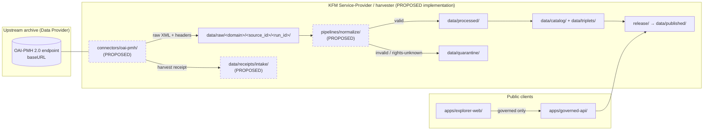

<!-- [KFM_META_BLOCK_V2]
doc_id: kfm://doc/standards-oai-pmh
title: OAI-PMH 2.0 — KFM Conformance and Harvest Posture
type: standard
version: v0.1
status: draft
owners: Docs steward; Source Intake lane (PROPOSED — verify in CODEOWNERS)
created: 2026-05-14
updated: 2026-05-14
policy_label: public
related:
  - docs/standards/README.md
  - docs/standards/STAC_DWC_PROFILE.md
  - docs/sources/README.md
  - docs/doctrine/lifecycle-law.md
  - docs/doctrine/truth-posture.md
  - docs/architecture/contract-schema-policy-split.md
  - control_plane/source_authority_register.yaml
tags: [kfm, standards, oai-pmh, harvest, archives, ingest]
notes:
  - "Path quoted from prompt; UPPER_SNAKE filename style used by adjacent standards docs (STAC_DWC_PROFILE.md) — naming consistency to be confirmed in §15 README of docs/standards/."
  - "All KFM repo paths PROPOSED until verified against mounted-repo evidence per Directory Rules §0."
[/KFM_META_BLOCK_V2] -->

# OAI-PMH 2.0 — KFM Conformance and Harvest Posture

> Conformance posture, lifecycle placement, and governance constraints for KFM's use of the Open Archives Initiative Protocol for Metadata Harvesting (OAI-PMH) version 2.0 as a metadata-ingest standard.


| Field | Value |
|---|---|
| **Doc status** | `draft` |
| **KFM role** | Service Provider (harvester) — **CONFIRMED doctrine**, implementation **PROPOSED** |
| **Data Provider role** | **PROPOSED / future expansion** (contribution-back of KFM-derived records) |
| **Owners** | Docs steward · Source Intake lane *(placeholders — verify in CODEOWNERS)* |
| **Last reviewed** | 2026-05-14 |
| **Spec version** | OAI-PMH 2.0 (2002-06-14; latest editorial revision 2015-01-08) |
| **Spec home** | <https://www.openarchives.org/OAI/openarchivesprotocol.html> |

---

## Quick links

- [Purpose and scope](#purpose-and-scope)
- [Status labels in this document](#status-labels-in-this-document)
- [KFM role: Service Provider, not Data Provider (by default)](#kfm-role-service-provider-not-data-provider-by-default)
- [Lifecycle placement](#lifecycle-placement)
- [Protocol primer (external)](#protocol-primer-external)
- [KFM `SourceDescriptor` mapping for OAI-PMH endpoints](#kfm-sourcedescriptor-mapping-for-oai-pmh-endpoints)
- [Harvest receipt mapping (`RunReceipt`)](#harvest-receipt-mapping-runreceipt)
- [Conformance posture and trust rules](#conformance-posture-and-trust-rules)
- [Conflicts between OAI-PMH defaults and KFM doctrine](#conflicts-between-oai-pmh-defaults-and-kfm-doctrine)
- [Rights, sensitivity, and the `about` container](#rights-sensitivity-and-the-about-container)
- [Kansas archive coverage (PROPOSED / NEEDS VERIFICATION)](#kansas-archive-coverage-proposed--needs-verification)
- [Operational guidance](#operational-guidance)
- [Validation expectations](#validation-expectations)
- [Open questions and NEEDS VERIFICATION](#open-questions-and-needs-verification)
- [Related docs](#related-docs)
- [Appendix — illustrative requests, responses, and error model](#appendix--illustrative-requests-responses-and-error-model)
- [References](#references)

---

## Purpose and scope

This document records how the Kansas Frontier Matrix (KFM) **consumes** OAI-PMH version 2.0 as part of its source-intake lane, and how an OAI-PMH source flows through the KFM governed lifecycle without short-circuiting evidence, policy, review, release, correction, or rollback gates.

It is a **standards-conformance reference**, not an implementation guide. It explains:

- which parts of OAI-PMH KFM treats as authoritative,
- which parts KFM constrains or overrides via the trust spine,
- how OAI-PMH artifacts map onto KFM object families (`SourceDescriptor`, `RunReceipt`, `EvidenceRef`, `EvidenceBundle`, `PolicyDecision`),
- and where the corpus is explicit, inferred, or silent.

It is **not** an authority for whether a specific Kansas institution publishes OAI-PMH today — the corpus identifies OAI-PMH as one of several archive-ingest patterns but does not enumerate per-institution endpoints. See [Kansas archive coverage](#kansas-archive-coverage-proposed--needs-verification).

> [!NOTE]
> Directory Rules §6.1 places this file under `docs/standards/` — the canonical home for external standards KFM conforms to. The path and the file's audience (architects, source-intake stewards, connector authors) follow that placement.

---

## Status labels in this document

Per Directory Rules §0 and the project's truth-label discipline:

| Label | Meaning in this doc |
|---|---|
| **CONFIRMED** | Verified in this session from attached doctrine, the canonical OAI-PMH 2.0 spec, or directly checkable workspace evidence. |
| **PROPOSED** | Design, placement, or recommendation not verified in implementation. Most KFM-internal paths in this doc are PROPOSED. |
| **EXTERNAL** | Sourced from the canonical OAI-PMH 2.0 specification at openarchives.org. Cited in [References](#references). |
| **NEEDS VERIFICATION** | Checkable, but not yet verified — e.g., per-institution publication of an OAI endpoint. |
| **UNKNOWN** | Not resolvable from this session's evidence. |

---

## KFM role: Service Provider, not Data Provider (by default)

OAI-PMH defines two participant classes — *Data Providers* expose metadata; *Service Providers* harvest it. **EXTERNAL** [^oai-spec]

| KFM role | Status | Notes |
|---|---|---|
| **Service Provider** (harvester of upstream archival metadata) | **CONFIRMED** as ingest doctrine; **PROPOSED** as implementation | The KFM corpus identifies OAI-PMH as one of the ingest pathways used for the Kansas archives stack alongside stable REST APIs and bespoke PDF/CSV agents. |
| **Data Provider** (re-exposing KFM-derived records to upstream harvesters) | **PROPOSED / future expansion** | The corpus names a "contribution-back" pipeline as an expansion direction for the archives stack and as a possible SNAC/EAC-CPF contribution path. No KFM Data Provider implementation is asserted. |

> [!IMPORTANT]
> KFM's default posture is **harvester-only**. Any KFM-as-Data-Provider activation MUST go through an ADR (Directory Rules §2.4: parallel home / new external surface), explicit rights review, and a policy decision — it is not a quiet code change.

---

## Lifecycle placement

OAI-PMH harvest output is **admission edge** material. It enters the lifecycle through `data/raw/` (or `data/quarantine/` on failure), is normalized into KFM canonical shapes, and only reaches public surfaces through governed promotion. The OAI-PMH XML envelope itself is **never** a public surface and **never** stands in for an `EvidenceBundle`.



*Diagram status:* arrows and lifecycle stages are **CONFIRMED doctrine** (RAW → WORK/QUARANTINE → PROCESSED → CATALOG/TRIPLET → PUBLISHED); specific file paths are **PROPOSED** until repository inspection confirms them.

---

## Protocol primer (external)

OAI-PMH 2.0 is a low-barrier HTTP+XML protocol for one-way metadata transfer from a *repository* (Data Provider) to a *harvester* (Service Provider). **EXTERNAL** [^oai-spec]

### Six verbs

A harvester issues one of six request verbs. The verb is always required; other arguments are required, optional, or exclusive depending on the verb. **EXTERNAL** [^oai-spec]

| Verb | Purpose | KFM consumer notes |
|---|---|---|
| `Identify` | Retrieve repository description (name, baseURL, earliest datestamp, deletion-tracking level, granularity, admin email). | Probe **once per harvest cycle** and snapshot the response into the source descriptor; deletion level and granularity drive downstream policy. |
| `ListMetadataFormats` | Enumerate formats the repository can disseminate. | Decide whether KFM will request `oai_dc`, `oai_ead`, or a richer format the repository supports. |
| `ListSets` | Enumerate the repository's set hierarchy (if any). | Sets become candidate scoping anchors for KFM domain lanes; record them in the source descriptor. |
| `ListIdentifiers` | Return headers only (identifiers, datestamps, set membership) for selective harvesting. | Cheaper than `ListRecords` for change-detection / debounce. |
| `ListRecords` | Return full headers + metadata + optional `about` containers. | The main bulk-harvest verb; receipts MUST record `metadataPrefix`, `from`, `until`, and `set` arguments. |
| `GetRecord` | Return one record by identifier + `metadataPrefix`. | Used for re-fetches, repair flows, and correction-trace harvests. |

### Selective harvesting

Harvesters narrow a request using **datestamp** ranges (`from`, `until`) and/or **set membership** (`set` argument). Range arguments are inclusive; day granularity is mandatory and second granularity is optional, with support advertised in the `Identify` response. **EXTERNAL** [^oai-spec]

### Deletion tracking

Repositories advertise one of three deletion-support levels in `Identify`: `no` (no deletion history exposed), `persistent` (full history kept), or `transient` (deletion status may surface but is not guaranteed). **EXTERNAL** [^oai-spec]

This matters to KFM because `deletedRecord=no` means upstream deletions are invisible to incremental harvesting and KFM's normalization layer can over-state continued availability — see [Conflicts](#conflicts-between-oai-pmh-defaults-and-kfm-doctrine).

### Flow control: `resumptionToken`

For long list responses the repository returns a `resumptionToken`; the harvester sends the token (alone, no other arguments) to retrieve the next page. **EXTERNAL** [^oai-spec]

### Required baseline metadata format

Every conformant repository MUST be able to disseminate unqualified Dublin Core (`metadataPrefix=oai_dc`). Richer formats (e.g., EAD 2002 for archival description, METS, MARCXML) are optional and repository-dependent. **EXTERNAL** [^oai-spec]

> [!TIP]
> KFM SHOULD request the **richest** format the source supports (e.g., `oai_ead` for archival finding aids) and fall back to `oai_dc` only when nothing better is offered. The choice is recorded in `SourceDescriptor.format_preference` so it is reviewable per harvest.

---

## KFM `SourceDescriptor` mapping for OAI-PMH endpoints

OAI-PMH endpoints map onto KFM's `SourceDescriptor` object family. The shape below is **PROPOSED** — schema home is `schemas/contracts/v1/source/` per ADR-0001 — and is meant to be reviewed against the canonical `SourceDescriptor` schema before adoption.

| OAI-PMH concept | `SourceDescriptor` field (PROPOSED) | Notes |
|---|---|---|
| `baseURL` (from `Identify`) | `access.endpoint_url` | Required; treated as the source identity URL alongside the institution name. |
| `repositoryName` | `source_name` | Human-readable label. |
| `protocolVersion` | `access.protocol` (`"OAI-PMH/2.0"`) | Pinned; mismatch ⇒ DENY admission. |
| `earliestDatestamp` | `temporal.earliest_available` | Used to bound the first full harvest window. |
| `granularity` | `temporal.granularity` | `day` or `second`; drives `from`/`until` formatting. |
| `deletedRecord` level | `lifecycle.upstream_deletion_support` | `no` / `persistent` / `transient` — see [Conflicts](#conflicts-between-oai-pmh-defaults-and-kfm-doctrine). |
| `ListMetadataFormats` choice | `format_preference` (ordered list) | First supported entry is harvested; fallback ordering recorded. |
| `ListSets` membership | `scope.set_filters` | Optional set narrowing for domain lanes. |
| `adminEmail` (from `Identify`) | `contacts.upstream_admin` | Recorded for incident reach-back; never published. |
| Rights / terms (external to OAI-PMH) | `rights.license_id`, `rights.attribution`, `rights.redistribution` | OAI-PMH does not carry license uniformly; KFM MUST obtain rights out-of-band and record them explicitly. |

> [!WARNING]
> **OAI-PMH does not standardize license metadata.** Rights cannot be inferred from a successful harvest; absence of rights information is **fail-closed** under KFM policy — the source goes to `data/quarantine/` until rights are resolved.

---

## Harvest receipt mapping (`RunReceipt`)

Every OAI-PMH harvest MUST emit a `RunReceipt` per the KFM evidence-first envelope. The fields below are a **PROPOSED** profile — the canonical `RunReceipt` schema lives under `schemas/contracts/v1/receipts/` and is the authority for shape.

| Receipt field (PROPOSED) | Source / computation |
|---|---|
| `source_id` | Stable KFM source identifier (e.g., `oai-pmh:kshs-kansas-memory` — illustrative). |
| `endpoint_url` | `baseURL` resolved at fetch time. |
| `verb` | One of the six OAI-PMH verbs invoked. |
| `request_args` | Canonical key-sorted JSON of `metadataPrefix`, `from`, `until`, `set`, `identifier`, `resumptionToken` as applicable. |
| `request_args_spec_hash` | `BLAKE3` or `SHA-256` of the canonicalized request args (RFC 8785 JCS), per KFM hashing doctrine. |
| `response_etag` | HTTP `ETag` of the upstream response, if present. |
| `response_last_modified` | HTTP `Last-Modified` of the upstream response, if present. |
| `responseDate` | `<responseDate>` element from the OAI-PMH envelope. |
| `record_count` | Count of `<record>` elements parsed; zero is a legitimate value (no-change harvest). |
| `resumption_chain` | Ordered list of `resumptionToken` values exchanged for this run, with per-page hashes. |
| `deletion_observations` | List of records observed with `header/@status="deleted"`, if any. |
| `error_codes_observed` | OAI-PMH error codes returned in any page (see [Error model](#error-model-external)). |
| `raw_payload_digest` | Content digest of the persisted raw XML payload(s). |
| `outcome` | `ANSWER` / `ABSTAIN` / `DENY` / `ERROR`, matching the KFM `DecisionEnvelope` family. |
| `signature` | DSSE signature over the canonicalized receipt, per KFM signing doctrine (**PROPOSED** for harvest receipts). |

A "no-change" harvest — i.e., one whose `resumption_chain` resolved zero new records and whose observed datestamps overlap an existing window — SHOULD still emit a heartbeat receipt rather than silently skipping; this matches the corpus's debounce/coalesce pattern for event-driven ingestion.

---

## Conformance posture and trust rules

KFM treats OAI-PMH endpoints as **upstream sources of typed metadata records**, not as truth surfaces.

| KFM invariant | OAI-PMH consequence |
|---|---|
| **Cite-or-abstain.** | An OAI-PMH harvest produces candidate evidence; it does not authorize a public claim. The corresponding `EvidenceRef` MUST resolve to an `EvidenceBundle` (or a clearly recorded ABSTAIN) before publication. |
| **Fail-closed defaults.** | Missing rights, unknown deletion-support level, or unparseable XML ⇒ quarantine, not silent admission. |
| **Watcher-as-non-publisher.** | The harvest worker MUST emit receipts and candidate records only — never write to `data/processed/`, `data/catalog/`, or `data/published/`. |
| **Lifecycle invariant.** | RAW → WORK/QUARANTINE → PROCESSED → CATALOG/TRIPLET → PUBLISHED is preserved. There is no "harvest direct to catalog" shortcut. |
| **Trust membrane.** | Public clients reach harvested archive metadata only through `apps/governed-api/`. The raw OAI-PMH XML envelope is **never** exposed as the public surface. |
| **Deterministic identity.** | KFM-side identifiers are computed from canonicalized source descriptors and content (`spec_hash`); they do not inherit the OAI identifier directly. The OAI identifier is preserved as a **provenance pointer** inside the candidate record. |

---

## Conflicts between OAI-PMH defaults and KFM doctrine

The following conflicts are surfaced rather than smoothed over. Each is a known divergence between an OAI-PMH default and a KFM invariant; each requires a documented policy decision at the connector or source level.

| # | OAI-PMH default | KFM doctrine | Resolution posture (PROPOSED) |
|---|---|---|---|
| 1 | Dublin Core (`oai_dc`) is the **only required** dissemination format. | KFM evidence model favors richer, source-faithful formats (EAD 2002, METS, native schemas) when available. | Prefer richer formats; record `oai_dc`-only sources with reduced confidence and additional normalization caveats. |
| 2 | `deletedRecord=no` is a legal posture. | KFM prefers full lineage and explicit revocation (`Tombstones`). | Sources advertising `deletedRecord=no` are flagged in `lifecycle.upstream_deletion_support` and downstream consumers MUST treat continued availability as **provisional**, not guaranteed. |
| 3 | Date granularity may be **day-only**. | KFM temporal modeling tracks observed / valid / source / retrieval / release / correction times more precisely. | Day-only sources are recorded as such; KFM-side retrieval time is captured separately at full precision in the `RunReceipt`. |
| 4 | OAI-PMH does **not standardize rights / license** carriage. | KFM `SourceDescriptor` requires explicit rights before admission. | Rights resolved out-of-band (per institution); absence ⇒ quarantine. |
| 5 | `about` container provenance uses `oai_provenance.xsd`. | KFM provenance uses PROV-O / PAV inside `EvidenceBundle` JSON-LD. | Translate `oai_provenance` into the KFM provenance model during normalization; preserve the original `about` payload inside the raw artifact for replay. |
| 6 | OAI identifier scheme is community-defined (`oai-identifier` is optional). | KFM identity is computed (`spec_hash`, content hash), not assigned. | OAI identifiers travel as **referenced provenance**, not as KFM primary keys. |
| 7 | Harvesters poll on a schedule chosen by the harvester. | KFM debounces and coalesces deltas to avoid cache churn. | Default debounce windows per source family; values tracked in `docs/standards/DEBOUNCE_WINDOWS.md` (referenced by the corpus, **NEEDS VERIFICATION** for current authoring state). |

---

## Rights, sensitivity, and the `about` container

OAI-PMH's `about` container is an optional, repeatable XML element that may carry rights statements or provenance statements alongside a record's metadata. **EXTERNAL** [^oai-spec]

For KFM:

- An `about` rights block is treated as **upstream-claimed terms**, not as the KFM rights decision. KFM's policy engine still runs its own rights check; an `about` rights statement is evidence the engine consumes, not a decision it accepts.
- An `about` provenance block is preserved in the raw payload and **translated** during normalization into the KFM provenance model (PROV-O / PAV inside the `EvidenceBundle`). The translation is recorded — losses or expansions are part of the `TransformReceipt`.
- Sensitivity classifications (CARE, living-person data, rare-species locations, archaeological coordinates, infrastructure detail, DNA/genomic data) are **never** trusted to be carried by OAI-PMH. They are evaluated by KFM's `SensitivityRubric` against the canonical content during normalization, with conservative defaults for any unclassified record.

> [!CAUTION]
> Archival collections frequently surface **living-person records**, **culturally sensitive material**, and **rare-species locations** without explicit sensitivity flags. The OAI-PMH protocol provides no mechanism for tagging these classes; KFM MUST apply its own sensitivity gates before any record harvested via OAI-PMH crosses a publication boundary.

---

## Kansas archive coverage (PROPOSED / NEEDS VERIFICATION)

The corpus identifies the Kansas archives stack as the primary domain where OAI-PMH ingest is relevant, listing KSHS Kansas Memory, KHRI, KU Spencer, KSU Special Collections, WSU, county historical societies, LOC IIIF presentations, and SNAC/EAC-CPF for cross-archive authority. **CONFIRMED doctrine.**

The corpus also explicitly records the ingest reality: *some* of these institutions publish stable APIs, *some* publish OAI-PMH, and *some* publish PDFs/CSVs that require bespoke agents. The corpus does **not** enumerate which Kansas institutions currently expose an OAI-PMH endpoint or at what stability.

| Institution | OAI-PMH endpoint status | Source-evidence basis |
|---|---|---|
| KSHS / Kansas Memory | **NEEDS VERIFICATION** | Corpus cites Kansas Memory as the largest single source for digitized Kansas materials but does not specify a current OAI-PMH endpoint. |
| KHRI (Kansas Historic Resources Inventory) | **NEEDS VERIFICATION** | Corpus characterizes several Kansas authorities as lacking stable HTTP APIs and relying on PDF/CSV publication. |
| KU Spencer | **NEEDS VERIFICATION** | Not enumerated in the corpus. |
| KSU Special Collections | **NEEDS VERIFICATION** | Not enumerated in the corpus. |
| WSU Special Collections | **NEEDS VERIFICATION** | Not enumerated in the corpus. |
| County historical societies (collectively) | **UNLIKELY** to expose OAI-PMH | Corpus expects the harvest layer to tolerate manual submission flows. |
| LOC IIIF presentations | **Out of scope for this doc** | LOC's federal-level discovery surface is IIIF v3, governed under a separate standards doc when authored. |

> [!IMPORTANT]
> **Do not** infer from this table that any specific institution currently exposes an OAI-PMH endpoint, nor that KFM currently harvests one. The verification workstream sits under the corpus's Missing-Evidence track: *Document Kansas-authority API stability and harvest cadence per authority.*

---

## Operational guidance

The recommendations below are **PROPOSED** operational defaults. Each one should harden into the connector's per-source policy file under `policy/source/<source_id>.rego` (PROPOSED home).

### Harvest cadence

- Per the corpus's debounce/coalesce ingestion model, harvest cadence is **per-source**, not protocol-wide.
- Cadence values live in `docs/standards/DEBOUNCE_WINDOWS.md` (corpus-referenced; **NEEDS VERIFICATION** that the file exists in the live repo).
- A reasonable starting envelope for archival sources is **daily** `ListIdentifiers` polling with **weekly** `ListRecords` reconciliation, but this is a starting heuristic, not a policy.

### Error handling

- All upstream errors result in a quarantine record. Silent skipping is forbidden.
- The KFM error envelope MUST capture the OAI-PMH error code where one is present (see [Error model](#error-model-external)) plus the HTTP status and any retry-after header.

### Idempotency

- The combination of `endpoint_url`, `verb`, canonicalized `request_args`, and upstream `responseDate` SHOULD be sufficient to identify a unique harvest run.
- A `resumption_chain` MUST be persisted in full so that an interrupted harvest can be re-driven without losing intermediate pages.

### Compression

- The protocol permits compression negotiation via standard HTTP `Accept-Encoding`. KFM harvesters SHOULD request `gzip` and record the negotiated encoding in the receipt.

### Rate-limiting and politeness

- OAI-PMH itself does not standardize rate limits, but archival repositories are often resource-constrained. Connectors MUST implement bounded concurrency and exponential backoff on 5xx/`badResumptionToken` responses.

---

## Validation expectations

The validators below are **PROPOSED** placements under `tools/validators/source/oai-pmh/` (PROPOSED). Each must exist as a long-lived, trust-bearing tool — not as test-only logic — per Directory Rules §13.5.

| Validator | Checks |
|---|---|
| `oai_envelope_schema` | XML response validates against the canonical `OAI-PMH.xsd`. |
| `oai_identify_completeness` | `Identify` response carries `repositoryName`, `baseURL`, `protocolVersion=2.0`, `earliestDatestamp`, `deletedRecord`, `granularity`, `adminEmail`. |
| `oai_metadata_format_supported` | Requested `metadataPrefix` appears in `ListMetadataFormats` for the endpoint (or for the specific identifier). |
| `oai_resumption_chain_integrity` | All pages in a `ListRecords` / `ListIdentifiers` chain share a single canonical request key and chain hashes match. |
| `oai_deletion_observability_gate` | If `deletedRecord=no`, downstream normalization records the provisional-availability caveat. |
| `oai_rights_presence_gate` | Either an `about` rights block OR an out-of-band `SourceDescriptor.rights` entry exists; otherwise ⇒ DENY. |
| `oai_sensitivity_classifier_runs` | Sensitivity rubric was evaluated on the normalized record; classification is captured in the candidate output. |
| `oai_receipt_signed` | Run receipt is DSSE-signed before any promotion from `data/raw/` to `data/processed/`. |

Negative-state fixtures (DENY / ABSTAIN / ERROR) MUST exist for each validator. The KFM corpus is explicit: validators that have never been exercised on a failing case are not enforceable.

---

## Open questions and NEEDS VERIFICATION

These are explicitly unresolved by this document and should be tracked in `docs/registers/VERIFICATION_BACKLOG.md`:

1. **NEEDS VERIFICATION** — Whether `connectors/oai-pmh/` exists in the live repo and at what implementation maturity.
2. **NEEDS VERIFICATION** — Which specific Kansas institutions currently expose an OAI-PMH endpoint, the format(s) supported, and `Identify`-advertised deletion-tracking level.
3. **NEEDS VERIFICATION** — Whether `docs/standards/DEBOUNCE_WINDOWS.md` exists in the live repo; the corpus references it as an authoring target.
4. **OPEN** — Whether KFM will activate a Data-Provider role (re-expose KFM-derived archival records via OAI-PMH) and under what governance. The corpus names this as a contribution-back expansion, not as a current commitment.
5. **OPEN** — Whether `oai_ead`, METS, MODS, or another archival format takes precedence over `oai_dc` per institution.
6. **OPEN** — Whether KFM treats an OAI `about/provenance` block as a first-class `EvidenceRef` or strictly as upstream provenance evidence to be re-modeled via PROV-O.
7. **OPEN** — Default debounce windows per archival source family (numbers not given in the corpus).
8. **OPEN** — The naming convention for files in `docs/standards/`. Adjacent corpus references use `STAC_DWC_PROFILE.md` (UPPER_SNAKE); this file uses `oai-pmh.md` (kebab-case) as supplied. A `docs/standards/README.md` should pin one convention.

---

## Related docs

- `docs/standards/README.md` *(parent README; PROPOSED if not present)*
- `docs/standards/STAC_DWC_PROFILE.md` *(corpus-referenced authoring target; NEEDS VERIFICATION)*
- `docs/standards/DEBOUNCE_WINDOWS.md` *(corpus-referenced authoring target; NEEDS VERIFICATION)*
- `docs/sources/README.md` — source-descriptor standards and source families
- `docs/doctrine/lifecycle-law.md` — RAW → WORK/QUARANTINE → PROCESSED → CATALOG/TRIPLET → PUBLISHED
- `docs/doctrine/truth-posture.md` — cite-or-abstain, fail-closed
- `docs/doctrine/trust-membrane.md` — governed-API discipline
- `docs/architecture/contract-schema-policy-split.md` — the four-layer governance split
- `docs/adr/` — `ADR-0001-schema-home.md` and any future ADR governing connector activation or Data-Provider role
- `control_plane/source_authority_register.yaml` — authoritative register for source identity and source-authority role
- `connectors/README.md` *(PROPOSED home for `oai-pmh/` connector)*
- `tools/validators/source/` *(PROPOSED home for OAI-PMH validators)*

---

## Appendix — illustrative requests, responses, and error model

> [!NOTE]
> The verb invocations and response sketches below are **illustrative**, modeled on the canonical OAI-PMH 2.0 specification. They are not captured from a KFM harvest run.

<details>
<summary><strong>Verb invocation examples (illustrative)</strong></summary>

```text
# Identify
GET https://example.org/oai?verb=Identify

# Enumerate formats
GET https://example.org/oai?verb=ListMetadataFormats

# Enumerate sets
GET https://example.org/oai?verb=ListSets

# Selective harvest by datestamp range and set, Dublin Core
GET https://example.org/oai?verb=ListRecords&metadataPrefix=oai_dc&from=2026-01-01&until=2026-03-31&set=archives

# Continue a long list using a resumption token (no other args)
GET https://example.org/oai?verb=ListRecords&resumptionToken=xyz123

# Fetch one record
GET https://example.org/oai?verb=GetRecord&identifier=oai:example.org:abc123&metadataPrefix=oai_dc
```

</details>

<details>
<summary><strong>Response shape sketch (illustrative)</strong></summary>

```xml
<!-- ListRecords response, illustrative; not captured from a live harvest. -->
<OAI-PMH xmlns="http://www.openarchives.org/OAI/2.0/">
  <responseDate>2026-05-14T12:34:56Z</responseDate>
  <request verb="ListRecords" metadataPrefix="oai_dc" set="archives">
    https://example.org/oai
  </request>
  <ListRecords>
    <record>
      <header>
        <identifier>oai:example.org:abc123</identifier>
        <datestamp>2026-05-13</datestamp>
        <setSpec>archives</setSpec>
      </header>
      <metadata>
        <!-- oai_dc:dc payload omitted for brevity -->
      </metadata>
      <about>
        <!-- optional rights and/or provenance container -->
      </about>
    </record>
    <!-- additional records ... -->
    <resumptionToken expirationDate="2026-05-14T13:00:00Z"
                     completeListSize="42000"
                     cursor="0">xyz123</resumptionToken>
  </ListRecords>
</OAI-PMH>
```

</details>

### Error model (external)

OAI-PMH responses encode protocol-level errors inside the XML envelope using an `<error>` element with a `code` attribute. The defined error codes include `badArgument`, `badResumptionToken`, `badVerb`, `cannotDisseminateFormat`, `idDoesNotExist`, `noRecordsMatch`, `noMetadataFormats`, and `noSetHierarchy`. **EXTERNAL** [^oai-spec]

| OAI error code | KFM mapping (PROPOSED) |
|---|---|
| `badVerb`, `badArgument` | Connector bug or upstream change ⇒ `ERROR`; quarantine the run; alert. |
| `badResumptionToken` | Token expired or invalid ⇒ retry from a fresh `ListIdentifiers`/`ListRecords`; record the chain break in the receipt. |
| `cannotDisseminateFormat` | Requested `metadataPrefix` unavailable ⇒ fall back per `SourceDescriptor.format_preference`; quarantine if no fallback. |
| `idDoesNotExist` | Identifier unknown ⇒ record as a deletion-like signal **only if** `Identify.deletedRecord ∈ {persistent, transient}`; otherwise treat as upstream churn and quarantine. |
| `noRecordsMatch` | Empty result for the selective-harvest criteria ⇒ legitimate `ANSWER` outcome; emit a heartbeat receipt with `record_count = 0`. |
| `noMetadataFormats` | No formats advertised for an identifier ⇒ quarantine. |
| `noSetHierarchy` | Repository has no set organization ⇒ note in `SourceDescriptor.scope`; not an error per se. |

---

## References

[^oai-spec]: Open Archives Initiative — *The Open Archives Initiative Protocol for Metadata Harvesting* (Protocol Version 2.0; document revision 2015-01-08). <https://www.openarchives.org/OAI/openarchivesprotocol.html>

Implementation guidelines and migration notes: <https://www.openarchives.org/OAI/2.0/guidelines.htm>

---

*Last reviewed: 2026-05-14 · Doc status: draft · [Back to top](#oai-pmh-20--kfm-conformance-and-harvest-posture)*
