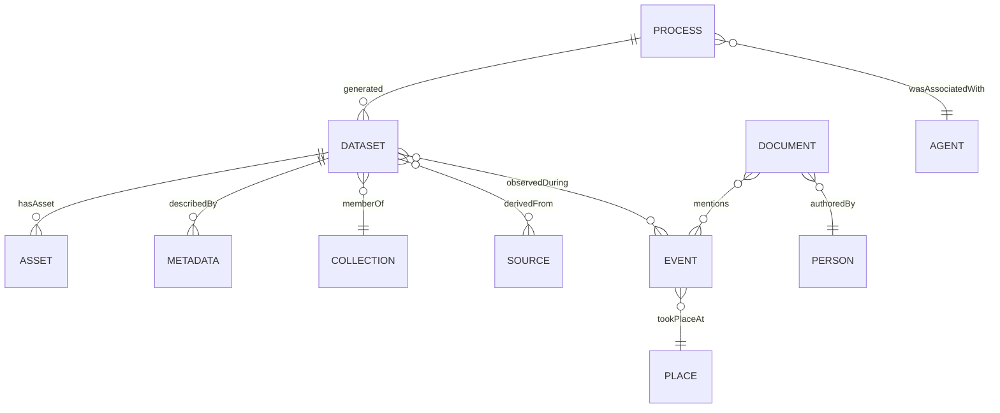

<div align="center">

# 🧠 Kansas Frontier Matrix — **Ontology & Semantic Standards**  
`docs/standards/ontologies.md`

**Master Coder Protocol (MCP-DL v6.3+) · Interoperability · Provenance · Machine-Readability · Validation**

[](../../docs/)
[](../../.github/workflows/graph-validate.yml)
[](../../.github/workflows/stac-validate.yml)
[-orange)](../standards/security.md)
[](../../LICENSE)

</div>

---

```yaml
---
title: "Kansas Frontier Matrix — Ontology & Semantic Standards"
version: "v1.3.0"
last_updated: "2025-10-18"
owners: ["@kfm-architecture","@kfm-data","@kfm-docs"]
tags: ["ontology","semantics","rdf","json-ld","prov","cidoc","geosparql","owl-time","skos","stac"]
status: "Stable"
scope: "Monorepo-Wide"
license: "CC-BY 4.0"
semver_policy: "MAJOR.MINOR.PATCH"
ci_required_checks:
  - docs-validate
  - graph-validate
  - stac-validate
audit_framework: "MCP-DL v6.3"
semantic_alignment:
  - CIDOC CRM 7.1
  - W3C PROV-O
  - STAC 1.0
  - OWL-Time
  - GeoSPARQL
  - SKOS
  - DCAT 2.0
  - PeriodO
  - JSON-LD 1.1
---
````

---

## 📚 Overview

KFM unifies **spatial**, **temporal**, and **provenance** semantics in a single knowledge ecosystem spanning:

* **What exists**: *datasets, assets, collections, events, places, people, organizations, documents, models, processes*
* **How they relate**: *derived_from, used, generated_by, took_place_at, authored_by, validated_by*
* **How we define meaning**: *CIDOC CRM, PROV-O, STAC, OWL-Time, GeoSPARQL, SKOS, DCAT, PeriodO*, plus minimal KFM MCP predicates

This standard guarantees that metadata, datasets, and knowledge-graph elements are **interoperable**, **machine-readable**, and **MCP-aligned** for transparent provenance and reproducible research.

---

## 🧩 Core Ontologies & Vocabularies

| Ontology / Standard | Prefix         | Purpose                                                                    | Canonical                                                                          |
| :------------------ | :------------- | :------------------------------------------------------------------------- | :--------------------------------------------------------------------------------- |
| CIDOC CRM (v7.1)    | `crm:`         | Event-centric cultural heritage modeling (actors, events, places, objects) | [https://www.cidoc-crm.org/](https://www.cidoc-crm.org/)                           |
| W3C PROV-O          | `prov:`        | Provenance: Entities, Activities, Agents; derivation, attribution, usage   | [https://www.w3.org/TR/prov-o/](https://www.w3.org/TR/prov-o/)                     |
| STAC (v1.0)         | `stac:`        | Geospatial catalog & assets (Items/Collections + relations)                | [https://stacspec.org](https://stacspec.org)                                       |
| OWL-Time            | `time:`        | Temporal instants/intervals & relations                                    | [https://www.w3.org/TR/owl-time/](https://www.w3.org/TR/owl-time/)                 |
| GeoSPARQL (OGC)     | `geo:`         | Spatial relationships & geometry literals (WKT/GeoJSON)                    | [https://www.ogc.org/standards/geosparql](https://www.ogc.org/standards/geosparql) |
| SKOS                | `skos:`        | Controlled vocabularies (themes, concepts)                                 | [https://www.w3.org/TR/skos-reference/](https://www.w3.org/TR/skos-reference/)     |
| DCAT 2.0            | `dcat:`/`dct:` | Catalog/distribution fields for harvesting & portals                       | [https://www.w3.org/TR/vocab-dcat-2/](https://www.w3.org/TR/vocab-dcat-2/)         |
| PeriodO             | `periodo:`     | Scholarly definitions for named historical periods                         | [https://perio.do/](https://perio.do/)                                             |
| KFM MCP             | `mcp:`         | Reproducibility & audit fields (checksum_verified, build_commit, etc.)     | (KFM internal)                                                                     |

---

## 🗂 Namespace Registry & IRI Policy

**Base IRI:** `https://kfm.org/id/` • **Context:** `docs/contexts/kfm.context.jsonld`

**CURIE patterns**

* Datasets: `kfm:dataset/<slug>` → `https://kfm.org/id/dataset/<slug>`
* Assets: `kfm:asset/<slug>`
* Collections: `kfm:collection/<slug>`
* Events: `kfm:event/<slug>`
* Places: `kfm:place/<authority>/<id>` (prefer GNIS/Wikidata)
* Documents: `kfm:doc/<slug>`
* Models: `kfm:model/<slug>`
* Processes/Workflows: `kfm:process/<slug>`
* Agents: `kfm:agent/<orcid|grid|local>/<id>`

**ID rules**

* Stable, kebab/snake case, ASCII, no spaces.
* Prefer authoritative IDs with `owl:sameAs` (e.g., Wikidata QIDs, GNIS ids).

---

## 🧠 KFM Conceptual Model (overview)



> **Note:** In RDF, prefer explicit CIDOC/PROV properties (`crm:P7_took_place_at`, `prov:wasGeneratedBy`, etc.); STAC relationships are mirrored with `prov` links and `dc:*` identifiers.

---

## 🔁 Semantic Mappings

### A) STAC ↔ RDF (selected)

| STAC                      | RDF / Ontology                            | Note                                        |
| :------------------------ | :---------------------------------------- | :------------------------------------------ |
| Item                      | `crm:E73_Information_Object`, `stac:Item` | Treat Item as an information object/product |
| Collection                | `crm:E78_Collection`, `stac:Collection`   | Logical grouping of Items                   |
| `links[rel=derived_from]` | `prov:wasDerivedFrom`                     | Lineage                                     |
| `assets.*`                | `prov:Entity` + `dc:identifier`           | Treat files as Entities                     |
| bbox/geometry             | `geo:hasGeometry`                         | WKT/GeoJSON literal                         |
| `datetime`/interval       | `time:hasTime`                            | Instant/Interval modeling                   |

### B) Neo4j (property graph) ↔ RDF (triple model)

| Neo4j Node/Rel                          | RDF Class/Property                    |
| :-------------------------------------- | :------------------------------------ |
| `(:Dataset {id})`                       | `crm:E73`, `stac:Item`                |
| `(:Collection)`                         | `crm:E78`, `stac:Collection`          |
| `(:Event)`                              | `crm:E5_Event`                        |
| `(:Place)`                              | `crm:E53_Place` (+ `geo:hasGeometry`) |
| `(:Person)`                             | `crm:E21_Person`                      |
| `(:Process)`                            | `prov:Activity`                       |
| `(:Dataset)-[:DERIVED_FROM]->(:Source)` | `prov:wasDerivedFrom`                 |
| `(:Dataset)-[:OCCURRED_AT]->(:TimeBox)` | `time:hasTime`                        |
| `(:Event)-[:TOOK_PLACE_AT]->(:Place)`   | `crm:P7_took_place_at`                |

> **Export mappers:** `src/graph/exporters/{neo4j_to_rdf.py,rdf_to_neo4j.py}` maintain a 1:1 predicate mapping.

---

## 🧬 RDF/TTL Examples

### 1) Dataset + provenance (Turtle)

```turtle
@prefix crm: <http://www.cidoc-crm.org/cidoc-crm/> .
@prefix prov: <http://www.w3.org/ns/prov#> .
@prefix stac: <https://stacspec.org/v1.0.0/schema#> .
@prefix time: <http://www.w3.org/2006/time#> .
@prefix dc:   <http://purl.org/dc/terms/> .
@prefix geo:  <http://www.opengis.net/ont/geosparql#> .
@prefix mcp:  <https://kfm.org/vocab/mcp#> .
@prefix kfm:  <https://kfm.org/id/> .

kfm:dataset/ks_1m_dem_2018_2020
    a crm:E73_Information_Object , stac:Item ;
    dc:title "Kansas 1m DEM (2018–2020)" ;
    prov:wasDerivedFrom kfm:dataset/usgs_3dep_dem ;
    prov:wasGeneratedBy kfm:process/terrain_pipeline ;
    geo:hasGeometry kfm:geom/kansas_extent ;
    time:hasTime kfm:time/2018_2020 ;
    mcp:checksumVerified true ;
    mcp:buildCommit "a93f2c4" .

kfm:process/terrain_pipeline
    a prov:Activity ;
    prov:used kfm:dataset/usgs_3dep_dem ;
    prov:wasAssociatedWith kfm:agent/data_engineering_team .
```

### 2) Time interval (OWL-Time)

```turtle
@prefix time: <http://www.w3.org/2006/time#> .
@prefix kfm:  <https://kfm.org/id/> .

kfm:time/2018_2020 a time:Interval ;
  time:hasBeginning [ a time:Instant ; time:inXSDDateTime "2018-01-01T00:00:00Z"^^xsd:dateTime ] ;
  time:hasEnd       [ a time:Instant ; time:inXSDDateTime "2020-12-31T23:59:59Z"^^xsd:dateTime ] .
```

### 3) Geometry (GeoSPARQL)

```turtle
@prefix geo: <http://www.opengis.net/ont/geosparql#> .
@prefix sf:  <http://www.opengis.net/ont/sf#> .
@prefix kfm: <https://kfm.org/id/> .

kfm:geom/kansas_extent a sf:Polygon ;
  geo:asWKT "POLYGON ((-102.05 36.99, -94.59 36.99, -94.59 40.00, -102.05 40.00, -102.05 36.99))"^^geo:wktLiteral .
```

---

## 🏷 Controlled Vocabularies (SKOS) & Periods (PeriodO)

* Maintain SKOS concept schemes under `data/vocabularies/` and register them in the catalog.
* Link events to PeriodO periods where appropriate for historical alignment.

```turtle
@prefix skos:   <http://www.w3.org/2004/02/skos/core#> .
@prefix periodo:<http://n2t.net/ark:/99152/p0/> .
@prefix kfm:    <https://kfm.org/id/> .

kfm:concept/terrain a skos:Concept ;
  skos:prefLabel "Terrain"@en ;
  skos:inScheme kfm:scheme/themes ;
  skos:exactMatch <https://www.wikidata.org/entity/Q271669> .

kfm:event/dust_bowl_1930s
  skos:related periodo:p0v5dfwhgd3 .
```

---

## 🧩 JSON-LD `@context` (copy-paste)

Create `docs/contexts/kfm.context.jsonld`:

```json
{
  "@context": {
    "crm": "http://www.cidoc-crm.org/cidoc-crm/",
    "prov": "http://www.w3.org/ns/prov#",
    "stac": "https://stacspec.org/v1.0.0/schema#",
    "time": "http://www.w3.org/2006/time#",
    "dc": "http://purl.org/dc/terms/",
    "geo": "http://www.opengis.net/ont/geosparql#",
    "skos": "http://www.w3.org/2004/02/skos/core#",
    "mcp": "https://kfm.org/vocab/mcp#",
    "kfm": "https://kfm.org/id/",
    "title": "dc:title",
    "derivedFrom": "prov:wasDerivedFrom",
    "generatedBy": "prov:wasGeneratedBy",
    "hasGeometry": "geo:hasGeometry",
    "hasTime": "time:hasTime",
    "checksumVerified": "mcp:checksumVerified",
    "buildCommit": "mcp:buildCommit"
  }
}
```

Use it to compact JSON exports via `"@context": "docs/contexts/kfm.context.jsonld"`.

---

## ✅ SHACL Shapes (quality gates)

Place `docs/shapes/kfm-core.shapes.ttl`:

```turtle
@prefix sh:  <http://www.w3.org/ns/shacl#> .
@prefix crm: <http://www.cidoc-crm.org/cidoc-crm/> .
@prefix prov:<http://www.w3.org/ns/prov#> .
@prefix dc:  <http://purl.org/dc/terms/> .
@prefix xsd: <http://www.w3.org/2001/XMLSchema#> .

# Dataset must have title and at least one provenance link
[] a sh:NodeShape ;
   sh:targetClass crm:E73_Information_Object ;
   sh:property [ sh:path dc:title ; sh:minCount 1 ; sh:datatype xsd:string ] ;
   sh:property [ sh:path prov:wasDerivedFrom ; sh:minCount 1 ] .
```

Run with **pySHACL** in CI.

---

## 🔎 SPARQL Patterns (query cookbook)

**Datasets derived from USGS:**

```sparql
SELECT ?dataset WHERE {
  ?dataset a crm:E73_Information_Object ;
           prov:wasDerivedFrom ?src .
  FILTER(CONTAINS(STR(?src), "usgs"))
}
```

**Events between dates at a place:**

```sparql
SELECT ?event WHERE {
  ?event a crm:E5_Event ;
         crm:P7_took_place_at kfm:place/Kansas ;
         time:hasTime ?t .
  ?t time:hasBeginning/time:inXSDDateTime ?start ;
     time:hasEnd/time:inXSDDateTime ?end .
  FILTER (?start >= "1850-01-01T00:00:00Z"^^xsd:dateTime && ?end <= "1870-12-31T23:59:59Z"^^xsd:dateTime)
}
```

---

## 🧭 Temporal & Spatial Guidance

* **Temporal:** Prefer `time:Interval` with explicit begin/end instants; if only a year is known, use begin=Jan 1 00:00Z and note `kfm:timeNote` in description.
* **Spatial:** Store canonical geometry as **GeoSPARQL WKT**; for rasters, keep a polygon footprint and link to STAC asset for full georeferencing.

---

## 🧾 File Storage & CI Integration

| Component     | Format                    | Directory               | Validation         |
| :------------ | :------------------------ | :---------------------- | :----------------- |
| Ontologies    | `.ttl`, `.rdf`, `.jsonld` | `data/ontologies/`      | RDF syntax + SHACL |
| Contexts      | `.jsonld`                 | `docs/contexts/`        | JSON-LD lint       |
| Shapes        | `.ttl`                    | `docs/shapes/`          | `pySHACL`          |
| Graph Exports | `.ttl`, `.nt`             | `data/knowledge_graph/` | RDF syntax         |
| Logs          | `.log`, `.json`           | `data/work/logs/graph/` | CI artifacts       |

**CI Example** — `.github/workflows/graph-validate.yml`

* `rapper -i turtle data/ontologies/*.ttl -c` (syntax)
* `python -m pyshacl -s docs/shapes/kfm-core.shapes.ttl -m -f human data/knowledge_graph/*.ttl`

Local helper:

```bash
python src/utils/validate_rdf.py data/ontologies/kfm.ttl
```

---

## 🧠 MCP Compliance Summary

| MCP Principle           | Implementation                                                          |
| :---------------------- | :---------------------------------------------------------------------- |
| **Documentation-first** | Ontology spec + JSON-LD context + SHACL shapes are shipped before data. |
| **Reproducibility**     | Versioned ontologies; deterministic exporters; CI graph validation.     |
| **Open Standards**      | CIDOC CRM, PROV-O, STAC, OWL-Time, GeoSPARQL, SKOS, JSON-LD.            |
| **Provenance**          | Explicit PROV links; `mcp:*` audit fields; process/agent modeling.      |
| **Auditability**        | RDF/SHACL logs in `data/work/logs/graph/`; CI badges required.          |

---

## 🔗 Related Documentation

| File                                   | Description                        |
| :------------------------------------- | :--------------------------------- |
| `docs/architecture/knowledge-graph.md` | Graph architecture & data flow     |
| `docs/standards/metadata.md`           | STAC + MCP metadata standards      |
| `docs/standards/data-formats.md`       | File & format rules + CI checks    |
| `docs/templates/provenance.md`         | Human-readable provenance template |
| `.github/workflows/graph-validate.yml` | CI graph validation workflow       |

---

## 📅 Version History

| Version | Date       | Author            | Summary                                                                                                          |
| :------ | :--------- | :---------------- | :--------------------------------------------------------------------------------------------------------------- |
| v1.3.0  | 2025-10-18 | @kfm-architecture | Added JSON-LD context, SHACL shapes, DCAT/PeriodO/SKOS guidance, Neo4j↔RDF mapping, SPARQL cookbook, CI workflow |
| v1.1.0  | 2025-10-05 | @kfm-data         | Expanded STAC↔RDF mapping; provenance fields; file/dir policies                                                  |
| v1.0.0  | 2025-10-04 | @kfm-architecture | Initial ontology & semantic standards                                                                            |

---

<div align="center">

**Kansas Frontier Matrix** — *“Connecting Knowledge Across Time, Space, and Data.”*
📍 `docs/standards/ontologies.md` — Official MCP-compliant ontology & semantic standards for KFM.

</div>
