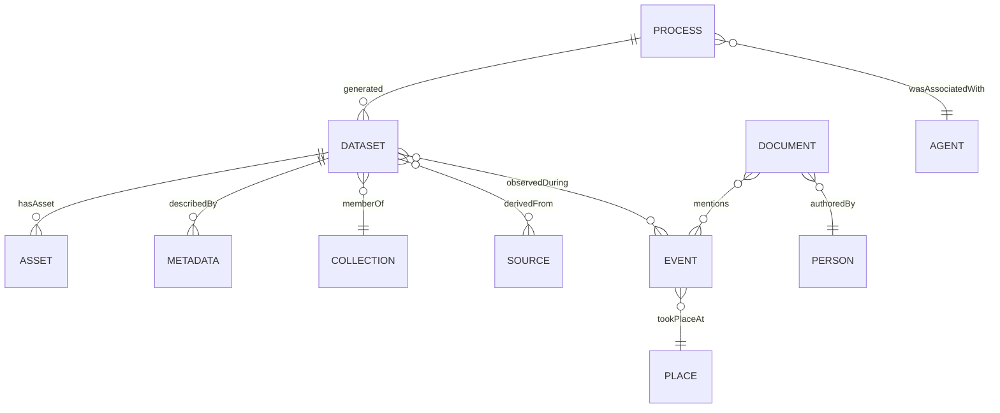

<div align="center">

# 🧠 Kansas Frontier Matrix — Ontology & Semantic Standards

`docs/standards/ontologies.md`

**Purpose:** Define and document the **semantic ontologies and data models** used to describe
entities, relationships, and provenance in the **Kansas Frontier Matrix (KFM)** knowledge ecosystem.
These standards ensure that all metadata, datasets, and knowledge graph elements are **interoperable,
machine-readable, and MCP-aligned** for transparent provenance and reproducible research.

[](../../docs/)
[](../../LICENSE)

</div>

---

## 📚 Overview

KFM unifies **spatial**, **temporal**, and **provenance** semantics in a single, provenance-aware knowledge graph.
Ontologies specify:

* 🧩 **What entities exist:** datasets, events, people, places, documents, models, processes
* 🔗 **How they relate:** derived from, occurred at, authored by, used, validated by
* 🧠 **Which standards define meaning:** CIDOC CRM, PROV-O, STAC, OWL-Time, GeoSPARQL, SKOS

This enables **cross-domain integration** of geospatial, historical, and scientific assets with MCP reproducibility.

---

## 🧩 Core Ontologies & Vocabularies

| Ontology / Standard  | Prefix     | Purpose                                                                       | Canonical                                                                                                                      |
| :------------------- | :--------- | :---------------------------------------------------------------------------- | :----------------------------------------------------------------------------------------------------------------------------- |
| CIDOC CRM (v7.1)     | `crm:`     | Cultural heritage & event-centric modeling (actors, events, places, objects). | [https://www.cidoc-crm.org/](https://www.cidoc-crm.org/)                                                                       |
| W3C PROV-O           | `prov:`    | Provenance: entities, activities, agents, derivation & attribution.           | [https://www.w3.org/TR/prov-o/](https://www.w3.org/TR/prov-o/)                                                                 |
| STAC (v1.0.0)        | `stac:`    | Geospatial catalog metadata & relationships for Items/Collections.            | [https://stacspec.org](https://stacspec.org)                                                                                   |
| Dublin Core Terms    | `dc:`      | Title, creator, subject, date, license descriptors.                           | [https://dublincore.org/specifications/dublin-core/dcmi-terms/](https://dublincore.org/specifications/dublin-core/dcmi-terms/) |
| OWL-Time             | `time:`    | Temporal instants/intervals & relations.                                      | [https://www.w3.org/TR/owl-time/](https://www.w3.org/TR/owl-time/)                                                             |
| GeoSPARQL (OGC)      | `geo:`     | Spatial relationships & geometry literals.                                    | [https://www.ogc.org/standards/geosparql](https://www.ogc.org/standards/geosparql)                                             |
| SKOS                 | `skos:`    | Controlled vocabularies, themes, places, periods.                             | [https://www.w3.org/TR/skos-reference/](https://www.w3.org/TR/skos-reference/)                                                 |
| PeriodO              | `periodo:` | Scholarly definitions for named historical periods.                           | [https://perio.do/](https://perio.do/)                                                                                         |
| MCP Vocabulary (KFM) | `mcp:`     | Reproducibility, auditability, build lineage predicates.                      | (KFM internal)                                                                                                                 |

---

## 🗂 Namespace Registry & IRI Policy

**Base IRI:** `https://kfm.org/id/`
**CURIE patterns:**

* Datasets: `kfm:dataset/<slug>` → `https://kfm.org/id/dataset/<slug>`
* Documents: `kfm:doc/<slug>`
* Events: `kfm:event/<slug>`
* Places: `kfm:place/<gazetteer|local>/<id>` (prefer GNIS/Wikidata when known)
* Models: `kfm:model/<slug>`
* Processes/Workflows: `kfm:process/<slug>`
* Agents: `kfm:agent/<orcid|grid|local>/<id>`

**ID rules**

* Stable, opaque where necessary; kebab/snake case only; ASCII; no spaces.
* External authoritative IDs preferred (Wikidata QIDs, GNIS feature IDs) with `owl:sameAs`.

---

## 🧠 KFM Conceptual Model (overview)



<!-- END OF MERMAID -->

---

## 🔁 Semantic Mappings

### A) STAC ↔ RDF (selected)

| STAC                      | RDF / Ontology                             | Note                                 |
| :------------------------ | :----------------------------------------- | :----------------------------------- |
| Item                      | `crm:E73_Information_Object` & `stac:Item` | A dataset product.                   |
| Collection                | `crm:E78_Collection` & `stac:Collection`   | Logical grouping.                    |
| `links[rel=derived_from]` | `prov:wasDerivedFrom`                      | Lineage to sources.                  |
| `assets.data.href`        | `dc:identifier` + `prov:Entity`            | Treat files as Entities.             |
| bbox/geometry             | `geo:hasGeometry`                          | WKT/GeoJSON literal via GeoSPARQL.   |
| datetime/interval         | `time:hasTime`                             | Model via OWL-Time Instant/Interval. |

### B) Neo4j (property graph) ↔ RDF (triple model)

| Neo4j Node/Rel                          | RDF Class/Property                    |
| :-------------------------------------- | :------------------------------------ |
| `(:Dataset {id})`                       | `crm:E73`, `stac:Item`                |
| `(:Collection)`                         | `crm:E78`, `stac:Collection`          |
| `(:Event)`                              | `crm:E5_Event`                        |
| `(:Place)`                              | `crm:E53_Place` (+ `geo:hasGeometry`) |
| `(:Person)`                             | `crm:E21_Person`                      |
| `(:Process)`                            | `prov:Activity`                       |
| `(:Dataset)-[:DERIVED_FROM]->(:Source)` | `prov:wasDerivedFrom`                 |
| `(:Dataset)-[:OCCURRED_AT]->(:TimeBox)` | `time:hasTime`                        |
| `(:Event)-[:TOOK_PLACE_AT]->(:Place)`   | `crm:P7_took_place_at`                |

> Export mappers: `src/graph/exporters/{neo4j_to_rdf.py, rdf_to_neo4j.py}` (keep 1:1 predicate mapping).

---

## 🧬 RDF/TTL Examples

### 1) Dataset + provenance (Turtle)

```turtle
@prefix crm: <http://www.cidoc-crm.org/cidoc-crm/> .
@prefix prov: <http://www.w3.org/ns/prov#> .
@prefix stac: <https://stacspec.org/v1.0.0/schema#> .
@prefix time: <http://www.w3.org/2006/time#> .
@prefix dc:   <http://purl.org/dc/terms/> .
@prefix geo:  <http://www.opengis.net/ont/geosparql#> .
@prefix mcp:  <https://kfm.org/vocab/mcp#> .
@prefix kfm:  <https://kfm.org/id/> .

kfm:dataset/ks_1m_dem_2018_2020
    a crm:E73_Information_Object , stac:Item ;
    dc:title "Kansas 1m DEM (2018–2020)" ;
    prov:wasDerivedFrom kfm:dataset/usgs_3dep_dem ;
    prov:wasGeneratedBy kfm:process/terrain_pipeline ;
    geo:hasGeometry kfm:geom/kansas_extent ;
    time:hasTime kfm:time/2018_2020 ;
    mcp:checksumVerified true ;
    mcp:buildCommit "a93f2c4" .

kfm:process/terrain_pipeline
    a prov:Activity ;
    prov:used kfm:dataset/usgs_3dep_dem ;
    prov:wasAssociatedWith kfm:agent/data_engineering_team .
```

### 2) Time interval (OWL-Time)

```turtle
@prefix time: <http://www.w3.org/2006/time#> .
@prefix kfm:  <https://kfm.org/id/> .

kfm:time/2018_2020 a time:Interval ;
  time:hasBeginning [ a time:Instant ; time:inXSDDateTime "2018-01-01T00:00:00Z"^^xsd:dateTime ] ;
  time:hasEnd       [ a time:Instant ; time:inXSDDateTime "2020-12-31T23:59:59Z"^^xsd:dateTime ] .
```

### 3) Geometry (GeoSPARQL)

```turtle
@prefix geo: <http://www.opengis.net/ont/geosparql#> .
@prefix sf:  <http://www.opengis.net/ont/sf#> .
@prefix kfm: <https://kfm.org/id/> .

kfm:geom/kansas_extent a sf:Polygon ;
  geo:asWKT "POLYGON ((-102.05 36.99, -94.59 36.99, -94.59 40.00, -102.05 40.00, -102.05 36.99))"^^geo:wktLiteral .
```

---

## 🏷 Controlled Vocabularies (SKOS) & Periods

Use SKOS for themes/topics and **PeriodO** for period alignment.

```turtle
@prefix skos:   <http://www.w3.org/2004/02/skos/core#> .
@prefix periodo:<http://n2t.net/ark:/99152/p0/> .
@prefix kfm:    <https://kfm.org/id/> .

kfm:concept/terrain a skos:Concept ;
  skos:prefLabel "Terrain"@en ;
  skos:inScheme kfm:scheme/themes ;
  skos:exactMatch <https://www.wikidata.org/entity/Q271669> .

kfm:event/dust_bowl_1930s
  skos:related periodo:p0v5dfwhgd3 ( # Dust Bowl period def
  ) .
```

> Maintain SKOS scheme files under `data/vocabularies/` and register in the catalog.

---

## 🧩 JSON-LD `@context` (copy-paste)

Create `docs/contexts/kfm.context.jsonld`:

```json
{
  "@context": {
    "crm": "http://www.cidoc-crm.org/cidoc-crm/",
    "prov": "http://www.w3.org/ns/prov#",
    "stac": "https://stacspec.org/v1.0.0/schema#",
    "time": "http://www.w3.org/2006/time#",
    "dc": "http://purl.org/dc/terms/",
    "geo": "http://www.opengis.net/ont/geosparql#",
    "skos": "http://www.w3.org/2004/02/skos/core#",
    "mcp": "https://kfm.org/vocab/mcp#",
    "kfm": "https://kfm.org/id/",
    "title": "dc:title",
    "derivedFrom": "prov:wasDerivedFrom",
    "generatedBy": "prov:wasGeneratedBy",
    "hasGeometry": "geo:hasGeometry",
    "hasTime": "time:hasTime",
    "checksumVerified": "mcp:checksumVerified",
    "buildCommit": "mcp:buildCommit"
  }
}
```

Use it to compact JSON exports: `@context: "docs/contexts/kfm.context.jsonld"`.

---

## ✅ SHACL Shapes (quality gates)

Place `docs/shapes/kfm-core.shapes.ttl`:

```turtle
@prefix sh:  <http://www.w3.org/ns/shacl#> .
@prefix crm: <http://www.cidoc-crm.org/cidoc-crm/> .
@prefix prov:<http://www.w3.org/ns/prov#> .
@prefix dc:  <http://purl.org/dc/terms/> .

# Dataset must have title and at least one provenance link
[] a sh:NodeShape ;
   sh:targetClass crm:E73_Information_Object ;
   sh:property [ sh:path dc:title ; sh:minCount 1 ; sh:datatype xsd:string ] ;
   sh:property [ sh:path prov:wasDerivedFrom ; sh:minCount 1 ] .
```

Run with `pySHACL` in CI.

---

## 🔎 SPARQL Patterns (query cookbook)

**Find datasets derived from USGS sources:**

```sparql
SELECT ?dataset WHERE {
  ?dataset a crm:E73_Information_Object ;
           prov:wasDerivedFrom ?src .
  FILTER(CONTAINS(STR(?src), "usgs"))
}
```

**Events in a temporal window at a place:**

```sparql
SELECT ?event WHERE {
  ?event a crm:E5_Event ;
         crm:P7_took_place_at kfm:place/Kansas ;
         time:hasTime ?t .
  ?t time:hasBeginning/time:inXSDDateTime ?start ;
     time:hasEnd/time:inXSDDateTime ?end .
  FILTER (?start >= "1850-01-01T00:00:00Z"^^xsd:dateTime && ?end <= "1870-12-31T23:59:59Z"^^xsd:dateTime)
}
```

---

## 🧩 Temporal & Spatial Guidance

* **Temporal:** prefer `time:Interval` with explicit begin/end instants; if only a year known, use begin on Jan 1 + note `kfm:timeNote` in description.
* **Spatial:** store primary geometry as **GeoSPARQL WKT**; for raster footprints keep a polygon; link to STAC asset for full georeferencing.

---

## 🧾 File Storage & CI Integration

| Component     | Format                    | Directory               | Validation         |
| :------------ | :------------------------ | :---------------------- | :----------------- |
| Ontologies    | `.ttl`, `.rdf`, `.jsonld` | `data/ontologies/`      | RDF syntax + SHACL |
| Contexts      | `.jsonld`                 | `docs/contexts/`        | JSON-LD lint       |
| Shapes        | `.ttl`                    | `docs/shapes/`          | `pySHACL`          |
| Graph Exports | `.ttl`, `.nt`             | `data/knowledge_graph/` | RDF syntax         |
| Logs          | `.log`, `.json`           | `data/work/logs/graph/` | CI artifacts       |

**CI example** (`.github/workflows/graph-validate.yml`):

* `rapper -i turtle data/ontologies/*.ttl -c`
* `python -m pyshacl -s docs/shapes/kfm-core.shapes.ttl -m -f human data/knowledge_graph/*.ttl`

Local helper:

```bash
python src/utils/validate_rdf.py data/ontologies/kfm.ttl
```

---

## 🧠 MCP Compliance Summary

| MCP Principle       | Implementation                                                     |
| :------------------ | :----------------------------------------------------------------- |
| Documentation-first | This standard + JSON-LD context + SHACL shipped before data.       |
| Reproducibility     | Versioned ontologies; deterministic exporters; CI validation.      |
| Open Standards      | CIDOC CRM, PROV-O, STAC, OWL-Time, GeoSPARQL, SKOS, JSON-LD.       |
| Provenance          | Explicit PROV links; `mcp:*` audit fields; process/agent modeling. |
| Auditability        | RDF/SHACL logs in `data/work/logs/graph/`; CI badges.              |

---

## 📎 Related Documentation

| File                                   | Description                         |
| :------------------------------------- | :---------------------------------- |
| `docs/architecture/knowledge-graph.md` | Graph architecture & data flow.     |
| `docs/templates/provenance.md`         | Human-readable provenance template. |
| `docs/standards/metadata.md`           | STAC + MCP metadata standard.       |
| `.github/workflows/graph-validate.yml` | CI graph validation workflow.       |

---

## 📅 Version History

| Version | Date       | Author                       | Summary                                                                         |
| :------ | :--------- | :--------------------------- | :------------------------------------------------------------------------------ |
| v1.1    | 2025-10-05 | KFM Ontology & Metadata Team | Added JSON-LD context, SHACL shapes, Neo4j↔RDF mapping, SKOS/PeriodO, CI hooks. |
| v1.0    | 2025-10-04 | KFM Ontology & Metadata Team | Initial ontology & semantic standards.                                          |

---

<div align="center">

**Kansas Frontier Matrix** — *“Connecting Knowledge Across Time, Space, and Data.”*
📍 [`docs/standards/ontologies.md`](.) · Official MCP-compliant ontology & semantic standards for KFM.

</div>
