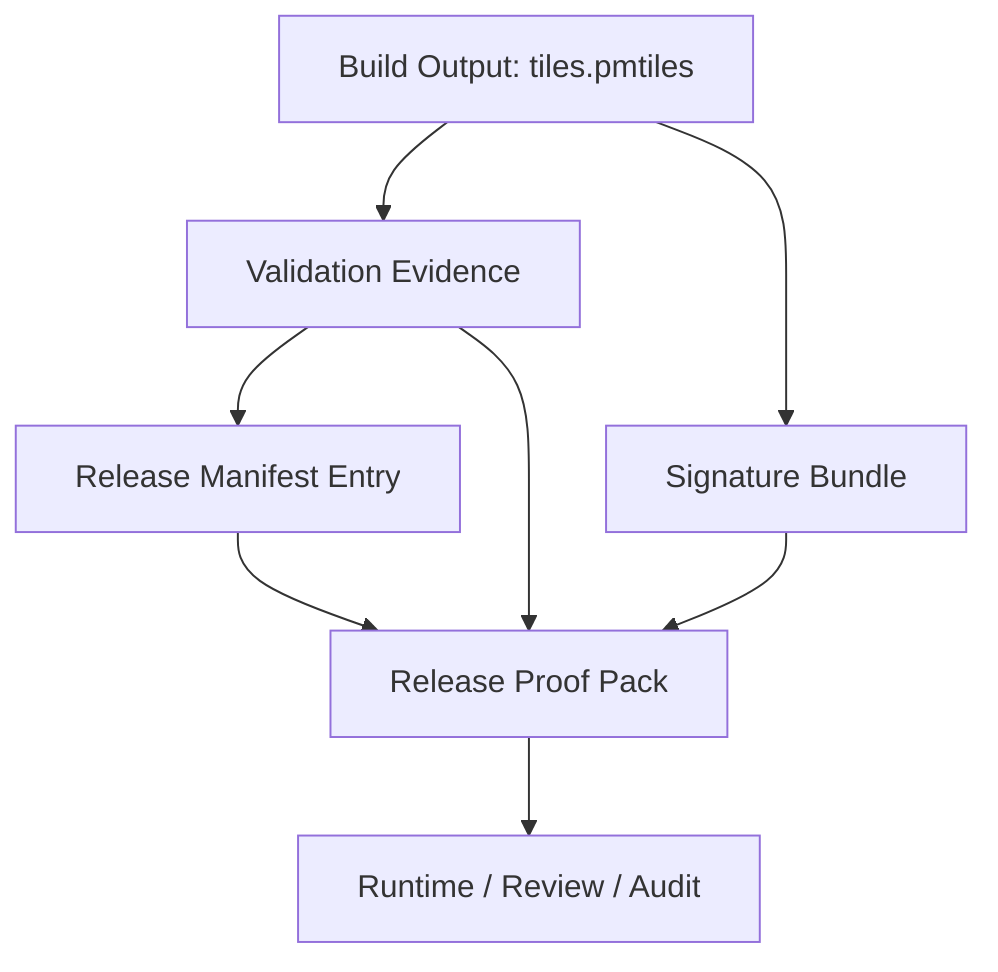
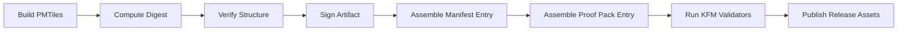

<!--
KFM Meta Block V2
doc_id: kfm.std.pmtiles.release_manifest_and_proof_pack_integration
title: PMTiles Integration with Release Manifest and Proof Pack
type: standard
version: v1
status: draft
owners: @bartytime4life
created: 2026-04-17
updated: 2026-04-17
policy_label: public-safe
related:
  - docs/standards/pmtiles-release-validation-and-signing.md
  - tools/attest/README.md
  - tools/validators/README.md
  - data/receipts/README.md
  - policy/README.md
  - contracts/README.md
  - schemas/README.md
tags: [kfm, pmtiles, release, manifest, proof-pack, provenance, attestation]
notes: Standardizes how PMTiles artifacts participate in governed release manifests, proof packs, and downstream trust checks.
-->

# PMTiles Integration with Release Manifest and Proof Pack

> **Purpose**  
> Make `.pmtiles` files **first-class governed release artifacts** in KFM by defining how they are declared in Release Manifests, attached to Release Proof Packs, verified by validators/attestors, and surfaced to runtime trust consumers.

---

## 🧭 Quick Navigation

- [Scope](#scope)
- [Why This Exists](#why-this-exists)
- [Governed Object Model](#governed-object-model)
- [Release Manifest Requirements](#release-manifest-requirements)
- [Release Proof Pack Requirements](#release-proof-pack-requirements)
- [Receipt vs Proof Separation](#receipt-vs-proof-separation)
- [Schema Shape (Normative Example)](#schema-shape-normative-example)
- [Validation Rules](#validation-rules)
- [Attestation & Verification Rules](#attestation--verification-rules)
- [Runtime Trust Expectations](#runtime-trust-expectations)
- [Directory & Packaging Expectations](#directory--packaging-expectations)
- [CI Integration Contract](#ci-integration-contract)
- [Review Checklist](#review-checklist)
- [Future Extensions](#future-extensions)

---

## Scope

This standard applies to all `.pmtiles` artifacts that are:

- published as release-bound geospatial assets
- referenced by a Release Manifest
- relied on by runtime map, catalog, or evidence surfaces
- included in reviewable release outputs

This standard does **not** apply to:

- staging-only intermediate files in `data/work/`
- unpublished experimental tiles not bound to a governed release
- raw or upstream source data before release assembly

---

## Why This Exists

A `.pmtiles` file is not just a binary blob or deployment convenience.

Within KFM, a release-bound tileset is:

- a **release-significant artifact**
- a **trust-bearing object**
- a **reviewable input** to governed runtime behavior
- a **provable output** that must be independently verifiable

That means the tileset must be represented in the same governed release surface as:

- manifests
- proof packs
- attestations
- provenance links
- correction and rollback references

---

## Governed Object Model

A governed PMTiles release consists of four distinct layers:



### Interpretation

| Layer | Role |
|---|---|
| PMTiles file | Primary release artifact |
| Validation evidence | Proves structural integrity |
| Manifest entry | Declares release significance and identity |
| Proof pack entry | Carries verification-ready trust material |

---

## Release Manifest Requirements

A Release Manifest that includes PMTiles artifacts MUST declare them explicitly.

### REQUIRED fields

Each PMTiles artifact entry MUST include:

| Field | Description |
|---|---|
| `artifact_id` | Stable release-local artifact identifier |
| `kind` | Must identify PMTiles artifact type |
| `path` | Release-relative path or publication path |
| `media_type` | Expected content type |
| `sha256` | Digest of the `.pmtiles` file |
| `bytes` | Artifact size in bytes |
| `spec` | PMTiles spec version if known |
| `signature` | Link or reference to signature bundle |
| `validation` | Reference to verification result |
| `role` | Why this artifact exists in the release |
| `scope` | Geography/domain/time scope served by the tileset |

### REQUIRED semantics

The Release Manifest MUST make clear:

- that the PMTiles file is a **release artifact**, not just a support file
- what user-visible or runtime-visible capability depends on it
- where the corresponding signature bundle lives
- where the validation result lives
- whether the artifact is safe for public distribution

### RECOMMENDED fields

| Field | Description |
|---|---|
| `bounds` | Bounding box declared by the archive or contract |
| `minzoom` / `maxzoom` | Zoom range |
| `tile_type` | Vector or raster, if known |
| `theme` | Domain grouping, e.g. hydrology, parcels, soil_moisture |
| `valid_time` | Time slice represented by the artifact |
| `catalog_refs` | STAC/DCAT/PROV linkage |
| `correction_refs` | Corrections affecting this artifact |

---

## Release Proof Pack Requirements

A Release Proof Pack that covers a PMTiles artifact MUST include enough material for a reviewer or verifier to establish:

1. **the artifact identity**
2. **the artifact integrity**
3. **the artifact signature validity**
4. **the artifact linkage to the release**
5. **the artifact linkage to supporting provenance/citation surfaces**

### REQUIRED inclusions

For each governed PMTiles artifact, the proof pack MUST include or reference:

| Proof Object | Required |
|---|---|
| `.pmtiles` digest | Yes |
| `.sigbundle` | Yes |
| validation result (`pmtiles verify`) | Yes |
| manifest entry excerpt or pointer | Yes |
| publication location / asset ref | Yes |
| release identifier linkage | Yes |

### OPTIONAL but strongly recommended

| Proof Object | Reason |
|---|---|
| normalized metadata summary | Reviewer readability |
| tile bounds / zoom summary | Quick plausibility check |
| catalog cross-links | Catalog closure |
| correction/rollback refs | Release governance |
| attestation envelope | Machine-verifiable trust integration |

---

## Receipt vs Proof Separation

KFM doctrine requires receipts and proofs to remain distinct.

### Receipts

Receipts are **process memory**.

Examples:

- raw build logs
- command invocations
- CI job outputs
- timestamps of signing step
- temporary validation report files

**Location:** `data/receipts/`

### Proofs

Proofs are **release-significant trust objects**.

Examples:

- Release Manifest entry
- Release Proof Pack attachment
- digest file
- signature bundle
- attestation summary
- verifier result intended for release review

**Location:** release artifacts / proof-pack surfaces / governed publication outputs

### Rule

A PMTiles release is **not** considered governed merely because CI emitted logs.  
It becomes governed when the release carries reviewable proof objects that establish trust for the specific artifact.

---

## Schema Shape (Normative Example)

This section is **normative as a shape example** and should be implemented in the canonical contracts/schemas home rather than duplicated in tooling.

### Release Manifest artifact entry

```json
{
  "artifact_id": "pmtiles.kansas.hydrology.v2026_04_17",
  "kind": "geospatial.pmtiles",
  "role": "map-layer",
  "path": "dist/tiles/kansas-hydrology.pmtiles",
  "media_type": "application/vnd.pmtiles",
  "sha256": "9bc2b6c0d4f2d0d1d3e7b5b39d7a4c4b6d7f8e9a0123456789abcdef01234567",
  "bytes": 24819302,
  "spec": "pmtiles/v3",
  "scope": {
    "geography": "Kansas",
    "domain": "hydrology",
    "policy_label": "public-safe"
  },
  "tile_summary": {
    "bounds": [-102.051744, 36.993016, -94.588387, 40.003162],
    "minzoom": 0,
    "maxzoom": 12,
    "tile_type": "vector"
  },
  "signature": {
    "bundle_path": "dist/tiles/kansas-hydrology.pmtiles.sigbundle",
    "bundle_sha256": "1aa2b3c4d5e6f70123456789abcdefabcdef0123456789abcdef0123456789"
  },
  "validation": {
    "validator": "pmtiles verify",
    "result": "pass",
    "report_ref": "proof://release/R2026-04-17/validators/pmtiles.kansas.hydrology.json"
  },
  "catalog_refs": [
    "stac:item:kansas-hydrology-2026-04-17",
    "dcat:dataset:kansas-hydrology",
    "prov:entity:kansas-hydrology-pmtiles-v2026-04-17"
  ]
}
```

---

### Proof Pack entry

```json
{
  "artifact_ref": "pmtiles.kansas.hydrology.v2026_04_17",
  "kind": "release-proof.pmtiles",
  "digest": {
    "algorithm": "sha256",
    "value": "9bc2b6c0d4f2d0d1d3e7b5b39d7a4c4b6d7f8e9a0123456789abcdef01234567"
  },
  "signature_bundle": {
    "path": "dist/tiles/kansas-hydrology.pmtiles.sigbundle",
    "sha256": "1aa2b3c4d5e6f70123456789abcdefabcdef0123456789abcdef0123456789"
  },
  "verification": {
    "structure_check": "pass",
    "signature_check": "pass",
    "verified_at": "2026-04-17T18:22:11Z"
  },
  "publication": {
    "release_ref": "release:R2026-04-17",
    "asset_path": "dist/tiles/kansas-hydrology.pmtiles"
  }
}
```

---

## Validation Rules

Validation SHOULD be split into two levels.

### 1) Structural validation

Performed using `pmtiles verify`.

This MUST establish at minimum:

- archive is readable
- internal structure is consistent
- metadata is coherent enough to serve safely

### 2) Governance validation

Performed by KFM validators.

This SHOULD establish:

- manifest entry exists
- digest matches artifact bytes
- signature bundle exists
- signature bundle digest matches manifest declaration
- proof pack includes all required objects
- catalog refs, if declared, are present and shaped correctly
- correction refs, if declared, resolve correctly

### Fail-closed rule

If any required PMTiles release validation step fails, the release outcome for that artifact is:

- `DENY`, or
- excluded from release assembly

Never silently downgrade to “best effort”.

---

## Attestation & Verification Rules

### Signing

PMTiles artifacts MUST be signed before publication.

### Verification

A compliant verifier MUST be able to establish:

| Check | Outcome |
|---|---|
| artifact digest matches manifest | pass/fail |
| signature bundle exists | pass/fail |
| signature verifies against artifact | pass/fail |
| validation report exists | pass/fail |
| proof pack linkage is complete | pass/fail |

### Attestor responsibilities

Helpers in `tools/attest/` SHOULD be able to:

- verify digest equality
- verify `.sigbundle` presence and shape
- summarize PMTiles proof completeness
- emit compact machine-readable pass/fail output
- avoid mutating trust state

### Validator responsibilities

Helpers in `tools/validators/` SHOULD be able to:

- fail if artifact exists without proof linkage
- fail if proof exists without artifact
- fail if manifest and proof pack disagree on digests or paths
- fail if required PMTiles release fields are missing
- fail if result grammar is ambiguous

---

## Runtime Trust Expectations

Runtime surfaces that depend on a PMTiles artifact SHOULD receive enough trust metadata to explain whether the artifact is acceptable for use.

### Expected downstream trust cues

| Field | Purpose |
|---|---|
| `release_ref` | Which release approved the tileset |
| `bundle_ref` | Which proof/signature object supports trust |
| `freshness` | How current the artifact is |
| `reason` | Why an artifact was denied or withheld |
| `audit_ref` | Review trail pointer |

### Example governed runtime behavior

| Condition | Runtime Outcome |
|---|---|
| manifest + proof + signature all valid | ANSWER |
| artifact exists but proof missing | ABSTAIN or DENY |
| signature invalid | DENY |
| artifact unreadable | ERROR |
| correction marks artifact withdrawn | DENY |

This keeps runtime outcomes finite and reviewable.

---

## Directory & Packaging Expectations

### Example release layout

```text
release/
  manifest.json
  proof-pack.json
  assets/
    kansas-hydrology.pmtiles
    kansas-hydrology.pmtiles.sigbundle
  validators/
    pmtiles.kansas.hydrology.json
  attestations/
    pmtiles.kansas.hydrology.attestation.json
```

### Example receipt layout

```text
data/receipts/<run-id>/
  pmtiles-build.json
  pmtiles-verify.json
  pmtiles-sign.json
```

### Rule

Receipt files MAY inform proof creation, but they are not substitutes for release proof objects.

---

## CI Integration Contract

A compliant PMTiles release pipeline SHOULD execute in this order:



### Minimum CI responsibilities

1. produce `.pmtiles`
2. compute and persist digest
3. run structural verification
4. sign artifact and emit `.sigbundle`
5. write/assemble manifest entry
6. write/assemble proof-pack entry
7. run release validators
8. publish only if all checks pass

---

## Review Checklist

A reviewer SHOULD be able to answer **yes** to all of the following:

- Is the PMTiles artifact declared in the Release Manifest?
- Is it identified as release-significant?
- Does the manifest declare its digest?
- Is the signature bundle present?
- Does the proof pack carry verification-ready evidence?
- Can a verifier reproduce the trust decision?
- Does the release fail closed if any required object is missing?
- Are catalog/provenance links present where expected?

If any answer is **no**, the artifact is not fully governed.

---

## Suggested Contract Surface

These paths are **PROPOSED** homes and should be adjusted to the canonical contract/schema structure already used in the repo.

| Surface | Proposed home |
|---|---|
| Manifest artifact schema | `schemas/release/manifest-artifact.schema.json` |
| PMTiles artifact subtype | `schemas/release/artifacts/pmtiles.schema.json` |
| Proof-pack entry schema | `schemas/release/proof-pack-pmtiles.schema.json` |
| Validator contract | `contracts/release/pmtiles-proof.contract.json` |

### Guidance

- Keep schema authority in `schemas/`
- Keep machine contract authority in `contracts/`
- Keep helper behavior in `tools/`
- Keep policy outcomes in `policy/`

Do not duplicate authority across these lanes.

---

## Example Validator Assertions

A PMTiles release validator SHOULD assert at least:

```text
ASSERT artifact.kind == "geospatial.pmtiles"
ASSERT artifact.sha256 exists
ASSERT artifact.signature.bundle_path exists
ASSERT artifact.validation.result == "pass"
ASSERT proof.artifact_ref == artifact.artifact_id
ASSERT proof.digest.value == artifact.sha256
ASSERT proof.signature_bundle.path == artifact.signature.bundle_path
ASSERT proof.verification.structure_check == "pass"
ASSERT proof.verification.signature_check == "pass"
```

---

## Example Attestation Summary

A compact reviewer-facing summary MAY look like:

```json
{
  "artifact_id": "pmtiles.kansas.hydrology.v2026_04_17",
  "status": "pass",
  "checks": {
    "digest_match": true,
    "structure_valid": true,
    "signature_valid": true,
    "manifest_linked": true,
    "proof_pack_linked": true
  },
  "release_ref": "release:R2026-04-17"
}
```

---

## Future Extensions

**PROPOSED**

- bind PMTiles assets directly into STAC Asset objects
- require `spec_hash` or equivalent dataset-version identity linkage where doctrine calls for it
- record transparency-log identity in proof packs
- cross-link correction objects for superseded or withdrawn tilesets
- add reviewer-readable geometry/bounds diffs in `tools/diff/`
- add runtime e2e proof fixtures for tile-trust outcomes

---

## Summary

This standard turns `.pmtiles` files into governed trust objects by requiring:

- explicit manifest declaration
- explicit proof-pack inclusion
- digest and signature linkage
- validator-enforced completeness
- runtime-visible trust consequences

A PMTiles file is therefore not merely “published.”  
It is **declared, proven, reviewable, and enforceable**.

---

> **KFM Position**  
> Release artifacts that shape what a user sees on a map must carry the same trust burden as the answer itself.
