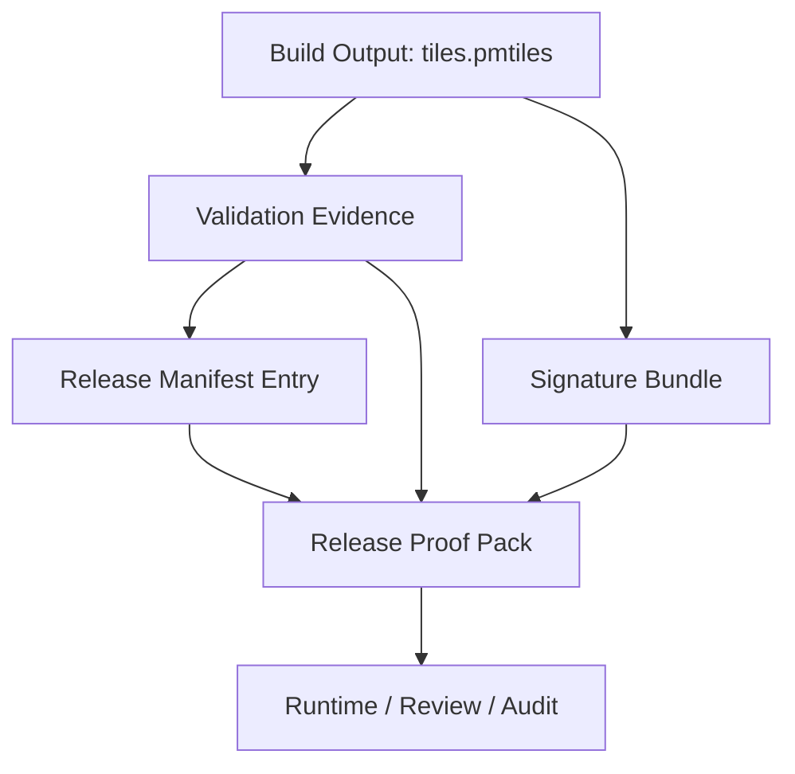
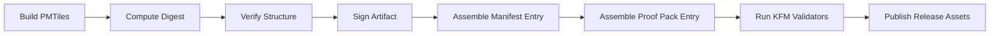

<!-- [KFM_META_BLOCK_V2]
doc_id: kfm://doc/NEEDS-VERIFICATION
title: PMTiles Integration with Release Manifest and Proof Pack
type: standard
version: v1
status: draft
owners: NEEDS-VERIFICATION
created: 2026-04-17
updated: 2026-04-17
policy_label: public-safe
related: [NEEDS-VERIFICATION: docs/standards/pmtiles-release-validation-and-signing.md, NEEDS-VERIFICATION: tools/attest/README.md, NEEDS-VERIFICATION: tools/validators/README.md, NEEDS-VERIFICATION: data/receipts/README.md, NEEDS-VERIFICATION: policy/README.md, NEEDS-VERIFICATION: contracts/README.md, NEEDS-VERIFICATION: schemas/README.md]
tags: [kfm, pmtiles, release, manifest, proof-pack, provenance, attestation]
notes: [Built from attached KFM corpus and a draft PMTiles standard; repo path, owner assignment, and canonical schema homes remain NEEDS VERIFICATION in this session.]
[/KFM_META_BLOCK_V2] -->

# PMTiles Integration with Release Manifest and Proof Pack

Make `.pmtiles` files first-class governed release artifacts in KFM by defining how they are declared in Release Manifests, attached to Release Proof Packs, verified, and surfaced to runtime trust consumers.

> [!IMPORTANT]
> This document standardizes **trust shape and release expectations** for PMTiles artifacts. It does **not** by itself prove that the referenced schemas, validators, workflows, or paths already exist in the mounted repository.

## Status and evidence posture

| Label | Meaning in this document |
|---|---|
| **CONFIRMED doctrine** | KFM treats proof objects, release manifests, receipts, and trust-visible runtime outcomes as central doctrine. |
| **INFERRED structure** | PMTiles fit naturally into that proof-object lattice as release-significant artifacts. |
| **PROPOSED repo homes** | Paths under `schemas/`, `contracts/`, `tools/`, and `policy/` are guidance, not confirmed mounted implementation. |
| **UNKNOWN implementation depth** | No mounted repo tree, schema registry, workflow inventory, or runtime traces were directly surfaced in this session. |

## On this page

- [Scope](#scope)
- [Why this exists](#why-this-exists)
- [Governed object model](#governed-object-model)
- [Release Manifest requirements](#release-manifest-requirements)
- [Release Proof Pack requirements](#release-proof-pack-requirements)
- [Receipt vs proof separation](#receipt-vs-proof-separation)
- [Schema shape (normative example)](#schema-shape-normative-example)
- [Validation rules](#validation-rules)
- [Attestation and verification rules](#attestation-and-verification-rules)
- [Runtime trust expectations](#runtime-trust-expectations)
- [Directory and packaging expectations](#directory-and-packaging-expectations)
- [CI integration contract](#ci-integration-contract)
- [Review checklist](#review-checklist)
- [Suggested contract surface](#suggested-contract-surface)
- [Future extensions](#future-extensions)

## Scope

This standard applies to all `.pmtiles` artifacts that are:

- published as release-bound geospatial assets
- referenced by a Release Manifest
- relied on by runtime map, catalog, or evidence surfaces
- included in reviewable release outputs

This standard does **not** apply to:

- staging-only intermediate files in `data/work/`
- unpublished experimental tiles not bound to a governed release
- raw or upstream source data before release assembly

## Why this exists

A `.pmtiles` file is not merely a binary blob or delivery convenience.

Within KFM, a release-bound tileset is:

- a **release-significant artifact**
- a **trust-bearing object**
- a **reviewable input** to governed runtime behavior
- a **provable output** that must be independently verifiable

That means the tileset must participate in the same governed release surface as:

- manifests
- proof packs
- attestations
- provenance links
- correction and rollback references

## Governed object model

A governed PMTiles release consists of four distinct layers:



| Layer | Role |
|---|---|
| PMTiles file | Primary release artifact |
| Validation evidence | Proves structural integrity |
| Manifest entry | Declares release significance and identity |
| Proof pack entry | Carries verification-ready trust material |

## Release Manifest requirements

A Release Manifest that includes PMTiles artifacts **MUST** declare them explicitly.

### Required fields

| Field | Description |
|---|---|
| `artifact_id` | Stable release-local artifact identifier |
| `kind` | Must identify PMTiles artifact type |
| `path` | Release-relative path or publication path |
| `media_type` | Expected content type |
| `sha256` | Digest of the `.pmtiles` file |
| `bytes` | Artifact size in bytes |
| `spec` | PMTiles spec version if known |
| `signature` | Link or reference to signature bundle |
| `validation` | Reference to verification result |
| `role` | Why this artifact exists in the release |
| `scope` | Geography, domain, or time scope served by the tileset |

### Required semantics

The Release Manifest **MUST** make clear:

- that the PMTiles file is a **release artifact**, not just a support file
- what user-visible or runtime-visible capability depends on it
- where the corresponding signature bundle lives
- where the validation result lives
- whether the artifact is safe for public distribution

### Recommended fields

| Field | Description |
|---|---|
| `bounds` | Bounding box declared by the archive or contract |
| `minzoom` / `maxzoom` | Zoom range |
| `tile_type` | Vector or raster, if known |
| `theme` | Domain grouping, for example `hydrology`, `parcels`, or `soil_moisture` |
| `valid_time` | Time slice represented by the artifact |
| `catalog_refs` | STAC / DCAT / PROV linkage |
| `correction_refs` | Corrections affecting this artifact |

## Release Proof Pack requirements

A Release Proof Pack that covers a PMTiles artifact **MUST** include enough material for a reviewer or verifier to establish:

1. the artifact identity
2. the artifact integrity
3. the artifact signature validity
4. the artifact linkage to the release
5. the artifact linkage to supporting provenance or citation surfaces

### Required inclusions

| Proof object | Required |
|---|---|
| `.pmtiles` digest | Yes |
| `.sigbundle` | Yes |
| validation result (`pmtiles verify`) | Yes |
| manifest entry excerpt or pointer | Yes |
| publication location / asset ref | Yes |
| release identifier linkage | Yes |

### Optional but strongly recommended

| Proof object | Why it helps |
|---|---|
| normalized metadata summary | Reviewer readability |
| tile bounds / zoom summary | Quick plausibility check |
| catalog cross-links | Catalog closure |
| correction / rollback refs | Release governance |
| attestation envelope | Machine-verifiable trust integration |

## Receipt vs proof separation

KFM doctrine requires receipts and proofs to remain distinct.

### Receipts

Receipts are **process memory**.

Examples:

- raw build logs
- command invocations
- CI job outputs
- timestamps of signing steps
- temporary validation report files

**Expected location:** `data/receipts/`

### Proofs

Proofs are **release-significant trust objects**.

Examples:

- Release Manifest entry
- Release Proof Pack attachment
- digest file
- signature bundle
- attestation summary
- verifier result intended for release review

**Expected location:** release artifacts, proof-pack surfaces, or other governed publication outputs

### Rule

A PMTiles release is **not** considered governed merely because CI emitted logs.  
It becomes governed when the release carries reviewable proof objects that establish trust for the specific artifact.

## Schema shape (normative example)

This section is **normative as a shape example** and should be implemented in the canonical `contracts/` and `schemas/` home rather than duplicated in helper tooling.

### Release Manifest artifact entry

```json
{
  "artifact_id": "pmtiles.kansas.hydrology.v2026_04_17",
  "kind": "geospatial.pmtiles",
  "role": "map-layer",
  "path": "dist/tiles/kansas-hydrology.pmtiles",
  "media_type": "application/vnd.pmtiles",
  "sha256": "9bc2b6c0d4f2d0d1d3e7b5b39d7a4c4b6d7f8e9a0123456789abcdef01234567",
  "bytes": 24819302,
  "spec": "pmtiles/v3",
  "scope": {
    "geography": "Kansas",
    "domain": "hydrology",
    "policy_label": "public-safe"
  },
  "tile_summary": {
    "bounds": [-102.051744, 36.993016, -94.588387, 40.003162],
    "minzoom": 0,
    "maxzoom": 12,
    "tile_type": "vector"
  },
  "signature": {
    "bundle_path": "dist/tiles/kansas-hydrology.pmtiles.sigbundle",
    "bundle_sha256": "1aa2b3c4d5e6f70123456789abcdefabcdef0123456789abcdef0123456789"
  },
  "validation": {
    "validator": "pmtiles verify",
    "result": "pass",
    "report_ref": "proof://release/R2026-04-17/validators/pmtiles.kansas.hydrology.json"
  },
  "catalog_refs": [
    "stac:item:kansas-hydrology-2026-04-17",
    "dcat:dataset:kansas-hydrology",
    "prov:entity:kansas-hydrology-pmtiles-v2026-04-17"
  ]
}
```

### Proof Pack entry

```json
{
  "artifact_ref": "pmtiles.kansas.hydrology.v2026_04_17",
  "kind": "release-proof.pmtiles",
  "digest": {
    "algorithm": "sha256",
    "value": "9bc2b6c0d4f2d0d1d3e7b5b39d7a4c4b6d7f8e9a0123456789abcdef01234567"
  },
  "signature_bundle": {
    "path": "dist/tiles/kansas-hydrology.pmtiles.sigbundle",
    "sha256": "1aa2b3c4d5e6f70123456789abcdefabcdef0123456789abcdef0123456789"
  },
  "verification": {
    "structure_check": "pass",
    "signature_check": "pass",
    "verified_at": "2026-04-17T18:22:11Z"
  },
  "publication": {
    "release_ref": "release:R2026-04-17",
    "asset_path": "dist/tiles/kansas-hydrology.pmtiles"
  }
}
```

## Validation rules

Validation **SHOULD** be split into two levels.

### 1) Structural validation

Performed using `pmtiles verify`.

This **MUST** establish at minimum:

- archive is readable
- internal structure is consistent
- metadata is coherent enough to serve safely

### 2) Governance validation

Performed by KFM validators.

This **SHOULD** establish:

- manifest entry exists
- digest matches artifact bytes
- signature bundle exists
- signature bundle digest matches manifest declaration
- proof pack includes all required objects
- catalog refs, if declared, are present and shaped correctly
- correction refs, if declared, resolve correctly

### Fail-closed rule

If any required PMTiles release validation step fails, the release outcome for that artifact is:

- `DENY`, or
- exclusion from release assembly

Never silently downgrade to “best effort”.

## Attestation and verification rules

### Signing

PMTiles artifacts **MUST** be signed before publication.

### Verification

A compliant verifier **MUST** be able to establish:

| Check | Outcome |
|---|---|
| artifact digest matches manifest | pass / fail |
| signature bundle exists | pass / fail |
| signature verifies against artifact | pass / fail |
| validation report exists | pass / fail |
| proof-pack linkage is complete | pass / fail |

### Attestor responsibilities

Helpers in `tools/attest/` **SHOULD** be able to:

- verify digest equality
- verify `.sigbundle` presence and shape
- summarize PMTiles proof completeness
- emit compact machine-readable pass/fail output
- avoid mutating trust state

### Validator responsibilities

Helpers in `tools/validators/` **SHOULD** be able to:

- fail if artifact exists without proof linkage
- fail if proof exists without artifact
- fail if manifest and proof pack disagree on digests or paths
- fail if required PMTiles release fields are missing
- fail if result grammar is ambiguous

## Runtime trust expectations

Runtime surfaces that depend on a PMTiles artifact **SHOULD** receive enough trust metadata to explain whether the artifact is acceptable for use.

### Expected downstream trust cues

| Field | Purpose |
|---|---|
| `release_ref` | Which release approved the tileset |
| `bundle_ref` | Which proof or signature object supports trust |
| `freshness` | How current the artifact is |
| `reason` | Why an artifact was denied or withheld |
| `audit_ref` | Review trail pointer |

### Example governed runtime behavior

| Condition | Runtime outcome |
|---|---|
| manifest + proof + signature all valid | `ANSWER` |
| artifact exists but proof missing | `ABSTAIN` or `DENY` |
| signature invalid | `DENY` |
| artifact unreadable | `ERROR` |
| correction marks artifact withdrawn | `DENY` |

> [!NOTE]
> This outcome table describes a **finite runtime trust grammar** for PMTiles-dependent surfaces. It should be aligned with broader KFM decision-envelope work rather than treated as a standalone runtime ontology.

## Directory and packaging expectations

The structures below are **illustrative**. They show expected release composition, not confirmed mounted repo reality.

### Example release layout

```text
release/
  manifest.json
  proof-pack.json
  assets/
    kansas-hydrology.pmtiles
    kansas-hydrology.pmtiles.sigbundle
  validators/
    pmtiles.kansas.hydrology.json
  attestations/
    pmtiles.kansas.hydrology.attestation.json
```

### Example receipt layout

```text
data/receipts/<run-id>/
  pmtiles-build.json
  pmtiles-verify.json
  pmtiles-sign.json
```

### Rule

Receipt files **MAY** inform proof creation, but they are not substitutes for release proof objects.

## CI integration contract

The sequence below is **PROPOSED** as the minimum governed CI path for PMTiles release artifacts.



### Minimum CI responsibilities

1. produce `.pmtiles`
2. compute and persist digest
3. run structural verification
4. sign artifact and emit `.sigbundle`
5. write or assemble manifest entry
6. write or assemble proof-pack entry
7. run release validators
8. publish only if all checks pass

## Review checklist

A reviewer **SHOULD** be able to answer **yes** to all of the following:

- Is the PMTiles artifact declared in the Release Manifest?
- Is it identified as release-significant?
- Does the manifest declare its digest?
- Is the signature bundle present?
- Does the proof pack carry verification-ready evidence?
- Can a verifier reproduce the trust decision?
- Does the release fail closed if any required object is missing?
- Are catalog and provenance links present where expected?

If any answer is **no**, the artifact is not fully governed.

## Suggested contract surface

These paths are **PROPOSED** homes and should be adjusted to the canonical contract and schema structure already used in the repo.

| Surface | Proposed home |
|---|---|
| Manifest artifact schema | `schemas/release/manifest-artifact.schema.json` |
| PMTiles artifact subtype | `schemas/release/artifacts/pmtiles.schema.json` |
| Proof-pack entry schema | `schemas/release/proof-pack-pmtiles.schema.json` |
| Validator contract | `contracts/release/pmtiles-proof.contract.json` |

### Guidance

- keep schema authority in `schemas/`
- keep machine contract authority in `contracts/`
- keep helper behavior in `tools/`
- keep policy outcomes in `policy/`

Do not duplicate authority across these lanes.

<details>
<summary><strong>Example validator assertions</strong></summary>

```text
ASSERT artifact.kind == "geospatial.pmtiles"
ASSERT artifact.sha256 exists
ASSERT artifact.signature.bundle_path exists
ASSERT artifact.validation.result == "pass"
ASSERT proof.artifact_ref == artifact.artifact_id
ASSERT proof.digest.value == artifact.sha256
ASSERT proof.signature_bundle.path == artifact.signature.bundle_path
ASSERT proof.verification.structure_check == "pass"
ASSERT proof.verification.signature_check == "pass"
```

</details>

<details>
<summary><strong>Example reviewer-facing attestation summary</strong></summary>

```json
{
  "artifact_id": "pmtiles.kansas.hydrology.v2026_04_17",
  "status": "pass",
  "checks": {
    "digest_match": true,
    "structure_valid": true,
    "signature_valid": true,
    "manifest_linked": true,
    "proof_pack_linked": true
  },
  "release_ref": "release:R2026-04-17"
}
```

</details>

## Future extensions

**PROPOSED**

- bind PMTiles assets directly into STAC Asset objects
- require `spec_hash` or equivalent dataset-version identity linkage where doctrine calls for it
- record transparency-log identity in proof packs
- cross-link correction objects for superseded or withdrawn tilesets
- add reviewer-readable geometry or bounds diffs in `tools/diff/`
- add runtime end-to-end proof fixtures for tile-trust outcomes

## Summary

This standard turns `.pmtiles` files into governed trust objects by requiring:

- explicit manifest declaration
- explicit proof-pack inclusion
- digest and signature linkage
- validator-enforced completeness
- runtime-visible trust consequences

A PMTiles file is therefore not merely “published.”  
It is **declared, proven, reviewable, and enforceable**.

> **KFM position**  
> Release artifacts that shape what a user sees on a map must carry the same trust burden as the answer itself.
