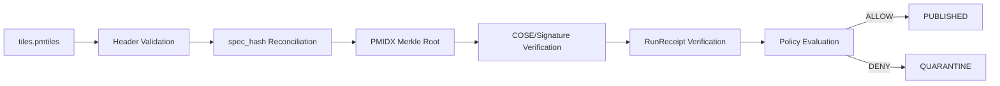

<!--
doc_id: NEEDS_VERIFICATION
 title: PMTiles Attestation Standard
 type: standard
 version: v1
 status: draft
 owners: [NEEDS_VERIFICATION]
 created: NEEDS_VERIFICATION
 updated: NEEDS_VERIFICATION
 policy_label: public
 related: [docs/standards/pmtiles/PMIDX_SPEC_V1.md, tools/validators/pmtiles/README.md, policy/rego/tiles_publish.rego]
 tags: [kfm, pmtiles, attestation, tiles, provenance]
 notes: [Draft package generated from PMTiles sidecar verification design; identifiers and ownership require repo confirmation.]
-->

<a id="top"></a>

# PMTiles Attestation Standard

> Governed integrity and provenance checks for PMTiles artifacts before KFM publication.


## Purpose

This standard defines the minimum attestation chain for publishing a PMTiles artifact in KFM.

A PMTiles archive is not trusted merely because it exists. It becomes eligible for publication only when its byte digest, header metadata, deterministic build specification, sidecar Merkle root, signer identity, and run receipt reconcile under policy.

## Required Artifact Set

| Artifact | Required | Purpose |
|---|---:|---|
| `tiles.pmtiles` | yes | Tile archive served to public/runtime clients after release. |
| `tiles.pmtiles.pmidx` | yes | Sidecar Merkle commitments and verification metadata. |
| `tiles.pmtiles.pmsig` | yes | Signature bundle over archive digest, sidecar root, and `spec_hash`. |
| `tiles.pmtiles.runreceipt.json` | yes | Build/run provenance and replay context. |
| Release/Rollback manifest | yes | Governed publication and correction path. |

## Deterministic `spec_hash`

`spec_hash` is the SHA-256 digest of canonical JSON for the build specification.

Recommended build-spec shape:

```json
{
  "schema_version": "kfm.pmtiles.build.v1",
  "source_refs": [],
  "tiler": {
    "name": "NEEDS_VERIFICATION",
    "version": "NEEDS_VERIFICATION",
    "flags": []
  },
  "post": {
    "clustered": true,
    "compression": "gzip",
    "reencode": "none"
  },
  "policy": {
    "rights": "NEEDS_VERIFICATION",
    "sensitivity": "NEEDS_VERIFICATION"
  },
  "bounds_zoom": {
    "minzoom": 0,
    "maxzoom": 14,
    "bounds": [-180, -85.05112878, 180, 85.05112878]
  }
}
```

Canonicalization rule:

```text
spec_hash = sha256(canonical_json(spec))
```

The same `spec_hash` must appear in:

1. PMTiles metadata.
2. `.pmidx` sidecar.
3. `.pmsig` signed payload.
4. Run receipt.
5. Release manifest or promotion record.

## Publication Gate



## Fail-Closed Conditions

| Check | Deny when... |
|---|---|
| Header | `spec_hash` missing or malformed. |
| Header | bounds/zoom/header values violate declared policy. |
| Digest | PMTiles digest does not match signed subject. |
| Sidecar | `.pmidx` schema invalid or Merkle root mismatch. |
| Proofs | tile/range proof path malformed or invalid. |
| Signature | signer not in allowed key set. |
| Signature | signature invalid, expired, or not yet valid. |
| Receipt | builder identity not approved. |
| Receipt | source refs or toolchain do not match spec. |
| Policy | rights/sensitivity/source-role posture unresolved. |
| Promotion | rollback/correction path missing. |

## KFM Boundary

PMTiles are derived/publication artifacts, not canonical truth. Clients may consume only released artifacts and governed APIs. RAW, WORK, QUARANTINE, unpublished candidates, canonical internal stores, and direct model outputs remain outside public access.

## Minimum CI Contract

```yaml
- name: Validate PMTiles attestation chain
  run: |
    python tools/validators/pmtiles/validate_header.py artifacts/*.pmtiles
    python tools/validators/pmtiles/verify_merkle.py artifacts/*.pmtiles.pmidx --sample 16
    python tools/attest/verify_cose.py artifacts/*.pmtiles.pmsig
```

## Definition of Done

- [ ] PMTiles metadata includes `kfm.spec_hash` or approved equivalent.
- [ ] `.pmidx` validates against schema.
- [ ] `.pmsig` validates against schema and cryptographic verifier.
- [ ] Run receipt validates against schema.
- [ ] Policy gate denies negative fixtures.
- [ ] Release/rollback/correction link exists.
- [ ] No public publication occurs before governed promotion.

