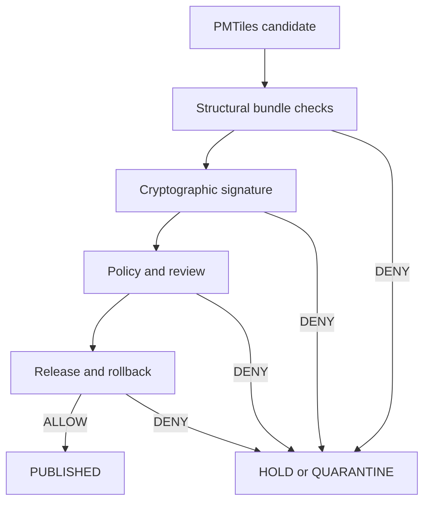

<!-- [KFM_META_BLOCK_V2]
doc_id: kfm://doc/docs-standards-pmtiles-attestation-standard
title: PMTiles Attestation Standard
type: standard
version: v1.2-draft
status: draft; PROPOSED; partial-implementation-confirmed
owner: TODO-pmtiles-steward
created: NEEDS_VERIFICATION
updated: 2026-08-03
policy_label: internal-governance; derived-artifact; release-gated; no-public-authority
owning_root: docs/
responsibility: defines a proposed PMTiles attestation chain and records the bounded structural bundle and opt-in declared-manifest compatibility checks currently implemented without granting schema, signature, policy, release, or publication authority
truth_posture: test-or-abstain; implementation claims require current repository evidence
related:
  - PMIDX_SPEC_V1.md
  - ../../../tools/validators/pmtiles/README.md
  - ../../../tools/validators/pmtiles/validate_attestation_bundle.py
  - ../../../fixtures/pmtiles/attestation/README.md
  - ../../../policy/rego/tiles_publish.rego
notes:
  - "The split SHA-256 bundle is an implemented compatibility profile, not a canonical-profile decision."
  - "This standard has one PMTiles authority-owner role; assignment NEEDS VERIFICATION. Security, policy, release, and schema stewards are review roles. CODEOWNERS routes review to @bartytime4life."
  - "Cryptographic PMSIG verification, trusted-key evaluation, policy execution, and release/rollback closure remain HOLD."
[/KFM_META_BLOCK_V2] -->

<a id="top"></a>

# PMTiles Attestation Standard

> Governed integrity and provenance checks proposed for PMTiles artifacts before KFM publication.


## Purpose

This draft describes the proposed minimum attestation chain for a PMTiles
publication candidate. A PMTiles archive is not trusted merely because it
exists. Eligibility requires the byte digest, header metadata, deterministic
build specification, sidecar commitments, signature, run receipt, policy, and
release/rollback context to reconcile under their owning authorities.

The current repository implements only the bounded structural compatibility
checks described below. Structural success is not publication eligibility.

## Implementation status

| Surface | Current evidence | Status |
|---|---|---|
| PMTiles v3 header and metadata | Exact header decoding, region bounds/non-overlap, bounded metadata JSON, and `spec_hash` checks with focused tests. | **CONFIRMED STRUCTURAL** |
| PMIDX archive binding | Whole-file SHA-256, archive-derived chunk leaves, Merkle root, and declared range-to-leaf checks. | **CONFIRMED STRUCTURAL** |
| PMIDX range metadata authenticity | The root commits archive chunks, not the range table or `tile_id`; local consistency does not prove identity. | **HOLD / NOT AUTHENTICATED** |
| Split-bundle reconciliation | PMTiles, PMIDX, PMSIG subject, and exactly one RunReceipt subject reconcile by digest/root/`spec_hash`. | **CONFIRMED STRUCTURAL** |
| Opt-in declared-manifest profile | `kfm.pmtiles.tile-artifact-manifest.compat.v1` reconciles archive name, digest, size, `spec_hash`, v3 tile type, zoom, bounds, optional TileJSON scheme (default `xyz`), and vector-layer id/field maps. Media type is a fixed literal; ASCII digest-bound artifact-ref, ASCII versioned source-ref, and generator-identifier checks are syntax-only. | **CONFIRMED STRUCTURAL / NON-CANONICAL / PROVENANCE HELD** |
| Metadata compression subset | The local archive reader handles uncompressed and gzip metadata. Upstream PMTiles v3 Brotli and Zstandard metadata are unsupported in this lane and fail closed. | **HOLD / COMPATIBILITY SUBSET** |
| Synthetic valid/invalid fixtures | Root-owned mutation descriptors generate all bundle bytes in temporary test directories. | **CONFIRMED TEST SURFACE** |
| PMSIG cryptographic verification and key trust | Current verifier is shape-only in CI. | **HOLD / NEEDS VERIFICATION** |
| Policy, release, correction, rollback, and publication | Not executed or authorized by structural validation. | **HOLD / NEEDS VERIFICATION** |
| Canonical PMTiles attestation profile | Repository drafts describe competing BLAKE3, split SHA-256, and GeoManifest/DSSE directions. | **UNRESOLVED / NEEDS GOVERNED DECISION** |
| Canonical `TileArtifactManifest` schema family | The proposed semantic contract and placeholder map schema do not establish one accepted home/profile. | **HOLD / GOVERNED DECISION REQUIRED** |

## Required artifact set

| Artifact | Proposed requirement | Purpose |
|---|---:|---|
| `tiles.pmtiles` | yes | Derived tile archive; public delivery requires separate governed release. |
| `tiles.pmtiles.pmidx` | yes | Compatibility sidecar with archive digest, ordered chunk commitments, and optional range bindings. |
| `tiles.pmtiles.pmsig` | yes | Signature subject over archive digest, sidecar root, and `spec_hash`. |
| `tiles.pmtiles.runreceipt.json` | yes | Build/run provenance and replay context. |
| Release/Rollback manifest | yes | Governed publication, correction, and rollback path. |

## Deterministic `spec_hash`

Within the current compatibility profile, `spec_hash` is a SHA-256 digest of
the canonical build specification. The same value must reconcile across:

1. PMTiles metadata;
2. PMIDX;
3. the PMSIG subject;
4. RunReceipt build parameters; and
5. any later release manifest or promotion record.

The structural validator confirms the first four values only. It does not
recompute the build specification or validate a release record.

When explicitly supplied, the non-canonical declared-manifest descriptor must
carry the same `spec_hash` and whole-file SHA-256 digest. It also must agree
with the v3 header for version, MVT tile type, byte size, bounds, and zooms, and
with embedded PMTiles metadata for optional `scheme` and the order-independent
vector-layer id/field-map set. That check emits
`TILE_ARTIFACT_MANIFEST_SCHEMA_AUTHORITY_UNRESOLVED`,
`TILE_MANIFEST_DECLARED_PROVENANCE_UNATTESTED`, and
`TILE_MANIFEST_ARTIFACT_REF_REGISTRY_UNRESOLVED` even when it passes.

The profile's `source_manifest_refs` and `generation_tool` fields are declared
syntax only; no registry is resolved and no attestation binds them to the
archive build. The artifact ref must end in the declared digest, but its
locator is not resolved against an artifact registry.

Declared bounds are WGS 84 header coordinates narrowed by KFM to
`-180 <= west < east <= 180` and
`-85.051129 <= south < north <= 85.051129`. Unlike general TileJSON 3.0, this
compatibility profile rejects degenerate point bounds and latitudes outside the
Web-Mercator envelope.

## Proposed publication gate


```mermaid
flowchart TD
    A[PMTiles candidate] --> B[Structural bundle checks]
    B --> C[Cryptographic signature]
    C --> D[Policy and review]
    D --> E[Release and rollback]
    E -->|ALLOW| F[PUBLISHED]
    B -->|DENY| G[HOLD or QUARANTINE]
    C -->|DENY| G
    D -->|DENY| G
    E -->|DENY| G
```

Only the first box is implemented by this compatibility slice. The remaining
boxes retain separate authority and must fail closed when unavailable.

## Fail-closed conditions

| Check | Deny when... |
|---|---|
| Header | Required regions, metadata, or `spec_hash` are missing, malformed, ambiguous, or out of bounds. |
| Digest | Archive bytes do not match PMIDX, PMSIG, or RunReceipt. |
| Sidecar | Chunk leaves, Merkle root, range binding, or supported validation envelope fails. |
| Signature shape | PMSIG subject, key id, or signature carrier is malformed. |
| Signature trust | Cryptographic verification or approved key-registry evidence is unavailable. |
| Receipt | Subject count/name/digest, build type, builder shape, or `spec_hash` does not reconcile. |
| Declared manifest | The requested compatibility profile, digest-bound artifact-ref syntax, media-type literal, digest, byte size, `spec_hash`, versioned lineage-ref syntax, generator-identifier syntax, v3/MVT/XYZ declaration, bounds/zoom, scheme, or vector-layer id/field maps are missing, malformed, duplicated, embedded-payload-bearing, or inconsistent with the bounded evidence named above. |
| Policy | Rights, sensitivity, source role, review, or obligations are unresolved. |
| Promotion | Release, correction, rollback, or withdrawal context is missing. |

## KFM boundary

PMTiles are derived delivery artifacts, not canonical truth. RAW, WORK,
QUARANTINE, unpublished candidates, canonical internal stores, and direct model
outputs remain outside public access. Validator success cannot promote state.

## Current partial CI contract

The checked-in workflow retains its established name, read-only permissions,
pinned actions, no-secret/no-OIDC posture, and final denial for any candidate
whose signature can only be inspected structurally. Its command shape is:

```bash
shopt -s nullglob
archives=(artifacts/*.pmtiles)

if (( ${#archives[@]} == 0 )); then
  echo "WORKFLOW_HOLD: no PMTiles candidate chain was evaluated"
  exit 0
fi

for archive in "${archives[@]}"; do
  python tools/validators/pmtiles/validate_header.py "$archive"
  python tools/validators/pmtiles/verify_merkle.py \
    "${archive}.pmidx" --pmtiles "$archive"
  python tools/validators/pmtiles/validate_attestation_bundle.py "$archive"
  python tools/attest/verify_cose.py --shape-only "${archive}.pmsig"
done

echo "WORKFLOW_DENY: cryptographic verification and governed release remain unavailable"
exit 1
```

The repository workflow also scans `data/published/pmtiles/` for compatibility
with its existing candidate boundaries. It signs nothing, writes no receipt or
proof, evaluates no release policy, deploys nothing, and publishes nothing.
The focused unittest matrix exercises the opt-in manifest flag with generated
temporary artifacts; the production candidate loop does not infer or discover
a manifest path automatically.

## Definition of done

- [x] Exact PMTiles v3 header layout and bounded metadata are structurally tested.
- [x] PMIDX leaves, root, archive digest, and current range bindings derive from archive bytes.
- [x] PMSIG and RunReceipt subjects reconcile across the split compatibility bundle.
- [x] Positive and negative generated fixtures pin deterministic finite outcomes.
- [x] An explicit opt-in PMTiles v3/MVT declared-manifest profile reconciles with generated bundle evidence and retains a schema-authority hold.
- [x] CI runs the focused suite and keeps candidate publication fail-closed.
- [ ] A canonical PMTiles attestation profile and schema authority are selected through governance.
- [ ] PMSIG passes approved cryptographic verification and trusted-key evaluation.
- [ ] RunReceipt provenance semantics and builder identity pass owning policy.
- [ ] Rights, sensitivity, source-role, and review decisions are resolved.
- [ ] Release, rollback, correction, and withdrawal records reconcile.
- [ ] No public publication occurs before governed promotion.
