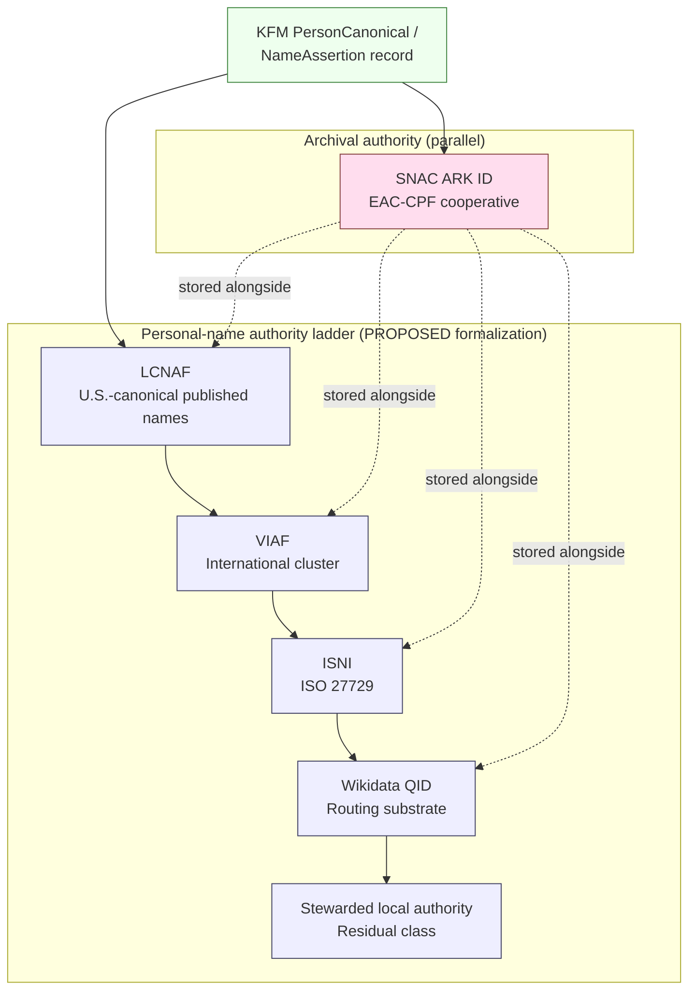
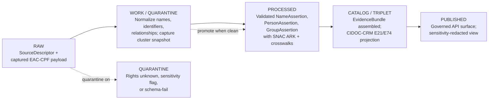
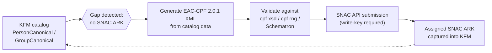

<!-- [KFM_META_BLOCK_V2]
doc_id: kfm://doc/standards/snac-eac-cpf
title: SNAC and EAC-CPF — Archival Authority for Persons, Corporate Bodies, and Families
type: standard
version: v1
status: draft
owners: TBD-authority-anchoring-stewards
created: 2026-05-14
updated: 2026-05-14
policy_label: public
related:
  - docs/standards/README.md
  - docs/standards/lcnaf.md           # PROPOSED neighbor
  - docs/standards/viaf.md            # PROPOSED neighbor
  - docs/standards/wikidata.md        # PROPOSED neighbor
  - docs/doctrine/authority-ladder.md
  - docs/domains/people-dna-land/README.md
  - docs/registers/AUTHORITY_LADDER.md
  - control_plane/source_authority_register.yaml
tags: [kfm, standards, authority-anchoring, C7, archives, eac-cpf, snac]
notes:
  - "Path PROPOSED until verified against live repo."
  - "Cross-references to neighboring standards files are PROPOSED placeholders."
[/KFM_META_BLOCK_V2] -->

# SNAC and EAC-CPF — Archival Authority for Persons, Corporate Bodies, and Families

> KFM's archive-specific authority layer for anchoring persons, corporate bodies, and families documented primarily through archival collections.


**Status:** draft · **Owners:** TBD-authority-anchoring-stewards · **Last updated:** 2026-05-14

---

## Contents

- [1. Scope and audience](#1-scope-and-audience)
- [2. What these standards are](#2-what-these-standards-are)
- [3. Why KFM uses them](#3-why-kfm-uses-them)
- [4. Placement in the authority ladder](#4-placement-in-the-authority-ladder)
- [5. Identifier model and stored fields](#5-identifier-model-and-stored-fields)
- [6. Crosswalk provenance, receipts, and gates](#6-crosswalk-provenance-receipts-and-gates)
- [7. Ingest path under the lifecycle law](#7-ingest-path-under-the-lifecycle-law)
- [8. Contribution back to SNAC](#8-contribution-back-to-snac)
- [9. Sensitivity, rights, and living-person considerations](#9-sensitivity-rights-and-living-person-considerations)
- [10. Tensions, limitations, and open governance questions](#10-tensions-limitations-and-open-governance-questions)
- [11. Worked example (illustrative)](#11-worked-example-illustrative)
- [Appendix A — EAC-CPF 2.0 structural overview](#appendix-a--eac-cpf-20-structural-overview)
- [Appendix B — Reference URLs](#appendix-b--reference-urls)
- [Related docs](#related-docs)

---

## 1. Scope and audience

> [!NOTE]
> This file is a **standards reference**, not policy. It describes how KFM consumes
> the external EAC-CPF standard and the SNAC cooperative as an authority source.
> Admissibility and promotion rules live in `policy/`. Machine shape lives in
> `schemas/`. Object meaning lives in `contracts/`. ADR-class decisions live in
> `docs/adr/`. Cite this file from those layers; do not move decisions into it.

This document covers:

- The **Encoded Archival Context for Corporate Bodies, Persons, and Families (EAC-CPF)** XML standard maintained by the Society of American Archivists' Technical Subcommittee on Encoded Archival Standards (TS-EAS).
- The **Social Networks and Archival Context (SNAC)** cooperative as KFM's operational source of EAC-CPF authority records.
- How SNAC ARK identifiers are stored alongside LCNAF, VIAF, ISNI, and Wikidata IDs on KFM person and corporate-body records.
- The **PROPOSED** ingestion, crosswalk-provenance, and contribution-back pathways tied to KFM doctrine (C7 authority anchoring, C5 promotion gates, C8 graph).

Audience: authority-anchoring stewards, archives-lane data engineers, policy authors writing Gate B (Schemas and Contracts) and Gate F (Provenance and Lineage) rules, and reviewers triaging records whose primary evidentiary footprint is archival.

[↩ Back to top](#contents)

---

## 2. What these standards are

### 2.1 EAC-CPF — the XML standard `[EXTERNAL]`

EAC-CPF is the international XML standard for encoding contextual information about persons, corporate bodies, and families related to archival materials. It is an adopted standard of the Society of American Archivists (SAA), maintained by the Technical Subcommittee on Encoded Archival Standards (TS-EAS). 

| Attribute | Value | Source |
|---|---|---|
| Current major version | **EAC-CPF 2.0** (released 2022) | `[EXTERNAL]` EAC-CPF 2.0 was approved and released in 2022 after a revision process started in 2017.  |
| Current minor version | **EAC-CPF 2.0.1** (January 2024) | `[EXTERNAL]` A minor release of the EAC-CPF 2.0.1 Tag Library was announced alongside an update to the Schematron validation files.  |
| Backwards compatibility | **2.0 is NOT backwards-compatible with 2010** | `[EXTERNAL]` The revised EAC-CPF 2.0 schema is not backwards compatible.  |
| Underlying conceptual base | ISAAR(CPF); closely aligned with EAD3 | `[EXTERNAL]` The standard is compliant with ISAAR(CPF) and closely related to EAD3.  |
| Schema artifacts | W3C XML-Schema (`cpf.xsd`) and Relax NG (`cpf.rng`) | `[EXTERNAL]` Schema artifacts are published as W3C XML-Schema and Relax NG by Staatsbibliothek zu Berlin.  |
| Reference site | <https://eac.staatsbibliothek-berlin.de/> | `[EXTERNAL]` |
| Schema repository | <https://github.com/SAA-SDT/eac-cpf-schema> | `[EXTERNAL]` The official schema releases are hosted at the SAA-SDT/eac-cpf-schema GitHub repository.  |

> [!IMPORTANT]
> KFM does **not** redefine EAC-CPF. KFM consumes EAC-CPF records as published by
> upstream archives (via SNAC or directly) and stores the relevant identifiers,
> headings, and provenance fields on its own canonical objects. Any KFM-side
> structural change to inbound EAC-CPF is a transform, not a redefinition, and is
> recorded in the `RunReceipt` per C1 doctrine.

### 2.2 SNAC — the cooperative `[CONFIRMED + EXTERNAL]`

SNAC (Social Networks and Archival Context) is a cooperative discovery service aggregating archival authority records contributed by U.S. archives. KFM treats SNAC as the operational source of EAC-CPF authority for figures whose footprint is primarily in unpublished archival collections — frontier settlers, county officials, regional newspaper editors, ranching families, and similar archival-only identities. [`CONFIRMED` from project corpus.]

| Attribute | Value | Source |
|---|---|---|
| Web entry point | <https://snaccooperative.org/> | `[EXTERNAL]` |
| REST API | <https://api.snaccooperative.org/> | `[EXTERNAL]` SNAC exposes a RESTful API documented at the api_help endpoint; read-only commands may be called without login, while write commands require an API key.  |
| Reconciliation service | <https://openrefine.snaccooperative.org/> | `[EXTERNAL]` |
| Identifier scheme | **ARK** (`ark:/99166/<id>`) | `[EXTERNAL]` SNAC ARK IDs follow the formatter pattern ark:/99166/$1, resolvable via https://snaccooperative.org/ark:/99166/$1.  |
| Wikidata crosswalk property | **P3430** (SNAC ARK ID) | `[EXTERNAL]` Wikidata property P3430 holds the SNAC ARK ID for persons and organizations.  |
| Lead federal agency | NARA (National Archives and Records Administration) | `[EXTERNAL]` NARA serves as the lead federal agency for SNAC according to AOTUS announcements.  |

`NEEDS VERIFICATION` — The project corpus describes SNAC API access as "currently rate-limited." Current rate-limit specifics, terms of use, and any membership requirement are not pinned in this document and should be verified against the current SNAC documentation before connector implementation.

[↩ Back to top](#contents)

---

## 3. Why KFM uses them

The project corpus is explicit on three points:

1. **For archival-only figures, SNAC may be the only authority that exists.** Without anchoring to SNAC, KFM cannot federate against the archival-description layer of its primary Kansas partners — KSHS, KU Spencer Research Library, KSU Special Collections — whose personal papers, photograph collections, and oral histories are described using EAC-CPF. [`CONFIRMED` doctrine.]

2. **SNAC IDs are first-class identifiers in KFM person and corporate-body records.** They are stored next to LCNAF, VIAF, and Wikidata QIDs, not as a fallback or footnote. [`CONFIRMED` doctrine.]

3. **EAC-CPF carries relationship and life-history context that flat name authorities lack.** The corpus identifies EAC-CPF as a complement to (not a replacement for) LCNAF: when published works exist, KFM anchors to LCNAF; when archival evidence dominates, KFM anchors to SNAC; commonly the record carries both. [`CONFIRMED` doctrine.]

[↩ Back to top](#contents)

---

## 4. Placement in the authority ladder

The KFM Pass-10 corpus describes a **personal-name authority ladder** of the form `LCNAF → VIAF → ISNI → Wikidata → local`. SNAC does **not** sit at a fixed rung of that ladder; it operates as a **parallel archival authority** that may carry the primary anchor when archival evidence dominates and the upper rungs are absent or thin. The diagram below renders that placement.



> [!NOTE]
> The diagram reflects **doctrine as captured in the Pass-10 corpus**, not a
> machine-checked policy. The formalization of the ladder into a Gate B
> machine-checkable rule is an expansion direction (C7-02 / C7-04), not a
> shipped policy. Treat the ladder as `PROPOSED` policy-as-code until an ADR or
> `policy/bundles/` rule fixes it.

### 4.1 Decision shape (PROPOSED)

For a given in-scope `PersonAssertion`, the anchoring decision in plain terms:

| Situation | Primary anchor (PROPOSED) | Also stored |
|---|---|---|
| Has published works in U.S. cataloging stream | LCNAF | VIAF, ISNI, Wikidata, SNAC if present |
| International publication footprint, no LCNAF | VIAF | ISNI, Wikidata, SNAC if present |
| Creator/performer with ISO presence, no LCNAF/VIAF | ISNI | Wikidata, SNAC if present |
| Primarily archival footprint (papers, photos, oral histories) | **SNAC ARK** | Wikidata if present; LCNAF if a publication is later found |
| In scope but no upstream authority found | Stewarded local authority | Wikidata (if a QID can be created); SNAC contribution candidate |

[↩ Back to top](#contents)

---

## 5. Identifier model and stored fields

### 5.1 What KFM stores per anchored identity

The fields below describe the **PROPOSED** field-level realization of CONFIRMED doctrine. The contract that owns these fields lives in `contracts/` (semantic) and `schemas/` (shape); this file describes *intent*, not normative shape.

| Field (PROPOSED) | Type | Required when SNAC anchored? | Notes |
|---|---|---|---|
| `snac.ark` | string, ARK URI | yes | Form: `ark:/99166/<id>`. Resolvable via `https://snaccooperative.org/ark:/99166/<id>` `[EXTERNAL]` |
| `snac.constellation_id` | integer | optional | Internal SNAC numeric ID. Use when the ARK is not yet stable. |
| `snac.preferred_heading` | string | yes | Captured at fetch time; may differ from KFM display name. |
| `snac.entity_type` | enum (`person`, `corporateBody`, `family`) | yes | Mirrors EAC-CPF `entityType`. |
| `snac.fetched_at` | RFC 3339 timestamp | yes | Receipt requirement (C1). |
| `snac.response_digest` | hex digest | yes | Content addressing of the captured response. |
| `lcnaf.iri`, `viaf.id`, `isni.id`, `wikidata.qid` | strings | when present | Stored in parallel; cross-anchored via crosswalk provenance. |

### 5.2 Reference URL patterns `[EXTERNAL]`

```text
SNAC web (human):           https://snaccooperative.org/ark:/99166/<id>
SNAC REST read (JSON):      https://api.snaccooperative.org/  (POST with arkid or constellationid)
SNAC download by ARK:       https://snaccooperative.org/download?arkid=<ark>&type=<type>
Wikidata property P3430:    https://www.wikidata.org/wiki/Property:P3430
```

> [!TIP]
> Store the **ARK** as the canonical SNAC identifier, not the constellation
> integer. ARKs are designed for long-term stability and are the form referenced
> by Wikidata's P3430 crosswalk; the constellation integer is an internal SNAC
> handle and may shift under merges or replacements.

[↩ Back to top](#contents)

---

## 6. Crosswalk provenance, receipts, and gates

### 6.1 Provenance fields the corpus requires `[CONFIRMED]`

C7.e Crosswalk Provenance is a CONFIRMED subcategory of the authority-anchoring doctrine. Every anchored identity must carry, in addition to the IRI:

- The **source** of the anchoring decision (which authority, which fetch).
- The **fetch time** at which the IRI was captured.
- The **confidence** behind the anchoring decision (exact match, heuristic, human-reviewed).

For SNAC specifically, the corpus is explicit that the receipt must record enough context to detect cluster drift — SNAC constellations can be split, merged, or replaced over time (mirroring the VIAF stability hazard). The `maintenanceStatus` attribute on the captured EAC-CPF record is a useful signal here. `[CONFIRMED + EXTERNAL]` EAC-CPF 2.0 elevates maintenanceStatus to a mandatory attribute on the control element, with values such as revised, deleted, new, deletedSplit, deletedMerged, deletedReplaced, cancelled, and derived. 

### 6.2 Gate hooks (PROPOSED enforcement)

| Gate | Hook for SNAC / EAC-CPF | Status |
|---|---|---|
| **Gate A — Structure and Metadata** | Receipt envelope includes `snac.fetched_at`, `snac.response_digest`, and source URL. | PROPOSED |
| **Gate B — Schemas and Contracts** | If in-scope record-type requires an archival anchor, SNAC ARK presence is checked. Authority-ladder ordering enforced. | PROPOSED |
| **Gate D — Security and Sensitivity** | Living-person and rights-flagged records receive C6 redaction before any cross-reference to SNAC is displayed publicly. | CONFIRMED doctrine / PROPOSED enforcement |
| **Gate F — Provenance and Lineage** | OpenLineage event records the SNAC fetch as an input dataset facet. | CONFIRMED doctrine / PROPOSED enforcement |

> [!WARNING]
> Per the corpus, Gate B refuses promotion when **required** anchors are absent
> for in-scope record types. SNAC presence becomes a Gate B requirement only for
> record classes where the corpus or an ADR designates SNAC as the required
> anchor. **Do not infer a universal SNAC requirement.** Most KFM person
> records will not require SNAC; they will require *some* authority anchor from
> the ladder.

[↩ Back to top](#contents)

---

## 7. Ingest path under the lifecycle law

KFM's invariant lifecycle applies: `RAW → WORK/QUARANTINE → PROCESSED → CATALOG/TRIPLET → PUBLISHED`. The SNAC/EAC-CPF anchoring step is a transform that runs during `WORK` and lands in `PROCESSED`, with the EvidenceBundle assembled in `CATALOG/TRIPLET`. This is `CONFIRMED` doctrine; the specific connector and pipeline names are `PROPOSED`.



### 7.1 Source role `[PROPOSED]`

Per the People/DNA/Land domain dossier, SNAC functions as an **authority** source role for archival identities. The role enum and its evolution rule are ADR-class (ADR-S-04 in the verification backlog), so the value `authority` is the doctrinally-aligned choice but the canonical enum vocabulary has not yet been pinned. Mark this `NEEDS VERIFICATION` until ADR-S-04 lands.

### 7.2 Connector and pipeline placement (PROPOSED paths)

> [!NOTE]
> The paths below are **PROPOSED** placements aligned with Directory Rules; they
> are not claims that a repo path currently exists. Verify against the live repo
> before creating or referencing them.

- Connector: `connectors/snac/` — outputs `data/raw/authorities/snac/...`
- Pipeline: `pipelines/authorities/snac-anchor/` — promotes through `data/work/...` and `data/processed/authorities/snac/...`
- Validators: `tools/validators/eac-cpf-schema-check.py` (XML-Schema 2.0.1 validation) and `tools/validators/snac-receipt-check.py`
- Policy bundle hook: `policy/bundles/promotion/authority-anchor.rego`
- Domain doc cross-reference: `docs/domains/people-dna-land/README.md`

[↩ Back to top](#contents)

---

## 8. Contribution back to SNAC

The corpus identifies a **contribution-back pipeline** as an expansion direction for C7-06: when KFM identifies a person not present in SNAC, generate an EAC-CPF record from KFM catalog data and propose it for upstream ingestion. `[CONFIRMED` expansion direction; `PROPOSED` implementation.]



**Pilot suggested by corpus.** Run the contribution-back pipeline against one volume of the *Kansas Historical Quarterly* index as the source corpus. `[CONFIRMED` as suggested future work.]

> [!IMPORTANT]
> Contribution-back inverts the trust direction: KFM becomes an **upstream
> author**, not a downstream consumer. This is a governance decision, not a
> tooling decision. An ADR is required before any SNAC write traffic leaves
> KFM, covering: editorial seat, review burden, rollback path on upstream
> rejection, attribution of contributed records, and a tombstone strategy if a
> contribution is later retracted. See the open questions in §10.

[↩ Back to top](#contents)

---

## 9. Sensitivity, rights, and living-person considerations

EAC-CPF records can describe living people, currently-active corporate bodies, and families with present-day members. The corpus's living-person rules apply with no relaxation when the upstream is SNAC.

- **Living-person redaction** is governed by C6-02 (named redaction profiles) and C6-06 (k-anonymity for living people). Anchoring to a SNAC ARK does not waive those rules.
- **Rights status** of the upstream EAC-CPF record (license, attribution requirements, redistribution terms) is captured in the `SourceDescriptor` and carried through to `ReleaseManifest`. `NEEDS VERIFICATION` — confirm current SNAC terms of use before publishing derivative records.
- **Sensitivity-tier defaults**: archival-only identities frequently sit at sensitivity tier 0 or 1 (public, with attribution), but Indigenous-figure records, family records containing living members, and records flagged by upstream archives as restricted must be evaluated case by case.
- **Cite-or-abstain** remains the default. A SNAC ARK is not, on its own, sufficient evidence for any factual claim about a person; the EAC-CPF body is the evidence, and even there KFM treats it as one source among several.

[↩ Back to top](#contents)

---

## 10. Tensions, limitations, and open governance questions

| # | Item | Source |
|---|------|--------|
| 1 | SNAC coverage outside the major-archive footprint is uneven; local historical-society collections often lack a SNAC record. | `CONFIRMED` corpus |
| 2 | SNAC constellation merges, splits, and replacements introduce a cluster-drift hazard analogous to VIAF cluster instability. | `CONFIRMED` corpus + `EXTERNAL` (EAC-CPF `maintenanceStatus` values) |
| 3 | EAC-CPF 2.0 broke backwards compatibility with the 2010 schema; consumers must handle both forms during the transition window. | `EXTERNAL` The revised EAC-CPF 2.0 schema is not backwards compatible.  |
| 4 | The Pass-10 corpus describes SNAC API access as "currently rate-limited"; current limits are not pinned here. | `CONFIRMED` doctrine / `NEEDS VERIFICATION` for current numbers |
| 5 | LCNAF coverage of vernacular, Indigenous, immigrant, and women's names is uneven; defaulting to LCNAF without SNAC layering can encode that unevenness as a feature. | `CONFIRMED` corpus |

### 10.1 Open questions tracked elsewhere

- What is the right governance model for KFM as an EAC-CPF contributor? Who in the partner ecosystem holds the editorial seat? `[CONFIRMED` open question.]
- How should KFM handle SNAC ARKs that resolve to multiple agents over time (merges/splits)? `[CONFIRMED` open question.]
- Should the authority-ladder formalization (`LCNAF → VIAF → ISNI → Wikidata → local`) include SNAC as an explicit parallel rung in the machine-checked policy, or remain logically parallel? `[NEEDS VERIFICATION` — ADR-class.]

These belong in `docs/registers/VERIFICATION_BACKLOG.md` (PROPOSED) and should not be resolved inside this file.

[↩ Back to top](#contents)

---

## 11. Worked example (illustrative)

> [!NOTE]
> The example below is **illustrative**. The names, ARKs, dates, and digests are
> placeholders. Real records carry real ARKs assigned by SNAC and real digests
> computed at fetch time.

A frontier-era county newspaper editor whose evidentiary footprint exists almost entirely in KSHS personal papers — no published monograph, no LCNAF heading, no VIAF cluster — is anchored to SNAC. The PROPOSED on-disk shape of the captured anchoring fragment:

```json
{
  "kfm_object": "PersonCanonical",
  "preferred_name": "Doe, John (1857–1921)",
  "anchors": {
    "snac": {
      "ark": "ark:/99166/wEXAMPLE",
      "constellation_id": 12345678,
      "preferred_heading": "Doe, John, 1857-1921",
      "entity_type": "person",
      "fetched_at": "2026-05-14T12:00:00Z",
      "response_digest": "sha256:PLACEHOLDER",
      "maintenance_status": "revised"
    },
    "lcnaf": null,
    "viaf": null,
    "isni": null,
    "wikidata": {
      "qid": "Q-EXAMPLE",
      "fetched_at": "2026-05-14T12:00:01Z"
    }
  },
  "crosswalk_provenance": {
    "decision": "primary_anchor=snac; lcnaf=absent; viaf=absent; isni=absent",
    "confidence": "human_reviewed",
    "decided_by": "TBD-steward",
    "decided_at": "2026-05-14T12:05:00Z"
  },
  "evidence_ref": "kfm://evidence/PLACEHOLDER"
}
```

The matching `EvidenceBundle` in `data/proofs/` (PROPOSED location) would resolve to (a) the captured EAC-CPF XML, (b) the SNAC API response receipt, and (c) the human review record. The KFM record's release-time projection (CIDOC-CRM `E21 Person`) carries `sameAs` links to the SNAC ARK and the Wikidata QID; the LCNAF/VIAF/ISNI fields remain null with `crosswalk_provenance.decision` recording the absence as a fact, not a gap.

[↩ Back to top](#contents)

---

## Appendix A — EAC-CPF 2.0 structural overview

<details>
<summary><strong>Click to expand: EAC-CPF 2.0 high-level structure (EXTERNAL reference)</strong></summary>

EAC-CPF 2.0 preserves the ISAAR(CPF)-derived four-area structure of its predecessor. `[EXTERNAL]` Following ISAAR(CPF), the established structure of the control area, identity area, description area, and relations is still available, as is the idea of encoding multiple identities in one EAC-CPF instance. 

| Area | Purpose (paraphrased from EAC-CPF 2.0 docs) |
|---|---|
| `<control>` | Maintenance and provenance metadata for the EAC-CPF instance itself: `maintenanceStatus`, publication status, agency, convention declarations, maintenance history. |
| `<identity>` | The name(s) and entity type (`person`, `corporateBody`, `family`) for the described entity. Supports multiple parallel identities in one instance. |
| `<description>` | Biographical or historical context: dates, places, occupations, functions, languages, mandates, structures, biographical history. |
| `<relations>` | Relationships to other CPF entities, to archival resources, and to external resources. |

**Notable 2.0 changes relevant to KFM ingestion** `[EXTERNAL]`:

- `maintenanceStatus` became a **mandatory** attribute on `<control>` with values including `revised`, `deleted`, `new`, `deletedSplit`, `deletedMerged`, `deletedReplaced`, `cancelled`, `derived`. These values directly support KFM's cluster-drift tracking requirements. 
- Dates support `@calendar`, `@era`, `@status` (`unknown` / `ongoing`), and `@certainty` (e.g., `approximate`).
- Language and script codes align with ISO 639 and ISO 15924; IETF language tags are explicitly supported.
- The `@transliteration` attribute was removed; transliteration is now declared via `<conventionDeclaration>`.

KFM should validate inbound EAC-CPF using both the W3C XML-Schema (`cpf.xsd`) and the Schematron files published alongside 2.0.1; the Schematron files catch constraints not expressible in XML Schema alone. `[EXTERNAL]` The 2.0.1 release included an update to the Schematron files used for extended validation of EAC-CPF 2.0 XML. 

</details>

[↩ Back to top](#contents)

---

## Appendix B — Reference URLs

<details>
<summary><strong>Click to expand: External resources (EXTERNAL)</strong></summary>

| Resource | URL | Notes |
|---|---|---|
| EAC-CPF homepage | <https://eac.staatsbibliothek-berlin.de/> | Authoritative entry for schema, tag library, revision notes. |
| EAC-CPF Tag Library & Schemata | <https://eac.staatsbibliothek-berlin.de/schemata-and-tag-library/> | Schema downloads (XSD, RNG), Schematron, Tag Library HTML/PDF. |
| EAC-CPF schema repository | <https://github.com/SAA-SDT/eac-cpf-schema> | Official SAA-SDT GitHub releases. |
| EAC-CPF 2.0 background | <https://eac.staatsbibliothek-berlin.de/eac-cpf-2-0-background/> | Revision history and rationale. |
| EAC-CPF 2.0.1 announcement | <https://eac.staatsbibliothek-berlin.de/ead-webinar-introducing-the-new-version-of-the-encoded-archival-context-corporate-bodies-persons-and-families-eac-cpf-standard-2/> | Minor-release notes for 2.0.1 (January 2024). |
| SAA EAC-CPF update | <https://www2.archivists.org/groups/technical-subcommittee-on-encoded-archival-standards-ts-eas/update-on-eac-cpf-20-encoded-arch> | Society of American Archivists post on the 2.0 release. |
| SNAC entry point | <https://snaccooperative.org/> | Web UI for the cooperative. |
| SNAC REST API docs | <https://snaccooperative.org/api_help> | RESTful API command reference. |
| SNAC GitHub org | <https://github.com/snac-cooperative> | Server, ArchivesSpace plugin, EAC validator, sample data. |
| Wikidata property P3430 | <https://www.wikidata.org/wiki/Property:P3430> | SNAC ARK ID crosswalk property. |
| ISAAR(CPF) (ICA) | <https://www.ica.org/> | Conceptual basis for EAC-CPF. (Top-level link only; the standard sits under ICA standards pages.) |

</details>

[↩ Back to top](#contents)

---

## Related docs

- `docs/standards/README.md` — index of external standards KFM conforms to. *(PROPOSED placeholder.)*
- `docs/standards/lcnaf.md` — companion standard at the top of the personal-name ladder. *(PROPOSED neighbor.)*
- `docs/standards/viaf.md` — international cluster authority. *(PROPOSED neighbor.)*
- `docs/standards/wikidata.md` — universal crosswalk substrate. *(PROPOSED neighbor.)*
- `docs/doctrine/authority-ladder.md` — doctrinal anchor for the C7 ladder. *(PROPOSED placement.)*
- `docs/domains/people-dna-land/README.md` — domain dossier consuming this standard.
- `docs/adr/` — see ADR-S-04 (source-role enum), ADR-class items for ladder formalization and contribution-back governance.
- `control_plane/source_authority_register.yaml` — machine-readable register of authority sources.
- `control_plane/policy_gate_register.yaml` — Gate B / Gate F mapping for authority anchors.

---

*Last updated: 2026-05-14 · Status: draft · KFM doc id: `kfm://doc/standards/snac-eac-cpf`*

[↩ Back to top](#contents)
