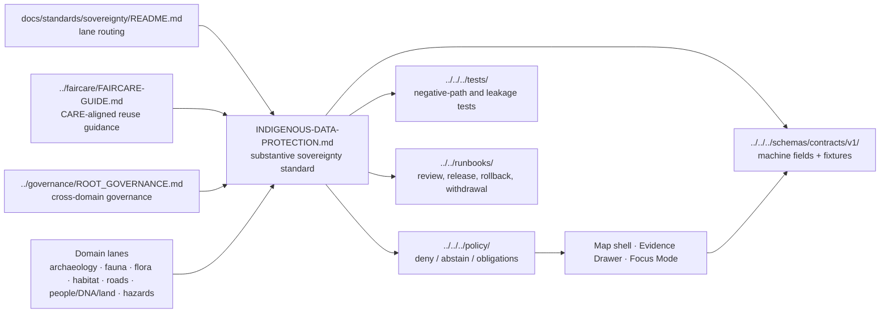
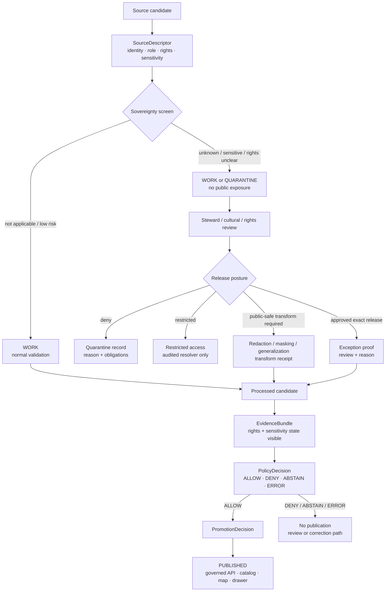

<!-- [KFM_META_BLOCK_V2]
doc_id: kfm://doc/REVIEW_REQUIRED_UUID
title: Indigenous Data Protection Standard
type: standard
version: v1
status: draft
owners: REVIEW_REQUIRED_OWNER
created: REVIEW_REQUIRED_DATE
updated: 2026-04-30
policy_label: public
related: [./README.md, ../README.md, ../faircare/FAIRCARE-GUIDE.md, ../governance/ROOT_GOVERNANCE.md, ../KFM_PROV_PROFILE.md, ../KFM_DCAT_PROFILE.md, ../KFM_STAC_PROFILE.md, ../../runbooks/README.md, ../../../contracts/README.md, ../../../schemas/README.md, ../../../schemas/contracts/v1/README.md, ../../../policy/README.md, ../../../tests/README.md]
tags: [kfm, standards, sovereignty, indigenous-data, faircare, rights, sensitivity, geoprivacy, publication-gates]
notes: [Draft revision for docs/standards/sovereignty/INDIGENOUS-DATA-PROTECTION.md. doc_id, created date, active-checkout owners, and active-checkout policy label need direct repo verification. policy_label applies to this standards text; governed records may be restricted, sovereignty-protected, or withheld.]
[/KFM_META_BLOCK_V2] -->

<a id="top"></a>

# Indigenous Data Protection Standard

Protection rules for Indigenous, community-sensitive, sovereignty-sensitive, and protected-knowledge data in KFM.


**Path:** `docs/standards/sovereignty/INDIGENOUS-DATA-PROTECTION.md`  
**Status:** `draft`  
**Primary role:** cross-domain sovereignty-sensitive publication standard  
**Default posture:** protect first, publish only after evidence, rights, sensitivity, steward review, and policy gates are satisfied.

**Quick jump:** [Truth boundary](#truth-boundary) · [Scope](#scope) · [Repo fit](#repo-fit) · [Core rule](#core-rule) · [Protection classes](#protection-classes) · [Lifecycle gate](#lifecycle-gate) · [Requirements](#requirements) · [Publication matrix](#publication-matrix) · [Map and geometry rules](#map-and-geometry-rules) · [AI and search rules](#ai-and-search-rules) · [Validation](#validation) · [Open verification](#open-verification)

---

## Truth boundary

> [!IMPORTANT]
> This file is a **normative standards draft**. It defines how KFM should handle sovereignty-sensitive and protected-knowledge material. It does **not** prove that active repo schemas, policies, validators, routes, CI workflows, steward lists, or release gates already exist.

| Claim type | Status | Handling |
|---|---:|---|
| KFM lifecycle law — `RAW → WORK / QUARANTINE → PROCESSED → CATALOG / TRIPLET → PUBLISHED` | **CONFIRMED doctrine** | Used as the required data-path frame. |
| Rights, sovereignty, sensitivity, and geoprivacy as publication gates | **CONFIRMED doctrine** | Treated as release-state controls, not decorative metadata. |
| Exact field names in this file | **PROPOSED** | Use as a companion contract sketch until schemas/policy confirm names. |
| Active checkout owner, doc UUID, policy engine, and steward roster | **UNKNOWN** | Must be verified before merge or release use. |
| Any specific legal, tribal, cultural, or community approval | **UNKNOWN** | Must be obtained outside this file; this standard cannot grant it. |

[Back to top](#top)

---

## Scope

This standard applies when KFM data, artifacts, maps, evidence bundles, search results, AI summaries, story nodes, public exports, or release candidates may include or infer:

- Indigenous cultural knowledge, oral histories, community-held knowledge, traditional ecological knowledge, place names, cultural landscapes, sacred places, burial or human-remains context, tribal archives, or restricted heritage records.
- Sensitive archaeological, historical, ecological, biocultural, genetic, land, route, settlement, or environmental data associated with Indigenous peoples, lands, waters, territories, resources, or cultural governance.
- Derived products that could expose protected locations, stewardship relationships, culturally sensitive narratives, or “how to locate” details even when the raw source is not itself labeled sensitive.
- Data whose rights, redistribution terms, cultural protocol, or public-release suitability are unresolved.

### Out of scope

This file does **not** own:

| Not owned here | Owning or expected surface |
|---|---|
| Executable allow / deny / abstain logic | `../../../policy/` |
| Machine schemas and field validation | `../../../schemas/` and `../../../schemas/contracts/v1/` |
| API request / response contracts | `../../../contracts/` and `../../../schemas/contracts/v1/` |
| Release, rollback, withdrawal, and operator procedures | `../../runbooks/README.md` and owning runbooks |
| STAC, DCAT, or PROV field-by-field profiles | `../KFM_STAC_PROFILE.md`, `../KFM_DCAT_PROFILE.md`, `../KFM_PROV_PROFILE.md` |
| FAIR+CARE background and general reuse guidance | `../faircare/FAIRCARE-GUIDE.md` |
| Lane routing and exclusions for this directory | `./README.md` |

> [!NOTE]
> This standard should be cited by downstream machine contracts and policy bundles, but it should not duplicate them. The standard explains the rule. Contracts and policy make the rule executable.

---

## Repo fit



**Upstream standards:** governance, FAIR+CARE, provenance, publication, documentation protocol.  
**Downstream consumers:** domain lanes, source registries, EvidenceBundle builders, policy gates, MapLibre/Cesium layers, Focus Mode, Story Nodes, search indexes, release manifests, correction/withdrawal flows.

[Back to top](#top)

---

## Core rule

> [!CAUTION]
> **Sovereignty-sensitive data is not public just because it is discoverable, mappable, scrapeable, archived, published elsewhere, or technically ingestible.**

KFM must treat Indigenous/community-sensitive data as governed material whose release depends on:

1. source identity,
2. rights and redistribution posture,
3. cultural protocol,
4. steward or community review where required,
5. sensitivity and geoprivacy review,
6. evidence support,
7. public-safe transformation,
8. policy decision,
9. promotion state,
10. correction and withdrawal path.

### Canonical posture

```text
When sovereignty status is unknown:
  do not publish exact data;
  do not summarize as authoritative;
  do not expose through search snippets;
  do not include in AI context;
  do not render precise geometry;
  route to review or quarantine.
```

KFM should prefer **ABSTAIN**, **DENY**, **QUARANTINE**, **GENERALIZE**, **WITHHOLD**, or **STAGED ACCESS** over a fluent but under-reviewed public answer.

---

## Protection classes

These classes are standards-level guidance. Machine-readable values remain **PROPOSED** until the schema and policy homes confirm their exact enum names.

| Class | Description | Public default | Required action |
|---|---|---:|---|
| `public_context` | Public, low-sensitivity context that does not expose protected knowledge or restricted locations. | Allowed only with citation and provenance. | Normal EvidenceBundle and rights review. |
| `community_sensitive` | Material that may affect Indigenous/community representation, interpretation, privacy, or dignity. | Not public by default. | Steward review and approved wording. |
| `sovereignty_protected` | Data governed by Indigenous/community authority, cultural protocol, tribal archive conditions, MOU, consent terms, or access agreement. | Denied unless explicitly approved. | Consent/stewardship record, access rules, and release proof. |
| `sensitive_location` | Exact or reconstructable location for sacred places, burials, sites, cultural landscapes, rare/protected species, restricted infrastructure, or other harm-prone assets. | Exact public geometry denied. | Generalize, mask, suppress, or restrict. |
| `oral_history_or_cultural_knowledge` | Oral history, traditional knowledge, cultural narrative, community-held interpretation, or knowledge whose meaning depends on protocol. | Denied until explicit permission and review. | Consent, cultural review, quote/context limits. |
| `rights_unclear` | License, source terms, redistribution, archive access, or community permission not resolved. | Quarantine. | Rights review before processing beyond controlled work state. |
| `derived_exposure_risk` | A derivative layer, AI answer, search result, graph edge, H3 cell, or story node could reveal protected knowledge even if source data is indirect. | Withhold or generalize. | Leakage review and transform receipt. |

### Hard-deny examples

Public release must be denied unless an explicit reviewed exception exists:

- exact coordinates for sacred sites, burial places, human remains, restricted cultural landscapes, or sensitive archaeological resources;
- “how to locate” descriptions, access routes, field clues, or triangulation details;
- restricted tribal archive contents or non-consensual heritage datasets;
- oral-history excerpts without permitted use, context, and quote boundaries;
- AI-generated cultural interpretation not grounded in approved evidence and review;
- map/search artifacts that allow reverse-engineering of withheld coordinates.

[Back to top](#top)

---

## Lifecycle gate

KFM’s normal lifecycle still applies, but sovereignty-sensitive material adds an early gate and a continuing release obligation.



### Required receipts and records

Every sovereignty-relevant release candidate should carry enough references to reconstruct why it was allowed, restricted, transformed, or denied.

| Record | Purpose |
|---|---|
| `SourceDescriptor` | Identifies source role, steward/contact, terms, access mode, sensitivity defaults, and citation requirements. |
| `ConsentRecord` | Records explicit permission or agreement where required. |
| `StewardReviewRecord` | Records who reviewed, what was reviewed, decision date, scope, and obligations. |
| `CulturalReviewRecord` | Records approved wording, context limits, story restrictions, or use conditions. |
| `SensitivityTransformReceipt` | Records redaction, masking, H3/generalization, coordinate suppression, quote trimming, or field removal. |
| `EvidenceBundle` | Exposes public-safe evidence, withheld state, obligations, lineage, and negative-path reasons. |
| `PolicyDecision` | Emits finite decision and reason codes. |
| `PromotionDecision` | Confirms release state and links proof objects. |
| `CorrectionNotice` / `WithdrawalNotice` | Supports post-release correction, takedown, or depublication. |

[Back to top](#top)

---

## Requirements

### R1 — CARE is not optional where Indigenous data is involved

KFM must not treat FAIR-style discoverability and reuse as sufficient for Indigenous/community-sensitive data. CARE-aligned concerns — collective benefit, authority to control, responsibility, and ethics — must be visible before publication or reuse.

**Implementation expectation:** source descriptors, release candidates, and EvidenceBundles should carry CARE/sovereignty status or a clear `not_applicable` reason.

### R2 — Source admission must include rights and sensitivity

A source is not admitted merely because it exists. KFM source admission must capture, at minimum:

```yaml
# PROPOSED field sketch; exact schema home and enum names need verification.
source_id: "<stable source id>"
source_role: "<authoritative | steward | archival | community | model | derivative | unknown>"
steward_contact_ref: "<person/team/community/contact ref or withheld ref>"
rights_posture: "<public | controlled | restricted | unknown>"
sovereignty_status: "<not_applicable | unknown | requires_review | approved | denied>"
sensitivity_default: "<public_context | community_sensitive | sovereignty_protected | sensitive_location | rights_unclear>"
location_precision_policy: "<exact_allowed | exact_restricted | generalized_only | withheld>"
citation_requirements: ["<required citation or attribution obligations>"]
review_required: true
```

### R3 — Unknown sovereignty status fails closed

If a source, record, layer, quote, or derivative product might involve Indigenous/community-sensitive material and the project cannot establish release suitability, the correct output is **ABSTAIN**, **DENY**, or **QUARANTINE**, not a best-effort public release.

### R4 — Public derivatives must be intentional artifacts

Redaction, masking, coordinate generalization, aggregation, quote trimming, and sensitivity-safe summaries must happen in governed transform steps. They must not be improvised in a browser, map popup, AI prompt, or search-result template.

### R5 — Exact geometry is exceptional

Exact public geometry for sovereignty-sensitive material requires a specific reviewed exception. “The source had coordinates” is not an exception.

Acceptable public alternatives include:

- no geometry;
- coarse named region;
- county or watershed summary where safe;
- generalized polygon;
- H3 or grid aggregation at an approved resolution;
- masked extent;
- delayed release;
- restricted resolver available only to approved roles.

### R6 — Evidence Drawer must show protection state

When a public claim is allowed, the Evidence Drawer must show enough public-safe context for users to understand the evidence posture without leaking restricted details.

Minimum public-safe drawer signals:

- source role;
- release state;
- whether exact evidence was withheld or generalized;
- why a claim is partial, generalized, or abstained;
- review state where public;
- correction/withdrawal link where present.

### R7 — Focus Mode and AI must not bypass the sovereignty gate

AI systems may summarize only the public-safe, released EvidenceBundle scope. They must not receive raw protected knowledge, restricted coordinates, controlled oral history, or unpublished cultural context unless an explicit restricted workflow permits it.

AI answers must use finite outcomes:

| Outcome | Meaning |
|---|---|
| `ANSWER` | Public-safe, cited answer from released EvidenceBundle scope. |
| `ABSTAIN` | Evidence, rights, sensitivity, or review state is insufficient. |
| `DENY` | Policy prohibits the requested output. |
| `ERROR` | System failure or unresolved policy/evidence dependency. |

### R8 — Search and embeddings are derivative acceleration only

Search indexes, embeddings, graph projections, snippets, map tiles, and summaries must inherit sovereignty/sensitivity flags from source records and EvidenceBundles. They may accelerate retrieval; they must not become separate truth or separate publication authority.

### R9 — Storytelling must not outrun review

Story Nodes, narratives, exhibit copy, map annotations, and educational summaries must not create cultural interpretation, affiliation claims, or historical certainty beyond the reviewed evidence and approved wording.

### R10 — Correction and withdrawal must be easy to execute

If a steward, community, reviewer, legal review, or evidence update requires correction, depublication, masking, or withdrawal, KFM must treat that as a normal governed state transition.

[Back to top](#top)

---

## Publication matrix

| Requested output | Default result | Required before public release |
|---|---:|---|
| Public context with no Indigenous/community sensitivity | `ALLOW` if cited and validated | SourceDescriptor, EvidenceBundle, policy pass. |
| Indigenous/community-sensitive narrative | `ABSTAIN` | Steward/cultural review, approved wording, quote boundaries, EvidenceBundle. |
| Oral history or community-held knowledge | `DENY` until permission | Consent record, cultural review, rights review, scope-limited release. |
| Sacred/burial/human-remains location | `DENY` | Reviewed exception only; exact geometry normally withheld. |
| Sensitive archaeological candidate from LiDAR/geophysics | `ABSTAIN` or `DENY` | Candidate framing, transform receipt, no confirmation claim from remote sensing alone. |
| Tribal archive or restricted heritage dataset | `DENY` | Access agreement, steward permission, release proof, restricted resolver if any. |
| Biocultural/ecological data tied to traditional lands/waters | `ABSTAIN` | Rights/sensitivity review, Local Contexts/TK/BC labels or notices if applicable, public-safe transform. |
| H3/grid/generalized surface | `ALLOW` only if leakage test passes | Approved resolution, transform receipt, no reverse-engineering risk. |
| AI summary of released public-safe evidence | `ANSWER` only with citations | EvidenceBundle scope, citation validation, sovereignty gate pass. |
| AI request for restricted cultural interpretation | `DENY` | No public model output unless restricted reviewed workflow exists. |

---

## Map and geometry rules

### Geometry release ladder

Use the least revealing geometry that still supports the public claim.

1. **No geometry** — use when location itself is protected.
2. **Named region only** — safe text scope, no shape.
3. **Coarse administrative / ecological / watershed unit** — only when not harmful.
4. **Generalized polygon or H3/grid aggregation** — only after leakage review.
5. **Restricted exact geometry** — steward/admin resolver only.
6. **Public exact geometry** — exceptional; requires documented review and release proof.

### Map UI obligations

Map layers and popups must not:

- expose exact protected coordinates through tooltips, URLs, vector tiles, debug overlays, source maps, logs, or browser caches;
- reveal restricted records through “no result” / “hidden result” side channels;
- use precise pins for generalized claims;
- imply cultural affiliation, route certainty, site confirmation, or community approval that the evidence does not support.

Map layers and popups should:

- label generalized or withheld geometry visibly;
- show evidence and review state;
- provide correction/report links;
- route users to approved public context rather than restricted detail.

[Back to top](#top)

---

## EvidenceBundle expectations

For sovereignty-sensitive material, an EvidenceBundle should include public-safe fields for the visible claim and restricted references for reviewer workflows.

```yaml
# PROPOSED EvidenceBundle sovereignty slice.
bundle_id: "<stable id>"
surface_class: "<public | restricted | reviewer_only>"
claim_scope:
  place: "<public-safe place scope>"
  time: "<time range and precision>"
  domain: "<domain lane>"
rights_and_sensitivity:
  sovereignty_status: "<not_applicable | unknown | requires_review | approved | denied>"
  care_gate_status: "<allow | abstain | deny | error>"
  sensitivity_class: "<public_context | community_sensitive | sovereignty_protected | sensitive_location>"
  public_geometry_class: "<none | named_region | generalized | restricted_exact | public_exact_exception>"
  obligations:
    - "<citation | no_exact_geometry | approved_wording_only | steward_review_required>"
evidence_members:
  public_refs:
    - "<released dataset/version/artifact refs>"
  withheld_refs:
    - "<reviewer-only refs, if permitted>"
transform_refs:
  - "<redaction/generalization/masking receipt>"
review_refs:
  - "<steward/cultural/rights review record>"
negative_path:
  status: "<none | partial | abstain | deny | conflict>"
  reason_codes:
    - "<reason>"
```

> [!TIP]
> If a public EvidenceBundle cannot explain why a claim is safe without revealing protected detail, the public answer should narrow scope or abstain.

---

## AI and search rules

### Focus Mode

Focus Mode must:

- retrieve only admissible public-safe evidence for public sessions;
- preserve `ABSTAIN` and `DENY` as useful outcomes;
- cite EvidenceBundle members, not model memory;
- avoid cultural reconstruction or speculative narrative;
- surface uncertainty, generalization, withheld status, and review state where safe.

Focus Mode must not:

- use sovereignty-sensitive records as prompt context by default;
- convert withheld details into paraphrases;
- answer “where is it?” questions for protected places;
- turn community knowledge into generalized public claims without review.

### Retrieval, embeddings, and graph edges

Derivative retrieval layers must inherit protection constraints.

| Layer | Rule |
|---|---|
| Search index | No restricted text snippets, exact coordinates, or hidden-record leakage. |
| Embeddings | No protected raw text in public or broadly reusable embedding stores. |
| Graph projection | Protected nodes/edges require access controls and public-safe projection rules. |
| Story synthesis | Narrative output must be bounded by approved wording and cited evidence. |
| Logs and telemetry | Store envelope hashes or safe identifiers, not sensitive payload details. |

---

## Validation

This standard expects both document-review checks and machine-facing companions.

### Standards-file checks

- [ ] KFM Meta Block V2 is present.
- [ ] H1 title matches the meta block title.
- [ ] Scope and exclusions are explicit.
- [ ] Relative links resolve in the active checkout.
- [ ] Unknowns are marked visibly.
- [ ] Review triggers are present for sensitive/public outputs.
- [ ] This file does not duplicate executable policy or schema authority.

### Policy and contract checks

Downstream policy and contracts should be able to test:

- [ ] unknown sovereignty status blocks public release;
- [ ] exact protected coordinates are denied unless an exception proof exists;
- [ ] public derivatives include transform receipts;
- [ ] EvidenceBundle includes rights/sensitivity state;
- [ ] AI public responses use only public-safe released evidence;
- [ ] search snippets do not leak protected text or coordinates;
- [ ] map layer descriptors cannot publish exact protected geometry by default;
- [ ] release candidates with rights unclear enter quarantine;
- [ ] correction/withdrawal notices invalidate or supersede affected public artifacts.

### Suggested reason codes

```yaml
# PROPOSED reason-code sketch.
sovereignty_unknown: "Sovereignty status is not resolved."
steward_review_required: "Steward or community review is required before release."
cultural_review_required: "Cultural interpretation or wording requires review."
rights_unclear: "License, access, redistribution, or consent posture is unclear."
exact_location_denied: "Exact protected location cannot be publicly exposed."
public_safe_transform_required: "A redaction, masking, or generalization transform is required."
ai_context_restricted: "Requested AI context is not available for public model use."
evidence_insufficient: "Evidence does not support the requested claim."
```

[Back to top](#top)

---

## Review triggers

A change must trigger governance, FAIR+CARE, sovereignty, or steward review when it:

- adds a new Indigenous/community-sensitive source family;
- changes public geometry precision or grid/H3 resolution;
- changes search, embedding, or graph access to protected records;
- changes AI context rules or prompt scopes;
- changes public wording for cultural, historical, oral-history, or heritage claims;
- changes policy reason codes or obligations;
- moves data out of quarantine or restricted access;
- publishes a new map layer, story node, catalog record, or public export involving protected knowledge;
- receives a steward/community correction or withdrawal request.

---

## Related standards

| Surface | Relationship |
|---|---|
| [`./README.md`](./README.md) | Sovereignty lane routing and exclusions. |
| [`../faircare/FAIRCARE-GUIDE.md`](../faircare/FAIRCARE-GUIDE.md) | General FAIR+CARE handling, stewardship, reuse, and redaction posture. |
| [`../governance/ROOT_GOVERNANCE.md`](../governance/ROOT_GOVERNANCE.md) | Cross-domain governance and review law. |
| [`../KFM_PROV_PROFILE.md`](../KFM_PROV_PROFILE.md) | Provenance and lineage profile for public/release artifacts. |
| [`../KFM_DCAT_PROFILE.md`](../KFM_DCAT_PROFILE.md) | Dataset and distribution discovery obligations. |
| [`../KFM_STAC_PROFILE.md`](../KFM_STAC_PROFILE.md) | Spatiotemporal item and asset discovery obligations. |
| [`../../../policy/README.md`](../../../policy/README.md) | Expected executable decision surface. |
| [`../../../tests/README.md`](../../../tests/README.md) | Expected fixture, negative-path, and proof-drill surface. |

---

## Open verification

- [ ] Replace `REVIEW_REQUIRED_UUID` with the canonical document ID.
- [ ] Confirm created date from git history or document registry.
- [ ] Confirm active-checkout owner or CODEOWNERS rule.
- [ ] Confirm active-checkout policy label for this standards text.
- [ ] Confirm whether Local Contexts TK/BC Labels or Notices are an adopted KFM metadata mechanism.
- [ ] Confirm exact schema field names for sovereignty, CARE, sensitivity, and public geometry classes.
- [ ] Confirm policy package, reason-code, and obligation vocabulary.
- [ ] Confirm steward-review workflow and restricted resolver design.
- [ ] Confirm correction, withdrawal, and depublication runbooks.
- [ ] Add valid and denied fixtures for at least one domain lane before using this standard as an enforcement claim.

---

## Maintainer note

This standard should make KFM slower only where speed would create harm. The goal is not to block knowledge work. The goal is to keep KFM’s public value — the inspectable claim — compatible with Indigenous authority, cultural protocol, rights, safety, correction, and responsible stewardship.

[Back to top](#top)
