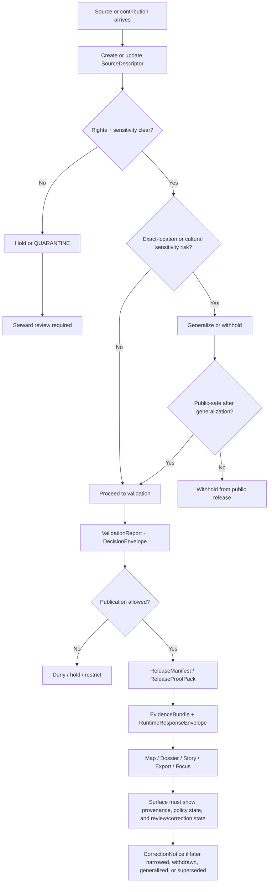

<!-- [KFM_META_BLOCK_V2]
doc_id: kfm://doc/<NEEDS-VERIFICATION-UUID>
title: Indigenous Data Protection
type: standard
version: v1
status: draft
owners: <NEEDS-VERIFICATION: owner/team>
created: 2026-03-24
updated: 2026-03-24
policy_label: <NEEDS-VERIFICATION: public|restricted|...>
related: [<NEEDS-VERIFICATION: ../governance/ROOT-GOVERNANCE.md>, <NEEDS-VERIFICATION: ../faircare/FAIRCARE-GUIDE.md>]
tags: [kfm, sovereignty, indigenous-data-protection]
notes: [Workspace evidence for this draft was PDF-only; adjacent repo paths, owners, and policy label require direct repo verification.]
[/KFM_META_BLOCK_V2] -->

# Indigenous Data Protection

KFM standard for handling Indigenous- or community-sensitive data so publication stays evidence-aware, review-bearing, and fail-closed.

> [!IMPORTANT]
> This draft is **doctrine-grounded** but **repo-shape-limited**. The current session exposed the KFM PDF corpus, not a mounted repository tree, so file-neighbor links, owners, and existing implementation depth remain **UNKNOWN** until directly verified.

| Status | Owners | Path | Role |
|---|---|---|---|
| `draft` | `NEEDS VERIFICATION` | `docs/standards/sovereignty/INDIGENOUS-DATA-PROTECTION.md` | Sovereignty and publication-control standard |

**Quick jump:** [Purpose](#purpose) · [Scope](#scope) · [Core rules](#core-rules) · [Decision flow](#decision-flow) · [Contract touchpoints](#contract-touchpoints) · [Publication classes](#publication-classes) · [Review triggers](#review-triggers) · [Delivery hooks](#delivery-hooks) · [Definition of done](#definition-of-done) · [Appendix](#appendix)

---

## Purpose

This standard defines how KFM must treat Indigenous data, Indigenous-adjacent materials, community-held knowledge, and other sovereignty-bearing records when those materials enter KFM’s governed truth path, evidence surfaces, and publication flows.

The point is not to bolt “care” language onto the edge of a GIS system. The point is to keep sovereignty, rights, provenance, precision, review, and correction inside the operating rules of the system itself.

## Status posture

| Label | Meaning in this document |
|---|---|
| **CONFIRMED** | Directly supported by the attached KFM corpus visible in this session |
| **PROPOSED** | Recommended control or workflow shape that fits the corpus but is not directly proven as mounted implementation |
| **UNKNOWN** | Not directly verified in the current session |

---

## Scope

This standard applies whenever KFM handles any of the following:

- Indigenous knowledge, oral histories, interviews, transcripts, heritage narratives, or community-contributed observations
- archival or documentary materials whose reuse depends on community context, stewardship, or culturally specific sensitivity
- exact or inferable locations for sacred places, burial areas, heritage sites, archaeology, biodiversity occurrences, or other sensitive places
- derived maps, dossiers, stories, exports, or Focus responses built from the materials above
- metadata, contracts, policy decisions, review records, and correction notices attached to those materials

### What belongs here

This file should govern:

- sovereignty-aware admission and publication rules
- rights and sensitivity handling
- precision and generalization rules
- steward review triggers
- trust-visible surface obligations
- contract and artifact expectations for sovereignty-bearing material

### What does **not** belong here

This file should **not** become:

- a generic FAIR explainer
- a full legal policy manual
- a tribal-data governance encyclopedia detached from KFM implementation
- a directory of all Indigenous datasets
- a substitute for lane-specific runbooks, review records, or publication decisions

Those belong in governance docs, FAIR+CARE guidance, lane-specific methods, review artifacts, and release-time proof objects.

---

## Repo fit

**Target location:** `docs/standards/sovereignty/INDIGENOUS-DATA-PROTECTION.md`

**Upstream relationship:** this standard should sit under the governing doctrine, policy, FAIR+CARE, and verification stack.

**Downstream relationship:** this standard should constrain source onboarding, review lanes, EvidenceBundle assembly, runtime envelopes, Focus responses, story publication, and export/report generation.

> [!NOTE]
> Multiple KFM documents already reference an Indigenous-data-protection standard at this path or an equivalent sovereignty location, which strongly suggests this file is expected in the repo. The exact neighboring files and current link validity still need direct repo verification.

---

## Why this standard exists in KFM

KFM’s doctrine is unusually clear that public-facing value is a **publication event**, not merely a successful query. That means outward-facing claims, maps, dossiers, stories, exports, and governed AI responses must all pass rights, sensitivity, provenance, and release-state checks. KFM is also explicit that archives, oral histories, public memory, and heritage are not lightweight narrative garnish; they are operating lanes whose context, rights, reuse constraints, and culturally sensitive material remain first-class. Likewise, biodiversity, archaeology, and exact-location cases require review-bearing workflows rather than convenience publication.

This standard turns that doctrine into an explicit sovereignty control surface.

---

## Core rules

### 1. No sovereignty-by-convenience

KFM must not publish, generalize, summarize, or visualize sovereignty-bearing material merely because it is technically processable.

If rights, stewardship, reuse scope, or cultural sensitivity are unclear, the system must **fail closed** and route the material to review.

### 2. No context stripping

Documentary, archival, oral-history, and community-contributed material must not be flattened into decontextualized “facts” when doing so would erase provenance, speaker position, collection context, or interpretive uncertainty.

### 3. No exact-location leakage

KFM must not expose precise or inference-friendly location details for sensitive places where public release would create cultural, heritage, archaeological, ecological, or community risk.

That prohibition covers both direct coordinates and indirect “how to locate” aids.

### 4. Generalize before you expose

Where public communication is still appropriate, KFM should prefer **generalized**, **aggregated**, or otherwise **public-safe** representations over exact publication.

Generalization is not a hidden transform. It must remain visible in metadata, surface state, and release lineage.

### 5. Review is required when ambiguity remains

If the system cannot establish a sufficiently clear rights and sensitivity posture, it must require steward review rather than publish by convenience.

### 6. Provenance stays attached

Every public-safe claim or rendered surface derived from sovereignty-bearing material must remain one hop away from inspectable evidence, policy state, and correction state.

### 7. No silent narrowing or overwrite

If a sovereignty-related correction, withdrawal, generalization, or supersession occurs, KFM must preserve visible lineage rather than quietly replacing prior meaning.

### 8. Derived layers are not sovereign truth

Search indexes, summaries, tiles, dashboards, graphs, stories, embeddings, and AI outputs remain derived layers. They do not outrank the rights, sensitivity, review, and provenance posture of the released scope they were built from.

---

## Decision flow

---

## Applicability matrix

| Material type | Minimum posture | Why |
|---|---|---|
| Oral histories, transcripts, public memory, heritage narratives | **Review-bearing** | Narrative convenience must not erase provenance, context, or culturally sensitive meaning |
| Archaeology, sacred-place hints, heritage sites | **Generalize or withhold by default** | Exact-location exposure can create irreversible harm |
| Biodiversity / sensitive-occurrence data with community implications | **Governed generalization** | Sensitive-occurrence lanes are explicitly called out as needing controlled publication |
| Community-contributed observations | **Moderated governed input** | Community contribution is not automatic truth and needs confidence + rights handling |
| Documentary / archival scans, maps, reports | **Context-preserving release** | Documentary materials can be interpretive, source-dependent, and rights-constrained |
| Parcel / deed / cadastral data touching Indigenous or heritage context | **Lane-specific review** | Identity resolution, OCR/geoparsing, and temporal linking are review-bearing |
| Focus responses, story nodes, exports | **Must inherit released scope and policy posture** | Derived surfaces cannot outrun rights, sensitivity, or correction linkage |

---

## Contract touchpoints

KFM’s strongest architecture documents already imply the contract families that sovereignty-bearing workflows need. This standard should attach Indigenous-data obligations to those artifacts rather than invent a disconnected side system.

| Contract / artifact | Must capture | Sovereignty consequence |
|---|---|---|
| **SourceDescriptor** | rights, sensitivity, publication intent, steward/contact, location-precision constraints | No governed admission without an explicit reuse and sensitivity posture |
| **IngestReceipt** | what was fetched, when, with what integrity result, and copied rights/sensitivity class | Prevents “mystery ingestion” of ambiguous material |
| **ValidationReport** | schema/semantic checks, quarantine triggers, reason codes | Makes sovereignty failures machine-visible, not editorially implicit |
| **DecisionEnvelope** | action, result, reason codes, obligation codes, policy basis, effective window | Enables deny / generalize / restrict / review-required outcomes |
| **ReviewRecord** | reviewer role, decision, comments, separation-of-duty state | Keeps steward judgment explicit and auditable |
| **ReleaseManifest / ReleaseProofPack** | public-safe scope, checks, rollback posture, accessibility gate | Blocks publication when sovereignty obligations are unmet |
| **EvidenceBundle** | released scope, rights/sensitivity state, obligations, lineage summary | Public surfaces stay inspectable without direct raw access |
| **RuntimeResponseEnvelope** | finite outcome, citations check, decision ref, surface state | Focus and other runtime surfaces cannot bluff past sovereignty constraints |
| **CorrectionNotice** | affected release/surface, cause, replacement or withdrawal | No silent overwrite after sensitivity correction |

---

## Publication classes

The KFM corpus directly supports a visible distinction between **public-safe**, **generalized**, and **withheld** states. The more detailed class names below are useful starter language, but the exact registry remains **PROPOSED** until repo implementation is verified.

| Class | Meaning | Typical use |
|---|---|---|
| **public-safe** | Safe to publish at the requested audience/surface | Non-sensitive released material with clear rights posture |
| **generalized** | Publishable only after precision, granularity, or identifying detail is reduced | Sensitive place-based or community-linked material that can still support public explanation |
| **withheld** | Not publishable on the requested surface | Unclear rights, unresolved sensitivity, or high exact-location risk |
| **review-required** | Cannot progress automatically | Ambiguous stewardship, uncertain reuse scope, contested interpretation, or unresolved community context |
| **restricted** | Available only on constrained steward/reviewer surfaces | Materials requiring tighter access than public-safe release |

> [!WARNING]
> “Generalized” must never mean “we hid the coordinates but left enough clues to locate the place anyway.” The release must be safe in practice, not just cosmetically redacted.

---

## Review triggers

A steward or equivalent review lane should be mandatory when any of the following is true:

- the material comes from an Indigenous nation, Indigenous organization, community archive, oral-history program, or equivalent stewarded collection
- reuse terms are missing, ambiguous, contradictory, or narrower than the intended KFM surface
- the material contains exact or inferable locations for culturally sensitive, heritage, archaeological, biodiversity, or sacred places
- the material is documentary or interpretive and could be flattened into false certainty
- the material includes community-contributed observation without adequate moderation or provenance
- a story, dossier, export, or Focus response would expose sensitive meaning outside the collection context
- the requested release would require generalization, withholding, or audience restriction
- correction, withdrawal, or supersession may materially change prior public meaning

---

## Surface obligations

KFM’s trust-visible surfaces already establish the right pattern: consequential reading stays close to evidence, policy state, freshness, and correction state.

### Evidence Drawer

For sovereignty-bearing material, the Evidence Drawer should expose at least:

- source basis
- rights/sensitivity state
- whether the visible representation is public-safe, generalized, or withheld upstream
- release and correction state
- transform or redaction notes where those shaped meaning

### Story and dossier surfaces

Storytelling and dossier assembly must not strip:

- speaker or archive context
- date and collection frame
- modeled-vs-observed distinctions
- review status
- uncertainty introduced by generalization

### Focus Mode and governed assistance

Governed AI must inherit the same sovereignty controls as any other surface:

- scope first
- admissible evidence only
- policy and sensitivity checks before synthesis
- finite outcomes only: **ANSWER**, **ABSTAIN**, **DENY**, or **ERROR**
- visible audit linkage and correction visibility

### Exports and reports

Exports must never outrun:

- release state
- correction linkage
- rights posture
- sensitivity posture
- preview/publication policy

---

## Delivery hooks

These controls are **PROPOSED** as the minimum repo-facing enforcement shape for this standard.

| Hook | Purpose |
|---|---|
| `reason_codes` registry | Prevent free-text drift for sovereignty denials and holds |
| `obligation_codes` registry | Make required citation, generalization, review, or withholding machine-readable |
| valid/invalid fixtures | Prove that sovereignty-bearing contracts reject unsafe shapes |
| leakage tests | Catch coordinates, “how to locate” details, signed URLs, or secrets in outputs |
| deterministic checks | Ensure repeated builds do not quietly alter public meaning |
| generalized-vs-precise comparison tests | Prove public surfaces are actually safer than internal precise scope |
| correction tests | Ensure withdrawal, narrowing, and supersession remain visible |

### Example reason codes

These are starter examples aligned to the contract language already present in the corpus:

| Example code | Meaning |
|---|---|
| `rights.unknown` | Reuse or redistribution posture is unresolved |
| `sensitivity.exact_location` | Exact location is too sensitive for the requested audience |
| `review.required` | Automated publication is not allowed without steward review |
| `validation.schema_failed` | Required contract or semantic validation failed |
| `corroboration.conflicted` | Admissible sources disagree materially |

---

## Definition of done

- [ ] Rights and sensitivity posture is explicit before release
- [ ] Exact-location risk has been assessed
- [ ] Public-safe, generalized, withheld, or restricted state is visible
- [ ] Steward review is recorded where required
- [ ] EvidenceBundle remains inspectable from the outward surface
- [ ] Story/export/Focus output does not erase provenance or interpretive context
- [ ] Leakage checks prevent coordinates, “how to locate” clues, signed URLs, and secrets
- [ ] Correction path is ready if release posture later changes
- [ ] Derived layers inherit, rather than bypass, sovereignty controls
- [ ] Release proof objects record the publication decision rather than relying on prose alone

---

## Non-goals

This standard is **not** trying to:

- make all sovereignty-sensitive data public through better formatting
- replace direct community stewardship with platform defaults
- collapse oral history, archive, archaeology, biodiversity, and land records into one simplistic risk class
- define every possible legal regime
- imply that KFM already has all required registries, schemas, review routes, or CI checks implemented

---

## FAQ

### Does this standard require withholding everything Indigenous-adjacent?

No. It requires **governed distinction**. Some materials may be public-safe. Others may be generalized. Others must remain withheld or restricted. The system must make that distinction explicit instead of pretending one release posture fits all.

### Is this only about coordinates?

No. Coordinates are only one part of the burden. Context loss, reuse constraints, provenance stripping, interpretive flattening, and community stewardship are also central.

### Can a map still be published if exact locations are too sensitive?

Yes, when a genuinely public-safe generalized representation is possible and the generalization remains visible.

### Does FAIR compliance settle this?

No. FAIR-style discoverability is useful, but the corpus is explicit that it is not enough where care, sovereignty, privacy, exact-location risk, or cultural sensitivity burdens are present.

---

## Appendix

<strong>Terminology and open verification items</strong>

### Working terms

| Term | Working meaning |
|---|---|
| **public-safe** | Safe for the requested outward audience and surface |
| **generalized** | Deliberately de-precised or aggregated to reduce harm |
| **withheld** | Not outwardly releasable on the requested surface |
| **review-bearing** | Cannot progress without explicit steward/reviewer action |
| **sovereignty-bearing material** | Material whose publication posture depends on stewardship, community context, rights, exact-location risk, or cultural sensitivity |

### Open verification items

- **UNKNOWN:** exact repo owner/team for this standard
- **UNKNOWN:** whether `ROOT-GOVERNANCE.md` and `FAIRCARE-GUIDE.md` exist at the inferred neighboring paths
- **UNKNOWN:** whether the repo already contains a sovereignty directory README or related standards index
- **UNKNOWN:** whether reason/obligation registries and schema fixtures are already implemented in-tree
- **UNKNOWN:** whether a formal publication-class vocabulary already exists in policy bundles
- **UNKNOWN:** whether the repo currently uses this exact title or a nearby variant for sovereignty guidance

### Suggested adjacent docs to verify

- `docs/standards/governance/ROOT-GOVERNANCE.md`
- `docs/standards/faircare/FAIRCARE-GUIDE.md`
- `docs/standards/sovereignty/README.md`
- `policy/reason_codes.json`
- `policy/obligation_codes.json`
- `contracts/source/source_descriptor.schema.json`

[Back to top](#indigenous-data-protection)
