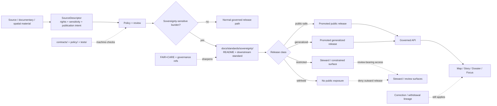

<!-- [KFM_META_BLOCK_V2]
doc_id: kfm://doc/<uuid-TODO-VERIFY>
title: Sovereignty
type: standard
version: v1
status: draft
owners: @bartytime4life
created: YYYY-MM-DD
updated: YYYY-MM-DD
policy_label: TODO-VERIFY
related: [../README.md, ../../README.md, ../../../README.md, ./INDIGENOUS-DATA-PROTECTION.md, ../faircare/FAIRCARE-GUIDE.md, ../governance/ROOT_GOVERNANCE.md, ../../../policy/README.md, ../../../contracts/README.md, ../../../schemas/README.md, ../../../tests/README.md, ../../../.github/workflows/README.md]
tags: [kfm, standards, sovereignty]
notes: [existing public-main README contains stale pre-merge language; UUID, policy label, and commit-time dates still need verification]
[/KFM_META_BLOCK_V2] -->

# Sovereignty

_Directory README for KFM sovereignty standards, routing cross-cutting sovereignty-sensitive rules to the Indigenous data protection standard and adjacent governance surfaces._

> **Status:** `experimental`  
> **Doc status:** `draft`  
> **Owners:** `@bartytime4life` *(current `/docs/` CODEOWNERS fallback; no narrower sovereignty owner was directly verified on public `main`)*  
>         
> **Repo fit:** `docs/standards/sovereignty/README.md` · upstream [`../README.md`](../README.md) / [`../../README.md`](../../README.md) / [`../../../README.md`](../../../README.md) · downstream standard [`./INDIGENOUS-DATA-PROTECTION.md`](./INDIGENOUS-DATA-PROTECTION.md)  
> **Quick jump:** [Scope](#scope) · [Repo fit](#repo-fit) · [Accepted inputs](#accepted-inputs) · [Exclusions](#exclusions) · [Directory tree](#directory-tree) · [Quickstart](#quickstart) · [Usage](#usage) · [Diagram](#diagram) · [Tables](#tables) · [Gates and definition of done](#gates-and-definition-of-done) · [FAQ](#faq) · [Appendix](#appendix)

> [!IMPORTANT]
> This README is the **lane boundary** for sovereignty-sensitive standards. It should make the lane reviewable without becoming a second authoritative copy of the substantive rules that belong in [`./INDIGENOUS-DATA-PROTECTION.md`](./INDIGENOUS-DATA-PROTECTION.md).

> [!NOTE]
> Current public `main` already exposes both `docs/standards/sovereignty/README.md` and `docs/standards/sovereignty/INDIGENOUS-DATA-PROTECTION.md`. The checked-in README still contains pre-merge language that treats itself as a proposed addition; this revision corrects that drift and keeps the lane description aligned to the visible repo.

## Scope

`docs/standards/sovereignty/` is the governed KFM standards lane for rules that determine when **ordinary discoverability is not enough** because sovereignty, protected knowledge, culturally sensitive material, or exact-location exposure changes what may be published, generalized, restricted, withheld, or escalated for review.

In KFM terms, this lane sits between broad cross-cutting doctrine and machine-facing enforcement:

- it keeps the **normative rule surface** human-readable,
- it routes contributors toward the right downstream standard,
- and it points outward to the contract, policy, review, release, and trust-surface seams that must carry the machine-checkable burden.

This README is intentionally **narrow**. Its job is to define the lane, its role, and its review boundary. Substantive sovereignty rules should expand the right downstream file in place instead of spawning parallel authority.

### Truth posture used in this README

| Label | Meaning here |
|---|---|
| **CONFIRMED** | Directly supported by current public `main` inspection or repeated KFM doctrine |
| **INFERRED** | Conservative interpretation drawn from confirmed repo evidence and doctrine |
| **PROPOSED** | Forward-looking wording or enforcement shape not yet proven as checked-in behavior |
| **UNKNOWN** | Not directly reverified strongly enough to present as current repo fact |
| **NEEDS VERIFICATION** | UUIDs, dates, exact owner overrides, and non-public enforcement settings still need direct proof |

[Back to top](#sovereignty)

## Repo fit

### Path, role, and neighbors

| Item | Value |
|---|---|
| Path | [`docs/standards/sovereignty/README.md`](./README.md) |
| Path status | **CONFIRMED** existing file on public `main`; mounted-checkout parity still **NEEDS VERIFICATION** |
| Role | Directory index and routing surface for sovereignty-sensitive standards under `docs/standards/` |
| Upstream | [standards index](../README.md) · [docs index](../../README.md) · [repo root](../../../README.md) |
| Downstream | [INDIGENOUS-DATA-PROTECTION.md](./INDIGENOUS-DATA-PROTECTION.md) |
| Adjacent governed areas | [FAIR+CARE](../faircare/FAIRCARE-GUIDE.md) · [governance](../governance/ROOT_GOVERNANCE.md) · [policy](../../../policy/README.md) · [contracts](../../../contracts/README.md) · [schemas](../../../schemas/README.md) · [tests](../../../tests/README.md) · [workflows](../../../.github/workflows/README.md) |

### Current verified snapshot

| Surface | Current public `main` state | Why it matters here |
|---|---|---|
| `./README.md` | **Present, existing directory README** | This file now exists and should be revised in place; it should not describe itself as a proposed addition |
| [`./INDIGENOUS-DATA-PROTECTION.md`](./INDIGENOUS-DATA-PROTECTION.md) | **Present, short doctrine-grounded draft standard** | Substantive sovereignty rule text already exists, but it still carries stale repo-boundary caveats and unresolved-neighbor notes |
| [`../README.md`](../README.md) | **Present, substantive standards index** | The standards lane already treats sovereignty as real, but its routing still points readers primarily to the downstream standard |
| [`../faircare/FAIRCARE-GUIDE.md`](../faircare/FAIRCARE-GUIDE.md) | **Present, scaffold-only** | FAIR+CARE is a real neighbor, but local detail remains thin |
| [`../governance/ROOT_GOVERNANCE.md`](../governance/ROOT_GOVERNANCE.md) | **Present, substantive draft standard** | Governance routing inside `docs/standards/` is already real, not merely structural |
| [`../../../policy/README.md`](../../../policy/README.md) | **Present, substantive** | Policy is already framed as deny-by-default and remains the machine-facing home for executable rule logic |
| [`../../../contracts/README.md`](../../../contracts/README.md) and [`../../../schemas/README.md`](../../../schemas/README.md) | **Present** | Contract and schema authority remain separate from README prose |
| [`../../../tests/README.md`](../../../tests/README.md) | **Present, substantive** | Verification is already treated as governed proof, not generic QA |
| [`../../../.github/workflows/README.md`](../../../.github/workflows/README.md) | **Present, README-only** | Public workflow intent is visible, but checked-in workflow YAML depth still should not be assumed |
| `.github/CODEOWNERS` `/docs/` rule | **Present** | `@bartytime4life` is the strongest directly verified ownership signal for this lane |

### Why this lane exists

KFM’s standards surface already treats sovereignty as a real cross-cutting concern, not a side note hidden inside domain prose. That matters because sovereignty-sensitive handling often crosses multiple lanes at once:

- documentary and oral-history material,
- archaeology and heritage context,
- biodiversity or exact-location release risk,
- and any case where FAIR-style discoverability must yield to stronger care, rights, or withholding obligations.

This README keeps that seam visible at the directory level so contributors do not have to infer the lane from a single downstream filename.

[Back to top](#sovereignty)

## Accepted inputs

Place a file in this directory when it defines a **shared sovereignty-sensitive rule** that multiple KFM lanes can depend on.

| Accepted input | Why it belongs here |
|---|---|
| Indigenous data protection standards | This is the current downstream standard already routed here |
| Cross-cutting protected-knowledge handling rules | They apply across archives, heritage, exact-location, and release surfaces |
| Sovereignty-related review triggers | They shape when public release must pause, generalize, restrict, or fail closed |
| Normative guidance for `public-safe`, `generalized`, `restricted`, or `withheld` handling when sovereignty burden is present | The rule is cross-domain even when the evidence lives elsewhere |
| Routing guidance that links sovereignty obligations to FAIR+CARE, governance, policy, contracts, review, release, and correction | This lane exists to keep those seams legible together |
| Contributor-facing escalation guidance | Reviewers and maintainers need a stable place to decide when a sovereignty burden has entered the flow |

## Exclusions

This directory should stay normative and cross-cutting. It should **not** become a catch-all for policy code, domain notes, or restricted data.

| Does **not** belong here | Put it here instead |
|---|---|
| Rego bundles, policy tests, or executable decision logic | [`../../../policy/`](../../../policy/) |
| JSON Schema, OpenAPI, or machine contract shapes | [`../../../contracts/`](../../../contracts/) and [`../../../schemas/`](../../../schemas/) |
| Source-specific receipts, manifests, or release artifacts | truth-path artifact homes under `../../../data/` or their owning contract surfaces |
| Domain-only notes about one archive, site, habitat, or source family | domain docs or runbook surfaces |
| Exact site coordinates, “how to locate” instructions, or other restricted details | never in directory README prose; route through governed review and public-safe artifact handling |
| Exploratory essays or literature notes | [`../../research/`](../../research/) |
| Runtime UI code, export logic, or service behavior | owning `apps/` or `packages/` surfaces |

> [!WARNING]
> Do not use this README to “smuggle in” sensitive examples at a fidelity the downstream standard or policy layer would not permit. If an example needs protection, generalize it or omit it.

## Directory tree

### Current lane shape on public `main`

```text
docs/standards/sovereignty/
├── README.md
│   # CONFIRMED on public main; directory index and lane boundary
└── INDIGENOUS-DATA-PROTECTION.md
    # CONFIRMED on public main; doctrine-grounded downstream draft standard
```

> [!CAUTION]
> Do not create a second sovereignty standard elsewhere unless the lane genuinely splits and the upstream standards index is updated intentionally.

[Back to top](#sovereignty)

## Quickstart

### Verify the current lane before editing

```bash
# inspect the sovereignty lane and its immediate neighbors
find docs/standards/sovereignty -maxdepth 2 -type f 2>/dev/null | sort

# inspect current directory and downstream standard content
sed -n '1,260p' docs/standards/sovereignty/README.md
sed -n '1,260p' docs/standards/sovereignty/INDIGENOUS-DATA-PROTECTION.md

# inspect current upstream routing and adjacent governance surfaces
grep -n "sovereignty" docs/standards/README.md 2>/dev/null
sed -n '1,220p' .github/CODEOWNERS 2>/dev/null
sed -n '1,240p' docs/standards/governance/ROOT_GOVERNANCE.md 2>/dev/null
sed -n '1,240p' policy/README.md 2>/dev/null
sed -n '1,240p' contracts/README.md 2>/dev/null
sed -n '1,240p' schemas/README.md 2>/dev/null
sed -n '1,240p' tests/README.md 2>/dev/null
sed -n '1,240p' .github/workflows/README.md 2>/dev/null

# scan for relevant vocabulary before adding new rule text
grep -RIn "FAIR\|CARE\|sovereignty\|generalized\|restricted\|withheld\|rights\|sensitivity\|exact-location" \
  docs policy contracts schemas tests .github 2>/dev/null
```

### Add or revise sovereignty content safely

1. Confirm the change is **cross-cutting** rather than domain-only.
2. Decide whether the right home is:
   - this README, if the change is about lane scope, routing, or review boundary; or
   - [`./INDIGENOUS-DATA-PROTECTION.md`](./INDIGENOUS-DATA-PROTECTION.md), if the change is substantive sovereignty-standard content.
3. Link the change to its governing neighbors:
   - [`../README.md`](../README.md),
   - [`../faircare/FAIRCARE-GUIDE.md`](../faircare/FAIRCARE-GUIDE.md),
   - [`../governance/ROOT_GOVERNANCE.md`](../governance/ROOT_GOVERNANCE.md),
   - [`../../../policy/README.md`](../../../policy/README.md),
   - and the relevant contract/schema surfaces.
4. Keep examples generalized if a sovereignty burden could be worsened by specificity.
5. Update the upstream standards index if routing or downstream expectations change.

> [!TIP]
> Expand the right file in place. Use this README for lane scope and review boundary; use the downstream standard for substantive sovereignty rules.

## Usage

### For maintainers

Use this README to keep the **lane boundary** crisp:

- what this directory governs,
- what it must route to,
- and what should stay elsewhere.

Keep it short enough that reviewers can use it as a merge-time checklist, but strong enough that the sovereignty lane cannot disappear into vague references.

### For domain stewards

Open this lane when a domain-specific change starts asking questions like these:

- Does public release expose or help derive a protected location?
- Does the material carry Indigenous, archival, oral-history, or heritage burden beyond ordinary attribution?
- Would a map, Story, Dossier, Export, or Focus answer need `generalized`, `restricted`, or `withheld` treatment instead of direct release?
- Is FAIR-style discovery insufficient without a stronger care / review / sovereignty step?

When that happens, link to the shared standard. Do **not** copy the rule text into multiple domain READMEs.

### For reviewers

Treat sovereignty-sensitive handling as a **release and trust-surface concern**, not just an intake note. Review should ask whether the burden remains visible through:

- source admission,
- policy evaluation,
- review artifacts,
- release state,
- EvidenceBundle / RuntimeResponseEnvelope surfaces,
- and correction or withdrawal if exposure risk is discovered later.

### Current lane rule

At present, this remains a **one-standard lane with a directory README**:

- this README defines the seam, scope, and review boundary;
- [`./INDIGENOUS-DATA-PROTECTION.md`](./INDIGENOUS-DATA-PROTECTION.md) carries the substantive Indigenous data protection rules.

[Back to top](#sovereignty)

## Diagram



## Tables

### Sovereignty trigger matrix

| Trigger class | Posture | Why this lane matters | Minimum consequence | Adjacent enforcement surface |
|---|---|---|---|---|
| Archives, oral histories, public memory, and heritage material | **CONFIRMED** | KFM doctrine treats context, rights, reuse constraints, and culturally sensitive material as first-class, and says narrative convenience must not erase provenance | Route through the downstream standard and make review/generalization needs explicit before public release | policy, review artifacts, release docs, trust surfaces |
| Archaeology and heritage 2.5D/3D context | **CONFIRMED** | KFM doctrine warns against flattening fidelity burdens into visual convenience and keeps higher-detail publication review-bearing | Keep exact-location and fidelity escalation review-bearing; do not treat higher detail as automatically public-safe | policy, release, correction, UI trust states |
| Ecology / biodiversity exact-location material | **CONFIRMED** | KFM doctrine treats exact-location exposure as a real release burden where geoprivacy, generalization, or withholding may be required | Do not expose precise location by default in docs or downstream public surfaces | policy, data/release handling, public-safe labeling |
| Indigenous data or otherwise protected knowledge | **CONFIRMED** | The repo already carries a dedicated Indigenous data protection standard at this path | Expand the downstream standard in place instead of creating parallel sovereignty authority | this directory, policy, review, downstream standard |

### Release visibility states this lane should keep explicit

| State | What it means here | Where it should become visible |
|---|---|---|
| `public-safe` | Cleared for public release at the allowed precision and context | release artifact, EvidenceBundle-facing docs, trust-visible surface copy |
| `generalized` | Public release is allowed only after coarsening, abstraction, masking, or summary treatment | release notes, map/story labels, review notes, downstream standard |
| `restricted` | Available only on constrained steward or reviewer surfaces | review artifacts, steward surfaces, decision records |
| `withheld` | Not public-safe; material stays out of public-facing surfaces | steward/review surfaces and policy decisions, not public docs |
| `review-required` | Cannot progress automatically | draft state, review artifacts, decision envelopes, pull-request discussion |
| `withdrawn` / `superseded` | Correction lineage remains visible after exposure, replacement, or narrowing | correction notices, downstream public surfaces, release history |

[Back to top](#sovereignty)

## Gates and definition of done

A change to this lane is ready to merge when all of the following are true:

- [ ] The file clearly acts as a **directory README** or **shared standard**, not both at once.
- [ ] The public-branch snapshot is accurate, or explicitly marked `NEEDS VERIFICATION`.
- [ ] The downstream standard is referenced as the substantive home where appropriate.
- [ ] Relative links resolve to the standards index, FAIR+CARE, governance, policy, contracts, schemas, tests, and workflows surfaces it names.
- [ ] No exact or easily derivable protected location details are exposed in the prose.
- [ ] Any mention of release visibility states stays aligned with `public-safe`, `generalized`, `restricted`, `withheld`, review-bearing, and correction-bearing language already used across KFM.
- [ ] The README does not claim machine enforcement that the repo has not yet proved.
- [ ] Meta-block placeholders are verified or intentionally retained with review notes.
- [ ] If sovereignty routing changes, [`../README.md`](../README.md) is updated deliberately so the standards index stays accurate.

## FAQ

### Why revise this README if the directory already has one?

Because the current public-main README still contains stale pre-merge language that treats itself as a proposed addition and says the directory only exposed the downstream file. This revision makes the README accurate as an existing repo surface.

### Does this README replace `INDIGENOUS-DATA-PROTECTION.md`?

No. This README should stay the **routing and boundary** surface. The downstream file should hold the substantive Indigenous data protection standard.

### Does sovereignty here replace FAIR+CARE or policy?

No. FAIR+CARE remains a neighboring standards surface, and policy remains the machine-enforced gate layer. This README exists to keep the sovereignty-specific normative seam explicit across both.

### Can this README include sensitive examples or exact site locations?

No. If a concrete example would increase exposure risk, generalize it, abstract it, or omit it. The point of the lane is to keep that burden visible, not to accidentally violate it in the documentation.

### What should happen if a sovereignty-sensitive rule becomes machine-enforced later?

Keep this README as the human-readable standard and routing surface. Add or update the machine-facing implementation in the correct policy / contract / test lanes, then link the enforcement back here.

[Back to top](#sovereignty)

## Appendix

<details>
<summary><strong>Open verification items</strong></summary>

- Exact `doc_id` UUID for this file
- Commit-time `created` and `updated` dates
- Whether a narrower `CODEOWNERS` rule should replace the current `/docs/` fallback
- Whether [`../README.md`](../README.md) should route to this README, to the downstream standard, or to both
- Whether the downstream standard should now be revised to remove its stale PDF-only repo-boundary note
- Which machine-facing policy vocabularies and contracts ultimately own sovereignty-sensitive release classes

</details>

<details>
<summary><strong>Neighboring files this README expects to stay aligned with</strong></summary>

- [`../README.md`](../README.md)
- [`./INDIGENOUS-DATA-PROTECTION.md`](./INDIGENOUS-DATA-PROTECTION.md)
- [`../faircare/FAIRCARE-GUIDE.md`](../faircare/FAIRCARE-GUIDE.md)
- [`../governance/ROOT_GOVERNANCE.md`](../governance/ROOT_GOVERNANCE.md)
- [`../../../policy/README.md`](../../../policy/README.md)
- [`../../../contracts/README.md`](../../../contracts/README.md)
- [`../../../schemas/README.md`](../../../schemas/README.md)
- [`../../../tests/README.md`](../../../tests/README.md)
- [`../../../.github/workflows/README.md`](../../../.github/workflows/README.md)

</details>

<details>
<summary><strong>Authoring rule for future maintainers</strong></summary>

Expand the right file in place.

- Use this README for lane scope, routing, and merge-time review guidance.
- Use the downstream standard for substantive sovereignty rules.
- Use `policy/`, `contracts/`, `schemas/`, and `tests/` for machine-checkable enforcement.
- Prefer an explicit `NEEDS VERIFICATION` note over a confident but unverified claim about enforcement depth or current branch state.

</details>

[Back to top](#sovereignty)
