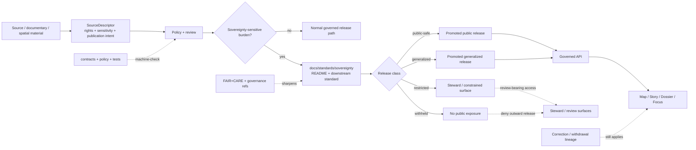

<!-- [KFM_META_BLOCK_V2]
doc_id: kfm://doc/NEEDS-UUID
title: Sovereignty Standards
type: standard
version: v1
status: draft
owners: @bartytime4life (CODEOWNERS fallback; NEEDS VERIFICATION for narrower sovereignty steward)
created: NEEDS-VERIFICATION
updated: NEEDS-VERIFICATION
policy_label: public
related: [docs/standards/README.md, docs/standards/sovereignty/INDIGENOUS-DATA-PROTECTION.md, docs/standards/faircare/FAIRCARE-GUIDE.md, docs/standards/governance/ROOT_GOVERNANCE.md, policy/README.md, contracts/README.md, schemas/README.md, tests/README.md]
tags: [kfm, standards, sovereignty, faircare, sensitivity, publication, stewardship]
notes: [doc_id and dates need repo-confirmed values; owner is current public CODEOWNERS fallback unless a narrower sovereignty steward is verified; this README is the lane boundary and routing surface, not the substantive downstream standard]
[/KFM_META_BLOCK_V2] -->

<a id="top"></a>

# Sovereignty Standards

Directory README for KFM sovereignty-sensitive standards: this lane keeps protected-knowledge, sovereignty, cultural-sensitivity, and release-visibility rules findable without duplicating the downstream Indigenous data protection standard.

> [!IMPORTANT]
> **Status:** `experimental`  
> **Doc status:** `draft`  
> **Owners:** `@bartytime4life` *(CODEOWNERS fallback; narrower sovereignty steward NEEDS VERIFICATION)*  
> **Path:** `docs/standards/sovereignty/README.md`  
> **Authority level:** directory README / routing standard  
> **Policy label:** `public`  
> **Repo fit:** standards sub-lane under [`../README.md`](../README.md), upstream to [`../../README.md`](../../README.md) and [`../../../README.md`](../../../README.md), downstream to [`./INDIGENOUS-DATA-PROTECTION.md`](./INDIGENOUS-DATA-PROTECTION.md).  
> **Quick jumps:** [Scope](#scope) · [Repo fit](#repo-fit) · [Inputs](#accepted-inputs) · [Exclusions](#exclusions) · [Directory tree](#directory-tree) · [Quickstart](#quickstart) · [Usage](#usage) · [Diagram](#diagram) · [Matrices](#matrices) · [Definition of done](#definition-of-done) · [FAQ](#faq) · [Appendix](#appendix)


> [!NOTE]
> This README defines the **directory seam**: what belongs in `docs/standards/sovereignty/`, what stays elsewhere, and which downstream surfaces must carry machine-checkable or review-bearing enforcement. Substantive Indigenous data protection rules belong in [`INDIGENOUS-DATA-PROTECTION.md`](./INDIGENOUS-DATA-PROTECTION.md).

---

## Scope

`docs/standards/sovereignty/` is the standards lane for cross-cutting KFM rules that determine when ordinary publication or discovery is not enough because sovereignty, protected knowledge, community control, cultural sensitivity, or exact-location exposure changes the release burden.

This lane exists because a source can be useful and still not be public-safe. KFM should make that distinction visible before evidence reaches a map, Story, Dossier, Focus answer, export, catalog entry, or public API response.

### What this README governs

This file governs:

- the lane boundary for sovereignty-sensitive standards;
- routing to the substantive downstream standard;
- review triggers for sovereignty-sensitive changes;
- release-visibility vocabulary such as `public-safe`, `generalized`, `restricted`, `withheld`, and `review-required`;
- cross-links to FAIR+CARE, governance, policy, contracts, schemas, tests, workflow, and release surfaces.

It does **not** govern executable policy logic, data access, exact restricted locations, release approval, or machine-schema authority.

### Truth posture used here

| Label | Meaning in this README |
|---|---|
| `CONFIRMED` | Directly supported by current public repo inspection or repeated KFM doctrine. |
| `INFERRED` | Conservative interpretation drawn from confirmed repo evidence and doctrine. |
| `PROPOSED` | Forward-looking wording or enforcement shape not yet proven as checked-in behavior. |
| `UNKNOWN` | Not directly reverified strongly enough to present as current repo fact. |
| `NEEDS VERIFICATION` | A concrete check is required before the claim can be upgraded. |

[Back to top](#top)

---

## Repo fit

### Path, role, and neighbors

| Item | Value |
|---|---|
| This file | `docs/standards/sovereignty/README.md` |
| Path status | `CONFIRMED` on public `main`; mounted-checkout parity still `NEEDS VERIFICATION` before merge |
| Role | Directory index and routing surface for sovereignty-sensitive standards under `docs/standards/` |
| Upstream | [`../README.md`](../README.md) · [`../../README.md`](../../README.md) · [`../../../README.md`](../../../README.md) |
| Downstream standard | [`./INDIGENOUS-DATA-PROTECTION.md`](./INDIGENOUS-DATA-PROTECTION.md) |
| Adjacent standards | [`../faircare/FAIRCARE-GUIDE.md`](../faircare/FAIRCARE-GUIDE.md) · [`../governance/ROOT_GOVERNANCE.md`](../governance/ROOT_GOVERNANCE.md) |
| Machine / proof neighbors | [`../../../policy/README.md`](../../../policy/README.md) · [`../../../contracts/README.md`](../../../contracts/README.md) · [`../../../schemas/README.md`](../../../schemas/README.md) · [`../../../tests/README.md`](../../../tests/README.md) |
| Workflow neighbor | [`../../../.github/workflows/README.md`](../../../.github/workflows/README.md) |
| Ownership signal | [`../../../.github/CODEOWNERS`](../../../.github/CODEOWNERS) fallback; narrower owner `NEEDS VERIFICATION` |

### Why this lane exists

KFM’s sovereignty-sensitive burden appears across multiple lanes, including:

- documentary, archival, and oral-history material;
- archaeology, heritage, sacred-site, and cultural-landscape context;
- biodiversity, habitat, and other exact-location exposure risks;
- AI, Story, Dossier, map, export, and Evidence Drawer surfaces that might reveal or reconstruct protected information;
- any source whose rights, reuse terms, stewardship conditions, or community-control obligations are unresolved.

This README keeps that seam visible at the directory level so contributors do not have to infer sovereignty posture from one downstream filename or one domain-specific warning.

[Back to top](#top)

---

## Accepted inputs

Place a file in this directory only when it defines a shared sovereignty-sensitive rule that multiple KFM lanes can depend on.

| Accepted input | Why it belongs here | Companion surfaces |
|---|---|---|
| Indigenous data protection standards | This is the current downstream standards role for the lane. | [`./INDIGENOUS-DATA-PROTECTION.md`](./INDIGENOUS-DATA-PROTECTION.md) |
| Protected-knowledge handling rules | They apply across archives, heritage, exact-location, and release surfaces. | `policy/**`, `release/**`, `data/proofs/**` |
| Sovereignty-related review triggers | They shape when release must pause, generalize, restrict, withhold, or fail closed. | review records, `PolicyDecision`, release docs |
| Public-safe / generalized / restricted / withheld guidance | The release class is cross-domain even when evidence lives elsewhere. | layer manifests, EvidenceBundle payloads, release manifests |
| Contributor-facing escalation guidance | Maintainers need a stable place to identify when sovereignty burden has entered the flow. | PR templates, runbooks, owner routing |
| Routing guidance to FAIR+CARE, governance, policy, contracts, schemas, tests, and correction surfaces | This lane is a standards seam, not an isolated doctrine island. | adjacent READMEs and ADRs |

> [!TIP]
> Use this README for **lane scope and routing**. Use [`INDIGENOUS-DATA-PROTECTION.md`](./INDIGENOUS-DATA-PROTECTION.md) for substantive rule text. Use `policy/`, `contracts/`, `schemas/`, and `tests/` for enforceable behavior.

[Back to top](#top)

---

## Exclusions

This directory should stay normative, cross-cutting, and reviewable. It must not become a catch-all for policy code, domain notes, or restricted details.

| Do not put this here | Put it here instead | Why |
|---|---|---|
| Rego bundles, policy tests, or executable decision logic | [`../../../policy/`](../../../policy/) | Workflows may run policy checks; standards prose does not define executable allow/deny logic. |
| JSON Schema, OpenAPI, or machine contract shapes | [`../../../contracts/`](../../../contracts/) and [`../../../schemas/`](../../../schemas/) | Prevents machine-contract drift and duplicate schema authority. |
| Source-specific receipts, manifests, proofs, or release artifacts | `data/**`, `release/**`, or repo-confirmed emitted-artifact homes | Lifecycle artifacts belong in proof/release surfaces, not standards prose. |
| Domain-only notes about one archive, site, habitat, source, basin, or story | owning domain doc or runbook | Domain notes should not become cross-cutting standards by accident. |
| Exact site coordinates, “how to locate” instructions, or sensitive examples | nowhere public; route through governed review and public-safe artifact handling | The README itself must not create exposure risk. |
| Exploratory essays, literature notes, or unreviewed “New Ideas” text | `docs/intake/**` or `docs/archive/**` once verified | Exploratory material must not become accidental law. |
| Runtime UI code, export logic, service behavior, or model adapters | owning `apps/` or `packages/` surfaces | Runtime behavior must remain testable and repo-native. |
| Enforcement claims without proof | verification backlog, ADR, or platform-state notes | Avoids upgrading aspiration into implementation fact. |

> [!WARNING]
> Do not use this README to smuggle in sensitive examples at a fidelity that the downstream standard, policy layer, or release review would deny. If an example needs protection, generalize it, abstract it, or omit it.

[Back to top](#top)

---

## Directory tree

Expected lane shape:

```text
docs/standards/sovereignty/
├── README.md
│   # directory README and lane boundary
└── INDIGENOUS-DATA-PROTECTION.md
    # downstream substantive standard
```

> [!CAUTION]
> Do not create a second sovereignty standard elsewhere unless the lane genuinely splits and the upstream standards index is updated intentionally.

[Back to top](#top)

---

## Quickstart

### Verify the lane before editing

Run from the repository root:

```bash
# Inspect the sovereignty lane and immediate standards neighbors.
find docs/standards/sovereignty -maxdepth 2 -type f 2>/dev/null | sort
find docs/standards/sovereignty -maxdepth 2 -type d 2>/dev/null | sort

# Inspect current directory and downstream standard content.
sed -n '1,260p' docs/standards/sovereignty/README.md
sed -n '1,260p' docs/standards/sovereignty/INDIGENOUS-DATA-PROTECTION.md

# Inspect upstream routing and adjacent governance surfaces.
grep -RIn "sovereignty\|Indigenous\|protected knowledge\|generalized\|restricted\|withheld" docs/standards policy contracts schemas tests .github 2>/dev/null | sed -n '1,200p'

# Verify ownership and workflow-adjacent context.
sed -n '1,220p' .github/CODEOWNERS 2>/dev/null
sed -n '1,240p' .github/workflows/README.md 2>/dev/null
```

### Revise sovereignty content safely

1. Confirm the change is cross-cutting rather than domain-only.
2. Choose the right home:
   - this README for lane scope, routing, and review boundary;
   - [`./INDIGENOUS-DATA-PROTECTION.md`](./INDIGENOUS-DATA-PROTECTION.md) for substantive sovereignty-standard content;
   - policy / contracts / schemas / tests for machine-checkable enforcement.
3. Link the change to governing neighbors:
   - [`../README.md`](../README.md),
   - [`../faircare/FAIRCARE-GUIDE.md`](../faircare/FAIRCARE-GUIDE.md),
   - [`../governance/ROOT_GOVERNANCE.md`](../governance/ROOT_GOVERNANCE.md),
   - [`../../../policy/README.md`](../../../policy/README.md),
   - and the relevant contract / schema / test surfaces.
4. Keep examples generalized when specificity could increase exposure risk.
5. Update the upstream standards index if routing or downstream expectations change.

[Back to top](#top)

---

## Usage

### For maintainers

Use this README to keep the lane boundary crisp:

- what this directory governs;
- what it must route to;
- what must stay elsewhere;
- which review gates become relevant when sovereignty-sensitive material enters the flow.

Keep it short enough to be a merge-time checklist, but strong enough that sovereignty obligations cannot disappear into vague references.

### For domain stewards

Open this lane when a domain-specific change starts asking questions like:

- Does public release expose or help derive a protected location?
- Does the material carry Indigenous, archival, oral-history, heritage, or community-control burden beyond ordinary attribution?
- Would a map, Story, Dossier, Export, Evidence Drawer, or Focus answer need `generalized`, `restricted`, or `withheld` treatment instead of direct release?
- Is FAIR-style discoverability insufficient without a stronger care / review / sovereignty step?

When the answer is yes, link to the shared standard. Do not copy the rule text into multiple domain READMEs.

### For reviewers

Treat sovereignty-sensitive handling as a **release and trust-surface concern**, not just an intake note. Review should ask whether the burden remains visible through:

- source admission;
- policy evaluation;
- review artifacts;
- release state;
- EvidenceBundle / RuntimeResponseEnvelope surfaces;
- map, Story, export, and Focus boundaries;
- correction or withdrawal if exposure risk is discovered later.

### Current lane rule

At present, this remains a one-standard lane with a directory README:

- this README defines the seam, scope, and review boundary;
- [`./INDIGENOUS-DATA-PROTECTION.md`](./INDIGENOUS-DATA-PROTECTION.md) carries substantive Indigenous data protection rules.

[Back to top](#top)

---

## Diagram



[Back to top](#top)

---

## Matrices

### Sovereignty trigger matrix

| Trigger class | Posture | Why this lane matters | Minimum consequence | Adjacent enforcement surface |
|---|---:|---|---|---|
| Indigenous data or protected knowledge | `CONFIRMED` lane concern | KFM already carries a dedicated Indigenous data protection standard at this path. | Expand the downstream standard in place instead of creating parallel authority. | this directory, policy, review, downstream standard |
| Archives, oral histories, public memory, and heritage material | `CONFIRMED` doctrine pattern | Context, rights, reuse constraints, and culturally sensitive material can out-rank ordinary discoverability. | Route through the downstream standard and make review/generalization needs explicit before release. | policy, review artifacts, release docs, trust surfaces |
| Archaeology, sacred sites, burials, cultural landscapes, or heritage 2.5D/3D context | `CONFIRMED` high-risk class | Visual or spatial fidelity can increase exposure risk. | Keep exact-location and fidelity escalation review-bearing; do not treat higher detail as automatically public-safe. | policy, release, correction, UI trust states |
| Ecology / biodiversity exact-location material | `CONFIRMED` high-risk class | Geoprivacy, generalization, or withholding may be required even when source metadata is public. | Do not expose precise location by default in docs or downstream public surfaces. | policy, data/release handling, public-safe labeling |
| AI, Story, Focus, map, or export surface over protected context | `INFERRED` from KFM trust posture | Synthesis can reveal protected knowledge even when each individual source looks harmless. | Require evidence resolution, policy check, redaction/generalization review, and finite outcome handling. | RuntimeResponseEnvelope, EvidenceBundle, PolicyDecision |
| Source rights, license, or community-control terms unresolved | `CONFIRMED` fail-closed class | Reachability is not admissibility. | Quarantine, restrict, abstain, or withhold until terms are resolved. | SourceDescriptor, policy, review, release |

### Release visibility states

| State | Meaning here | Where it should become visible |
|---|---|---|
| `public-safe` | Cleared for public release at the allowed precision and context. | release artifact, EvidenceBundle-facing docs, trust-visible surface copy |
| `generalized` | Public release allowed only after coarsening, abstraction, masking, or summary treatment. | release notes, map/story labels, review notes, downstream standard |
| `restricted` | Available only on constrained steward or reviewer surfaces. | review artifacts, steward surfaces, decision records |
| `withheld` | Not public-safe; excluded from public-facing surfaces. | steward/review surfaces and policy decisions, not public docs |
| `review-required` | Cannot progress automatically. | draft state, review artifacts, decision envelopes, PR discussion |
| `withdrawn` / `superseded` | Correction lineage remains visible after exposure, replacement, or narrowing. | correction notices, downstream public surfaces, release history |

[Back to top](#top)

---

## Definition of done

A change to this lane is ready to review when all applicable items are true:

- [ ] The file clearly acts as a directory README or shared standard, not both at once.
- [ ] The visible branch snapshot is accurate, or explicitly marked `NEEDS VERIFICATION`.
- [ ] The downstream standard is referenced as the substantive home where appropriate.
- [ ] Relative links resolve to the standards index, FAIR+CARE, governance, policy, contracts, schemas, tests, and workflow surfaces named here.
- [ ] No exact or easily derivable protected-location details are exposed in the prose.
- [ ] Release visibility states stay aligned with `public-safe`, `generalized`, `restricted`, `withheld`, `review-required`, and correction-bearing language.
- [ ] The README does not claim machine enforcement without proof from repo evidence.
- [ ] The `KFM_META_BLOCK_V2` placeholders are verified or intentionally retained with review notes.
- [ ] If sovereignty routing changes, [`../README.md`](../README.md) is updated deliberately so the standards index stays accurate.
- [ ] Any related machine-facing work is routed to `policy/`, `contracts/`, `schemas/`, `tests/`, `data/`, or `release/` rather than embedded in this README.

[Back to top](#top)

---

## FAQ

### Does this README replace `INDIGENOUS-DATA-PROTECTION.md`?

No. This README is the routing and boundary surface. [`INDIGENOUS-DATA-PROTECTION.md`](./INDIGENOUS-DATA-PROTECTION.md) holds the substantive Indigenous data protection standard.

### Does sovereignty here replace FAIR+CARE or policy?

No. FAIR+CARE remains a neighboring standards surface, and policy remains the machine-enforced gate layer. This README keeps the sovereignty-specific normative seam explicit across both.

### Can this README include sensitive examples or exact site locations?

No. If a concrete example would increase exposure risk, generalize it, abstract it, or omit it. The point of the lane is to keep the burden visible, not to violate it in documentation.

### What should happen if a sovereignty-sensitive rule becomes machine-enforced later?

Keep this README as the human-readable lane boundary. Add or update the machine-facing implementation in the correct policy / contract / test lanes, then link that enforcement back here.

### Is this lane only about Indigenous data?

No. The downstream standard is Indigenous-data focused, but the lane boundary is broader: it also catches protected knowledge, cultural sensitivity, exact-location exposure, community-control obligations, and sovereignty-sensitive release states that can affect multiple KFM domains.

[Back to top](#top)

---

## Appendix

### Open verification items

- [ ] Exact `doc_id` UUID for this file.
- [ ] Commit-time `created` and `updated` dates.
- [ ] Whether a narrower CODEOWNERS rule should replace the current `/docs/` fallback.
- [ ] Whether [`../README.md`](../README.md) should route to this README, the downstream standard, or both.
- [ ] Whether [`./INDIGENOUS-DATA-PROTECTION.md`](./INDIGENOUS-DATA-PROTECTION.md) needs a parallel cleanup pass for stale repo-boundary notes.
- [ ] Which machine-facing vocabularies and contracts ultimately own sovereignty-sensitive release classes.
- [ ] Whether current CI verifies this README’s required metadata, links, and no-sensitive-example posture.

### Neighboring files expected to stay aligned

- [`../README.md`](../README.md)
- [`./INDIGENOUS-DATA-PROTECTION.md`](./INDIGENOUS-DATA-PROTECTION.md)
- [`../faircare/FAIRCARE-GUIDE.md`](../faircare/FAIRCARE-GUIDE.md)
- [`../governance/ROOT_GOVERNANCE.md`](../governance/ROOT_GOVERNANCE.md)
- [`../../../policy/README.md`](../../../policy/README.md)
- [`../../../contracts/README.md`](../../../contracts/README.md)
- [`../../../schemas/README.md`](../../../schemas/README.md)
- [`../../../tests/README.md`](../../../tests/README.md)
- [`../../../.github/workflows/README.md`](../../../.github/workflows/README.md)

### Authoring rule for future maintainers

Expand the right file in place.

- Use this README for lane scope, routing, and merge-time review guidance.
- Use the downstream standard for substantive sovereignty rules.
- Use `policy/`, `contracts/`, `schemas/`, and `tests/` for machine-checkable enforcement.
- Prefer an explicit `NEEDS VERIFICATION` note over a confident but unverified claim about enforcement depth, ownership, or current branch state.

[Back to top](#top)
