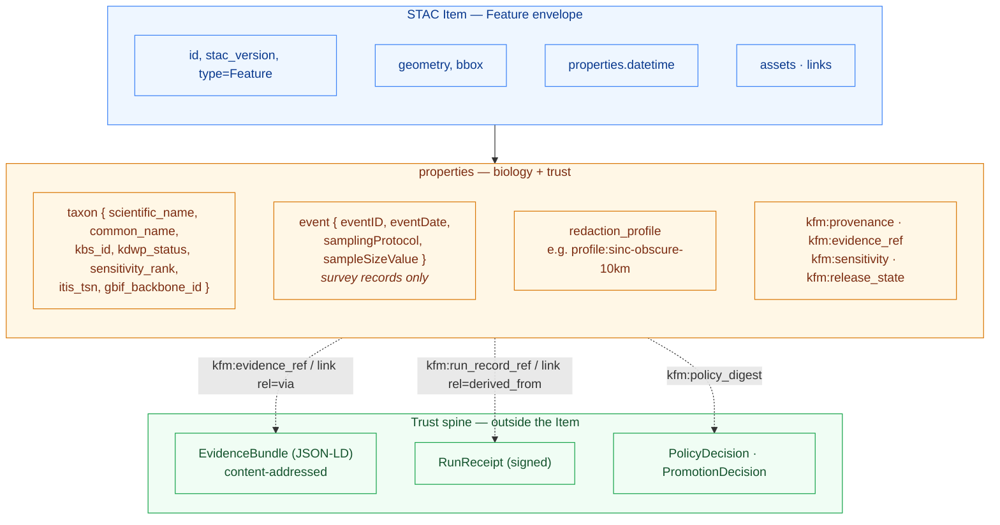

<!-- [KFM_META_BLOCK_V2]
doc_id: kfm://doc/standards/stac-dwc-hybrid
title: STAC × Darwin Core Hybrid Profile (kfm-stac-dwc-v1)
type: standard
version: v1
status: draft
owners: TBD — docs steward + biodiversity-domain steward   # placeholder, update before publish
created: 2026-05-14
updated: 2026-05-14
policy_label: public
related:
  - docs/doctrine/directory-rules.md
  - docs/standards/sensitivity-rubric.md           # PROPOSED, not yet authored
  - docs/standards/redaction-determinism.md        # PROPOSED, not yet authored
  - docs/architecture/contract-schema-policy-split.md
  - schemas/contracts/v1/domains/fauna/            # PROPOSED home
  - schemas/contracts/v1/domains/flora/            # PROPOSED home
tags: [kfm, standards, stac, darwin-core, biodiversity, profile]
notes:
  - Codifies C4-03 (CONFIRMED doctrine) as a named KFM profile.
  - All path-specific claims are PROPOSED until verified against mounted-repo evidence.
  - Profile id kfm-stac-dwc-v1 is PROPOSED; freeze before first release.
[/KFM_META_BLOCK_V2] -->

# STAC × Darwin Core Hybrid Profile (`kfm-stac-dwc-v1`)

> The KFM rule for encoding biodiversity occurrence and event records: **STAC anchors space and time; Darwin Core carries the biology; KFM carries the provenance, sensitivity, and release state.**

<p align="center">
  
  
  
  
  
  
</p>

| Field | Value |
|---|---|
| **Status** | draft |
| **Doctrine authority** | CONFIRMED — pattern recorded in the KFM corpus (C4-03) |
| **Profile id** | `kfm-stac-dwc-v1` *(PROPOSED — freeze on first cut)* |
| **Owners** | TBD — docs steward + biodiversity-domain steward *(placeholder)* |
| **Last reviewed** | `2026-05-14` |

---

## Table of Contents

1. [Purpose & Scope](#1-purpose--scope)
2. [Authority & Status](#2-authority--status)
3. [The Hybrid in One Picture](#3-the-hybrid-in-one-picture)
4. [STAC Envelope Conformance](#4-stac-envelope-conformance)
5. [Darwin Core Inside `properties.taxon`](#5-darwin-core-inside-propertiestaxon)
6. [Event Records & MeasurementOrFact](#6-event-records--measurementorfact)
7. [KFM Provenance Namespace](#7-kfm-provenance-namespace)
8. [Sensitivity, Redaction & Release Posture](#8-sensitivity-redaction--release-posture)
9. [Authority Anchoring (ITIS, GBIF, Wikidata)](#9-authority-anchoring-itis-gbif-wikidata)
10. [Worked Examples](#10-worked-examples)
11. [Validation, Fixtures & CI Posture](#11-validation-fixtures--ci-posture)
12. [Open Questions & NEEDS VERIFICATION](#12-open-questions--needs-verification)
13. [Related Docs](#13-related-docs)

---

## 1. Purpose & Scope

This profile codifies how Kansas Frontier Matrix (KFM) encodes **biodiversity occurrence and survey records** in its catalog. The pattern is a hybrid:

- **STAC** (SpatioTemporal Asset Catalog) supplies the outer envelope — `Feature` geometry, `datetime`, `assets`, and `links` — so any STAC-aware tool can discover and traverse KFM biodiversity records.
- **Darwin Core (DwC)** supplies the biological semantics — taxonomy, occurrence identifiers, event metadata, and measurement facts — placed under a `taxon` object inside `properties` so the STAC envelope stays clean.
- **KFM** supplies the trust layer — `kfm:provenance`, `kfm:evidence_ref`, `kfm:sensitivity`, `kfm:redaction_profile`, release/review state — so every published occurrence is inspectable, policy-aware, and reversible.

> [!IMPORTANT]
> This profile applies to **occurrences and survey events**. Non-biodiversity STAC Items (imagery, rasters, vectors) follow the base KFM STAC profile and do not adopt a `taxon` object. Sensitive species records (KDWP SINC, NatureServe S1/S2, federally listed) **MUST NOT** publish exact coordinates without a named redaction profile.

**Scope (in):** occurrence records (single observations or specimens), Darwin Core Event records (surveys with sampling protocol and effort), MeasurementOrFact rows (counts, detection / non-detection, seasonal status), and the STAC Collections that group them.

**Scope (out):** range polygons, seasonal range models, sensitive-site polygons, and habitat suitability surfaces. Those are separate object families in the Fauna / Flora dossiers and carry their own schema profile.

[↑ Back to top](#table-of-contents)

---

## 2. Authority & Status

| Layer | Status | Notes |
|---|---|---|
| **Doctrine** (the hybrid pattern itself) | **CONFIRMED** | Established in the KFM Pass-10 corpus as C4-03; recorded as a central pattern in C4 (Catalogs & Metadata Profiles). |
| **Profile id** `kfm-stac-dwc-v1` | **PROPOSED** | Name and version slug not yet frozen. |
| **JSON Schema home** `schemas/contracts/v1/domains/fauna/occurrence/...` | **PROPOSED** | Default per ADR-0001 schema-home rule; specific paths require mounted-repo verification. |
| **Fixture set** (good + bad examples) | **PROPOSED** | Required dependency per C4-03; not yet authored. |
| **Canonical vs. DwC-A** | **OPEN** | The corpus does not decide whether the STAC × DwC hybrid or the DwC-A archive is the canonical form. See §12. |

**Conformance language.** This profile uses RFC 2119 style: MUST / MUST NOT are non-negotiable; SHOULD / SHOULD NOT are strong defaults with documented exceptions; MAY is permitted.

**Authority order** (when sources disagree on a placement or field): KFM core invariants → accepted ADRs → this profile → per-root README → domain dossiers → mounted-repo convention. See `docs/doctrine/directory-rules.md` §2.1.

[↑ Back to top](#table-of-contents)

---

## 3. The Hybrid in One Picture



> [!NOTE]
> The diagram reflects the hybrid pattern recorded in C4-03 and the safe EvidenceRef-embedding pattern from the New-Ideas notes. Field-by-field placement against any mounted-repo schema remains **NEEDS VERIFICATION**.

[↑ Back to top](#table-of-contents)

---

## 4. STAC Envelope Conformance

Every KFM biodiversity occurrence is a STAC **Item** with the standard required fields. Nothing in this profile relaxes STAC core.

| STAC field | Requirement | KFM note |
|---|---|---|
| `type` | MUST be `"Feature"` | Items only; Collections use `"Collection"`. |
| `stac_version` | MUST be present | Profile presumes STAC `1.0.0` family. |
| `id` | MUST be stable and deterministic | SHOULD derive from `source id + object role + temporal scope + normalized digest` (Fauna dossier identity rule, **PROPOSED**). |
| `geometry`, `bbox` | MUST be present | Sensitive records publish the **redacted** geometry only; the precise geometry lives in the EvidenceBundle behind the trust membrane. |
| `properties.datetime` | MUST be present | Use observation time; preserve source / observed / valid / retrieval / release / correction times distinctly per the Fauna temporal rule. |
| `assets` | MUST be present where data is offered | Each asset carries `file:checksum` per C4-01. |
| `links` | MUST be present | Use the safe EvidenceRef embedding pattern (§7). |
| `stac_extensions` | MUST list every extension referenced | MUST include the profile schema URL for `kfm-stac-dwc-v1`. |

**Collections.** Occurrence Items SHOULD be grouped into Collections by source family (e.g. `kfm-kdwp-occurrences`, `kfm-gbif-derivatives`, `kfm-knhi-rare-records`). Collection ids are stable handles; renaming a Collection breaks every link that depends on it, which is why the Pass-10 corpus warns against ad-hoc Collection renames.

> [!TIP]
> When a STAC consumer that does not understand `taxon` reads a KFM occurrence Item, it still gets a fully valid STAC Feature with geometry, time, and assets. The hybrid degrades gracefully.

[↑ Back to top](#table-of-contents)

---

## 5. Darwin Core Inside `properties.taxon`

Darwin Core terms live **inside `properties.taxon`**, not at the top level of `properties`. This is the rule that keeps the STAC envelope clean and is the central design decision of C4-03.

### 5.1 Core taxon fields

| Field | Source | Cardinality | Notes |
|---|---|---|---|
| `scientific_name` | DwC `scientificName` | 1 | MUST be a name resolvable against ITIS or GBIF Backbone. |
| `common_name` | DwC `vernacularName` | 0..1 | Locale-aware string SHOULD be tagged. |
| `kbs_id` | KFM-local | 0..1 | Kansas Biological Survey identifier where one exists. |
| `kdwp_status` | KFM-local | 0..1 | KDWP species-in-need-of-conservation status (drives sensitivity). |
| `sensitivity_rank` | KFM-local | **1** | Integer 0–5 per the Sensitivity Rubric (§8). |
| `itis_tsn` | ITIS | 0..1 | **PROPOSED** field name. SHOULD be present when ITIS covers the taxon. |
| `gbif_backbone_id` | GBIF | 0..1 | **PROPOSED** field name. Use when ITIS is silent or stale. |
| `wikidata_qid` | Wikidata | 0..1 | Routing anchor, not a truth source. |

> [!WARNING]
> A taxon record with **no** authoritative anchor (ITIS, GBIF Backbone, or an explicitly documented fallback) MUST NOT promote past CATALOG. This is the C5/C7 anchoring gate. See §9.

### 5.2 Occurrence fields (alongside `taxon`)

Occurrence-level DwC fields that describe **this** observation — rather than the taxon — live elsewhere in `properties`. The profile reserves these names:

| Field | Source | Notes |
|---|---|---|
| `occurrenceID` | DwC | Stable identifier from the originating institution where available. |
| `basisOfRecord` | DwC | e.g. `HumanObservation`, `PreservedSpecimen`, `MachineObservation`. |
| `recordedBy` | DwC | Observer name(s); subject to privacy review for citizen-science feeds. |
| `coordinateUncertaintyInMeters` | DwC | Required when publishing exact coordinates; informs redaction choice. |
| `redaction_profile` | KFM-local | Named profile, e.g. `profile:sinc-obscure-10km` (§8). |
| `evidence` (block) | KFM-local | Inline summary; full bundle resolved via `kfm:evidence_ref`. |

### 5.3 Naming and casing

- DwC field names retain their **canonical DwC casing** (camelCase: `scientificName`, `eventDate`, `samplingProtocol`).
- KFM-local fields use **snake_case** (`scientific_name` as the *taxon-object* alias, `sensitivity_rank`, `redaction_profile`).
- KFM-namespaced top-level keys use **`kfm:`** prefix (`kfm:provenance`, `kfm:evidence_ref`).

> [!CAUTION]
> The corpus uses **both** `scientific_name` (snake_case) inside `properties.taxon` *and* the DwC canonical term `scientificName`. This profile resolves the tension by keeping snake_case for the KFM `taxon` object and surfacing the DwC canonical term in any DwC-A export. The mapping table in §11 makes the equivalence explicit. **NEEDS VERIFICATION** against any mounted-repo schema.

[↑ Back to top](#table-of-contents)

---

## 6. Event Records & MeasurementOrFact

C4-03 explicitly extends the hybrid to **surveys** through Darwin Core Event records and linked MeasurementOrFact rows. A KFM survey Item carries an `event` object inside `properties` alongside (or instead of) a single `taxon`.

### 6.1 The Event object

| Field | Source | Required for surveys |
|---|---|---|
| `eventID` | DwC | yes |
| `eventDate` | DwC (ISO 8601 instant or range) | yes |
| `samplingProtocol` | DwC | yes — names the protocol applied |
| `sampleSizeValue` | DwC | when applicable |
| `sampleSizeUnit` | DwC | with `sampleSizeValue` |
| `samplingEffort` | DwC | strongly recommended for effort-weighted analyses |

> [!NOTE]
> Complete-checklist semantics matter for non-detection inference (eBird-style). When a survey is a **complete** checklist, the profile SHOULD record that fact so downstream consumers can treat unreported taxa as true zeros rather than missing data.

### 6.2 MeasurementOrFact rows

Per-taxon counts, detection / non-detection, seasonal status, and other effort-bound measurements are encoded as **MeasurementOrFact** rows linked to the Event. They MAY appear:

- as a `measurements` array inside `properties.event`, **or**
- as a related STAC Item linked via `rel: "related"`, **or**
- as a separate asset (e.g. JSON or Parquet) referenced from `assets`.

The choice affects payload size and search ergonomics; the profile does not yet mandate one. **OPEN** — see §12.

### 6.3 Detection vs. non-detection

A non-detection row MUST carry the same `eventID` as the detection rows from the same checklist, so that absences are anchored to a known effort context. A bare `count = 0` outside a complete checklist is not a non-detection; it is missing data.

[↑ Back to top](#table-of-contents)

---

## 7. KFM Provenance Namespace

Every KFM biodiversity Item carries the standard `kfm:provenance` block defined in C4-01, **in addition** to the biodiversity-specific fields above.

```jsonc
"properties": {
  "datetime": "2025-06-14T08:13:00Z",

  "kfm:provenance": {
    "spec_hash":            "<sha256-of-canonicalized-evidence-bundle>",
    "evidence_bundle_ref":  "kfm://entity-bundle/<sha256>",
    "run_record_ref":       "kfm://run/<run_id>",
    "audit_ref":            "kfm://audit/<entry_id>",
    "policy_digest":        "<sha256-of-applied-policy-bundle>"
  },

  "kfm:evidence_ref":      "kfm://evidence/<sha256>",
  "kfm:source_role":       "observation",
  "kfm:rights_status":     "controlled",
  "kfm:sensitivity":       "review_required",
  "kfm:redaction_profile": "profile:sinc-obscure-10km",
  "kfm:review_state":      "approved",
  "kfm:release_state":     "released",

  "taxon":  { /* §5 */ },
  "event":  { /* §6 — surveys only */ }
}
```

### 7.1 Safe EvidenceRef embedding

The KFM-namespaced properties survive any STAC client. **In addition**, the EvidenceBundle and RunReceipt SHOULD be reachable through `links` with these `rel` values:

```jsonc
"links": [
  { "rel": "derived_from", "href": "kfm://run/<run_id>",   "type": "application/json", "title": "Run Receipt (signed)" },
  { "rel": "via",          "href": "kfm://bundle/<sha256>", "type": "application/json", "title": "EvidenceBundle" },
  { "rel": "prov",         "href": "kfm://bundle/<sha256>", "type": "application/json" }
]
```

This pattern is intentional: unknown `rel` values are ignored gracefully by compliant STAC clients, namespaced `kfm:*` properties remain legal STAC, and existing APIs continue to index geometry and time normally.

### 7.2 Asset integrity

Each entry under `assets` MUST carry per-asset integrity:

```jsonc
"assets": {
  "occurrence_evidence": {
    "href": "https://cdn.kfm.org/.../evidence.json",
    "type": "application/json",
    "roles": ["data"],
    "file:checksum": "1220<hex-sha256>"
  }
}
```

> [!IMPORTANT]
> The Item itself is a **catalog record**, not the evidence. Treat the Item as a pointer; treat the EvidenceBundle as the admissible artifact. A claim that depends on this occurrence MUST resolve `kfm:evidence_ref` to an EvidenceBundle.

[↑ Back to top](#table-of-contents)

---

## 8. Sensitivity, Redaction & Release Posture

Biodiversity is the domain where KFM's C6 redaction machinery is exercised most heavily. This profile makes the relevant fields **required** on every occurrence Item.

### 8.1 Sensitivity rank (0–5)

| Rank | Class | Default redaction profile | Public exposure |
|---|---|---|---|
| 0 | public / open | `kfm:redact:none` | full geometry |
| 1 | common, non-sensitive | `kfm:redact:none` | full geometry |
| 2 | watchlist | per source steward | restricted detail |
| 3 | SINC / locally sensitive | `profile:sinc-obscure-10km` *(default)* | generalized only |
| 4 | threatened / rare | strict mask **or** embargo | denied or aggregated |
| 5 | sacred / critical | fail-closed | **no** map or timeline exposure |

Ranks 0 and 5 are the fixed endpoints (open vs. fail-closed). Ranks 2–4 map to named redaction profiles whose parameters live in `policy/redaction/profiles.yaml` (PROPOSED path).

### 8.2 Redaction profiles

A redaction profile is **named** (e.g. `profile:sinc-obscure-10km`) and **versioned**. It specifies:

- the strategy (radius mask, hex grid via H3, square grid via `ST_SnapToGrid`, jitter, centroid, DP aggregate),
- the parameters (radius, cell size, epsilon),
- the seeding rule (PRNG seeded by `spec_hash + occurrence_id` for deterministic, reproducible jitter),
- any embargo.

> [!CAUTION]
> Random-each-render jitter is **triangulable**. KFM jitter MUST be deterministic and reproducible from the receipt. The `redaction_profile` field is the audit handle that lets a reviewer reproduce the redacted geometry from the seed inputs.

### 8.3 Deny-by-default register interactions

Per the Encyclopedia's Sensitive / Deny-by-Default Register, the following biodiversity classes are DENY by default for public exact location: **rare species** (exact occurrence / nest / den / roost / spawning sites) and **archaeological** correlates of biological sites. A public Item MUST carry a generalized geometry — never the raw point — for any record at rank ≥ 3.

[↑ Back to top](#table-of-contents)

---

## 9. Authority Anchoring (ITIS, GBIF, Wikidata)

The C7 anchoring rule applies in full to biodiversity records:

- **ITIS TSN** is the U.S.-canonical taxonomic authority and the **required** anchor for any species-level record where ITIS has coverage.
- **GBIF Backbone Taxonomy** (DOI `10.15468/39omei`, version-pinned) is the international crosswalk and the second-line authority when ITIS is silent or stale.
- **Wikidata QID** is a routing anchor, not a truth source — store it alongside the upstream IRI when one exists.

Records lacking both ITIS TSN and a GBIF Backbone match MUST NOT promote past CATALOG without an explicit, documented fallback authority. The promotion gate fails closed; an absent anchor is treated as missing evidence, not as a soft warning.

> [!NOTE]
> When ITIS and GBIF disagree on the accepted name, the corpus suggests defaulting to ITIS for federal-data reconciliation and to GBIF for international biodiversity queries — but the tie-breaker is **not yet codified in policy**. This profile records the conflict; it does not resolve it. See §12.

[↑ Back to top](#table-of-contents)

---

## 10. Worked Examples

<details>
<summary><b>Example A — Public, non-sensitive occurrence (rank 0)</b></summary>

A bird sighting from a citizen-science feed with no sensitivity concerns.

```json
{
  "type": "Feature",
  "stac_version": "1.0.0",
  "stac_extensions": [
    "https://stac-extensions.github.io/checksum/v1.0.0/schema.json",
    "https://kfm.org/stac/kfm-stac-dwc-v1/schema.json"
  ],
  "id": "kfm-occ-ebird-2025-04-12-001234",
  "geometry": { "type": "Point", "coordinates": [-98.57, 38.91] },
  "bbox": [-98.57, 38.91, -98.57, 38.91],
  "properties": {
    "datetime": "2025-04-12T07:42:00Z",
    "taxon": {
      "scientific_name": "Spizella passerina",
      "common_name": "Chipping Sparrow",
      "sensitivity_rank": 0,
      "itis_tsn": "179361",
      "gbif_backbone_id": "2491407"
    },
    "occurrenceID": "URN:catalog:CLO:EBIRD:OBS123456",
    "basisOfRecord": "HumanObservation",
    "coordinateUncertaintyInMeters": 25,
    "kfm:provenance": {
      "spec_hash": "<sha256>",
      "evidence_bundle_ref": "kfm://entity-bundle/<sha256>",
      "run_record_ref": "kfm://run/<run_id>",
      "audit_ref": "kfm://audit/<entry>",
      "policy_digest": "<sha256>"
    },
    "kfm:evidence_ref": "kfm://evidence/<sha256>",
    "kfm:source_role": "observation",
    "kfm:rights_status": "attribution-required",
    "kfm:sensitivity": "public",
    "kfm:redaction_profile": "kfm:redact:none",
    "kfm:review_state": "approved",
    "kfm:release_state": "released"
  },
  "assets": {
    "evidence": {
      "href": "https://cdn.kfm.org/.../evidence.json",
      "type": "application/json",
      "roles": ["data"],
      "file:checksum": "1220<hex-sha256>"
    }
  },
  "links": [
    { "rel": "collection",   "href": "../collection.json" },
    { "rel": "derived_from", "href": "kfm://run/<run_id>",   "type": "application/json" },
    { "rel": "via",          "href": "kfm://bundle/<sha256>","type": "application/json" }
  ]
}
```

</details>

<details>
<summary><b>Example B — Sensitive species (rank 3, SINC) with redacted geometry</b></summary>

A KDWP species-in-need-of-conservation occurrence. The **published** geometry is the redacted hex centroid; the **exact** geometry lives only in the EvidenceBundle behind the trust membrane and is not part of the public Item.

```json
{
  "type": "Feature",
  "stac_version": "1.0.0",
  "stac_extensions": [
    "https://stac-extensions.github.io/checksum/v1.0.0/schema.json",
    "https://kfm.org/stac/kfm-stac-dwc-v1/schema.json"
  ],
  "id": "kfm-occ-kdwp-2025-08-03-000042",
  "geometry": { "type": "Point", "coordinates": [-98.50, 38.90] },
  "bbox": [-98.55, 38.85, -98.45, 38.95],
  "properties": {
    "datetime": "2025-08-03T00:00:00Z",
    "taxon": {
      "scientific_name": "<redacted-or-generalized>",
      "common_name": "<redacted-or-generalized>",
      "kdwp_status": "SINC",
      "sensitivity_rank": 3,
      "itis_tsn": "<tsn>"
    },
    "occurrenceID": "kfm:occ:kdwp:2025-08-03:000042",
    "basisOfRecord": "HumanObservation",
    "redaction_profile": "profile:sinc-obscure-10km@v1",
    "kfm:provenance":        { "spec_hash": "<sha256>", "evidence_bundle_ref": "kfm://entity-bundle/<sha256>", "run_record_ref": "kfm://run/<run_id>", "audit_ref": "kfm://audit/<entry>", "policy_digest": "<sha256>" },
    "kfm:evidence_ref":      "kfm://evidence/<sha256>",
    "kfm:source_role":       "authority",
    "kfm:rights_status":     "controlled",
    "kfm:sensitivity":       "restricted-public-generalized",
    "kfm:redaction_profile": "profile:sinc-obscure-10km@v1",
    "kfm:review_state":      "approved",
    "kfm:release_state":     "released"
  },
  "assets": {
    "public_summary": {
      "href":  "https://cdn.kfm.org/.../summary.json",
      "type":  "application/json",
      "roles": ["data"],
      "file:checksum": "1220<hex-sha256>"
    }
  },
  "links": [
    { "rel": "collection",   "href": "../collection.json" },
    { "rel": "derived_from", "href": "kfm://run/<run_id>",    "type": "application/json" },
    { "rel": "via",          "href": "kfm://bundle/<sha256>", "type": "application/json" }
  ]
}
```

Notes on this example: the **exact** geometry, the **un-redacted** taxon name, and any precise breeding-site context live in the EvidenceBundle and are not published. The redaction profile name and version (`@v1`) are both required so that the transform can be replayed from the receipt.

</details>

<details>
<summary><b>Example C — Darwin Core Event (survey with effort + MoF rows)</b></summary>

A breeding-bird survey route encoded as an Event with linked MeasurementOrFact rows.

```json
{
  "type": "Feature",
  "stac_version": "1.0.0",
  "stac_extensions": ["https://kfm.org/stac/kfm-stac-dwc-v1/schema.json"],
  "id": "kfm-survey-bbs-2025-route-12-stop-03",
  "geometry": { "type": "Point", "coordinates": [-98.62, 38.88] },
  "bbox": [-98.62, 38.88, -98.62, 38.88],
  "properties": {
    "datetime": "2025-06-04T06:15:00/2025-06-04T06:18:00",
    "event": {
      "eventID": "BBS:KS:R12:S03:2025",
      "eventDate": "2025-06-04",
      "samplingProtocol": "BBS 3-minute point count",
      "sampleSizeValue": 3,
      "sampleSizeUnit": "minutes",
      "samplingEffort": "1 observer; 50m unlimited-radius point count",
      "complete_checklist": true,
      "measurements": [
        { "taxon": "Spizella passerina", "count": 2, "detected": true,  "itis_tsn": "179361" },
        { "taxon": "Sturnella neglecta", "count": 5, "detected": true,  "itis_tsn": "179060" },
        { "taxon": "Tyrannus tyrannus",  "count": 0, "detected": false, "itis_tsn": "178311" }
      ]
    },
    "kfm:provenance":   { "spec_hash": "<sha256>", "evidence_bundle_ref": "kfm://entity-bundle/<sha256>", "run_record_ref": "kfm://run/<run_id>", "audit_ref": "kfm://audit/<entry>", "policy_digest": "<sha256>" },
    "kfm:evidence_ref": "kfm://evidence/<sha256>",
    "kfm:source_role":  "observation",
    "kfm:sensitivity":  "public",
    "kfm:release_state":"released"
  },
  "links": [
    { "rel": "collection", "href": "../collection.json" },
    { "rel": "via",        "href": "kfm://bundle/<sha256>", "type": "application/json" }
  ]
}
```

</details>

[↑ Back to top](#table-of-contents)

---

## 11. Validation, Fixtures & CI Posture

The hybrid is enforceable. Doctrine without enforcement is decoration.

### 11.1 Validation gates

| Gate | What it checks | Failure mode |
|---|---|---|
| STAC core | Item validates against the STAC 1.0 schema referenced by `stac_version` | reject |
| Profile schema | Item validates against `kfm-stac-dwc-v1` JSON Schema | reject |
| Authority anchoring | `taxon.itis_tsn` **or** `taxon.gbif_backbone_id` present (or documented fallback) | reject promotion |
| Sensitivity rank | `taxon.sensitivity_rank` ∈ {0..5} present | reject |
| Redaction parity | rank ≥ 3 ⇒ `redaction_profile` set to a non-`none` named profile | reject promotion |
| EvidenceRef resolution | `kfm:evidence_ref` resolves to a valid EvidenceBundle whose `spec_hash` recomputes | reject promotion |
| Asset integrity | every asset has `file:checksum`; recomputed hash matches | reject |
| Link sanity | `derived_from` resolves to a signed RunReceipt; `via` resolves to the EvidenceBundle | warn → reject (per release tier) |
| Public path discipline | published Items never reference RAW / WORK / QUARANTINE asset URIs | reject |

> [!IMPORTANT]
> Per the KFM lifecycle invariant, **promotion is a governed state transition, not a file move.** A failing gate keeps the Item at CATALOG; it never silently advances to PUBLISHED. This is non-negotiable.

### 11.2 Fixture set (PROPOSED)

The corpus names a fixture set as a prerequisite for C4-03. **PROPOSED** locations:

- `tests/fixtures/profiles/stac-dwc-hybrid/valid/`
- `tests/fixtures/profiles/stac-dwc-hybrid/invalid/`
- minimum coverage: one valid case per sensitivity rank, plus invalid cases for each gate above.

Specific paths are **PROPOSED** until verified against mounted-repo evidence.

### 11.3 KFM ↔ DwC field mapping

For DwC-A export and ingest, the canonical mapping is:

| KFM `taxon.*` (snake_case) | Darwin Core (camelCase) | Notes |
|---|---|---|
| `scientific_name` | `scientificName` | round-trip MUST be byte-identical after canonicalization |
| `common_name` | `vernacularName` | locale tag preserved |
| `itis_tsn` | `taxonID` (`urn:lsid:itis.gov:itis_tsn:<n>`) | LSID form when exported |
| `gbif_backbone_id` | `taxonID` (`gbif:<n>`) | use when `itis_tsn` is absent |
| `kdwp_status` | DwC ext: `conservationStatus` | KFM-local rank also retained |
| (sibling) `occurrenceID` | `occurrenceID` | identical |
| (sibling) `basisOfRecord` | `basisOfRecord` | identical |
| (sibling) `coordinateUncertaintyInMeters` | `coordinateUncertaintyInMeters` | identical |

[↑ Back to top](#table-of-contents)

---

## 12. Open Questions & NEEDS VERIFICATION

| # | Item | Status |
|---|---|---|
| Q1 | Is the **canonical** KFM occurrence record the STAC × DwC hybrid or the DwC-A archive? They MUST agree byte-for-byte after canonicalization. | OPEN |
| Q2 | Where do **MeasurementOrFact** rows live — embedded in `properties.event.measurements`, as a related Item, or as a separate asset? | OPEN |
| Q3 | Tie-breaker policy when ITIS and GBIF Backbone disagree on accepted name. Default suggested: ITIS for federal reconciliation, GBIF for international queries. | OPEN |
| Q4 | Cell size defaults per sensitivity rank — does the SINC default `10 km` hold across counties, or vary by density? | OPEN |
| Q5 | Should profile versions be major-only (breaking) or include patch (documentation-only fixes)? | OPEN |
| Q6 | Should `kfm-stac-dwc-v1` be registered in the official STAC Extensions registry? | OPEN |
| V1 | Mounted-repo presence of `schemas/contracts/v1/domains/fauna/occurrence/...` | NEEDS VERIFICATION |
| V2 | Mounted-repo presence of `policy/redaction/profiles.yaml` and the SINC profile entry | NEEDS VERIFICATION |
| V3 | Whether snake_case `scientific_name` inside `taxon` is the chosen form, or whether the canonical DwC `scientificName` is used inline | NEEDS VERIFICATION |
| V4 | Whether the existing repo has a competing profile filename (`STAC_DWC_PROFILE.md` is named in the corpus expansion directions) and how it relates to `stac-dwc-hybrid.md` | NEEDS VERIFICATION |
| V5 | Whether eBird-derived occurrences require an additional release-class gate per the EBD restricted-use terms | NEEDS VERIFICATION |

[↑ Back to top](#table-of-contents)

---

## 13. Related Docs

- [`docs/doctrine/directory-rules.md`](../doctrine/directory-rules.md) — placement law; this profile lives under `docs/standards/` per §6.1.
- [`docs/architecture/contract-schema-policy-split.md`](../architecture/contract-schema-policy-split.md) — `contracts/` defines meaning; `schemas/` defines shape; `policy/` decides admissibility.
- `docs/standards/sensitivity-rubric.md` — the 0–5 rubric (**PROPOSED**, not yet authored).
- `docs/standards/redaction-determinism.md` — seed concatenation rules and deterministic jitter (**PROPOSED**).
- `docs/standards/kfm-stac-profile.md` — base KFM STAC profile (**PROPOSED**, parent profile).
- `docs/domains/fauna/README.md` — Fauna domain dossier (occurrence object families).
- `docs/domains/flora/README.md` — Flora domain dossier (specimen / herbarium occurrences).
- `docs/runbooks/revocation.md` — tombstones and revocation propagation (**PROPOSED**).

---

<sub>Profile id: `kfm-stac-dwc-v1` (PROPOSED) · Doctrine: CONFIRMED (C4-03) · Implementation: PROPOSED · Last reviewed: 2026-05-14</sub>

<sub>[↑ Back to top](#table-of-contents)</sub>
