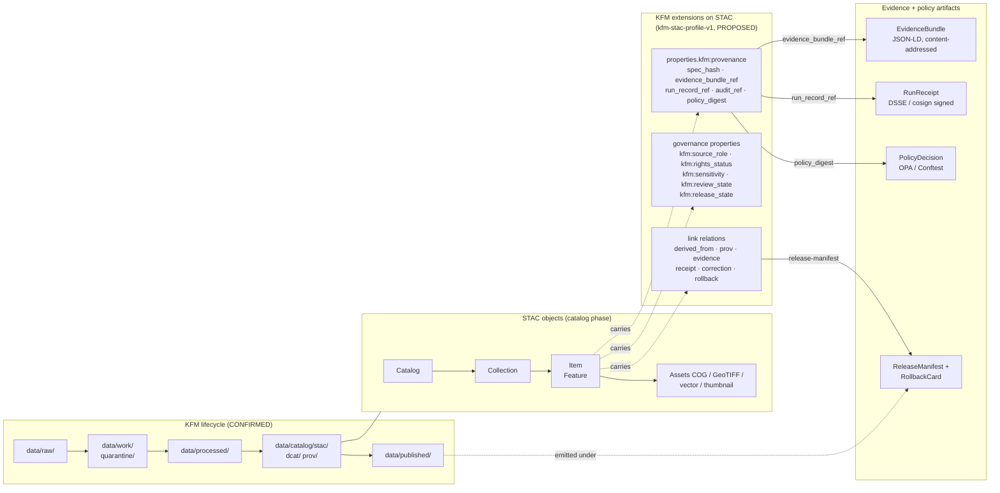
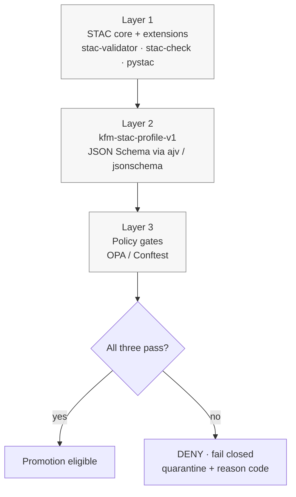

<!-- [KFM_META_BLOCK_V2]
doc_id: kfm://doc/00000000-0000-0000-0000-000000000000   # PLACEHOLDER — mint at first PR
title: STAC in KFM — Standard Conformance and `kfm-stac-profile-v1`
type: standard
version: v1
status: draft
owners: Docs steward + Catalog/Standards subsystem owner   # PLACEHOLDER — confirm at PR
created: 2026-05-14
updated: 2026-05-14
policy_label: public
related:
  - docs/standards/dcat.md            # PROPOSED — companion doc
  - docs/standards/prov.md            # PROPOSED — companion doc
  - docs/standards/canonicalization.md # PROPOSED — companion doc (JCS vs URDNA2015)
  - docs/doctrine/directory-rules.md  # CONFIRMED — placement authority
  - docs/doctrine/truth-posture.md    # CONFIRMED — cite-or-abstain
  - docs/doctrine/lifecycle-law.md    # CONFIRMED — RAW → … → PUBLISHED
  - schemas/contracts/v1/stac/        # PROPOSED — profile schema home (ADR-0001 default)
  - policy/stac/                      # PROPOSED — OPA bundle for STAC publication
tags: [kfm, stac, catalog, standards, profile, governance]
notes:
  - "Doctrine is CONFIRMED from Pass 10 §6.4 and Master MapLibre v1.8. Repo paths are PROPOSED until verified against a mounted repo."
  - "Namespace choice (kfm: vs ks-kfm:) is an open question carried from C4-01 — see §3.2."
[/KFM_META_BLOCK_V2] -->

# STAC in KFM — Standard Conformance and `kfm-stac-profile-v1`

> **STAC is the interoperable discovery envelope. The EvidenceBundle is the reconstructable truth object. Policy decides publication admissibility. Release state governs exposure. Corrections never erase lineage.**


**Status:** draft · **Owners:** Docs steward + Catalog/Standards subsystem owner *(PLACEHOLDER — confirm)* · **Updated:** 2026-05-14

> [!IMPORTANT]
> All **repo-shaped claims** in this document (paths, schema files, validator commands, workflow names, branch protections) are **PROPOSED** until verified against a mounted repository. KFM **doctrine** (the requirement to bind STAC records to EvidenceBundles, the lifecycle invariant, the cite-or-abstain posture, the catalog–proof–release separation) is **CONFIRMED** from the attached governing documents.

---

## 0. Status & Authority

| Field | Value |
|---|---|
| **Document type** | Standard conformance doc (external standard → KFM profile) |
| **Authority of doctrine here** | CONFIRMED — sourced from Pass 10 §6.4 (C4-01..C4-05), Master MapLibre v1.8 (ML-062-030..034, ML-063-007), and `directory-rules.md` §6.1 |
| **Authority of any specific path / file / command quoted** | PROPOSED until verified against the mounted repo |
| **Proposed canonical home** | `docs/standards/stac.md` *(this file)* — per `directory-rules.md` §6.1 |
| **Companion deliverables (PROPOSED)** | `schemas/contracts/v1/stac/kfm-stac-profile-v1.schema.json`, `policy/stac/publication.rego`, `docs/standards/STAC_KFM_PROFILE.md` (deep profile) |
| **Profile identifier (PROPOSED)** | `kfm-stac-profile-v1` |
| **External standard** | OGC STAC 1.0.0 — Catalog / Collection / Item — *(EXT-STAC, EXTERNALLY CHECKED per KFM Encyclopedia source ledger)* |
| **Lifecycle invariant** | RAW → WORK / QUARANTINE → PROCESSED → **CATALOG** / TRIPLET → PUBLISHED — STAC records live in `data/catalog/stac/` *(PROPOSED placement per `directory-rules.md` §9.1)* |
| **Open ADR-class questions** | Namespace decision (`kfm:` vs `ks-kfm:`); JCS vs URDNA2015 default for graph-shaped STAC payloads — see §13 |
| **Supersedes** | None (new) — operationalizes the `STAC_KFM_PROFILE.md` direction proposed in Pass 10 C4-01 |

---

## Contents

- [1. Purpose](#1-purpose)
- [2. STAC in one diagram](#2-stac-in-one-diagram)
- [3. Authority and source hierarchy](#3-authority-and-source-hierarchy)
- [4. STAC core in KFM (Catalog / Collection / Item)](#4-stac-core-in-kfm)
- [5. The `kfm-stac-profile-v1` profile](#5-the-kfm-stac-profile-v1-profile)
- [6. Assets and integrity](#6-assets-and-integrity)
- [7. Link relations](#7-link-relations)
- [8. STAC × Darwin Core hybrid (biodiversity)](#8-stac--darwin-core-hybrid)
- [9. EvidenceBundle binding](#9-evidencebundle-binding)
- [10. Canonicalization and `spec_hash`](#10-canonicalization-and-spec_hash)
- [11. Validation — three layers](#11-validation--three-layers)
- [12. CI gates and fail-closed posture](#12-ci-gates-and-fail-closed-posture)
- [13. Anti-patterns](#13-anti-patterns)
- [14. Open questions and `NEEDS VERIFICATION`](#14-open-questions-and-needs-verification)
- [15. Related docs](#15-related-docs)
- [Appendix A — Worked Item sketch](#appendix-a--worked-item-sketch-illustrative)
- [Appendix B — Worked Collection sketch](#appendix-b--worked-collection-sketch-illustrative)

---

## 1. Purpose

This document is the **canonical reference** for how the Kansas Frontier Matrix conforms to the **SpatioTemporal Asset Catalog (STAC)** specification and what KFM requires *above and beyond* base STAC to make catalog records governance-bearing, evidence-bearing, and publication-safe.

It does three things:

1. **Locates STAC** inside KFM's lifecycle (the catalog layer between `processed/` and `published/`).
2. **Defines the `kfm-stac-profile-v1` namespace and profile** — the minimum KFM-specific fields and link relations that every STAC Item or Collection must carry to be promotable.
3. **Specifies the three-layer validation stack** (STAC core → KFM profile schema → policy gates) and the CI posture that enforces it fail-closed.

This document does **not**:

- Re-derive the STAC core specification (`stac_version: 1.0.0` is authoritative; see [stacspec.org](https://stacspec.org)).
- Define DCAT, PROV-O, or Darwin Core in detail — those live in their own `docs/standards/` files *(PROPOSED)*.
- Define the EvidenceBundle JSON-LD shape — see `contracts/evidence/` *(PROPOSED home per `directory-rules.md` §6.3)*.

> [!NOTE]
> **Golden rule (CONFIRMED doctrine):**
> *STAC is the interoperable discovery envelope. The EvidenceBundle is the reconstructable truth object. Policy decides publication admissibility. Release state governs exposure. Corrections never erase lineage.*

---

## 2. STAC in one diagram

The diagram below shows the **CONFIRMED** binding between STAC objects, the lifecycle phases they live in, and the KFM evidence/policy artifacts they must resolve to. It is a responsibility diagram, not a deployment diagram.



> [!NOTE]
> The lifecycle invariant **RAW → WORK / QUARANTINE → PROCESSED → CATALOG / TRIPLET → PUBLISHED** is CONFIRMED doctrine (`directory-rules.md` §0, §9.1). Promotion is a **governed state transition, not a file move**.

---

## 3. Authority and source hierarchy

### 3.1 What governs what

| Layer | Authority | Applies to |
|---|---|---|
| **External standard** | OGC STAC 1.0.0 specification | `type`, `stac_version`, `id`, `geometry`, `bbox`, `properties.datetime`, `assets`, `links`, `stac_extensions` — the STAC core fields. *(EXTERNAL — see [stacspec.org](https://stacspec.org).)* |
| **Official STAC extensions** | `projection`, `eo`, `raster`, `processing`, `checksum`, `version` — at versions pinned in `kfm-stac-profile-v1` | Imagery, raster, lineage, integrity fields. *(EXTERNAL — see [stac-extensions.github.io](https://stac-extensions.github.io/).)* |
| **`kfm-stac-profile-v1`** (this document + its companion schema, PROPOSED) | KFM doctrine | The `kfm:provenance` block, governance posture properties, KFM-specific link relations, enum vocabularies, the required-fields list. |
| **`policy/stac/*.rego`** *(PROPOSED home)* | OPA / Conftest | Publication admissibility: rights, sensitivity, review state, release state, signed receipt presence, spec-hash match. |
| **`contracts/` and `schemas/`** *(per `directory-rules.md` §6.3–§6.4)* | Object meaning and shape | What `EvidenceRef`, `EvidenceBundle`, `RunReceipt`, `ReleaseManifest`, `RollbackCard` resolve to. |

> [!WARNING]
> **Do not extend STAC by inventing free-form top-level fields.** Custom fields must be either (a) inside an accepted official STAC extension, or (b) prefixed with the KFM namespace (`kfm:*`) and declared via `stac_extensions` to the profile schema URL. Bare custom top-level fields can be dropped silently by validators and downstream clients.

### 3.2 Namespace decision — `kfm:` vs `ks-kfm:` *(OPEN — ADR-class)*

The Pass 10 dossier (C4-01) flags this as an **unsettled** choice:

- `kfm:` — short, KFM-global, aligns with conventional STAC extension namespaces.
- `ks-kfm:` — Kansas-scoped, more namespace-collision-safe.

**Current working choice (PROPOSED):** `kfm:`. Rationale: compact, stable, and consistent with the New Ideas 5-8-26 namespace primer and existing Pass 10 examples.

> [!CAUTION]
> **NEEDS VERIFICATION + ADR.** The namespace choice is **ADR-class** under `directory-rules.md` §2.4 (it affects schema, contract, and policy homes). Treat `kfm:` as **PROPOSED** until an accepted ADR pins it. Until then, all examples in this document use `kfm:` consistently to avoid drift, but a future ADR may rename uniformly.

[↑ Back to top](#contents)

---

## 4. STAC core in KFM

### 4.1 Required STAC core fields *(EXTERNAL — from STAC 1.0.0 spec)*

These are the fields **every** STAC object must carry. They are not optional and they are not negotiable.

| Object | Required core fields | KFM relevance |
|---|---|---|
| **Catalog** | `type` (`Catalog`), `id`, `stac_version`, `description`, `links` | Top-level discovery surface. |
| **Collection** | All Catalog fields + `extent` (spatial + temporal), `license`, `summaries` (where applicable) | Stable handle for an asset family. Renaming breaks every Item link. |
| **Item** | `type` (`Feature`), `id`, `stac_version`, `geometry`, `bbox`, `properties.datetime` (or `start_datetime` + `end_datetime`), `assets`, `links` | Atomic spatiotemporal asset. The unit at which KFM provenance attaches. |

### 4.2 STAC extensions pinned by KFM *(PROPOSED versions — verify at profile-schema PR)*

| Extension | Purpose | KFM use |
|---|---|---|
| `projection` | CRS, transform, shape | Required for all raster Items. |
| `eo` | Bands, cloud cover | Required for optical-EO Items (Landsat, Sentinel, HLS). |
| `raster` | Band statistics, sampling | Required for COG-backed Items. |
| `processing` | `processing:facility`, `processing:version`, `processing:lineage` | Encodes pipeline lineage. Use `derived_from` links alongside. |
| `checksum` | `checksum:multihash` per asset | Required — per-asset integrity. |
| `version` | Item / Collection version, supersession | Required for any record that may be corrected or rolled back. |
| `kfm-stac-profile-v1` *(PROPOSED, KFM-local)* | `kfm:provenance` block + governance properties | This document. |

[↑ Back to top](#contents)

---

## 5. The `kfm-stac-profile-v1` profile

### 5.1 What the profile adds

Two groups of fields:

1. **The `kfm:provenance` nested block** *(CONFIRMED from Pass 10 C4-01)* — identity, integrity, and audit linkage.
2. **Flat `kfm:*` governance posture properties** *(PROPOSED pattern from New Ideas 5-8-26)* — source role, rights, sensitivity, review state, release state.

> [!NOTE]
> **Tension to resolve:** the corpus shows both a *nested* `kfm:provenance` block (C4-01) and *flat* properties like `kfm:spec_hash`, `kfm:evidence_ref` (New Ideas primer). The profile **MUST NOT** carry the same field in both shapes. `kfm-stac-profile-v1` resolves this by keeping identity/integrity/audit fields **inside** `kfm:provenance` and keeping governance-posture fields **flat** on `properties`. The schema (PROPOSED at `schemas/contracts/v1/stac/kfm-stac-profile-v1.schema.json`) MUST enforce this split.

### 5.2 The `kfm:provenance` block (Item-level, REQUIRED) — CONFIRMED

Every Item carries `properties["kfm:provenance"]` with the following fields:

| Field | Type | Source | Notes |
|---|---|---|---|
| `spec_hash` | string `jcs:sha256:<hex>` | C1-02 (CONFIRMED) | Canonical hash of the Item's identity-bearing fields. See §10. |
| `evidence_bundle_ref` | URI (`kfm://bundle/<sha256>`, `oci://…`, or `ipfs://…`) | C4-04 (CONFIRMED) | Resolves to a content-addressed EvidenceBundle. |
| `run_record_ref` | URI | C1-01 (CONFIRMED) | Resolves to the universal RunReceipt that produced this Item. |
| `audit_ref` | URI | C4-01 (CONFIRMED) | Resolves to SLSA / cosign attestation set. |
| `policy_digest` | string `sha256:<hex>` | C4-01 (CONFIRMED) | Hash of the policy bundle evaluated at promotion. |

Per-asset integrity is recorded **outside** this block, under the `checksum` extension as `file:checksum` / `checksum:multihash` on each asset.

### 5.3 Governance-posture properties (Item-level, REQUIRED) — PROPOSED

These properties carry the **publication posture** of the Item. They are evaluated by the OPA layer at promotion time (see §11.3).

| Property | Required | Enum (PROPOSED) | Notes |
|---|---|---|---|
| `kfm:source_role` | yes | `observation`, `derived`, `simulation`, `regulatory`, `interpretation`, `ai_generated`, `reference` | Source-role enum. Anti-collapse rule (Pass 10 ADR-S-04): a `derived` Item may not be later relabeled `observation`. |
| `kfm:rights_status` | yes | `public`, `open`, `controlled`, `restricted`, `unknown` | `unknown` MUST fail-closed at the rights gate. |
| `kfm:sensitivity` | yes | `public`, `generalize`, `restricted`, `review_required` | Drives geometry generalization / redaction obligations. |
| `kfm:review_state` | yes | `draft`, `in_review`, `approved`, `rejected` | Only `approved` permits release-candidate promotion. |
| `kfm:release_state` | yes | `unreleased`, `candidate`, `released`, `withdrawn`, `corrected`, `superseded` | Tracks publication lifecycle. |
| `kfm:source_id` | yes | URI / opaque id | Resolves to a `SourceDescriptor` in `data/registry/sources/`. |

> [!WARNING]
> **Cite-or-abstain (CONFIRMED doctrine).** An Item with `kfm:rights_status: unknown`, missing `kfm:provenance.evidence_bundle_ref`, or `kfm:review_state ∉ {approved}` MUST NOT be promoted to `published/`. The policy layer (§11.3) enforces this fail-closed.

### 5.4 Collection-level fields — CONFIRMED + PROPOSED

| Field | Status | Notes |
|---|---|---|
| `description` declares the deterministic-build property and governance posture | CONFIRMED (C4-02) | e.g., *"Deterministically built SR scenes with KFM governance."* |
| `license` | CONFIRMED (STAC core) | Use SPDX identifiers (e.g., `CC0-1.0`, `CC-BY-4.0`, `PDDL-1.0`). |
| `summaries["kfm:profile"]` | PROPOSED | Pins the active profile URI for the Collection (`https://kfm.example/stac/kfm-stac-profile-v1/schema.json`). |
| `summaries["kfm:namespace"]` | PROPOSED | Records the namespace choice (`kfm:` or `ks-kfm:`) in force. |
| `links[rel=conformsTo]` to profile schema | PROPOSED | Discoverability for downstream validators. |

[↑ Back to top](#contents)

---

## 6. Assets and integrity

### 6.1 Asset roles *(CONFIRMED pattern, Master MapLibre v1.8 ML-062-030)*

KFM raster/vector deliveries use the standard STAC asset-role vocabulary:

| Role | Asset shape | Notes |
|---|---|---|
| `data` | COG (raster), GeoParquet (vector) | The canonical, normalized delivery. |
| `thumbnail` | PNG / JPEG | Preview only — never a truth surface. |
| `metadata` | JSON / JSON-LD | Sidecar metadata if not inline. |
| `overview` | downsampled COG / PMTiles | Discovery aid; not the truth surface. |
| `data-source` *(PROPOSED, KFM-local role)* | as-delivered original geometry | Per ML-062-029: store *as-delivered* and *normalized* outputs both. |

> [!IMPORTANT]
> **COG compliance is a release gate (ML-062-031, CONFIRMED).** Raster Items MUST NOT load downstream if the COG layout or its STAC metadata fails validation. `tools/validators/cog_validate.py` *(PROPOSED path)* is the reference validator.

### 6.2 Asset integrity — required fields

Each asset MUST carry:

```json
"assets": {
  "image": {
    "href": "s3://kfm/processed/eo/landsat/2025/.../sr.tif",
    "type": "image/tiff; application=geotiff",
    "roles": ["data"],
    "checksum:multihash": "<multihash-encoded digest>",
    "file:checksum": "<hex digest>",
    "kfm:temporal": { "start": "2025-07-01T16:22:09Z", "end": "2025-07-01T16:22:09Z" }
  }
}
```

Notes:

- `kfm:temporal` on the asset is **PROPOSED** (New Ideas 5-8-26 §1). When clients don't recognize it, mirror to `properties.start_datetime` / `properties.end_datetime` at the Item level.
- The `alternate` mechanism MAY carry public/edge HTTPS URLs alongside the canonical S3 URI **only** when policy permits.

[↑ Back to top](#contents)

---

## 7. Link relations

KFM formalizes the following `links[].rel` vocabulary (additions to STAC's standard rels). All KFM-specific link types listed below are **PROPOSED** until the profile schema pins them.

| `rel` | Target | Status | Purpose |
|---|---|---|---|
| `self`, `parent`, `root`, `collection`, `item`, `child` | STAC objects | CONFIRMED (STAC core) | Standard catalog navigation. |
| `derived_from` | upstream Item / RunReceipt URI | CONFIRMED pattern (Processing ext.) | Lineage edge. The Processing extension already supports this. |
| `prov` | EvidenceBundle URI | PROPOSED | Primary evidence pointer. |
| `evidence` | EvidenceBundle URI | PROPOSED | Synonym/alias of `prov`; prefer `prov`. |
| `receipt` | signed RunReceipt URI | PROPOSED | DSSE / cosign-signed run receipt. |
| `correction` | CorrectionNotice URI | PROPOSED | Public correction trail. |
| `rollback` | RollbackCard URI | PROPOSED | Rollback target for this release. |
| `release-manifest` | ReleaseManifest URI | PROPOSED | The release this Item was published under. |
| `policy` | PolicyDecision URI | PROPOSED | Governing policy decision record. |

> [!NOTE]
> **Why links and not opaque properties.** STAC API clients (pgstac, stac-fastapi, pystac-client, STAC Browser, Franklin) routinely traverse `links` with custom `rel` values, while they may drop or ignore unknown top-level properties. Provenance pointers ride as `links` so they survive federation.

[↑ Back to top](#contents)

---

## 8. STAC × Darwin Core hybrid

For **biodiversity occurrences** (GBIF, iNaturalist, eBird ingest), KFM uses a STAC × Darwin Core hybrid — Darwin Core terms inside `properties.taxon` of a STAC Item *(CONFIRMED, C4-03)*.

| Aspect | Choice | Status |
|---|---|---|
| **Canonical form** | STAC × DwC hybrid | PROPOSED (C4-03 open question) — the corpus is undecided whether DwC-A (Darwin Core Archive) or the STAC hybrid is canonical. |
| **DwC location in Item** | `properties.taxon = { taxonID, scientificName, kingdom, …, taxonRank }` | CONFIRMED pattern (Pass 10 C4-03) |
| **Sensitivity** | Sensitive species coordinates MUST be generalized before publication | CONFIRMED (Pass 10 §6.6, ML-062-033) |

A detailed profile is **out of scope** for this file. See `docs/standards/STAC_DWC_PROFILE.md` *(PROPOSED)* for the full hybrid schema, fixtures, and the DwC-A round-trip discussion.

[↑ Back to top](#contents)

---

## 9. EvidenceBundle binding

> [!IMPORTANT]
> **CONFIRMED doctrine (C4-04).** Every promoted catalog record references an **EvidenceBundle** — a JSON-LD document containing the entity graph, sources, run receipt, and computed `spec_hash` — stored at a content-addressed URI (`kfm://entity-bundle/<sha256>`, `oci://…`, or `ipfs://…`) and surfaced in STAC `properties` as `kfm:provenance.evidence_bundle_ref`.

The binding is **deterministic** and **resolvable**:

1. `kfm:provenance.evidence_bundle_ref` is the content-addressed URI.
2. The fetched bundle's recomputed `spec_hash` MUST equal the URI's digest portion.
3. The bundle's `kfm:run_receipt_ref` MUST equal the Item's `kfm:provenance.run_record_ref`.
4. If any check fails, the Item is treated as **broken provenance** and the publication gate denies it.

> [!CAUTION]
> **EvidenceRef ≠ EvidenceBundle.** An `EvidenceRef` is a *pointer*; an `EvidenceBundle` is the *inspectable object* the pointer must resolve to. STAC records carry the ref; they do not carry the bundle inline. Verifiers fetch the bundle by content address and validate offline.

[↑ Back to top](#contents)

---

## 10. Canonicalization and `spec_hash`

`spec_hash` (C1-02, CONFIRMED) is computed as:

> **RFC 8785 JCS** (JSON Canonicalization Scheme) over the identity-bearing fields, then **SHA-256** over the canonical bytes, recorded as `jcs:sha256:<hex>`.

Implications for STAC records:

- The **hash input** is a deterministic subset of the Item — at minimum: `id`, `collection`, `geometry`, `bbox`, `properties.datetime`, `properties.kfm:source_role`, `properties.kfm:source_id`, and the asset `checksum:multihash` set. Transient fields (timestamps of serialization, storage URLs, signatures, runtime nonces) MUST be excluded.
- Whitespace, key ordering, and number-representation variance are **erased** by JCS; the same logical Item produces the same `spec_hash` from any compliant serializer.
- A change to *any* identity-bearing field **rotates** the hash and therefore rotates the Item's identity.

> [!WARNING]
> **JCS vs URDNA2015 is still open (C8-05, OPEN — ADR-class).** JCS canonicalizes JSON; URDNA2015 canonicalizes RDF. STAC payloads are JSON, so JCS is the working default. JSON-LD evidence bundles MAY require URDNA2015 in some scenarios. The profile schema MUST pin one default per object family. See `docs/standards/canonicalization.md` *(PROPOSED)* for the decision matrix.

[↑ Back to top](#contents)

---

## 11. Validation — three layers

KFM validates STAC records in **three sequential layers**. Each layer fails closed.



### 11.1 Layer 1 — STAC core and extension validation

Validates against the **public STAC 1.0.0 schema** and the **pinned official extensions** (§4.2). Reference tools (PROPOSED, verify pin at PR time):

- `stac-validator`
- `stac-check` (lint + best-practices)
- `pystac` programmatic validation

Failure semantics: any failure here is **DENY**. A non-STAC-valid document cannot reach the catalog.

### 11.2 Layer 2 — `kfm-stac-profile-v1` schema validation

Validates against `schemas/contracts/v1/stac/kfm-stac-profile-v1.schema.json` *(PROPOSED path; schema home per ADR-0001)*. Checks:

- `kfm:provenance` block is **present and complete** (all five fields).
- Governance-posture properties are **present** and their values are members of the enums in §5.3.
- `spec_hash` follows the `jcs:sha256:<hex>` shape.
- Required link relations are **present** (`prov`, `receipt`, `collection`).
- `stac_extensions` includes the profile schema URL.

### 11.3 Layer 3 — Policy gates (OPA / Conftest)

Validates **admissibility** — not shape. Lives at `policy/stac/publication.rego` *(PROPOSED)*. Rules (working set, **PROPOSED**):

| Rule | Decision on failure | Source doctrine |
|---|---|---|
| `default deny` | DENY | C5-02 default-deny promotion (CONFIRMED) |
| `kfm:rights_status != "unknown"` | DENY (`RIGHTS_UNKNOWN`) | C5-01, §24.6.3 reason codes |
| `kfm:sensitivity == "restricted"` ⇒ geometry generalized | DENY (`SENSITIVITY_UNRESOLVED`) | Pass 10 C6, Master MapLibre ML-062-033 |
| `kfm:review_state == "approved"` | DENY (`REVIEW_INSUFFICIENT`) | §24.6.3 |
| `kfm:release_state ∈ {candidate, released}` at publication | DENY otherwise | C4-02, §24.6 |
| `spec_hash` recompute matches recorded value | DENY (`SCHEMA_MISMATCH` / `SPEC_HASH_DRIFT`) | C5-04 spec-hash gate (CONFIRMED) |
| Signed `receipt` link resolves and verifies (DSSE / cosign) | DENY (`MISSING_RECEIPT` / `ATTESTATION_INVALID`) | C1-03, ML-063-003 |
| `evidence_bundle_ref` resolves and matches recorded hash | DENY (`MISSING_EVIDENCE` / `HASH_MISMATCH`) | C4-04 (CONFIRMED) |

> [!IMPORTANT]
> **Policy parity (C5-03, CONFIRMED).** The same OPA bundle MUST be evaluated in CI (Conftest) and at runtime (admission webhook). Drift between the two is itself a gate failure.

[↑ Back to top](#contents)

---

## 12. CI gates and fail-closed posture

The CI workflow that gates STAC promotion is **PROPOSED** at `.github/workflows/stac-catalog-gate.yml`. Until verified against the mounted repo, the workflow name, job names, and step commands below are **PROPOSED**.

### 12.1 Required jobs (PROPOSED)

| Job | What it does | Failure |
|---|---|---|
| `stac-validate` | Layer 1 — runs `stac-validator` and `stac-check` over `data/catalog/stac/**/*.json`. | DENY merge. |
| `kfm-profile-validate` | Layer 2 — validates the same files against `kfm-stac-profile-v1.schema.json`. | DENY merge. |
| `policy-conftest` | Layer 3 — runs `conftest test --policy policy/stac/`. | DENY merge. |
| `negative-fixtures` | Runs known-bad fixtures from `tests/fixtures/stac/invalid/` and asserts each fails the right gate with the right reason code. | DENY merge if any negative fixture *passes*. |
| `spec-hash-recompute` | Recomputes `spec_hash` for every Item in the changeset and compares to the recorded value (C5-04). | DENY merge on mismatch. |
| `receipt-verify` | Verifies DSSE / cosign signatures on linked receipts. | DENY merge on missing or invalid attestation. |

> [!NOTE]
> **Negative fixtures are not optional.** Per `directory-rules.md` and Pass 10 §C5 doctrine, every gate MUST be exercised by at least one negative fixture that proves it denies the right input for the right reason. CI that only tests the happy path is not a real gate.

### 12.2 Reason codes — STAC subset (PROPOSED catalog, KFM Atlas §24.6.3)

| Family | Reason code | Fires where |
|---|---|---|
| Missing artifact | `MISSING_RECEIPT`, `MISSING_EVIDENCE`, `MISSING_REVIEW` | Layer 3 |
| Schema / contract | `SCHEMA_MISMATCH`, `CONTRACT_DRIFT`, `SPEC_HASH_DRIFT` | Layers 1, 2, 3 |
| Rights / sensitivity | `RIGHTS_UNKNOWN`, `SENSITIVITY_UNRESOLVED` | Layer 3 |
| Source-role collapse | `ROLE_COLLAPSE`, `ROLE_DOWNCAST_FORBIDDEN` | Layer 3 |
| Review state | `REVIEW_NEEDED`, `REVIEW_INSUFFICIENT`, `REVIEW_REJECTED` | Layer 3 |
| Release infrastructure | `RELEASE_MANIFEST_INVALID`, `ROLLBACK_TARGET_MISSING` | Layer 3 |

[↑ Back to top](#contents)

---

## 13. Anti-patterns

> [!CAUTION]
> The patterns below are **prohibited**. They appear plausible but break one or more KFM invariants and will be rejected at review or by gates.

| Anti-pattern | Why it's wrong | Counter-doctrine |
|---|---|---|
| Inventing free-form top-level Item properties (no extension, no namespace) | Clients drop unknown fields silently; provenance disappears in federation. | §3.1, §4.2 |
| Putting `kfm:rights_status` etc. inside `kfm:provenance` | `kfm:provenance` is for identity / integrity / audit. Posture lives flat (§5.1). | §5.1 |
| Embedding the EvidenceBundle JSON-LD *inside* the Item | EvidenceBundles are content-addressed objects. Embedding breaks deduplication, makes integrity unverifiable, and bloats the catalog. | C4-04, §9 |
| Hashing the developer-formatted JSON for `spec_hash` | Whitespace/ordering rotates the hash spuriously. Must use JCS. | C1-02, §10 |
| Letting a STAC Item ship without a signed `receipt` link | Promotion without a verifiable RunReceipt collapses governed and ungoverned content into one path. | C1-01, C5-08 |
| Auto-promoting AI-generated `kfm:source_role: ai_generated` Items to `published/` | AI outputs may summarize, classify, score, suggest — they **do not establish truth**, **do not bypass steward review**, **do not publish**. | KFM Governed AI Rule |
| Renaming a Collection to "fix" a typo | Renames break every Item's `collection` link. Use supersession via the `version` extension instead. | C4-02 |
| Single happy-path validator fixture | Gates are only as strong as their negative paths. | C5-02, §12.1 |
| Tile cache or PMTiles archive used as a substitute for the catalog | Tiles are renderable downstream carriers, not sources of truth. | UIAI §10–12 doctrine |

[↑ Back to top](#contents)

---

## 14. Open questions and `NEEDS VERIFICATION`

> [!IMPORTANT]
> The items below are **knowingly unresolved**. None of them should be silently smoothed over in implementation. Each warrants either an ADR or explicit deferral.

| # | Question | Status | Suggested ADR title |
|---|---|---|---|
| Q1 | `kfm:` vs `ks-kfm:` namespace | OPEN — ADR-class | *STAC extension namespace v1* |
| Q2 | JCS vs URDNA2015 default for JSON-LD evidence bundles linked from STAC | OPEN — ADR-class (C8-05) | *Canonicalization default v1* |
| Q3 | Canonical form for biodiversity occurrences: STAC × DwC hybrid or DwC-A archive? | OPEN (C4-03) | *Occurrence canonical form v1* |
| Q4 | Profile schema URL — KFM-hosted vs registered with stac-extensions community | OPEN (C15-02) | *Profile schema hosting v1* |
| Q5 | Asset-level `kfm:temporal` — keep KFM-local, or propose to upstream Processing/EO extensions | OPEN | *Asset temporal coverage policy v1* |
| Q6 | Whether to dual-publish every STAC Collection as a DCAT mirror | OPEN (C4-05) | *STAC ↔ DCAT bridge v1* |
| Q7 | Pinned versions for `stac-validator`, `stac-check`, `pystac` in CI | NEEDS VERIFICATION (repo not mounted) | n/a — pin in `.github/workflows/` |
| Q8 | Existence and current shape of `schemas/contracts/v1/stac/`, `policy/stac/`, `tests/fixtures/stac/` | NEEDS VERIFICATION (repo not mounted) | n/a — verify on repo mount |

[↑ Back to top](#contents)

---

## 15. Related docs

> All companion paths below are **PROPOSED** until verified.

- `docs/doctrine/directory-rules.md` — placement authority (CONFIRMED).
- `docs/doctrine/truth-posture.md` — cite-or-abstain (CONFIRMED).
- `docs/doctrine/lifecycle-law.md` — RAW → … → PUBLISHED (CONFIRMED).
- `docs/standards/dcat.md` — DCAT profile for non-spatial datasets (PROPOSED companion).
- `docs/standards/prov.md` — PROV-O profile for graph-layer provenance (PROPOSED companion).
- `docs/standards/canonicalization.md` — JCS vs URDNA2015 decision matrix (PROPOSED companion).
- `docs/standards/STAC_KFM_PROFILE.md` — deep profile spec (PROPOSED — companion that expands §5).
- `docs/standards/STAC_DWC_PROFILE.md` — biodiversity hybrid profile (PROPOSED — companion that expands §8).
- `contracts/evidence/` — `EvidenceRef`, `EvidenceBundle` contracts (per `directory-rules.md` §6.3).
- `schemas/contracts/v1/stac/kfm-stac-profile-v1.schema.json` — the profile schema (PROPOSED).
- `policy/stac/publication.rego` — OPA admissibility (PROPOSED).
- `docs/adr/` — ADR home; Q1–Q6 above are the open ADR backlog for this standard.

---

## Appendix A — Worked Item sketch *(ILLUSTRATIVE)*

> [!NOTE]
> The JSON below is **illustrative** — it shows the *shape* the profile expects, with placeholder digests and URIs. It is **not** a working catalog record and is **not** drawn from a mounted repository. All `kfm://` URIs are placeholders.

<details>
<summary><strong>Click to expand — sample STAC Item conforming to <code>kfm-stac-profile-v1</code> (PROPOSED, illustrative)</strong></summary>

```json
{
  "type": "Feature",
  "stac_version": "1.0.0",
  "stac_extensions": [
    "https://stac-extensions.github.io/projection/v1.0.0/schema.json",
    "https://stac-extensions.github.io/eo/v1.0.0/schema.json",
    "https://stac-extensions.github.io/raster/v1.1.0/schema.json",
    "https://stac-extensions.github.io/processing/v1.1.0/schema.json",
    "https://stac-extensions.github.io/checksum/v1.0.0/schema.json",
    "https://stac-extensions.github.io/version/v1.2.0/schema.json",
    "https://kfm.example/stac/kfm-stac-profile-v1/schema.json"
  ],
  "id": "kfm-landsat-c2l2-2025-07-01-p028r033",
  "collection": "kfm-landsat-c2l2-sr",
  "geometry": { "type": "Polygon", "coordinates": [[[-99.0, 38.0],[-98.0, 38.0],[-98.0, 39.0],[-99.0, 39.0],[-99.0, 38.0]]] },
  "bbox": [-99.0, 38.0, -98.0, 39.0],
  "properties": {
    "datetime": "2025-07-01T16:22:09Z",

    "kfm:provenance": {
      "spec_hash":           "jcs:sha256:0000000000000000000000000000000000000000000000000000000000000000",
      "evidence_bundle_ref": "kfm://bundle/0000000000000000000000000000000000000000000000000000000000000000",
      "run_record_ref":      "kfm://run/00000000-0000-0000-0000-000000000000",
      "audit_ref":           "kfm://audit/cosign/00000000-0000-0000-0000-000000000000",
      "policy_digest":       "sha256:0000000000000000000000000000000000000000000000000000000000000000"
    },

    "kfm:source_id":       "kfm://source/usgs-landsat-c2-l2",
    "kfm:source_role":     "observation",
    "kfm:rights_status":   "public",
    "kfm:sensitivity":     "public",
    "kfm:review_state":    "approved",
    "kfm:release_state":   "released",

    "processing:facility": "kfm-pipeline",
    "processing:version":  "v0.1.0",
    "version":             "1"
  },
  "assets": {
    "image": {
      "href": "s3://kfm/processed/eo/landsat/2025/p028r033/.../sr.tif",
      "type": "image/tiff; application=geotiff",
      "roles": ["data"],
      "checksum:multihash": "<multihash digest>",
      "file:checksum":      "<hex digest>",
      "kfm:temporal":       { "start": "2025-07-01T16:22:09Z", "end": "2025-07-01T16:22:09Z" }
    },
    "thumbnail": {
      "href": "https://cdn.kfm.example/thumbs/kfm-landsat-c2l2-2025-07-01-p028r033.jpg",
      "type": "image/jpeg",
      "roles": ["thumbnail"]
    }
  },
  "links": [
    { "rel": "self",             "href": "./item.json" },
    { "rel": "collection",       "href": "../collection.json" },
    { "rel": "parent",           "href": "../collection.json" },
    { "rel": "root",             "href": "../../catalog.json" },
    { "rel": "prov",             "href": "kfm://bundle/0000000000000000000000000000000000000000000000000000000000000000", "type": "application/ld+json" },
    { "rel": "receipt",          "href": "kfm://run/00000000-0000-0000-0000-000000000000",                              "type": "application/json" },
    { "rel": "derived_from",     "href": "kfm://source/usgs-landsat-c2-l2",                                              "type": "application/json" },
    { "rel": "release-manifest", "href": "kfm://release/2025-Q3-eo",                                                     "type": "application/json" }
  ]
}
```

</details>

---

## Appendix B — Worked Collection sketch *(ILLUSTRATIVE)*

<details>
<summary><strong>Click to expand — sample STAC Collection (PROPOSED, illustrative)</strong></summary>

```json
{
  "type": "Collection",
  "stac_version": "1.0.0",
  "stac_extensions": [
    "https://kfm.example/stac/kfm-stac-profile-v1/schema.json"
  ],
  "id": "kfm-landsat-c2l2-sr",
  "title": "Landsat Collection-2 Level-2 Surface Reflectance — KFM governed",
  "description": "Deterministically built SR scenes with KFM governance. Each Item carries a kfm:provenance block resolving to a content-addressed EvidenceBundle and a signed RunReceipt. Publication is gated by the KFM STAC profile and policy/stac/publication.rego.",
  "license": "PDDL-1.0",
  "extent": {
    "spatial":  { "bbox":     [[-102.05, 36.99, -94.59, 40.00]] },
    "temporal": { "interval": [["1972-07-23T00:00:00Z", null]] }
  },
  "summaries": {
    "kfm:profile":   ["https://kfm.example/stac/kfm-stac-profile-v1/schema.json"],
    "kfm:namespace": ["kfm:"],
    "platform":      ["LANDSAT_5", "LANDSAT_7", "LANDSAT_8", "LANDSAT_9"]
  },
  "links": [
    { "rel": "self",       "href": "./collection.json" },
    { "rel": "root",       "href": "../catalog.json" },
    { "rel": "conformsTo", "href": "https://kfm.example/stac/kfm-stac-profile-v1/schema.json" }
  ]
}
```

</details>

---

[↑ Back to top](#contents)

---

**Last reviewed:** 2026-05-14 · **Next review:** flagged at 2026-11-14 (per Directory Rules §15 — older than 6 months)

**Related docs:** [`directory-rules.md`](../doctrine/directory-rules.md) · [`dcat.md`](./dcat.md) *(PROPOSED)* · [`prov.md`](./prov.md) *(PROPOSED)* · [`canonicalization.md`](./canonicalization.md) *(PROPOSED)*
