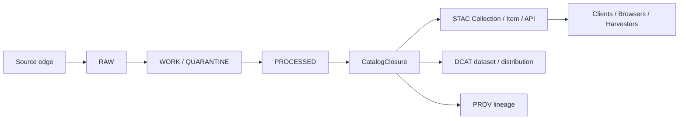

<!-- [KFM_META_BLOCK_V2]
doc_id: kfm://doc/TBD-UUID
title: OGC STAC Community Standards + Copernicus CDSE STAC Deployments — Alignment, Search Behavior, and Cataloging Conventions
type: standard
version: v1
status: draft
owners: TBD
created: YYYY-MM-DD
updated: YYYY-MM-DD
policy_label: public
related: [TBD-VERIFY-RELATED-PATHS]
tags: [kfm, stac, ogc, cdse, interoperability, metadata, cataloging]
notes: [Target path was user-specified; a prior project draft dated 2025-12-29 exists, but mounted repo ownership, dates, and adjacent links were not directly verified in this session.]
[/KFM_META_BLOCK_V2] -->

# OGC STAC Community Standards + Copernicus CDSE STAC Deployments — Alignment, Search Behavior, and Cataloging Conventions

KFM guidance for shaping outward STAC catalogs and APIs against the current OGC-published STAC baseline and a large real-world deployment.

**Target path:** `docs/standards/stac/OGC_STAC_COMMUNITY_STANDARD_AND_CDSE_DEPLOYMENTS.md`  
**Document posture:** CONFIRMED external standards and deployment facts where explicitly stated here; INFERRED project baseline from prior KFM drafting artifacts; PROPOSED KFM profile and validation rules; UNKNOWN mounted implementation depth in the current repo.

[Executive summary](#executive-summary) · [Evidence frame](#evidence-frame) · [Confirmed baseline](#confirmed-baseline) · [CDSE deployment lessons](#cdse-deployment-lessons) · [KFM alignment rules](#kfm-alignment-rules) · [Validation gates](#validation-gates) · [Open verification items](#open-verification-items)

> [!IMPORTANT]
> In KFM, STAC is an **outward catalog and discovery surface**, not the canonical truth store. It should hang off governed release state and **CatalogClosure**, alongside outward **STAC / DCAT / PROV** closure, rather than bypassing source onboarding, review, policy, or correction flow.

## Executive summary

The practical baseline is now clearer than it was in older GIS-centered documentation:

- **OGC has published STAC as Community Standards**, with **STAC Core 1.1.0** and **STAC API 1.0.0** as the current standards-track baseline.
- **STAC remains intentionally minimal-core and extension-driven**, so interoperability depends as much on disciplined extension use and conformance signaling as on emitting nominally valid JSON.
- **Copernicus Data Space Ecosystem (CDSE)** provides useful deployment evidence at scale: a live STAC 1.1.0 catalog, explicit support for `filter`, `query`, `fields`, and `sort`, active endpoint migration guidance, and documented operational caveats.
- For **KFM**, the right move is not “be vaguely STAC-like.” It is to pin an outward STAC baseline, keep Collections stable and contract-like, make item discovery useful before asset dereference, validate search behavior as a release gate, and preserve KFM’s trust membrane and release discipline.

## Evidence frame

| Evidence layer | Status | How it is used here |
|---|---|---|
| OGC STAC publication and standard text | **CONFIRMED** | Normative baseline for STAC Core / STAC API versions and standard status |
| Copernicus CDSE STAC documentation and change notices | **CONFIRMED** | Real deployment evidence for search behavior, endpoint stability, and operational conventions |
| Prior KFM draft for this exact target path | **INFERRED baseline** | Preserved as redesign seed where strong, but not treated as proof of mounted repo state |
| Mounted repo implementation for this file, schemas, tests, or live endpoints | **UNKNOWN** | Not directly verified in this session |

> [!NOTE]
> This document is intentionally split into three layers:  
> **standard baseline** → **deployment evidence** → **KFM profile consequence**.  
> That separation matters. What OGC publishes is not identical to what CDSE deploys, and neither is identical to what KFM should enforce.

## Confirmed baseline

### OGC publication baseline

| Topic | Confirmed baseline | Why it matters |
|---|---|---|
| STAC Core | **1.1.0** | Pin outward object-model expectations to the current OGC-hosted baseline |
| STAC API | **1.0.0** | Pin discovery/search expectations to the current OGC-hosted API baseline |
| Standard status | **OGC Community Standard** | Improves procurement, compliance, and validator/client convergence |
| Official artifacts | Standard documents, schemas/model files, change-request path | Makes version pinning and validation more defensible |

### STAC structure that matters to implementers

STAC’s durable shape is still the right one to design around:

- **Item** is the atomic spatiotemporal object and remains GeoJSON-centered.
- **Catalog** and **Collection** organize discovery and description.
- The model supports both **static catalogs** and **dynamic APIs**.
- STAC stays useful because it keeps a **small core** and expects disciplined **extensions**.

That combination is powerful, but it also creates a common failure mode: catalogs that are “close enough” for one browser and unusable for strict validators, harvesters, or downstream automation.

### CDSE deployment facts that are useful to design against

| Topic | Confirmed CDSE behavior | KFM consequence |
|---|---|---|
| Version baseline | CDSE documents **STAC 1.1.0** | KFM should not target older STAC object baselines for outward compatibility |
| Endpoint root | `https://stac.dataspace.copernicus.eu/v1/` | Versioned roots are a practical stability tool, not cosmetic polish |
| Legacy endpoint | Legacy STAC endpoint deprecated from **2025-11-17** | Migration notices and deprecation windows should be first-class operational artifacts |
| API role | STAC **complements**, not replaces, CDSE’s OData catalog | STAC can coexist with other discovery/query surfaces without owning every workflow |
| Supported search extensions | `filter`, `query`, `fields`, `sort` | Serious clients expect more than bare `/search` |
| Free-text note | Free-text search is documented as collection-endpoint-limited | Do not overgeneralize one deployment’s free-text behavior into universal STAC law |
| Coverage note | CDSE documents limited-but-expanding collection coverage | A deployment can be standards-aligned without claiming complete corpus coverage |
| Operational change notes | CDSE publishes endpoint and behavior changes | Client stability depends on public operational transparency |

## CDSE deployment lessons

CDSE is not “the standard,” but it is a useful example of what large-catalog reality looks like.

### 1. Collections are the main discovery contract

Across large public catalogs, clients typically start with **`/collections`** and work downward. In practice, Collections behave less like folders and more like **dataset contracts**:

- stable identifier
- stable high-level semantics
- clear license and extent
- usable discovery metadata

For KFM, this argues against treating Collections as casual grouping labels that can be renamed when internal organization shifts.

### 2. Items must be triageable without opening assets

A browser, harvester, or analyst should be able to decide whether an Item is worth opening by using the Item itself:

- geometry
- bbox
- datetime
- stable collection membership
- enough summary properties to assess relevance

If the only way to understand an Item is to dereference its assets, discovery quality is already too weak.

### 3. Search behavior is part of the contract

At scale, the difference between “nominally searchable” and “operationally usable” is large.

The CDSE shape reinforces a practical lesson:

| Search concern | Why it matters in production | KFM stance |
|---|---|---|
| `sort` | Stabilizes paging, repeatability, and cache behavior | **Require explicit test coverage** if claimed |
| `fields` | Keeps payloads usable and bounded | **Treat response shaping as contract behavior**, not a convenience |
| `filter` / `query` | Supports constrained retrieval and reproducible pipelines | **Claim only what is actually implemented and tested** |
| Paging | Determines whether clients can harvest safely at scale | **Document limits and ordering behavior explicitly** |

### 4. Operational transparency is interoperability

Undocumented behavior changes break trust faster than obvious denials do.

For a governed catalog, the minimum bar is:

- public migration notice
- effective date
- versioned endpoint guidance
- client-facing contract tests
- deprecation window where practical

That is not extra polish. It is part of the interoperability surface.

## KFM alignment rules

### KFM rule map

| Rule | Status | Why |
|---|---|---|
| Pin outward **STAC Core** to **1.1.0** | **PROPOSED** | Matches the OGC-published STAC object baseline |
| Pin outward **STAC API** to **1.0.0** | **PROPOSED** | Matches the OGC-published API baseline |
| Treat STAC as an outward surface emitted from **CatalogClosure** | **CONFIRMED doctrine / PROPOSED implementation** | KFM outward metadata closure is STAC/DCAT/PROV-bearing, not ad hoc |
| Treat **Collections as contracts, not folders** | **PROPOSED** | Stabilizes discovery, citations, and downstream assumptions |
| Make **Item identity deterministic** and **collection membership stable** | **PROPOSED** | Prevents cache, citation, and deduplication drift |
| Require Items to be useful before asset dereference | **PROPOSED** | Preserves practical discoverability |
| Keep an explicit **extension allowlist** | **PROPOSED** | Prevents “STAC-ish” drift and overclaim |
| Test landing document, collections, search, paging, and claimed extensions as release gates | **PROPOSED** | Turns outward compatibility into an enforceable contract |
| Publish endpoint/deprecation notices as versioned ops artifacts | **PROPOSED** | Mirrors deployment reality seen in large public catalogs |
| Never let outward STAC bypass rights, sensitivity, or release state | **CONFIRMED doctrine** | Preserves KFM trust membrane |

### Relationship to KFM’s truth path

**Operational reading:** STAC should appear **after** governed closure, not before it.  
If KFM ever emits STAC directly from raw or unreviewed intermediates, the catalog may be convenient, but it is no longer trustworthy in KFM terms.

### Collection conventions

These are **PROPOSED KFM outward-profile rules**, not claims about current mounted implementation.

| Collection element | KFM outward stance | Why |
|---|---|---|
| `id` | Stable, never casually recycled | Downstream citations and caches depend on it |
| `title` / `description` | Human-readable and domain-clear | Discovery should not require internal knowledge |
| `license` | Always present | Public-safe use depends on it |
| `extent` | Always present and truthful | Spatial/temporal search starts here |
| `providers` | Always present in outward profile | Supports provenance and interpretability |
| `keywords` | Always present in outward profile | Improves cross-catalog discovery |
| `summaries` | Include when they materially improve filtering | Useful, but should reflect actual data reality |
| `links` | Predictable and complete | Browsers and harvesters depend on traversal clarity |

### Item conventions

Also **PROPOSED KFM outward-profile rules**.

| Item element | KFM outward stance | Why |
|---|---|---|
| `id` | Deterministic and citation-safe | Supports deduplication, lineage, and stable references |
| `collection` | Stable membership semantics | Prevents drift across releases |
| `geometry` | Present unless the profile explicitly documents a valid exception | Discovery must remain spatially meaningful |
| `bbox` | Present with geometry | Improves fast triage and spatial filtering |
| `properties.datetime` | Present unless a documented temporal alternative is required | Time clarity is first-class in KFM |
| Summary properties | Enough for triage without opening assets | Discovery should remain lightweight |
| Links | Clear parent/collection/self relationships | Traversal is part of contract clarity |

### Asset conventions

| Asset concern | KFM outward stance | Why |
|---|---|---|
| `href` | Always present | Basic dereferenceability |
| `type` | Treat as mandatory in KFM outward profile | Automation frequently infers readers from MIME type |
| `roles` | Use a short documented vocabulary | Reduces client special-casing |
| Asset keys | Keep stable and predictable | UI and automation drift otherwise |
| Preview asset | Include `thumbnail` / `overview`-style asset when materially useful | Supports human browsing |
| Checksums / byte size | Include when profile/extensions support them | Helps reproducibility and integrity workflows |

## Search behavior and cataloging conventions

### Discovery surfaces clients will assume

| Surface | Practical expectation | KFM implication |
|---|---|---|
| Landing document (`/`) | Clear links and advertised capabilities | Treat root discoverability as part of release quality |
| `/collections` | Dataset discovery entry point | Must be complete, stable, and navigable |
| `/collections/{id}` | Contract-like dataset surface | Must not drift casually |
| `/search` | Item search returning predictable Item results | Needs deterministic ordering and paging behavior |
| Claimed conformance / extensions | Match real behavior | Never advertise extensions that are not actually implemented |

### What KFM should copy from CDSE

- **Versioned endpoint roots**
- **Documented extension support**
- **Public migration notices**
- **Search behavior clarity**
- **Operational humility** about partial coverage and ongoing optimization

### What KFM should not copy uncritically

- Any **deployment-specific limit** or behavior without deciding whether it is a deliberate KFM contract
- Any free-text or query behavior that is only loosely documented
- Any assumption that “large public catalog behavior” is automatically correct for all KFM lanes
- Any behavior that would weaken KFM’s release, rights, or sensitivity discipline for the sake of convenience

## Validation gates

The following gates are **PROPOSED** and should be read as release-facing checks for a governed outward STAC surface.

| Gate | Minimum proof | Fail-closed outcome |
|---|---|---|
| STAC object validation | Collection / Item JSON validates against pinned baseline and used extensions | Do not publish outward STAC |
| Collection completeness | Required outward-profile fields are present and populated | Hold release or emit corrective task |
| Item triage quality | Geometry, bbox, datetime, and summary properties are usable without asset open | Hold release |
| Asset metadata quality | Asset `type` present; roles/keys conform to documented profile | Hold release |
| Landing document quality | Root links and advertised capabilities are present and coherent | Hold API release |
| Search determinism | Paging + ordering are stable under repeated queries | Hold API release |
| Extension truthfulness | Claimed `filter` / `query` / `fields` / `sort` behavior matches implementation | Remove claim or block release |
| Migration transparency | Endpoint or behavior changes ship with notice and version guidance | Do not cut over silently |
| Rights / sensitivity alignment | Outward STAC does not expose policy-unsafe detail | Quarantine or generalize instead of publish |

<strong>Illustrative acceptance matrix</strong>

| Surface | Acceptance focus |
|---|---|
| `/` | Links present; capabilities discoverable; version/profile statement clear |
| `/collections` | Stable identifiers; required collection metadata present |
| `/collections/{id}` | Extent, license, providers, keywords, and links are complete |
| `/search` | Deterministic ordering; stable paging; documented filters and sorts behave as claimed |
| Item JSON | Geometry, bbox, datetime, collection, and links validate |
| Asset JSON | MIME type present; role vocabulary documented and consistent |
| Ops notice path | Endpoint migrations and deprecations are published before cutover |

## Common failure modes

| Failure mode | Symptom | Practical fix |
|---|---|---|
| “STAC-ish” JSON | One browser works; validators or harvesters fail | Enforce schema + extension validation in CI |
| Collection ID drift | Broken caches, citations, and client configs | Treat collection IDs as long-lived contract keys |
| Missing asset MIME types | Readers fail or require brittle inference | Require `type` in outward profile |
| Unstable paging | Duplicate/missed results across harvest runs | Require deterministic ordering and explicit tests |
| Undocumented endpoint changes | Silent client breakage | Publish migration notices and deprecation windows |
| STAC bypassing KFM release state | Public catalog outruns reviewed truth | Emit STAC only from governed closure |

## Open verification items

1. **UNKNOWN** whether this target file already exists in the mounted repo or is still only represented by prior drafting artifacts.
2. **UNKNOWN** whether the repo already contains a concrete **KFM-STAC** profile, standards profile YAML, JSON Schemas, fixtures, or API contract tests.
3. **UNKNOWN** current owners, UUID, created date, updated date, and related internal links for the meta block.
4. **UNKNOWN** whether KFM already emits outward STAC Collections/Items from a governed pipeline.
5. **UNKNOWN** whether KFM should mirror CDSE-style paging or datetime conventions exactly, or merely document compatibility expectations.
6. **UNKNOWN** which extension allowlist is actually needed by current KFM lanes versus future lanes.

## Commit-ready review checklist

- [ ] Meta block placeholders resolved from mounted repo evidence
- [ ] Adjacent internal links verified
- [ ] Any existing file at this path diff-reviewed against this draft
- [ ] KFM outward profile versions verified against mounted standards/profile docs
- [ ] Extension allowlist confirmed from mounted implementation or accepted as profile decision
- [ ] Validation-gate language aligned with actual test harness names
- [ ] Any deployment-specific values rechecked before merge

[Back to top](#ogc-stac-community-standards--copernicus-cdse-stac-deployments--alignment-search-behavior-and-cataloging-conventions)
