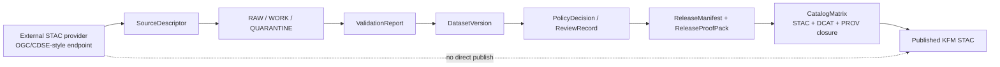

<!-- [KFM_META_BLOCK_V2]
doc_id: kfm://doc/<TODO-VERIFY-UUID>
title: OGC STAC Community Standards + CDSE STAC Deployments
type: standard
version: v1
status: draft
owners: @bartytime4life
created: <TODO: verify original creation date>
updated: 2026-04-30
policy_label: public
related: [./README.md, ../README.md, ../KFM_STAC_PROFILE.md, ../KFM_DCAT_PROFILE.md, ../KFM_PROV_PROFILE.md, ../governance/ROOT_GOVERNANCE.md, ../faircare/FAIRCARE-GUIDE.md, ../sovereignty/INDIGENOUS-DATA-PROTECTION.md, ../../runbooks/README.md, ../../../contracts/README.md, ../../../schemas/contracts/v1/README.md, ../../../policy/README.md, ../../../tests/README.md]
tags: [kfm, standards, stac, ogc, cdse, copernicus, catalog, interoperability, evidence]
notes: [doc_id and original created date need repo registry verification; owners inferred from visible standards-lane evidence showing /docs/ ownership by @bartytime4life; this document is a STAC deployment/alignment note under the repo-wide KFM STAC profile, not a duplicate field-level profile.]
[/KFM_META_BLOCK_V2] -->

# OGC STAC Community Standards + CDSE STAC Deployments

KFM alignment guidance for using the OGC STAC Community Standards and Copernicus Data Space Ecosystem STAC deployment without weakening release governance, evidence closure, rights review, or public-safety controls.

> **Status:** `draft`  
> **Path:** `docs/standards/stac/OGC_STAC_COMMUNITY_STANDARD_AND_CDSE_DEPLOYMENTS.md`  
> **Role:** STAC deployment and interoperability note beneath [`../KFM_STAC_PROFILE.md`](../KFM_STAC_PROFILE.md)  
> **Current posture:** `CONFIRMED` standards/deployment anchors · `PROPOSED` KFM implementation gates · `NEEDS VERIFICATION` for live endpoint behavior before release automation

**Quick jump:** [Decision](#decision) · [Repo fit](#repo-fit) · [Scope](#scope) · [What OGC STAC settles](#what-ogc-stac-settles) · [What CDSE demonstrates](#what-cdse-demonstrates) · [KFM rules](#kfm-rules) · [Deployment lessons](#deployment-lessons-from-cdse) · [Validation gates](#validation-gates) · [Anti-patterns](#anti-patterns) · [Pre-merge checklist](#pre-merge-checklist) · [References](#references)

---

## Decision

KFM should treat **OGC STAC Core 1.1.0** and **OGC STAC API 1.0.0** as the outward interoperability baseline for STAC-facing discovery, while treating the **Copernicus Data Space Ecosystem (CDSE) STAC API** as a valuable real-world deployment reference.

KFM must not treat either one as a substitute for KFM release governance.

| Question | KFM answer |
|---|---|
| Is STAC allowed as an outward discovery format? | **Yes — CONFIRMED doctrine / PROPOSED implementation.** Use STAC for release-safe discovery of spatial-temporal assets. |
| Is a valid STAC object enough to publish a KFM claim? | **No.** STAC validity is not release approval, policy approval, rights approval, sensitivity approval, or EvidenceBundle closure. |
| Is CDSE a source authority for KFM? | **Only source-specifically.** CDSE can be a `SourceDescriptor` target and deployment model, not a KFM truth authority by itself. |
| Should KFM mirror provider STAC directly into public KFM STAC? | **No.** Provider STAC is input evidence or discovery context until KFM validation, policy, review, release, and catalog closure pass. |
| Where do field-level KFM STAC rules live? | [`../KFM_STAC_PROFILE.md`](../KFM_STAC_PROFILE.md). This file explains external standard/deployment alignment. |

> [!IMPORTANT]
> In KFM, **discoverability is a governed outcome**. A STAC API can help users find assets, but KFM publication still requires evidence, rights, sensitivity, review state, release state, and correction lineage.

[Back to top](#ogc-stac-community-standards--cdse-stac-deployments)

---

## Repo fit

| Item | Value |
|---|---|
| Target file | `docs/standards/stac/OGC_STAC_COMMUNITY_STANDARD_AND_CDSE_DEPLOYMENTS.md` |
| Parent lane | [`./README.md`](./README.md) |
| Standards index | [`../README.md`](../README.md) |
| Main KFM STAC profile | [`../KFM_STAC_PROFILE.md`](../KFM_STAC_PROFILE.md) |
| Adjacent discovery profiles | [`../KFM_DCAT_PROFILE.md`](../KFM_DCAT_PROFILE.md), [`../KFM_PROV_PROFILE.md`](../KFM_PROV_PROFILE.md) |
| Governance / rights / sensitivity neighbors | [`../governance/ROOT_GOVERNANCE.md`](../governance/ROOT_GOVERNANCE.md), [`../faircare/FAIRCARE-GUIDE.md`](../faircare/FAIRCARE-GUIDE.md), [`../sovereignty/INDIGENOUS-DATA-PROTECTION.md`](../sovereignty/INDIGENOUS-DATA-PROTECTION.md) |
| Machine-facing companions | `../../../schemas/contracts/v1/`, `../../../contracts/`, `../../../policy/`, `../../../tests/` |
| Accepted inputs | Standards notes, deployment comparisons, STAC API compatibility guidance, provider endpoint migration notes, validation expectations |
| Exclusions | Field-by-field KFM STAC profile rules, machine schemas, executable Rego, fixtures, operational runbooks, source-specific ingestion code |

### Routing rule

Use this file when the change is about **how KFM should interpret or interoperate with OGC STAC or real STAC deployments**.

Use [`../KFM_STAC_PROFILE.md`](../KFM_STAC_PROFILE.md) when the change is a **KFM STAC object rule**.

Use machine-contract, policy, test, or runbook surfaces when the change must be executable or operational.

[Back to top](#ogc-stac-community-standards--cdse-stac-deployments)

---

## Scope

This note covers:

- OGC STAC Community Standard status and what that means for KFM.
- STAC API conformance expectations that matter at the ingest boundary.
- CDSE STAC deployment behavior that KFM should learn from.
- Provider endpoint migration and compatibility risks.
- How external STAC inputs become KFM release-safe STAC outputs.
- Guardrails for evidence, rights, sensitivity, correction, and catalog closure.

This note does **not** define every field in KFM’s outward STAC profile. That belongs in [`../KFM_STAC_PROFILE.md`](../KFM_STAC_PROFILE.md).

---

## Truth labels used here

| Label | Meaning |
|---|---|
| `CONFIRMED` | Verified from attached KFM documentation, visible workspace evidence, or current official standards/deployment sources. |
| `PROPOSED` | KFM implementation guidance not verified as already present in the repo. |
| `INFERRED` | Reasonable project-specific consequence of confirmed doctrine and standards evidence. |
| `NEEDS VERIFICATION` | Must be rechecked against the mounted repo, live endpoint, source terms, policy bundle, test suite, or release tooling before merge or activation. |
| `UNKNOWN` | Not established from current evidence. |

[Back to top](#ogc-stac-community-standards--cdse-stac-deployments)

---

## What OGC STAC settles

`CONFIRMED`: OGC lists the STAC family as Community Standards, including:

| OGC standard | Version | OGC document | KFM use |
|---|---:|---|---|
| STAC Community Standard | `1.1.0` | `25-004` | Baseline for STAC Catalog, Collection, Item, Asset, Link, and extension-aware object interpretation. |
| STAC API Community Standard | `1.0.0` | `25-005` | Baseline for dynamic catalog discovery, landing pages, conformance, collections, features, and item search behavior. |

STAC is useful to KFM because it standardizes the way spatiotemporal asset metadata is structured and queried. Its original center of gravity was satellite imagery, but the standard family now supports many asset types, including aircraft and drone data, SAR, video, point clouds, lidar, DEM, vector data, machine learning labels, NDVI, and mosaics.

### Practical consequences for KFM

| OGC STAC signal | KFM consequence |
|---|---|
| Stable OGC Community Standards exist | KFM can anchor outward STAC compatibility to named standards instead of ad hoc provider behavior. |
| STAC has a minimal core and extension mechanism | KFM should keep core discovery small, then add KFM-specific governance through profile rules, links, extensions, and release metadata rather than overloading STAC core. |
| STAC API has a landing-page and conformance model | KFM external STAC clients should inspect `conformsTo` and supported links instead of assuming endpoint behavior. |
| STAC API has item search and collection behavior | KFM can test provider discovery behavior through bounded collection/item samples before admitting a source. |
| OGC standard status does not define KFM policy | KFM still needs `DecisionEnvelope`, `ReleaseManifest`, `CatalogMatrix`, `EvidenceBundle`, review, rights, and sensitivity checks. |

> [!NOTE]
> OGC standardization improves interoperability confidence. It does **not** prove that an external provider endpoint is current, complete, rights-compatible, sensitivity-safe, or stable enough for KFM publication automation.

[Back to top](#ogc-stac-community-standards--cdse-stac-deployments)

---

## What CDSE demonstrates

`CONFIRMED`: The Copernicus Data Space Ecosystem STAC catalogue is a large operational Earth-observation deployment that uses STAC to improve discoverability and management of EO data.

CDSE is especially useful to KFM as a deployment reference because it shows how a major provider handles:

- a public STAC endpoint;
- a browser UI for exploration;
- collection-specific discovery;
- `/search` behavior;
- queryables;
- filter/query/fields/sort extensions;
- endpoint consolidation and legacy endpoint deprecation;
- coexistence with another catalogue interface, OData.

### CDSE anchors to track

| CDSE surface | Current note | KFM posture |
|---|---|---|
| STAC endpoint | `https://stac.dataspace.copernicus.eu/v1/` | Use only through a `SourceDescriptor`; do not hard-code in domain pipelines. |
| Legacy endpoint | `https://catalogue.dataspace.copernicus.eu/stac` deprecated from 2025-11-17 | New KFM configs should reject this endpoint unless a temporary migration exception is recorded. |
| OData coexistence | CDSE says STAC complements rather than replaces OData | If both are used, define separate source roles and field mappings. |
| Collection coverage | CDSE documentation says STAC includes a limited set of collections and will expand | KFM should whitelist expected collections and explicitly represent gaps. |
| Extensions | CDSE documents `filter`, `query`, `fields`, `sort`, and free-text search for `/Collection` only | KFM clients should feature-detect and test extensions before relying on them. |
| Queryables | CDSE exposes queryables endpoints | KFM source activation should snapshot queryables for each admitted collection. |
| Change notices | CDSE documents endpoint, datetime, and catalogue API changes | KFM should schedule provider re-verification rather than treating endpoint behavior as permanent. |

[Back to top](#ogc-stac-community-standards--cdse-stac-deployments)

---

## KFM rules

These rules preserve the repo-wide KFM STAC posture while making the OGC/CDSE alignment actionable.

### Rule 1 — STAC is downstream of release governance

A provider STAC Item is not a KFM published item.

KFM may ingest, reference, validate, normalize, and cite external STAC metadata, but public KFM STAC output is allowed only after release-safe scope is proven.



### Rule 2 — Release-safe scope only

No public KFM STAC Catalog, Collection, Item, Asset, or Link should point into:

- `RAW`;
- `WORK`;
- `QUARANTINE`;
- unpublished candidate data;
- restricted exact-location artifacts;
- unreviewed public transformations;
- provider assets whose rights, authentication, access constraints, or sensitivity posture are unresolved.

### Rule 3 — Evidence closure is mandatory

Every public KFM STAC object that supports a public claim must resolve to:

| Required object | Why it matters |
|---|---|
| `SourceDescriptor` | Identifies source, role, cadence, rights, endpoint, expected collections, and validation plan. |
| `IngestReceipt` | Shows fetch/landing context and input integrity. |
| `ValidationReport` | Shows schema, field, bounds, time, asset, and extension checks. |
| `DatasetVersion` | Names the processed candidate or promoted subject set. |
| `DecisionEnvelope` | Captures policy decision, reasons, obligations, and finite outcome. |
| `ReviewRecord` | Records human review where required. |
| `ReleaseManifest` / `ReleaseProofPack` | Defines public artifacts, hashes, proof refs, and rollback target. |
| `CatalogMatrix` | Proves STAC/DCAT/PROV/release closure. |
| `EvidenceBundle` | Resolves public claims to admissible evidence. |
| `CorrectionNotice` | Preserves supersession, withdrawal, narrowing, or replacement lineage. |

### Rule 4 — Provider conformance is an input check, not a publication decision

Provider conformance checks answer questions such as:

- Does the landing page advertise expected STAC API conformance?
- Does the endpoint expose the expected `search` link?
- Are required collections present?
- Are queryables available?
- Are extension behaviors consistent with documentation?
- Does pagination return complete expected samples?

They do **not** answer:

- Is this asset public-safe?
- Does KFM have redistribution rights?
- Has source-role authority been assigned?
- Has sensitivity been handled?
- Has review happened?
- Is the public claim supported?
- Is KFM publication approved?

### Rule 5 — CDSE-derived records must retain provider context

When CDSE or another external STAC deployment contributes source material, KFM records should preserve:

- provider endpoint;
- provider item id;
- provider collection id;
- provider `stac_version`;
- provider `stac_extensions`;
- provider asset hrefs and media types;
- retrieval timestamp;
- source terms / citation / attribution posture;
- query used;
- queryables snapshot or reference;
- validation report;
- transformation receipt if KFM generalizes, redacts, reprojects, normalizes, or remaps metadata.

[Back to top](#ogc-stac-community-standards--cdse-stac-deployments)

---

## Deployment lessons from CDSE

CDSE is not a KFM template to copy blindly. It is a deployment to learn from.

| CDSE lesson | Failure mode if ignored | KFM response |
|---|---|---|
| Endpoint roots can change | Pipelines silently query deprecated endpoints or mixed catalog content. | Keep endpoint roots in `SourceDescriptor`, validate against provider notices, and block legacy endpoints by default. |
| STAC can coexist with OData | Teams treat two APIs as interchangeable and lose fields or semantics. | Assign separate source roles and field mappings; do not collapse OData and STAC provenance. |
| Collection coverage can be partial | A missing collection is mistaken for missing data or empty science. | Whitelist expected collections and represent unavailable collections as `ABSTAIN` or `NEEDS VERIFICATION`, not zero results. |
| Query/filter support is extension-dependent | Clients assume unsupported operators and miss items. | Snapshot `conformsTo`, queryables, and extension support at source activation. |
| `fields` can optimize large responses | Over-aggressive field exclusion removes geometry, links, or properties needed for policy. | Use `fields` only after declaring the evidence and policy fields required by the pipeline. |
| Sorting and paging behavior matters | Search results are incomplete or unstable across runs. | Follow returned links where available; partition searches by time/space when provider limits require it. |
| Provider notices affect contracts | Date/time formatting and parameter limits break validations. | Add scheduled provider rechecks and fixture refreshes after official change notices. |

[Back to top](#ogc-stac-community-standards--cdse-stac-deployments)

---

## External STAC source admission record

`PROPOSED`: Before KFM activates CDSE or any other external STAC API, create a source admission record equivalent to the following shape.

```yaml
# Illustrative only. Use the repo's actual schema home after verification.
external_stac_service_record:
  provider_id: copernicus-cdse
  provider_name: Copernicus Data Space Ecosystem
  source_descriptor_ref: kfm://source/copernicus-cdse-stac
  endpoint:
    root_url: https://stac.dataspace.copernicus.eu/v1/
    legacy_urls:
      - https://catalogue.dataspace.copernicus.eu/stac
    legacy_policy: deny_new_configs
  standards_baseline:
    stac_core: "1.1.0"
    stac_api: "1.0.0"
  verification:
    checked_at: "<TODO: ISO-8601 timestamp>"
    checked_by: "<TODO: owner or automation id>"
    root_stac_version: "<TODO>"
    conforms_to:
      - "<TODO: conformance URI snapshot>"
    queryables_snapshot_ref: "<TODO>"
    sample_search_receipt_ref: "<TODO>"
  admitted_collections:
    - collection_id: sentinel-2-l2a
      status: proposed
      reason: "<TODO: source-role and use-case justification>"
  rights_and_access:
    access_mode: "<TODO: public | account | token | restricted>"
    redistribution_posture: "<TODO>"
    attribution_required: "<TODO>"
    license_ref: "<TODO>"
  kfm_controls:
    release_scope_required: true
    evidence_bundle_required: true
    catalog_matrix_required: true
    policy_decision_required: true
    review_record_required_when: "<TODO: sensitivity / rights / precision triggers>"
  known_provider_change_notices:
    - date: "2025-11-17"
      note: "Legacy STAC endpoint deprecated; use /v1 endpoint."
```

[Back to top](#ogc-stac-community-standards--cdse-stac-deployments)

---

## Validation gates

`PROPOSED`: These gates should become fixtures, contract tests, policy checks, or runbook checks before live provider automation is promoted.

### Gate A — endpoint and conformance

| Check | Pass condition | Fail behavior |
|---|---|---|
| Root URL is declared | Endpoint appears in `SourceDescriptor` or admission record. | `DENY` new activation. |
| Legacy endpoint not used | New configs use the approved `/v1/` endpoint. | `DENY` unless an explicit migration exception exists. |
| Landing page exists | Root response is a valid STAC landing page / Catalog-like object. | `ABSTAIN` and quarantine source activation. |
| Conformance captured | `conformsTo` or equivalent advertised behavior is captured in a receipt. | `ABSTAIN`; do not infer support. |
| Search link present when required | `/search` or item-search link is discoverable. | `ABSTAIN` for item-search workflows. |

### Gate B — collection and query behavior

| Check | Pass condition | Fail behavior |
|---|---|---|
| Collection whitelist | Pipeline queries only admitted collections. | `DENY` or quarantine unknown collection. |
| Queryables snapshot | Queryable fields are known before filter use. | `ABSTAIN` for filtered search. |
| Filter/query support | Extension support is confirmed before use. | Use simpler supported query or `ABSTAIN`. |
| Pagination completeness | Search follows returned links or bounded partitions. | Fail validation; do not treat partial sample as complete. |
| Time format | Datetime values parse as UTC ISO 8601 and retain provider precision. | Quarantine record for normalization review. |

### Gate C — KFM publication closure

| Check | Pass condition | Fail behavior |
|---|---|---|
| Evidence closure | Every public claim resolves to an `EvidenceBundle`. | `ABSTAIN`. |
| Rights closure | License, attribution, access, and redistribution posture are visible. | `DENY` public publication. |
| Sensitivity closure | Exact location, cultural, ecological, critical-infrastructure, or privacy-sensitive outputs pass review. | `DENY` or require redaction/generalization. |
| Release closure | Public STAC object ties to `ReleaseManifest` and `ReleaseProofPack`. | `DENY` publication. |
| Catalog closure | STAC/DCAT/PROV entries close over the same release scope. | `DENY` publication. |
| Correction readiness | Supersession and rollback target are recorded. | `DENY` promotion. |

[Back to top](#ogc-stac-community-standards--cdse-stac-deployments)

---

## KFM / OGC / CDSE alignment matrix

| Surface | What it governs | What it does **not** govern | KFM handling |
|---|---|---|---|
| OGC STAC Core 1.1.0 | Static STAC object model and extension-aware asset metadata structure | KFM release approval, rights, sensitivity, review, or evidence sufficiency | Use as external interoperability baseline. |
| OGC STAC API 1.0.0 | Dynamic catalog API discovery, conformance, collections/features/item search behavior | Provider uptime, endpoint stability, KFM source authority, or publication state | Use for endpoint checks and client compatibility tests. |
| CDSE STAC API | Operational Copernicus deployment and EO catalogue discovery | KFM public release decision or universal STAC behavior | Use as provider-specific source and deployment reference. |
| KFM STAC profile | KFM outward discovery obligations for release-safe STAC | API implementation code or provider-specific terms | Keep field/object rules in [`../KFM_STAC_PROFILE.md`](../KFM_STAC_PROFILE.md). |
| KFM control plane | Evidence, policy, review, release, correction, and rollback | External standards semantics by themselves | Must remain upstream of public KFM STAC. |

[Back to top](#ogc-stac-community-standards--cdse-stac-deployments)

---

## Anti-patterns

> [!CAUTION]
> These are STAC-specific ways to break the KFM trust membrane.

| Anti-pattern | Why it is unsafe | Safer pattern |
|---|---|---|
| “Provider STAC item exists, so publish it.” | Confuses discovery with release. | Treat provider STAC as input evidence until KFM gates pass. |
| “OGC standard means policy-approved.” | Standards do not evaluate rights, sensitivity, or review state. | Keep policy and review as KFM gates. |
| “Mirror CDSE STAC into public KFM STAC.” | Loses KFM provenance, correction, and release scope. | Emit KFM STAC only from promoted KFM release scope. |
| “Use the old CDSE endpoint until it breaks.” | Silent behavior drift can create partial or stale catalog results. | Block legacy endpoints unless a migration exception is documented. |
| “Use `fields=-geometry` everywhere for speed.” | Geometry may be needed for sensitivity, support, and policy checks. | Exclude fields only after declaring policy/evidence requirements. |
| “Interpret an empty search as absence.” | Provider coverage, filters, pagination, or collection support may be incomplete. | Distinguish `NO_RESULT`, `PARTIAL_SUPPORT`, `ABSTAIN`, and `ERROR`. |
| “Let UI browse provider STAC as KFM truth.” | Bypasses EvidenceBundle and release state. | UI consumes governed KFM envelopes and released artifacts. |

[Back to top](#ogc-stac-community-standards--cdse-stac-deployments)

---

## Review triggers

A change to this document should trigger review when it:

- changes the accepted OGC STAC baseline version;
- admits or removes a CDSE endpoint;
- changes legacy endpoint treatment;
- adds a source collection, extension, or query behavior as expected;
- weakens a fail-closed publication rule;
- introduces a new public asset/link expectation;
- affects rights, sensitivity, sovereignty, or exact-location handling;
- changes how STAC/DCAT/PROV closure is described;
- changes any relationship between provider STAC and KFM release artifacts.

[Back to top](#ogc-stac-community-standards--cdse-stac-deployments)

---

## Pre-merge checklist

- [ ] The mounted repo confirms this file’s path and neighboring links.
- [ ] `doc_id`, `created`, `updated`, `owners`, and `policy_label` are verified or intentionally left as review placeholders.
- [ ] [`../KFM_STAC_PROFILE.md`](../KFM_STAC_PROFILE.md) remains the field-level STAC rule source.
- [ ] This file does not duplicate machine schemas or executable policy.
- [ ] CDSE endpoint status is rechecked before any implementation claims are merged.
- [ ] Provider rights, attribution, access mode, and redistribution posture remain `NEEDS VERIFICATION` unless source-specific evidence is attached.
- [ ] Legacy endpoint handling is enforced in source admission tests if CDSE is activated.
- [ ] Negative tests exist for missing conformance, unsupported extensions, partial pagination, unknown collection, and unresolved rights.
- [ ] Public KFM STAC emission still requires `ReleaseManifest`, `CatalogMatrix`, `DecisionEnvelope`, and `EvidenceBundle` closure.
- [ ] Sensitive or restricted exact-location assets cannot become public STAC assets by provider mirroring.

[Back to top](#ogc-stac-community-standards--cdse-stac-deployments)

---

## Open verification backlog

| Item | Status | Why it remains open |
|---|---|---|
| Actual file exists in mounted repo | `NEEDS VERIFICATION` | Current session did not expose a mounted checkout. |
| Original creation date | `NEEDS VERIFICATION` | Existing draft snippet showed a prior date, but repo history was not available. |
| UUID / document registry entry | `NEEDS VERIFICATION` | No current doc registry was mounted. |
| CDSE live endpoint behavior | `NEEDS VERIFICATION` | Official docs were checked, but production activation requires live connector tests. |
| CDSE source terms and attribution details | `NEEDS VERIFICATION` | Must be source-record specific before public release. |
| Exact KFM schema home for external STAC service records | `UNKNOWN` | Schema authority between contracts/schema surfaces still requires repo inspection. |
| Automated conformance tests | `PROPOSED` | No current tests/workflows were visible in this session. |

[Back to top](#ogc-stac-community-standards--cdse-stac-deployments)

---

## References

### KFM-local references

- [`./README.md`](./README.md)
- [`../README.md`](../README.md)
- [`../KFM_STAC_PROFILE.md`](../KFM_STAC_PROFILE.md)
- [`../KFM_DCAT_PROFILE.md`](../KFM_DCAT_PROFILE.md)
- [`../KFM_PROV_PROFILE.md`](../KFM_PROV_PROFILE.md)
- [`../governance/ROOT_GOVERNANCE.md`](../governance/ROOT_GOVERNANCE.md)
- [`../faircare/FAIRCARE-GUIDE.md`](../faircare/FAIRCARE-GUIDE.md)
- [`../sovereignty/INDIGENOUS-DATA-PROTECTION.md`](../sovereignty/INDIGENOUS-DATA-PROTECTION.md)

### External standards and deployment anchors

- [OGC — SpatioTemporal Asset Catalog (STAC)][ogc-stac]
- [OGC — STAC Community Standard 1.1.0, OGC 25-004][ogc-stac-core]
- [OGC — STAC API Community Standard 1.0.0, OGC 25-005][ogc-stac-api]
- [STAC API Foundation Specifications][stac-api-spec]
- [Copernicus Data Space Ecosystem — STAC product catalogue][cdse-stac]
- [Copernicus Data Space Ecosystem — upcoming catalogue/API changes][cdse-upcoming]
- [Copernicus Data Space Ecosystem — STAC endpoint consolidation notice][cdse-endpoint-consolidation]

[ogc-stac]: https://www.ogc.org/standards/stac/
[ogc-stac-core]: https://docs.ogc.org/cs/25-004/25-004.html
[ogc-stac-api]: https://docs.ogc.org/cs/25-005/25-005.html
[stac-api-spec]: https://github.com/radiantearth/stac-api-spec
[cdse-stac]: https://documentation.dataspace.copernicus.eu/APIs/STAC.html
[cdse-upcoming]: https://documentation.dataspace.copernicus.eu/APIs/Others/UpcomingChanges.html
[cdse-endpoint-consolidation]: https://dataspace.copernicus.eu/news/2025-11-3-stac-catalogue-api-endpoints-consolidation

[Back to top](#ogc-stac-community-standards--cdse-stac-deployments)
