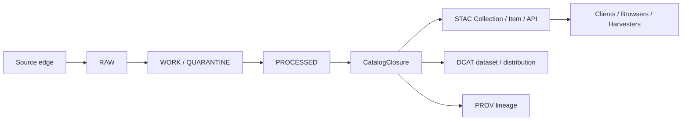

<!-- [KFM_META_BLOCK_V2]
doc_id: kfm://doc/TBD-UUID
title: OGC STAC Community Standards + Copernicus CDSE STAC Deployments — Alignment, Search Behavior, and Cataloging Conventions
type: standard
version: v1
status: draft
owners: @bartytime4life
created: 2026-03-22
updated: YYYY-MM-DD
policy_label: public
related: [docs/standards/README.md, docs/standards/KFM_STAC_PROFILE.md, docs/standards/KFM_DCAT_PROFILE.md, docs/standards/KFM_PROV_PROFILE.md, docs/standards/stac/README.md]
tags: [kfm, stac, ogc, cdse, interoperability, metadata, cataloging]
notes: [created date grounded in public file history; set updated on merge; doc_id remains NEEDS VERIFICATION; owners reflect current broad /docs/ CODEOWNERS coverage on public main; policy_label is inferred from public-main visibility]
[/KFM_META_BLOCK_V2] -->

# OGC STAC Community Standards + Copernicus CDSE STAC Deployments — Alignment, Search Behavior, and Cataloging Conventions

KFM lane-local guidance for aligning outward STAC behavior with the current OGC baseline and a large public deployment without confusing discovery metadata for canonical truth.

> **Repo fit:** child note under [`docs/standards/stac/`](README.md); repo-wide outward profile rules still live in [`../KFM_STAC_PROFILE.md`](../KFM_STAC_PROFILE.md).  
> **Current public-main status:** this file already exists on `main` and is routed from both the parent standards index and the STAC lane README.  
> **Document posture:** `CONFIRMED doctrine` · `CONFIRMED public-main file presence and neighboring docs` · `PROPOSED KFM profile consequences` · `UNKNOWN non-public enforcement depth`

[Executive summary](#executive-summary) · [Repo fit and role](#repo-fit-and-role) · [Evidence frame](#evidence-frame) · [Repo-grounded delta](#repo-grounded-delta-since-the-earlier-draft) · [Confirmed baseline](#confirmed-baseline) · [CDSE deployment lessons](#cdse-deployment-lessons) · [KFM alignment rules](#kfm-alignment-rules) · [Validation gates](#validation-gates) · [Open verification items](#open-verification-items)

> [!IMPORTANT]
> This file is a **lane-local STAC interoperability note**, not the sole normative source of KFM STAC policy. Keep repo-wide outward-profile law in [`../KFM_STAC_PROFILE.md`](../KFM_STAC_PROFILE.md), and use this note for deployment comparison, search behavior, cataloging conventions, and release-facing checks.

> [!IMPORTANT]
> In KFM, STAC is an **outward catalog and discovery surface**, not the canonical truth store. It should hang off governed release state and **CatalogClosure**, alongside outward **STAC / DCAT / PROV** closure, rather than bypassing source onboarding, review, policy, or correction flow.

## Executive summary

The practical baseline is clearer than it was in earlier STAC-adjacent drafting:

- **OGC has published STAC as Community Standards**, with **STAC Core 1.1.0** and **STAC API 1.0.0** as the current official standards-track baseline.
- **STAC remains intentionally minimal-core and extension-driven**, so interoperability depends as much on disciplined extension use and truthful conformance signaling as on nominally valid JSON.
- **Copernicus Data Space Ecosystem (CDSE)** provides useful deployment evidence at scale: a live STAC 1.1.0 catalog, versioned endpoint guidance, explicit support for `filter`, `query`, `fields`, and `sort`, collection-scoped free-text search, and discoverable `queryables` endpoints.
- For **KFM**, the right move is not “be vaguely STAC-like.” It is to pin an outward STAC baseline, keep Collections stable and contract-like, make item discovery useful before asset dereference, expose or clearly bound search behavior, and treat validation as a release gate rather than a post hoc cleanup step.

## Repo fit and role

| Field | Value |
|---|---|
| Path | `docs/standards/stac/OGC_STAC_COMMUNITY_STANDARD_AND_CDSE_DEPLOYMENTS.md` |
| Standards lane | [`docs/standards/stac/`](README.md) |
| Primary upstream doctrine | [`../KFM_STAC_PROFILE.md`](../KFM_STAC_PROFILE.md) |
| Cross-standard neighbors | [`../README.md`](../README.md) · [`../KFM_DCAT_PROFILE.md`](../KFM_DCAT_PROFILE.md) · [`../KFM_PROV_PROFILE.md`](../KFM_PROV_PROFILE.md) |
| Role | STAC-specific deployment/reference guidance that sharpens search behavior, catalog conventions, and release-facing expectations |
| Non-role | Not the canonical home for repo-wide STAC profile law, machine-enforced schemas, policy bundles, fixtures, or runtime proofs |

This note should answer a narrow but important question: **what should KFM copy, reject, and explicitly decide when aligning outward STAC behavior to the current OGC baseline and a large real-world STAC deployment?**

## Evidence frame

| Evidence layer | Status | How it is used here |
|---|---|---|
| OGC STAC publication and official standards page | **CONFIRMED** | Normative baseline for STAC Core / STAC API versions and standard status |
| Copernicus CDSE STAC documentation | **CONFIRMED** | Real deployment evidence for endpoint stability, extensions, `queryables`, and search behavior |
| Current public-main repo docs lane | **CONFIRMED** | Confirms this file exists, shows where it sits in the standards hierarchy, and resolves broad docs ownership |
| Earlier project draft for this exact path | **INFERRED baseline** | Preserved where strong, but updated where current public-main evidence now narrows uncertainty |
| Non-public or uninspected machine surfaces | **UNKNOWN** | Current validators, fixtures, workflow wiring, required checks, emitted STAC examples, and runtime routes are not proven here |

> [!NOTE]
> This document stays intentionally split into three layers:  
> **standard baseline** → **deployment evidence** → **KFM profile consequence**.  
> That separation matters. What OGC publishes is not identical to what CDSE deploys, and neither is identical to what KFM should enforce.

## Repo-grounded delta since the earlier draft

| Repo-grounded delta | Why it changes this note |
|---|---|
| This exact file is already present on public `main` | Treat this revision as an in-place strengthening, not a speculative new file |
| [`../README.md`](../README.md) routes to this file as a substantive draft standards note | This note now participates in the visible standards lane, not just a private drafting backlog |
| [`README.md`](README.md) in this subtree identifies [`../KFM_STAC_PROFILE.md`](../KFM_STAC_PROFILE.md) as the primary upstream doctrine | Keep global STAC profile law there; keep this note deployment-facing and comparison-oriented |
| Broad `/docs/` ownership is currently `@bartytime4life` | The owner field no longer needs to remain `TBD`, though a narrower STAC-lane owner is still unverified |
| Public `.github/workflows/` is README-only on `main` | Do not imply live STAC CI enforcement, validators, or release jobs from prose alone |

## Confirmed baseline

### OGC publication baseline

| Topic | Confirmed baseline | Why it matters |
|---|---|---|
| STAC Core | **1.1.0** | Pin outward object-model expectations to the current OGC-hosted baseline |
| STAC API | **1.0.0** | Pin discovery/search expectations to the current OGC-hosted API baseline |
| Standard status | **OGC Community Standard** | Improves procurement, compliance, and validator/client convergence |
| Official artifacts | Standard documents, schemas/model files, and change-request path | Makes version pinning and validation more defensible |

### STAC structure that matters to implementers

STAC’s durable shape is still the right one to design around:

- **Item** is the atomic spatiotemporal object and remains GeoJSON-centered.
- **Catalog** and **Collection** organize discovery and description.
- The model supports both **static catalogs** and **dynamic APIs**.
- STAC stays useful because it keeps a **small core** and expects disciplined **extensions**.

That combination is powerful, but it also creates a common failure mode: catalogs that are “close enough” for one browser and unusable for strict validators, harvesters, or downstream automation.

### CDSE deployment facts that are useful to design against

| Topic | Confirmed CDSE behavior | KFM consequence |
|---|---|---|
| Version baseline | CDSE documents **STAC 1.1.0** | KFM should not target older STAC object baselines for outward compatibility |
| Endpoint root | `https://stac.dataspace.copernicus.eu/v1/` | Versioned roots are a practical stability tool, not cosmetic polish |
| Legacy endpoint | Legacy STAC endpoint deprecated from **2025-11-17** | Migration notices and deprecation windows should be first-class operational artifacts |
| API role | STAC **complements**, not replaces, CDSE’s OData catalog | STAC can coexist with other discovery/query surfaces without pretending to own every workflow |
| Supported search extensions | `filter`, `query`, `fields`, `sort` | Serious clients expect more than bare `/search` |
| Queryables surface | CDSE documents both catalog-level and collection-level `/queryables` endpoints | If KFM claims `filter`, clients should not have to guess the query grammar |
| Free-text note | Free-text search is documented as **collections-only**, not Item search | Do not overgeneralize one deployment’s free-text behavior into universal STAC law |
| Coverage note | CDSE documents limited-but-expanding collection coverage | A deployment can be standards-aligned without claiming complete corpus coverage |
| Operational change notes | CDSE publishes endpoint and behavior changes | Client stability depends on public operational transparency |

## CDSE deployment lessons

CDSE is not “the standard,” but it is a useful example of what large-catalog reality looks like.

### 1. Collections are the main discovery contract

Across large public catalogs, clients typically start with **`/collections`** and work downward. In practice, Collections behave less like folders and more like **dataset contracts**:

- stable identifier
- stable high-level semantics
- clear license and extent
- usable discovery metadata

For KFM, this argues against treating Collections as casual grouping labels that can be renamed when internal organization shifts.

### 2. Items must be triageable without opening assets

A browser, harvester, or analyst should be able to decide whether an Item is worth opening by using the Item itself:

- geometry
- bbox
- datetime
- stable collection membership
- enough summary properties to assess relevance

If the only way to understand an Item is to dereference its assets, discovery quality is already too weak.

### 3. Search behavior is part of the contract

At scale, the difference between “nominally searchable” and “operationally usable” is large.

The CDSE shape reinforces a practical lesson:

| Search concern | Why it matters in production | KFM stance |
|---|---|---|
| `sort` | Stabilizes paging, repeatability, and cache behavior | **Require explicit test coverage** if claimed |
| `fields` | Keeps payloads usable and bounded | **Treat response shaping as contract behavior**, not a convenience |
| `filter` / `query` | Supports constrained retrieval and reproducible pipelines | **Claim only what is actually implemented and tested** |
| `queryables` | Makes filter support discoverable instead of guess-based | **Expose or clearly document the query surface** if `filter` is claimed |
| Paging | Determines whether clients can harvest safely at scale | **Document limits and ordering behavior explicitly** |

### 4. Operational transparency is interoperability

Undocumented behavior changes break trust faster than obvious denials do.

For a governed catalog, the minimum bar is:

- public migration notice
- effective date
- versioned endpoint guidance
- client-facing contract tests
- deprecation window where practical

That is not extra polish. It is part of the interoperability surface.

### 5. Partial coverage is not failure when it is stated honestly

CDSE’s own docs are useful precisely because they do **not** pretend universal coverage or fully settled performance. For KFM, the lesson is simple: partial coverage can be perfectly acceptable if the release boundary, collection scope, and operational limits are made explicit.

## KFM alignment rules

### Relationship to the repo-wide STAC profile

| Surface | What it should do |
|---|---|
| [`../KFM_STAC_PROFILE.md`](../KFM_STAC_PROFILE.md) | Define repo-wide outward STAC role, profile law, baseline rules, and closure positioning |
| This document | Translate the current OGC baseline and CDSE deployment behavior into lane-local interoperability, search, and cataloging guidance |
| [`README.md`](README.md) | Keep the STAC sublane navigable and route maintainers to the right file for the right question |
| Machine-check surfaces | Live in contracts, schemas, tests, policy bundles, or workflow-bearing lanes rather than in this note |

### KFM rule map

| Rule | Status | Why |
|---|---|---|
| Pin outward **STAC Core** to **1.1.0** | **PROPOSED** | Matches the OGC-published STAC object baseline |
| Pin outward **STAC API** to **1.0.0** | **PROPOSED** | Matches the OGC-published API baseline |
| Treat STAC as an outward surface emitted from **CatalogClosure** | **CONFIRMED doctrine / PROPOSED implementation** | KFM outward metadata closure is STAC/DCAT/PROV-bearing, not ad hoc |
| Treat **Collections as contracts, not folders** | **PROPOSED** | Stabilizes discovery, citations, and downstream assumptions |
| Make **Item identity deterministic** and **collection membership stable** | **PROPOSED** | Prevents cache, citation, and deduplication drift |
| Require Items to be useful before asset dereference | **PROPOSED** | Preserves practical discoverability |
| Keep an explicit **extension allowlist** | **PROPOSED** | Prevents “STAC-ish” drift and overclaim |
| If `filter` is claimed, make the query surface discoverable | **PROPOSED** | `queryables`-style discovery reduces brittle client guesswork |
| Test landing document, collections, search, paging, and claimed extensions as release gates | **PROPOSED** | Turns outward compatibility into an enforceable contract |
| Publish endpoint/deprecation notices as versioned ops artifacts | **PROPOSED** | Mirrors deployment reality seen in large public catalogs |
| Never let outward STAC bypass rights, sensitivity, or release state | **CONFIRMED doctrine** | Preserves KFM’s trust membrane |

### Relationship to KFM’s truth path

**Operational reading:** STAC should appear **after** governed closure, not before it.  
If KFM ever emits STAC directly from raw or unreviewed intermediates, the catalog may be convenient, but it is no longer trustworthy in KFM terms.

### Collection conventions

These are **PROPOSED KFM outward-profile rules**, not claims about current mounted implementation.

| Collection element | KFM outward stance | Why |
|---|---|---|
| `id` | Stable, never casually recycled | Downstream citations and caches depend on it |
| `title` / `description` | Human-readable and domain-clear | Discovery should not require internal knowledge |
| `license` | Always present | Public-safe use depends on it |
| `extent` | Always present and truthful | Spatial/temporal search starts here |
| `providers` | Always present in outward profile | Supports provenance and interpretability |
| `keywords` | Always present in outward profile | Improves cross-catalog discovery |
| `summaries` | Include when they materially improve filtering | Useful, but should reflect actual data reality |
| `links` | Predictable and complete | Browsers and harvesters depend on traversal clarity |

### Item conventions

Also **PROPOSED KFM outward-profile rules**.

| Item element | KFM outward stance | Why |
|---|---|---|
| `id` | Deterministic and citation-safe | Supports deduplication, lineage, and stable references |
| `collection` | Stable membership semantics | Prevents drift across releases |
| `geometry` | Present unless the profile explicitly documents a valid exception | Discovery must remain spatially meaningful |
| `bbox` | Present with geometry | Improves fast triage and spatial filtering |
| `properties.datetime` | Present unless a documented temporal alternative is required | Time clarity is first-class in KFM |
| Summary properties | Enough for triage without opening assets | Discovery should remain lightweight |
| Links | Clear parent/collection/self relationships | Traversal is part of contract clarity |

### Asset conventions

| Asset concern | KFM outward stance | Why |
|---|---|---|
| `href` | Always present | Basic dereferenceability |
| `type` | Treat as mandatory in KFM outward profile | Automation frequently infers readers from MIME type |
| `roles` | Use a short documented vocabulary | Reduces client special-casing |
| Asset keys | Keep stable and predictable | UI and automation drift otherwise |
| Preview asset | Include `thumbnail` / `overview`-style asset when materially useful | Supports human browsing |
| Checksums / byte size | Include when profile/extensions support them | Helps reproducibility and integrity workflows |

## Search behavior and cataloging conventions

### Discovery surfaces clients will assume

| Surface | Practical expectation | KFM implication |
|---|---|---|
| Landing document (`/`) | Clear links and advertised capabilities | Treat root discoverability as part of release quality |
| `/conformance` | Machine-readable claim set for implemented classes | Validate claimed conformance against actual behavior |
| `/collections` | Dataset discovery entry point | Must be complete, stable, and navigable |
| `/collections/{id}` | Contract-like dataset surface | Must not drift casually |
| `/queryables` or collection queryables | Filter grammar discoverable before clients compose queries | If `filter` is claimed, expose or deliberately bound the query surface |
| `/search` | Item search returning predictable Item results | Needs deterministic ordering and paging behavior |
| Claimed conformance / extensions | Match real behavior | Never advertise extensions that are not actually implemented |

### What KFM should copy from CDSE

- **Versioned endpoint roots**
- **Documented extension support**
- **Discoverable queryables when filter behavior is exposed**
- **Public migration notices**
- **Search behavior clarity**
- **Operational humility** about partial coverage and ongoing optimization

### What KFM should not copy uncritically

- Any **deployment-specific limit** or behavior without deciding whether it is a deliberate KFM contract
- Any free-text or query behavior that is only loosely documented
- Any assumption that “large public catalog behavior” is automatically correct for all KFM lanes
- Any behavior that would weaken KFM’s release, rights, or sensitivity discipline for the sake of convenience

### What KFM should decide explicitly instead of inheriting silently

- default Item ordering when no explicit sort is requested
- supported filter language(s) and conformance classes
- whether free-text search is collection-only, item-level, both, or absent
- page-size limits, continuation behavior, and harvest expectations
- whether response shaping is guaranteed and where it is tested

## Validation gates

The following gates are **PROPOSED** and should be read as release-facing checks for a governed outward STAC surface.

| Gate | Minimum proof | Fail-closed outcome |
|---|---|---|
| STAC object validation | Collection / Item JSON validates against pinned baseline and used extensions | Do not publish outward STAC |
| Collection completeness | Required outward-profile fields are present and populated | Hold release or emit corrective task |
| Item triage quality | Geometry, bbox, datetime, and summary properties are usable without asset open | Hold release |
| Asset metadata quality | Asset `type` present; roles/keys conform to documented profile | Hold release |
| Landing document quality | Root links and advertised capabilities are present and coherent | Hold API release |
| Conformance truthfulness | Advertised conformance classes match implemented behavior | Remove claim or block release |
| Queryables discoverability | Filterable fields are discoverable or explicitly bounded | Hold API release if `filter` is claimed but opaque |
| Search determinism | Paging + ordering are stable under repeated queries | Hold API release |
| Extension truthfulness | Claimed `filter` / `query` / `fields` / `sort` behavior matches implementation | Remove claim or block release |
| Migration transparency | Endpoint or behavior changes ship with notice and version guidance | Do not cut over silently |
| Rights / sensitivity alignment | Outward STAC does not expose policy-unsafe detail | Quarantine or generalize instead of publish |

<strong>Illustrative acceptance matrix</strong>

| Surface | Acceptance focus |
|---|---|
| `/` | Links present; capabilities discoverable; profile/version statement clear |
| `/conformance` | Claimed classes are actually supported |
| `/collections` | Stable identifiers; required collection metadata present |
| `/collections/{id}` | Extent, license, providers, keywords, and links are complete |
| `/queryables` | Filter surface is discoverable and collection-aware where advertised |
| `/search` | Deterministic ordering; stable paging; documented filters and sorts behave as claimed |
| Item JSON | Geometry, bbox, datetime, collection, and links validate |
| Asset JSON | MIME type present; role vocabulary documented and consistent |
| Ops notice path | Endpoint migrations and deprecations are published before cutover |

## Common failure modes

| Failure mode | Symptom | Practical fix |
|---|---|---|
| “STAC-ish” JSON | One browser works; validators or harvesters fail | Enforce schema + extension validation in CI |
| Collection ID drift | Broken caches, citations, and client configs | Treat collection IDs as long-lived contract keys |
| Missing asset MIME types | Readers fail or require brittle inference | Require `type` in outward profile |
| `filter` claimed without discoverable queryables | Clients guess field names and break across collections | Expose and test the queryables surface or narrow the claim |
| Unstable paging | Duplicate or missed results across harvest runs | Require deterministic ordering and explicit tests |
| Undocumented endpoint changes | Silent client breakage | Publish migration notices and deprecation windows |
| Lane-role confusion | This file starts duplicating or contradicting the repo-wide STAC profile | Keep normative profile law in [`../KFM_STAC_PROFILE.md`](../KFM_STAC_PROFILE.md) |
| STAC bypassing KFM release state | Public catalog outruns reviewed truth | Emit STAC only from governed closure |

## Open verification items

1. **NEEDS VERIFICATION** — `doc_id` still lacks a visible repo-backed UUID or registry entry.
2. **CONFIRMED / UNKNOWN split** — the repo already contains [`../KFM_STAC_PROFILE.md`](../KFM_STAC_PROFILE.md), but machine-check surfaces such as STAC-specific schemas, fixtures, policy bundles, or API contract tests are still unverified here.
3. **UNKNOWN** whether current public `main` already emits outward STAC Collections or Items from a real `CatalogClosure` flow rather than from documentation intent alone.
4. **UNKNOWN** whether the live extension allowlist for current KFM lanes is smaller or larger than the behavior discussed here.
5. **UNKNOWN** whether current runtime paging defaults, sorting guarantees, and conformance declarations are covered by checked-in contract tests.
6. **NEEDS VERIFICATION** — mounted-checkout parity for the public-main paths and links referenced above.

## Commit-ready review checklist

- [ ] `doc_id` resolved from the live doc registry or other verified internal source
- [ ] Relative links rechecked in a mounted checkout
- [ ] Repo-wide STAC profile law kept in [`../KFM_STAC_PROFILE.md`](../KFM_STAC_PROFILE.md), not duplicated here
- [ ] Any STAC-specific schema, fixture, validator, or policy surface re-opened before narrowing `UNKNOWN` claims
- [ ] Validation-gate language aligned with actual test harness names if/when those are surfaced
- [ ] Any deployment-specific values or compatibility assumptions rechecked before merge
- [ ] Parent indexes updated if this note’s filename, role, or lane position changes

<strong>Primary references</strong>

- [OGC STAC standards page](https://www.ogc.org/standards/stac/)
- [Copernicus Data Space Ecosystem STAC product catalogue documentation](https://documentation.dataspace.copernicus.eu/APIs/STAC.html)
- [KFM STAC profile](../KFM_STAC_PROFILE.md)
- [Standards index](../README.md)
- [STAC lane README](README.md)

[Back to top](#ogc-stac-community-standards--copernicus-cdse-stac-deployments--alignment-search-behavior-and-cataloging-conventions)
