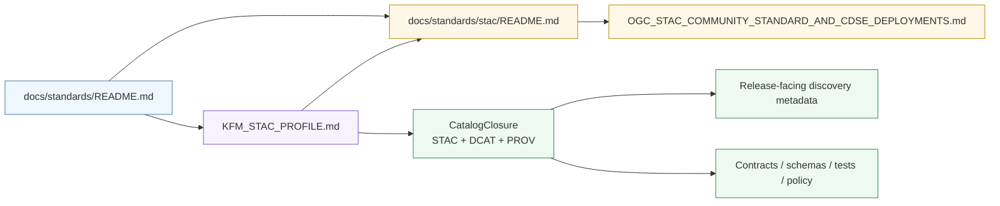

<!-- [KFM_META_BLOCK_V2]
doc_id: kfm://doc/<NEEDS-VERIFICATION>
title: STAC
type: standard
version: v1
status: draft
owners: @bartytime4life
created: <NEEDS-VERIFICATION>
updated: 2026-04-05
policy_label: public
related: [../README.md, ../KFM_STAC_PROFILE.md, ./OGC_STAC_COMMUNITY_STANDARD_AND_CDSE_DEPLOYMENTS.md, ../../../.github/CODEOWNERS]
tags: [kfm, standards, stac]
notes: [This README is directory-scoped and remains subordinate to ../KFM_STAC_PROFILE.md for normative STAC profile law; doc_id and created date need verification; owner is confirmed only at broad /docs/ scope.]
[/KFM_META_BLOCK_V2] -->

# STAC

*Directory README for KFM’s STAC-specific standards lane, routing maintainers toward the profile, lane-local notes, and adjacent machine-facing surfaces.*


| Field | Value |
|---|---|
| **Status** | `experimental` |
| **Doc status** | `draft` |
| **Owners** | `@bartytime4life` *(broad `/docs/` CODEOWNERS owner; narrower STAC-lane ownership is `NEEDS VERIFICATION`)* |
| **Path** | `docs/standards/stac/README.md` |
| **Upstream** | [`../README.md`](../README.md) · [`../KFM_STAC_PROFILE.md`](../KFM_STAC_PROFILE.md) |
| **Downstream** | [`./OGC_STAC_COMMUNITY_STANDARD_AND_CDSE_DEPLOYMENTS.md`](./OGC_STAC_COMMUNITY_STANDARD_AND_CDSE_DEPLOYMENTS.md) |
| **Adjacent machine-facing surfaces** | [`../../../contracts/README.md`](../../../contracts/README.md) · [`../../../schemas/README.md`](../../../schemas/README.md) · [`../../../policy/README.md`](../../../policy/README.md) · [`../../../tests/README.md`](../../../tests/README.md) · [`../../../.github/workflows/README.md`](../../../.github/workflows/README.md) |
| **Evidence posture** | `CONFIRMED` public-`main` lane inventory and adjacent checked-in docs where stated · `INFERRED` routing consequences · `UNKNOWN` non-public workflow, ruleset, and platform settings |

**Quick jump:** [Scope](#scope) · [Repo fit](#repo-fit) · [Inputs](#inputs) · [Exclusions](#exclusions) · [Directory tree](#directory-tree) · [Quickstart](#quickstart) · [Usage](#usage) · [Diagram](#diagram) · [Tables](#tables) · [Task list](#task-list) · [FAQ](#faq) · [Appendix](#appendix)

---

> [!IMPORTANT]
> This directory is the **STAC support lane**, not the sole normative source of KFM STAC policy.  
> Outward STAC profile law belongs in [`../KFM_STAC_PROFILE.md`](../KFM_STAC_PROFILE.md).

> [!NOTE]
> This README is intentionally **public-`main`-grounded**. It keeps checked-in directory facts explicit while leaving non-public workflow, ruleset, and runtime depth visibly `UNKNOWN`.

> [!TIP]
> Status words in this file are literal: `CONFIRMED` means directly supported by the public branch or adjacent checked-in docs; `INFERRED` means conservative routing consequence; `PROPOSED` means doctrine-aligned improvement not yet verified as current branch truth; `UNKNOWN` / `NEEDS VERIFICATION` means the repo evidence here is not strong enough to settle the point.

## Scope

`docs/standards/stac/` is the **lane-local standards surface** for STAC-specific material that is narrower than the parent standards index and less normative than the repo-wide STAC profile.

Use this directory for material such as:

- deployment-facing STAC notes
- interoperability comparisons
- extension-specific guidance
- catalog or search behavior references
- implementation-facing notes that clarify outward discovery behavior without silently becoming canonical KFM law

This README should help a maintainer answer one practical question:

**“Where do STAC-specific notes go once they are too detailed for the parent standards index, but not broad enough to become global KFM doctrine?”**

[Back to top](#stac)

## Repo fit

### Directory role

| Item | Value |
|---|---|
| **Path** | [`docs/standards/stac/README.md`](./README.md) |
| **Path status** | `CONFIRMED` on public `main`; mounted-checkout parity remains `NEEDS VERIFICATION` |
| **Role** | Directory index and routing surface for STAC-specific standards support |
| **Within `docs/standards/`** | Child lane for STAC-only notes that sit below the repo-wide profile |
| **Primary normative upstream** | [`../KFM_STAC_PROFILE.md`](../KFM_STAC_PROFILE.md) |
| **Parent index** | [`../README.md`](../README.md) |
| **Current local note** | [`./OGC_STAC_COMMUNITY_STANDARD_AND_CDSE_DEPLOYMENTS.md`](./OGC_STAC_COMMUNITY_STANDARD_AND_CDSE_DEPLOYMENTS.md) |
| **Ownership signal** | [`../../../.github/CODEOWNERS`](../../../.github/CODEOWNERS) currently confirms only broad `/docs/` ownership |

### Current public lane snapshot

| Surface | Current public `main` state | Why it matters here |
|---|---|---|
| [`./README.md`](./README.md) | **CONFIRMED present** | Revise in place; do **not** describe this file as absent |
| [`./OGC_STAC_COMMUNITY_STANDARD_AND_CDSE_DEPLOYMENTS.md`](./OGC_STAC_COMMUNITY_STANDARD_AND_CDSE_DEPLOYMENTS.md) | **CONFIRMED present** | The lane already has a substantive STAC implementation-alignment note |
| [`../KFM_STAC_PROFILE.md`](../KFM_STAC_PROFILE.md) | **CONFIRMED present** | Normative outward STAC rules stay one level up |
| [`../README.md`](../README.md) | **CONFIRMED present** | Parent standards index is substantive, but it should be kept synchronized with this lane README |
| Narrow `/docs/standards/stac/` CODEOWNERS rule | **UNKNOWN** | Only broad `/docs/` ownership is directly visible on public `main` |

> [!CAUTION]
> Public `main` now shows **two** checked-in files in this subtree. Any lane snapshot that still says `docs/standards/stac/README.md` is absent is stale and should be corrected during review.

## Inputs

Accepted material for this directory:

| Belongs here | Why |
|---|---|
| STAC deployment comparison notes | Narrow, lane-specific reference material |
| STAC API behavior notes | Useful for implementers without changing global doctrine |
| Extension-specific guidance (`query`, `filter`, `fields`, and related STAC-facing details) | STAC-lane detail |
| Profile-adjacent examples | Supports review and implementation |
| Catalog/search interoperability notes | Directly relevant to outward STAC discovery behavior |
| Lane-local registries or checklists that are STAC-only | Keeps the parent profile lean |

## Exclusions

This directory should **not** become a catch-all standards bucket.

| Does **not** belong here | Put it instead |
|---|---|
| Repo-wide KFM STAC normative rules | [`../KFM_STAC_PROFILE.md`](../KFM_STAC_PROFILE.md) |
| Cross-standard closure law (`STAC/DCAT/PROV` together) | [`../README.md`](../README.md) and the sibling profile docs |
| Canonical schemas or schema-family ownership | [`../../../contracts/README.md`](../../../contracts/README.md) · [`../../../schemas/README.md`](../../../schemas/README.md) |
| Contract fixtures, validator entrypoints, or test-family truth | [`../../../tests/README.md`](../../../tests/README.md) |
| Policy-bundle or workflow enforcement claims as settled fact | [`../../../policy/README.md`](../../../policy/README.md) · [`../../../.github/workflows/README.md`](../../../.github/workflows/README.md) |
| Source onboarding contracts | source / contract documentation surfaces |
| Public release manifests or proof artifacts | release / contract / runtime surfaces |
| Generic GIS, metadata, or cartography background | broader docs lanes, not this STAC-specific lane |
| Implementation claims not directly verified in repo | keep out, or mark clearly as `PROPOSED` / `UNKNOWN` in the right design docs |

## Directory tree

Current public subtree:

```text
docs/
└── standards/
    └── stac/
        ├── OGC_STAC_COMMUNITY_STANDARD_AND_CDSE_DEPLOYMENTS.md
        └── README.md
```

Adjacent upstream context:

```text
docs/
└── standards/
    ├── KFM_STAC_PROFILE.md
    ├── README.md
    └── stac/
        ├── OGC_STAC_COMMUNITY_STANDARD_AND_CDSE_DEPLOYMENTS.md
        └── README.md
```

## Quickstart

### Read in the right order

```bash
# 1) Start at the parent standards index
sed -n '1,260p' docs/standards/README.md

# 2) Read the normative KFM STAC profile
sed -n '1,260p' docs/standards/KFM_STAC_PROFILE.md

# 3) Inspect the current STAC lane
ls -la docs/standards/stac/

# 4) Then read the lane-local STAC note(s)
sed -n '1,260p' docs/standards/stac/OGC_STAC_COMMUNITY_STANDARD_AND_CDSE_DEPLOYMENTS.md
```

### Add a new STAC-specific note

```bash
mkdir -p docs/standards/stac
touch docs/standards/stac/<DESCRIPTIVE_STAC_NOTE>.md
```

Recommended placement rule:

1. Put **profile law** in `../KFM_STAC_PROFILE.md`.
2. Put **STAC-lane supporting detail** in this directory.
3. Update this README when the subtree gains or loses meaningful files.

### Review for drift

```bash
git diff -- docs/standards/README.md docs/standards/KFM_STAC_PROFILE.md docs/standards/stac/
```

## Usage

### For maintainers

Use this directory when a document is:

- clearly about **STAC**
- narrower than the parent standards README
- supportive of the KFM STAC profile, not a replacement for it
- best understood as lane-local guidance rather than shared standards law

### For reviewers

Check four things first:

1. Does the file belong in this subtree rather than the parent profile?
2. Does it preserve the KFM distinction between **canonical truth** and **outward discovery metadata**?
3. Does it avoid inventing mounted implementation that has not been verified?
4. Does it stay aligned with the repo-visible directory structure and adjacent standards routing?

### For contributors

A new file here should usually include:

- why it is STAC-specific
- how it relates to `../KFM_STAC_PROFILE.md`
- what is `CONFIRMED`, `INFERRED`, `PROPOSED`, or `UNKNOWN`
- what neighboring doc should link to it
- which adjacent contract / schema / policy / test surfaces it depends on, if any

## Diagram



## Tables

### Responsibility map

| Concern | Primary home | This README’s role |
|---|---|---|
| KFM STAC profile law | [`../KFM_STAC_PROFILE.md`](../KFM_STAC_PROFILE.md) | point to it; do not duplicate it |
| STAC-lane note inventory | [`./README.md`](./README.md) | **primary** |
| STAC-specific deployment and alignment notes | this subtree | **primary** |
| Cross-standard closure framing | [`../README.md`](../README.md) plus sibling profiles | pointer only |
| Machine contracts and fixtures | contract / schema / test surfaces | mention, do not own |
| Workflow or policy enforcement depth | policy and workflow surfaces | mention only when directly verified |

### “Put it here?” test

| Question | If yes | Result |
|---|---|---|
| Is it normative KFM STAC profile law? | yes | move to [`../KFM_STAC_PROFILE.md`](../KFM_STAC_PROFILE.md) |
| Is it a STAC-only supporting note? | yes | keep it in this subtree |
| Is it cross-standard and not specifically STAC-scoped? | yes | move up to the parent standards scope |
| Is it a machine-validated schema or fixture? | yes | do **not** store it here as the authoritative source of truth |
| Is it implementation speculation without repo proof? | yes | block it or downgrade it to a clearly marked proposal elsewhere |

## Task list

### Definition of done for this README

- [x] States the purpose of the STAC subtree
- [x] Shows repo fit and upstream/downstream links
- [x] Lists accepted inputs and exclusions
- [x] Includes a real directory tree
- [x] Includes at least one meaningful Mermaid diagram
- [x] Separates local lane docs from the parent profile
- [x] Corrects the stale “README absent” snapshot
- [x] Leaves doc-id and creation-date gaps visible
- [x] Avoids claiming non-public workflow or platform behavior

### Review gates for future edits

- [ ] Parent standards README downstream links and tree remain accurate
- [ ] `../KFM_STAC_PROFILE.md` and this README do not conflict
- [ ] New files in this subtree are actually STAC-specific
- [ ] Lane-local notes point back to both this README and `../KFM_STAC_PROFILE.md`
- [ ] Any implementation claims are backed by direct repo evidence
- [ ] Ownership lines still match visible `CODEOWNERS` coverage

## FAQ

### Is this the normative KFM STAC spec?

No. This is the **directory README** for the STAC lane.  
The current normative profile document is [`../KFM_STAC_PROFILE.md`](../KFM_STAC_PROFILE.md).

### Why keep STAC notes in a child directory if the profile lives one level up?

Because the profile should stay relatively stable and doctrine-bearing, while this subtree can hold narrower STAC notes, comparisons, deployment details, and extension-oriented references.

### Why are `doc_id` and `created` still placeholders?

Because the current public branch confirms the file, nearby standards docs, and broad ownership coverage, but it does **not** directly confirm a stable KFM document UUID or the original creation date for this README.

### Should schema files live here?

Not as the authoritative machine-validated source of truth. This docs lane may describe them, but it should not quietly replace the real contract / schema / test surfaces.

### What is the highest-value cleanup after revising this README?

Update the parent standards index so its downstream routing and tree stay synchronized with the actual `docs/standards/stac/` subtree.

[Back to top](#stac)

## Appendix

<details>
<summary><strong>Evidence boundary and maintenance notes</strong></summary>

### Evidence boundary

This README is based on:

- the current visible `docs/standards/stac/` subtree on public `main`
- the current visible [`../README.md`](../README.md) and [`../KFM_STAC_PROFILE.md`](../KFM_STAC_PROFILE.md)
- the current visible [`../../../.github/CODEOWNERS`](../../../.github/CODEOWNERS)
- KFM’s standing rule that STAC is an outward discovery surface rather than canonical truth

### Maintenance notes

When this subtree grows, prefer:

- one short lane README
- many narrowly named STAC notes
- one parent normative profile

Avoid:

- duplicating the profile wholesale
- turning this directory into the hidden source of KFM policy
- leaving substantive lane files undocumented
- silently extending non-public implementation claims beyond what the branch proves

### Adjacent cleanup candidates

- add explicit routing from [`../README.md`](../README.md) to [`./README.md`](./README.md) if the parent index still omits this file
- reverify and refresh the verification-boundary text in [`../KFM_STAC_PROFILE.md`](../KFM_STAC_PROFILE.md) if public-`main` evidence is meant to govern there
- verify whether a narrower STAC-specific `CODEOWNERS` rule is warranted
- add cross-links from any new STAC note back to both this README and [`../KFM_STAC_PROFILE.md`](../KFM_STAC_PROFILE.md)

</details>
