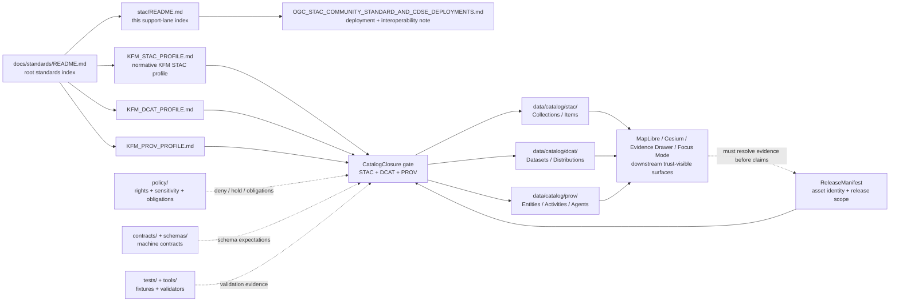

<!-- [KFM_META_BLOCK_V2]
doc_id: kfm://doc/<NEEDS_VERIFICATION_UUID>
title: STAC Standards Lane
type: standard
version: v1
status: draft
owners: @bartytime4life
created: <NEEDS_VERIFICATION_CREATED_DATE>
updated: 2026-04-30
policy_label: public
related: [../README.md, ../KFM_STAC_PROFILE.md, ../KFM_DCAT_PROFILE.md, ../KFM_PROV_PROFILE.md, ./OGC_STAC_COMMUNITY_STANDARD_AND_CDSE_DEPLOYMENTS.md, ../../README.md, ../../runbooks/README.md, ../../../README.md, ../../../contracts/README.md, ../../../schemas/README.md, ../../../schemas/contracts/README.md, ../../../schemas/contracts/v1/README.md, ../../../policy/README.md, ../../../tests/README.md, ../../../tools/catalog/README.md, ../../../tools/validators/README.md, ../../../data/catalog/README.md, ../../../data/catalog/stac/README.md, ../../../data/catalog/dcat/README.md, ../../../data/catalog/prov/README.md]
tags: [kfm, standards, stac, catalog-closure, interoperability]
notes: [doc_id and created date need repo-history verification; owners are inherited from current public /docs/ ownership signals and should be rechecked for this exact path; policy_label is public based on standards-lane posture and should be confirmed before publish; this README is a support-lane index under docs/standards and must not duplicate the authority of ../KFM_STAC_PROFILE.md.]
[/KFM_META_BLOCK_V2] -->

<a id="top"></a>

# STAC Standards Lane

Support-lane index for KFM STAC interoperability notes that sit beneath the repo-wide STAC profile and beside DCAT/PROV catalog-closure standards.

> [!IMPORTANT]
> **Status:** experimental  
> **Document status:** draft  
> **Owners:** `@bartytime4life` *(inherited from current public `/docs/` ownership signals; verify exact path before merge)*  
> **Path:** `docs/standards/stac/README.md`  
> **Repo fit:** child support lane of [`../README.md`](../README.md), downstream of [`../KFM_STAC_PROFILE.md`](../KFM_STAC_PROFILE.md), and adjacent to catalog-closure siblings [`../KFM_DCAT_PROFILE.md`](../KFM_DCAT_PROFILE.md) and [`../KFM_PROV_PROFILE.md`](../KFM_PROV_PROFILE.md).  
> **Quick jumps:** [Scope](#scope) · [Repo fit](#repo-fit) · [Accepted inputs](#accepted-inputs) · [Exclusions](#exclusions) · [Directory tree](#directory-tree) · [Quickstart](#quickstart) · [Usage](#usage) · [Diagram](#diagram) · [Operating tables](#operating-tables) · [Task list](#task-list--definition-of-done) · [FAQ](#faq) · [Appendix](#appendix)


> [!NOTE]
> This README is a **routing and support surface**. It helps maintainers find the right STAC standard, deployment note, catalog lane, validator lane, or release-review surface. It is not the hidden source of KFM STAC law.

---

## Scope

`docs/standards/stac/` is the STAC-specific support lane under KFM’s cross-cutting standards directory.

Use this lane to keep STAC deployment notes, interoperability comparisons, OGC baseline observations, extension-review guidance, and real-world catalog behavior notes close to the repo-wide STAC profile without turning those notes into a second authority root.

In KFM terms:

- **STAC is a catalog/discovery standard for spatiotemporal assets.**
- **KFM STAC profile rules live in [`../KFM_STAC_PROFILE.md`](../KFM_STAC_PROFILE.md).**
- **Catalog payloads belong under catalog data lanes, especially [`../../../data/catalog/stac/`](../../../data/catalog/stac/README.md).**
- **Release trust is proven by catalog closure, evidence, policy, review, receipts, proof objects, and correction lineage — not by STAC JSON alone.**

> [!WARNING]
> A STAC Item, Collection, Catalog, or API response must not be treated as canonical truth just because it renders well, validates structurally, or appears in a public catalog.

[Back to top](#top)

---

## Repo fit

### Path and role

| Item | Value |
|---|---|
| Path | `docs/standards/stac/README.md` |
| Lane role | STAC-specific support index beneath the root standards lane |
| Parent index | [`../README.md`](../README.md) |
| Normative STAC profile | [`../KFM_STAC_PROFILE.md`](../KFM_STAC_PROFILE.md) |
| STAC deployment/support note | [`./OGC_STAC_COMMUNITY_STANDARD_AND_CDSE_DEPLOYMENTS.md`](./OGC_STAC_COMMUNITY_STANDARD_AND_CDSE_DEPLOYMENTS.md) |
| Catalog siblings | [`../KFM_DCAT_PROFILE.md`](../KFM_DCAT_PROFILE.md) · [`../KFM_PROV_PROFILE.md`](../KFM_PROV_PROFILE.md) |
| Catalog payload lanes | [`../../../data/catalog/stac/`](../../../data/catalog/stac/README.md) · [`../../../data/catalog/dcat/`](../../../data/catalog/dcat/README.md) · [`../../../data/catalog/prov/`](../../../data/catalog/prov/README.md) |
| Machine-contract neighbors | [`../../../contracts/`](../../../contracts/README.md) · [`../../../schemas/`](../../../schemas/README.md) · [`../../../schemas/contracts/`](../../../schemas/contracts/README.md) |
| Policy / validation neighbors | [`../../../policy/`](../../../policy/README.md) · [`../../../tests/`](../../../tests/README.md) · [`../../../tools/catalog/`](../../../tools/catalog/README.md) · [`../../../tools/validators/`](../../../tools/validators/README.md) |
| Operational neighbor | [`../../runbooks/`](../../runbooks/README.md) |
| Owner signal | `@bartytime4life`, inherited from broader `/docs/` signals; exact path ownership still **NEEDS VERIFICATION** |

### Reading rule

This directory supports STAC profile work. It does not silently override:

1. the root standards index,
2. the KFM STAC profile,
3. machine-readable schemas/contracts,
4. policy bundles,
5. validator/test gates,
6. catalog payload lanes,
7. release manifests,
8. EvidenceBundle resolution,
9. review/correction records.

[Back to top](#top)

---

## Accepted inputs

Place content here when it is **STAC-specific support material** that helps KFM maintainers understand, compare, or apply STAC without duplicating the normative KFM STAC profile.

| Accepted input | Why it belongs here | Preferred form |
|---|---|---|
| STAC deployment comparison notes | Helps KFM compare its profile against real catalog implementations | Markdown guidance note |
| OGC STAC baseline tracking | Keeps official STAC Core/API version posture visible | Standards-support note |
| STAC API search behavior notes | Helps reviewers reason about paging, sorting, filtering, fields, and query behavior | Compatibility note |
| Collection / Item / Asset convention notes | Supports the profile with examples and deployment lessons | Example-backed note |
| Extension maturity review | Explains why an extension is admitted, held, warned, or denied | Extension review note |
| Catalog federation failure modes | Captures pitfalls such as drifting IDs, missing MIME types, broken links, or undocumented endpoint changes | Review checklist |
| STAC ↔ DCAT ↔ PROV alignment notes | Explains catalog-closure relationships without replacing sibling profiles | Crosswalk note |

> [!TIP]
> A good file in this lane answers “what should maintainers watch for?” rather than “what is KFM’s final machine contract?”

[Back to top](#top)

---

## Exclusions

Do **not** place these here.

| Excluded material | Put it here instead | Reason |
|---|---|---|
| Normative KFM STAC field rules | [`../KFM_STAC_PROFILE.md`](../KFM_STAC_PROFILE.md) | The root STAC profile owns reusable outward STAC law |
| DCAT profile rules | [`../KFM_DCAT_PROFILE.md`](../KFM_DCAT_PROFILE.md) | Dataset/distribution discovery is a sibling profile |
| PROV profile rules | [`../KFM_PROV_PROFILE.md`](../KFM_PROV_PROFILE.md) | Provenance and lineage are sibling profile concerns |
| Checked-in STAC records | [`../../../data/catalog/stac/`](../../../data/catalog/stac/README.md) | Catalog payloads belong in data catalog lanes |
| Raw, work, or quarantine data | `data/raw/`, `data/work/`, or `data/quarantine/` | STAC should not become a lifecycle shortcut |
| Source descriptors | `data/registry/`, `contracts/source/`, or the active source-descriptor home | Source admission is not a STAC support-note concern |
| Policy rules and sensitivity gates | [`../../../policy/`](../../../policy/README.md) | Rights, sensitivity, obligations, and deny-by-default behavior belong in policy |
| Machine schemas and fixtures | [`../../../schemas/`](../../../schemas/README.md), [`../../../contracts/`](../../../contracts/README.md), or [`../../../tests/`](../../../tests/README.md) | Schema-home and fixture-home authority remain explicit neighboring concerns |
| Validator implementation | [`../../../tools/validators/`](../../../tools/validators/README.md) or [`../../../tools/catalog/`](../../../tools/catalog/README.md) | Executable checks should not be hidden in prose |
| Operational runbooks | [`../../runbooks/`](../../runbooks/README.md) | Procedures, rollback drills, and operator steps belong in runbooks |
| UI interpretation or Focus Mode answers | governed API / UI contract surfaces | STAC records can support UI, but they are not AI or UI authority |

[Back to top](#top)

---

## Directory tree

### Current support-lane shape

```text
docs/standards/stac/
├── README.md
└── OGC_STAC_COMMUNITY_STANDARD_AND_CDSE_DEPLOYMENTS.md
```

| Path | Status | Role |
|---|---|---|
| `README.md` | **PROPOSED revision** | This support-lane index |
| `OGC_STAC_COMMUNITY_STANDARD_AND_CDSE_DEPLOYMENTS.md` | **CONFIRMED public-main signal / active-branch parity NEEDS VERIFICATION** | STAC Community Standard and deployment-alignment guidance note |

### Future additions must pass the put-it-here test

If a proposed file starts defining KFM-wide field law, move the work to [`../KFM_STAC_PROFILE.md`](../KFM_STAC_PROFILE.md). If it starts defining executable checks, move it to schemas, contracts, tests, or tools.

[Back to top](#top)

---

## Quickstart

### 1. Decide whether the change is support or standard law

Ask:

- Is this explaining an external STAC baseline, deployment behavior, or interoperability lesson?
- Or is it defining a KFM-wide required field, validator rule, policy outcome, or promotion gate?

If it defines law, route it out of this support lane.

### 2. Start with the owning document

| Task | Start here |
|---|---|
| KFM STAC profile rule | [`../KFM_STAC_PROFILE.md`](../KFM_STAC_PROFILE.md) |
| STAC deployment comparison | [`./OGC_STAC_COMMUNITY_STANDARD_AND_CDSE_DEPLOYMENTS.md`](./OGC_STAC_COMMUNITY_STANDARD_AND_CDSE_DEPLOYMENTS.md) |
| STAC support-lane routing | this README |
| STAC payload review | [`../../../data/catalog/stac/README.md`](../../../data/catalog/stac/README.md) |
| STAC/DCAT/PROV closure | [`../../../data/catalog/README.md`](../../../data/catalog/README.md), plus sibling STAC/DCAT/PROV lanes |
| Validation implementation | [`../../../tools/catalog/README.md`](../../../tools/catalog/README.md), [`../../../tools/validators/README.md`](../../../tools/validators/README.md), and [`../../../tests/README.md`](../../../tests/README.md) |

### 3. Verify branch reality before claiming enforcement

Use the branch under review, not memory.

```sh
git status --short
git branch --show-current

find docs/standards/stac -maxdepth 2 -type f | sort
find docs/standards -maxdepth 2 -type f | sort
find data/catalog -maxdepth 3 -type f | sort
find schemas contracts policy tests tools -maxdepth 4 -type f 2>/dev/null | sort
```

> [!CAUTION]
> Treat these commands as **inspection commands**, not proof that the current file already exists in every checkout. If the branch differs from public-main evidence, update this README to match the branch.

[Back to top](#top)

---

## Usage

### For standards maintainers

Keep this lane narrow. It should make STAC-support material easy to find, but it should not become a second copy of the STAC profile.

When a support note introduces a rule that belongs to the profile, add or revise the rule in [`../KFM_STAC_PROFILE.md`](../KFM_STAC_PROFILE.md), then link back to the support note as rationale.

### For catalog reviewers

Use this lane to understand why a STAC record may be shaped the way it is. Then verify release readiness through catalog payloads, sibling DCAT/PROV records, policy checks, and release evidence.

A public STAC record is only useful when it remains connected to:

- released or release-candidate artifacts,
- meaningful spatial and temporal scope,
- source and derivative roles,
- rights and sensitivity posture,
- EvidenceBundle resolution,
- ReleaseManifest and checksum identity,
- correction and rollback lineage where applicable.

### For implementers

Prefer profile + contract + validator + fixture over prose-only confidence.

Minimum working posture:

1. pin the STAC baseline deliberately,
2. keep Item and Collection identifiers stable,
3. declare extensions rather than smuggling custom fields,
4. include meaningful asset media types and roles,
5. keep links resolvable,
6. cross-check STAC assets against DCAT distributions and PROV entities,
7. fail closed on catalog-identity drift.

### For UI and AI surfaces

STAC can help MapLibre, Cesium, Story Nodes, Evidence Drawer, and Focus Mode find and describe released spatial assets. It must not let rendered pixels, model language, or catalog metadata replace the evidence chain.

[Back to top](#top)

---

## Diagram



[Back to top](#top)

---

## Operating tables

### A. STAC baseline map

| Surface | Baseline posture | KFM handling |
|---|---|---|
| STAC Core | Use current pinned stable baseline for Item, Catalog, Collection, link, asset, and extension semantics | Track in [`../KFM_STAC_PROFILE.md`](../KFM_STAC_PROFILE.md); use this lane for support notes |
| STAC API | Use only where KFM exposes dynamic catalog behavior | Document API-specific behavior separately; do not assume API enforcement from a static catalog lane |
| STAC Extensions | Admit by declared extension URI and maturity review | Production use should be explicit, validated, and justified |
| STAC Items | Describe spatiotemporal asset metadata and links | Must remain downstream of release and evidence state |
| STAC Collections | Group Items with shared metadata, extent, providers, summaries, and license posture | Must use stable identifiers and meaningful discovery fields |
| STAC Assets | Point to files or service endpoints | Must carry meaningful media type, role, and integrity expectations where required |
| Static catalogs | Valid for checked-in file-first catalog surfaces | Keep separate from live API claims |
| STAC APIs | Valid for dynamic search/discovery surfaces | Require route/API documentation, tests, and branch-level proof before claiming behavior |

### B. Routing matrix

| Question | Use this README? | Owning surface |
|---|---:|---|
| “Where do STAC deployment notes live?” | Yes | `docs/standards/stac/` |
| “What is KFM’s required STAC Item shape?” | No | [`../KFM_STAC_PROFILE.md`](../KFM_STAC_PROFILE.md) |
| “Where do actual STAC Collection/Item files go?” | No | [`../../../data/catalog/stac/`](../../../data/catalog/stac/README.md) |
| “How does STAC align with DCAT?” | Partly | [`../KFM_DCAT_PROFILE.md`](../KFM_DCAT_PROFILE.md), catalog closure docs, and support notes |
| “How does STAC align with PROV?” | Partly | [`../KFM_PROV_PROFILE.md`](../KFM_PROV_PROFILE.md), catalog closure docs, and support notes |
| “What validator enforces STAC readiness?” | No | `tools/`, `tests/`, `schemas/`, or `contracts/` after branch verification |
| “Should a source be admitted?” | No | Source registry, policy, contracts, and tests |
| “May this asset be public?” | No | Policy, FAIR+CARE, sovereignty, rights, review, and release surfaces |
| “Does this rendered map prove a claim?” | No | EvidenceBundle, release record, policy decision, and review state |

### C. Minimum readiness checks for STAC-linked release review

| Check | Expected posture | Failure outcome |
|---|---|---|
| Stable Collection identifier | Deterministic and not casually renamed | `ABSTAIN` or `DENY` until citation/cache impact is resolved |
| Item geometry and bbox | Present and meaningful for public discovery | `ABSTAIN` if spatial support is unclear |
| Item datetime or temporal interval | Present when the asset is time-bearing | `ABSTAIN` if temporal support is unclear |
| Asset media type | Present and specific enough for clients | `DENY` or `ABSTAIN` for automation-facing assets |
| Asset role | Declared when role matters: `data`, `thumbnail`, `overview`, `metadata`, or KFM-approved equivalent | `ABSTAIN` when downstream interpretation would be ambiguous |
| Links | `self`, parent/root/collection relationships where applicable | `DENY` if discovery graph is broken |
| Extension declarations | Explicit and compatible with profile | `DENY` for undeclared custom semantics in release-facing records |
| DCAT sibling | Dataset/distribution identity aligned when outward discovery is expected | `ABSTAIN` on missing or mismatched catalog closure |
| PROV sibling | Entity/activity/agent lineage aligned when release traceability is required | `ABSTAIN` on missing lineage |
| Release identity | Asset digest/checksum matches ReleaseManifest or equivalent release identity surface | `DENY` on mismatch |
| Policy posture | Rights, sensitivity, stewardship, and precision controls pass | `DENY` or `HOLD` per policy |
| Evidence resolution | EvidenceRef can resolve to EvidenceBundle where a public claim depends on the asset | `ABSTAIN` if unresolved |

### D. Truth posture for this README

| Claim family | Status | Reading rule |
|---|---|---|
| KFM doctrine: evidence-first, map-first, time-aware, governed | **CONFIRMED doctrine** | Use as project posture |
| `docs/standards/stac/` role as support lane | **INFERRED from standards index + confirmed lane-local routing** | Verify active branch before merge |
| `OGC_STAC_COMMUNITY_STANDARD_AND_CDSE_DEPLOYMENTS.md` as downstream support note | **CONFIRMED public-main signal / NEEDS VERIFICATION active branch** | Treat as a real routed support note, not implementation proof |
| Validators, workflow YAML, and merge-blocking behavior | **UNKNOWN / NEEDS VERIFICATION** | Do not claim enforcement without checked-in files and runs |
| Schema-home authority | **NEEDS VERIFICATION** | Keep references to `contracts/` and `schemas/` explicit until an ADR or equivalent decision settles authority |
| STAC/DCAT/PROV catalog closure as KFM gate | **CONFIRMED doctrine / PROPOSED implementation where not branch-proven** | Use as review requirement; verify executable depth separately |

[Back to top](#top)

---

## Task list / definition of done

Before this README should be treated as stable, complete these review checks.

- [ ] Replace `doc_id` placeholder with a real KFM document identifier.
- [ ] Verify `created` and `updated` dates from git history or governance records.
- [ ] Confirm exact path ownership for `docs/standards/stac/`.
- [ ] Confirm `policy_label` with the repo’s current publication/control policy.
- [ ] Verify the active branch contains `docs/standards/stac/README.md`.
- [ ] Verify the active branch contains or intentionally omits [`./OGC_STAC_COMMUNITY_STANDARD_AND_CDSE_DEPLOYMENTS.md`](./OGC_STAC_COMMUNITY_STANDARD_AND_CDSE_DEPLOYMENTS.md).
- [ ] Confirm [`../README.md`](../README.md) still routes this lane beneath the root STAC profile.
- [ ] Confirm this README does not duplicate rules owned by [`../KFM_STAC_PROFILE.md`](../KFM_STAC_PROFILE.md).
- [ ] Confirm links to DCAT, PROV, catalog, schema, policy, test, and tool neighbors resolve from this path.
- [ ] Confirm executable validator, schema, and workflow claims are either linked to real branch files or marked **PROPOSED / NEEDS VERIFICATION**.
- [ ] Add or link a catalog-closure fixture that catches mismatched STAC/DCAT/PROV identifiers or checksums before publication.
- [ ] Confirm rights, sovereignty, and sensitivity controls are handled outside this lane and linked from relevant profile or policy surfaces.
- [ ] Update the root standards index if the lane contents, maturity, or routing role changes.

[Back to top](#top)

---

## FAQ

### Is this the KFM STAC profile?

No. The KFM STAC profile is [`../KFM_STAC_PROFILE.md`](../KFM_STAC_PROFILE.md). This file is the README for the STAC-specific support directory beneath the standards lane.

### Should this directory hold STAC Items and Collections?

No. Checked-in catalog payloads belong under [`../../../data/catalog/stac/`](../../../data/catalog/stac/README.md) or the active catalog payload home.

### Does every KFM dataset need STAC?

No. STAC is strongest for spatiotemporal assets. DCAT remains the broader outward dataset/distribution discovery profile.

### Can a static STAC catalog be enough?

Yes, when a checked-in or published file-first catalog is the intended surface. A STAC API is a separate dynamic behavior claim and needs route, contract, test, and operational evidence.

### Can a STAC Item point at RAW, WORK, or QUARANTINE material?

Not by default. Public discovery should normally resolve to released or release-candidate artifacts that have passed policy, review, and catalog closure.

### Can STAC replace EvidenceBundle?

No. STAC can point to assets and describe spatiotemporal metadata, but EvidenceBundle resolution is what makes a claim inspectable inside KFM.

### What should happen when STAC/DCAT/PROV disagree?

Do not “warn and continue” for release-facing outputs. Treat mismatched identifiers, links, checksums, or lineage as a catalog-closure failure until the discrepancy is explained, corrected, or intentionally held.

### Can proposed or pilot STAC extensions be used?

Only with explicit review. The default production posture should prefer stable, declared, validated extension use unless a policy-approved exception exists.

### What if the OGC baseline changes?

Record the external change, check client/tool compatibility, update the support note, then revise [`../KFM_STAC_PROFILE.md`](../KFM_STAC_PROFILE.md) only after the KFM impact is clear.

[Back to top](#top)

---

## Appendix

<details>
<summary><strong>Appendix A — evidence labels used in this README</strong></summary>

| Label | Meaning |
|---|---|
| **CONFIRMED** | Supported by current visible project documents, retrieved repo-facing Markdown snapshots, or directly inspected evidence |
| **INFERRED** | Conservative interpretation from confirmed adjacent surfaces or KFM doctrine |
| **PROPOSED** | Design or implementation guidance not proven as current branch behavior |
| **UNKNOWN** | Not verified strongly enough to state as fact |
| **NEEDS VERIFICATION** | A specific branch, ownership, date, policy, validator, workflow, or runtime check is required |

</details>

<details>
<summary><strong>Appendix B — merge-time authoring checklist</strong></summary>

When editing this lane, review these neighboring files together:

- [`../README.md`](../README.md)
- [`../KFM_STAC_PROFILE.md`](../KFM_STAC_PROFILE.md)
- [`../KFM_DCAT_PROFILE.md`](../KFM_DCAT_PROFILE.md)
- [`../KFM_PROV_PROFILE.md`](../KFM_PROV_PROFILE.md)
- [`./OGC_STAC_COMMUNITY_STANDARD_AND_CDSE_DEPLOYMENTS.md`](./OGC_STAC_COMMUNITY_STANDARD_AND_CDSE_DEPLOYMENTS.md)
- [`../../../data/catalog/stac/README.md`](../../../data/catalog/stac/README.md)
- [`../../../data/catalog/dcat/README.md`](../../../data/catalog/dcat/README.md)
- [`../../../data/catalog/prov/README.md`](../../../data/catalog/prov/README.md)
- [`../../../contracts/README.md`](../../../contracts/README.md)
- [`../../../schemas/README.md`](../../../schemas/README.md)
- [`../../../schemas/contracts/README.md`](../../../schemas/contracts/README.md)
- [`../../../policy/README.md`](../../../policy/README.md)
- [`../../../tests/README.md`](../../../tests/README.md)
- [`../../../tools/catalog/README.md`](../../../tools/catalog/README.md)
- [`../../../tools/validators/README.md`](../../../tools/validators/README.md)

</details>

<details>
<summary><strong>Appendix C — STAC support-note starter template</strong></summary>

```md
<!-- [KFM_META_BLOCK_V2]
doc_id: kfm://doc/<NEEDS_VERIFICATION_UUID>
title: <STAC support note title>
type: standard
version: v1
status: draft
owners: @bartytime4life
created: <NEEDS_VERIFICATION_CREATED_DATE>
updated: <NEEDS_VERIFICATION_UPDATED_DATE>
policy_label: public
related: [./README.md, ../KFM_STAC_PROFILE.md, ../KFM_DCAT_PROFILE.md, ../KFM_PROV_PROFILE.md]
tags: [kfm, standards, stac]
notes: [Support note only; does not replace KFM_STAC_PROFILE.md.]
[/KFM_META_BLOCK_V2] -->

# <STAC support note title>

_One-line purpose._

> [!IMPORTANT]
> State whether this note is external-baseline tracking, deployment comparison, profile rationale, or validation guidance.

## Scope

## Repo fit

## External baseline

## KFM interpretation

## Review checks

## Open verification
```

</details>

<details>
<summary><strong>Appendix D — external reference anchors</strong></summary>

- [OGC STAC standards page][ogc-stac]
- [OGC STAC Community Standard 1.1.0][ogc-stac-core]
- [OGC STAC API Community Standard 1.0.0][ogc-stac-api]
- [W3C DCAT Version 3][w3c-dcat]
- [W3C PROV-O][w3c-prov]
- [GeoParquet 1.1.0][geoparquet]

</details>

[ogc-stac]: https://www.ogc.org/standards/stac/
[ogc-stac-core]: https://docs.ogc.org/cs/25-004/25-004.html
[ogc-stac-api]: https://docs.ogc.org/cs/25-005/25-005.html
[w3c-dcat]: https://www.w3.org/TR/vocab-dcat-3/
[w3c-prov]: https://www.w3.org/TR/prov-o/
[geoparquet]: https://geoparquet.org/releases/v1.1.0/

[Back to top](#top)