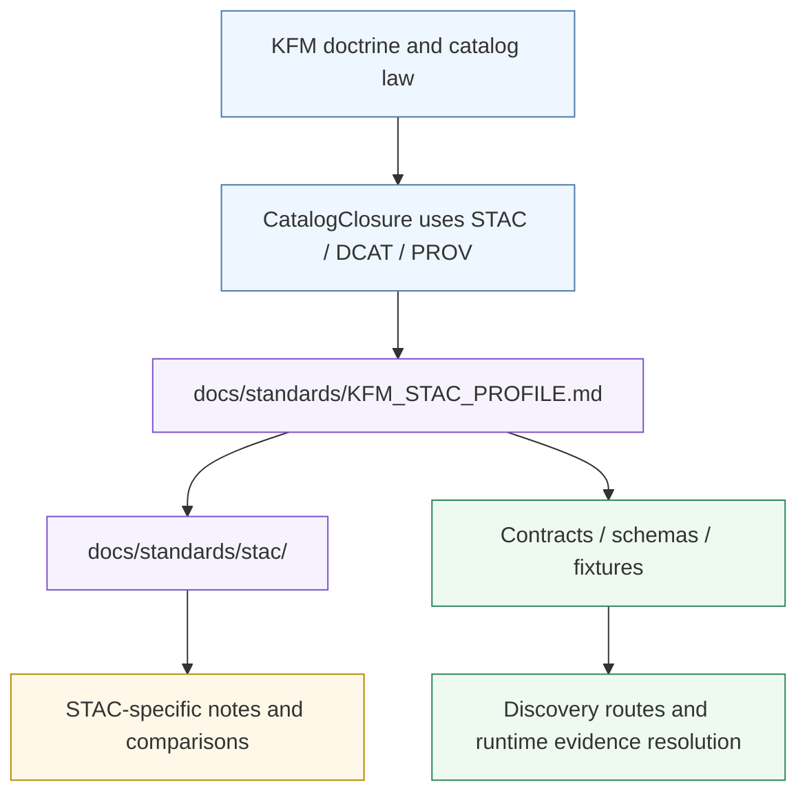

<!-- [KFM_META_BLOCK_V2]
doc_id: kfm://doc/<TBD-UUID>
title: STAC
type: standard
version: v1
status: draft
owners: @bartytime4life
created: <YYYY-MM-DD>
updated: <YYYY-MM-DD>
policy_label: public
related: [../README.md, ../KFM_STAC_PROFILE.md, ./OGC_STAC_COMMUNITY_STANDARD_AND_CDSE_DEPLOYMENTS.md, ../../../.github/CODEOWNERS]
tags: [kfm, standards, stac]
notes: [Owner is inferred from the current /docs/ CODEOWNERS rule; doc_id and dates need verification; this README is directory-scoped and should remain subordinate to ../KFM_STAC_PROFILE.md for normative KFM STAC profile rules.]
[/KFM_META_BLOCK_V2] -->

# STAC

*Directory index for KFM’s STAC-specific standards lane, references, and implementation-facing notes.*

> [!IMPORTANT]
> This directory is the **STAC support lane**, not the sole normative source of KFM STAC policy.  
> The current repo-wide profile document is [`../KFM_STAC_PROFILE.md`](../KFM_STAC_PROFILE.md), which should remain the primary place for outward KFM STAC profile rules.

| Field | Value |
|---|---|
| **Status** | experimental directory · draft README |
| **Owners** | `@bartytime4life` *(current broad `/docs/` owner; narrower lane ownership is NEEDS VERIFICATION)* |
| **Standards role** | STAC-specific support, references, deployment notes, and lane-local guidance |
| **Repo fit** | Child lane under [`docs/standards/`](../README.md) |
| **Primary upstream** | [`../KFM_STAC_PROFILE.md`](../KFM_STAC_PROFILE.md) |
| **Current verified file in this subtree** | [`./OGC_STAC_COMMUNITY_STANDARD_AND_CDSE_DEPLOYMENTS.md`](./OGC_STAC_COMMUNITY_STANDARD_AND_CDSE_DEPLOYMENTS.md) |


**Quick jump:** [Scope](#scope) · [Repo fit](#repo-fit) · [Inputs](#inputs) · [Exclusions](#exclusions) · [Directory tree](#directory-tree) · [Quickstart](#quickstart) · [Usage](#usage) · [Diagram](#diagram) · [Tables](#tables) · [Task list](#task-list) · [FAQ](#faq) · [Appendix](#appendix)

---

> [!NOTE]
> This README is intentionally **repo-grounded**. It reflects the current visible public tree and the attached KFM doctrine set, while keeping implementation depth visible where direct repo evidence is incomplete.

## Scope

This directory exists to hold **STAC-specific supporting material** for Kansas Frontier Matrix:

- deployment-facing STAC notes
- interoperability notes and comparison docs
- extension-specific guidance
- catalog/search behavior references
- examples that are narrower than the repo-wide STAC profile

It should help a maintainer answer: **“Where do STAC-specific docs go once they are too detailed for the parent standards index, but not broad enough to become global KFM doctrine?”**

[Back to top](#stac)

## Repo fit

**Path:** `docs/standards/stac/`

| Relationship | Path | Role |
|---|---|---|
| **Parent directory** | [`../`](../README.md) | Standards-wide landing page and directory index |
| **Primary upstream doctrine for this lane** | [`../KFM_STAC_PROFILE.md`](../KFM_STAC_PROFILE.md) | KFM’s outward STAC profile and positioning |
| **Local lane note** | [`./OGC_STAC_COMMUNITY_STANDARD_AND_CDSE_DEPLOYMENTS.md`](./OGC_STAC_COMMUNITY_STANDARD_AND_CDSE_DEPLOYMENTS.md) | STAC-specific implementation/reference note |
| **Ownership source** | [`../../../.github/CODEOWNERS`](../../../.github/CODEOWNERS) | Current visible docs ownership fallback |

### Current verified snapshot

| Item | Status | Notes |
|---|---|---|
| `docs/standards/stac/README.md` | **absent in current visible tree** | This file is being created to make the lane navigable |
| `docs/standards/stac/OGC_STAC_COMMUNITY_STANDARD_AND_CDSE_DEPLOYMENTS.md` | **present** | Currently visible as the only checked-in file in this subtree |
| `docs/standards/KFM_STAC_PROFILE.md` | **present** | Substantive draft profile already exists one level up |
| `docs/standards/README.md` | **present** | Parent standards README exists and should link here cleanly |
| Narrow STAC-specific CODEOWNERS entry | **UNKNOWN** | Only broad `/docs/` ownership is currently verified |

> [!CAUTION]
> The parent standards index may still describe parts of the STAC lane as scaffold-only.  
> Direct inspection shows that `../KFM_STAC_PROFILE.md` is already substantive, so this subtree README should **complement** that file rather than duplicate or contradict it.

## Inputs

Accepted material for this directory:

| Belongs here | Why |
|---|---|
| STAC deployment comparison notes | Narrow, lane-specific reference material |
| STAC API behavior notes | Useful for implementers without changing global doctrine |
| Extension-specific guidance (`query`, `filter`, `fields`, etc.) | STAC-lane detail |
| Profile-adjacent examples | Supports review and implementation |
| Catalog/search interoperability notes | Directly relevant to STAC discovery behavior |
| Lane-local registries or checklists that are STAC-only | Keeps profile doc lean |

## Exclusions

This directory should **not** become a catch-all standards bucket.

| Does **not** belong here | Put it instead |
|---|---|
| Repo-wide KFM STAC normative rules | [`../KFM_STAC_PROFILE.md`](../KFM_STAC_PROFILE.md) |
| Cross-standard policy law (`STAC/DCAT/PROV` together) | [`../README.md`](../README.md) or broader standards/governance docs |
| Canonical schemas, fixtures, validators | repo contract/schema/test surfaces, not this docs lane |
| Source onboarding contracts | source / contract documentation surfaces |
| Public release manifests or proof artifacts | release / contract / runtime surfaces |
| Generic GIS, metadata, or cartography background | broader docs lanes, not this STAC-specific lane |
| Implementation claims not verified in repo | keep out, or mark clearly as `PROPOSED` / `UNKNOWN` in the right design docs |

## Directory tree

Current visible subtree:

```text
docs/
└── standards/
    └── stac/
        └── OGC_STAC_COMMUNITY_STANDARD_AND_CDSE_DEPLOYMENTS.md
```

Adjacent upstream context:

```text
docs/
└── standards/
    ├── README.md
    ├── KFM_STAC_PROFILE.md
    └── stac/
        └── README.md   # this file
```

## Quickstart

### Read in the right order

```bash
# 1) Start at the parent standards index
sed -n '1,220p' docs/standards/README.md

# 2) Read the normative KFM STAC profile
sed -n '1,260p' docs/standards/KFM_STAC_PROFILE.md

# 3) Then read the lane-local STAC note(s)
sed -n '1,260p' docs/standards/stac/OGC_STAC_COMMUNITY_STANDARD_AND_CDSE_DEPLOYMENTS.md
```

### Add a new STAC-specific note

```bash
mkdir -p docs/standards/stac
touch docs/standards/stac/<DESCRIPTIVE_STAC_NOTE>.md
```

Recommended placement rule:

1. Put **profile law** in `../KFM_STAC_PROFILE.md`.
2. Put **STAC-lane supporting detail** in this directory.
3. Update this README when the subtree gains or loses meaningful files.

### Review for drift

```bash
git diff -- docs/standards/README.md docs/standards/KFM_STAC_PROFILE.md docs/standards/stac/
```

## Usage

### For maintainers

Use this directory when a document is:

- clearly about **STAC**
- narrower than the parent standards README
- supportive of the KFM STAC profile, not a replacement for it

### For reviewers

Check four things first:

1. Does the file belong in this subtree rather than the parent profile?
2. Does it preserve the KFM distinction between **canonical truth** and **outward discovery metadata**?
3. Does it avoid inventing mounted implementation that has not been verified?
4. Does it stay aligned with the repo-visible directory structure?

### For contributors

A new file here should usually include:

- why it is STAC-specific
- how it relates to `../KFM_STAC_PROFILE.md`
- what is `CONFIRMED`, `INFERRED`, `PROPOSED`, or `UNKNOWN`
- what neighboring doc should link to it

## Diagram



## Tables

### Responsibility map

| Concern | Primary home | This directory’s role |
|---|---|---|
| KFM STAC positioning | `../KFM_STAC_PROFILE.md` | reference and extension support |
| STAC-lane note inventory | `./README.md` | **primary** |
| STAC-specific deployment examples | this subtree | **primary** |
| Cross-standard overview | `../README.md` | downstream pointer only |
| Contracts / schema enforcement | contract/schema/test surfaces | mention, do not own |
| Runtime evidence resolution | governed runtime surfaces | mention, do not own |

### “Put it here?” test

| Question | If yes | Result |
|---|---|---|
| Is it normative KFM STAC profile law? | yes | move to `../KFM_STAC_PROFILE.md` |
| Is it a STAC-only supporting note? | yes | keep in this subtree |
| Is it cross-standard and not STAC-specific? | yes | move up to parent standards scope |
| Is it a machine-validated schema or fixture? | yes | do **not** store here as the source of truth |
| Is it implementation speculation without repo proof? | yes | block or downgrade to clearly marked proposal elsewhere |

## Task list

### Definition of done for this README

- [x] States the purpose of the STAC subtree
- [x] Shows repo fit and upstream/downstream links
- [x] Lists accepted inputs and exclusions
- [x] Includes a real directory tree
- [x] Includes at least one meaningful Mermaid diagram
- [x] Separates local lane docs from the parent profile
- [x] Avoids claiming unverified implementation
- [x] Leaves ownership/date/doc-id gaps visible

### Review gates for future edits

- [ ] Parent standards README links remain accurate
- [ ] `../KFM_STAC_PROFILE.md` and this README do not conflict
- [ ] New files in this subtree are actually STAC-specific
- [ ] Stale scaffold language is removed when superseded
- [ ] Any implementation claims are backed by direct repo evidence

## FAQ

### Is this the normative KFM STAC spec?

No. This is the **directory README** for the STAC lane.  
The current normative profile document is [`../KFM_STAC_PROFILE.md`](../KFM_STAC_PROFILE.md).

### Why keep STAC notes in a child directory if the profile lives one level up?

Because the profile should stay relatively stable and doctrine-bearing, while this subtree can hold narrower STAC notes, comparisons, deployment details, and extension-oriented references.

### Should schema files live here?

Not as the authoritative machine-validated source of truth. This docs lane may describe them, but it should not quietly replace the real contract/schema/test surfaces.

### What is the highest-value cleanup after adding this README?

Refresh the parent standards index so its STAC snapshot matches the currently visible repo reality.

[Back to top](#stac)

## Appendix

<details>
<summary><strong>Evidence boundary and maintenance notes</strong></summary>

### Evidence boundary

This README is based on:

- the current visible repo structure and nearby docs
- the current visible `CODEOWNERS` rule for `/docs/`
- the attached KFM doctrine set, especially the outward use of `STAC/DCAT/PROV` in catalog closure and release-bearing discovery

### Maintenance notes

When this subtree grows, prefer:

- one short lane README
- many narrowly named STAC notes
- one parent normative profile

Avoid:

- duplicating the profile wholesale
- turning this directory into the hidden source of KFM policy
- leaving scaffold files undocumented after they become substantive

### Adjacent cleanup candidates

- refresh `docs/standards/README.md` if its STAC snapshot still understates current file maturity
- verify whether a narrower STAC-specific `CODEOWNERS` rule is warranted
- add cross-links from any new STAC note back to both this README and `../KFM_STAC_PROFILE.md`

</details>
