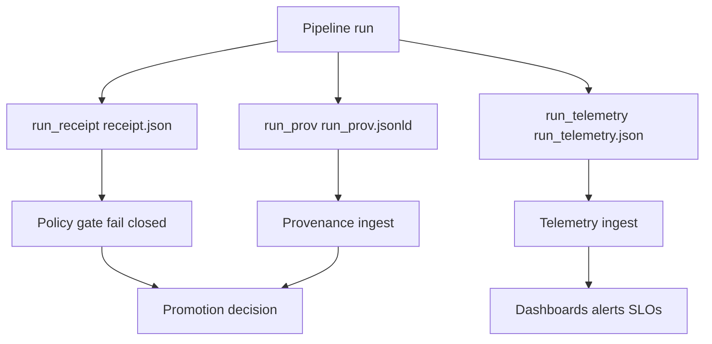

<!-- [KFM_META_BLOCK_V2]
doc_id: kfm://doc/0b2f9e34-9a3c-4c4c-8c5c-0e2b2a0c43d2
title: Pipeline Run Telemetry Standard
type: standard
version: v1
status: draft
owners: KFM Core Platform
created: 2026-03-04
updated: 2026-03-04
policy_label: restricted
related: [
  docs/standards/telemetry/PIPELINE_RUN_TELEMETRY.md,
  docs/reliability/slo/,
  prov/templates/run.jsonld
]
tags: [kfm, telemetry, observability, pipeline, provenance]
notes: [
  "Defines the minimum telemetry contract for every pipeline run, including the run_telemetry.json artifact.",
  "Pairs with run_receipt and PROV outputs; does not replace them."
]
[/KFM_META_BLOCK_V2] -->

# Pipeline Run Telemetry Standard
Standard contract for emitting, validating, and storing per-run pipeline telemetry in KFM.

> **IMPACT**
> - **Status:** draft
> - **Owners:** KFM Core Platform
> - **Policy label:** restricted
> - **Applies to:** ingestion connectors, pipelines, watchers, CI runners, orchestrators
>
> **Badges**
> - 
> - 
> - 
>
> **Quick links**
> - [Scope](#scope)
> - [Where it fits](#where-it-fits)
> - [Contract](#contract)
> - [Schema](#schema)
> - [Quickstart](#quickstart)
> - [Validation and CI gates](#validation-and-ci-gates)
> - [Governance and safety](#governance-and-safety)
> - [Appendix](#appendix)

---

## Evidence status
- **CONFIRMED:** KFM requires operational observability signals for ingest runs (success/fail, duration, rows/bytes, retries) and freshness tracking.  
- **CONFIRMED:** KFM’s reliability design includes canonical SLIs and per-pipeline SLO threshold files.  
- **CONFIRMED:** KFM run receipts commonly include an *observability* section (trace/span IDs, logs URL) and run-level metrics.
- **PROPOSED:** The concrete `run_telemetry.json` JSON shape, field names, and storage conventions defined in this document.
- **UNKNOWN:** The exact production implementation of `TELEMETRY_INGEST` and its backing storage/index (define via infra ADR when selected).

---

## Scope
### Purpose
**PROPOSED:** Define a **minimum telemetry contract** for every pipeline run, enabling:
- Detecting staleness and SLO violations.
- Comparing canary vs baseline runs via canonical SLIs.
- Debugging failures without leaking sensitive content.
- Joining operational telemetry to provenance (`PROV`) and audit artifacts (`run_receipt`).

### Non-goals
**PROPOSED:** This standard does **not**:
- Define domain-specific scientific metrics (those belong in domain telemetry docs).
- Replace `run_receipt/receipt.json` or `run_prov.jsonld`.
- Specify a single observability backend vendor or deployment topology.

[Back to top](#pipeline-run-telemetry-standard)

---

## Where it fits
**CONFIRMED:** KFM pipelines are connector-driven and treat runs and backfills as explicit, auditable executions with operational metadata.  
**PROPOSED:** `run_telemetry.json` is the per-run “ops envelope” that complements:
- **Run receipt** for policy gates and artifact digests
- **PROV** for lineage graphs
- **Catalogs** for published dataset discovery

### System flow


[Back to top](#pipeline-run-telemetry-standard)

---

## Inputs
**PROPOSED:** `run_telemetry.json` may be populated from:
- Orchestrator environment (GitHub Actions run, Dagster run, Prefect flow, etc.)
- Pipeline spec hash (`spec_hash`)
- Step-level timers and counters (bytes, rows, retries, errors)
- Quality checks (missingness, drift, geometry validity counts)
- Resource utilization (CPU time, memory, disk)
- Energy / CO₂e / cost estimation (when enabled)

---

## Exclusions
**PROPOSED:** Telemetry must **not** contain:
- Secrets (tokens, cookies, signed URLs, credential material)
- Raw payload samples from restricted sources
- PII or person-level identifiers unless explicitly approved and governed
- High-precision sensitive coordinates (use generalized aggregates)

**PROPOSED:** If any of the above are needed for debugging, emit them only into a **restricted** debug channel with explicit governance review, and link via an access-controlled `logs_ref` rather than embedding in `run_telemetry.json`.

---

## Contract
### Required artifacts per run
**PROPOSED:** Every pipeline run MUST emit these artifacts:
1. `run_receipt/receipt.json`  
2. `run_telemetry.json` (this document)  
3. `run_prov.json` or `run_prov.jsonld` (PROV chain)

**PROPOSED:** All three MUST share correlation keys:
- `run_id`
- `pipeline.name`
- `pipeline.variant`
- `spec_hash`

### Required minimum telemetry
**PROPOSED:** `run_telemetry.json` MUST include, at minimum:
- Run start/end timestamps and computed duration
- Success/failure status and error counts
- Rows/bytes processed (when applicable)
- Retry counts
- Freshness markers (what “as-of” timestamp the data represents, if known)
- Links to `run_receipt` and `PROV` outputs

[Back to top](#pipeline-run-telemetry-standard)

---

## Schema
### Versioning
**PROPOSED:** Telemetry is versioned by a stable schema identifier:
- `schema_id`: `kfm.telemetry.pipeline_run.v1`
- `schema_version`: `1.0.0`

**PROPOSED:** Any breaking change MUST bump `schema_version` major and MUST remain backwards readable for at least one minor release cycle.

### Top-level shape
**PROPOSED:** `run_telemetry.json` is a single JSON object.

```json
{
  "schema_id": "kfm.telemetry.pipeline_run.v1",
  "schema_version": "1.0.0",
  "emitted_at": "2026-03-04T18:22:11Z",

  "run": {
    "run_id": "1e8a9c2c-0c12-4b2f-9b5e-4b43b7e3e9c1",
    "started_at": "2026-03-04T18:10:00Z",
    "ended_at": "2026-03-04T18:21:59Z",
    "status": "success",
    "status_detail": null
  },

  "pipeline": {
    "name": "pipelineX",
    "variant": "canary",
    "version": "git:abcdef123",
    "domain": "energy",
    "data_source": "EIA"
  },

  "correlation": {
    "spec_hash": "sha256:...",
    "git_sha": "abcdef123",
    "orchestrator": {
      "type": "github_actions",
      "run_id": "1234567890",
      "attempt": 1
    }
  },

  "io": {
    "rows_read": 0,
    "rows_written": 0,
    "bytes_downloaded": 0,
    "bytes_written": 0
  },

  "retries": {
    "retry_count": 0,
    "max_retry_count": 0
  },

  "quality": {
    "missingness_pct": null,
    "geometry_error_count": null,
    "data_drift_psi": null,
    "record_diff_pct": null
  },

  "sli": {
    "sli_latency_ms_p95": null,
    "sli_error_rate_pct": null,
    "sli_data_drift_psi": null,
    "sli_record_diff_pct": null
  },

  "resources": {
    "cpu_seconds": null,
    "max_rss_mb": null,
    "disk_bytes_written": null
  },

  "energy": {
    "kwh": null,
    "co2e_kg": null,
    "cost_usd": null,
    "estimation_method": null
  },

  "steps": [
    {
      "name": "acquire",
      "kind": "connector.acquire",
      "started_at": "2026-03-04T18:10:10Z",
      "ended_at": "2026-03-04T18:11:45Z",
      "status": "success",
      "io": { "rows_read": null, "rows_written": null, "bytes_downloaded": 0, "bytes_written": 0 },
      "resources": { "cpu_seconds": null, "max_rss_mb": null },
      "errors": []
    }
  ],

  "links": {
    "run_receipt_ref": "run_receipt/receipt.json",
    "prov_ref": "run_prov.json",
    "logs_ref": null,
    "trace_id": null,
    "span_id": null
  }
}
```

### Field rules
**PROPOSED:** Unless otherwise stated:
- Timestamps MUST be ISO-8601 with timezone (prefer UTC).
- Durations MUST be derivable from `started_at` and `ended_at` (do not store only duration).
- Byte counters are integers in **bytes**.
- Row counters are integers and MUST specify what a “row” means in pipeline docs if ambiguous.
- Percent fields are expressed as **0–100** (not 0–1).
- Nullable fields MUST be `null` (not omitted) if the pipeline supports the signal but could not compute it.

### Required fields table

| Field | Type | Required | Notes |
|---|---:|:---:|---|
| `schema_id` | string | ✅ | Fixed ID for this standard |
| `schema_version` | string | ✅ | Semver |
| `emitted_at` | string | ✅ | ISO-8601 |
| `run.run_id` | string | ✅ | UUID |
| `run.started_at` | string | ✅ | ISO-8601 |
| `run.ended_at` | string | ✅ | ISO-8601 (even on failure if possible) |
| `run.status` | string | ✅ | `success` or `failure` |
| `pipeline.name` | string | ✅ | Stable pipeline name |
| `pipeline.variant` | string | ✅ | `prod`, `canary`, `shadow`, etc |
| `correlation.spec_hash` | string | ✅ | Content-addressed spec hash |
| `links.run_receipt_ref` | string | ✅ | Path or URI |
| `links.prov_ref` | string | ✅ | Path or URI |
| `steps` | array | ✅ | Empty array allowed |

[Back to top](#pipeline-run-telemetry-standard)

---

## Canonical SLIs and SLO wiring
### Canonical SLIs
**CONFIRMED:** KFM canonical SLIs include:
- `sli_latency_ms_p95`
- `sli_error_rate_pct`
- `sli_data_drift_psi`
- `sli_record_diff_pct`

**PROPOSED:** Populate these in `run_telemetry.json.sli` when possible. If unavailable, set `null` and populate the best available proxies under `quality.*` and `resources.*`.

### Per-pipeline thresholds
**CONFIRMED:** Thresholds are defined per pipeline in:
- `docs/reliability/slo/<pipeline>.yaml`

**PROPOSED:** CI canary gates MUST compare computed SLIs to that file and fail closed when thresholds are violated.

---

## OpenTelemetry and Prometheus mapping
**CONFIRMED:** KFM telemetry may be emitted as Prometheus metrics and OpenTelemetry spans (tagged with `data_source` and `domain`).

### Tracing conventions
**PROPOSED:**
- Root span name: `kfm.pipeline.run`
- Child span per step: `kfm.pipeline.step`
- Required span attributes:
  - `kfm.run_id`
  - `kfm.pipeline`
  - `kfm.variant`
  - `kfm.spec_hash`

### Metrics conventions
**PROPOSED:** Prefer stable metric names for dashboards and alerts:
- `kfm_run_duration_seconds`
- `kfm_rows_read_total`
- `kfm_rows_written_total`
- `kfm_bytes_downloaded_total`
- `kfm_bytes_written_total`
- `kfm_validation_status` with label `status=pass|fail`

---

## Storage conventions
### Paths
**PROPOSED:** A run’s telemetry MUST be persistable as an artifact and retrievable by `run_id`.  
Recommended storage patterns:
- CI artifact: `run_telemetry.json` uploaded with other run artifacts
- Object store canonical path: `data/telemetry/runs/<pipeline>/<run_id>/run_telemetry.json`
- Release-referenced summary: `releases/<release_tag>/<pipeline>-telemetry.json`

### Directory tree
```text
docs/
  standards/
    telemetry/
      PIPELINE_RUN_TELEMETRY.md
docs/
  reliability/
    slo/
      pipelineX.yaml
prov/
  templates/
    run.jsonld
data/
  telemetry/
    runs/
      pipelineX/
        <run_id>/
          run_telemetry.json
```

[Back to top](#pipeline-run-telemetry-standard)

---

## Quickstart
### Emit telemetry from a pipeline
**PROPOSED:**
1. Generate `run_id` at start.
2. Record `started_at`.
3. Wrap each step with timers and counters.
4. Write `run_telemetry.json` at the end (even on failure if possible).
5. Attach correlation links to `run_receipt` and `PROV` outputs.

### Minimal pseudocode
```python
# pseudocode
run_id = uuid4()
started_at = now_utc_iso()

telemetry = new_telemetry(run_id=run_id, started_at=started_at, ...)

for step in pipeline_steps:
    with measure_step(telemetry, step_name=step.name):
        step.run()

telemetry["run"]["ended_at"] = now_utc_iso()
telemetry["run"]["status"] = "success"
write_json("run_telemetry.json", telemetry)
```

---

## Validation and CI gates
### JSON schema validation
**PROPOSED:** CI MUST validate:
- JSON is parseable
- Required fields exist and types match
- No disallowed keys are present (denylist)

### Fail-closed policy checks
**CONFIRMED:** KFM uses fail-closed policy gates for run artifacts.  
**PROPOSED:** Add a telemetry policy pack that denies:
- Missing `run_id`, `started_at`, `ended_at`, or `spec_hash`
- Missing `links.run_receipt_ref` or `links.prov_ref`
- Presence of keys matching `secret`, `token`, `password`, `cookie`, `authorization`
- Inclusion of raw coordinate arrays for sensitive-location layers

### Definition of Done
- [ ] Telemetry emitted for success and failure runs
- [ ] Schema validation runs in CI
- [ ] Policy gate checks telemetry (fail closed)
- [ ] Telemetry links to `run_receipt` and `PROV`
- [ ] SLIs computed or explicitly set to `null`
- [ ] No restricted payloads embedded

[Back to top](#pipeline-run-telemetry-standard)

---

## Governance and safety
**CONFIRMED:** KFM uses sensitivity classes and treats redaction as a first-class transformation with provenance.  
**PROPOSED:** Apply the same mindset to telemetry:
- Keep telemetry content minimal and aggregate.
- Store sensitive debug details behind access control and reference them by link.
- Never use telemetry alone as end-user evidence; it is operational metadata.

---

## FAQ
### Is telemetry required for every run?
**PROPOSED:** Yes for any run that can publish or promote artifacts. For purely local experiments, telemetry is recommended but not required.

### Can telemetry be used for Focus Mode citations?
**PROPOSED:** No. Telemetry supports ops and audit trails; user-facing answers must cite dataset versions and source records.

---

## Appendix
### Unknown items to resolve
**UNKNOWN:** Exact `TELEMETRY_INGEST` contract and backing store.
- Smallest verification steps:
  1. Choose the telemetry backend (Prometheus, OTEL collector, both).
  2. Define ingest API or bucket conventions.
  3. Add an ADR with retention and access policy.

### Related documents
- `docs/reliability/slo/<pipeline>.yaml` for thresholds
- `prov/templates/run.jsonld` for run provenance graph template
- `docs/standards/energy/README.md` for energy and carbon telemetry conventions
