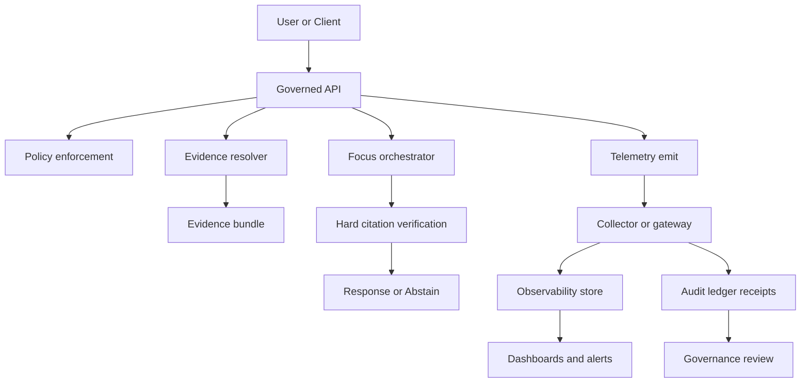

<!-- [KFM_META_BLOCK_V2]
doc_id: kfm://doc/8b2a64c0-9c44-4ff7-9d23-0c5fb1e2b9f4
title: KFM Telemetry Standard
type: standard
version: v1
status: draft
owners: @Kansas-Frontier-Matrix/core, @Kansas-Frontier-Matrix/ops
created: 2026-03-04
updated: 2026-03-04
policy_label: public
related: [
  "docs/standards/governance/ROOT-GOVERNANCE.md",
  "docs/standards/faircare/FAIRCARE-GUIDE.md",
  "docs/specs/telemetry/",
  "schemas/telemetry/"
]
tags: [kfm, telemetry, observability, governance, otel, audit]
notes: [
  "This standard defines telemetry requirements and governance constraints. It does not define every event schema; see docs/specs/telemetry/ for schemas."
]
[/KFM_META_BLOCK_V2] -->

# KFM Telemetry Standard
Define **how KFM emits, validates, stores, and governs telemetry** so reliability signals also serve as **auditable evidence** without leaking sensitive data.

> **IMPACT**
>
> **Status:** Experimental (draft, intended for CI-enforcement)  
> **Owners:** `@Kansas-Frontier-Matrix/core` · `@Kansas-Frontier-Matrix/ops`  
> **Last updated:** 2026-03-04  
> **Applies to:** API · Policy · Evidence Resolver · Pipelines · Story publishing · Focus Mode · Graph fleet
>
> 
> 
> 
> 
>
> **Jump:** [Scope](#scope) · [Where it fits](#where-it-fits) · [Telemetry contract](#telemetry-contract) · [Governance](#governance) · [Validation and CI](#validation-and-ci-gates) · [FAQ](#faq)

## Status legend
KFM docs must be evidence-disciplined.

- **CONFIRMED:** explicitly required by KFM design/blueprints (safe to enforce as invariant).
- **PROPOSED:** recommended default (needs repo + governance review to become CONFIRMED).
- **UNKNOWN:** decision or verification missing (do not implement as hard requirement yet).

---

## Scope
- **CONFIRMED:** KFM telemetry MUST support governed operation: **fail-closed policy**, **promotion gates**, and **cite-or-abstain Focus Mode**.
- **PROPOSED:** Use OpenTelemetry for traces/metrics/logs and use a KFM “domain event” envelope for governance-relevant events (policy decisions, receipts, promotions).
- **UNKNOWN:** Which telemetry backend(s) (Prometheus, OTLP, ELK, Cloud vendor) are “standard” in this repo.

### Non-goals
- **CONFIRMED:** Telemetry is not a substitute for **provenance** (PROV) or **catalog contracts** (DCAT/STAC).
- **PROPOSED:** This README does not fully define event schemas; that belongs in `docs/specs/telemetry/`.

---

## Where it fits
**Path:** `docs/standards/telemetry/README.md`

### Architecture fit
- **CONFIRMED:** KFM has a **trust membrane**: clients/UI do not access storage directly; all access goes through the governed API and policy boundary.
- **CONFIRMED:** KFM uses lifecycle zones (e.g., RAW → WORK/Quarantine → PROCESSED → CATALOG/TRIPLET → PUBLISHED) with promotion gates and auditability.
- **CONFIRMED:** Focus Mode is a governed workflow and emits a **run receipt**; citation verification is a hard gate.

**Telemetry’s role:** make reliability visible *and* make governance enforceable by producing machine-readable **receipts, run IDs, policy decision links, and evidence bundle digests**.

---

## Acceptable inputs
What belongs under `docs/standards/telemetry/`:

- **CONFIRMED:** This standard README and related standards text.
- **PROPOSED:** Telemetry policy rules (retention, sampling, redaction requirements) in doc form.
- **PROPOSED:** Minimal examples (JSON envelopes), without real user data.
- **PROPOSED:** Runbook snippets for on-call and incident review (no secrets).

## Exclusions
What must **not** live here:

- **CONFIRMED:** Secrets, tokens, credentials, API keys.
- **CONFIRMED:** Raw telemetry exports containing personal data or restricted coordinates.
- **PROPOSED:** Vendor-specific dashboards exported as opaque blobs (put those in `infra/` or `ops/` with governance review).
- **UNKNOWN:** Final location for production runbooks (depends on repo layout).

---

## Directory tree
**PROPOSED** (additive, reversible; adjust once repo reality is verified):

```text
docs/standards/telemetry/
  README.md                       # this file
  retention.md                    # retention + TTL rules by stream
  redaction.md                    # field-level redaction obligations
  threat-model.md                 # ingest endpoints + abuse cases
  examples/
    event-envelope.v1.json
    focus-run-receipt.v1.json
```

Related (likely elsewhere in repo):

```text
schemas/telemetry/                # JSON Schemas for events (versioned)
docs/specs/telemetry/             # human-readable spec docs per stream
policy/                           # OPA/Rego gates (promotion, access)
tools/validation/                 # schema lint + policy regression tests
```

---

## Quickstart
### Emit minimum telemetry locally
**PROPOSED**: run a local OpenTelemetry Collector + send OTLP events.

> If you don’t have a collector config in-repo yet, treat this as **pseudocode** and replace with the repo’s actual config.

```bash
# pseudocode — replace with actual repo paths
docker run --rm -p 4318:4318 -p 4317:4317 \
  -v "$(pwd)/infra/otel-collector.yaml:/etc/otelcol/config.yaml" \
  otel/opentelemetry-collector:latest \
  --config=/etc/otelcol/config.yaml
```

### Validate telemetry event JSON against schema
**PROPOSED**: versioned JSON Schema validation is mandatory for “governance events”.

```bash
# pseudocode — replace with actual schema tooling used in this repo
python -m pip install jsonschema
jsonschema -i docs/standards/telemetry/examples/event-envelope.v1.json schemas/telemetry/event-envelope-v1.json
```

---

## Telemetry contract
### A. Signals KFM recognizes
- **CONFIRMED:** Telemetry must capture enough to support audit and reproducibility (run IDs, digests, policy decisions).
- **PROPOSED:** Use four signal types:
  1) **Traces** (request and workflow spans)  
  2) **Metrics** (SLO/SLA, budgets, counters)  
  3) **Logs** (structured JSON, with correlation IDs)  
  4) **Domain Events** (append-only governance events and receipts)

### B. Minimum event envelope
**PROPOSED**: All KFM domain events MUST conform to a stable “envelope” so they can be indexed, audited, and policy-filtered.

Required fields:

| Field | Type | Meaning | Notes |
|---|---:|---|---|
| `event_name` | string | Stable identifier | e.g. `kfm.focus.run.receipt.v1` |
| `event_version` | string | Schema version | semantic version or `v1` |
| `occurred_at` | string | RFC3339 timestamp | UTC recommended |
| `severity` | string | `debug` `info` `warn` `error` | |
| `actor` | object | Who initiated | user/service/workflow (opaque IDs) |
| `subject` | object | What the event is about | dataset_version, story_node, focus_run, etc |
| `outcome` | object | allow/deny/success/failure | must include `status` |
| `correlation` | object | IDs for joining | trace/span/request/run/audit |
| `policy` | object | decision + obligations | allow/deny + applied obligations |
| `digests` | object | hashes for reproducibility | output hash, bundle digests, artifact digests |
| `attributes` | object | event-specific fields | must be schema-defined |

### C. Correlation IDs
- **CONFIRMED:** Every governed action MUST be traceable to an audit reference (run receipt / audit ref).
- **PROPOSED:** Standard correlation keys:
  - `trace_id`, `span_id` (distributed tracing)
  - `request_id` (API request)
  - `run_id` (pipeline run / Focus run)
  - `audit_ref` (append-only audit entry reference)
  - `dataset_id`, `dataset_version_id` (when applicable)
  - `story_node_id` (when applicable)

### D. Naming conventions
- **PROPOSED:** `event_name` format:
  - `kfm.<domain>.<action>.<artifact>.v<major>`
  - Examples:
    - `kfm.policy.decision.v1`
    - `kfm.evidence.bundle.resolved.v1`
    - `kfm.focus.run.receipt.v1`
    - `kfm.dataset.promotion.decision.v1`

---

## Required event streams
### 1) Focus Mode telemetry
- **CONFIRMED:** Focus Mode must be “cite-or-abstain” and produce a run receipt with citation verification.
- **PROPOSED:** Emit at least:
  - `kfm.focus.ask.received.v1`
  - `kfm.focus.retrieval.completed.v1`
  - `kfm.focus.citation_verification.completed.v1`
  - `kfm.focus.run.receipt.v1` (append-only, canonical receipt)

Receipt fields (minimum):

- **CONFIRMED:** query metadata, evidence bundle digests, policy decisions, model version, latency, output hash.
- **PROPOSED:** token counts, tool call list, retrieval plan summary (policy-safe).

### 2) Evidence resolver telemetry
- **CONFIRMED:** EvidenceRefs resolve to EvidenceBundles through a resolver that applies policy and redaction.
- **PROPOSED:** Emit:
  - `kfm.evidence.resolve.requested.v1`
  - `kfm.evidence.resolve.completed.v1`
  - `kfm.evidence.resolve.denied.v1` (include reason codes)

### 3) Dataset ingestion and promotion telemetry
- **CONFIRMED:** Promotion requires checksums and DCAT/STAC/PROV catalog surfaces; promotion is a governed event.
- **PROPOSED:** Emit:
  - `kfm.ingest.run.started.v1`
  - `kfm.ingest.run.completed.v1`
  - `kfm.dataset.promotion.requested.v1`
  - `kfm.dataset.promotion.decision.v1`

**Energy and CO₂ at promotion**
- **PROPOSED:** Deny promotion unless catalog objects carry energy and CO₂ telemetry plus provenance verification flags (see policy guidance under `policy/`).
- **PROPOSED:** Required catalog fields for this gate may include:
  - `kfm:energy_kwh`, `kfm:co2_kg`, `kfm:energy_estimation_method`
  - provenance signature reference + `prov:cosign_verified`
  - build metadata like `processing.commit_sha` and `processing.sbom_ref`

### 4) API and UI telemetry
- **CONFIRMED:** Governed API endpoints must be observable and debuggable without leaking restricted data.
- **PROPOSED:** Emit:
  - Standard HTTP server metrics (RPS, latency histograms, error rate)
  - Trace spans for policy checks and evidence resolution
  - Minimal UI events **only** if privacy review approves (default deny)

### 5) Graph fleet telemetry
- **PROPOSED:** Normalize graph-cluster signals (health, latency, topology, audit logs) into a `graph-telemetry` stream correlated with ETL and Focus patterns.
- **UNKNOWN:** Whether Neo4j Fleet Manager is mandatory vs optional in this repo.

---

## Governance
### Default-deny for sensitive fields
- **CONFIRMED:** If sensitivity or rights are unclear, KFM fails closed; telemetry must follow the same posture.
- **PROPOSED:** Treat telemetry fields as **policy-controlled** like any other surface:
  - If a field can reveal restricted coordinates, identities, or dataset existence, it must be **omitted or generalized** by default.
  - Store only opaque IDs unless explicit consent/policy allows.

### Redaction obligations
- **CONFIRMED:** Redaction is a first-class transformation in KFM’s architecture.
- **PROPOSED:** Implement redaction at:
  1) **producer** (don’t emit secrets)  
  2) **collector** (drop/transform disallowed fields)  
  3) **query surface** (role-based access to telemetry)

### Retention and TTL
- **PROPOSED:** Default retention by stream:
  - Operational traces/logs: 30–90 days
  - Governance events + receipts: 12–24 months
  - Promotion receipts: keep for the life of the promoted dataset version
- **UNKNOWN:** Legal/regulatory retention requirements and storage costs.

### Access control
- **CONFIRMED:** Telemetry query surfaces must be governed (authN/authZ) and policy-filtered.
- **PROPOSED:** Provide role-based views:
  - Ops: performance and error details (no restricted content)
  - Stewards: promotion/policy receipts and audit trails
  - Public: aggregated, non-sensitive metrics only (if ever exposed)

---

## Diagram


---

## Telemetry matrices
### Signal-to-surface matrix

| Domain | Traces | Metrics | Logs | Domain Events |
|---|---:|---:|---:|---:|
| API request lifecycle | ✅ | ✅ | ✅ | ⚠️ only for governed actions |
| Policy decisions | ✅ | ✅ (counts) | ✅ | ✅ required |
| Evidence resolution | ✅ | ✅ (latency) | ✅ | ✅ required |
| Focus Mode runs | ✅ | ✅ (SLO + quality) | ✅ | ✅ required (receipt) |
| Ingestion + ETL | ✅ | ✅ | ✅ | ✅ required |
| Dataset promotion | ✅ | ✅ (budgets) | ✅ | ✅ required (decision) |
| Graph fleet | ✅ | ✅ | ✅ | ⚠️ optional |

Legend:
- ✅ = required (PROPOSED to enforce via CI unless noted CONFIRMED elsewhere)
- ⚠️ = allowed with governance constraints

### Quality metrics that matter
- **CONFIRMED:** Focus Mode should be evaluated for citation correctness and refusal correctness (no restricted leakage).
- **PROPOSED:** Emit metrics:
  - `focus.citation_coverage_ratio`
  - `focus.citation_resolve_success_ratio`
  - `focus.refusal_correctness_ratio`
  - `policy.deny_rate`
  - `evidence.resolve_latency_ms_p95`

---

## Validation and CI gates
### What CI should enforce
- **CONFIRMED:** CI must fail-closed when required gates are missing for governed flows.
- **PROPOSED:** Add telemetry gates:
  - Schema validation for domain events (JSON Schema)
  - Contract tests that every governed action emits a receipt event
  - Policy regression tests for redaction rules (OPA/Rego fixtures)
  - “No secrets” scanners on telemetry examples

### Definition of done checklist
- [ ] **CONFIRMED:** No client/UI bypass of governed surfaces (trust membrane preserved).
- [ ] **CONFIRMED:** Focus Mode emits a run receipt and passes citation verification gate.
- [ ] **PROPOSED:** Event envelope schema exists and is versioned.
- [ ] **PROPOSED:** At least one end-to-end test asserts correlation IDs (trace_id + audit_ref).
- [ ] **PROPOSED:** Redaction rules are tested (fail closed on disallowed fields).
- [ ] **PROPOSED:** Promotion decision emits a `kfm.dataset.promotion.decision.v1` event.
- [ ] **UNKNOWN:** Production retention configured and approved by governance.

---

## FAQ
### Do we store “everything” in telemetry?
- **CONFIRMED:** No. Telemetry is governed; it must not leak sensitive data.
- **PROPOSED:** Store only what is necessary for reliability + audit, and prefer references (audit_ref, run_id) over raw payloads.

### Is telemetry part of “evidence”?
- **CONFIRMED:** Telemetry supports evidence and auditability, but the **EvidenceBundle** and **catalog triplet** remain the reproducibility contract.
- **PROPOSED:** Treat run receipts as evidence-adjacent: they explain *how* an answer or promotion happened.

### Can UI send telemetry directly to a vendor?
- **PROPOSED:** Default deny. If allowed, it must go through an approved collector/gateway that enforces redaction and policy.
- **UNKNOWN:** Whether any direct browser-to-collector pattern is approved.

---

## Appendix
<details>
<summary>Example: minimal domain event envelope (v1)</summary>

```json
{
  "event_name": "kfm.policy.decision.v1",
  "event_version": "v1",
  "occurred_at": "2026-03-04T18:22:11Z",
  "severity": "info",
  "actor": { "type": "service", "id": "kfm-api" },
  "subject": { "type": "request", "id": "req_01H..." },
  "outcome": { "status": "allow", "reason_code": "ok" },
  "correlation": {
    "trace_id": "4bf92f3577b34da6a3ce929d0e0e4736",
    "span_id": "00f067aa0ba902b7",
    "request_id": "req_01H...",
    "audit_ref": "kfm://audit/entry/123"
  },
  "policy": {
    "decision": "allow",
    "policy_label": "public",
    "obligations_applied": []
  },
  "digests": {},
  "attributes": {
    "policy_pack_version": "v1.2.3"
  }
}
```

</details>

<details>
<summary>Glossary</summary>

- **Audit receipt:** append-only record of a governed action (run, publish, promote).
- **EvidenceRef:** structured reference that resolves via the evidence resolver.
- **EvidenceBundle:** resolved evidence with metadata, artifacts, digests, and provenance pointers.
- **Promotion gate:** CI/policy-enforced checks required to move artifacts forward in the lifecycle.
- **Trust membrane:** policy + evidence boundary that prevents direct client access to stores.

</details>

---

[Back to top](#kfm-telemetry-standard)

<!-- Link references (prefer relative; adjust if repo paths differ) -->
[governance-root]: ../governance/ROOT-GOVERNANCE.md
[faircare-guide]: ../faircare/FAIRCARE-GUIDE.md
[sovereignty-policy]: ../sovereignty/INDIGENOUS-DATA-PROTECTION.md
