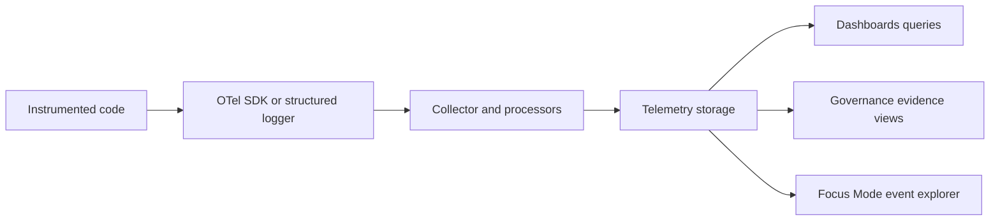

<!-- [KFM_META_BLOCK_V2]
doc_id: kfm://doc/4e7e0b42-80b4-4a65-9e04-4bf774b8a335
title: Telemetry Event Naming Standard
type: standard
version: v1
status: draft
owners: KFM Telemetry Working Group
created: 2026-03-04
updated: 2026-03-04
policy_label: public
related: [
  "docs/standards/telemetry/",
  "docs/standards/governance/ROOT-GOVERNANCE.md",
  "schemas/telemetry/",
  "docs/reports/telemetry/"
]
tags: [kfm, telemetry, standards, naming, opentelemetry]
notes: [
  "Initial draft.",
  "Rules in this document are PROPOSED unless explicitly marked CONFIRMED."
]
[/KFM_META_BLOCK_V2] -->

# Telemetry Event Naming Standard
Define consistent, queryable, low-cardinality names for telemetry events across KFM.

---

## IMPACT
**Status:** draft  
**Owners:** KFM Telemetry Working Group (Telemetry WG)  
**Enforcement:** **[PROPOSED]** CI linter + schema validation (fail-closed in governed workflows)  
**Applies to:** **[PROPOSED]** pipelines, governed workflows, services/APIs, Focus Mode UI, policy engine


**Quick links:** [Scope](#scope) · [Naming grammar](#naming-grammar) · [Registry](#registry) · [Examples](#examples) · [CI enforcement](#ci-enforcement) · [FAQ](#faq)

---

## Evidence labels used in this standard
- **[CONFIRMED]** = Supported by existing KFM documentation or upstream standards (OpenTelemetry).
- **[PROPOSED]** = Recommended rule for adoption; intended to become enforced.
- **[UNKNOWN]** = Requires repo verification (see “Verification steps” items).

---

## Scope
- **[PROPOSED]** This standard governs **event names** for:
  - OpenTelemetry **Span Events** (`Span.AddEvent(name=...)`)
  - OpenTelemetry **Log Events** (`LogRecord.EventName` where supported)
  - KFM “workflow telemetry” JSON/NDJSON records (when they represent discrete events)
  - Any structured logging format that emits a machine-readable `event_name`

- **[PROPOSED]** This standard does **not** govern:
  - Metric names (see OpenTelemetry metric naming + KFM metric standards; out of scope here)
  - File names / paths of telemetry artifacts (separate standard)
  - Dataset IDs, run IDs, request IDs, hashes (those belong in attributes, not in event names)

---

## Where this fits
- **[CONFIRMED]** KFM documentation references telemetry artifacts and schemas as first-class, versioned outputs alongside reports, manifests, and governance evidence.  
- **[PROPOSED]** Event naming is the “join key” that makes telemetry:
  - searchable (by humans),
  - aggregatable (by tools),
  - auditable (by governance).



---

## Definitions
- **Event name**: **[PROPOSED]** A stable, low-cardinality string that identifies the class/type of event and (by policy) uniquely identifies the event’s structure.
- **Event id**: **[PROPOSED]** A high-cardinality identifier unique to an event instance (UUID, ULID, hash, etc.).
- **Attributes**: **[CONFIRMED]** Key/value pairs attached to logs/events/spans that provide event details.
- **Low cardinality**: **[PROPOSED]** A bounded number of unique values over time (e.g., tens/hundreds, not millions).

---

## Core principles
- **[PROPOSED]** **Stability**: event names must be stable over time and across deployments.
- **[PROPOSED]** **Low cardinality**: event names identify *classes of things that happen*, not individual instances.
- **[PROPOSED]** **Namespace-first**: event names must be namespaced to avoid collisions and enable filtering.
- **[PROPOSED]** **Structure-identifying**: changing the meaning or required attributes of an event requires a new version (see Versioning).
- **[PROPOSED]** **No secrets / no sensitive payload in names**: secrets, PII, or sensitive geo details must never appear in event names.

---

## Naming grammar

### Allowed character set
- **[CONFIRMED]** For KFM event names, follow OpenTelemetry semantic convention naming constraints:
  - lowercase Latin letters (`a-z`)
  - digits (`0-9`)
  - underscore (`_`)
  - dot (`.`) as namespace delimiter
  - must start with a letter
  - must end with an alphanumeric character
  - must not contain two consecutive delimiters (dot or underscore) (e.g., `..`, `__`, `._`, `_.`)

### Canonical pattern
- **[PROPOSED]** Canonical event name pattern:

`kfm.<domain>.<component>.<operation>[.<phase>][.v<schema_version>]`

- **[PROPOSED]** Minimum segments: `kfm.<domain>.<operation>`
  - Add `<component>` when it materially improves filtering/ownership.
- **[PROPOSED]** Optional suffix:
  - `<phase>` from a controlled list (below)
  - `.vN` when a breaking schema change occurs

### Segment meanings
| Segment | Meaning | Cardinality rule |
|---|---|---|
| `kfm` | Namespace prefix | fixed |
| `<domain>` | System area (pipeline, policy, api, ui, catalog, graph, security, etc.) | **bounded** / registry-controlled |
| `<component>` | Subsystem within the domain | **bounded** / registry-controlled |
| `<operation>` | Verb-like action (validate, publish, evaluate, load, request, render, etc.) | **bounded** / registry-controlled |
| `<phase>` | Lifecycle outcome (started/completed/failed…) | fixed set |
| `vN` | Schema version for breaking changes | low (small integers) |

---

## Registry

### Domain segment registry
- **[PROPOSED]** Use one of these domains (extend via governance-reviewed change):
  - `pipeline`
  - `workflow`
  - `policy`
  - `catalog`
  - `graph`
  - `api`
  - `ui`
  - `security`
  - `ops`
  - `ai`

### Phase segment registry
- **[PROPOSED]** If you need a phase, use one of:
  - `started`
  - `completed`
  - `failed`
  - `skipped`
  - `blocked`
  - `allowed`
  - `denied`
  - `degraded`
  - `timeout`

### Reserved namespaces
- **[PROPOSED]** `kfm.*` is reserved for first-party KFM instrumentation.
- **[PROPOSED]** `ext.<vendor>.*` is reserved for third-party or plugin emitters (requires `<vendor>` registry).

---

## Event name vs attributes

### What belongs in the event name
- **[PROPOSED]** Class/type of event (what happened), stable ownership context (domain/component), coarse outcome (phase).

### What must NOT be in the event name
- **[PROPOSED]** Any high-cardinality value:
  - request IDs, run IDs, dataset IDs, user IDs, timestamps, hashes, file paths, coordinates
- **[PROPOSED]** Any sensitive or secret content:
  - API keys, tokens, credentials, unmask tokens
  - personal names/emails/phone numbers
  - precise sensitive locations

### Required correlation fields
- **[PROPOSED]** Every event SHOULD include correlation attributes (when available):
  - `trace_id` and `span_id` (if emitting within a trace context)
  - `audit_ref` (for governance-relevant events)
  - `spec_hash` (when an event is governed by a contract/spec)
- **[PROPOSED]** Put high-cardinality IDs in attributes:
  - `run_id`, `dataset_id`, `workflow_id`, `request_id`, `decision_id`, etc.

---

## OpenTelemetry mapping

### Span events
- **[PROPOSED]** Use the canonical event name as the **Span Event name**.
- **[PROPOSED]** Put details in event attributes, not the name.

### Log events
- **[CONFIRMED]** OpenTelemetry defines “Events” as a standardized format for LogRecords; the event “class/type” is represented by **LogRecord.EventName** (and the older `event.name` attribute is deprecated).
- **[PROPOSED]** For OTel logs, set:
  - `LogRecord.EventName = "<canonical_event_name>"`
  - **Optional compatibility**: duplicate to attribute `event.name` only if required by downstream tooling (note: deprecated upstream).

### KFM workflow telemetry JSON
- **[PROPOSED]** For JSON/NDJSON telemetry records that represent an event, include:
  - `event_name`: canonical event name
  - `timestamp`: RFC3339 UTC string
  - plus correlation attributes as available

---

## Versioning rules
- **[PROPOSED]** Backward compatible changes:
  - Adding optional attributes = keep the same event name.
- **[PROPOSED]** Breaking changes (require new name):
  - renaming/removing an attribute,
  - changing attribute meaning/units,
  - changing required/optional classification,
  - changing redaction/aggregation semantics,
  - changing the interpretation of the event’s severity.
- **[PROPOSED]** Breaking change strategy:
  - Add `.v2` (or next integer) suffix as the final segment.
  - Example: `kfm.policy.evaluate.denied.v2`

---

## Examples

### Good examples
| Event name | Why it’s good |
|---|---|
| `kfm.workflow.schema_lint.completed` | bounded, readable, stable |
| `kfm.pipeline.ingest.started` | low-cardinality operation + phase |
| `kfm.policy.evaluate.denied` | expresses action + governance outcome |
| `kfm.catalog.stac.validate.failed` | hierarchical ownership and outcome |
| `kfm.ui.focus.session.started` | UI event class without user/session IDs |

### Bad examples
| Event name | Why it’s bad |
|---|---|
| `kfm.pipeline.ingest.completed.2026_03_04` | timestamp in name (high cardinality) |
| `kfm.api.request.GET_/datasets/123` | path + ID embedded (high cardinality; invalid chars) |
| `kfm.policy..evaluate.denied` | consecutive delimiters |
| `kfm.POLICY.evaluate.denied` | uppercase |
| `kfm.pipeline.ingest__completed` | consecutive underscores |

---

## How to add a new event name

1. **[PROPOSED]** Start from the canonical pattern: `kfm.<domain>.<component>.<operation>`.
2. **[PROPOSED]** Confirm low cardinality:
   - No IDs, no timestamps, no paths, no user data.
3. **[PROPOSED]** Pick a `phase` only if it adds value for aggregation.
4. **[PROPOSED]** Register the new name:
   - Add it to the event registry (recommended to be a JSON list or YAML file in `docs/standards/telemetry/`).
5. **[PROPOSED]** Add examples:
   - one “minimal” example payload,
   - one “full” example payload,
   - one “redaction” example if sensitivity applies.
6. **[PROPOSED]** Add/adjust schema tests and lints (fail-closed for governed workflows).

---

## CI enforcement
- **[PROPOSED]** Add a linter that checks:
  - canonical prefix `kfm.`
  - allowed characters only (`a-z0-9_.`)
  - no consecutive delimiters
  - max length (recommended ≤ 80 chars)
  - registry membership (for governed-mode emission)
- **[PROPOSED]** Enforce in:
  - telemetry schema validation workflow
  - docs-lint (if event registry is doc-owned)
  - pipeline contract tests (if events are part of API contracts)

### Verification steps (to upgrade UNKNOWN → CONFIRMED)
- **[UNKNOWN]** Identify existing event naming in repo:
  - grep for `event_name`, `EventName`, `add_event(`, `span.add_event`, `telemetry_ref`, `emit_telemetry`
  - sample `releases/**/*telemetry*.json` for current naming patterns
- **[UNKNOWN]** Confirm OTel log EventName support in chosen SDKs/exporters:
  - validate that `LogRecord.EventName` is preserved end-to-end in the current stack

---

## FAQ

### Do we really need a registry?
- **[PROPOSED]** Yes, for governed-mode “fail-closed” behavior and for avoiding naming drift.

### Can we include workflow names (like `schema_lint`) in the event name?
- **[PROPOSED]** Yes **if** the set of workflow identifiers is controlled/registered and bounded.

### Where do IDs go?
- **[PROPOSED]** Put IDs in attributes:
  - `run_id`, `dataset_id`, `request_id`, `decision_id`, `trace_id`, `span_id`

---

## Appendix

<details>
<summary>Regex (starter)</summary>

> This is a **starter** regex. CI can use stricter rules if needed.

```regex
^kfm\.[a-z][a-z0-9_]*(\.[a-z0-9_]+)*(\.v[0-9]+)?$
```

Recommended extra checks (in code, not regex-only):
- reject `..`, `__`, `._`, `_.`
- enforce length ≤ 80
- enforce registry membership when running in governed mode
</details>

<details>
<summary>Minimal JSON event shape (example)</summary>

```json
{
  "timestamp": "2026-03-04T12:34:56Z",
  "event_name": "kfm.policy.evaluate.denied",
  "severity": "warning",
  "trace_id": "4bf92f3577b34da6a3ce929d0e0e4736",
  "span_id": "00f067aa0ba902b7",
  "audit_ref": "kfm://evidence/decision/2026-03-04/abcd1234",
  "spec_hash": "sha256:...",
  "attrs": {
    "policy_rule_id": "policy.restrict_sensitive_locations.v3",
    "dataset_id": "example_dataset",
    "run_id": "run_2026-03-04T12-34-00Z"
  }
}
```
</details>

---

[Back to top](#telemetry-event-naming-standard)
