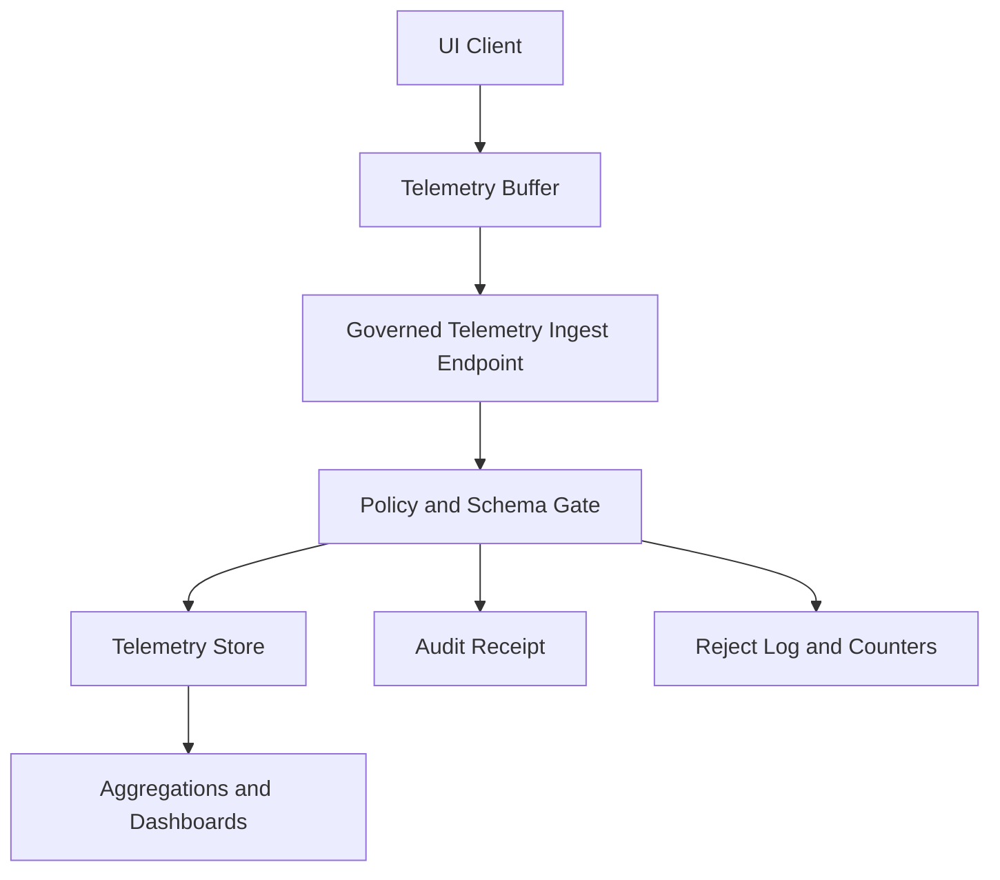

<!-- [KFM_META_BLOCK_V2]
doc_id: kfm://doc/9e5d09ea-3b0c-4d48-8a2d-acde3b8d4f7e
title: UI Telemetry Standard
type: standard
version: v1
status: draft
owners: ["@KFM/frontend", "@KFM/observability", "@KFM/governance"]
created: 2026-03-04
updated: 2026-03-04
policy_label: public
related:
  - docs/standards/telemetry/README.md
  - docs/specs/telemetry/README.md
  - docs/specs/telemetry/FOCUS__EVENTS.md
  - docs/specs/api/API__REST_CONTRACT.md
  - policy/
tags: [kfm, telemetry, ui, observability, privacy]
notes:
  - "Draft standard. Requirements marked PROPOSED until governance review approves and CI gates exist."
[/KFM_META_BLOCK_V2] -->

# UI Telemetry
Standard for **PII-safe, schema-validated UI telemetry** across KFM map, timeline, story, and Focus surfaces.

> **Status:** draft (PROPOSED) • **Owners:** `@KFM/frontend`, `@KFM/observability`, `@KFM/governance` • **Version:** v1.0.0 (PROPOSED) • **Policy:** public

[](#)
[](#)
[](#)
[](#)

**Jump to:** [Scope](#scope) · [Where it fits](#where-it-fits) · [Confirmed invariants](#confirmed-invariants) · [Event model](#event-model) · [Privacy rules](#privacy-rules) · [Client behavior](#client-behavior) · [Event catalog](#event-catalog) · [Versioning](#versioning-and-compatibility) · [CI gates](#ci-and-promotion-gates) · [Definition of done](#definition-of-done) · [Appendix](#appendix)

---

## Scope

**PROPOSED:** This standard defines **what UI telemetry is**, **what it must not contain**, and **how it must be validated and transported**.

**PROPOSED: In-scope**
- UI interaction events (navigation, Story Node actions, layer toggles, timeline actions, evidence drawer interactions).
- UI reliability/performance signals (e.g., “tile load failed”, “map slow frame”, “API request error class”).
- Session-level context needed to interpret UI behavior (e.g., session ID, app version).

**PROPOSED: Out-of-scope**
- Backend service traces/metrics/logs (covered elsewhere).
- Session replay, keystroke logging, DOM snapshots, heatmaps.
- Any data collection that is not **strictly required** to improve product usability, reliability, or governance reporting.

**PROPOSED:** Telemetry is a **data product** and must be treated as governed data (policy labels, validation, retention, auditability).

[Back to top](#ui-telemetry)

---

## Where it fits

**CONFIRMED:** KFM is built around a **trust membrane**: UI and external clients do not talk directly to stores; they cross the governed API and policy boundary. This applies to telemetry as much as it applies to data queries and story publishing.

**PROPOSED:** UI telemetry MUST be emitted to a governed API endpoint (or a governed collector service behind the same policy boundary). Direct-to-warehouse analytics from the browser is disallowed unless explicitly approved by governance and enforced by policy tests.

### Flow



**PROPOSED:** The ingest endpoint is responsible for:
- schema validation (fail-closed),
- policy enforcement (default-deny; redact or reject),
- rate limiting and abuse controls,
- auditable receipts for accepted batches.

[Back to top](#ui-telemetry)

---

## Confirmed invariants

These are **non-negotiables** already established by KFM architecture/governance materials.

- **CONFIRMED:** Trust membrane: UI/external clients never access databases or object storage directly; all access flows through governed APIs and a policy boundary.
- **CONFIRMED:** Fail-closed policy: requests that cannot be validated / authorized must not proceed.
- **CONFIRMED:** Cite-or-abstain Focus Mode: responses must cite resolvable evidence bundles or abstain; a run receipt/audit reference is produced.
- **CONFIRMED:** Catalog/provenance are first-class trust surfaces; UI must make trust visible (versions, license, policy badges, evidence access).

**PROPOSED:** UI telemetry MUST NOT create a side-channel that weakens these invariants (e.g., leaking restricted dataset identifiers, bypassing policy, or capturing sensitive map interactions).

[Back to top](#ui-telemetry)

---

## Definitions

**PROPOSED:**
- **UI telemetry**: a stream of small structured events describing UI actions and UI conditions.
- **Event**: a single telemetry record with `kind`, timestamp, and typed payload.
- **Batch**: an envelope containing multiple events, sent periodically or on page hide.
- **PII**: personally identifying information (direct or indirect identifiers).
- **Policy label**: a classification applied to telemetry data (e.g., public/restricted).

**PROPOSED:** This standard uses RFC-style normative keywords:
- **MUST** = required for compliance once adopted.
- **SHOULD** = strongly recommended unless a documented exception exists.
- **MAY** = optional.

[Back to top](#ui-telemetry)

---

## Event model

**PROPOSED:** UI telemetry is sent as a **batch envelope** containing an array of events.

### Envelope fields

**PROPOSED:** The envelope MUST validate against a versioned JSON Schema.

| Field | Type | Required | Description | Example |
|---|---:|:---:|---|---|
| `$schema` | string (uri) | ✅ | Schema identifier (versioned) | `https://kfm.dev/schemas/ui-telemetry-1.json` |
| `doc_type` | string | ✅ | Fixed discriminator | `ui_telemetry` |
| `version` | semver string | ✅ | Payload version | `1.0.0` |
| `emitted_at` | RFC3339 string | ✅ | Batch creation time | `2026-03-04T18:22:11Z` |
| `session_id` | string | ✅ | Ephemeral, random session identifier | `ks_7b3f...` |
| `app` | object | ✅ | App metadata | `{ "name": "kfm-web", "version": "0.9.0", "build_sha": "abcd123" }` |
| `env` | string | ✅ | Deployment environment | `prod`, `stage`, `dev` |
| `policy_label` | string | ✅ | Classification of this telemetry batch | `public` |
| `events` | array | ✅ | Telemetry events | `[{...}, {...}]` |
| `client_time_skew_ms` | number | ❌ | Optional: clock skew estimate | `-120` |

**UNKNOWN:** The canonical schema hosting location (`kfm.dev/schemas/...`) and local repo path for schemas are not confirmed in the repository snapshot.  
**Smallest steps to confirm:** locate `docs/specs/telemetry/README.md` and `contracts/` (or `schemas/`) tree; confirm publishing mechanism for schemas.

### Event fields

**PROPOSED:** Every event MUST contain a minimal common header + a typed payload.

| Field | Type | Required | Description |
|---|---:|:---:|---|
| `ts` | RFC3339 string | ✅ | Event time |
| `kind` | string enum | ✅ | Event kind name |
| `route` | string | ✅ | UI route/view identifier (no query params) |
| `story_node_id` | string | ❌ | If event occurs in Story context |
| `layer_id` | string | ❌ | If event occurs in layer context |
| `payload` | object | ❌ | Kind-specific fields (preferred location for extra data) |
| `corr` | object | ❌ | Correlation IDs (see below) |

**PROPOSED:** Keep events tiny; the target is **1–2KB per batch** for normal usage.

[Back to top](#ui-telemetry)

---

## Privacy rules

**PROPOSED (default-deny):** If it is not explicitly allowed here (or by an approved policy pack), it must not be collected.

### Explicitly disallowed

- **PROPOSED:** No free-text (including search queries, prompts, notes, comments).
- **PROPOSED:** No precise coordinates, geometry, or map click lat/lon **unless** (1) policy explicitly allows it and (2) the coordinates are already public in the same user-facing context.
- **PROPOSED:** No emails, names, phone numbers, addresses, IP addresses, auth tokens, or device identifiers.
- **PROPOSED:** No full user-agent strings (fingerprinting risk).

### Allowed patterns

- **PROPOSED:** Use **enumerations** and **controlled vocabularies** instead of strings.
- **PROPOSED:** Use **buckets** instead of raw values (e.g., `zoom_bucket: "z08_10"`).
- **PROPOSED:** Use **counts**, not raw lists (e.g., `selected_layer_count: 5`).

### Session identity

- **PROPOSED:** `session_id` MUST be random and ephemeral (rotate at least daily; rotate on logout; rotate on privacy mode).
- **PROPOSED:** If a user ID is ever required for analysis, it MUST be:
  - policy-approved,
  - privacy-reviewed,
  - and represented as a **server-side pseudonym** (never computed in-browser).

### Consent and controls

- **UNKNOWN:** Whether KFM requires explicit end-user telemetry consent in the UI is not confirmed.
- **PROPOSED:** UI MUST provide a kill-switch to disable telemetry emission (config flag + build-time option).
- **Smallest steps to confirm:** check governance charter and policy pack for consent requirements and regional constraints.

[Back to top](#ui-telemetry)

---

## Correlation and governance linkage

**PROPOSED:** Telemetry should be joinable to other governed artifacts *without leaking sensitive content*.

### Correlation IDs (safe)

**PROPOSED:** The `corr` object MAY contain:

| Field | Type | Purpose |
|---|---:|---|
| `request_id` | string | Correlate UI errors with API request logs (from response headers) |
| `evidence_bundle_id` | string | Correlate “opened evidence” events with evidence resolver output |
| `dataset_version_id` | string | Only when the dataset is already visible to user and policy label allows |

**PROPOSED:** Telemetry MUST NOT include raw EvidenceRef payloads if they could reveal restricted references. Prefer stable bundle IDs that only resolve through governed APIs.

[Back to top](#ui-telemetry)

---

## Client behavior

**PROPOSED:** The client emitter is a small library with:
- a strict event allowlist (kind registry),
- local schema validation,
- in-memory buffering,
- periodic flush,
- flush on lifecycle signals.

### Buffering and flushing

**PROPOSED:**
- Buffer in memory.
- Flush on:
  - interval (e.g., every 10–30s),
  - batch size threshold (e.g., 10–50 events),
  - `visibilitychange` / `pagehide` (best-effort),
  - and on critical error events (best-effort).

**PROPOSED:** Prefer `navigator.sendBeacon` (where available) or `fetch(..., { keepalive: true })`.

### Pseudocode client emitter

```ts
// pseudocode — adjust paths and build tooling to match the repo

type UiTelemetryEvent =
  | { ts: string; kind: "story_next"; route: string; story_node_id: string }
  | { ts: string; kind: "layer_toggle"; route: string; story_node_id?: string; layer_id: string; payload: { state: "on" | "off" } }
  | { ts: string; kind: "timeline_scrub"; route: string; story_node_id?: string; payload: { from: number; to: number } };

class UiTelemetryClient {
  private buffer: UiTelemetryEvent[] = [];
  constructor(private sessionId: string, private endpoint: string) {}

  capture(evt: UiTelemetryEvent) {
    // PROPOSED: validate locally against the JSON Schema for this kind.
    // If invalid: drop + increment a local counter (do not crash the UI).
    this.buffer.push(evt);
    if (this.buffer.length >= 25) this.flush("size");
  }

  flush(reason: "size" | "timer" | "pagehide" | "error") {
    const batch = {
      $schema: "https://kfm.dev/schemas/ui-telemetry-1.json",
      doc_type: "ui_telemetry",
      version: "1.0.0",
      emitted_at: new Date().toISOString(),
      session_id: this.sessionId,
      app: { name: "kfm-web", version: "0.0.0", build_sha: "UNKNOWN" },
      env: "dev",
      policy_label: "public",
      events: this.buffer.splice(0),
      flush_reason: reason,
    };

    // best-effort send; do not block UI
    const body = JSON.stringify(batch);
    if (navigator.sendBeacon) {
      navigator.sendBeacon(this.endpoint, body);
      return;
    }
    fetch(this.endpoint, { method: "POST", headers: { "content-type": "application/json" }, body, keepalive: true })
      .catch(() => void 0);
  }
}
```

[Back to top](#ui-telemetry)

---

## Server-side ingestion contract

**PROPOSED:** The governed ingest endpoint MUST:
- validate batch against schema (reject invalid batches),
- enforce policy label and obligations (reject or redact),
- attach server receipt (batch id, accepted count, rejected count),
- rate limit per client/session,
- emit structured logs for rejects (kind, reason, version).

**PROPOSED: Endpoint shape**
- `POST /api/v1/telemetry/ui` (path is PROPOSED; confirm against API contract)
- response: `202 Accepted` with a receipt body.

```json
{
  "receipt_id": "kfm://receipt/ui_telemetry/2026-03-04T18:22:11Z.abcd",
  "accepted": 18,
  "rejected": 2,
  "policy": { "decision": "allow", "obligations_applied": [] }
}
```

**UNKNOWN:** The authoritative API path and receipt schema are not confirmed.
**Smallest steps to confirm:** search `docs/specs/api/` for telemetry ingest contract and `contracts/` for telemetry receipt schema.

[Back to top](#ui-telemetry)

---

## Event catalog

**PROPOSED:** Event kinds are an allowlist. Adding a new kind requires:
1) schema change, 2) fixtures, 3) policy review, 4) dashboards update.

### Naming rules

- **PROPOSED:** `kind` is `snake_case`.
- **PROPOSED:** Prefer domain-first names: `story_next`, `layer_toggle`, `timeline_scrub`.
- **PROPOSED:** No ad-hoc suffixes. Use versioned schema changes instead.

### MVP event kinds

| Kind | When emitted | Required fields | Notes |
|---|---|---|---|
| `ui_session_start` | app starts | `route` | No user identity; include `app` in envelope |
| `ui_session_end` | app ends/pagehide | `route` | Best-effort |
| `route_view` | route changes | `route` | Route should exclude query params |
| `story_open` | Story Node opened | `route`, `story_node_id` | |
| `story_next` | Next pressed | `route`, `story_node_id` | |
| `story_prev` | Prev pressed | `route`, `story_node_id` | |
| `story_jump` | Jump to node | `route`, `payload.to_story_node_id` | Avoid free-text |
| `layer_toggle` | Layer toggled | `route`, `layer_id`, `payload.state` | `state` is enum |
| `timeline_scrub` | Time scrubbed | `route`, `payload.from`, `payload.to` | Use ints/known units |
| `evidence_open` | Evidence drawer opened | `route`, optional `corr.evidence_bundle_id` | Do not embed raw evidence |
| `citation_open` | Citation opened | `route`, `payload.citation_id` | Only if citation IDs are public-safe |
| `focus_open` | Focus view opened | `route` | |
| `focus_ask_submit` | Focus question submitted | `route`, `payload.prompt_len` | No prompt text |
| `ui_error` | error boundary | `route`, `payload.error_code` | No stack traces in UI telemetry |

### Example batch (from the MVP pattern)

```json
{
  "$schema": "https://kfm.dev/schemas/ui-telemetry-1.json",
  "doc_type": "ui_telemetry",
  "version": "1.0.0",
  "session_id": "ks-7b3f…",
  "emitted_at": "2026-03-04T18:22:11Z",
  "app": { "name": "kfm-web", "version": "0.9.0", "build_sha": "abcd123" },
  "env": "prod",
  "policy_label": "public",
  "events": [
    { "ts": "2026-03-04T18:21:12Z", "kind": "story_next", "route": "/stories/river-basin", "story_node_id": "SN-0123" },
    { "ts": "2026-03-04T18:21:16Z", "kind": "layer_toggle", "route": "/stories/river-basin", "story_node_id": "SN-0124", "layer_id": "hydro", "payload": { "state": "on" } },
    { "ts": "2026-03-04T18:21:22Z", "kind": "timeline_scrub", "route": "/stories/river-basin", "story_node_id": "SN-0124", "payload": { "from": 1872, "to": 1875 } }
  ]
}
```

**PROPOSED:** The example above is the canonical “tiny telemetry” style: no free text, no coordinates, minimal typed fields.

[Back to top](#ui-telemetry)

---

## Versioning and compatibility

**PROPOSED:**
- Telemetry schemas use **semver**.
- **Patch**: clarifications, added optional fields.
- **Minor**: new event kinds; added optional fields; expanded enums.
- **Major**: breaking changes (renames, removed fields, changed types).

**PROPOSED:** The API MUST accept `N` previous minor versions for a bounded time window (e.g., 90 days) to allow staged rollouts.

**UNKNOWN:** The acceptance window policy (how many versions; how long) is not confirmed.
**Smallest steps to confirm:** check governance review cycle requirements and release cadence docs.

[Back to top](#ui-telemetry)

---

## CI and promotion gates

**PROPOSED:** UI telemetry changes MUST be gated like other contract surfaces.

### Required checks (minimum)

- [ ] **Schema export is up-to-date** (Pydantic or equivalent → JSON Schema).
- [ ] **Fixtures validate** against the schema (unit tests).
- [ ] **Policy tests pass** (default-deny; no forbidden fields).
- [ ] **Backward-compat tests** for accepted schema versions.
- [ ] **Docs updated** (event catalog + changelog).

**PROPOSED:** “Fail-closed” means:
- invalid telemetry is rejected at ingest,
- invalid schema changes are blocked in CI,
- policy regressions block merge.

[Back to top](#ui-telemetry)

---

## Definition of done

**PROPOSED:** You are “done” when:

- [ ] UI emitter library exists with an event allowlist.
- [ ] Local validation occurs before enqueue (drop invalid events).
- [ ] Batching + flush-on-pagehide is implemented.
- [ ] Telemetry ingest endpoint validates schema and policy.
- [ ] A privacy review is recorded (policy label + obligations).
- [ ] Dashboards exist for the MVP event set (counts by story_node_id, top toggled layers, evidence opens).
- [ ] Retention policy is set and enforced (raw vs aggregated).

[Back to top](#ui-telemetry)

---

## FAQ

**Why not just use a third-party analytics SDK directly in the UI?**  
**CONFIRMED constraint + PROPOSED policy:** Because it risks bypassing the trust membrane and policy enforcement. KFM treats governance as enforceable behavior, not an afterthought.

**Can we log map clicks?**  
**PROPOSED default:** Not with coordinates. Log *intent* (e.g., “feature inspected”) and tie it to story/evidence context where available. Anything spatial must be policy-approved.

**Do we store prompts or search queries for Focus Mode?**  
**PROPOSED:** No raw text in UI telemetry. Store only safe aggregates (e.g., prompt length, token count estimate), unless governance explicitly approves otherwise.

[Back to top](#ui-telemetry)

---

## Appendix

<details>
<summary>Appendix A — Proposed directory layout</summary>

**PROPOSED:** This is a suggested layout for where telemetry standards and schemas live. Do not treat as confirmed until the repo is checked.

```text
docs/
  standards/
    telemetry/
      README.md
      UI_TELEMETRY.md
      SERVER_TELEMETRY.md                # optional
contracts/
  telemetry/
    ui/
      ui-telemetry-1.json
tests/
  fixtures/
    telemetry/
      ui/
        batch.valid.json
        batch.invalid.json
policy/
  telemetry/
    ui.rego
```

</details>

<details>
<summary>Appendix B — Unknowns to resolve</summary>

**UNKNOWN:** Exact endpoint and OpenAPI contract for UI telemetry ingest.  
**Verify:** search `docs/specs/api/` and `contracts/openapi/` for telemetry routes.

**UNKNOWN:** The policy label to use for UI telemetry in production (`public` vs `restricted`).  
**Verify:** consult governance charter and policy pack.

**UNKNOWN:** Whether any spatial telemetry (even coarse) is allowed.  
**Verify:** consult CARE/sensitive-location policy rules and create fixtures for allowed/disallowed cases.

</details>
