<div align="center">

# 📈 **Kansas Frontier Matrix — Telemetry Standards & Sustainability Metrics**  
`docs/standards/telemetry_standards.md`

**Purpose:**  
Define the **governance, structure, and sustainability protocols** governing all telemetry collection, export, validation, and visualization in the **Kansas Frontier Matrix (KFM)** ecosystem.  
Aligns with **FAIR+CARE**, **ISO 50001 (Energy Management)**, **ISO 19115 (Metadata)**, and **MCP-DL v6.3** to ensure ethically monitored, transparent, and sustainable data operations.

[](../README.md)
[](../../LICENSE)
[](faircare.md)
[](#)

</div>

---

## 📘 Overview

Telemetry in the Kansas Frontier Matrix (KFM) is a **governed evidence framework**,  
linking automation, sustainability, and accountability through consistent **data emission, normalization, and retention** standards.

The **`focus-telemetry.json`** ledger acts as a unified governance artifact, combining CI/CD metrics,  
energy efficiency data, AI model performance, documentation quality, and FAIR+CARE compliance into a single auditable timeline.

---

## 🧩 Core Objectives

| Category | Objective | Standard |
|-----------|------------|-----------|
| 🧮 Measurement | Collect runtime, energy, and latency metrics across all workflows. | ISO 50001 §4.6 |
| ⚙️ Integration | Harmonize telemetry output from all pipelines and workflows. | MCP-DL v6.3 |
| 🔍 Transparency | Enable public governance dashboards for sustainability & ethics. | FAIR+CARE |
| 🧠 Explainability | Provide contextual metadata for each recorded metric. | DCAT 3.0 / CIDOC CRM |
| ♻️ Sustainability | Track emissions, optimize energy, and validate carbon neutrality. | ISO 14064-1 |
| ⚖️ Ethics | Monitor equity, bias, and accessibility telemetry. | CARE Principles |

---

## 🗂️ Directory Context

```plaintext
docs/
└── standards/
    ├── faircare.md
    ├── governance/
    │   └── ROOT-GOVERNANCE.md
    ├── markdown_rules.md
    ├── ui_accessibility.md
    ├── telemetry_standards.md     # This document
    └── ...
```

Associated telemetry outputs:
```
releases/
└── v9.9.0/
    ├── focus-telemetry.json
    ├── sbom.spdx.json
    ├── manifest.zip
    └── governance/
        └── ledger_snapshot.json
```

---

## ⚙️ Telemetry Schema Overview

Each telemetry record is structured under a unified schema:

```json
{
  "event_id": "uuid4",
  "event_type": "docs_lint | faircare | stac_validate | ai_train | build | deploy",
  "timestamp": "2025-11-08T14:22:30Z",
  "branch": "main",
  "duration_sec": 124.5,
  "energy_wh": 37.2,
  "status": "success",
  "payload": {
    "summary": "FAIR+CARE validation completed",
    "violations": 0,
    "datasets_scanned": 152,
    "pii_detected": 0
  },
  "context": {
    "workflow": "faircare-validate.yml",
    "runner": "ubuntu-22.04",
    "carbon_intensity_gco2_per_kwh": 440.5
  }
}
```

> All telemetry events must validate against `schemas/telemetry/**.json`  
> before being merged into the global ledger (`focus-telemetry.json`).

---

## ⚖️ FAIR+CARE Telemetry Alignment

| Principle | Implementation | Validation Source |
|------------|----------------|-------------------|
| **Findable** | UUID-tagged events + indexed metadata | `event_id`, `manifest_ref` |
| **Accessible** | Unified `focus-telemetry.json` ledger, public dashboards | `telemetry_ref` |
| **Interoperable** | JSON-LD/DCAT schema + STAC asset linking | `telemetry_schema` |
| **Reusable** | CC-BY data license, FAIR+CARE metadata | `license` |
| **CARE — Collective Benefit** | Open reporting of sustainability & bias metrics | Governance Dashboard |
| **CARE — Authority to Control** | FAIR+CARE Council oversight on sensitive telemetry | Council Approvals |
| **CARE — Responsibility** | Continuous validation of accuracy, consistency, and ethics | CI/CD Pipelines |
| **CARE — Ethics** | Telemetry logs anonymized, no user PII | FAIR+CARE Validation |

---

## 📊 Standardized Metrics Categories

### 1️⃣ System Performance
| Metric | Unit | Source |
|--------|------|--------|
| `duration_sec` | seconds | GitHub Actions runtime |
| `steps_success` | count | Workflow logs |
| `cache_hit_ratio` | percent | CI cache summary |
| `memory_mb` | megabytes | Runner telemetry |

### 2️⃣ Sustainability
| Metric | Unit | Description |
|--------|------|-------------|
| `energy_wh` | watt-hours | Derived from runtime * runner wattage |
| `carbon_gco2e` | grams CO₂ equivalent | `energy_wh * region_intensity` |
| `offset_pct` | percent | Renewable energy offset applied |

### 3️⃣ FAIR+CARE Governance
| Metric | Unit | Description |
|--------|------|-------------|
| `datasets_scanned` | count | FAIR+CARE validator input |
| `violations_found` | count | Failed FAIR+CARE checks |
| `quarantined_datasets` | count | Moved to `abandonment_candidates/` |
| `care_review_pending` | count | Awaiting council review |

### 4️⃣ AI Ethics & Explainability
| Metric | Unit | Description |
|--------|------|-------------|
| `bias_score` | 0–1 | Mean bias index |
| `drift_flag` | bool | True if model drift detected |
| `explainability_stability` | percent | SHAP/LIME feature stability |

### 5️⃣ Accessibility & Equity
| Metric | Unit | Description |
|--------|------|-------------|
| `a11y_compliance` | percent | WCAG 2.1 AA coverage |
| `a11y_warnings` | count | Accessibility audit findings |
| `inclusive_language_score` | percent | Text sentiment analysis result |

---

## ♻️ Retention Policy

| Data Type | Retention Period | Governance Action |
|------------|------------------|--------------------|
| Raw workflow telemetry | 30 days | Archived after merge |
| Unified focus-telemetry.json | 12 months | Immutable, under ledger |
| Sustainability metrics | 24 months | Rolled into trend reports |
| Governance ledger snapshot | Permanent | FAIR+CARE Council archive |

---

## 🧠 Sustainability & Energy Compliance

KFM adheres to **ISO 50001:2024** (Energy Management Systems):

- Runners are renewable-backed where possible (e.g., GitHub Green Tier).  
- **Telemetry-export.yml** measures energy draw & carbon footprint.  
- AI training pipelines must log **Wh/epoch** and **carbon intensity**.  
- Reports aggregated monthly to FAIR+CARE sustainability dashboard.

**Target thresholds (2025 standard):**
| Metric | Goal | Reporting Workflow |
|--------|------|--------------------|
| Energy per workflow | ≤ 50 Wh | telemetry-export.yml |
| Avg build time | ≤ 15 min | all CI/CD |
| Emission offset | 100% renewable | faircare-validate.yml |
| FAIR+CARE compliance | 100% | docs-lint.yml + faircare-validate.yml |

---

## 🔐 Security & Provenance

- All telemetry files are cryptographically signed (OIDC + Cosign).  
- Provenance of each log entry verified via **SLSA attestations**.  
- Checksums embedded in ledger; audit chain validated by `manifest_ref`.  
- FAIR+CARE Council periodically verifies ledger immutability.

---

## 🧭 Mermaid — High-Level Flow

```mermaid
flowchart LR
  A["Workflow Metrics (docs, data, AI, build)"] --> B["Normalize via telemetry-export.yml"]
  B --> C["Merge → focus-telemetry.json"]
  C --> D["Governance Ledger Snapshot"]
  D --> E["FAIR+CARE Council Review + Sustainability Dashboard"]
```



---

## 🕰️ Version History

| Version | Date | Author | Summary |
|---------:|------|--------|----------|
| v9.9.0 | 2025-11-08 | `@kfm-sustainability` | Initial telemetry governance standard defining unified schema, sustainability metrics, and FAIR+CARE integration. |

---

<div align="center">

**Kansas Frontier Matrix**  
*Sustainable Metrics × FAIR+CARE Ethics × Transparent Governance*  
© 2025 Kansas Frontier Matrix · CC-BY 4.0 · Master Coder Protocol v6.3 · FAIR+CARE Certified · Diamond⁹ Ω / Crown∞Ω Ultimate Certified  

[Back to Standards Index](README.md) · [Governance Charter](governance/ROOT-GOVERNANCE.md)

</div>

