<div align="center">

# 📈 **Kansas Frontier Matrix — Telemetry Standards & Sustainability Metrics**  
`docs/standards/telemetry_standards.md`

**Purpose:**  
Define the **governance, structure, and sustainability protocols** governing all telemetry collection, export, validation, and visualization in the **Kansas Frontier Matrix (KFM)** ecosystem.  
Aligned with **FAIR+CARE**, **ISO 50001 (Energy Management)**, **ISO 14064 (GHG Accounting)**, **ISO 19115 (Metadata)**, and **MCP-DL v6.3** to ensure ethically monitored, transparent, and sustainable data operations.

[](../README.md)
[](../../LICENSE)
[](faircare.md)
[](#)

</div>

---

## 📘 Overview

Telemetry in the Kansas Frontier Matrix (KFM) is a **governed evidence framework**, linking automation, sustainability, and accountability through consistent **data emission, normalization, and retention** standards.

The **`focus-telemetry.json`** ledger acts as a unified governance artifact, combining:

- CI/CD metrics  
- Energy and performance data  
- AI model metrics (accuracy, fairness, drift, explainability)  
- Documentation quality scores  
- FAIR+CARE compliance and governance events  

into a single auditable timeline per release.

---

## 🧩 Core Objectives

| Category | Objective | Standard |
|---|---|---|
| 🧮 Measurement | Collect runtime, energy, and latency metrics across all workflows. | ISO 50001 §4.6 |
| ⚙️ Integration | Harmonize telemetry output from all pipelines and workflows. | MCP-DL v6.3 |
| 🔍 Transparency | Enable public governance dashboards for sustainability & ethics. | FAIR+CARE |
| 🧠 Explainability | Provide contextual metadata for each recorded metric. | DCAT 3.0 / CIDOC CRM |
| ♻️ Sustainability | Track emissions, optimize energy, validate carbon neutrality. | ISO 14064-1 |
| ⚖️ Ethics | Monitor equity, bias, and accessibility telemetry. | CARE Principles |

---

## 🗂️ Directory Context

```plaintext
docs/
└── standards/
    ├── faircare.md
    ├── governance/
    │   └── ROOT-GOVERNANCE.md
    ├── markdown_rules.md
    ├── ui_accessibility.md
    ├── telemetry_standards.md     # This document
    └── ...
````

Associated telemetry outputs:

```plaintext
releases/
└── v10.2.0/
    ├── focus-telemetry.json
    ├── sbom.spdx.json
    ├── manifest.zip
    └── governance/
        └── ledger_snapshot.json
```

---

## ⚙️ Telemetry Schema Overview

Each telemetry record follows a unified, JSON Schema–validated structure:

```json
{
  "event_id": "uuid4",
  "event_type": "docs_lint | faircare | stac_validate | ai_train | build | deploy",
  "timestamp": "2025-11-10T14:22:30Z",
  "branch": "main",
  "duration_sec": 124.5,
  "energy_wh": 37.2,
  "carbon_gco2e": 16.4,
  "status": "success",
  "payload": {
    "summary": "FAIR+CARE validation completed",
    "violations": 0,
    "datasets_scanned": 152,
    "pii_detected": 0
  },
  "context": {
    "workflow": "faircare-validate.yml",
    "runner": "ubuntu-22.04",
    "carbon_intensity_gco2_per_kwh": 440.5
  }
}
```

> All telemetry events must validate against `schemas/telemetry/**.json`
> before being merged into the global ledger (`focus-telemetry.json`).

---

## ⚖️ FAIR+CARE Telemetry Alignment

| Principle                       | Implementation                                              | Validation Artifact                    |
| ------------------------------- | ----------------------------------------------------------- | -------------------------------------- |
| **Findable**                    | Telemetry logs versioned and UUID-indexed                   | `focus-telemetry.json`, `manifest_ref` |
| **Accessible**                  | Unified ledger, exported dashboards, CC-BY license          | `telemetry_ref`                        |
| **Interoperable**               | JSON Schema, optional JSON-LD, DCAT-compatible              | `telemetry_schema`                     |
| **Reusable**                    | Renewable energy baselines reused for lifecycle reports     | `manifest_ref`                         |
| **CARE – Collective Benefit**   | Public visibility of sustainability & fairness metrics      | Governance dashboard                   |
| **CARE – Authority to Control** | FAIR+CARE Council oversight on telemetry policies           | `governance_ref`                       |
| **CARE – Responsibility**       | Continuous validation of accuracy and ethics                | CI/CD workflows                        |
| **CARE – Ethics**               | Telemetry logs contain no user PII; aggregated where needed | `faircare-validate.yml`                |

---

## 📊 Standardized Metrics Categories

### 1️⃣ System Performance

| Metric            | Unit      | Source                  |
| ----------------- | --------- | ----------------------- |
| `duration_sec`    | seconds   | GitHub Actions runtime  |
| `steps_success`   | count     | CI logs                 |
| `cache_hit_ratio` | percent   | `actions/cache` stats   |
| `memory_mb`       | megabytes | Runner stats (optional) |

### 2️⃣ Sustainability

| Metric         | Unit    | Description                           |
| -------------- | ------- | ------------------------------------- |
| `energy_wh`    | Wh      | Derived from runtime * runner wattage |
| `carbon_gco2e` | gCO₂e   | `energy_wh * region_intensity`        |
| `offset_pct`   | percent | Renewable energy offset applied       |

### 3️⃣ FAIR+CARE Governance

| Metric                 | Unit  | Description                               |
| ---------------------- | ----- | ----------------------------------------- |
| `datasets_scanned`     | count | FAIR+CARE validator inputs                |
| `violations_found`     | count | FAIR+CARE failures                        |
| `quarantined_datasets` | count | Assets moved to `abandonment_candidates/` |
| `care_review_pending`  | count | Items awaiting council review             |

### 4️⃣ AI Ethics & Explainability

| Metric                     | Unit    | Description                   |
| -------------------------- | ------- | ----------------------------- |
| `bias_score`               | 0–1     | Mean bias index across groups |
| `drift_flag`               | bool    | True if model drift detected  |
| `explainability_stability` | percent | SHAP/LIME stability score     |

### 5️⃣ Accessibility & Equity

| Metric                     | Unit    | Description                       |
| -------------------------- | ------- | --------------------------------- |
| `a11y_compliance`          | percent | Accessibility score (WCAG 2.1 AA) |
| `a11y_warnings`            | count   | Issues from axe/Pa11y/Lighthouse  |
| `inclusive_language_score` | percent | Inclusive language audit output   |

---

## ♻️ Retention Policy

| Data Type                      | Retention Period | Governance Action                    |
| ------------------------------ | ---------------- | ------------------------------------ |
| Raw workflow telemetry         | 30 days          | Archived/rolled into summaries       |
| Unified `focus-telemetry.json` | 12 months        | Immutable; part of release artifacts |
| Sustainability metrics         | 24 months        | Used for trend analysis & reporting  |
| Governance ledger snapshot     | Permanent        | FAIR+CARE archival record            |

---

## 🧠 Sustainability & Energy Compliance

Under **ISO 50001** and **ISO 14064-1**, KFM:

* Uses telemetry to identify high-energy workflows and prioritize optimizations.
* Estimates energy per CI job and multiplies by regional carbon intensity.
* Reports monthly metrics to FAIR+CARE sustainability dashboard.
* Targets carbon-neutral operation for core CI/CD pipelines.

**Sample thresholds (v10.2.0):**

| Metric                       | Goal         | Reporting Workflow                  |
| ---------------------------- | ------------ | ----------------------------------- |
| Energy per workflow          | ≤ 45 Wh      | `telemetry-export.yml`              |
| Avg CI build time            | ≤ 12 min     | build/test workflows                |
| Emission offset              | 100% (RE100) | governance + sustainability reports |
| FAIR+CARE telemetry coverage | 100%         | `telemetry-export.yml`              |

---

## 🔐 Security & Provenance

* Telemetry and related artifacts may be signed with **Sigstore Cosign** and linked via **SLSA** attestations.
* Checksums are tracked in `data/checksums/manifest.json` and referenced from manifests.
* Governance reviews ensure that telemetry does not inadvertently expose sensitive operational or user data.

---

## 🧭 Mermaid — High-Level Flow

```mermaid
flowchart LR
  A["Upstream Workflows (docs, faircare, stac, ai, build)"] --> B["Per-job Telemetry JSON"]
  B --> C["Normalize via telemetry-export.yml"]
  C --> D["Merge → focus-telemetry.json"]
  D --> E["Governance Ledger Snapshot & Dashboards"]
  E --> F["Sustainability & Ethics Optimization"]
```



---

## 🕰️ Version History

| Version | Date       | Author                | Summary                                                                                                                                           |
| ------- | ---------- | --------------------- | ------------------------------------------------------------------------------------------------------------------------------------------------- |
| v10.2.2 | 2025-11-12 | `@kfm-sustainability` | Updated references to v10.2.0; clarified metric categories, retention, and ISO 50001/14064 linkage; aligned with telemetry-export v3 behavior.    |
| v10.0.0 | 2025-11-10 | `@kfm-sustainability` | Established telemetry governance standard; introduced unified schema, sustainability metrics, FAIR+CARE integration; adopted telemetry schema v2. |

---

<div align="center">

**Kansas Frontier Matrix**
*Sustainable Metrics × FAIR+CARE Ethics × Transparent Governance*
© 2025 Kansas Frontier Matrix · CC-BY 4.0 · Master Coder Protocol v6.3 · FAIR+CARE Certified · Diamond⁹ Ω / Crown∞Ω Ultimate Certified

[Back to Standards Index](README.md) · [Governance Charter](governance/ROOT-GOVERNANCE.md)

</div>
