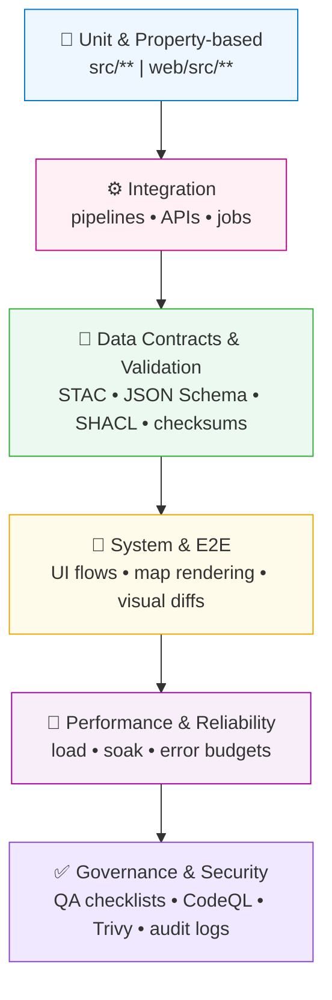

<div align="center">

# 🧪 Kansas Frontier Matrix — **Testing & Validation Standards**  
`docs/standards/testing.md`

**Master Coder Protocol (MCP-DL v6.3+) · Determinism · Provenance · CI/CD · Auditability**

[](../../docs/)
[](../../.github/workflows/codeql.yml)
[](../../.github/workflows/trivy.yml)
[](../../.github/workflows/stac-validate.yml)
[](../../.github/workflows/site.yml)
[](../../LICENSE)

</div>

---

```yaml
---
title: "Kansas Frontier Matrix — Testing & Validation Standards"
version: "v1.3.0"
last_updated: "2025-10-18"
owners: ["@kfm-qa","@kfm-architecture","@kfm-data","@kfm-security","@kfm-web"]
tags: ["testing","validation","quality","stac","jsonschema","shacl","e2e","coverage","ci/cd","mcp"]
status: "Stable"
scope: "Monorepo-Wide"
license: "MIT"
semver_policy: "MAJOR.MINOR.PATCH"
audit_framework: "MCP-DL v6.3"
ci_required_checks:
  - docs-validate
  - stac-validate
  - codeql
  - trivy
  - checksums
  - unit-integration
  - e2e
semantic_alignment:
  - STAC 1.0
  - JSON Schema (2020-12)
  - SHACL (RDF constraints)
  - ISO 8601 (time)
  - WCAG 2.1 AA (a11y)
---
````

---

## 📚 Overview

Testing and validation are the foundation of **KFM’s reproducible architecture**.
All pipelines, datasets, and web systems undergo continuous verification to ensure:

* ✅ **Deterministic, reproducible outputs**
* 🧾 **Provenance and integrity** (checksums, logs, commit/runner fingerprints)
* 🔍 **Automated CI/CD validation** across platforms and runtimes
* 🧠 **Compliance with open data/metadata standards** (STAC, JSON Schema, SHACL)
* 🧩 **Full traceability** from raw inputs to published results & site builds

Testing operates at multiple levels — **unit, property-based, integration, data contracts, system/E2E, performance, security, and governance QA** — enforced by workflows and peer review.

---

## 🧗 Test Strategy (Pyramid & Flow)



<!-- END OF MERMAID -->

---

## 🧱 Test Levels & Requirements

| Level                  | Purpose                                                      | Tools / Frameworks                                       | Required |
| :--------------------- | :----------------------------------------------------------- | :------------------------------------------------------- | :------- |
| **Unit Tests**         | Validate functions/modules in isolation                      | `pytest`, `unittest`, `pytest-cov`, `tox`                | ✅        |
| **Property-based**     | Probe invariants with generated inputs                       | `hypothesis` (Python)                                    | ✅        |
| **Integration**        | Validate pipelines, ETL steps, API routes, CLI, Make targets | `pytest`, `requests`, Make targets                       | ✅        |
| **Data Contracts**     | Assert schemas & linkages remain stable                      | `jsonschema`, `stac-validator`, `pyshacl`, link-checkers | ✅        |
| **System / E2E**       | UI flows, map layers, timeline, API↔UI                       | `playwright` (headless), snapshot/visual diffs           | ✅        |
| **Accessibility**      | WCAG compliance on UI                                        | `axe-core` via Playwright                                | ✅        |
| **Performance / Load** | Throughput, latency, regressions                             | `k6`/`locust`, Lighthouse, profilers                     | Optional |
| **Security**           | SAST, deps & image scans                                     | `CodeQL`, `Bandit`, `Trivy`, `pip-audit`, `npm audit`    | ✅        |
| **Governance QA**      | Manual checks for MCP & doc quality                          | QA checklists + reviewer sign-off                        | ✅        |

---

## ⚙️ Unit & Property-Based Testing Standards

| Requirement     | Description                                          | Policy / Example             |
| :-------------- | :--------------------------------------------------- | :--------------------------- |
| **Framework**   | Use `pytest` for all Python tests                    | `pytest -q`                  |
| **Naming**      | Files `test_*.py`; functions `test_*`                | `test_terrain_pipeline.py`   |
| **Coverage**    | **≥ 90% lines**; **≥ 80% branches** (CI gate)        | `--cov=src --cov-branch`     |
| **Fixtures**    | Temp dirs & sample data under `data/tests/`          | `conftest.py`                |
| **Determinism** | Freeze seeds/time/env; eliminate time/race flakiness | `pytest-randomly`, seed=1337 |
| **Property**    | Use `hypothesis` for invariants/normalization rules  | see example                  |

**Unit example**

```python
def test_checksum_integrity(tmp_path):
    from utils.checksum import sha256_file
    p = tmp_path / "test.txt"
    p.write_text("Kansas Frontier Matrix")
    assert len(sha256_file(p)) == 64
```

**Property-based example**

```python
from hypothesis import given, strategies as st
from utils.normalize import clamp_bbox

@given(st.tuples(st.floats(-200,200), st.floats(-100,100), st.floats(-200,200), st.floats(-100,100)))
def test_clamp_bbox_invariants(bbox):
    w, s, e, n = clamp_bbox(bbox)
    assert -180 <= w <= 180 <= e
    assert -90 <= s <= 90 <= n
    assert w <= e and s <= n
```

---

## 🔗 Integration Testing Standards

| Area                  | Focus                              | Example                                                |
| :-------------------- | :--------------------------------- | :----------------------------------------------------- |
| **Pipeline Workflow** | End-to-end ETL with golden outputs | `make terrain && make stac-validate && make checksums` |
| **API / Services**    | FastAPI endpoints + error paths    | `GET /api/events?start=1850&end=1900` → 200 + schema   |
| **CLI / Make**        | Deterministic Make targets         | `make all` idempotent; re-run → no diff                |
| **File Layout**       | Stable directory structure & names | compare to `data/tests/expected_layout.json`           |

**API test (FastAPI)**

```python
from fastapi.testclient import TestClient
from api.main import app

def test_events_range_ok():
    c = TestClient(app)
    r = c.get("/api/events", params={"start":"1850-01-01","end":"1900-12-31"})
    assert r.status_code == 200
    body = r.json()
    assert isinstance(body, list) and all("id" in e for e in body)
```

---

## 🧾 Data Contracts & Validation

### 1) Checksums (immutability)

```bash
make checksums
sha256sum -c data/checksums/**/*.sha256
```

### 2) STAC (Items & Collections)

```bash
make stac-validate
stac-validator data/stac/terrain/items/ks_1m_dem_2018_2020.json
```

### 3) JSON Schema (tabular/config)

```bash
python -m jsonschema \
  -i data/processed/tabular/census_population_1860_2020.json \
  schema/tabular_schema.json
```

### 4) RDF / SHACL (knowledge graph)

```bash
python -m pyshacl -s docs/shapes/kfm-core.shapes.ttl -m -f human \
  data/knowledge_graph/kfm_export.ttl
```

> **Policy:** Data-contract tests run on **every PR**. Violations **block merges**.

---

## 🧠 System / E2E, Visual & Accessibility

| Check            | Tool                    | Ensures                                    |
| :--------------- | :---------------------- | :----------------------------------------- |
| **UI E2E flows** | Playwright              | Timeline ↔ map sync, layer toggles, popups |
| **Visual diffs** | Playwright + pixel diff | No unintended style/map regressions        |
| **A11y (WCAG)**  | `axe-core`              | Color contrast, ARIA roles, keyboard nav   |

**Playwright example (visual + a11y)**

```ts
import { test, expect } from '@playwright/test';
import AxeBuilder from '@axe-core/playwright';

test('map loads and layers toggle', async ({ page }) => {
  await page.goto('http://localhost:3000');
  await page.getByRole('button', { name: 'Layers' }).click();
  await page.getByLabel('Terrain DEM').check();
  await expect(page.locator('#map')).toHaveScreenshot('map_dem.png', { maxDiffPixelRatio: 0.01 });
  const a11y = await new AxeBuilder({ page }).analyze();
  expect(a11y.violations).toEqual([]);
});
```

---

## 🚀 Performance & Reliability Testing

| Area          | Tool                  | Targets                                 |
| :------------ | :-------------------- | :-------------------------------------- |
| **API**       | `k6`/`locust`         | p95 latency budgets, RPS                |
| **Pipelines** | timers + logs         | wall-clock & CPU; regression thresholds |
| **Browser**   | Lighthouse/Playwright | TTI, CLS, FPS on map pan/zoom           |

**k6 snippet**

```js
import http from 'k6/http';
import { sleep, check } from 'k6';
export let options = { vus: 20, duration: '1m' };
export default function () {
  const r = http.get('https://localhost:8000/api/events?start=1850&end=1900');
  check(r, { 'status is 200': (x) => x.status === 200 });
  sleep(1);
}
```

> **Gate:** Fail builds if SLAs exceeded (e.g., p95 > threshold); surface metrics in CI summary.

---

## 🧰 Flaky-Test Management & Determinism

* Seeds & time: fix `random.seed`, `numpy.random.seed`, freeze clock.
* Retries: mark with `@pytest.mark.flaky` (max 2), open issue, quarantine file.
* Golden files: snapshot outputs in `data/tests/golden/**`; diffs require review.
* CI retry: re-run job once only for quarantined tests; remove quarantine to merge.

---

## 🧪 Make Targets (local DX)

```makefile
test:               ## unit + integration
	pytest -q --maxfail=1 --disable-warnings --cov=src --cov-branch

test-pipeline:      ## ETL integration
	make terrain && make stac-validate && make checksums

test-e2e:           ## UI E2E + visual
	npx playwright test

test-a11y:
	npx playwright test -g "@a11y"

test-perf:
	k6 run tests/perf/api_smoke.js
```

---

## 🧵 CI/CD Testing Matrix (GitHub Actions)

**Principles**

* Matrix: `os: [ubuntu-latest]`, `python: [3.11, 3.12]`, `node: [20]`
* Cache: pip/npm keyed by lockfiles
* Artifacts: coverage, screenshots, logs uploaded as CI artifacts
* Permissions: read-only by default; minimal elevation per job
* Actions: **pinned by commit SHA** (no tags)

**Sample job (extract)**

```yaml
jobs:
  tests:
    runs-on: ubuntu-latest
    strategy:
      matrix: { python: [3.11, 3.12] }
    permissions: { contents: read }
    steps:
      - uses: actions/checkout@<SHA>
        with: { fetch-depth: 1 }
      - uses: actions/setup-python@<SHA>
        with: { python-version: ${{ matrix.python }} }
      - name: Install
        run: pip install -r requirements.txt
      - name: Unit & Integration
        run: pytest -q --cov=src --cov-branch
      - name: STAC & Checksums
        run: |
          make stac-validate
          make checksums
      - name: Upload logs
        uses: actions/upload-artifact@<SHA>
        with: { name: test-logs, path: data/work/logs/** }
```

---

## 🧾 Governance & QA Testing

Manual QA confirms MCP compliance and release readiness.

| Area                     | Reviewer         | Evidence                                     |
| :----------------------- | :--------------- | :------------------------------------------- |
| **Data Provenance**      | Data Steward     | `docs/templates/provenance.md`, STAC `links` |
| **Metadata Consistency** | Metadata Curator | `stac-validator` logs                        |
| **ETL Accuracy**         | Data Engineer    | Pipeline run logs                            |
| **Documentation**        | Docs Lead        | Checklist: `docs/templates/checklist.md`     |
| **Web Visualization**    | UI/UX Reviewer   | Playwright E2E logs; screenshots             |

Log all reviews under:

```
data/work/logs/qa/<dataset_or_release>_review.log
```

---

## 🧠 MCP Compliance Summary

| MCP Principle           | Implementation                                              |
| :---------------------- | :---------------------------------------------------------- |
| **Documentation-first** | Test plans & expected results documented pre-merge          |
| **Reproducibility**     | Seeds/time freezing; golden files; deterministic Make + CI  |
| **Open Standards**      | STAC, JSON Schema, SHACL, open testing tools                |
| **Provenance**          | Test logs include commit, workflow run ID, artifacts        |
| **Auditability**        | Reports retained under `data/work/logs/**` and CI artifacts |

---

## 🔗 Related Documentation

| File                                  | Description                                  |
| :------------------------------------ | :------------------------------------------- |
| `docs/standards/coding.md`            | Coding patterns, linting & testability rules |
| `docs/standards/security.md`          | Security testing & scans (CodeQL/Trivy)      |
| `docs/standards/metadata.md`          | STAC validation & checksum policies          |
| `docs/standards/data-formats.md`      | Approved data/file formats & CI checks       |
| `docs/templates/checklist.md`         | QA/MCP review checklist                      |
| `.github/workflows/stac-validate.yml` | Metadata & integrity validation              |
| `.github/workflows/codeql.yml`        | Static analysis workflow                     |

---

## 📅 Version History

| Version | Date       | Author  | Summary                                                                                              |
| :------ | :--------- | :------ | :--------------------------------------------------------------------------------------------------- |
| v1.3.0  | 2025-10-18 | @kfm-qa | Expanded with CI matrix, perf/load, a11y/visual, flaky policy, governance QA, and local Make targets |
| v1.1.0  | 2025-10-05 | @kfm-qa | Added property-based tests, SHACL, Playwright & k6 samples                                           |
| v1.0.0  | 2025-10-04 | @kfm-qa | Initial comprehensive testing standards for MCP compliance                                           |

---

<div align="center">

**Kansas Frontier Matrix** — *“Every Test Logged. Every Validation Proven.”*
📍 `docs/standards/testing.md` — Official testing & validation standards under the Master Coder Protocol.

</div>
