<div align="center">

# 🧪 Kansas Frontier Matrix — Testing & Validation Standards

`docs/standards/testing.md`

**Purpose:** Establish unified **testing, validation, and quality assurance standards**
for all code, data, metadata, and workflows in the **Kansas Frontier Matrix (KFM)** — ensuring
that every function, dataset, and system component meets **MCP compliance** for reproducibility
and provenance-based auditing.

[](../../docs/)
[](../../LICENSE)

</div>

---

## 📚 Overview

Testing and validation are the foundation of **KFM’s reproducible architecture**.
All pipelines, datasets, and web systems undergo continuous verification to ensure:

* ✅ Deterministic, reproducible outputs
* 🧾 Provenance and integrity documentation
* 🔍 Automated CI/CD validation across platforms
* 🧠 Compliance with open data and metadata standards
* 🧩 Full traceability from raw inputs to published results

Testing operates at multiple levels — **unit, property-based, integration, data validation, system, performance, security, and governance QA** — enforced by automated workflows and peer review.

---

## 🧗 Test Strategy (Pyramid & Flow)

```mermaid
graph TD
  U["🧱 Unit & Property-based\nsrc/** | web/src/**"] --> I["⚙️ Integration\npipelines • APIs • jobs"]
  I --> D["🧾 Data Contracts & Validation\nSTAC • JSON Schema • SHACL • checksums"]
  D --> S["🧠 System & E2E\nUI flows • map rendering • visual diffs"]
  S --> P["🚀 Performance & Reliability\nload • soak • error budgets"]
  P --> G["✅ Governance & Security\nQA checklists • CodeQL • Trivy • audit logs"]
  style U fill:#eef7ff,stroke:#0077cc
  style I fill:#fff0f5,stroke:#cc0088
  style D fill:#ecf9f0,stroke:#33aa33
  style S fill:#fffbea,stroke:#e8a500
  style P fill:#f7eef9,stroke:#a000a0
  style G fill:#f0e8ff,stroke:#8844cc
```



<!-- END OF MERMAID -->

---

## 🧱 Test Levels & Requirements

| Level                  | Purpose                                                      | Tools / Frameworks                                       | Required |
| :--------------------- | :----------------------------------------------------------- | :------------------------------------------------------- | :------- |
| **Unit Tests**         | Validate functions/modules in isolation                      | `pytest`, `unittest`, `pytest-cov`, `tox`                | ✅        |
| **Property-based**     | Probe invariants with generated inputs                       | `hypothesis` (Python)                                    | ✅        |
| **Integration**        | Validate pipelines, ETL steps, API routes, CLI, Make targets | `pytest`, `requests`, `make test-pipeline`               | ✅        |
| **Data Contracts**     | Assert schemas & linkages remain stable                      | `jsonschema`, `stac-validator`, `pyshacl`, link-checkers | ✅        |
| **System / E2E**       | UI flows, map layers, timeline, API <> UI                    | `playwright` (headless), snapshot/visual diffs           | ✅        |
| **Accessibility**      | WCAG checks on UI                                            | `axe-core` via Playwright                                | ✅        |
| **Performance / Load** | Throughput, latency, regressions                             | `k6`/`locust`, custom timers, profiling                  | Optional |
| **Security**           | SAST, dependency & image scans                               | `CodeQL`, `Bandit`, `Trivy`, `pip-audit`, `npm audit`    | ✅        |
| **Governance QA**      | Manual checks for MCP & doc quality                          | Checklists + reviewer sign-off                           | ✅        |

---

## ⚙️ Unit & Property-Based Testing Standards

| Requirement     | Description                                          | Policy / Example             |
| :-------------- | :--------------------------------------------------- | :--------------------------- |
| **Framework**   | Use `pytest` for all Python tests.                   | `pytest -q`                  |
| **Naming**      | Files `test_*.py`; functions `test_*`.               | `test_terrain_pipeline.py`   |
| **Coverage**    | **≥ 90%** lines; **≥ 80%** branches (CI gate).       | `--cov=src --cov-branch`     |
| **Fixtures**    | Reusable temp dirs & sample data under `data/tests/` | `conftest.py`                |
| **Determinism** | Freeze seeds, time, and env                          | `pytest-randomly`, seed=1337 |
| **Property**    | Use `hypothesis` for core transforms/invariants      | see below                    |

**Unit example**

```python
def test_checksum_integrity(tmp_path):
    from utils.checksum import sha256_file
    file = tmp_path / "test.txt"
    file.write_text("Kansas Frontier Matrix")
    assert len(sha256_file(file)) == 64
```

**Property-based example**

```python
from hypothesis import given, strategies as st
from utils.normalize import clamp_bbox

@given(st.tuples(st.floats(-200,200), st.floats(-100,100), st.floats(-200,200), st.floats(-100,100)))
def test_clamp_bbox_invariants(bbox):
    w, s, e, n = clamp_bbox(bbox)
    assert -180 <= w <= 180 and -180 <= e <= 180
    assert -90 <= s <= 90 and -90 <= n <= 90
    assert w <= e and s <= n
```

---

## 🔗 Integration Testing Standards

| Area                  | Focus                              | Example                                                |
| :-------------------- | :--------------------------------- | :----------------------------------------------------- |
| **Pipeline Workflow** | End-to-end ETL with golden outputs | `make terrain && make stac-validate && make checksums` |
| **API / Services**    | FastAPI endpoints + error paths    | `GET /api/events?start=1850&end=1900` → 200 + schema   |
| **CLI / Make**        | Deterministic Make targets         | `make all` idempotent; re-run produces no diff         |
| **File Layout**       | Stable directory structure + names | compare to `data/tests/expected_layout.json`           |

**API test (FastAPI)**

```python
from fastapi.testclient import TestClient
from api.main import app

def test_events_range_ok():
    c = TestClient(app)
    r = c.get("/api/events", params={"start":"1850-01-01","end":"1900-12-31"})
    assert r.status_code == 200
    body = r.json()
    assert isinstance(body, list) and all("id" in e for e in body)
```

---

## 🧾 Data Contracts & Validation

### 1) Checksums (immutability)

```bash
make checksums
sha256sum -c data/checksums/**/*.sha256
```

### 2) STAC metadata (Items & Collections)

```bash
make stac-validate
stac-validator data/stac/terrain/items/ks_1m_dem_2018_2020.json
```

### 3) JSON Schema

```bash
python -m jsonschema \
  -i data/processed/tabular/census_population_1860_2020.json \
  schema/tabular_schema.json
```

### 4) RDF / SHACL (knowledge graph)

```bash
python -m pyshacl -s docs/shapes/kfm-core.shapes.ttl -m -f human \
  data/knowledge_graph/kfm_export.ttl
```

> Data-contract tests run on **every PR**. Violations block merges.

---

## 🧠 System / E2E, Visual & Accessibility

| Check            | Tool                    | What it ensures                            |
| :--------------- | :---------------------- | :----------------------------------------- |
| **UI E2E flows** | Playwright              | Timeline ↔ map sync, layer toggles, popups |
| **Visual diffs** | Playwright + pixel diff | No unintended style / map regressions      |
| **A11y (WCAG)**  | `axe-core`              | Color contrast, ARIA roles, keyboard nav   |

**Playwright example (visual + a11y)**

```ts
import { test, expect } from '@playwright/test';
import AxeBuilder from '@axe-core/playwright';

test('map loads and layers toggle', async ({ page }) => {
  await page.goto('http://localhost:3000');
  await page.getByRole('button', { name: 'Layers' }).click();
  await page.getByLabel('Terrain DEM').check();
  await expect(page.locator('#map')).toHaveScreenshot('map_dem.png', { maxDiffPixelRatio: 0.01 });
  const a11y = await new AxeBuilder({ page }).analyze();
  expect(a11y.violations).toEqual([]);
});
```

---

## 🚀 Performance & Reliability Testing

| Area                       | Tool                  | Targets                                       |
| :------------------------- | :-------------------- | :-------------------------------------------- |
| **API latency/throughput** | `k6`/`locust`         | p95 latency budgets, RPS                      |
| **Data pipelines**         | timers + logs         | wall-clock & CPU track; regression thresholds |
| **Browser perf**           | Lighthouse/Playwright | TTI, CLS, FPS on map pan/zoom                 |

**k6 snippet**

```js
import http from 'k6/http';
import { sleep, check } from 'k6';
export let options = { vus: 20, duration: '1m' };
export default function () {
  const res = http.get('https://localhost:8000/api/events?start=1850&end=1900');
  check(res, { 'status is 200': r => r.status === 200 });
  sleep(1);
}
```

> Fail builds if SLAs exceeded (e.g., p95 > threshold).

---

## 🧰 Flaky-Test Management & Determinism

* **Seeds & time**: fix `random.seed`, `numpy.random.seed`, freeze clock for tests.
* **Retries**: mark suspected flakies with `@pytest.mark.flaky` (max 2 retries), open issue, quarantine.
* **Golden files**: snapshot outputs in `data/tests/golden/**`; diffs must be reviewed.
* **CI retry**: re-run job once only for quarantined tests.

---

## 🧪 Make Targets (local DX)

```makefile
test:               ## run unit + integration tests
	pytest -q --maxfail=1 --disable-warnings --cov=src --cov-branch

test-pipeline:      ## run ETL integration tests
	make terrain && make stac-validate && make checksums

test-e2e:           ## run UI E2E and visual tests
	npx playwright test

test-a11y:
	npx playwright test -g "@a11y"

test-perf:
	k6 run tests/perf/api_smoke.js
```

---

## 🧵 CI/CD Testing Matrix (GitHub Actions)

**Key principles**

* **Matrix**: `os: [ubuntu-latest, macos-latest]`, `py: [3.11, 3.12]`, `node: [20]`
* **Caching**: pip/npm caches keyed by lockfiles
* **Artifacts**: upload coverage, screenshots, logs to CI artifacts
* **Permissions**: read-only by default; minimal elevation per job
* **Action pinning**: use commit SHAs, not tags

**Sample job (extract)**

```yaml
jobs:
  tests:
    runs-on: ubuntu-latest
    strategy:
      matrix: { python: [3.11, 3.12] }
    permissions: { contents: read }
    steps:
      - uses: actions/checkout@<SHA>
        with: { fetch-depth: 1 }
      - uses: actions/setup-python@<SHA>
        with: { python-version: ${{ matrix.python }} }
      - name: Install
        run: pip install -r requirements.txt
      - name: Unit & Integration
        run: pytest -q --cov=src --cov-branch
      - name: STAC & Checksums
        run: |
          make stac-validate
          make checksums
      - name: Upload logs
        uses: actions/upload-artifact@<SHA>
        with: { name: test-logs, path: data/work/logs/** }
```

---

## 🧾 Governance & QA Testing

Manual QA ensures MCP compliance and release readiness.

| Area                     | Reviewer         | Evidence                                     |
| :----------------------- | :--------------- | :------------------------------------------- |
| **Data Provenance**      | Data Steward     | `docs/templates/provenance.md`, STAC `links` |
| **Metadata Consistency** | Metadata Curator | `stac-validator` logs                        |
| **ETL Accuracy**         | Data Engineer    | Pipeline run logs                            |
| **Documentation**        | Technical Writer | Checklist: `docs/templates/checklist.md`     |
| **Web Visualization**    | UI/UX Reviewer   | Playwright E2E logs; screenshots             |

Log all reviews:

```
data/work/logs/qa/<dataset_or_release>_review.log
```

---

## 🧠 MCP Compliance Summary

| MCP Principle           | Implementation                                                   |
| :---------------------- | :--------------------------------------------------------------- |
| **Documentation-first** | Test plans & expected results documented pre-merge.              |
| **Reproducibility**     | Seeds/time freezing; golden files; deterministic Make + CI.      |
| **Open Standards**      | STAC, JSON Schema, SHACL, open testing tools.                    |
| **Provenance**          | Test logs include commit, workflow run ID, artifacts.            |
| **Auditability**        | All reports retained under `data/work/logs/**` and CI artifacts. |

---

## 📎 Related Documentation

| File                                  | Description                                  |
| :------------------------------------ | :------------------------------------------- |
| `docs/standards/coding.md`            | Coding patterns, linting & testability rules |
| `docs/standards/security.md`          | Security testing & scans (CodeQL/Trivy)      |
| `docs/standards/metadata.md`          | STAC validation & checksum policies          |
| `docs/templates/checklist.md`         | QA/MCP review checklist                      |
| `.github/workflows/stac-validate.yml` | Metadata & integrity validation              |
| `.github/workflows/codeql.yml`        | Static analysis workflow                     |

---

## 📅 Version History

| Version | Date       | Author                 | Summary                                                                                                            |
| :------ | :--------- | :--------------------- | :----------------------------------------------------------------------------------------------------------------- |
| v1.1    | 2025-10-05 | KFM QA & Data Gov Team | Added property-based tests, SHACL, Playwright a11y/visual, perf/load, CI matrix & Make targets; flaky-test policy. |
| v1.0    | 2025-10-04 | KFM QA & Data Gov Team | Initial comprehensive testing standards for MCP compliance.                                                        |

---

<div align="center">

**Kansas Frontier Matrix** — *“Every Test Logged. Every Validation Proven.”*
📍 [`docs/standards/testing.md`](.) · Official testing & validation standards under the Master Coder Protocol.

</div>
