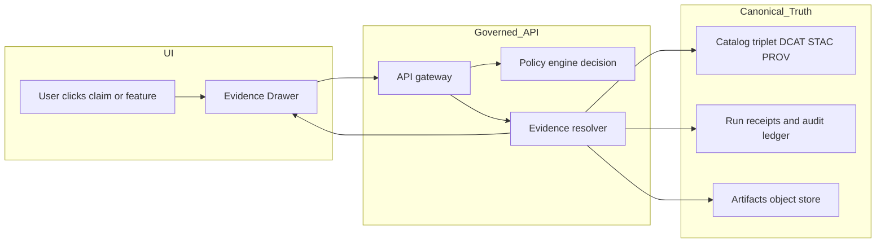

<!-- [KFM_META_BLOCK_V2]
doc_id: kfm://doc/3c0a0b1a-7e2f-4dd1-b2a6-785f5b20c3b5
title: KFM Evidence Drawer Standard
type: standard
version: v1
status: draft
owners: TBD
created: 2026-03-04
updated: 2026-03-04
policy_label: restricted
related: [docs/standards/ui/KFM_EVIDENCE_DRAWER_STANDARD.md]
tags: [kfm, ui, evidence, provenance, trust, citations]
notes: [Defines the shared Evidence Drawer component for Map Explorer, Story Mode, and Focus Mode.]
[/KFM_META_BLOCK_V2] -->

# KFM Evidence Drawer Standard
Shared UI standard for inspecting **resolvable evidence** (EvidenceRefs → EvidenceBundles) behind every claim in Map Explorer, Story Mode, and Focus Mode.

---

## Impact

<p align="center">
  
  
  
  
</p>

- **Status:** `draft` (**PROPOSED** standard; see “Requirement registry”)
- **Owners:** **UNKNOWN** (assign UI + Governance owners)
- **Applies to:** Map Explorer, Story Mode, Focus Mode, and any UI surface that renders claims or feature attributes
- **Non-negotiable posture:** Evidence inspection is part of the UI’s **governance contract**, not optional polish.

---

## Quick navigation

- [Scope](#scope)
- [Where it fits](#where-it-fits)
- [Acceptable inputs](#acceptable-inputs)
- [Exclusions](#exclusions)
- [Definitions](#definitions)
- [Confirmed invariants](#confirmed-invariants)
- [Requirement registry](#requirement-registry)
- [Behavior specification](#behavior-specification)
- [Data contract](#data-contract)
- [Telemetry](#telemetry)
- [Security and privacy](#security-and-privacy)
- [Accessibility](#accessibility)
- [Testing and QA](#testing-and-qa)
- [Definition of Done](#definition-of-done)
- [Appendix](#appendix)

---

## Scope

**PROPOSED:** Define a consistent Evidence Drawer UI component (and its API contract expectations) that enables users to:
1) Inspect the evidence behind a claim,
2) Understand what was withheld (policy-safe),
3) Reproduce the claim (via digests + catalogs + receipts) when allowed.

---

## Where it fits

**CONFIRMED:** The Evidence Drawer is a shared UI component used across Map Explorer, Story Mode, and Focus Mode. It is a first-class “trust surface,” accessible anywhere claims appear.  

**CONFIRMED:** The UI is a governed client: it renders what the governed API returns and must not embed privileged credentials.



---

## Acceptable inputs

**CONFIRMED:** Evidence Drawer content must be sourced from the governed API and evidence resolver surfaces (EvidenceRefs that resolve to EvidenceBundles).

**PROPOSED:** Minimum UI inputs (DTOs) for the drawer:
- `EvidenceBundleSummary` (fast, for initial render)
- `EvidenceBundle` (full details)
- `PolicyDecisionSummary` (policy-safe explanation + obligations)
- Optional: `EvidenceExcerpt` for documents (policy-allowed excerpts/snippets)

---

## Exclusions

- **CONFIRMED:** No direct UI access to databases, object storage, search, or LLM services (trust membrane).
- **PROPOSED:** The Evidence Drawer is not:
  - A dataset browser (that’s Catalog / Dataset detail views),
  - An admin/policy editor,
  - A raw-file viewer for restricted artifacts (must remain policy-gated).

---

## Definitions

- **Claim:** A user-visible statement or implication (text, label, numeric value, classification, or map feature attribute) that must be backed by evidence.
- **EvidenceRef:** A resolvable reference (not “a URL pasted into text”) that resolves into an EvidenceBundle via the evidence resolver.
- **EvidenceBundle:** Inspectable package containing evidence metadata, policy result, digests, catalogs, provenance, and (if allowed) artifact links.
- **Citation verification hard gate:** A required step where every citation must resolve and be policy-allowed; if not, the system must revise or abstain.
- **Audit ref:** A stable identifier for a governed operation (e.g., Focus query run, story publish, evidence resolution), used for steward review.
- **Obligations:** Redaction/generalization requirements applied by policy (e.g., generalized geometry, withheld fields).

---

## Confirmed invariants

The following are **CONFIRMED** invariants and must be treated as UI-level guardrails:

1) **Evidence-first UX:** Evidence Drawer exists as a shared trust surface across Map/Story/Focus.
2) **Cite-or-abstain posture:** If citations can’t be verified/resolved, the claim must be withheld, narrowed, or marked unsupported.
3) **Policy-safe abstention:** UI must explain “why” in policy-safe terms and must not leak restricted existence via “ghost metadata.”
4) **Evidence bundle minimums:** Drawer must show bundle ID and digest, dataset version, license/rights, freshness/validation, provenance chain, redactions applied, and artifact links only if allowed.
5) **Publishing gate:** Story publishing must be blocked if any citation fails to resolve; the UI may enforce this by calling the evidence resolver during publish checks.

---

## Requirement registry

**How to read this table**
- **Status**
  - **CONFIRMED:** Required by KFM source guidance; implement as invariant.
  - **PROPOSED:** This standard proposes an implementation detail; may evolve.
  - **UNKNOWN:** Not verified; do not ship without governance review.
- **Priority**
  - **MUST:** Required for compliance.
  - **SHOULD:** Strongly recommended.
  - **MAY:** Optional.

> NOTE: Requirements are written to be **testable** (CI/e2e).

### A. Surface and navigation requirements

| ID | Status | Priority | Requirement |
|---|---|---:|---|
| ED-001 | CONFIRMED | MUST | Evidence Drawer is available from Map Explorer feature inspect, Story Mode claim hooks, and Focus Mode citations. |
| ED-002 | CONFIRMED | MUST | Drawer content is sourced only from governed API responses; UI does not query DB/object storage/search directly. |
| ED-003 | CONFIRMED | MUST | Drawer can be opened from any feature click and must display license and dataset version info. |
| ED-004 | PROPOSED | SHOULD | Drawer supports deep-linking via `bundle_id` (and optionally `audit_ref`) for shareable inspections (policy-safe). |

### B. Evidence minimum display requirements

| ID | Status | Priority | Requirement |
|---|---|---:|---|
| ED-010 | CONFIRMED | MUST | Show EvidenceBundle ID and digest. |
| ED-011 | CONFIRMED | MUST | Show dataset version identifier and dataset name (policy-safe). |
| ED-012 | CONFIRMED | MUST | Show license (SPDX if available) and attribution/rights holder. |
| ED-013 | CONFIRMED | MUST | Show freshness (last run timestamp) and validation status (pass/degraded/fail), policy-safe. |
| ED-014 | CONFIRMED | MUST | Show provenance chain entry point (run receipt link/reference) and audit ref for the governing operation. |
| ED-015 | CONFIRMED | MUST | Show redactions/generalizations applied as obligations (policy-safe wording). |
| ED-016 | CONFIRMED | MUST | Artifact links are shown only if policy allows; otherwise show a denied/withheld state with a reason code. |

### C. Policy and abstention behavior requirements

| ID | Status | Priority | Requirement |
|---|---|---:|---|
| ED-020 | CONFIRMED | MUST | If the API indicates restricted evidence, the drawer explains “why” in policy-safe terms, suggests safe alternatives when possible, and includes `audit_ref`. |
| ED-021 | CONFIRMED | MUST | Do not reveal restricted existence via UI differences (“ghost metadata”); align error states with policy (avoid informative 403 vs 404 mismatches where required). |
| ED-022 | PROPOSED | SHOULD | Drawer UI includes an “Access request” affordance that routes to steward workflow (without exposing restricted details). |
| ED-023 | PROPOSED | MUST | If bundle resolution fails, show a stable error model: `error_code`, policy-safe `message`, and `audit_ref` (if provided). |

### D. Citation resolvability and publishing gates

| ID | Status | Priority | Requirement |
|---|---|---:|---|
| ED-030 | CONFIRMED | MUST | A “citation” in UI maps to an EvidenceRef that resolves to an EvidenceBundle (not a bare URL). |
| ED-031 | CONFIRMED | MUST | For Story publishing UI, block publish if any citation fails to resolve and is policy-allowed. |
| ED-032 | PROPOSED | SHOULD | Drawer indicates citation verification result for each citation: verified, partial, denied, unresolved (policy-safe). |
| ED-033 | PROPOSED | SHOULD | Drawer provides “copy citation” that copies a policy-safe citation object (bundle_id, dataset_version_id, digest, locator). |

### E. Performance and interaction requirements

| ID | Status | Priority | Requirement |
|---|---|---:|---|
| ED-040 | CONFIRMED | MUST | UI should be able to resolve and render evidence in <= 2 API calls (summary + resolve, or a single resolve if summary included). |
| ED-041 | PROPOSED | SHOULD | Drawer opens immediately with a skeleton state; progressively hydrates details and avoids blocking the main UI thread. |
| ED-042 | PROPOSED | SHOULD | Evidence list uses virtualization when evidence items exceed a threshold (e.g., >50). |
| ED-043 | PROPOSED | SHOULD | Cache EvidenceBundle responses by `bundle_id` + auth/policy context (fail-closed on cache misses). |

### F. Security, privacy, and content safety requirements

| ID | Status | Priority | Requirement |
|---|---|---:|---|
| ED-050 | CONFIRMED | MUST | Safe markdown rendering for narratives and evidence excerpts (sanitize; CSP-aware). |
| ED-051 | CONFIRMED | MUST | UI never embeds privileged credentials; authentication is via standard front-end auth flow and server-side policy enforcement. |
| ED-052 | PROPOSED | MUST | Telemetry must not include raw evidence text, raw coordinates (if sensitive), or restricted identifiers. |
| ED-053 | PROPOSED | SHOULD | External links open with safe defaults (e.g., `noopener`, `noreferrer`) and are only rendered if policy allows. |

### G. Accessibility requirements

| ID | Status | Priority | Requirement |
|---|---|---:|---|
| ED-060 | CONFIRMED | MUST | Drawer is keyboard navigable with visible focus states. |
| ED-061 | CONFIRMED | MUST | Policy badges and status indicators have text labels (no color-only meaning). |
| ED-062 | CONFIRMED | MUST | Proper ARIA labeling and focus management for drawer open/close; Esc closes; focus returns to opener. |
| ED-063 | PROPOSED | SHOULD | Evidence items have accessible names including source title and evidence type. |

---

## Behavior specification

### Open/close and focus

- **CONFIRMED:** Keyboard navigation is required.
- **PROPOSED:** The drawer behaves like a dialog:
  - Open: focus moves to drawer title.
  - Close: Esc closes.
  - Focus trap inside drawer while open.
  - Close returns focus to the element that opened it.

### Loading states

- **PROPOSED:** Drawer uses a 3-stage load:
  1) `loading_summary`
  2) `loading_details`
  3) `ready`

### Policy-denied states

- **CONFIRMED:** Abstention must be understandable without leaking restricted info.
- **PROPOSED:** Use stable reason codes and remediation hints:
  - `DENIED_ROLE`
  - `DENIED_TOPIC`
  - `OBLIGATION_GENERALIZED`
  - `REDACTED_FIELDS`
  - `UNRESOLVABLE_REF`

### Rendering rules

- **CONFIRMED:** The drawer shows (at minimum) bundle/digest, dataset version, license/rights, freshness/validation, provenance, artifact links (only if allowed), and redactions applied.

---

## Data contract

**CONFIRMED:** Citation and evidence resolution are mediated through an evidence resolver that returns EvidenceBundles.

**PROPOSED:** UI-facing JSON shapes.

### EvidenceBundle (example)

```json
{
  "bundle_id": "sha256:bundle...",
  "dataset_version_id": "2026-02.abcd1234",
  "title": "Storm event record: 2026-02-19",
  "policy": {
    "decision": "allow",
    "policy_label": "public",
    "obligations_applied": []
  },
  "license": {
    "spdx": "CC-BY-4.0",
    "attribution": "Source org"
  },
  "provenance": {
    "run_id": "kfm://run/2026-02-20T12:00:00Z.abcd"
  },
  "artifacts": [
    {
      "href": "processed/events.parquet",
      "digest": "sha256:2222",
      "media_type": "application/x-parquet"
    }
  ],
  "checks": {
    "catalog_valid": true,
    "links_ok": true
  },
  "audit_ref": "kfm://audit/entry/123"
}
```

### EvidenceBundleSummary (proposed)

```json
{
  "bundle_id": "sha256:bundle...",
  "dataset_version_id": "2026-02.abcd1234",
  "title": "Storm event record: 2026-02-19",
  "policy": { "decision": "allow", "policy_label": "public" },
  "license": { "spdx": "CC-BY-4.0" },
  "checks": { "catalog_valid": true },
  "audit_ref": "kfm://audit/entry/123"
}
```

### Citation locator (proposed)

```json
{
  "citation_id": "c-0042",
  "bundle_id": "sha256:bundle...",
  "evidence_id": "ev-99",
  "locator": {
    "type": "document",
    "page": 37,
    "lines": "L82-L105",
    "bbox": [0.12, 0.44, 0.83, 0.58]
  }
}
```

---

## Telemetry

**PROPOSED:** Telemetry exists to measure usability and governance friction without capturing sensitive content.

### Events (suggested)

- `evidence_drawer_open`
- `evidence_drawer_close`
- `evidence_bundle_resolve_success`
- `evidence_bundle_resolve_denied`
- `evidence_item_open`
- `evidence_citation_copy`
- `evidence_external_link_open`

### Required constraints

- **PROPOSED (MUST):** No raw evidence text, no restricted identifiers, no precise restricted coordinates in telemetry payloads.
- **PROPOSED (SHOULD):** Include only:
  - `bundle_id` (or a hashed surrogate if required),
  - `audit_ref`,
  - coarse `policy_label`,
  - `decision` (allow/deny),
  - `reason_code`,
  - `ui_surface` (`map`, `story`, `focus`),
  - timing metrics (latency, render duration).

---

## Security and privacy

- **CONFIRMED:** UI must not embed privileged credentials; it is a governed client.
- **CONFIRMED:** Safe rendering is required for any markdown-like narrative or excerpts.
- **PROPOSED:** Evidence Drawer must treat all evidence display content as untrusted until sanitized:
  - sanitize HTML/markdown
  - strict CSP
  - forbid inline scripts
  - strip unsafe URLs

---

## Accessibility

**CONFIRMED minimums**
- Keyboard navigable Evidence Drawer.
- Visible focus states.
- Text labels for policy and status (no color-only signals).
- ARIA labels and correct role semantics.

**PROPOSED tests**
- Automated a11y checks on drawer open/close.
- Keyboard-only regression tests for focus trap and “return focus to opener.”

---

## Testing and QA

**CONFIRMED:** Story publish and Focus answers must enforce resolvable citations; non-resolvable citations are high-risk and must be gated.

**PROPOSED test plan**
- Contract tests: validate EvidenceBundle JSON schema (golden fixtures).
- E2E tests:
  - open drawer from map feature
  - open drawer from story citation
  - open drawer from focus citation
  - denied bundle shows policy-safe reason + audit_ref (if present)
  - publish blocked on unresolved citations
- Security tests:
  - injection payloads in evidence excerpts do not execute
  - external links sanitized
- Performance tests:
  - open drawer under load (no main-thread stalls)
  - evidence list virtualization threshold behaves

---

## Definition of Done

- [ ] Evidence Drawer available from Map, Story, and Focus surfaces (ED-001).
- [ ] Drawer shows required minimum fields (ED-010..ED-016).
- [ ] Policy-denied and abstention states are policy-safe (ED-020..ED-021).
- [ ] Story publish blocks on unresolvable citations (ED-031).
- [ ] Keyboard navigation and ARIA requirements pass (ED-060..ED-062).
- [ ] No privileged secrets in UI and no sensitive telemetry leakage (ED-051..ED-052).
- [ ] Contract + e2e tests added to CI.

---

## Appendix

### A. Proposed UI component layout (non-authoritative)

**PROPOSED** (paths may differ by repo structure):

```text
web/src/components/evidence/
  EvidenceDrawer.tsx
  EvidenceBundleHeader.tsx
  EvidenceItemList.tsx
  EvidenceItemCard.tsx
  EvidencePolicyNotice.tsx
  EvidenceProvenancePanel.tsx
  EvidenceLicensePanel.tsx
  EvidenceArtifactsPanel.tsx
```

### B. Back to top

Back to top: [KFM Evidence Drawer Standard](#kfm-evidence-drawer-standard)
