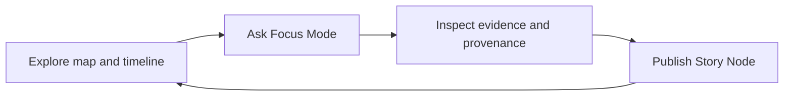

<!-- [KFM_META_BLOCK_V2]
doc_id: kfm://doc/3d1e8a64-8e06-4de2-9d4e-3d0a6d4a1e6f
title: KFM Evidence-First UX Standard
type: standard
version: v1
status: draft
owners: ["@Kansas-Frontier-Matrix/ui", "@Kansas-Frontier-Matrix/core"]
created: 2026-03-04
updated: 2026-03-04
policy_label: public
related: ["docs/standards/ui/", "docs/specs/api/", "docs/specs/policy/", "docs/specs/evidence/"]
tags: ["kfm", "ux", "evidence-first", "governance", "citations"]
notes: ["Defines non-negotiable UX behaviors that enforce cite-or-abstain and make provenance/policy visible."]
[/KFM_META_BLOCK_V2] -->

# KFM Evidence-First UX Standard
Non-negotiable UX requirements to make **evidence, provenance, licensing, and policy** visible and verifiable across **Map Explorer**, **Story Mode**, and **Focus Mode**.

---

## Impact
**Status:** Draft (normative intent; implement incrementally)  
**Owners:** `@Kansas-Frontier-Matrix/ui`, `@Kansas-Frontier-Matrix/core`  
**Applies to:** Web UI, Story publishing UI, export/report UX, and any future clients (mobile, desktop)

Badges (placeholders):
- 
- 
- 

Quick nav:  
- [Scope](#scope)  
- [Non-negotiable invariants](#non-negotiable-invariants)  
- [Required UI surfaces](#required-ui-surfaces)  
- [Abstention and restriction UX](#abstention-and-restriction-ux)  
- [Accessibility](#accessibility)  
- [Testing and enforcement](#testing-and-enforcement)  
- [Definition of Done](#definition-of-done)  
- [Appendix](#appendix)

---

## Scope
This standard governs **user-visible trust** in KFM.

It defines what the UI **MUST** do so that:
- Every map layer, story claim, and Focus Mode answer is **backed by resolvable evidence**; otherwise it **abstains**.
- Users can **inspect provenance** (who/what/when/how) and **license/rights** for every surfaced claim.
- Policy controls (denials, redactions, generalization) are **visible and explainable**.

---

## Where it fits
**Path:** `docs/standards/ui/`  
**Upstream:** governance model (trust membrane, evidence resolver, promotion gates)  
**Downstream:** UI component contracts, acceptance tests, publish gates, Focus Mode schemas

---

## Acceptable inputs
The UI MAY render only artifacts and metadata returned from governed APIs, including:
- `EvidenceRef` objects (citations) that resolve via the evidence resolver
- `EvidenceBundle` objects (inspectable evidence cards + machine metadata + digests)
- dataset/version metadata (e.g., `dataset_version_id`, catalog links)
- policy decisions (allow/deny + obligations applied)

---

## Exclusions
The following MUST NOT be introduced by any UI work:
- Direct database/object-store access from clients (no “just query PostGIS from the browser”).
- “Citations” that are only pasted URLs or free text without resolvable EvidenceRefs.
- UI-only overrides that bypass publish gates (“publish anyway”) for stories or Focus Mode outputs.
- Hiding license/policy status behind advanced panes or dev tools.

---

## Terms and definitions
### EvidenceRef
A **resolvable reference** to evidence. Not a raw URL.

Minimum required UI contract (illustrative):

```json
{
  "evidence_ref": "kfm://evidence/ref/...",
  "label": "USGS gage daily mean streamflow",
  "dataset_version_id": "kfm://dataset-version/...",
  "policy_label": "public"
}
```

### EvidenceBundle
A **verifiable evidence package** returned by the evidence resolver (human card + machine metadata + digests + audit references).

Minimum required UI fields (normative; see [Evidence Drawer](#1-evidence-drawer-shared-component)).

### audit_ref
A stable identifier for the governed run/receipt that produced an answer, story publish, or pipeline output.

### obligations
Policy-required transformations applied prior to display (e.g., coordinate generalization, attribute masking). The UI must surface these.

### view_state
Reproducible state describing a map view and filters (bbox/zoom, active layers, time window). Used by Story replay and Focus context.

---

## Normative language
This document uses:
- **MUST / MUST NOT** = required for conformance
- **SHOULD / SHOULD NOT** = recommended best practice
- **MAY** = optional

---

## Non-negotiable invariants
These items are **CONFIRMED** by KFM governance sources and are not optional.

1) **Trust membrane**
- The UI is a governed client: it renders what the API returns and **never** embeds privileged credentials.
- Clients MUST NOT access storage/DB directly; all reads/writes MUST cross the governed API + policy boundary.

2) **Cite-or-abstain**
- If citations cannot be verified/resolved and policy-allowed, the UI MUST:
  - **abstain**, or
  - **reduce scope** to what is provably supported.

3) **Hard citation verification gate**
- Story publishing and Focus Mode responses MUST be blocked/denied when citations fail to resolve.

4) **Evidence everywhere**
- Evidence inspection MUST be available from every trust-bearing surface:
  - map features/layers,
  - Story claims,
  - Focus Mode answers.

---

## Required UI surfaces
### 1) Evidence Drawer (shared component)
**CONFIRMED requirement:** Provide one shared Evidence Drawer (or Evidence Panel) component accessible from Map Explorer, Story Mode, and Focus Mode.

**MUST show (minimum):**
- Evidence bundle ID **and digest**
- DatasetVersion ID + dataset title
- License + attribution text
- Freshness (last run timestamp) and validation status
- Provenance chain (run receipt link) + `audit_ref`
- Artifact links (only if policy allows)
- Redactions/obligations applied (explicit)

**MUST behaviors:**
- Openable from any citation click (map, story, chat).
- Fail closed:
  - If evidence cannot be resolved, the UI must mark the claim **unverified** and prevent publish/export that would present it as verified.
- Never show restricted artifacts or restricted evidence metadata; obey policy-filtered payloads as-is.

**SHOULD behaviors:**
- “Copy citation” copies a stable EvidenceRef (not a URL).
- “Download evidence card” exports a small JSON/Markdown evidence card including `bundle_id`, `digest`, `dataset_version_id`, `license`, and `audit_ref`.

---

### 2) Citation chips and inline evidence
**MUST:**
- Render citations as **interactive chips/links** that open the Evidence Drawer.
- Disallow “dead citations”:
  - If a citation is not resolvable right now (network down, resolver error), the UI must visually distinguish it and prevent publishing/claiming it as verified.

**SHOULD:**
- Show a short snippet or label for each citation in-place (tooltips ok).
- Expose dataset/version in the citation UI (e.g., “Dataset v2026-02…”) to reduce confusion.

---

### 3) Dataset version, license, and policy badges
**MUST:**
- Every visible dataset layer MUST display:
  - `dataset_version_id` (or an equivalent stable ID),
  - license/rights summary,
  - a policy label/badge (public/restricted/etc).

**SHOULD:**
- Provide a “What changed?” diff panel for dataset version changes (counts/checksums/QA metrics), when available.

**MUST NOT:**
- Imply “trust” with only a green badge without explanation of scope and provenance.

---

### 4) Map Explorer baseline (evidence-first)
Required baseline components (names illustrative):
- MapCanvas
- LayerPanel (toggles, opacity, legend, **policy badge**, **data version**)
- TimeControl (range + histogram)
- FeatureInspectPanel (attributes + citations)
- EvidenceDrawer (shared)

**MUST:**
- A user clicking any feature MUST be able to open evidence for that feature in ≤2 interactions (click → evidence).
- Keyboard navigation MUST work for LayerPanel and EvidenceDrawer.

---

### 5) Story Mode and Story Node publishing
**MUST:**
- Story Nodes MUST support citations that open the Evidence Drawer.
- The Story publish workflow MUST include a **publish gate** that verifies:
  - every claim has resolvable evidence,
  - citations are policy-allowed,
  - review state is captured.

**SHOULD:**
- Store Story map `view_state` so the narrative replays the same view.

**MUST NOT:**
- Allow publishing a story with unresolved citations (no “publish anyway”).

---

### 6) Focus Mode (governed Q&A with receipts)
**MUST:**
- Focus Mode answers MUST return:
  - answer text,
  - citations (EvidenceRefs),
  - `audit_ref` (run receipt ID).
- The UI MUST provide:
  - inline citations,
  - a Policy Notice explaining withheld information (when applicable),
  - an Export/Download action that includes `audit_ref` + citations.

**MUST follow cite-or-abstain UX:**
- If citations cannot be verified, Focus Mode MUST abstain or reduce scope.
- The UI MUST render abstentions clearly and non-deceptively (see next section).

---

### 7) Provenance timeline (optional enhancement)
**PROPOSED:**
- Provide a Provenance Timeline view for dataset versions:
  - agent → activity → ingestion → dataset
  - linkable policy bundles + evidence IDs
  - commit SHAs where available

If implemented:
- MUST be policy-filtered by default.
- MUST not leak restricted metadata via receipts/logs.

---

## Abstention and restriction UX
**CONFIRMED requirement:** Abstention UX must be explicit and actionable.

When the system abstains or partially answers, the UI MUST include:
- what is missing (in policy-safe terms),
- what is allowed (public alternatives),
- how to request access (steward review workflow),
- the `audit_ref` for follow-up.

**Partial answers are acceptable** when only part of a question is supported.

Recommended copy template:

> **Unable to fully answer from verified evidence.**  
> What I can support: …  
> What’s missing: …  
> Next steps: …  
> Audit reference: `kfm://run/...`

---

## Error and failure-mode standards
### Evidence resolver failure
**MUST:**
- Treat resolver errors as **loss of verification**, not as “probably fine.”
- Block story publishing if any required evidence check cannot complete.

**SHOULD:**
- Provide a “Retry evidence” action and a clear degraded-state badge.

### Policy denials / generalized outputs
**MUST:**
- Display “why” in user-safe terms (e.g., “Geometry generalized due to policy”).
- List obligations applied (generalization level, masking, coarsening).

---

## Accessibility
Minimum accessibility requirements:
- Keyboard navigable layer controls and Evidence Drawer; visible focus states.
- Text labels for policy badges and status indicators (no color-only meaning).
- ARIA labels for map controls.
- Safe markdown rendering for narratives (CSP + sanitization to prevent XSS).
- Export outputs include citations and `audit_ref` in a readable format.

---

## Security notes for UX implementers
**MUST:**
- Treat all rendered content (OCR text, story markdown, evidence snippets) as untrusted input.
- Sanitize markdown and block script injection paths.
- Avoid displaying hidden/system prompts or restricted-source enumerations.

**SHOULD:**
- Keep a strict allowlist of outgoing links/actions from evidence cards.

---

## Testing and enforcement
This standard is only real if it is enforced.

### Required automated checks
**MUST have (minimum):**
- UI e2e test: Feature click → Evidence Drawer opens → shows license + dataset version.
- Story publish test: unresolved citation blocks publish.
- Focus Mode schema validation: responses include citations + `audit_ref`.
- Policy regression tests: restricted content does not leak into UI surfaces.
- Link/citation checks: citations resolve via evidence resolver.

### Conformance table

| UX surface | Evidence required? | Must show license? | Must show version? | Publish/export blocked if unresolved? |
|---|---:|---:|---:|---:|
| Map feature inspect | Yes | Yes | Yes | N/A (browse) |
| Story claim | Yes | Yes | Yes | Yes |
| Focus Mode answer | Yes | Yes (via evidence) | Yes | Yes |
| Export report | Yes | Yes | Yes | Yes |

---

## Mermaid: Evidence-first interaction loop


---

## Definition of Done
A UI change touching Map/Story/Focus is “done” only if:

- [ ] Every new/updated user-facing claim has a resolvable EvidenceRef path to an EvidenceBundle.
- [ ] Evidence Drawer can be opened from the new surface (map/story/chat) in ≤2 interactions.
- [ ] License + attribution are visible in Evidence Drawer for the surfaced claim.
- [ ] Dataset version identifier is visible for any dataset-backed rendering.
- [ ] Restricted/policy-generalized behavior is visible (Policy Notice + obligations applied).
- [ ] Story publishing blocks on any unresolved citation.
- [ ] Focus Mode export includes citations + `audit_ref`.
- [ ] Keyboard navigation works for the touched controls and Evidence Drawer.
- [ ] e2e tests added/updated and run in CI.

---

## FAQ
### Why can’t we just show URLs as citations?
Because KFM citations are **resolvable EvidenceRefs** that map to inspectable EvidenceBundles with digests, provenance, and policy enforcement.

### Why is “fail closed” required? Isn’t that harsh?
Fail-open creates silent trust failures: users see answers that look verified but are not. Evidence-first UX is an enforcement surface, not decoration.

### Can we ship without the Provenance Timeline?
Yes. It’s **PROPOSED**. Evidence Drawer + cite-or-abstain gates are the minimum.

---

## Appendix
<details>
<summary>Example EvidenceBundle (illustrative shape)</summary>

```json
{
  "bundle_id": "sha256:bundle...",
  "dataset_version_id": "kfm://dataset-version/2026-02.abcd1234",
  "title": "Storm event record: 2026-02-19",
  "policy": {
    "decision": "allow",
    "policy_label": "public",
    "obligations_applied": []
  },
  "license": {
    "spdx": "CC-BY-4.0",
    "attribution": "Source organization"
  },
  "provenance": {
    "run_id": "kfm://run/2026-02-20T12:00:00Z.abcd"
  },
  "checks": {
    "catalog_valid": true,
    "links_ok": true
  },
  "audit_ref": "kfm://audit/entry/123"
}
```

</details>

<details>
<summary>Suggested UI strings (policy-safe)</summary>

- “Evidence unavailable — cannot verify this claim right now.”
- “Some details withheld due to policy. You can request steward review.”
- “Generalized geometry applied (policy obligation).”

</details>

---

[Back to top](#kfm-evidence-first-ux-standard)
