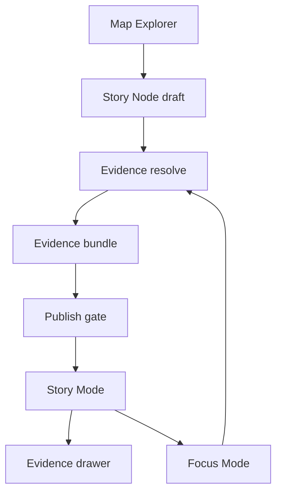

<!-- [KFM_META_BLOCK_V2]
doc_id: kfm://doc/7b1e2c02-78d2-4b84-9cbb-0f4da7f1342c
title: KFM Story Node Standard
type: standard
version: v1
status: draft
owners: ["@kfm-ui", "@kfm-governance"]
created: 2026-03-04
updated: 2026-03-04
policy_label: public
related: []
tags: [kfm, ui, story-nodes, standards]
notes: ["Defines Story Node v3 packaging + UI behavior (Story Mode + Focus Mode integration)."]
[/KFM_META_BLOCK_V2] -->

# KFM Story Node Standard
Story Nodes are governed, evidence-linked narratives that replay a map/timeline view and remain inspectable through resolvable citations.

---

## Impact

**Status:** draft (intended to become *active*)  
**Owners:** `@kfm-ui`, `@kfm-governance`  
**Applies to:** Map Explorer, Story Mode, Focus Mode, Story publish workflow


**Quick nav:**
- [Scope](#scope)
- [Requirements matrix](#requirements-matrix)
- [Story Node v3 packaging](#story-node-v3-packaging)
- [UI contract](#ui-contract)
- [Publish and CI gates](#publish-and-ci-gates)
- [Examples](#examples)
- [Definition of done](#definition-of-done)

---

## Scope

This standard defines:
- The **Story Node v3 artifact** (markdown + sidecar JSON) and how the **UI must render it**.
- The **citation/evidence handshake** between Story Nodes, the governed API, and the Evidence Drawer.
- The **minimum publish gates** required for Story Nodes to be considered a governed artifact.

This standard does **not** define:
- Dataset promotion gates (RAW → WORK → PROCESSED → PUBLISHED).
- The full evidence resolver API contract (only the UI expectations).

---

## Where it fits

Story Nodes sit at the end of the “truth path”:

**data → catalogs/provenance → governed APIs → Map/Story UI → Focus Mode → Story publish**

They are:
- A **UI surface** (Story Mode) and also
- A **data artifact** (machine-readable sidecar + resolvable evidence)

---

## Repository paths

- **CONFIRMED:** This standard is intended to live at `docs/standards/ui/KFM_STORY_NODE_STANDARD.md`.
- **CONFIRMED (doc-referenced; verify in repo):** a Story Node v3 template is referenced as `docs/templates/TEMPLATE__STORY_NODE_V3.md`.
- **PROPOSED:** publishable Story Node content lives outside `docs/` (e.g., `content/stories/<story-slug>/`), to keep docs separate from published narrative artifacts.

**PROPOSED directory example:**

```text
content/
  stories/
    <story-slug>/
      story.md
      story.sidecar.json
```

---

## Acceptable inputs

A Story Node v3 consists of:
- One **markdown** document (human narrative).
- One **sidecar JSON** document (map state + citations + policy/review state).

Optional (policy-dependent):
- Embedded media (images, figures) **only** if licensed and attributable.

---

## Exclusions

Story Nodes MUST NOT:
- Embed privileged credentials or direct-storage URLs.
- Use “citations” that are only raw web URLs (citations must be resolvable EvidenceRefs).
- Include restricted geometry/coordinates in public Story Nodes unless policy obligations explicitly allow.

---

## Normative language

- **MUST** = required for compliance.
- **SHOULD** = strongly recommended; exceptions require a documented reason.
- **MAY** = optional.

## Evidence discipline labels

Each requirement below is labeled:
- **CONFIRMED**: explicitly supported by current KFM design documents.
- **PROPOSED**: present as a recommendation/proposal in KFM docs; treat as a target.
- **UNKNOWN**: not specified yet; requires governance/engineering decision.

---

## Requirements matrix

| ID | Requirement | Level | Label | UI/Test implication |
|---:|---|:---:|:---:|---|
| SN-001 | A Story Node v3 is **markdown + sidecar JSON**; sidecar captures **map state + citations**. | MUST | CONFIRMED | UI expects `story.md` + `story.sidecar.json` (or equivalent pairing). |
| SN-002 | Story publishing is a **governed event** that requires **review state** and **resolvable citations**. | MUST | CONFIRMED | Publish UI blocks when citations fail to resolve; review state required. |
| SN-003 | A “citation” is an **EvidenceRef** that resolves (policy-aware) into an **EvidenceBundle**; raw URLs are insufficient. | MUST | CONFIRMED | Citation click opens Evidence Drawer resolved via API. |
| SN-004 | Story Node sidecar includes: `kfm_story_node_version`, `story_id`, `version_id`, `status`, `policy_label`, `review_state`, `map_state`, `citations[]`. | MUST | CONFIRMED | JSON schema validation in CI; runtime decoding in UI. |
| SN-005 | Story Node markdown contains a **KFM MetaBlock v2** with `type: story`, `version: v3`, and a `policy_label`. | MUST | CONFIRMED | Markdown linter validates MetaBlock presence. |
| SN-006 | Story Mode UI includes a **StoryNodeReader** that renders markdown with **citation hooks**, using a shared **EvidenceDrawer** component. | MUST | CONFIRMED | Component contract: citations open evidence drawer. |
| SN-007 | Evidence Drawer shows (minimum): **bundle id + digest**, **dataset version id**, **license/rights**, **freshness + validation**, **provenance chain**, **artifact links (policy-allowed)**, **redactions applied**. | MUST | CONFIRMED | Evidence drawer acceptance tests verify all fields + keyboard nav. |
| SN-008 | The UI is a **governed client**: it renders API responses and does **not** embed privileged credentials; governance must be visible. | MUST | CONFIRMED | Security review + e2e tests: no direct DB/storage access. |
| SN-009 | Story Nodes **reference graph entities** (people/places/events/docs) using **stable identifiers**. | SHOULD | CONFIRMED | Entity chips/panels can be rendered from IDs. |
| SN-010 | Story Nodes **separate observation claims from interpretive claims**, and include uncertainty notes when sources conflict. | SHOULD | PROPOSED | Optional UI affordance: “Fact vs interpretation” styling. |
| SN-011 | Abstention is a feature: UI must explain restrictions **in policy-safe terms**, suggest safe alternatives, and provide `audit_ref` for follow-up. | MUST | CONFIRMED | Error/abstention component; avoids “ghost metadata.” |
| SN-012 | Markdown rendering MUST be safe (sanitized + CSP) and accessible (keyboard navigation, non-color-only cues). | MUST | CONFIRMED | Security tests + accessibility checks. |
| SN-013 | Exported story/focus outputs include citations and `audit_ref` in a readable format. | SHOULD | CONFIRMED | Export pipeline and snapshot tests. |

---

## Story Node v3 packaging

### Artifact set

**CONFIRMED:** A Story Node has:
- **Markdown file** (human readable)
- **Sidecar JSON** (machine metadata: map state, citations, policy, review)

### Story Node markdown

The markdown file is the narrative surface.

**CONFIRMED skeleton (illustrative):**
- KFM MetaBlock v2
- `# <Story title>`
- `## Summary`
- `## Claims`
- `## Narrative`
- `## Evidence`

**Citation token convention:**
- **CONFIRMED:** Inline citation tokens appear as `[...] [CITATION: <ref>]`.
- **PROPOSED:** The `<ref>` string MUST match a `citations[].ref` entry in the sidecar (exact string match).

### Story Node sidecar JSON

The sidecar is the machine-readable contract between:
- the Story authoring/publishing workflow,
- the UI renderer, and
- the evidence resolver.

**CONFIRMED fields (minimum):**

```json
{
  "kfm_story_node_version": "v3",
  "story_id": "kfm://story/<uuid>",
  "version_id": "v1",
  "status": "draft",
  "policy_label": "public",
  "review_state": "needs_review",
  "map_state": {
    "bbox": [-102.0, 36.9, -94.6, 40.0],
    "zoom": 6,
    "layers": [
      { "layer_id": "noaa_storm_events", "dataset_version_id": "2026-02.abcd1234" }
    ],
    "time_window": { "start": "1950-01-01", "end": "2024-12-31" }
  },
  "citations": [
    { "ref": "dcat://noaa_ncei_storm_events@2026-02.abcd1234", "kind": "dcat" },
    { "ref": "prov://run/2026-02-20T12:34Z...", "kind": "prov" }
  ]
}
```

### Evidence resolution and publish gate

**CONFIRMED:** Publishing gate:
- **All citations MUST resolve** through the evidence resolver endpoint (e.g., `/api/v1/evidence/resolve`).
- If a citation does not resolve or is not policy-allowed, the system **fails closed** (block publish, or force scope reduction).

### EvidenceRef schemes

**CONFIRMED (recommended):** EvidenceRefs use canonical, parseable schemes (no network calls required to parse), such as:
- `dcat://…`
- `stac://…`
- `prov://…`
- `doc://…`
- `graph://…`

**CONFIRMED:** The evidence resolver validates syntax and returns policy-safe errors.

### Map state semantics

**CONFIRMED:** `map_state` is treated as a reproducible artifact. Minimum semantics:
- camera position (`bbox`/`zoom`)
- active layers and style parameters
- time window
- filters

### Entity references

**CONFIRMED:** Story Nodes link key entities (people, places, events, documents) to graph IDs.

**UNKNOWN (needs a decision):** Exact syntax for entity tags in markdown.
- Smallest verification step: choose one canonical inline encoding (e.g., `[@entity:kfm://entity/<id>]`) and publish a parsing contract + tests.

---

## UI contract

### Core Story Mode components

**CONFIRMED components (buildable):**
- `StoryNodeList`
- `StoryNodeReader` (markdown rendering with citation hooks)
- `EvidenceDrawer` (shared component)
- `RelatedEntitiesPanel` (optional)

### Citation behavior

When a user activates a citation (click/tap/keyboard):
1. UI calls the evidence resolver with the EvidenceRef.
2. UI opens the Evidence Drawer for the returned EvidenceBundle.
3. UI displays the policy badge and any obligations applied (e.g., generalized geometry).

### Evidence Drawer minimum fields

Evidence Drawer MUST show:
- Evidence bundle ID + digest
- DatasetVersion ID + dataset name
- License and rights holder + attribution text
- Freshness (last run timestamp) + validation status
- Provenance chain (run receipt link)
- Artifact links (only if policy allows)
- Redactions applied (obligations)

### Trust surfaces

UI MUST surface:
- Dataset version per layer
- License/rights
- Policy notices (including generalization)
- “What changed?” diffs between DatasetVersion objects (when available)

### Accessibility and secure rendering

UI MUST:
- Support keyboard navigation for layer controls and Evidence Drawer.
- Provide text labels (no color-only meaning).
- Provide ARIA labels for map controls.
- Render markdown safely (sanitization + CSP; prevent XSS).

### Abstention UX

When content is restricted or evidence is unavailable:
- Explain “why” in policy-safe terms.
- Suggest safe alternatives.
- Provide `audit_ref` so stewards can review.
- Do not leak restricted existence via “ghost metadata.”

### Focus Mode integration

**CONFIRMED:** Focus Mode can accept `view_state` hints (bbox/time/layers) so answers are in context.

**PROPOSED:** When a Story Node is open, Focus Mode requests SHOULD include the Story Node’s `map_state` as `view_state`.

---

## Publish and CI gates

### Minimum publish gates

A Story Node publish operation MUST fail closed unless:
- Sidecar JSON validates against StoryNode v3 schema.
- All citations resolve and are policy-allowed.
- Review state is present and acceptable for publication.
- Embedded media (if any) has license + attribution.

### CI checks (recommended)

CI SHOULD include:
- Markdown protocol check (metadata + required sections)
- Link/reference validation (no broken citations)
- JSON Schema validation (sidecar + any structured payloads)

---

## Examples

### Example 1: Minimal Story Node markdown

> NOTE: This example is intentionally short. In real Story Nodes, every factual claim needs citations.

```md
[KFM_META_BLOCK_V2]
doc_id: kfm://story/0d5c2c1d-3d60-4d6d-a9d7-2cfa4f0b0f83@v1
title: The 1950–2024 Kansas storm record in context
type: story
version: v3
status: draft
owners: @kfm-ui
created: 2026-03-04
updated: 2026-03-04
policy_label: public
related:
  - kfm://dataset/noaa-storm-events@2026-02.abcd1234
[/KFM_META_BLOCK_V2]

# The 1950–2024 Kansas storm record in context

## Summary
This Story Node summarizes major patterns in reported storms across Kansas from 1950–2024.

## Claims
1. Reported storm events increase after mid-century, reflecting both observation changes and reporting expansion. [CITATION: dcat://noaa_ncei_storm_events@2026-02.abcd1234]

## Narrative
(Write narrative here.)

## Evidence
- [CITATION: dcat://noaa_ncei_storm_events@2026-02.abcd1234]
- [CITATION: prov://run/2026-02-20T12:34Z...]
```

### Example 2: Minimal sidecar JSON

```json
{
  "kfm_story_node_version": "v3",
  "story_id": "kfm://story/0d5c2c1d-3d60-4d6d-a9d7-2cfa4f0b0f83",
  "version_id": "v1",
  "status": "draft",
  "policy_label": "public",
  "review_state": "needs_review",
  "map_state": {
    "bbox": [-102.0, 36.9, -94.6, 40.0],
    "zoom": 6,
    "layers": [
      { "layer_id": "noaa_storm_events", "dataset_version_id": "2026-02.abcd1234" }
    ],
    "time_window": { "start": "1950-01-01", "end": "2024-12-31" }
  },
  "citations": [
    { "ref": "dcat://noaa_ncei_storm_events@2026-02.abcd1234", "kind": "dcat" },
    { "ref": "prov://run/2026-02-20T12:34Z...", "kind": "prov" }
  ]
}
```

---

## Definition of done

A Story Node v3 is considered compliant when:
- [ ] Markdown includes KFM MetaBlock v2 (`type: story`, `version: v3`, `policy_label`).
- [ ] Sidecar JSON validates and includes required fields.
- [ ] Every factual claim has at least one EvidenceRef citation.
- [ ] All citations resolve via the evidence resolver for the intended publication role.
- [ ] Evidence Drawer opens from every citation and shows minimum fields.
- [ ] Abstention/restriction UI is policy-safe and includes `audit_ref`.
- [ ] Story passes accessibility checks (keyboard nav, ARIA, non-color-only cues).

---

## Diagram



---

<details>
<summary>Glossary</summary>

- **EvidenceRef**: A structured, resolvable reference (e.g., `dcat://…`, `stac://…`, `prov://…`) that the evidence resolver can turn into an EvidenceBundle.
- **EvidenceBundle**: Policy-filtered evidence payload returned by the resolver, including metadata, digests, provenance, and allowed artifact links.
- **audit_ref**: An identifier for a governed operation (publish, focus run) that enables review and debugging.
- **policy_label**: Public-facing policy classification (e.g., `public`, `restricted`).
- **review_state**: Workflow state for governance/editorial review (e.g., `needs_review`).

</details>

[Back to top](#kfm-story-node-standard)
