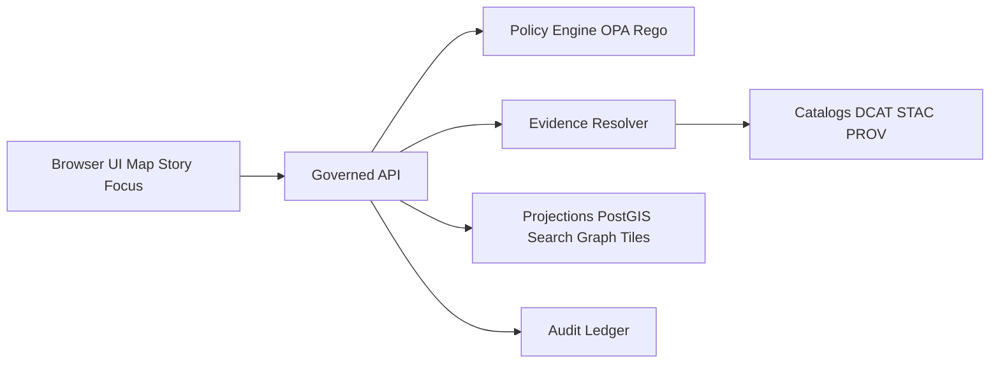

<!-- [KFM_META_BLOCK_V2]
doc_id: kfm://doc/0b6fcd8a-6d75-4b46-9d53-7e2e3f0d1cc4
title: UI Standards
type: standard
version: v1
status: draft
owners: TBD
created: 2026-03-04
updated: 2026-03-04
policy_label: public
related:
  - docs/governance/ROOT_GOVERNANCE.md
  - docs/governance/ETHICS.md
  - docs/specs/api/README.md
  - docs/specs/qa/README.md
tags: [kfm, ui, standards, evidence-first, trust-membrane]
notes:
  - "Defines UI requirements for Map Explorer, Story Mode, Focus Mode, and trust surfaces (evidence drawer, policy notices, automation badges)."
[/KFM_META_BLOCK_V2] -->

<div align="center">
  <h1>KFM UI Standards</h1>
  <p><strong>Evidence-first UX • Governed client • Policy-visible by default</strong></p>
</div>

> **Status:** draft  
> **Owners:** TBD  
> **Last updated:** 2026-03-04 (America/Chicago)  
> **Scope:** Browser UI for Map Explorer, Story Mode, Focus Mode, Catalog UI, and Steward/Admin surfaces.  
>
> **Badges (placeholders):**  
>   
>   
> 

**Quick links:**  
- [Scope](#scope) • [Where it fits](#where-it-fits) • [Inputs](#acceptable-inputs) • [Exclusions](#exclusions)  
- [Non-negotiables](#non-negotiables) • [Evidence UX](#evidence-ux) • [Policy and sensitivity](#policy-and-sensitivity)  
- [Implementation guidelines](#implementation-guidelines) • [Testing and CI gates](#testing-and-ci-gates) • [FAQ](#faq) • [Appendix](#appendix)

---

## Scope

This directory defines **standards for KFM user interfaces** so that:

- users can **inspect evidence** behind layers, story claims, and Focus Mode answers,
- the UI **cannot bypass governance** (policy, licensing, sensitivity),
- “trust surfaces” (versions, rights, provenance, automation health) are **first-class UI elements**.

### Definitions

- **EvidenceRef**: A reference token (not a pasted URL) that resolves via the API to an **EvidenceBundle**.
- **EvidenceBundle**: Inspectable evidence payload: catalogs + provenance + policy decision + permitted artifact links/digests.
- **dataset_version_id**: The stable identifier shown in UI that ties to DCAT/STAC/PROV catalogs.
- **policy_label**: A classification input to policy checks (e.g., public, restricted).
- **audit_ref**: A stable identifier emitted for governed operations (Focus Mode runs, story publishing) so stewards can review.

> NOTE: In KFM, “citations” are not raw URLs. They are resolvable references that must pass a hard gate; otherwise the UI must narrow scope or abstain. See [Evidence UX](#evidence-ux).:contentReference[oaicite:1]{index=1}

[Back to top](#kfm-ui-standards)

---

## Where it fits

Path: `docs/standards/ui/README.md`

Upstream (inputs/constraints):
- governance & policy docs (default-deny posture, obligations, licensing)  
- API contracts (datasets, STAC, evidence resolver, story, focus, lineage)

Downstream (consumers):
- `web/` applications (Map Explorer, Story Mode, Focus Mode UI)
- shared UI packages/components (EvidenceDrawer, policy badges, automation badges)

### Trust membrane and UI boundary



**CONFIRMED:** The UI/clients talk **only** to the governed API; policy enforcement and evidence resolution happen behind the API boundary.:contentReference[oaicite:2]{index=2}

[Back to top](#kfm-ui-standards)

---

## Acceptable inputs

**CONFIRMED:** UI should consume **only API responses** (policy-filtered, audited) and must not embed privileged credentials.:contentReference[oaicite:3]{index=3}

Allowed content in this directory (examples):
- UI architecture standards and checklists
- evidence UX requirements (drawer, citation hooks, export requirements)
- accessibility requirements (keyboard navigation, ARIA, non-color-only semantics)
- telemetry guidance for UI trust surfaces (without capturing sensitive content)

[Back to top](#kfm-ui-standards)

---

## Exclusions

**CONFIRMED:** Do **not** place any of the following here:

- backend/API implementation details (belongs in `docs/specs/api/` or service READMEs)
- secrets, tokens, credentials, privileged endpoints
- logic that “decides policy” (policy decisions are server-side; UI only displays badges/notices):contentReference[oaicite:4]{index=4}
- instructions enabling sensitive targeting (precise restricted locations, etc.)

[Back to top](#kfm-ui-standards)

---

## Directory tree

> PROPOSED layout (adapt to repo structure; do not assume paths exist yet).

```text
docs/standards/ui/
  README.md
  ACCESSIBILITY.md
  EVIDENCE_UX.md
  POLICY_NOTICES.md
  MAP_EXPLORER.md
  STORY_MODE.md
  FOCUS_MODE.md
  TELEMETRY.md
  CHECKLISTS.md
```

[Back to top](#kfm-ui-standards)

---

## Non-negotiables

This section is the **UI governance contract**. Each rule is tagged as:

- **CONFIRMED**: explicitly required by KFM design docs and must be implemented.
- **PROPOSED**: recommended pattern; implement unless a reviewed ADR says otherwise.
- **UNKNOWN**: not yet verified; includes a minimal step to confirm.

### Standards matrix

| Rule ID | Requirement | Label | Enforcement mechanism |
|---|---|---:|---|
| UI-001 | UI must not access DB/storage directly; all access via governed API | CONFIRMED | Network policy + code review + integration tests |
| UI-002 | Evidence-first UX: every layer/claim opens evidence (EvidenceDrawer) | CONFIRMED | E2E tests + UI acceptance criteria |
| UI-003 | Focus Mode: cite-or-abstain with hard citation verification + audit_ref | CONFIRMED | API contract + UI behavior tests |
| UI-004 | Story publishing: block publish if any citation fails to resolve | CONFIRMED | Publish preflight calls `/evidence/resolve` |
| UI-005 | Accessibility: evidence drawer + layer controls keyboard navigable | CONFIRMED | A11y test checklist + E2E keyboard tests |
| UI-006 | Policy notices must be explicit; do not leak restricted existence | CONFIRMED | Error model contract + UI copy rules |
| UI-007 | Client must never fetch untrusted attestations directly; server verifies | CONFIRMED | API design + security review |
| UI-008 | Story Nodes store reproducible map state (camera, layers, time window) | CONFIRMED | Story schema + replay tests |
| UI-009 | Automation badges show pipeline health/freshness on layers/features | CONFIRMED | UI component contract + telemetry |

#### UI-001 Trust membrane

- **CONFIRMED:** “Frontend … consumes only API responses (no direct DB/object-store access).”:contentReference[oaicite:5]{index=5}
- **CONFIRMED:** UI “never embeds privileged credentials.”:contentReference[oaicite:6]{index=6}

#### UI-002 Evidence drawer is required

- **CONFIRMED:** Baseline Map Explorer includes an evidence drawer that can be opened from feature click; it must show license/version and be keyboard navigable.:contentReference[oaicite:7]{index=7}

#### UI-003 Focus Mode cite-or-abstain UX

- **CONFIRMED:** Focus Mode is a governed run with a receipt; includes policy pre-check, evidence bundling, hard citation verification, and must abstain/reduce scope if citations fail.:contentReference[oaicite:8]{index=8}:contentReference[oaicite:9]{index=9}

#### UI-004 Story publish is gated by resolvable citations

- **CONFIRMED:** Publishing requires review state and resolvable citations; UI can enforce by calling the evidence resolver during publish checks.:contentReference[oaicite:10]{index=10}

#### UI-005 Accessibility minimums

- **CONFIRMED:** Keyboard navigation, ARIA labels, non-color-only semantics, safe markdown rendering for narratives (sanitization/CSP).:contentReference[oaicite:11]{index=11}

#### UI-006 Abstention and restriction must be understandable (policy-safe)

- **CONFIRMED:** Show “why” in policy-safe terms, suggest safe alternatives, provide audit_ref; never show ghost metadata that reveals restricted existence unless policy allows.:contentReference[oaicite:12]{index=12}

#### UI-007 Provenance links and attestations

- **CONFIRMED:** Server must verify Cosign/Sigstore attestations before exposing links; browser must never fetch untrusted attestations directly.:contentReference[oaicite:13]{index=13}

#### UI-008 Map state is a reproducible artifact

- **CONFIRMED:** Map state includes camera, active layers/style params, time window, filters; Story Nodes store map state to replay the same view; Focus Mode can accept view_state hints.:contentReference[oaicite:14]{index=14}

#### UI-009 Automation/health badges as trust surfaces

- **CONFIRMED:** Trust surfaces include automation status badges (healthy/degraded/failing), provenance/evidence drawer, data version label, policy notices, and “What changed?” diffs.:contentReference[oaicite:15]{index=15}

[Back to top](#kfm-ui-standards)

---

## Evidence UX

### Evidence is a first-class UI element

**CONFIRMED:** The UX must “make trust visible” — dataset versions, license/rights, and evidence are first-class UI elements (not hidden).:contentReference[oaicite:16]{index=16}

### Evidence drawer minimum contents

**CONFIRMED:** The EvidenceDrawer must show at minimum: bundle id + digest, dataset_version_id, license/rights holder, freshness + validation status, provenance chain, artifact links when allowed, redactions applied.:contentReference[oaicite:17]{index=17}

### Citation hooks and navigation

**CONFIRMED:** Publishing should be blocked if any citation fails to resolve; citations should open the evidence drawer.:contentReference[oaicite:18]{index=18}

**PROPOSED UI behavior:**
- Clicking an inline citation opens EvidenceDrawer focused on that EvidenceBundle.
- EvidenceDrawer supports deep links (e.g., `?evidence=<id>`), but **must not** leak restricted IDs.

### EvidenceRef → EvidenceBundle contract (UI expectations)

**CONFIRMED:** An EvidenceRef resolves (via evidence resolver) into an EvidenceBundle containing metadata, artifacts, provenance required to inspect/reproduce a claim. Citation resolution is a hard gate; otherwise the system narrows scope or abstains.:contentReference[oaicite:19]{index=19}

**PROPOSED minimal response shape (illustrative):**
```json
{
  "evidence_ref": "evref:kfm:stac:item:123",
  "bundle": {
    "bundle_id": "evb_01H...",
    "digest": "sha256:...",
    "dataset_version_id": "dv_2026_02_15_001",
    "license": {
      "id": "CC-BY-4.0",
      "attribution": "Publisher name, year"
    },
    "policy": {
      "decision": "allow",
      "obligations": ["attribution", "redaction_notice"]
    },
    "provenance": {
      "run_receipt_ref": "run_...",
      "generated_at": "2026-02-15T02:14:33Z"
    },
    "artifacts": [
      { "href": "oci://...", "digest": "sha256:...", "mediaType": "application/vnd.pmtiles" }
    ]
  }
}
```

[Back to top](#kfm-ui-standards)

---

## Policy and sensitivity

### Policy notices must be explicit

**CONFIRMED:** The UI must show explicit policy notices at the time of interaction (“geometry generalized due to policy”).:contentReference[oaicite:20]{index=20}

### Sensitive location generalization pattern

**CONFIRMED (pattern example):** UI can provide a visual hint for generalized points (ring sized by `uncertainty_radius_m`), and tooltips should show access level, license, and rationale.:contentReference[oaicite:21]{index=21}

### Error and restriction handling

**CONFIRMED:** Do not leak restricted existence through error differences; errors should be policy-safe and stable.:contentReference[oaicite:22]{index=22}

**PROPOSED UI error model:**
- Show `message` (policy-safe)
- Show `audit_ref`
- Offer remediation hints (“Try a broader time range” / “Try public datasets”)

[Back to top](#kfm-ui-standards)

---

## Implementation guidelines

### Core UI surfaces

**CONFIRMED:** Recommended top-level navigation includes Map Explorer, Timeline (optional), Stories, Catalog, Focus Mode, Admin/Steward (restricted).:contentReference[oaicite:23]{index=23}

**CONFIRMED:** Core components (buildable) include:
- Map Explorer: MapCanvas, LayerPanel, TimeControl, FeatureInspectPanel, EvidenceDrawer
- Story Mode: StoryNodeReader with citation hooks, EvidenceDrawer
- Focus Mode: ChatPanel, EvidenceSnippets, PolicyNotice, ExportAnswer
- Admin/Steward: PromotionQueue, QAReportViewer, StoryReviewQueue:contentReference[oaicite:24]{index=24}

### Mapping stacks

**CONFIRMED:** KFM frontend uses React with MapLibre (2D) and Cesium (3D) integrations; provenance verification and policy decisions stay behind the API gateway.:contentReference[oaicite:25]{index=25}:contentReference[oaicite:26]{index=26}

### Automation badges and provenance links

**CONFIRMED:** Define a small stable JSON schema for badge events; provide streaming + polling endpoints; validate schema in CI; emit OTel events/metrics for badge rendering/status changes.:contentReference[oaicite:27]{index=27}:contentReference[oaicite:28]{index=28}

### Quickstart

```bash
# PSEUDOCODE — adjust to your repo/package manager (pnpm/npm/yarn)
# Goal: run UI locally against a dev API that supports evidence resolution.

cd web
<package_manager> install
<package_manager> run dev
```

**UNKNOWN:** Exact workspace commands and app entrypoints are repo-specific.  
Minimal verification step: capture `tree -L 3 web/` and confirm how Map/Story/Focus apps are launched.:contentReference[oaicite:29]{index=29}

[Back to top](#kfm-ui-standards)

---

## Testing and CI gates

### Minimum UI verification checklist

**CONFIRMED:** Map Explorer UI acceptance requires evidence drawer showing license/version and keyboard navigation works.:contentReference[oaicite:30]{index=30}

**CONFIRMED:** Focus Mode must pass cite-or-abstain golden queries; regressions block merge (evaluation harness).:contentReference[oaicite:31]{index=31}

### Recommended test stack

- **Unit:** component tests + schema validation (AJV) for UI DTOs (evidence bundle, automation badge).:contentReference[oaicite:32]{index=32}
- **E2E:** Playwright flows:
  - open layer → open EvidenceDrawer → verify license/version visible
  - tab/keyboard navigate layer controls and drawer
  - publish Story Node with citations: fail if any cannot resolve
  - Focus Mode answer: verify citations or abstain + audit_ref
- **Security:** ensure no privileged tokens shipped; markdown sanitization; CSP where applicable.:contentReference[oaicite:33]{index=33}

### PR gate checklist (Definition of Done)

- [ ] **CONFIRMED:** No direct DB/object-store access; API-only (trust membrane):contentReference[oaicite:34]{index=34}
- [ ] **CONFIRMED:** EvidenceDrawer accessible from every layer/claim; shows required fields:contentReference[oaicite:35]{index=35}
- [ ] **CONFIRMED:** Focus Mode UI supports cite-or-abstain and displays audit_ref:contentReference[oaicite:36]{index=36}
- [ ] **CONFIRMED:** Story publish blocks on unresolved citations:contentReference[oaicite:37]{index=37}
- [ ] **CONFIRMED:** Keyboard navigation + ARIA labels + no color-only meaning:contentReference[oaicite:38]{index=38}
- [ ] **CONFIRMED:** No restricted leakage via errors or “ghost metadata”:contentReference[oaicite:39]{index=39}
- [ ] **PROPOSED:** Telemetry emitted for EvidenceDrawer opens and badge status changes (policy-safe)

[Back to top](#kfm-ui-standards)

---

## FAQ

### Why is “abstain” a UI feature?

**CONFIRMED:** Abstention is the primary anti-hallucination mechanism when citations can’t be verified or policy disallows evidence. The UI must make this understandable without leaking restricted info.:contentReference[oaicite:40]{index=40}:contentReference[oaicite:41]{index=41}

### Why can’t the UI decide policy?

**CONFIRMED:** UI may show badges/notices, but must not implement policy decisions. Policy semantics must be consistent across CI and runtime; UI is a governed client, not an enforcement engine.:contentReference[oaicite:42]{index=42}

[Back to top](#kfm-ui-standards)

---

## Appendix

<details>
<summary><strong>Appendix A — Minimal API endpoints the UI expects</strong></summary>

**CONFIRMED:** Documented v1 endpoints include datasets, STAC, evidence resolve, story, focus, lineage, and (optionally) tiles/PMTiles surfaces.:contentReference[oaicite:43]{index=43}

```text
GET  /api/v1/datasets
GET  /api/v1/stac/collections
GET  /api/v1/stac/items
POST /api/v1/evidence/resolve
GET  /api/v1/story
POST /api/v1/story
POST /api/v1/focus/ask
GET  /api/v1/lineage/status
GET  /api/v1/lineage/stream
```

</details>

<details>
<summary><strong>Appendix B — Focus Mode UI: required response states</strong></summary>

**CONFIRMED:** Focus Mode is a governed run producing citations or abstain + audit_ref.:contentReference[oaicite:44]{index=44}

**UI must support:**
- **Answer with citations** (clickable into EvidenceDrawer)
- **Abstain** with policy-safe explanation and audit_ref
- **Reduce scope** suggestion (public datasets, broader time window)

</details>

---

### References

- Governance posture and UI contract are defined by the trust membrane + evidence-first UX + cite-or-abstain requirements in KFM design docs. (See Notes & Citations in the PR description when you add/modify this standard.)
